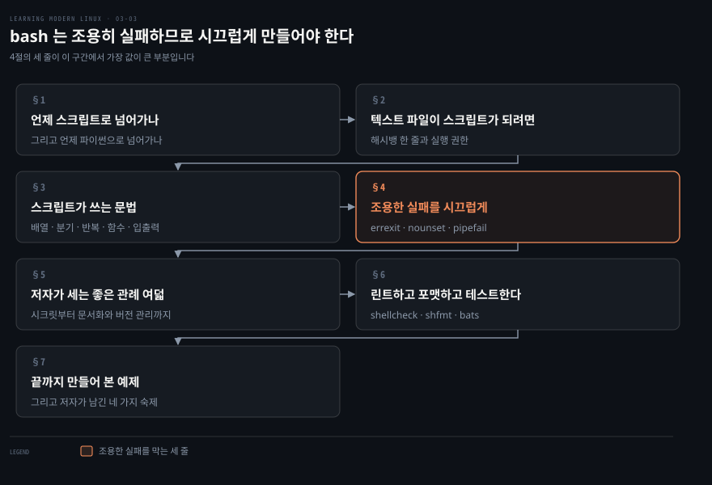
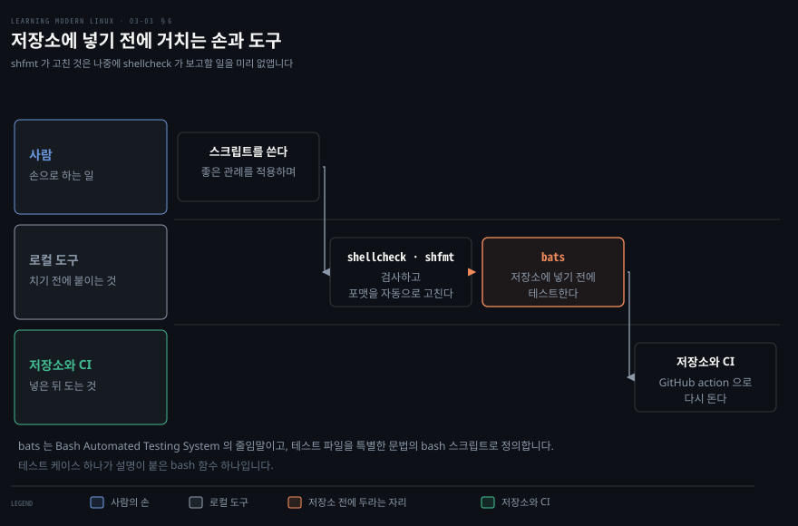
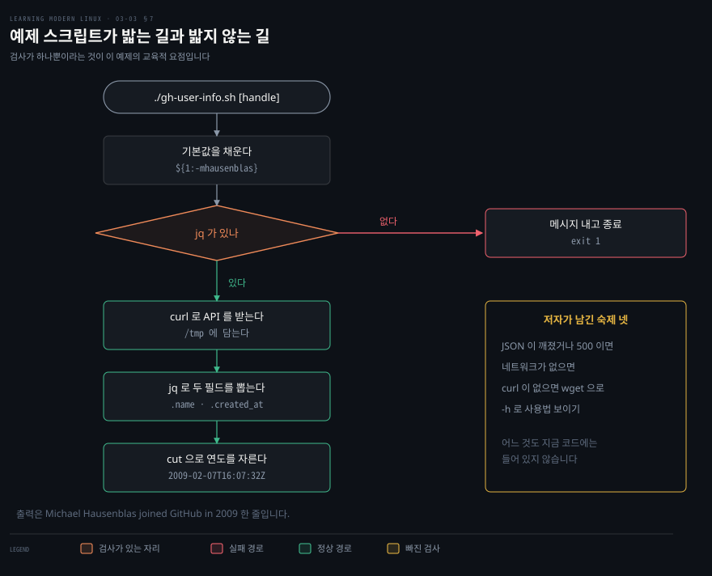

# bash 는 조용히 실패하므로 시끄럽게 만들어야 한다

---

> 스크립트는 편합니다. 다만 조심하지 않고 쓰면 위험할 수도 있다고 저자는 미리 못 박습니다.

## 핵심 요약

> 이 구간 전체가 매달린 하나의 생각은 **bash 가 기본적으로 조용히 실패하는 쪽이라, 스크립트를 쓰는 일의 절반이 그 침묵을 깨는 장치를 다는 일**이라는 것입니다.

저자가 좋은 관례의 첫 항목으로 든 것이 그대로 이 문장입니다. 조용한 실패를 피하고 빨리 실패하라는 것이고, `errexit` 과 `pipefail` 같은 것이 그 일을 대신해 준다는 것입니다.

그래서 이 구간의 뼈대는 단순합니다. 먼저 텍스트 파일을 스크립트로 만드는 두 조건이 있습니다. 그다음이 셸 문법의 나머지 절반인 배열과 흐름 제어와 함수입니다. 그 위에 실패를 드러내는 세 줄짜리 스켈레톤이 놓이고, 마지막이 린트와 테스트입니다.

저자는 마지막에 예제를 하나 끝까지 만들어 보이고, 그 예제가 아직 처리하지 못하는 것 넷을 스스로 남깁니다. 그 목록이 이 구간에서 가장 정직한 대목입니다. 잘 도는 것처럼 보이는 스크립트에도 늘 고칠 것이 있다는 이야기를 예제로 증명한 셈입니다.


## 학습 목표

> 이 구간을 읽고 나면 아래 다섯 가지를 스스로 해낼 수 있습니다.

1. 언제 스크립트로 넘어가고 언제 다른 언어로 넘어가야 하는지 기준을 댈 수 있습니다.
2. 텍스트 파일을 실행 가능한 스크립트로 만드는 두 조건을 말할 수 있습니다.
3. `errexit`·`nounset`·`pipefail` 이 각각 어떤 조용한 실패를 막는지 설명할 수 있습니다.
4. 저자가 세는 좋은 관례를 근거와 함께 옮길 수 있습니다.
5. 스크립트를 저장소에 넣기까지 거치는 도구들을 순서대로 댈 수 있습니다.

아래는 이 문서 전체를 읽는 순서로 이은 지도입니다. 칸마다 절 번호와 그 절이 답하는 물음 하나를 적었습니다. 색이 붙은 칸이 이 구간에서 값이 가장 큰 세 줄입니다.




## 이 문서가 다루지 않는 것

> 3장을 셋으로 나눈 마지막 구간입니다. 앞 둘은 대화형 사용을 다뤘고 여기는 자동화를 다룹니다.

- 스트림·변수·종료 상태 같은 셸의 기본기 → [셸의 실체는 스트림과 변수와 종료 상태다](./03-01.%EC%85%B8%EC%9D%98%20%EC%8B%A4%EC%B2%B4%EB%8A%94%20%EC%8A%A4%ED%8A%B8%EB%A6%BC%EA%B3%BC%20%EB%B3%80%EC%88%98%EC%99%80%20%EC%A2%85%EB%A3%8C%20%EC%83%81%ED%83%9C%EB%8B%A4.md)
- 별칭·모던 셸·터미널 멀티플렉서 → [자주 치는 것일수록 짧아야 한다](./03-02.%EC%9E%90%EC%A3%BC%20%EC%B9%98%EB%8A%94%20%EA%B2%83%EC%9D%BC%EC%88%98%EB%A1%9D%20%EC%A7%A7%EC%95%84%EC%95%BC%20%ED%95%9C%EB%8B%A4.md)
- `chmod 750` 이 왜 `chmod +x` 보다 나은가 → 원서 4장, 그리고 [전부 아니면 전무에서 잘게 쪼개는 쪽으로](./04-01.%EC%A0%84%EB%B6%80%20%EC%95%84%EB%8B%88%EB%A9%B4%20%EC%A0%84%EB%AC%B4%EC%97%90%EC%84%9C%20%EC%9E%98%EA%B2%8C%20%EC%AA%BC%EA%B0%9C%EB%8A%94%20%EC%AA%BD%EC%9C%BC%EB%A1%9C.md)
- 시그널과 트랩 같은 더 고급 구성 → 저자가 개요만 준다고 밝히고 bash Scripting Cheatsheet 로 넘깁니다

저자가 스크립트 문법 전체를 가르치지 않겠다고 명시한 자리가 여럿입니다. 이 노트도 그 범위를 넓히지 않습니다.


## 1. 언제 스크립트로 넘어가는가

> 프롬프트에서 같은 일을 몇 번이고 손으로 되풀이했다면, 그 일을 자동화할 때가 됐다는 신호입니다.

저자가 bash 로 스크립트를 쓰기로 하는 이유는 둘입니다. 바깥에 있는 스크립트 대부분이 bash 로 쓰여 있어 예제와 도움을 찾기 쉽다는 것이 첫째입니다. 대상 시스템에 bash 가 있을 가능성이 높아, bash 보다 강력하지만 낯설거나 널리 쓰이지 않는 대안을 쓸 때보다 잠재 사용자 기반이 커진다는 것이 둘째입니다.

동시에 경계도 그어 둡니다. 세상에는 수천 줄짜리 셸 스크립트가 있지만 그것을 목표로 삼으라고 권하는 것은 아니며, 오히려 반대라는 것입니다. 긴 스크립트를 쓰고 있다면 파이썬이나 루비 같은 제대로 된 스크립팅 언어가 더 나은 선택이 아닌지 자문하라고 적습니다.

스크립트의 위험도 미리 짚습니다. 스크립트는 정말 편리하지만 예방책 없이 쓰면 위험할 수도 있으니, 스크립트를 쓸 생각이 들 때마다 자동화를 다룬 XKCD 만화를 떠올리라는 것입니다. 스크립트가 많은 설정 시스템과 설치 시스템의 바탕이기도 하다는 점도 덧붙입니다.


## 2. 텍스트 파일이 스크립트가 되려면

> 명령을 파일에 적어 두었는데 실행되지 않는 일이 첫 관문입니다. 스크립트는 그저 텍스트 파일이고 확장자는 상관없으므로, 파일을 스크립트로 만드는 것은 확장자가 아닙니다.

무엇이 그 일을 하는지 두 가지로 정해져 있습니다.

1. 첫 줄에 인터프리터를 선언합니다. 이것을 셔뱅 또는 해시뱅이라 부르고 `#!` 로 씁니다.
2. 실행 가능하게 만듭니다. `chmod +x` 를 쓰면 모두가 실행할 수 있게 되고, `chmod 750` 을 쓰면 스크립트에 연결된 사용자와 그룹만 실행할 수 있어 최소 권한 원칙에 더 가깝습니다.

저자는 두 번째 항목에서 곧바로 4장을 예고합니다. `chmod +x` 가 의도한 것 말고 다른 사용자에게까지 권한을 얹는다는 이야기가 그 장의 좋은 관례 절에 다시 나옵니다.


## 3. 스크립트가 쓰는 문법

> 대화형으로 셸을 써 왔다면 관련 용어와 기법을 이미 대부분 알고 있다고 저자는 말합니다. 스크립트 문맥에서 몇 가지만 더 익히면 됩니다.

셸은 보통 모든 것을 문자열로 다룹니다. 저자는 여기에 단서를 붙입니다. 좀 더 복잡한 수치 계산이 필요하면 셸 스크립트를 쓰지 않는 편이 좋다는 것입니다. 그래도 배열 같은 고급 자료형은 지원합니다.

```bash
os=('Linux' 'macOS' 'Windows')
echo "${os[0]}"
numberofos="${#os[@]}"
```

원소 셋짜리 배열을 정의합니다. 첫 원소를 꺼내 `Linux` 를 찍고, 길이를 얻어 `numberofos` 가 3이 되게 합니다.

### 분기와 반복

흐름 제어는 조건에 따라 갈라지거나(`if`) 되풀이하게(`for` 와 `while`) 해 줍니다.

```bash
for afile in /tmp/* ; do
   echo "$afile"
done

for i in {1..10}; do
    echo "$i"
done

while true; do
   sleep 1
done
```

첫째는 디렉토리를 훑으며 파일 이름을 찍는 기본 반복입니다. 둘째는 범위 반복입니다. 셋째는 무한 반복이고 Ctrl+C 로 빠져나옵니다. 무한 반복의 몸통을 원서는 `...` 으로 비워 두는데, 위 블록에는 그대로 실행해 볼 수 있도록 `sleep 1` 을 채워 넣었습니다.

### 함수와 입출력

함수는 스크립트를 더 모듈화하고 재사용할 수 있게 해 줍니다. 셸이 스크립트를 위에서 아래로 해석하므로 쓰기 전에 정의해야 합니다.

```bash
sayhi() {
      echo "Hi $1 hope you are well!"
}

sayhi "Michael"
```

매개변수는 `$n` 으로 암묵적으로 전달됩니다. 위 호출의 출력은 `Hi Michael hope you are well!` 입니다.

`read` 로는 `stdin` 에서 사용자 입력을 받아 실행 중에 값을 얻을 수 있습니다. 선택지 메뉴 같은 것이 그 예입니다. 그리고 `echo` 대신 `printf` 를 고려하라고 권합니다. 색을 포함해 출력을 세밀하게 통제할 수 있고 `echo` 보다 이식성도 좋기 때문입니다.

```bash
read name
printf "Hello %s" "$name"
```


## 4. 조용한 실패를 시끄럽게

> 이식성 있다는 말은 스크립트가 실행될 환경에 대해 너무 많은 가정을 하지 않는다는 뜻입니다. 그 가정을 줄이는 출발점이 저자의 스켈레톤 템플릿입니다.


저자가 씨앗으로 쓰라고 내미는 템플릿은 이렇습니다.

```bash
#!/usr/bin/env bash
set -o errexit
set -o nounset
set -o pipefail

firstargument="${1:-somedefaultvalue}"

echo "$firstargument"
```

해시뱅은 프로그램 로더에게 이 스크립트를 bash 로 해석하라고 지시합니다. 그다음 세 줄이 이 절의 핵심이고, 마지막은 기본값을 가진 명령행 매개변수의 예입니다.

- `errexit` 은 오류가 나면 스크립트 실행을 멈추라는 뜻입니다.
- `nounset` 은 설정되지 않은 변수를 오류로 취급하라는 뜻이고, 그래서 스크립트가 조용히 실패할 가능성이 줄어듭니다.
- `pipefail` 은 파이프의 한 부분이 실패하면 파이프 전체를 실패로 보라는 뜻이고, 이것도 조용한 실패를 피하는 데 도움이 됩니다.

조용한 실패가 어디까지 갈 수 있는지는 뒤의 좋은 관례 절이 보입니다. 변수가 설정되지 않은 탓에 순진해 보이는 `rm -rf "$PROJECTHOME/"*` 가 드라이브를 통째로 지우는 상황입니다. 변수가 비면 그 패턴이 `/*` 로 펼쳐지기 때문입니다.

다만 저자는 그 예를 `nounset` 이 아니라 "입력 위생" 항목에 답니다. 변수에 온당한 기본값을 주고 받은 입력을 정제하라는 맥락입니다. `nounset` 이 켜져 있어도 같은 사고를 막는다는 것은 노트의 읽기입니다. 설정되지 않은 변수를 펼치는 순간 오류가 나므로 `rm` 까지 가지 않습니다.

한 가지 전제를 잊지 않는 편이 좋습니다. 셸 종류를 bash 로 못 박아도 셸 버전이 다르면 모든 기능이 같게 동작하지는 않습니다. 결국 스크립트를 시험해 볼 수 있는 서로 다른 환경의 수로 귀결된다고 저자는 적습니다.


## 5. 저자가 세는 좋은 관례 여덟

> 저자는 모범 사례라 하지 않고 좋은 관례라 부릅니다. 무엇을 해야 하는지가 상황과 목표에 달렸기 때문입니다.

혼자 쓰려고 쓴 스크립트와 수천 명에게 배포할 스크립트는 다릅니다. 그 전제 위에서 저자가 세는 것은 여덟입니다.

| 관례 | 무엇을 하라는 것인가 |
|---|---|
| 빨리 시끄럽게 실패하기 | 조용한 실패를 피하고 빨리 실패합니다. `errexit` 과 `pipefail` 이 그 일을 대신합니다 |
| 민감한 정보 | 비밀번호 같은 것을 스크립트에 하드코딩하지 않습니다. 실행 시점에 사용자 입력이나 API 호출로 받습니다. `ps` 가 프로그램 매개변수를 드러낸다는 것도 유출 경로입니다 |
| 입력 검증 | 가능한 곳에 분별 있는 기본값을 주고 사용자나 다른 출처에서 받은 입력을 검증합니다 |
| 의존성 확인 | 내장이거나 대상 환경을 아는 경우가 아니면 어떤 도구가 있다고 가정하지 않습니다. 가능하면 대체 수단을 줍니다. `curl` 이 없으면 `wget` 을 쓰는 식입니다 |
| 오류 처리 | 실패할 때 사용자가 실제로 할 수 있는 지시를 줍니다. `Error 123` 대신 무엇이 실패했고 어떻게 고치는지 적습니다 |
| 문서화 | 주요 블록에 인라인 주석을 달고 가독성과 diff 를 위해 80칸 폭을 지키려 합니다 |
| 버전 관리 | 스크립트를 Git 으로 버전 관리하는 것을 고려합니다 |
| 테스트 | 린트하고 테스트합니다. 중요해서 다음 절에서 따로 다룹니다 |

저자가 오류 메시지의 예로 든 문장이 인상적입니다. `Tried to write to /project/xyz/ but seems this is read-only for me` 처럼 적으라는 것입니다. 실패했다는 사실이 아니라 무엇을 하려다 어디서 막혔는지를 담고 있습니다.

저자가 실패를 말할 때 쓰는 표현도 그대로 옮길 만합니다. 스크립트가 실패하는 것은 여부의 문제가 아니라 언제 어디서의 문제라는 것입니다.


## 6. 린트하고 포맷하고 테스트한다

> 개발하는 동안 스크립트를 검사하고 린트해서 명령과 지시를 올바로 쓰고 있는지 확인하고 싶어집니다. 그 일을 하는 도구가 정해져 있습니다.



린트는 ShellCheck 로 합니다. 내려받아 로컬에 설치해도 되고 `shellcheck.net` 의 온라인 버전을 써도 됩니다. 여기에 `shfmt` 로 스크립트를 포맷하는 것도 고려하라고 권합니다. `shfmt` 는 나중에 `shellcheck` 가 보고할 만한 문제를 자동으로 고쳐 줍니다.

그리고 저장소에 넣기 전에 `bats` 로 테스트하는 것을 고려하라고 적습니다. `bats` 는 Bash Automated Testing System 의 줄임말입니다. 테스트 파일을 테스트 케이스용 특별한 문법을 가진 bash 스크립트로 정의하게 해 주며, 테스트 케이스 하나는 설명이 붙은 bash 함수 하나일 뿐입니다. 보통 이 스크립트들을 CI 파이프라인의 일부로, 예컨대 GitHub action 으로 실행합니다.

도식의 색이 붙은 칸이 저자가 순서를 못 박은 자리입니다. 테스트는 저장소에 넣기 **전에** 둡니다.


## 7. 끝까지 만들어 본 예제

> 저자가 절 앞머리에서 명세한 일은 한 줄입니다. GitHub 핸들을 받아 그 사용자가 언제 가입했는지를 이름과 함께 한 문장으로 출력하는 것입니다.



목표 출력은 `XXXX XXXXX joined GitHub in YYYY` 형태입니다. 좋은 관례를 반영한 구현이 아래와 같습니다.

```bash
#!/usr/bin/env bash

set -o errexit
set -o errtrace
set -o nounset
set -o pipefail

### Command line parameter:
targetuser="${1:-mhausenblas}"

### Check if our dependencies are met:
if ! [ -x "$(command -v jq)" ]
then
     echo "jq is not installed" >&2
     exit 1
fi

### Main:
githubapi="https://api.github.com/users/"
tmpuserdump="/tmp/ghuserdump_$targetuser.json"

result=$(curl -s $githubapi$targetuser)
echo $result > $tmpuserdump

name=$(jq .name $tmpuserdump -r)
created_at=$(jq .created_at $tmpuserdump -r)

joinyear=$(echo $created_at | cut -f1 -d"-")
echo $name joined GitHub in $joinyear
```

읽는 순서대로 짚으면 이렇습니다. 사용자가 값을 주지 않았을 때 쓸 기본값을 둡니다. `curl` 로 GitHub API 에 접근해 사용자 정보를 JSON 으로 내려받아 임시 파일에 저장합니다. `jq` 로 필요한 필드를 꺼내는데, `created_at` 의 값은 `"2009-02-07T16:07:32Z"` 같은 모양입니다. `cut` 으로 그 필드에서 연도를 뽑고, 메시지를 조립해 화면에 찍습니다.

```bash
./gh-user-info.sh
```

```bash
Michael Hausenblas joined GitHub in 2009
```

의존성 검사가 `command -v` 를 쓴다는 점이 앞 노트와 이어집니다. 감수자가 `which` 대신 권한 것이 바로 이 형태였습니다.

### 저자가 스스로 남긴 숙제 넷

이 예제가 좋아 보이고 대부분의 경우 잘 돌지만 늘 개선할 것이 있다며 저자가 네 가지를 남깁니다.

1. GitHub API 가 돌려준 JSON 이 유효하지 않으면 어떻게 할지, 500 오류를 만나면 어떻게 할지입니다. 사용자가 스스로 할 수 있는 일이 없다면 나중에 다시 시도하라는 메시지가 더 쓸모 있을 수 있습니다.
2. 이 스크립트가 동작하려면 네트워크 접근이 필요하고 없으면 `curl` 호출이 실패합니다. 그 사실을 알리고 네트워크를 확인할 방법을 제안하는 것이 한 방법입니다.
3. 의존성 검사를 개선할 수 있습니다. 여기서는 `curl` 이 설치되어 있다고 암묵적으로 가정하고 있으니, 바이너리를 변수로 두고 `wget` 으로 넘어가는 검사를 더할 수 있는지 생각해 보라고 합니다.
4. 사용법 안내를 더할 수 있습니다. `-h` 나 `--help` 로 부르면 구체적인 사용 예와 실행에 영향을 주는 옵션을 보이는 것입니다. 기본값도 함께 밝히면 더 좋습니다.

모듈성을 높이려면 bashing·rerun·rr 같은 프레임워크를 고려해 보라는 말로 절을 닫습니다.


## 심화 학습

> 이 구간은 원서가 도구 이름을 여럿 대지만 버전에 걸리는 서술이 적습니다. 대신 앞 노트에서 확인한 것과 이어지는 자리를 표시합니다.

- **의존성 검사에 `command -v` 를 쓴 것은 우연이 아닙니다.** 앞 노트 4절에서 감수자가 `which` 대신 권한 형태가 그대로 예제에 들어와 있습니다. 좋은 관례의 "의존성 확인" 항목이 코드로 착지한 자리입니다.
- **`chmod +x` 와 `chmod 750` 의 차이는 다음 장이 채웁니다.** 2절에서 저자가 최소 권한을 언급하고 4장을 예고했고, 4장의 좋은 관례에서 기호 모드보다 숫자 모드가 더 엄격하다는 이유로 다시 나옵니다.
- **저자가 입력 위생 항목에 단 사고 예는 `nounset` 으로도 막힙니다.** 변수가 비면 `"$PROJECTHOME/"*` 가 `/*` 로 펼쳐져 `rm -rf` 의 대상이 루트가 됩니다. 저자는 이 예를 기본값과 입력 정제의 근거로 들지만, 설정되지 않은 변수를 오류로 보는 `nounset` 이 켜져 있으면 펼치기 전에 멈춥니다. 두 관례가 같은 사고를 다른 층에서 막는 셈입니다.
- **원서의 최종 예제에는 설명 없는 옵션이 하나 더 있습니다.** 골격 템플릿은 `errexit`·`nounset`·`pipefail` 셋인데 `gh-user-info.sh` 는 `errtrace` 를 더해 넷을 켭니다. 저자는 이 넷째를 어디에서도 설명하지 않습니다. bash 매뉴얼을 펴 보면 `set -E` 와 같은 것으로, ERR 트랩을 셸 함수와 명령 치환과 서브셸이 물려받게 합니다.[^errtrace] 기본값에서는 그런 곳에서 트랩이 상속되지 않으니, 함수 안에서 난 오류를 바깥의 트랩이 잡게 하려면 필요한 옵션입니다.
- **저자가 남긴 숙제 넷은 그대로 연습 문제입니다.** 넷 가운데 셋이 외부 의존(네트워크·API 응답·설치된 도구)을 다루고 하나가 사용성입니다. 스크립트를 남에게 줄 때 무엇을 더해야 하는지의 목록이기도 합니다.


## 결정 치트시트

> 이 구간이 판단으로 이어지는 자리를 모았습니다. 근거는 본문입니다.

| 상황 | 선택 | 이유 |
|---|---|---|
| 같은 일을 손으로 여러 번 되풀이했다 | 스크립트로 옮긴다 | 저자가 자동화의 신호로 든 것 |
| 스크립트가 수백 줄로 자라고 있다 | 파이썬이나 루비를 고려한다 | 저자가 직접 자문하라고 한 자리 |
| 수치 계산이 복잡하다 | 셸을 쓰지 않는다 | 셸은 대개 모든 것을 문자열로 다룸 |
| 새 스크립트를 시작한다 | 스켈레톤 템플릿의 세 줄부터 | bash 는 기본이 조용한 실패 |
| 스크립트를 남에게 준다 | `chmod 750` | `chmod +x` 는 모두에게 실행을 연다 |
| 출력에 색을 넣거나 이식성이 필요하다 | `echo` 대신 `printf` | 세밀한 통제와 더 나은 이식성 |
| 저장소에 넣기 직전이다 | `bats` 로 테스트 | 저자가 순서를 못 박은 자리 |
| 도구가 있는지 확인해야 한다 | `command -v` | POSIX 가 아닌 `which` 대신 |


## 적용 관점

> 이 구간이 실무로 착지하는 자리는 CI 스크립트입니다. 파이프라인에서 도는 셸 스크립트가 조용히 실패하면 빌드는 초록불인데 산출물이 비어 있게 됩니다.

**한 가지 실행**: 지금 저장소에 있는 셸 스크립트를 하나 골라 첫머리에 세 줄을 넣고 돌려 봅니다. 그때까지 통과하던 스크립트가 어디서 멈추는지가 그동안 묻혀 있던 실패입니다.

```bash
set -o errexit
set -o nounset
set -o pipefail
```

Spring 애플리케이션을 CI 로 빌드해 본 사람에게 이 구간은 파이프라인 스크립트의 이야기입니다. `./gradlew build | tee build.log` 처럼 파이프를 쓰면 `pipefail` 없이는 `gradlew` 가 실패해도 파이프 전체의 종료 상태가 `tee` 의 것이 되어 0 으로 나옵니다. 컨테이너 이미지의 엔트리포인트 스크립트도 같은 이야기입니다. 앞 노트에서 본 종료 상태가 곧 컨테이너의 종료 코드가 되므로, 조용히 실패하는 스크립트는 죽지 않고 살아 있는 잘못된 파드가 됩니다.


## 면접에서 받을 만한 질문

> 자답한 뒤 아래 정답과 맞춰 봅니다.

1. 텍스트 파일을 실행 가능한 스크립트로 만드는 두 조건은 무엇입니까.
2. `set -o errexit`·`nounset`·`pipefail` 은 각각 무엇을 막습니까.
3. `nounset` 을 켜지 않았을 때 생길 수 있는 구체적인 사고를 하나 들어 보십시오.
4. 스크립트에서 의존성을 확인하는 좋은 방법과 그 이유를 말해 보십시오.
5. `chmod +x` 대신 `chmod 750` 을 권하는 이유는 무엇입니까.
6. 스크립트를 저장소에 넣기 전에 무엇을 하라고 저자는 권합니까.


## 정답 (자답 후 펼치기)

### 정답 1 — 스크립트가 되는 두 조건

첫 줄에 셔뱅으로 인터프리터를 선언하는 것과, `chmod` 로 실행 권한을 주는 것입니다. 확장자는 상관없고 `.sh` 는 관례일 뿐입니다.

### 정답 2 — 세 옵션

`errexit` 은 오류가 나면 실행을 멈춥니다. `nounset` 은 설정되지 않은 변수를 오류로 취급합니다. `pipefail` 은 파이프의 한 부분이 실패하면 파이프 전체를 실패로 봅니다. 셋 다 조용한 실패를 줄이려는 장치입니다.

### 정답 3 — nounset 이 막는 사고

변수가 설정되지 않으면 `rm -rf "$PROJECTHOME/"*` 가 `rm -rf /*` 로 펼쳐져 드라이브를 지웁니다. `nounset` 이 켜져 있으면 펼치기 전에 오류로 멈춥니다.

### 정답 4 — 의존성 확인

`command -v` 로 확인합니다. `which` 는 POSIX 가 아닌 외부 프로그램이라 대상 시스템에 없을 수 있습니다. 저자의 예제도 `if ! [ -x "$(command -v jq)" ]` 형태로 씁니다. 가능하면 대체 수단을 함께 둡니다.

### 정답 5 — 750 을 권하는 이유

`chmod +x` 는 모두에게 실행 권한을 줍니다. `chmod 750` 은 스크립트에 연결된 사용자와 그룹만 실행하게 하므로 최소 권한 원칙에 더 가깝습니다.

### 정답 6 — 저장소에 넣기 전에

`shellcheck` 로 린트하고 `shfmt` 로 포맷한 뒤 `bats` 로 테스트합니다. 그 테스트는 이후 CI 파이프라인에서 GitHub action 같은 형태로 다시 돌립니다.


## 핵심 개념 체크리스트

- [ ] 셔뱅이 무엇을 지시하는지 말할 수 있는가?
- [ ] 세 옵션을 켜지 않았을 때 각각 무엇이 묻히는지 설명할 수 있는가?
- [ ] 좋은 관례 여덟 가운데 다섯 이상을 근거와 함께 댈 수 있는가?
- [ ] 예제 스크립트가 검사하는 것 하나와 검사하지 않는 것 넷을 구분할 수 있는가?
- [ ] `shellcheck`·`shfmt`·`bats` 의 역할을 각각 한 줄로 말할 수 있는가?
- [ ] 언제 셸을 떠나 다른 언어로 가야 하는지 기준을 댈 수 있는가?


## 관련 문서

- [Learning Modern Linux 정독 인덱스](./README.md) — 이 책의 장별 진행 상황
- [셸의 실체는 스트림과 변수와 종료 상태다](./03-01.%EC%85%B8%EC%9D%98%20%EC%8B%A4%EC%B2%B4%EB%8A%94%20%EC%8A%A4%ED%8A%B8%EB%A6%BC%EA%B3%BC%20%EB%B3%80%EC%88%98%EC%99%80%20%EC%A2%85%EB%A3%8C%20%EC%83%81%ED%83%9C%EB%8B%A4.md) — 종료 상태와 `$PIPESTATUS` 의 근거
- [자주 치는 것일수록 짧아야 한다](./03-02.%EC%9E%90%EC%A3%BC%20%EC%B9%98%EB%8A%94%20%EA%B2%83%EC%9D%BC%EC%88%98%EB%A1%9D%20%EC%A7%A7%EC%95%84%EC%95%BC%20%ED%95%9C%EB%8B%A4.md) — 같은 장의 도구 구간
- [전부 아니면 전무에서 잘게 쪼개는 쪽으로](./04-01.%EC%A0%84%EB%B6%80%20%EC%95%84%EB%8B%88%EB%A9%B4%20%EC%A0%84%EB%AC%B4%EC%97%90%EC%84%9C%20%EC%9E%98%EA%B2%8C%20%EC%AA%BC%EA%B0%9C%EB%8A%94%20%EC%AA%BD%EC%9C%BC%EB%A1%9C.md) — `chmod 750` 이 왜 나은지의 근거


## 참고 자료

- 원서: 《Learning Modern Linux》 3장 Shells and Scripting
- 서지: Michael Hausenblas, O'Reilly, 2022년
- [ShellCheck](https://www.shellcheck.net/) — 저자가 든 린터
- [bats-core](https://github.com/bats-core/bats-core) — 저자가 든 bash 테스트 도구

[^errtrace]: `bash(1)` man 페이지, `set` 내장 명령 — `errtrace` 는 "Same as -E" 이고, `-E` 는 "If set, any trap on ERR is inherited by shell functions, command substitutions, and commands executed in a subshell environment. The ERR trap is normally not inherited in such cases." 로 적혀 있습니다. 로컬 bash 3.2 매뉴얼에서 확인했습니다. <https://www.gnu.org/software/bash/manual/bash.html#The-Set-Builtin> (2026-09-05 조회)
