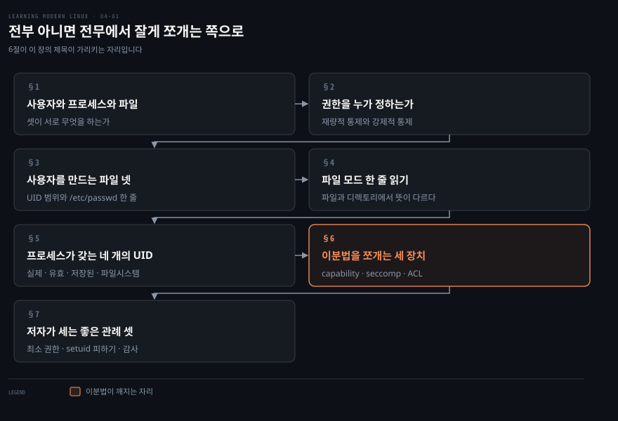
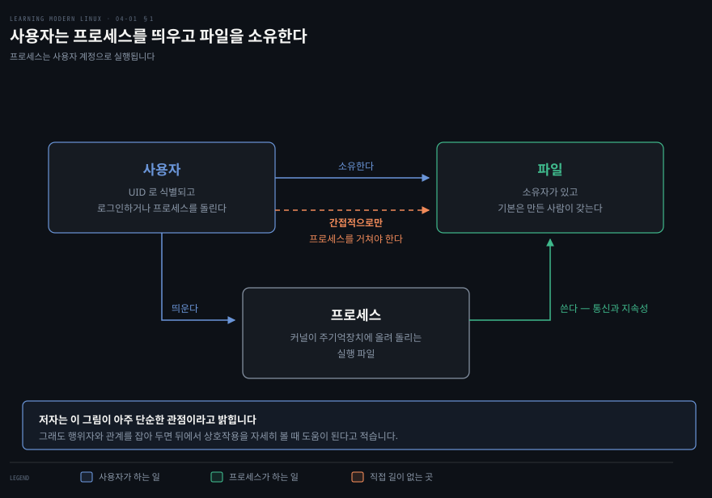
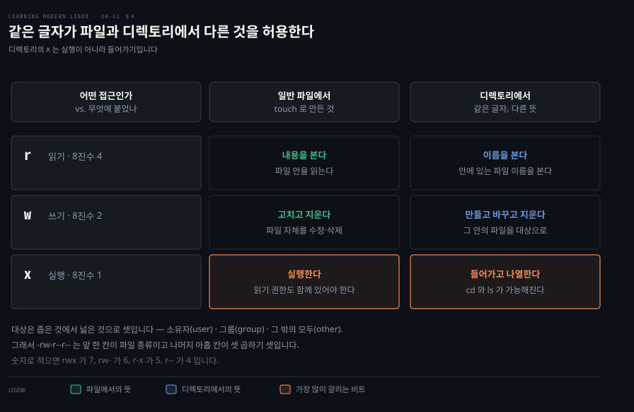
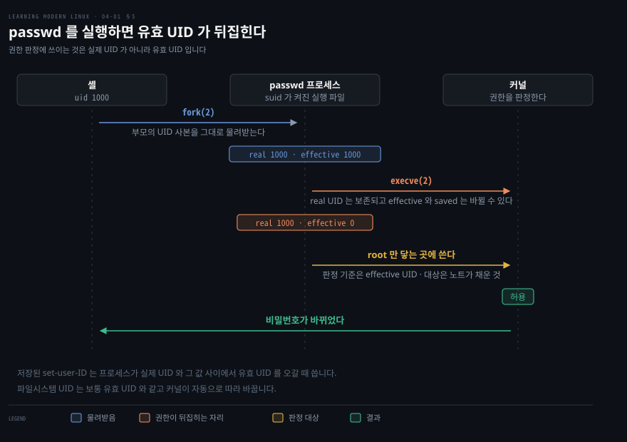
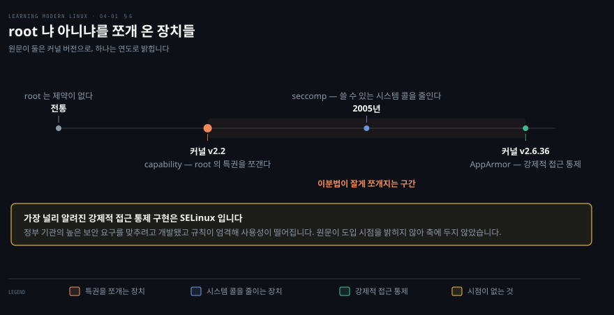

# 전부 아니면 전무에서 잘게 쪼개는 쪽으로

---

> 리눅스는 오랫동안 모든 것을 바꿀 수 있는 슈퍼유저이거나 제한된 접근을 가진 보통 사용자이거나 둘 중 하나였습니다. 4장은 그 이분법이 어떻게 깨져 왔는지를 따라갑니다.

## 핵심 요약

> 이 장 전체가 매달린 하나의 생각은 **리눅스의 접근 통제가 root 냐 아니냐라는 이분법에서 출발해, 그 특권을 독립된 단위로 쪼개는 쪽으로 움직여 왔다**는 것입니다.

저자가 이 이분법을 설명하는 대목이 구체적입니다. "프로세스 X가 네트워크 설정을 바꿔도 된다"는 것을 표현하려면 일반적으로 그 프로세스에 `root` 접근을 줘야 했다는 것입니다. 그 결과 시스템이 뚫렸을 때 공격자가 그 넓은 특권을 쉽게 오용할 수 있습니다.

앞의 절반은 그 이분법 안에서의 이야기입니다. 사용자와 프로세스와 파일이 서로에게 무엇을 하는지, 사용자를 어떤 파일이 정의하는지, 파일 모드 아홉 칸을 어떻게 읽는지입니다. 프로세스 쪽으로 넘어가면 UID 가 하나가 아니라 넷이라는 사실이 나옵니다.

뒤의 절반이 이분법을 깨는 장치들입니다.

- **capability**: 커널 2.2에서 `root` 의 특권을 독립적으로 할당 가능한 단위로 쪼갭니다.
- **seccomp**: 프로세스가 쓸 수 있는 시스템 콜을 줄입니다.
- **ACL**: 전통적 권한이 표현하지 못하는 대상에 권한을 줍니다.

저자는 이 셋이 컨테이너 문맥에서 특히 중요하다고 결론에 못 박습니다.


## 학습 목표

> 이 장을 읽고 나면 아래 다섯 가지를 스스로 해낼 수 있습니다.

1. 사용자와 프로세스와 파일의 관계를 접근 관점에서 설명할 수 있습니다.
2. 재량적 접근 통제와 강제적 접근 통제의 차이를 말할 수 있습니다.
3. `-rw-r--r--` 한 줄을 칸별로 읽고 8진수로 옮길 수 있습니다.
4. 실제 UID 와 유효 UID 가 갈리는 상황을 `passwd` 를 예로 설명할 수 있습니다.
5. capability·seccomp·ACL 이 각각 무엇을 쪼개는지 구분할 수 있습니다.

아래는 이 문서 전체를 읽는 순서로 이은 지도입니다. 칸마다 절 번호와 그 절이 답하는 물음 하나를 적었습니다. 색이 붙은 칸이 이 장의 제목이 가리키는 자리입니다.




## 이 문서가 다루지 않는 것

> 저자가 스스로 범위 밖이라고 밝힌 것이 이 장에는 유난히 많습니다. 그 선을 그대로 옮깁니다.

- `chattr` 로 다루는 특별한 설정 → 저자가 이 장의 범위 밖이라고 명시합니다
- ACL 의 상세 → 같은 이유로 넘기되 어디서 시작할지는 알아 두라고 적습니다
- `getcap`·`setcap` 의 상세와 좋은 관례 → 역시 범위 밖으로 둡니다
- 중앙 사용자 관리의 구현별 장단점 → 환경이 결정하는 일이라 다루지 않습니다
- Kerberos → 저자는 장 번호 대신 절 이름으로만 미룹니다. 그 절은 9장에 있습니다
- 감사 → 원서 8장이라고 저자가 직접 적습니다

스크립트에 `chmod 750` 을 권한 이유가 이 장에서 채워집니다. 그 연결은 [앞 노트](./03-03.bash%20%EB%8A%94%20%EC%A1%B0%EC%9A%A9%ED%9E%88%20%EC%8B%A4%ED%8C%A8%ED%95%98%EB%AF%80%EB%A1%9C%20%EC%8B%9C%EB%81%84%EB%9F%BD%EA%B2%8C%20%EB%A7%8C%EB%93%A4%EC%96%B4%EC%95%BC%20%ED%95%9C%EB%8B%A4.md)에서 예고했습니다.


## 1. 사용자와 프로세스와 파일

> 접근 통제를 이야기하기 전에 누가 누구에게 무엇을 하는지부터 세웁니다. 저자는 이것을 아주 단순한 관점이라고 밝히면서도 먼저 그립니다.



리눅스는 다중 사용자 운영체제이고 그런 만큼 유닉스에서 사용자 개념을 물려받았습니다. 각 사용자 계정은 사용자 ID 와 연결됩니다. 그 ID 에 실행 파일·파일·장치를 비롯한 여러 리눅스 자산에 대한 접근을 줄 수 있습니다. 사람 사용자는 사용자 계정으로 로그인할 수 있고 프로세스는 사용자 계정으로 실행될 수 있습니다.

여기서 자원이란 사용자가 쓸 수 있는 하드웨어나 소프트웨어 구성요소를 말합니다. 저자는 시스템 콜 같은 다른 종류의 자원 접근을 명시적으로 이야기할 때가 아니면 자원을 그냥 파일이라 부르겠다고 밝힙니다.

셋의 관계는 이렇습니다. **사용자**는 프로세스를 띄우고 파일을 소유합니다. **파일**은 소유자를 갖고 기본적으로 그 파일을 만든 사용자가 소유합니다. **프로세스**는 통신과 지속성을 위해 파일을 씁니다. 그리고 저자가 붙이는 단서가 도식의 점선입니다. 사용자도 간접적으로 파일을 쓰지만 그러려면 프로세스를 거쳐야 한다는 것입니다.

프로세스의 정의도 여기서 한 번 더 나옵니다. 커널이 주기억장치에 올려 실행하는 프로그램, 곧 실행 파일입니다.


## 2. 권한을 누가 정하는가

> 접근의 성격을 묻는 물음이 있습니다. 사용자나 프로세스가 자원에 직접, 어쩌면 제약 없이 접근하는가. 아니면 어떤 자원에 어떤 상황에서 접근할 수 있는지에 관한 규칙이 분명히 있는가.

리눅스 문맥에서 가장 중요하고 관련 있는 접근 통제 유형은 둘입니다.

**재량적 접근 통제**는 사용자의 신원을 근거로 자원 접근을 제한한다는 발상입니다. 재량적이라 부르는 이유는 특정 권한을 가진 사용자가 그 권한을 다른 사용자에게 넘겨줄 수 있다는 점에 있습니다.

**강제적 접근 통제**는 보안 수준을 나타내는 계층 모델에 바탕을 둡니다. 사용자에게는 인가 등급이 부여되고 자원에는 보안 라벨이 부여됩니다. 사용자는 자기 등급과 같거나 그보다 낮은 등급에 해당하는 자원만 접근할 수 있습니다. 이 모델에서는 관리자가 엄격하고 배타적으로 접근을 통제하며 모든 권한을 설정합니다. 다시 말해 사용자는 자원을 소유하고 있더라도 스스로 권한을 설정할 수 없습니다.

### 그리고 전부 아니면 전무라는 태도

여기에 더해 리눅스는 전통적으로 전부 아니면 전무라는 태도를 가집니다. 모든 것을 바꿀 힘을 가진 슈퍼유저이거나, 제한된 접근을 가진 보통 사용자이거나 둘 중 하나입니다. 처음에는 사용자나 프로세스에 특정 특권을 부여하는 쉽고 유연한 방법이 없었습니다.

저자는 이 표현에 단서를 답니다. 대부분의 리눅스 시스템의 기본값은 거의 모든 파일과 실행 파일에 대해 "그 밖의 모두" 에게 읽기 접근을 허용한다는 것입니다. 예컨대 SELinux 를 켜면 강제적 접근 통제가 명시적으로 권한을 준 자산에만 접근을 제한합니다. 웹 서버가 80과 443 포트만 쓰는 식입니다. 특정 디렉토리의 파일과 스크립트만 공유하고 특정 위치에만 로그를 씁니다.

리눅스의 강제적 접근 통제 구현 가운데 가장 잘 알려진 것이 SELinux 입니다. 정부 기관의 높은 보안 요구를 맞추려고 개발됐고, 규칙이 엄격해 사용성이 떨어지는 탓에 보통 그런 환경에서 쓰입니다. 다른 선택지로는 커널 2.6.36부터 포함됐고 우분투 계열에서 인기 있는 AppArmor 가 있습니다.


## 3. 사용자를 만드는 파일 넷

> 시스템 사용자와 일반 사용자의 구분은 기술적인 것이라기보다 조직적인 구성물입니다. 그 말을 이해하려면 UID 부터 봐야 합니다.

목적이나 용도로 보면 사용자 계정은 둘로 나뉩니다. **시스템 사용자**는 프로그램이, 때로는 데몬이라 불리는 것이 백그라운드 프로세스를 돌리는 데 쓰는 계정입니다. 그 프로그램이 제공하는 서비스는 `sshd` 처럼 운영체제의 일부일 수도 있고 `mysql` 처럼 애플리케이션 계층의 것일 수도 있습니다. **일반 사용자**는 셸로 리눅스를 대화형으로 쓰는 사람 사용자 같은 것입니다.

리눅스는 사용자를 UID 로 식별합니다. UID 는 리눅스가 관리하는 32비트 수치입니다. 사용자는 GID 로 식별되는 하나 이상의 그룹에 속합니다. UID 0 을 가진 특별한 사용자를 보통 `root` 라 부릅니다. 이 슈퍼유저는 무엇이든 할 수 있어 아무 제약이 없습니다. 저자는 `root` 로 일하는 것을 피하고 싶어질 것이라며, 힘이 너무 크고 조심하지 않으면 시스템을 쉽게 망가뜨릴 수 있다고 적습니다. 자기도 해 봤다는 말을 덧붙입니다.

배포판마다 UID 범위를 관리하는 방식이 다릅니다. `systemd` 기반 배포판의 관례는 이렇습니다.

| UID | 쓰임 |
|---|---|
| 0 | `root` |
| 1 ~ 999 | 시스템 사용자용으로 예약 |
| 1000 ~ 65533 과 65536 ~ 4294967294 | 일반 사용자 |
| 65534 | 사용자 `nobody`. 원격 사용자를 잘 알려진 ID 로 매핑할 때 쓴다 |

자기 UID 는 `id -u` 로 봅니다.

### /etc/passwd 한 줄 읽기

지역 사용자 관리를 위해 리눅스는 단순한 파일 기반 인터페이스를 씁니다. 이름 짓기가 다소 혼란스러운데, 저자는 그것이 우리가 안고 살아야 할 역사적 산물이라고 적습니다. 네 파일이 함께 사용자 관리를 구현합니다.

| 목적 | 파일 |
|---|---|
| 사용자 데이터베이스 | `/etc/passwd` |
| 그룹 데이터베이스 | `/etc/group` |
| 사용자 비밀번호 | `/etc/shadow` |
| 그룹 비밀번호 | `/etc/gshadow` |

`/etc/passwd` 는 일반 사용자의 이름·UID·그룹 소속과 홈 디렉토리·로그인 셸 같은 데이터를 담은 작은 사용자 데이터베이스입니다. 한 줄은 콜론으로 나뉜 일곱 칸입니다.

```bash
root:x:0:0:root:/root:/bin/bash
```

앞에서부터 사용자 이름, 비밀번호 자리, UID, 주 그룹의 GID, 사용자 정보, 홈 디렉토리, 로그인 셸입니다. 각 칸에 저자가 붙인 설명은 이렇습니다.

- **사용자 이름**은 32자 이하여야 합니다.
- **비밀번호 자리**의 `x` 는 암호화된 비밀번호가 `/etc/shadow` 에 저장되어 있다는 뜻이고 요즘은 이것이 기본입니다.
- **UID** 아래로 1000 미만은 리눅스가 시스템 용도로 예약합니다.
- **사용자 정보** 칸은 GECOS 필드라고도 부릅니다. GECOS 형식을 쓰지는 않고 보통 계정에 연결된 사람의 전체 이름을 넣습니다.
- **홈 디렉토리**의 기본값은 `/` 입니다.
- **로그인 셸**에 `/sbin/nologin` 을 넣으면 대화형 로그인을 막습니다.

이름이 `passwd` 인데 정작 비밀번호가 없다는 점을 저자가 짚습니다. 비밀번호는 역사적 이유로 `/etc/shadow` 라는 파일에 저장되고, 모든 사용자가 `/etc/passwd` 를 읽을 수 있는 것과 달리 `/etc/shadow` 를 읽으려면 보통 `root` 권한이 필요합니다.

사용자를 더할 때는 `adduser` 를 씁니다. 이 명령이 하는 일은 넷입니다.

1. 홈 디렉토리를 만듭니다.
2. `/etc/skel` 에서 기본 설정 파일을 복사해 넣습니다.
3. 비밀번호를 정하게 합니다.
4. 선택적인 GECOS 정보를 묻습니다.

시스템 계정을 만들려면 `-r` 옵션을 줍니다. 로그인 셸 사용을 막고 홈 디렉토리 생성도 건너뜁니다.

그룹은 한 명 이상의 사용자를 모은 것입니다. 일반 사용자는 기본 그룹 하나에 속하고 추가 그룹의 구성원이 될 수 있습니다. `/etc/group` 에서 그룹과 매핑을 볼 수 있고, 마지막 콜론 뒤에 쉼표로 구분한 사용자 이름 목록을 넣어 여러 사용자에게 그 그룹 권한을 줄 수 있습니다.

### 기계가 여러 대일 때

관리할 기계나 서버가 하나가 아니면 지역 관리는 금세 낡은 방식이 됩니다. 저자가 드는 접근은 셋입니다.

- **디렉토리 기반**은 LDAP 을 씁니다. Keycloak 같은 프로젝트로 직접 서버를 돌리거나 Azure Active Directory 같은 클라우드 제공자에 맡깁니다.
- **네트워크를 통한 인증**은 Kerberos 로 합니다. 저자는 자세한 것을 뒤로 미루면서 절 이름만 가리키는데, 그 절이 놓인 곳은 9장입니다.
- **설정 관리 시스템**은 Ansible·Chef·Puppet·SaltStack 으로 여러 기계에 일관되게 사용자를 만듭니다.

실제 구현은 환경이 정하는 경우가 많습니다. 회사가 이미 LDAP 을 쓰고 있으면 선택지가 제한되는 식입니다.


## 4. 파일 모드 한 줄 읽기

> `ls -al` 의 맨 앞 열 칸은 매일 보면서도 막상 소리 내어 읽으라고 하면 막힙니다. 리눅스에서는 어느 정도 모든 것이 파일이므로 그 열 칸이 자원 접근의 핵심입니다.



같은 `x` 가 파일에 붙었을 때와 디렉토리에 붙었을 때 다른 것을 허용한다는 사실을 모르면, 디렉토리 권한을 고치다 들어가지 못하게 만드는 일이 생깁니다. 그 차이를 보기 전에 범위와 종류부터 세웁니다.

권한의 범위는 좁은 것에서 넓은 것으로 셋입니다.

- **사용자**: 파일의 소유자
- **그룹**: 한 명 이상의 구성원을 가짐
- **그 밖의 모두**: 나머지 전부를 담는 범주

접근의 종류도 셋입니다. 도식이 보이듯 같은 글자가 일반 파일에서와 디렉토리에서 다른 것을 허용하고, 특히 실행 비트가 그렇습니다. 일반 파일에서는 사용자가 읽기 권한도 함께 가질 때 그 파일을 실행하게 해 줍니다. 디렉토리에서는 그 안의 파일 정보에 접근하게 해 주어 사실상 그리로 들어가거나(`cd`) 내용을 나열하는(`ls`) 것을 허용합니다.

```bash
ls -al
```

```bash
-rw-r--r--  1  mh9  devs  9  Apr 12 11:42  test
```

칸을 앞에서부터 읽으면 파일 모드, 하드 링크 수, 파일 소유자, 파일이 속한 그룹, 바이트 단위 크기, 마지막 수정 시각, 파일 이름입니다.

파일 모드는 다시 `. rwx rwx rwx` 구조입니다. 첫 칸이 파일 종류이고, 나머지 아홉 칸이 소유자·그룹·그 밖의 모두 순서로 각각의 권한을 담습니다.

| 기호 | 뜻 |
|---|---|
| `-` | 일반 파일 |
| `d` | 디렉토리 |
| `l` | 심볼릭 링크 |
| `b` · `c` | 블록 특수 파일 · 문자 특수 파일 |
| `p` · `s` | 이름 있는 파이프(`mkfifo` 로 만듦) · 소켓 |
| `C` | 고성능(연속 데이터) 파일 |
| `?` | 그 밖의 알 수 없는 종류 |

`M` 이나 `P` 처럼 더 오래됐거나 폐기된 문자도 있는데 대체로 무시해도 된다고 저자는 적습니다.

### 숫자로 옮기기

패턴을 8진수로 옮기면 읽기가 4, 쓰기가 2, 실행이 1 입니다. 셋을 더한 값이 자릿수 하나가 되므로 원서의 표는 여덟 줄입니다. `rwx` 는 7, `rw-` 는 6, `r-x` 는 5, `r--` 는 4, `-wx` 는 3, `-w-` 는 2, `--x` 는 1, `---` 는 0 입니다.

저자가 드는 예를 옮기면 이렇습니다. `755` 는 소유자에게 전체 접근을 주고 나머지 모두에게 읽기와 실행을 줍니다. `700` 은 소유자에게만 전체 접근을 줍니다. `664` 는 소유자와 그룹에 읽기·쓰기를, 나머지에 읽기만 줍니다. `644` 는 소유자에게 읽기·쓰기를, 나머지 모두에게 읽기만 줍니다. `400` 은 소유자에게 읽기만 줍니다.

`664` 가 저자의 시스템에서 특별한 뜻을 갖는다고 덧붙입니다. 파일을 만들면 기본으로 받는 권한이고, `umask` 명령으로 확인하면 `0002` 가 나온다는 것입니다.

### r·w·x 말고 보이는 글자들

`ls` 를 하면 다른 글자도 만납니다. `s` 는 실행 파일에 적용된 setuid 나 setgid 권한이고, 그것을 실행하는 사용자는 그 파일의 소유자나 그룹의 유효 권한을 물려받습니다. `t` 는 스티키 비트이며 디렉토리에만 의미가 있습니다. 설정하면 그 디렉토리나 파일을 소유하지 않은 한 비 root 사용자가 그 안의 파일을 지우지 못하게 막습니다.

setuid 권한은 시스템에 실행 파일을 소유자의 권한으로 실행하라고 알리는 데 쓰입니다. 파일이 `root` 소유라면 그것이 문제를 일으킬 수 있다고 저자는 경고합니다.

### 바꾸는 법과 그 함정

권한은 `chmod` 로 바꿉니다. `644` 처럼 원하는 설정을 명시적으로 주거나 `+x` 같은 단축 표기를 씁니다.

```bash
chmod +x /tmp/masktest
```

```bash
-rw-r--r--  1 mh9 dev 0 Aug 28 13:07 /tmp/masktest
-rwxr-xr-x  1 mh9 dev 0 Aug 28 13:07 /tmp/masktest
```

`644` 였던 것이 `755` 가 됩니다. 여기서 저자가 짚는 함정이 이 장의 좋은 관례로 이어집니다. 모두에게 실행 권한을 주고 싶지는 않을 수 있으니 `chmod 744` 가 나았을 것이라는 지적입니다. 소유자에게만 올바른 권한을 주면서 나머지는 바꾸지 않는 방식입니다.

소유권은 `chown` 으로, 그룹은 `chgrp` 로 바꿉니다.


## 5. 프로세스가 갖는 네 개의 UID

> 지금까지는 사람 사용자가 파일에 접근하는 이야기였습니다. 프로세스 관점으로 옮기면 관련 권한이 하나가 아닙니다.



도식의 마지막 쓰기 단계는 노트가 이은 것입니다. 저자는 앞 절에서 비밀번호가 `/etc/shadow` 에 저장되고 그것을 읽으려면 보통 `root` 가 필요하다고 적고, 이 절에서는 `passwd` 에 suid 가 걸려 유효 UID 가 0 이 된다고만 적습니다. 두 서술을 붙이면 왜 suid 가 필요한지가 드러나므로 도식이 그렇게 이었습니다.

저자는 `credentials(7)` 매뉴얼을 인용해 넷을 가릅니다.

- **실제 UID**는 프로세스를 띄운 사용자의 UID 입니다. 사람 사용자 관점에서 프로세스의 소유를 나타내고, 프로세스 자신은 `getuid(2)` 로 얻습니다.
- **유효 UID**는 커널이 프로세스가 메시지 큐 같은 공유 자원에 접근할 때 갖는 권한을 정하는 데 씁니다. 전통적인 유닉스 시스템에서는 파일 접근에도 쓰였습니다. 프로세스는 `geteuid(2)` 로 얻습니다.
- **저장된 set-user-ID**는 suid 상황에서 프로세스가 유효 UID 를 실제 UID 와 저장된 set-user-ID 사이에서 오가며 특권을 취할 때 씁니다. 특정 네트워크 포트를 쓰려면 `root` 로 실행되는 것 같은 상승된 특권이 필요한 경우가 그 예입니다. `getresuid(2)` 로 얻습니다.
- **파일시스템 UID**는 리눅스 고유의 ID 로 파일 접근 권한을 정하는 데 씁니다. 파일 서버가 일반 사용자를 대신해 동작하면서도 그 사용자가 보내는 시그널로부터 프로세스를 격리하는 용도로 도입됐습니다. 프로그램이 직접 조작하는 일은 보통 없고, 커널이 유효 UID 가 바뀌는 것을 추적해 파일시스템 UID 를 자동으로 따라 바꿉니다. `setfsuid(2)` 로 바꿀 수 있지만 커널 2.0 이후로는 기술적으로 더 이상 필요하지 않고 호환을 위해 남아 있습니다.

### 언제 갈리는가

전이 규칙이 이 절의 핵심입니다. 자식 프로세스가 `fork(2)` 로 만들어지면 부모의 UID 사본을 물려받습니다. `execve(2)` 시스템 콜을 하는 동안 프로세스의 실제 UID 는 보존되지만 유효 UID 와 저장된 set-user-ID 는 바뀔 수 있습니다.

`passwd` 가 그 예입니다. 실행하면 유효 UID 는 내 UID, 이를테면 1000 입니다. 그런데 `passwd` 에는 suid 가 켜져 있어서, 실행하면 유효 UID 가 0, 곧 `root` 가 됩니다. 유효 UID 에 영향을 주는 다른 길로는 `chroot` 를 비롯한 샌드박싱 기법도 있습니다.

> **원문 정오**: 저자는 실제 UID 를 두고 "셸에서는 `stat -c "%u %g" /proc/$pid/` 로 조회할 수 있다" 고 적지만, 이 명령이 돌려주는 값은 실제 UID 가 아닙니다. `proc_pid(5)` 는 "The files inside each /proc/pid directory are normally owned by the effective user and effective group ID of the process" 라고 적습니다.[^procpid] 게다가 프로세스의 dumpable 속성이 1이 아니면 보안 조치로 소유가 `root:root` 로 바뀌고, 유효 UID 나 GID 를 바꾸면 그 속성이 재설정될 수 있습니다.[^procpid] 실제 UID 와 유효 UID 가 갈리는 상황이 바로 이 절의 주제이므로, 그 자리에서 이 명령은 두 값을 구분해 주지 못합니다.

### UID 가 파일 말고 쓰이는 곳

파일 접근 권한 외에도 커널은 프로세스 UID 를 여러 곳에 씁니다. 시그널을 보내는 권한을 정하는 데 쓰이고, 특정 프로세스 ID 에 `kill -9` 를 했을 때 무슨 일이 벌어지는지가 여기서 결정됩니다. 스케줄링과 우선순위 처리에도 쓰이고 `nice` 가 그 예입니다. 자원 한도를 검사하는 데도 쓰이며 이것은 컨테이너 문맥에서 원서 9장이 자세히 다룹니다.

POSIX 스레드는 한 프로세스의 모든 스레드가 자격증명을 공유하도록 요구합니다. 다만 커널 수준에서 리눅스는 스레드마다 별도의 사용자·그룹 자격증명을 유지한다고 저자가 덧붙입니다.


## 6. 이분법을 쪼개는 세 장치

> 전통적인 유닉스 시스템이 그랬듯 리눅스에서도 `root` 사용자는 프로세스를 돌릴 때 제약이 없었습니다. 커널은 특권 프로세스와 비특권 프로세스 둘만 구분했습니다.



**capability** 가 그 이분법을 바꿨습니다. 커널 2.2에서 capability 시스템 콜이 도입되면서, 전통적으로 `root` 와 연결되던 특권들이 스레드 단위로 독립적으로 할당할 수 있는 구별된 단위로 쪼개졌습니다.

실무에서 보통의 프로세스는 capability 가 하나도 없고 앞 절에서 본 권한으로 통제됩니다. 실행 파일(바이너리와 셸 스크립트)과 프로세스에 capability 를 부여해 작업 수행에 필요한 특권을 점진적으로 더할 수 있습니다. 저자는 경고를 하나 붙입니다. capability 는 일반적으로 시스템 수준 작업에만 관련이 있고, 대부분의 경우 꼭 여기에 의존할 필요는 없다는 것입니다.

| capability | 무엇을 허용하나 |
|---|---|
| `CAP_CHOWN` | 파일의 UID·GID 를 임의로 바꾸기 |
| `CAP_KILL` | 다른 사용자에 속한 프로세스에 시그널 보내기 |
| `CAP_SETUID` · `CAP_SETPCAP` | UID 바꾸기 · 돌고 있는 프로세스의 capability 설정하기 |
| `CAP_NET_ADMIN` · `CAP_NET_RAW` | 인터페이스 설정 같은 네트워크 작업 · RAW 와 PACKET 소켓 쓰기 |
| `CAP_SYS_CHROOT` · `CAP_SYS_ADMIN` | `chroot` 호출 · 파일시스템 마운트를 포함한 시스템 관리 작업 |
| `CAP_SYS_PTRACE` · `CAP_SYS_MODULE` | `strace` 로 프로세스 디버깅 · 커널 모듈 적재 |

```bash
capsh --print
grep Cap /proc/$$/status
```

앞 명령이 시스템의 모든 capability 를 훑고, 뒤 명령이 현재 프로세스, 곧 셸의 capability 를 보입니다. 파일 단위의 세밀한 관리는 `getcap` 과 `setcap` 으로 합니다.

**seccomp** 는 2005년부터 있는 커널 기능입니다. 이 샌드박싱 기법의 기본 발상은 `seccomp(2)` 라는 전용 시스템 콜로 프로세스가 쓸 수 있는 시스템 콜을 제한하는 것입니다. 직접 관리하기가 불편할 수 있는데, 너무 번거롭지 않게 쓰는 길이 있다고 저자는 적습니다. 컨테이너 문맥에서 도커와 쿠버네티스가 모두 seccomp 를 지원한다는 것입니다.

**ACL** 은 전통적 권한 위에 또는 그와 함께 쓸 수 있는 유연한 권한 메커니즘입니다. 전통적 권한의 한 가지 결함을 다루는데, 어떤 사용자의 그룹 목록에 없는 사용자나 그룹에도 권한을 줄 수 있게 해 준다는 것입니다. 배포판이 ACL 을 지원하는지는 `grep -i acl /boot/config*` 로 확인하고 출력 어딘가에 `POSIX_ACL=Y` 가 있기를 기대하면 됩니다. 파일시스템에서 ACL 을 쓰려면 마운트 시점에 `acl` 옵션으로 켜야 합니다.


## 7. 저자가 세는 좋은 관례 셋

> 접근 통제라는 더 넓은 문맥에서의 보안 관례입니다. 일부는 전문적인 환경에 더 맞지만 모두가 최소한 알고는 있어야 한다고 저자는 적습니다.

**최소 권한**은 사람이나 프로세스가 주어진 작업을 해내는 데 필요한 권한만 가져야 한다는 원칙입니다. 앱이 파일에 쓰지 않는다면 읽기 접근만 있으면 됩니다. 접근 통제 문맥에서 이 원칙을 실천하는 길이 둘이라고 저자는 적습니다.

1. `chmod +x` 를 쓰면 의도한 권한 말고 다른 사용자에게도 권한이 얹힙니다. 기호 모드보다 숫자 모드로 명시적인 권한을 주는 편이 낫습니다. 기호 모드가 더 편하지만 덜 엄격하기 때문입니다.
2. 가능한 한 `root` 로 실행하는 것을 피합니다. 무언가를 설치해야 할 때는 `root` 로 로그인하기보다 `sudo` 를 씁니다.

애플리케이션을 만든다면 SELinux 정책으로 선택한 파일과 디렉토리 같은 것에만 접근을 제한할 수 있다는 말도 덧붙입니다. 그에 비해 기본 리눅스 모델은 시스템에 열려 있는 어떤 파일에든 애플리케이션이 접근하게 할 수 있습니다.

**setuid 피하기**는 setuid 에 기대기보다 capability 를 활용하라는 것입니다. setuid 는 큰 망치 같은 것이고 공격자에게 시스템을 장악할 좋은 길을 준다고 저자는 표현합니다.

**감사**는 누가 무엇을 했는지를 조작할 수 없는 형태로 기록해 두는 발상입니다. 그 읽기 전용 로그로 누가 언제 무엇을 했는지 검증할 수 있습니다. 원서 8장이 자세히 다룹니다.


## 심화 학습

> 이 장은 버전 서술이 여럿이라 대조할 자리가 많습니다. 확인한 것만 적습니다.

- **`/proc/$pid` 로는 실제 UID 를 읽을 수 없습니다.** 5절의 원문 정오가 그것이고, 근거는 `proc_pid(5)` 입니다.[^procpid] 이 절이 가르치려는 구분이 실제 UID 와 유효 UID 인데 예시 명령이 그 구분을 지우는 자리라 특히 걸립니다.
- **capability 표기가 PDF 에서 줄바꿈으로 갈라져 있습니다.** 원서 표 4-4에서 `CAP_SYS_CHROOT`·`CAP_SYS_PTRACE`·`CAP_SYS_MODULE` 이 각각 `CAP_SYS_CHROO T` 처럼 끊겨 보입니다. 조판 문제이지 이름이 다른 것이 아니므로 이 노트는 이어 붙여 적었습니다.
- **`chmod 750` 을 권한 이유가 여기서 닫힙니다.** [3장 노트](./03-03.bash%20%EB%8A%94%20%EC%A1%B0%EC%9A%A9%ED%9E%88%20%EC%8B%A4%ED%8C%A8%ED%95%98%EB%AF%80%EB%A1%9C%20%EC%8B%9C%EB%81%84%EB%9F%BD%EA%B2%8C%20%EB%A7%8C%EB%93%A4%EC%96%B4%EC%95%BC%20%ED%95%9C%EB%8B%A4.md)의 2절이 최소 권한을 언급하며 4장을 예고했고, 이 장의 좋은 관례가 기호 모드보다 숫자 모드가 엄격하다는 이유를 채웁니다. 두 장을 이어 읽어야 완성되는 논지입니다.
- **컨테이너로 넘어가는 다리가 이 장에 있습니다.** 저자는 결론에서 capability 와 seccomp 프로파일이 컨테이너 문맥에서 특히 중요하다고 못 박습니다. 실제로 그 둘이 잘못 설정됐을 때 무엇이 무너지는지는 [컨테이너 격리 깨뜨리기](../../../08_cloud/book/container-security/09-01.%EC%BB%A8%ED%85%8C%EC%9D%B4%EB%84%88%20%EA%B2%A9%EB%A6%AC%20%EA%B9%A8%EB%9C%A8%EB%A6%AC%EA%B8%B0%20%E2%80%94%20%EC%84%A4%EC%A0%95%20%ED%95%98%EB%82%98%EB%A1%9C%20%EB%AC%B4%EB%84%88%EC%A7%80%EB%8A%94%20%EA%B2%BD%EA%B3%84.md)가 다룹니다.


## 결정 치트시트

> 이 장이 판단으로 이어지는 자리를 모았습니다. 근거는 본문입니다.

| 상황 | 선택 | 이유 |
|---|---|---|
| 스크립트에 실행 권한을 준다 | `chmod 750` | `chmod +x` 는 다른 사용자에게도 권한을 얹는다 |
| 무언가를 설치해야 한다 | `sudo` | `root` 로 로그인하지 않는다 |
| 프로세스에 네트워크 설정 권한만 준다 | `CAP_NET_ADMIN` | `root` 전체를 주지 않고 단위로 쪼갠다 |
| 특권이 필요한 실행 파일을 만든다 | setuid 대신 capability | setuid 는 장악 경로를 연다 |
| 프로세스가 쓸 시스템 콜을 줄인다 | seccomp | 도커와 쿠버네티스가 지원한다 |
| 그룹에 없는 사용자에게 권한을 준다 | ACL | 전통적 권한이 표현하지 못하는 자리 |
| 기계가 여러 대라 사용자를 함께 관리한다 | LDAP · Kerberos · 설정 관리 도구 | 환경이 이미 정해 놓은 경우가 많다 |
| 누가 무엇을 했는지 증명해야 한다 | 감사 로그 | 조작할 수 없는 읽기 전용 기록 |


## 적용 관점

> 이 장이 실무로 착지하는 자리는 컨테이너의 보안 컨텍스트입니다. 파드 매니페스트에 적는 값들이 여기서 배운 개념의 이름을 그대로 씁니다.

**한 가지 실행**: 자기가 만든 이미지 하나를 골라 그 프로세스가 어떤 UID 로 도는지 확인합니다. `root` 로 돌고 있다면 그것이 이 장이 피하라고 한 자리입니다.

```bash
id -u
ls -al /tmp/masktest
grep Cap /proc/$$/status
```

Spring 애플리케이션을 쿠버네티스에 올려 본 사람에게 이 장의 어휘는 이미 익숙합니다.

- `securityContext.runAsUser`: 3절의 UID
- `securityContext.runAsNonRoot`: 7절의 최소 권한 원칙
- `capabilities.drop` 과 `add`: 6절의 capability
- `seccompProfile`: 6절의 seccomp 와 그대로 같은 이름

이 장을 읽고 나면 그 필드들이 임의의 설정이 아니라 리눅스가 이분법을 쪼개 온 역사의 이름표라는 것이 보입니다. Dockerfile 에서 `USER` 를 지정하지 않으면 컨테이너가 `root` 로 도는 이유도 4절의 파일 소유와 5절의 UID 전이로 설명됩니다.


## 면접에서 받을 만한 질문

> 자답한 뒤 아래 정답과 맞춰 봅니다.

1. 재량적 접근 통제와 강제적 접근 통제의 차이를 설명해 보십시오.
2. `-rw-r--r--` 를 칸별로 읽고 8진수로 옮겨 보십시오.
3. 디렉토리에 붙은 `x` 는 무엇을 허용합니까.
4. 실제 UID 와 유효 UID 는 언제 갈립니까.
5. capability 가 무엇을 바꿨습니까.
6. `chmod +x` 대신 숫자 모드를 권하는 이유는 무엇입니까.


## 정답 (자답 후 펼치기)

### 정답 1 — 두 접근 통제

재량적 접근 통제는 사용자의 신원을 근거로 접근을 제한하고, 권한을 가진 사용자가 그 권한을 다른 사용자에게 넘길 수 있습니다. 강제적 접근 통제는 보안 수준의 계층 모델에 바탕을 두고 관리자가 배타적으로 모든 권한을 설정하므로, 사용자는 자원을 소유해도 스스로 권한을 설정할 수 없습니다.

### 정답 2 — 파일 모드 읽기

첫 칸 `-` 는 일반 파일입니다. 다음 세 칸 `rw-` 는 소유자에게 읽기와 쓰기를, 그다음 `r--` 는 그룹에 읽기만을, 마지막 `r--` 는 그 밖의 모두에게 읽기만을 줍니다. 숫자로는 6·4·4, 곧 `644` 입니다.

### 정답 3 — 디렉토리의 x

그 디렉토리 안의 파일 정보에 접근하게 해 줍니다. 사실상 그리로 들어가거나(`cd`) 내용을 나열하는(`ls`) 것을 허용하는 비트입니다. 일반 파일에서의 실행과는 뜻이 다릅니다.

### 정답 4 — 두 UID 가 갈리는 때

`execve(2)` 를 하는 동안입니다. 실제 UID 는 보존되지만 유효 UID 와 저장된 set-user-ID 는 바뀔 수 있습니다. `passwd` 처럼 suid 가 켜진 실행 파일을 돌리면 유효 UID 가 0이 됩니다.

### 정답 5 — capability 가 바꾼 것

커널 2.2에서 capability 가 도입되면서, `root` 와 연결되던 특권들이 스레드 단위로 독립적으로 할당할 수 있는 구별된 단위로 쪼개졌습니다. 그전까지 커널은 특권 프로세스와 비특권 프로세스 둘만 구분했습니다.

### 정답 6 — 숫자 모드를 권하는 이유

`chmod +x` 는 의도한 것 말고 다른 사용자에게도 실행 권한을 얹습니다. 숫자 모드로 명시하면 소유자에게만 권한을 주면서 나머지는 바꾸지 않을 수 있어 최소 권한 원칙에 더 가깝습니다.


## 핵심 개념 체크리스트

- [ ] 사용자가 파일에 직접 닿지 못하고 프로세스를 거쳐야 하는 이유를 말할 수 있는가?
- [ ] `/etc/passwd` 한 줄의 일곱 칸을 순서대로 댈 수 있는가?
- [ ] `r`·`w`·`x` 가 파일과 디렉토리에서 각각 무엇을 허용하는지 구분할 수 있는가?
- [ ] 프로세스의 UID 넷을 이름과 용도로 짝지을 수 있는가?
- [ ] capability·seccomp·ACL 이 각각 무엇을 쪼개거나 넓히는지 아는가?
- [ ] 좋은 관례 셋을 컨테이너 설정의 필드 이름과 이을 수 있는가?


## 관련 문서

- [Learning Modern Linux 정독 인덱스](./README.md) — 이 책의 장별 진행 상황
- [bash 는 조용히 실패하므로 시끄럽게 만들어야 한다](./03-03.bash%20%EB%8A%94%20%EC%A1%B0%EC%9A%A9%ED%9E%88%20%EC%8B%A4%ED%8C%A8%ED%95%98%EB%AF%80%EB%A1%9C%20%EC%8B%9C%EB%81%84%EB%9F%BD%EA%B2%8C%20%EB%A7%8C%EB%93%A4%EC%96%B4%EC%95%BC%20%ED%95%9C%EB%8B%A4.md) — `chmod 750` 을 예고한 자리
- [컨테이너 격리 깨뜨리기](../../../08_cloud/book/container-security/09-01.%EC%BB%A8%ED%85%8C%EC%9D%B4%EB%84%88%20%EA%B2%A9%EB%A6%AC%20%EA%B9%A8%EB%9C%A8%EB%A6%AC%EA%B8%B0%20%E2%80%94%20%EC%84%A4%EC%A0%95%20%ED%95%98%EB%82%98%EB%A1%9C%20%EB%AC%B4%EB%84%88%EC%A7%80%EB%8A%94%20%EA%B2%BD%EA%B3%84.md) — 이 장의 장치가 잘못 설정됐을 때
- [Kubernetes 네트워크 학습 로드맵](../../../network-roadmap.md) — capability 가 11단계에서 다시 나오는 이유


## 참고 자료

- 원서: 《Learning Modern Linux》 4장 Access Control
- 서지: Michael Hausenblas, O'Reilly, 2022년
- [`proc_pid(5)` man 페이지](https://man7.org/linux/man-pages/man5/proc_pid.5.html) — `/proc/[pid]` 소유의 정본
- [`capabilities(7)` man 페이지](https://man7.org/linux/man-pages/man7/capabilities.7.html) — capability 전체 목록

[^procpid]: `proc_pid(5)` man 페이지 — "The files inside each /proc/pid directory are normally owned by the effective user and effective group ID of the process." 그리고 "However, as a security measure, the ownership is made root:root if the process's 'dumpable' attribute is set to a value other than 1." <https://man7.org/linux/man-pages/man5/proc_pid.5.html> (2026-09-05 조회)
