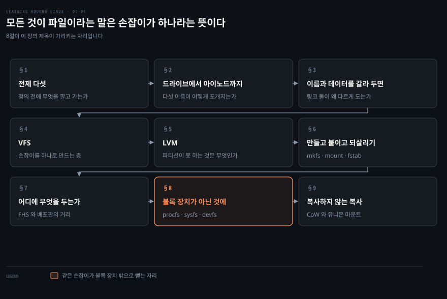
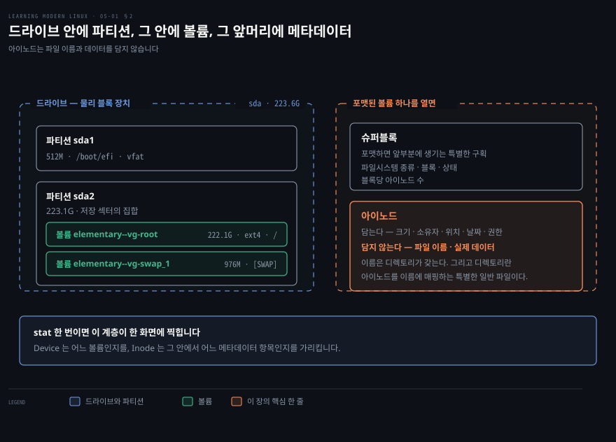
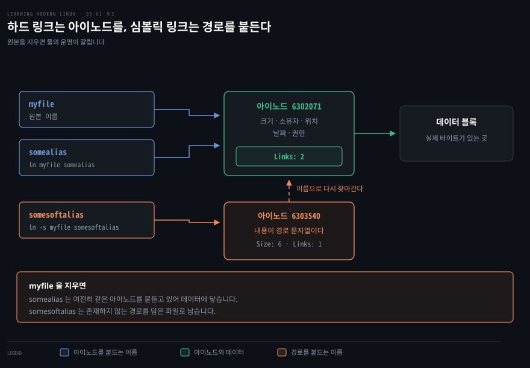
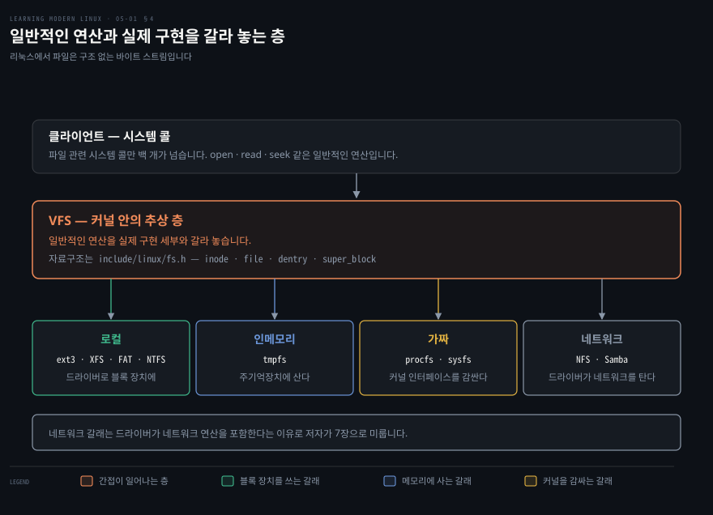
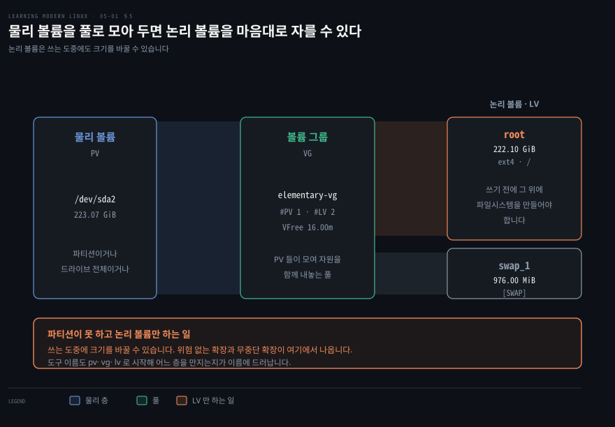
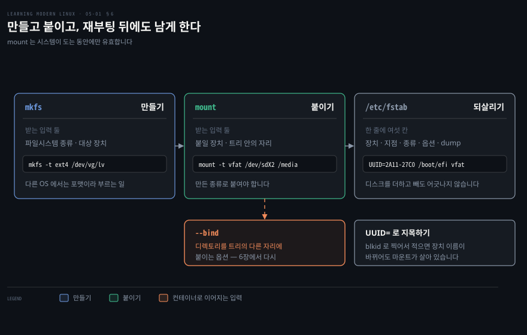
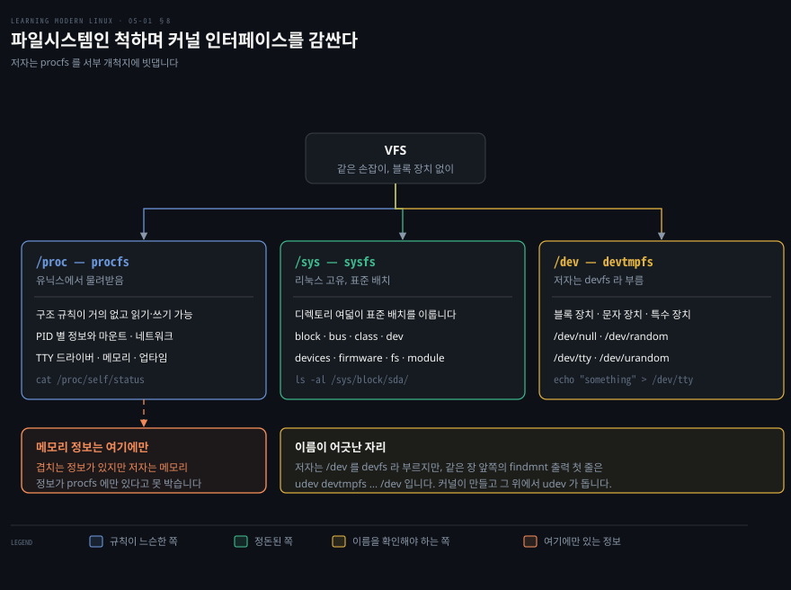
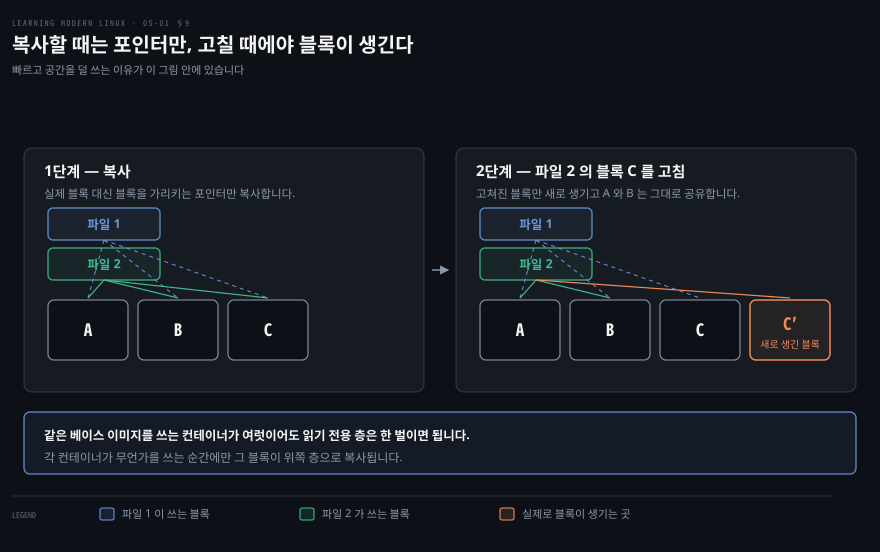
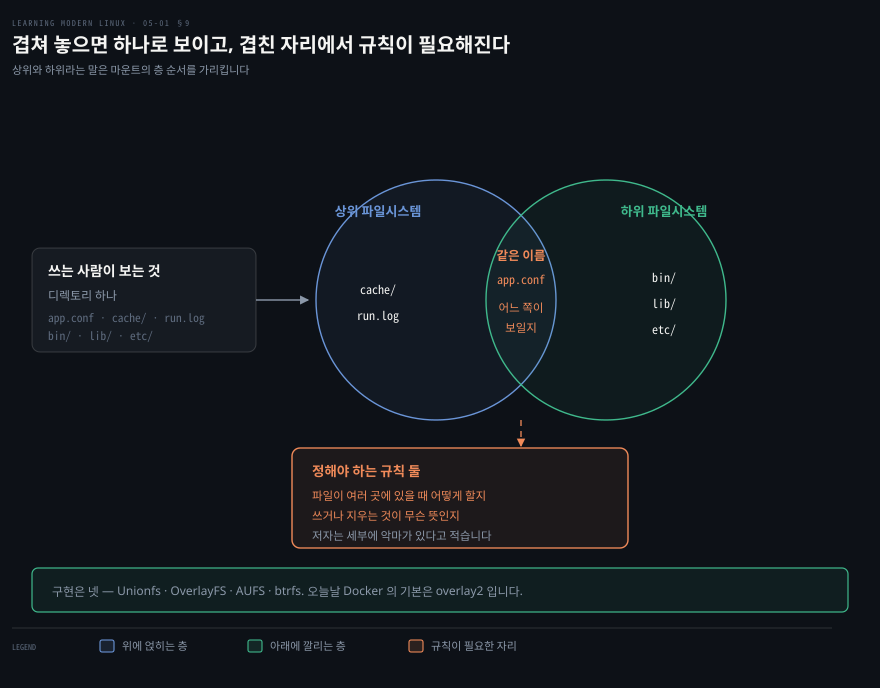

# 모든 것이 파일이라는 말은 손잡이가 하나라는 뜻이다

---

> 유닉스의 "모든 것은 파일이다" 라는 생각이 리눅스에 살아 있습니다. 저자는 그것이 언제나 참은 아니라고 먼저 못 박고, 그래도 대부분의 자원이 실제로 파일이라고 적습니다. 5장은 그 말이 구현으로 어떻게 내려앉는지를 따라갑니다.

## 핵심 요약

> 이 장 전체가 매달린 하나의 생각은 **파일시스템이 제공하는 것은 저장 공간이 아니라 균일한 인터페이스**라는 것입니다.

저자가 그 인터페이스를 세는 방식이 구체적입니다. 파일을 열고 파일에 관한 정보를 모으고 파일에 쓰는 일입니다. 리눅스에서 이 균일한 손잡이를 제공하는 것이 파일시스템입니다.

여기에 한 가지가 더 붙습니다. 리눅스는 파일을 구조에 대한 어떤 기대도 없는 바이트 스트림으로 다룹니다. 이 둘이 합쳐지면 결과가 하나 나옵니다. 서로 다른 종류의 파일을 두루 다루는 도구를 만들 수 있게 됩니다.

저자는 실용적인 이득 하나를 덧붙입니다. 균일한 인터페이스가 인지 부하를 줄여 주므로 리눅스를 익히는 속도가 빨라진다는 것입니다.

장의 뼈대는 그 인터페이스가 어디까지 뻗는지를 따라가는 순서입니다.

- **VFS** 가 그 손잡이를 커널 안에서 실현합니다. 시스템 콜과 개별 파일시스템 구현 사이에 간접 층을 놓습니다.
- **가짜 파일시스템**은 블록 장치가 아닌 것에도 같은 손잡이를 답니다. 프로세스 정보와 장치가 그렇게 파일이 됩니다.
- **CoW 와 유니온 마운트**는 그 파일들을 겹쳐 쌓는 방법입니다. 저자가 6장 컨테이너 이미지의 재료라고 예고하는 자리입니다.


## 학습 목표

> 이 장을 읽고 나면 아래 다섯 가지를 스스로 해낼 수 있습니다.

1. 드라이브·파티션·볼륨·슈퍼블록·아이노드를 하나의 계층으로 설명할 수 있습니다.
2. 하드 링크와 심볼릭 링크의 차이를 아이노드 관점에서 말할 수 있습니다.
3. VFS 가 무엇과 무엇 사이에 놓인 층인지 설명할 수 있습니다.
4. procfs·sysfs·devfs 가 각각 무엇을 드러내는지 구분할 수 있습니다.
5. CoW 와 유니온 마운트가 컨테이너 이미지의 어느 부분이 되는지 말할 수 있습니다.

아래는 이 문서 전체를 읽는 순서로 이은 지도입니다. 칸마다 절 번호와 그 절이 답하는 물음 하나를 적었습니다. 색이 붙은 칸이 이 장의 제목이 가리키는 자리입니다.




## 이 문서가 다루지 않는 것

> 저자가 스스로 뒤로 미룬 것과, 대략적이라고 밝힌 것을 그대로 옮깁니다.

- 네트워크 파일시스템 → 드라이버가 네트워크 연산을 포함한다는 이유로 7장으로 미룹니다
- 컨테이너 이미지에서의 CoW 활용 → 6장에서 다시 본다고 예고합니다
- 배포판별 파일시스템 배치 → 실제로는 배포판이 정하므로 `man hier` 를 보라고 강하게 권합니다
- 파일시스템 비교 표의 수치 → 대략적인 감을 주려는 것이며 이론적 한계와 구현이 다르다고 단서를 붙입니다
- 유니온 마운트의 세부 규칙 → 파일이 여러 곳에 있을 때의 처리를 직접 정해야 한다고만 적고 넘어갑니다

4장에서 본 파일 소유와 권한이 여기에서 다시 쓰입니다. 저자도 권한이 파일시스템이 잡는 속성이라고 짚으며 [앞 노트](./04-01.%EC%A0%84%EB%B6%80%20%EC%95%84%EB%8B%88%EB%A9%B4%20%EC%A0%84%EB%AC%B4%EC%97%90%EC%84%9C%20%EC%9E%98%EA%B2%8C%20%EC%AA%BC%EA%B0%9C%EB%8A%94%20%EC%AA%BD%EC%9C%BC%EB%A1%9C.md)의 절을 가리킵니다.


## 1. 이 장이 깔고 시작하는 전제 다섯

> 용어를 정의하기 전에 저자는 암묵적인 가정을 먼저 드러냅니다. 이것을 말로 꺼내 두지 않으면 뒤의 정의가 공중에 뜹니다.

저자가 명시하는 전제는 다섯입니다.

- 예외가 있지만 오늘날 널리 쓰이는 파일시스템 대부분은 **계층형**입니다. 루트(`/`)에서 시작하는 파일시스템 트리 하나를 사용자에게 줍니다.
- 그 트리에는 **두 종류의 객체**가 있습니다. 디렉토리와 파일입니다. 트리에 빗대면 디렉토리가 노드이고 잎은 파일이거나 디렉토리입니다.
- 돌아다니는 방법은 셋입니다. 디렉토리 내용을 나열하고(`ls`), 그 안으로 들어가고(`cd`), 지금 어디인지를 찍습니다(`pwd`).
- **권한이 내장**되어 있습니다. 파일시스템이 잡는 속성 중 하나가 소유이고, 그 소유가 배정된 권한을 통해 접근을 강제합니다.
- 파일시스템은 일반적으로 **커널에 구현**됩니다.

마지막 전제에는 저자가 직접 예외를 답니다. 성능 때문에 보통 커널 공간에 구현하지만 사용자 공간에 구현하는 선택지도 있습니다. FUSE 가 그것입니다.

이 다섯을 꺼내 두면 뒤에 나오는 용어들이 어디에 붙는지가 정해집니다.


## 2. 드라이브에서 아이노드까지

> 파일시스템 이야기는 물리 장치에서 시작해 메타데이터에서 끝납니다. 그 사이에 다섯 개의 이름이 놓입니다.



저자가 정의하는 다섯은 이렇습니다.

**드라이브**는 HDD 나 SSD 같은 물리 블록 장치입니다. 가상 머신 문맥에서는 에뮬레이트될 수도 있습니다. `/dev/sda` 는 SCSI 장치, `/dev/sdb` 는 SATA 장치, `/dev/hda` 는 IDE 장치입니다.

**파티션**은 드라이브를 논리적으로 쪼갠 저장 섹터의 집합입니다. HDD 에 파티션 둘을 만들기로 하면 `/dev/sdb1` 과 `/dev/sdb2` 로 나타납니다.

**볼륨**은 파티션과 어느 정도 비슷하지만 더 유연합니다. 그리고 특정 파일시스템으로 포맷되어 있습니다.

**슈퍼블록**은 포맷했을 때 파일시스템 앞부분에 생기는 특별한 구획입니다. 파일시스템의 메타데이터를 담습니다. 파일시스템 종류, 블록, 상태, 블록당 아이노드 수 같은 것들입니다.

**아이노드**는 파일에 관한 메타데이터를 저장합니다. 크기·소유자·위치·날짜·권한입니다.

아이노드에 관해 저자가 붙이는 단서가 이 장에서 가장 중요한 한 줄입니다. 아이노드는 **파일 이름과 실제 데이터를 저장하지 않습니다**. 그것은 디렉토리가 갖고 있습니다. 그리고 디렉토리란 사실 아이노드를 파일 이름에 매핑하는 특별한 종류의 일반 파일일 뿐입니다.

### 눈으로 확인하는 순서

이론이 많았으니 저자는 곧바로 실행으로 넘어갑니다. 먼저 시스템에 어떤 드라이브와 파티션과 볼륨이 있는지 봅니다.

```bash
lsblk --exclude 7
```

```bash
NAME                        MAJ:MIN RM    SIZE RO TYPE MOUNTPOINTS
sda                           8:0     0 223.6G  0 disk
├─sda1                        8:1     0   512M  0 part /boot/efi
└─sda2                        8:2     0 223.1G  0 part
  ├─elementary--vg-root     253:0     0 222.1G  0 lvm  /
  └─elementary--vg-swap_1   253:1     0   976M  0 lvm  [SWAP]
```

`--exclude 7` 은 의사 장치를 빼라는 뜻입니다. 저자는 loop 장치라고 적습니다. 결과를 읽으면 세 층이 한 화면에 있습니다. 223GB 남짓의 디스크 드라이브 `sda` 가 있고, 그 안에 파티션 둘이 있으며, 둘째 파티션 `sda2` 가 볼륨 둘을 담고 있습니다.

다음은 실제로 쓰이는 파일시스템입니다.

```bash
findmnt -D -t nosquashfs
```

```bash
SOURCE                          FSTYPE     SIZE USED  AVAIL USE% TARGET
udev                            devtmpfs   3.8G    0   3.8G   0% /dev
tmpfs                           tmpfs    778.9M 1.6M 777.3M   0% /run
/dev/mapper/elementary--vg-root ext4     217.6G 13.8G 192.7G  6% /
tmpfs                           tmpfs      3.8G 19.2M  3.8G   0% /dev/shm
tmpfs                           tmpfs        5M    4K     5M  0% /run/loc
tmpfs                           tmpfs      3.8G     0   3.8G  0% /sys/fs/
/dev/sda1                       vfat       511M    6M 504.9M  1% /boot/ef
tmpfs                           tmpfs    778.9M   76K 778.8M  0% /run/use
```

여기서도 `TARGET` 열이 `/run/loc` 처럼 잘려 있는데 원서의 출력이 그렇습니다.

`-t nosquashfs` 는 squashfs 타입을 빼라는 뜻입니다. 저자는 squashfs 를 원래 CD 용으로 개발된 특수한 읽기 전용 압축 파일시스템이라 소개하고, 지금은 스냅숏에도 쓰인다고 덧붙입니다.

마지막으로 개별 객체를 봅니다.

```bash
stat myfile
```

```bash
  File: myfile
  Size: 0           Blocks: 0          IO Block: 4096   regular empty file
Device: fc01h/64513d    Inode: 555036      Links: 1
Access: (0664/-rw-rw-r--)  Uid: ( 1000/ mh9)   Gid: ( 1001/ mh9)
```

여기 찍힌 `Inode: 555036` 이 방금 정의한 그 아이노드입니다. 저자는 점을 찍어 `stat .` 이라고 하면 해당 디렉토리 파일의 정보를 얻는다고 덧붙입니다. 디렉토리도 파일이라는 앞의 정의가 명령 하나로 확인되는 자리입니다.

저자가 표로 모아 준 저수준 명령은 여섯입니다.

| 명령 | 쓰임새 |
|---|---|
| `lsblk` | 모든 블록 장치를 나열합니다 |
| `fdisk`, `parted` | 디스크 파티션을 관리합니다 |
| `blkid` | UUID 같은 블록 장치 속성을 보입니다 |
| `hwinfo` | 하드웨어 정보를 보입니다 |
| `file -s` | 파일시스템과 파티션 정보를 보입니다 |
| `stat`, `df -i`, `ls -i` | 아이노드 관련 정보를 보이고 나열합니다 |


## 3. 이름과 데이터를 갈라 두면 링크가 생긴다

> 아이노드가 이름을 담지 않는다는 사실이 그냥 구현 세부가 아닙니다. 그 분리 때문에 한 파일에 여러 이름을 달 수 있습니다.



저자는 링크를 둘로 가릅니다.

**하드 링크**는 아이노드를 참조합니다. 디렉토리를 가리킬 수 없고, 파일시스템을 넘어서도 동작하지 않습니다.

**심볼릭 링크**는 특별한 파일입니다. 그 내용이 다른 파일의 경로를 나타내는 문자열입니다.

정의만 읽으면 비슷해 보이므로 저자는 곧바로 만들어 봅니다.

```bash
ln myfile somealias
ln -s myfile somesoftalias
ls -al *alias
```

```bash
-rw-rw-r-- 2 mh9 mh9 0 Sep  5 12:15 somealias
lrwxrwxrwx 1 mh9 mh9 6 Sep  5 12:45 somesoftalias -> myfile
```

두 줄의 차이가 세 곳에 동시에 드러납니다. 맨 앞 글자가 `-` 와 `l` 로 갈립니다. 링크 수가 2 와 1 로 갈립니다. 크기가 0 과 6 으로 갈립니다.

크기 6 이 심볼릭 링크의 정의를 그대로 보입니다. `myfile` 이 여섯 글자이고, 심볼릭 링크의 내용이 바로 그 경로 문자열이기 때문입니다.

`stat` 으로 더 들어가면 갈림이 분명해집니다.

```bash
stat somealias
```

```bash
  File: somealias
  Size: 0        Blocks: 0     IO Block: 4096   regular empty file
Device: fd00h/64768d    Inode: 6302071    Links: 2
```

```bash
stat somesoftalias
```

```bash
  File: somesoftalias -> myfile
  Size: 6        Blocks: 0     IO Block: 4096   symbolic link
Device: fd00h/64768d    Inode: 6303540    Links: 1
```

하드 링크 쪽은 `Links: 2` 입니다. 같은 아이노드를 두 이름이 가리킨다는 뜻입니다. 저자는 `ls -ali *alias` 를 쓰면 두 이름의 아이노드가 같다는 것을 볼 수 있었을 거라고 덧붙입니다.

심볼릭 링크 쪽은 아이노드 번호부터 다릅니다. 별개의 파일이고, 그 파일의 내용이 경로일 뿐입니다.

원본을 지웠을 때 어떻게 되는지는 원서가 적지 않습니다. 다만 위의 정의만으로 답이 나옵니다. 하드 링크는 아이노드를 참조하므로 여전히 데이터에 닿고, 심볼릭 링크는 내용이 경로 문자열일 뿐이므로 존재하지 않는 경로를 가리키게 됩니다. 여기까지가 노트의 읽기입니다.


## 4. VFS — 손잡이를 하나로 만드는 간접 층

> 자원의 종류가 제각각인데 손잡이가 하나라면, 그 사이 어딘가에서 번역이 일어나야 합니다. 그 자리가 VFS 입니다.



저자의 정의는 짧습니다. VFS 는 커널 안의 추상 층이며, 파일이라는 패러다임에 기반해 자원에 접근하는 공통의 방법을 클라이언트에 제공합니다.

핵심은 간접입니다. 클라이언트인 시스템 콜과, 구체적인 장치나 자원을 위해 연산을 구현하는 개별 파일시스템 사이에 층이 하나 들어갑니다. 그래서 일반적인 연산과 실제 구현 세부가 갈립니다.

저자는 여기에 앞서 말한 전제를 다시 붙입니다. 리눅스에서 파일은 정해진 구조가 없고 그저 바이트 스트림입니다. 그 바이트가 무슨 뜻인지는 클라이언트가 정합니다.

VFS 가 추상화하는 파일시스템은 네 종류입니다.

- **로컬 파일시스템**은 `ext3`·XFS·FAT·NTFS 같은 것들입니다. 드라이버를 써서 HDD 나 SSD 같은 로컬 블록 장치에 접근합니다.
- **인메모리 파일시스템**은 `tmpfs` 같은 것들입니다. 장기 저장 장치가 뒤를 받치지 않고 주기억장치에 삽니다.
- **가짜 파일시스템**은 `procfs` 같은 것들입니다. 역시 성격상 인메모리이고, 커널 인터페이싱과 장치 추상화에 쓰입니다.
- **네트워크 파일시스템**은 NFS·Samba·Netware 같은 것들입니다. 드라이버를 쓰지만 실제 데이터가 있는 저장 장치가 로컬이 아니라 원격입니다. 그래서 드라이버가 네트워크 연산을 포함하고, 저자는 이 이유로 7장에서 다루겠다고 미룹니다.

### 시스템 콜 백 개를 다섯 범주로

저자는 VFS 의 구성을 설명하기가 쉽지 않다고 솔직하게 적습니다. 파일과 관련된 시스템 콜이 백 개를 넘기 때문입니다.

그래도 핵심 연산은 한 줌의 범주로 묶입니다.

| 범주 | 예 |
|---|---|
| 아이노드 | `chmod`, `chown`, `stat` |
| 파일 | `open`, `close`, `seek`, `truncate`, `read`, `write` |
| 디렉토리 | `chdir`, `getcwd`, `link`, `unlink`, `rename`, `symlink` |
| 파일시스템 | `mount`, `flush`, `chroot` |
| 기타 | `mmap`, `poll`, `sync`, `flock` |

많은 VFS 시스템 콜이 파일시스템별 구현으로 넘겨집니다. 나머지에는 VFS 기본 구현이 있습니다.

커널이 정의하는 자료구조는 `include/linux/fs.h` 에 있고 저자가 넷을 듭니다. `inode` 는 핵심 파일시스템 객체로 종류·소유·권한·링크·파일 데이터를 담은 블록에 대한 포인터·생성과 접근 통계를 잡습니다. `file` 은 열린 파일을 나타내며 경로와 현재 위치와 아이노드를 포함합니다. `dentry` 는 디렉토리 항목으로 부모와 자식을 저장합니다. `super_block` 은 마운트 정보를 포함한 파일시스템을 나타냅니다.

2장에서 시스템 콜이 커널이 기능을 드러내는 유일한 통로라고 읽었습니다. VFS 는 그 통로 안쪽에서 다시 한 번 갈래를 치는 층입니다. 같은 `read` 가 SSD 로도 가고 `/proc` 으로도 가는 이유가 여기 있습니다.


## 5. LVM — 파티션이 못 하는 것

> 파티션은 만들 수 있지만 쓰기가 어렵습니다. 특히 크기를 바꿔야 할 때 그렇습니다.



LVM 은 그 불편을 간접 층 하나로 푼 것입니다. 저자가 LVM 을 소개하는 방식은 VFS 와 같습니다. 물리적 실체와 파일시스템 사이에 간접 층을 놓는 것입니다. 그 결과를 저자는 둘로 적습니다. 위험 없고 무중단인 확장이 하나이고, 자원 풀링을 통한 자동 저장 공간 확대가 다른 하나입니다.

개념은 셋입니다.

- **물리 볼륨(PV)** 은 디스크 파티션일 수도, 드라이브 전체일 수도, 다른 장치일 수도 있습니다.
- **볼륨 그룹(VG)** 은 PV 집합과 LV 사이의 중개입니다. 저자는 PV 들이 모여 자원을 함께 제공하는 풀이라고 표현합니다.
- **논리 볼륨(LV)** 은 VG 에서 만들어진 블록 장치입니다. 개념적으로 파티션에 비길 만합니다. 쓰기 전에 그 위에 파일시스템을 만들어야 합니다. 그리고 사용 중에도 쉽게 크기를 바꿀 수 있습니다.

마지막 문장이 이 절의 이유입니다. 파티션으로는 어려운 일이 LV 로는 쉬워집니다.

도구는 여럿 필요하지만 이름이 일관적이라 외우기 쉽다고 저자는 적습니다.

- PV 관리 — `lvmdiskscan` · `pvdisplay` · `pvcreate` · `pvscan`
- VG 관리 — `vgs` · `vgdisplay` · `vgcreate` · `vgextend`
- LV 관리 — `lvs` · `lvscan` · `lvcreate`

앞의 `lsblk` 출력에 보였던 그 설정을 다시 봅니다.

```bash
sudo lvscan
```

```bash
  ACTIVE            '/dev/elementary-vg/root' [<222.10 GiB] inherit
  ACTIVE            '/dev/elementary-vg/swap_1' [976.00 MiB] inherit
```

```bash
sudo vgs
```

```bash
  VG            #PV #LV #SN Attr   VSize    VFree
  elementary-vg   1   2   0 wz--n- <223.07g 16.00m
```

```bash
sudo pvdisplay
```

```bash
  --- Physical volume ---
  PV Name               /dev/sda2
  VG Name               elementary-vg
  PV Size               <223.07 GiB / not usable 3.00 MiB
  PE Size               4.00 MiB
  Total PE              57105
  Free PE               4
  Allocated PE          57101
```

세 출력이 한 계층의 세 층입니다. 물리 볼륨 `/dev/sda2` 하나가 볼륨 그룹 `elementary-vg` 에 배정되어 있고, 그 그룹에서 논리 볼륨 둘이 나왔습니다. `#PV 1`·`#LV 2` 라는 숫자가 그것을 요약합니다.


## 6. 만들고 붙이고 되살리기

> 파티션이든 논리 볼륨이든, 실제로 쓰려면 두 단계가 더 필요합니다. 만드는 일과 트리에 끼워 넣는 일입니다.



첫 단계는 만들기입니다. 다른 운영체제에서는 포맷이라고도 부르는 일이라고 저자가 덧붙입니다.

```bash
mkfs -t ext4 /dev/some_vg/some_lv
```

`mkfs` 가 받는 입력은 둘뿐입니다. 만들려는 파일시스템의 종류와, 그것을 만들 장치입니다. 저자는 명령 자체에 별것이 없으므로 진짜 일은 어떤 파일시스템 종류를 쓸지 정하는 것이라고 적습니다.

둘째 단계는 붙이기입니다. 마운트란 파일시스템을 `/` 에서 시작하는 트리에 붙이는 일입니다. `mount` 역시 주 입력이 둘입니다. 붙이려는 장치와 트리 안의 자리입니다.

그 밖에 줄 수 있는 입력이 둘 더 있습니다. `-o` 로 주는 마운트 옵션이 하나이고, 디렉토리를 트리에 마운트하는 `--bind` 가 다른 하나입니다. 저자는 이 둘째 것을 컨테이너 문맥에서 다시 보겠다고 예고합니다.

저자는 `mount` 를 그 자체로도 쓸 수 있다고 적습니다. 기존 마운트를 나열하는 방법입니다.

```bash
mount -t ext4,tmpfs
```

```bash
tmpfs on /run type tmpfs (rw,nosuid,noexec,relatime,size=797596k,mode=755)
/dev/mapper/elementary--vg-root on / type ext4 (rw,relatime,errors=remount
tmpfs on /dev/shm type tmpfs (rw,nosuid,nodev)
tmpfs on /run/lock type tmpfs (rw,nosuid,nodev,noexec,relatime,size=5120k)
tmpfs on /sys/fs/cgroup type tmpfs (ro,nosuid,nodev,noexec,mode=755)
```

마운트할 때는 만들 때 쓴 종류로 붙여야 합니다. SD 카드를 `mount -t vfat` 으로 붙이려면 그 카드가 `vfat` 으로 포맷됐다는 것을 알아야 합니다.

> **원문 정오**: 저자는 이어서 "`-a` 옵션을 쓰면 `mount` 가 될 때까지 모든 파일시스템을 시도하게 할 수 있다" 고 적습니다. `-a` 는 그런 옵션이 아닙니다. `mount(8)` 매뉴얼은 `-a` 를 "fstab 에 적힌 (주어진 타입의) 모든 파일시스템을 마운트한다" 로 정의합니다.[^mount-a] 종류를 몰라도 되는 동작은 `-t` 를 아예 주지 않았을 때이거나 `-t auto` 를 줬을 때의 기본 동작입니다. 그때 `mount` 는 libblkid 로 추측하고, 그것으로 안 되면 `/etc/filesystems` 나 `/proc/filesystems` 에 적힌 타입을 차례로 시도합니다.

셋째 단계는 되살리기입니다. 마운트는 시스템이 도는 동안에만 유효하므로, 영구히 하려면 `/etc/fstab` 을 써야 합니다.

```bash
cat /etc/fstab
```

```bash
# <file system> <mount point> <type> <options> <dump> <pass>
/dev/mapper/elementary--vg-root / ext4 errors=remount-ro 0 1
# /boot/efi was on /dev/sda1 during installation
UUID=2A11-27C0 /boot/efi vfat umask=0077 0 1
/dev/mapper/elementary--vg-swap_1 none swap sw 0 0
```

파일 자신의 주석이 실무 조언 하나를 담고 있습니다. `blkid` 로 UUID 를 찍어서 `UUID=` 형태로 장치를 지목하면, 디스크를 더하거나 빼도 이름이 어긋나지 않는다는 것입니다. 실제로 위 예에서 `/boot/efi` 만 UUID 로 적혀 있습니다.


## 7. 어디에 무엇을 두는가

> 파일시스템을 만들고 나면 다음 문제가 옵니다. 그 안의 내용을 어떻게 조직할 것인가입니다.

표준이 있는데도 이 절이 짧게 끝나지 않는 이유가 있습니다. 표준이 정한 것과 실제 배포판이 하는 것이 어긋나기 때문입니다.

저자는 이 조직을 파일시스템 배치라고 부릅니다. 공식 이름은 파일시스템 계층 표준(FHS)입니다. 디렉토리와 그 구조와 권장 내용을 정의합니다. Linux Foundation 이 관리하며 배포판이 따르기에 좋은 출발점입니다.

그다음 문장이 이 절의 진짜 내용입니다. 저자는 FHS 의 취지는 훌륭하지만 실제로는 배치가 배포판에 크게 의존한다고 적습니다. 그래서 자기 설정을 알고 싶으면 `man hier` 를 쓰라고 강하게 권합니다.

그 단서 위에서 저자가 정리해 준 최상위 디렉토리는 이렇습니다.

| 디렉토리 | 의미 |
|---|---|
| `bin`, `sbin` | 시스템 프로그램과 명령. 보통 `/usr/bin` 과 `/usr/sbin` 으로 가는 링크입니다 |
| `boot` | 커널 이미지와 관련 구성요소 |
| `dev` | 장치. 터미널·드라이브 같은 것들 |
| `etc` | 시스템 설정 파일 |
| `home` | 사용자 홈 디렉토리 |
| `lib` | 공유 시스템 라이브러리 |
| `mnt`, `media` | 이동식 매체의 마운트 지점. USB 스틱 같은 것들 |
| `opt` | 배포판마다 다름. 패키지 관리자 파일이 들어갈 수 있습니다 |
| `proc`, `sys` | 커널 인터페이스 |
| `tmp` | 임시 파일 |
| `usr` | 사용자 프로그램. 보통 읽기 전용 |
| `var` | 사용자 프로그램(로그·백업·네트워크 캐시 등) |

> **원문 정오 (경미)**: 표의 `usr` 행과 `var` 행이 둘 다 "User programs" 로 시작합니다. `usr` 는 "User programs (usually read-only)" 이고 `var` 는 "User programs (logs, backups, network caches, etc.)" 입니다. 괄호 안의 내용이 서로 다르므로 `var` 쪽은 앞말이 복사되어 남은 것으로 보입니다. `var` 에 담기는 것은 프로그램이 아니라 돌아가면서 늘어나는 가변 데이터입니다. 위 표에는 원문을 그대로 옮겼습니다.

이 표에서 `proc` 과 `sys` 만 성격이 다릅니다. 나머지가 저장 공간의 조직이라면, 이 둘은 커널 인터페이스입니다. 다음 절의 주제입니다.


## 8. 블록 장치가 아닌 것에 손잡이 달기

> VFS 를 구현하는 쪽이 SD 카드나 SSD 같은 블록 장치가 아니면 어떻게 될까요. 그 자리를 메우는 것이 가짜 파일시스템입니다.



저자의 정의가 솔직합니다. 이들은 파일시스템인 척할 뿐입니다. 그 덕에 우리가 늘 쓰던 방식(`ls`·`cd`·`cat`)으로 상호작용할 수 있지만, 실제로 감싸고 있는 것은 어떤 커널 인터페이스입니다.

그 인터페이스가 될 수 있는 것은 셋입니다. 프로세스에 관한 정보, 키보드 같은 장치와의 상호작용, 데이터 원천이나 싱크로 쓸 수 있는 특별한 장치 같은 유틸리티입니다.

### procfs — 규칙이 거의 없는 오래된 쪽

리눅스는 `/proc` 을 유닉스에서 물려받았습니다. 원래 의도는 커널에서 프로세스 관련 정보를 발행해 `ps` 나 `free` 같은 시스템 명령이 쓸 수 있게 하는 것이었습니다.

저자가 붙이는 성격 묘사가 뒤의 sysfs 와 대비를 만듭니다. 구조에 관한 규칙이 거의 없습니다. 읽기와 쓰기를 모두 허용합니다. 그리고 시간이 지나면서 많은 것들이 흘러 들어왔습니다.

여기서 찾을 수 있는 정보는 두 종류입니다. 하나는 `/proc/PID/` 아래의 프로세스별 정보이고, 다른 하나는 마운트·네트워킹 정보·TTY 드라이버·메모리 정보·시스템 버전·업타임 같은 것들입니다.

프로세스별 항목 가운데 저자가 꼽은 것들입니다.

| 항목 | 종류 | 정보 |
|---|---|---|
| `attr` | 디렉토리 | 보안 속성 |
| `cgroup` | 파일 | 컨트롤 그룹 |
| `cmdline` | 파일 | 명령행 |
| `cwd` | 링크 | 현재 작업 디렉토리 |
| `environ` | 파일 | 환경 변수 |
| `exe` | 링크 | 프로세스의 실행 파일 |
| `fd` | 디렉토리 | 파일 디스크립터 |
| `io` | 파일 | 저장 입출력 |
| `limits` | 파일 | 자원 한도 |
| `mem` | 파일 | 사용 메모리 |
| `mounts` | 파일 | 사용 중인 마운트 |
| `net` | 디렉토리 | 네트워크 통계 |
| `stat` | 파일 | 프로세스 상태 |
| `syscall` | 파일 | 시스템 콜 사용 |
| `task` | 디렉토리 | 태스크별 정보 |
| `timers` | 파일 | 타이머 정보 |

대부분 읽기 전용이고, 쓰기 의미론은 그 아래 자원에 달렸다고 저자가 단서를 답니다.

직접 봅니다. 저자는 `stat` 대신 `status` 를 쓰는데, `stat` 에는 사람이 읽을 수 있는 라벨이 없기 때문입니다.

```bash
cat /proc/self/status | head -10
```

```bash
Name:   cat
Umask:  0002
State:  R (running)
Tgid:   12011
Ngid:   0
Pid:    12011
PPid:   3421
TracerPid:  0
Uid:    1000    1000    1000    1000
Gid:    1000    1000    1000    1000
```

`Uid:` 줄에 숫자가 넷인 것이 우연이 아닙니다. 4장에서 읽은 실제·유효·저장된·파일시스템 UID 가 그대로 여기 찍힙니다. 커널이 프로세스마다 UID 를 넷 들고 있다는 사실이 파일 한 줄로 관측되는 자리입니다.

저자는 네트워킹 쪽 예를 하나 더 듭니다.

```bash
cat /proc/self/net/arp
```

```bash
IP address        HW type   Flags   HW address          Mask   De
192.168.178.1     0x1       0x2     3c:a6:2f:8e:66:b3   *      wl
192.168.178.37    0x1       0x2     dc:54:d7:ef:90:9e   *      wl
```

마지막 열이 `De` 와 `wl` 에서 끊긴 것은 옮기다 잘린 것이 아니라 원서의 출력이 그렇습니다. 지면 폭에 맞추느라 잘린 것으로 보이며, 실제 열 이름은 `Device` 이고 값은 인터페이스 이름입니다. 이 노트는 원서에 없는 글자를 채워 넣지 않고 잘린 그대로 옮깁니다.

> **원문 정오**: 저자는 이 출력을 두고 "이 특별한 `/proc/self/net/arp` 에서 현재 프로세스에 관한 ARP 정보를 얻을 수 있다" 고 적습니다. ARP 캐시는 프로세스에 딸린 것이 아닙니다. `proc_pid_net(5)` 은 `/proc/PID/net` 이 그 프로세스가 속한 **네트워크 네임스페이스**의 정보를 드러낸다고 밝힙니다.[^proc-net] 같은 네임스페이스에 있는 모든 프로세스가 똑같은 내용을 봅니다. 프로세스별로 갈리는 것처럼 읽으면 뒤에 나올 컨테이너 네트워킹을 오해하게 됩니다. 파드 안의 컨테이너들이 같은 ARP 테이블을 보는 이유가 바로 이 네임스페이스 단위이기 때문입니다.

저자는 procfs 의 쓰임과 한계를 함께 적습니다. 저수준 디버깅이나 시스템 도구 개발에 크게 쓸모 있지만 상대적으로 지저분해서, 각 파일이 무엇을 뜻하고 그 정보를 어떻게 해석할지 알려면 커널 문서나 커널 소스 코드를 곁에 둬야 한다는 것입니다.

### sysfs — 나중에 나온 정돈된 쪽

`procfs` 가 서부 개척지 같다면 `/sys` 는 리눅스 고유의 구조화된 방식입니다. 표준화된 배치를 써서 커널이 선별된 정보를 드러냅니다.

디렉토리는 여덟입니다. `block/` 은 발견된 블록 장치로 가는 심볼릭 링크를 담습니다. `bus/` 는 커널이 지원하는 물리 버스 종류마다 하위 디렉토리를 하나씩 갖습니다. `class/` 는 장치 클래스를 담습니다. `dev/` 는 `block/` 과 `char/` 둘을 담고 `주번호:부번호` 로 구조화됩니다. `devices/` 에서는 커널이 장치 트리의 표현을 제공합니다. `firmware/` 로는 펌웨어별 속성을 관리합니다. `fs/` 는 일부 파일시스템의 하위 디렉토리를 담습니다. `module/` 에는 커널에 적재된 모듈마다 하위 디렉토리가 있습니다.

저자는 `sysfs` 에 하위 디렉토리가 더 있지만 일부는 새롭거나 문서화가 아쉽다고 솔직히 적습니다. 그리고 겹침에 관해 유용한 한 줄을 남깁니다. `sysfs` 에서 찾을 수 있는 정보 일부는 `procfs` 에도 있지만, 메모리 정보 같은 다른 정보는 `procfs` 에만 있습니다.

```bash
ls -al /sys/block/sda/ | head -7
```

```bash
total 0
drwxr-xr-x 11 root root    0 Sep  7 11:49 .
drwxr-xr-x  3 root root    0 Sep  7 11:49 ..
-r--r--r--  1 root root 4096 Sep  8 16:22 alignment_offset
lrwxrwxrwx  1 root root    0 Sep  7 11:51 bdi -> ../../../virtual/bdi/8:0
-r--r--r--  1 root root 4096 Sep  8 16:22 capability
-r--r--r--  1 root root 4096 Sep  7 11:49 dev
```

`bdi` 링크가 `8:0` 으로 끝나고 `dev` 파일이 담는 것도 `8:0` 입니다. 앞의 `lsblk` 출력에서 `sda` 의 `MAJ:MIN` 이 `8:0` 이었던 것과 같은 숫자입니다. 두 명령이 같은 장치를 다른 창으로 본 것입니다.

### devfs — 장치가 파일이 되는 자리

`/dev` 는 장치 특수 파일을 담습니다. 물리 장치부터 난수 생성기나 쓰기 전용 데이터 싱크 같은 것까지 나타냅니다.

관리되는 장치는 셋으로 갈립니다. **블록 장치**는 데이터를 블록 단위로 다루며 저장 장치가 그렇습니다. **문자 장치**는 문자 단위로 다루며 터미널·키보드·마우스가 그렇습니다. **특수 장치**는 데이터를 생성하거나 조작하게 해 주며 `/dev/null` 과 `/dev/random` 이 유명합니다.

> **원문 정오**: 저자는 이 절의 제목을 `devfs` 라 붙이고 `/dev` 를 그 이름으로 부릅니다. 오늘날 `/dev` 를 채우는 것은 `devfs` 가 아닙니다. 증거가 같은 장 앞쪽에 있습니다. 저자 자신의 `findmnt` 출력 첫 줄이 `udev devtmpfs ... /dev` 입니다. 커널 설정 `CONFIG_DEVTMPFS` 의 설명도 부팅 초기에 만들어지는 이 파일시스템 안에서 커널 드라이버 코어가 장치 노드를 유지하며, "보통 그 위에서 udev 가 돌면서 권한을 관리하고 의미 있는 심볼릭 링크를 더한다" 고 밝힙니다.[^devtmpfs] `devfs` 는 오래전 커널에 있던 별개 구현의 이름이라 그대로 읽으면 검색이 엉뚱한 곳으로 갑니다.

실행해 보면 특수 장치의 성격이 드러납니다.

```bash
tr -dc A-Za-z0-9 < /dev/urandom | head -c 42
```

대문자와 소문자와 숫자로 이루어진 42글자 난수열이 나옵니다. `/dev/urandom` 은 파일처럼 보이고 파일처럼 쓸 수 있지만, 실은 여러 원천을 써서 어느 정도 무작위인 출력을 만들어 내는 특수 파일입니다.

```bash
echo "something" > /dev/tty
```

문자열이 화면에 나타납니다. `/dev/tty` 가 터미널을 뜻하므로 말 그대로 터미널에 무언가를 보낸 것입니다. 리다이렉션이라는 셸 문법 하나로 화면에 글자를 찍은 셈인데, 3장에서 본 스트림 이야기가 파일시스템 쪽에서 다시 만나는 자리입니다.


## 9. 보통 파일과 복사하지 않는 복사

> 지금까지가 커널 인터페이스였다면, 이제는 문서와 데이터와 프로그램을 담는 쪽입니다. 그리고 그 마지막에 컨테이너 이미지의 재료가 나옵니다.



저자는 흔한 파일시스템에 형식적 정의가 없다고 먼저 밝힙니다. 배포판의 기본값이거나 USB 스틱·SD 카드·CD 같은 저장 장치에서 널리 쓰이는 것들을 묶는 우산 같은 말입니다.

비교 표에는 저자가 단서를 넷 붙입니다.

- 대략적인 감을 주려는 표입니다.
- 파일시스템이 공식적으로 리눅스의 일부가 된 시점을 정확히 짚기 어려울 때가 있습니다.
- 숫자는 맥락이 있어야 의미가 통할 때가 있습니다.
- 이론적 한계와 실제 구현이 다릅니다.

그 단서 위에서 읽습니다.

| 파일시스템 | 리눅스 지원 시작 | 파일 크기 | 볼륨 크기 | 파일 수 | 파일 이름 길이 |
|---|:--:|---|---|---|---|
| ext2 | 1993 | 2 TB | 32 TB | 10^18 | 255자 |
| ext3 | 2001 | 2 TB | 32 TB | 가변 | 255자 |
| ext4 | 2008 | 16 TB | 1 EB | 40억 | 255자 |
| btrfs | 2009 | 16 EB | 16 EB | 2^18 | 255자 |
| XFS | 2001 | 8 EB | 8 EB | 2^64 | 255자 |
| ZFS | 2006 | 16 EB | 2^128 바이트 | 디렉토리당 10^14 | 255자 |
| NTFS | 1997 | 16 TB | 256 TB | 2^32 | 255자 |
| vfat | 1995 | 2 GB | 해당 없음 | 디렉토리당 2^16 | 255자 |

널리 쓰이는 넷을 저자가 따로 설명합니다.

**ext4** 는 오늘날 많은 배포판이 기본으로 쓰는 파일시스템입니다. `ext3` 의 하위 호환 진화형이고, `ext3` 처럼 저널링을 제공합니다. 변경을 로그에 기록해 두므로 정전 같은 최악의 상황에서도 복구가 빠릅니다. 저자는 훌륭한 범용 선택이라고 평합니다.

**XFS** 는 1990년대 초 Silicon Graphics 가 자사 워크스테이션용으로 설계한 저널링 파일시스템입니다. 큰 파일과 고속 입출력을 지원하며 지금은 Red Hat 계열 배포판에서 쓰입니다.

**ZFS** 는 2001년 Sun Microsystems 가 개발했고 파일시스템과 볼륨 관리자 기능을 합쳤습니다. 지금은 OpenZFS 프로젝트가 오픈소스 문맥에서 길을 내고 있지만, 리눅스와의 통합에 관한 우려가 있다고 저자가 덧붙입니다.

**FAT** 는 사실 하나가 아니라 계열이고 리눅스에서는 `vfat` 이 가장 자주 쓰입니다. 주된 쓰임새는 윈도우 시스템과의 상호운용성, 그리고 FAT 를 쓰는 이동식 매체입니다.

### 드라이브 밖에 사는 파일시스템

저장은 드라이브에서만 일어나지 않습니다. 저자가 세는 인메모리 파일시스템은 여섯입니다.

- `debugfs` 는 디버깅용 특수 목적 파일시스템입니다. 보통 `mount -t debugfs none /sys/kernel/debug` 로 마운트합니다.
- `loopfs` 는 파일시스템을 장치가 아니라 블록에 매핑하게 해 줍니다.
- `pipefs` 는 `pipe:` 에 마운트되는 특수 파일시스템으로 파이프를 가능하게 합니다.
- `sockfs` 는 네트워크 소켓이 파일처럼 보이게 만들며 시스템 콜과 소켓 사이에 앉습니다.
- `swapfs` 는 스와핑을 실현하는 데 쓰이고 마운트할 수 없습니다.
- `tmpfs` 는 범용 파일시스템으로 파일 데이터를 커널 캐시에 둡니다. 빠르지만 영속적이지 않아서 전원이 꺼지면 데이터가 사라집니다.

`pipefs` 와 `sockfs` 가 이 목록에서 특히 눈에 띕니다. 3장에서 파이프를 셸 문법으로 배웠고 소켓은 네트워크의 것으로 알고 있었는데, 둘 다 파일시스템 이름을 갖고 있습니다. "모든 것은 파일이다" 가 은유가 아니라 구현이라는 말이 이 두 줄에 들어 있습니다.

### 복사하지 않고 복사하기

CoW 는 입출력 속도를 높이면서 동시에 공간을 덜 쓰는 개념입니다. 저자가 그림으로 보이는 동작은 두 단계입니다.

첫 단계에서 블록 A·B·C 로 이루어진 원본 파일 1 이 파일 2 로 복사됩니다. 이때 실제 블록을 복사하지 않고 메타데이터만, 즉 블록을 가리키는 포인터만 복사합니다. 그래서 빠르고 공간도 거의 쓰지 않습니다.

둘째 단계에서 파일 2 가 수정됩니다. 블록 C 의 무언가가 바뀐다고 하면, 그때에야 비로소 블록 C 가 복사됩니다. C′ 이라는 새 블록이 생기고, 파일 2 는 여전히 수정되지 않은 A 와 B 를 가리키면서 새 데이터는 C′ 에 담습니다.

### 여러 디렉토리를 한 자리에 겹치기



구현으로 가기 전에 개념이 하나 더 필요합니다. 유니온 마운트입니다. 여러 디렉토리를 한 자리에 합쳐 마운트해서, 그 디렉토리를 쓰는 사람에게는 참여한 모든 디렉토리의 내용을 합친 것처럼 보이게 하는 생각입니다.

여기서 상위 파일시스템과 하위 파일시스템이라는 말을 만나게 되는데, 마운트의 층 순서를 가리킵니다.

저자는 어려움을 감추지 않습니다. 유니온 마운트는 세부에 악마가 있다고 적습니다. 파일이 여러 곳에 있을 때 어떻게 할지, 파일에 쓰거나 파일을 지우는 것이 무슨 뜻인지에 관한 규칙을 직접 정해야 합니다.

구현은 넷입니다.

**Unionfs** 는 Stony Brook 대학에서 시작됐고 CoW 파일시스템을 위한 유니온 마운트를 구현합니다. 마운트할 때의 우선순위를 써서 서로 다른 파일시스템의 파일과 디렉토리를 투명하게 겹칠 수 있습니다. 널리 쓰였고 CD-ROM 과 DVD 문맥에서 사용됐습니다.

**OverlayFS** 는 리눅스용 유니온 마운트 파일시스템 구현입니다. 2009년에 도입되어 2014년 커널에 들어갔다고 저자는 적습니다. 파일이 한 번 열리면 모든 연산이 하위 또는 상위 파일시스템에서 직접 처리됩니다.

**AUFS** 는 커널 안에서 유니온 마운트를 구현하려는 또 다른 시도이며 아직 커널에 병합되지 않았습니다. 저자는 Docker 와의 관계를 괄호로 덧붙이는데, 요즘 Docker 는 `overlay2` 저장 드라이버로 OverlayFS 를 기본값으로 쓴다는 것입니다.

> **원문 정오 (경미)**: AUFS 를 설명하는 문장이 "It is used to default in Docker" 로 적혀 있습니다. 뒤 괄호가 요즘은 OverlayFS 가 기본이라고 밝히므로 뜻은 "used to be the default", 즉 예전에 기본이었다는 과거형입니다. 현재형으로 읽으면 앞뒤가 모순되니 과거형으로 읽어야 합니다.

**btrfs** 는 b-tree filesystem 의 줄임이고 버터FS 또는 베터FS 로 읽습니다. Oracle 이 처음 설계한 CoW 파일시스템이며 지금은 Facebook·Intel·SUSE·Red Hat 을 비롯한 여러 회사가 개발에 기여합니다. 스냅숏과 조용한 데이터 손상의 자동 탐지 같은 기능을 갖춰 서버 같은 전문 환경에 적합합니다.

이 절이 5장의 끝이면서 6장의 입구입니다. 컨테이너 이미지가 층으로 쌓이는 이유가 유니온 마운트이고, 그 층이 읽기 전용인 채로도 쓸 수 있는 이유가 CoW 입니다.


## 심화 학습

> 이 구간은 원서가 도구와 이름을 여럿 대지만 판단 기준을 적지 않는 자리를 표시합니다.

- **`/proc` 과 `/sys` 의 겹침을 저자가 인정합니다.** 정보 일부가 양쪽에 있고 메모리 정보는 `procfs` 에만 있다고 적습니다. 어느 쪽을 먼저 볼지는 성격이 정합니다. 구조가 필요하면 `sysfs`, 없는 정보를 찾으면 `procfs` 입니다.
- **파일시스템 비교 표에 성능 축이 없습니다.** 크기 한계와 이름 길이만 있고 저널링 여부·정합성·복구 속도는 본문 서술에 흩어져 있습니다. 실제 선택은 그 흩어진 쪽에서 갈립니다.
- **`--bind` 를 저자가 컨테이너에서 다시 보겠다고만 하고 넘어갑니다.** 디렉토리를 트리의 다른 자리에 붙이는 이 연산이 볼륨 마운트의 바탕입니다. 6장을 읽을 때 이 한 줄을 다시 꺼내면 이해가 빠릅니다.
- **CoW 설명에 삭제가 없습니다.** 저자는 복사와 수정만 그립니다. 유니온 마운트에서 파일을 지우는 일이 왜 어려운지는 "세부에 악마가 있다" 로만 남습니다. 실제 구현은 화이트아웃이라는 표식 파일로 푸는데, 그 이름은 이 장에 나오지 않습니다.


## 결정 치트시트

> 이 구간이 판단으로 이어지는 자리를 모았습니다. 근거는 본문입니다.

| 상황 | 선택 | 이유 |
|---|---|---|
| 같은 데이터에 다른 이름을 달아야 함 | 하드 링크 | 아이노드를 직접 참조하므로 원본을 지워도 데이터가 남습니다 |
| 파일시스템을 넘어 참조해야 함 | 심볼릭 링크 | 하드 링크는 파일시스템을 넘지 못합니다 |
| 디렉토리를 가리켜야 함 | 심볼릭 링크 | 하드 링크는 디렉토리를 가리킬 수 없습니다 |
| 나중에 크기를 바꿔야 할 저장 공간 | LVM 논리 볼륨 | 사용 중에도 크기를 바꿀 수 있습니다 |
| 마운트를 재부팅 뒤에도 유지 | `/etc/fstab` 항목 | 마운트는 시스템이 도는 동안에만 유효합니다 |
| 디스크를 더하고 뺄 예정 | `fstab` 에 `UUID=` 로 지목 | 장치 이름이 바뀌어도 어긋나지 않습니다 |
| 구조화된 장치 정보가 필요 | `sysfs` | 표준화된 배치를 씁니다 |
| 메모리 정보가 필요 | `procfs` | 저자가 `sysfs` 에는 없다고 밝힌 정보입니다 |
| 빠르고 사라져도 되는 저장 | `tmpfs` | 커널 캐시에 두므로 빠르지만 전원이 꺼지면 사라집니다 |
| 서버에서 스냅숏과 손상 탐지가 필요 | `btrfs` | 저자가 전문 환경에 적합하다고 평합니다 |


## 적용 관점

> Spring 으로 자바를 쓰다가 컨테이너와 쿠버네티스로 넘어온 사람에게 이 장이 어디에서 되돌아오는지를 적습니다.

**컨테이너 이미지의 층이 이 장의 마지막 절입니다.** `docker build` 가 만드는 층은 새 파일시스템이 아니라 유니온 마운트로 겹쳐지는 디렉토리들이고, 컨테이너가 쓸 때만 위쪽에 복사가 일어나는 것이 CoW 입니다. 같은 베이스 이미지를 쓰는 컨테이너 수십 개가 디스크를 각각 잡아먹지 않는 이유가 이 두 개념입니다.

**`emptyDir` 의 `medium: Memory` 가 `tmpfs` 입니다.** 이 장이 정의한 그대로 빠르고 영속적이지 않습니다. 파드가 사라지면 내용도 사라진다는 쿠버네티스 문서의 서술이 파일시스템 층에서는 "전원이 꺼지면 데이터가 사라진다" 와 같은 말입니다.

**JVM 이 컨테이너 안에서 힙 크기를 정하는 근거가 `/sys` 와 `/proc` 입니다.** `UseContainerSupport` 가 켜져 있으면 JVM 은 호스트의 전체 메모리가 아니라 cgroup 에 걸린 한도를 읽습니다. 그 한도가 놓인 자리가 이 장에서 본 가짜 파일시스템입니다. 컨테이너에 메모리 한도를 걸지 않으면 JVM 이 호스트 메모리를 기준으로 힙을 잡는 사고가 여기에서 설명됩니다.

**볼륨 마운트가 `mount --bind` 계열입니다.** 저자가 컨테이너에서 다시 보겠다며 미룬 그 옵션이, 호스트의 디렉토리를 컨테이너 트리 안의 다른 자리에 붙이는 연산입니다. `subPath` 로 파일 하나만 붙일 때 왜 원본 디렉토리가 통째로 가려지지 않는지도 같은 층에서 설명됩니다.

**`/proc/self/status` 의 `Uid:` 네 칸이 4장과 이 장을 잇습니다.** 파드 스펙의 `runAsUser` 가 실제로 무엇을 바꿨는지 확인하고 싶으면 컨테이너 안에서 이 파일을 읽으면 됩니다. 문서를 믿는 대신 커널이 드러낸 값을 보는 방법입니다.


## 면접에서 받을 만한 질문

> 답을 먼저 떠올린 뒤 아래 정답을 펼치는 것이 학습에 낫습니다.

1. 아이노드에 없는 것이 무엇이고, 그 사실이 어떤 기능을 가능하게 합니까?
2. 하드 링크와 심볼릭 링크의 차이를 `stat` 출력으로 어떻게 구분합니까?
3. VFS 는 무엇과 무엇 사이에 놓인 층이며 왜 필요합니까?
4. `/proc/PID/net/arp` 의 내용은 어느 단위로 갈립니까?
5. 컨테이너 이미지가 층으로 쌓여도 디스크를 적게 쓰는 이유는 무엇입니까?


## 정답 (자답 후 펼치기)

<details>
<summary>1. 아이노드에 없는 것</summary>

아이노드는 크기·소유자·위치·날짜·권한 같은 메타데이터를 저장하지만 **파일 이름과 실제 데이터는 저장하지 않습니다**. 이름은 디렉토리가 갖고 있고, 디렉토리는 아이노드를 파일 이름에 매핑하는 특별한 종류의 일반 파일입니다.

이 분리 때문에 하드 링크가 가능합니다. 이름이 아이노드에 붙어 있었다면 한 파일에 여러 이름을 다는 일이 불가능했을 것입니다.

</details>

<details>
<summary>2. 하드 링크와 심볼릭 링크 구분</summary>

`stat` 출력에서 세 곳이 갈립니다. 하드 링크는 원본과 **같은 아이노드 번호**를 갖고 `Links:` 가 2 이상이며 파일 종류가 `regular file` 입니다. 심볼릭 링크는 **다른 아이노드 번호**를 갖고 `Links: 1` 이며 종류가 `symbolic link` 입니다.

크기도 단서입니다. 심볼릭 링크의 크기는 가리키는 경로 문자열의 길이입니다. 원서 예에서 `myfile` 을 가리키는 링크의 크기가 6 이었습니다.

</details>

<details>
<summary>3. VFS 의 자리</summary>

클라이언트인 **시스템 콜**과, 구체적인 장치나 자원을 위해 연산을 구현하는 **개별 파일시스템** 사이입니다.

필요한 이유는 분리입니다. `open`·`read`·`seek` 같은 일반적인 연산을 실제 구현 세부와 갈라 놓으면, 같은 시스템 콜로 로컬 디스크와 인메모리 파일시스템과 가짜 파일시스템과 네트워크 파일시스템을 모두 다룰 수 있습니다.

</details>

<details>
<summary>4. `/proc/PID/net` 의 단위</summary>

**네트워크 네임스페이스** 단위입니다. 프로세스 단위가 아닙니다. 같은 네임스페이스에 속한 모든 프로세스가 똑같은 내용을 봅니다.

원서가 이 대목을 "현재 프로세스에 관한 ARP 정보" 라고 적은 것은 오류입니다. 이 구분이 중요한 이유는 컨테이너 때문입니다. 한 파드 안의 컨테이너들이 같은 네트워크 네임스페이스를 공유하므로 같은 ARP 테이블과 같은 `localhost` 를 봅니다.

</details>

<details>
<summary>5. 이미지 층과 디스크 사용량</summary>

두 개념이 겹쳐 작동합니다. **유니온 마운트**가 여러 디렉토리를 한 자리에 겹쳐 하나처럼 보이게 하고, **CoW** 가 복사 시점에 실제 블록 대신 포인터만 복사합니다.

그래서 같은 베이스 이미지를 쓰는 컨테이너가 여럿이어도 읽기 전용 층은 한 벌만 있으면 됩니다. 각 컨테이너가 무언가를 쓰는 순간에만 그 블록이 상위 층으로 복사됩니다.

</details>


## 핵심 개념 체크리스트

- [ ] 드라이브·파티션·볼륨·슈퍼블록·아이노드를 순서대로 설명할 수 있는가?
- [ ] 아이노드가 담지 않는 두 가지와 그것을 담는 곳을 말할 수 있는가?
- [ ] 하드 링크가 못 하는 두 가지를 아는가?
- [ ] VFS 가 추상화하는 파일시스템 네 종류를 들 수 있는가?
- [ ] PV·VG·LV 의 포함 관계와 LV 를 쓰는 이유를 말할 수 있는가?
- [ ] `mkfs` 와 `mount` 와 `fstab` 이 각각 어느 단계인지 구분할 수 있는가?
- [ ] `procfs` 와 `sysfs` 의 성격 차이를 저자의 표현으로 말할 수 있는가?
- [ ] CoW 의 두 단계와 유니온 마운트의 상하 층을 설명할 수 있는가?


## 관련 문서

- [Learning Modern Linux 정독 인덱스](./README.md) — 이 책의 장별 진행 상황
- [커널은 전부를 하지만 운영체제는 아니다](./02-01.%EC%BB%A4%EB%84%90%EC%9D%80%20%EC%A0%84%EB%B6%80%EB%A5%BC%20%ED%95%98%EC%A7%80%EB%A7%8C%20%EC%9A%B4%EC%98%81%EC%B2%B4%EC%A0%9C%EB%8A%94%20%EC%95%84%EB%8B%88%EB%8B%A4.md) — 시스템 콜이 유일한 통로라는 앞 장의 결론
- [전부 아니면 전무에서 잘게 쪼개는 쪽으로](./04-01.%EC%A0%84%EB%B6%80%20%EC%95%84%EB%8B%88%EB%A9%B4%20%EC%A0%84%EB%AC%B4%EC%97%90%EC%84%9C%20%EC%9E%98%EA%B2%8C%20%EC%AA%BC%EA%B0%9C%EB%8A%94%20%EC%AA%BD%EC%9C%BC%EB%A1%9C.md) — 권한과 UID 넷이 이 장에서 파일로 관측되는 자리


## 참고 자료

- 원서: 《Learning Modern Linux》 5장 Filesystems
- 서지: Michael Hausenblas, O'Reilly, 2022년
- [FUSE 문서](https://www.kernel.org/doc/html/latest/filesystems/fuse.html) — 저자가 사용자 공간 구현의 예로 든 것
- [Filesystem Hierarchy Standard](https://refspecs.linuxfoundation.org/fhs.shtml) — Linux Foundation 이 관리하는 배치 표준
- [OverlayFS 커널 문서](https://docs.kernel.org/filesystems/overlayfs.html) — 6장 컨테이너 이미지의 바탕

[^mount-a]: `mount(8)` man 페이지 — `-a`, `--all` 은 "Mount all filesystems (of the given types) mentioned in fstab (except for those whose line contains the noauto keyword)." 이고, `-t` 항목은 "If no -t option is given, or if the auto type is specified, mount will try to guess the desired type. Mount uses the libblkid(3) library for guessing the filesystem type; if that does not turn up anything that looks familiar, mount will try to read the file /etc/filesystems, or, if that does not exist, /proc/filesystems. All of the filesystem types listed there will be tried" 라고 적습니다. <https://man7.org/linux/man-pages/man8/mount.8.html> (2026-09-05 조회)

[^proc-net]: `proc_pid_net(5)` man 페이지 — "/proc/net is a symbolic link to the directory /proc/self/net, which contains the same files and directories" 이며 이들은 "expose information for the network namespace of which the process is a member" 라고 밝힙니다. <https://man7.org/linux/man-pages/man5/proc_pid_net.5.html> (2026-09-05 조회)

[^devtmpfs]: 리눅스 커널 `drivers/base/Kconfig` 의 `CONFIG_DEVTMPFS` 도움말 — "Maintain a devtmpfs filesystem to mount at /dev", "This creates a tmpfs/ramfs filesystem instance early at bootup. In this filesystem, the kernel driver core maintains device nodes with their default names and permissions for all registered devices with an assigned major/minor number. ... It provides a fully functional /dev directory, where usually udev runs on top, managing permissions and adding meaningful symlinks." <https://github.com/torvalds/linux/blob/master/drivers/base/Kconfig> (2026-09-05 조회)
