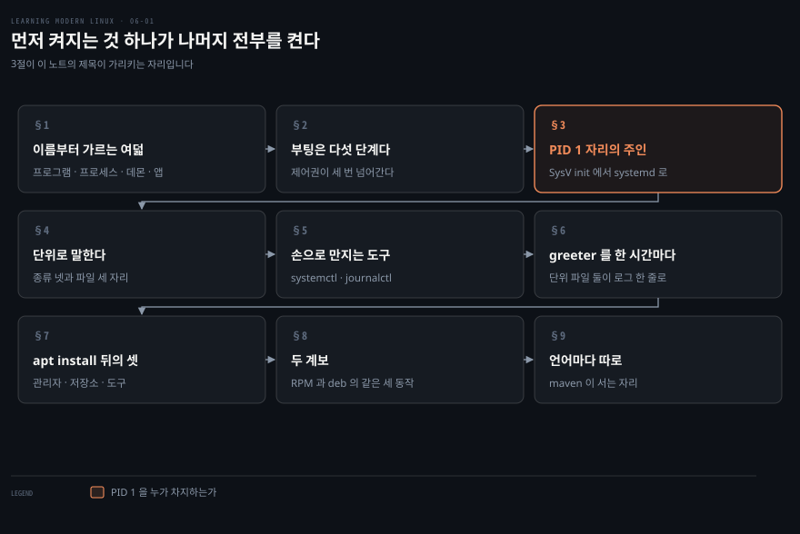
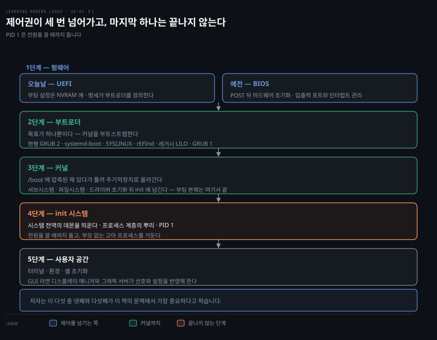
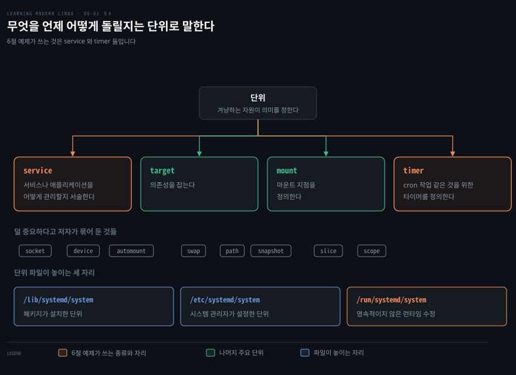
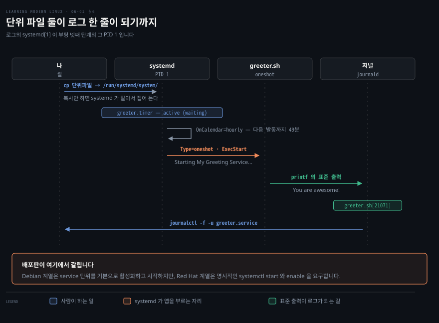
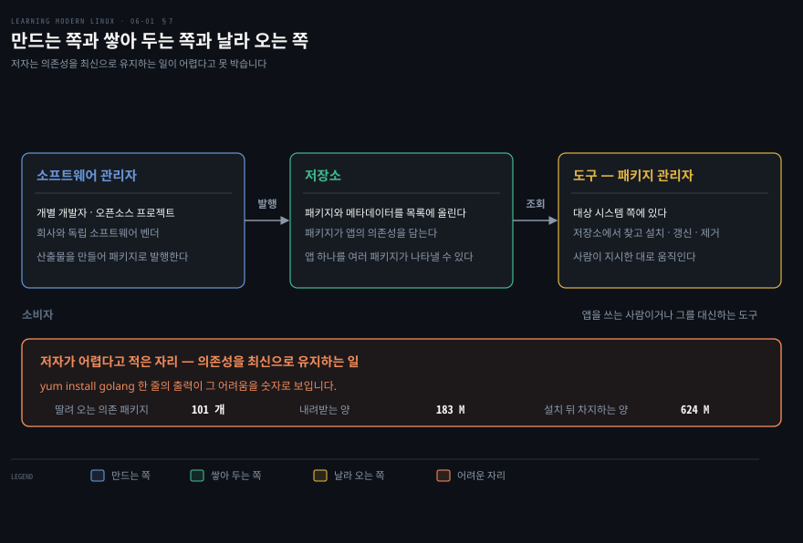
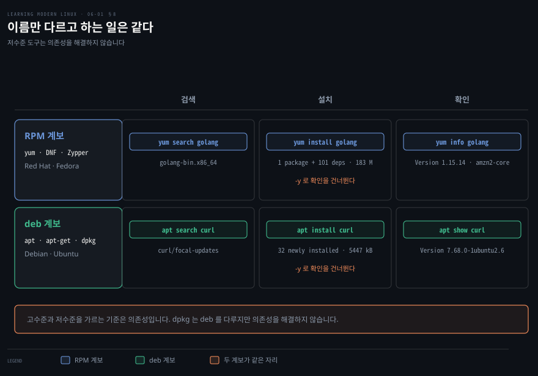

# 먼저 켜지는 것 하나가 나머지 전부를 켠다

---

> 6장은 리눅스에서 애플리케이션을 다루는 장입니다. 저자는 앱 이야기를 왜 이제서야 하는지부터 밝힙니다. 커널과 셸과 파일시스템과 보안이라는 선행 조건이 있어야 앱을 온전히 이해할 수 있고, 이제 그 위에 쌓을 수 있게 됐기 때문입니다. 이 노트는 그중 앞의 절반, 곧 앱을 띄우는 일과 가져오는 일을 다룹니다.

## 핵심 요약

> 이 구간이 매달린 하나의 생각은 **앱을 쓸 수 있게 만드는 일이 두 갈래**라는 것입니다. 시스템이 켜질 때 무엇을 띄울지 정하는 일과, 그 앱을 어디에서 가져올지 정하는 일입니다.

앞 갈래의 주인공은 PID 1 입니다. 저자가 부팅 다섯 단계에서 넷째 자리에 놓은 프로세스이고, 시스템 전역의 데몬을 띄우는 책임을 집니다. 이 프로세스는 프로세스 계층의 뿌리이며 전원을 끌 때까지 돕니다.

오늘날 그 자리를 차지한 것이 `systemd` 입니다. 저자는 `systemd` 가 앞선 init 시스템의 부족한 점을 어떻게 메웠는지를 셋으로 셉니다.

- 배포판을 가로질러 시작을 관리하는 **통일된 방식**을 줍니다.
- 더 빠르고 이해하기 쉬운 **서비스 설정**을 구현합니다.
- 모니터링과 cgroups 기반 자원 사용 제어와 내장 감사를 갖춘 **현대적 관리 도구 모음**을 제공합니다.

뒤 갈래의 주인공은 공급망입니다. 저자는 이것을 소비자에게 제품을 공급하는 조직과 개인의 체계라고 정의하고, 리눅스 앱 공급망을 세 자리로 가릅니다. 소프트웨어 관리자와 저장소와 도구입니다. 우리가 `apt install` 한 줄로 끝내는 일 뒤에 그 셋이 서 있습니다.


## 학습 목표

> 이 구간을 읽고 나면 아래 다섯 가지를 스스로 해낼 수 있습니다.

1. 프로그램·프로세스·데몬·애플리케이션·패키지를 구분해 말할 수 있습니다.
2. 부팅 다섯 단계를 순서대로 설명하고 어디에서 커널이 손을 떼는지 짚을 수 있습니다.
3. PID 1 이 지는 두 가지 책임을 말할 수 있습니다.
4. `systemd` 의 단위 종류와 단위 파일이 놓이는 세 자리를 구분할 수 있습니다.
5. 리눅스 앱 공급망의 세 행위자를 들고 패키지 관리자가 어디에 서는지 말할 수 있습니다.

아래는 이 문서 전체를 읽는 순서로 이은 지도입니다. 칸마다 절 번호와 그 절이 답하는 물음 하나를 적었습니다. 색이 붙은 칸이 이 노트의 제목이 가리키는 자리입니다.




## 이 문서가 다루지 않는 것

> 6장은 길어서 노트를 둘로 나눴습니다. 그 경계와, 저자가 스스로 미룬 것을 함께 적습니다.

- 컨테이너 전반 → 저자 자신의 전환 문장을 따라 [다음 노트](./06-02.%EC%BB%A8%ED%85%8C%EC%9D%B4%EB%84%88%EC%9D%98%20%EC%83%88%EB%A1%9C%EC%9B%80%EC%9D%80%20%EC%9E%AC%EB%A3%8C%EA%B0%80%20%EC%95%84%EB%8B%88%EB%9D%BC%20%EC%A1%B0%ED%95%A9%EC%97%90%20%EC%9E%88%EB%8B%A4.md)로 넘깁니다
- 모던 패키지 관리자 → 컨테이너를 쓰는 쪽이라 같은 이유로 다음 노트에 둡니다
- init 시스템 전반의 비교 → 저자가 Gentoo 위키의 비교를 가리키며 논의를 `systemd` 로 제한한다고 밝힙니다
- `journalctl` 의 상세 → 8장 관측에서 다시 본다고 예고합니다
- 각 패키지 관리자의 전체 명령 → 검색·설치·확인 세 동작만 예로 듭니다

5장에서 본 파일시스템이 여기에서 바로 쓰입니다. 커널이 `/boot` 에서 압축된 채 기다리고, 단위 파일이 `/lib`·`/etc`·`/run` 셋으로 갈리는 것이 모두 [앞 노트](./05-01.%EB%AA%A8%EB%93%A0%20%EA%B2%83%EC%9D%B4%20%ED%8C%8C%EC%9D%BC%EC%9D%B4%EB%9D%BC%EB%8A%94%20%EB%A7%90%EC%9D%80%20%EC%86%90%EC%9E%A1%EC%9D%B4%EA%B0%80%20%ED%95%98%EB%82%98%EB%9D%BC%EB%8A%94%20%EB%9C%BB%EC%9D%B4%EB%8B%A4.md)의 배치 표 위에 있습니다.


## 1. 이름부터 가르는 여덟

> 앱이라는 말은 프로그램·바이너리·실행 파일과 뒤섞여 쓰입니다. 저자는 그 뒤섞임을 먼저 풉니다.

저자가 세는 여덟은 이렇습니다.

**프로그램**은 보통 리눅스가 메모리에 적재해 실행할 수 있는 바이너리 파일이거나 셸 스크립트입니다. 실행 파일이라고도 부릅니다. 실행 파일의 종류가 무엇이 그것을 돌릴지 정합니다. 셸 스크립트라면 셸이 해석하고 실행합니다.

**프로세스**는 프로그램에 기반해 도는 실체입니다. 주기억장치에 적재되어 있고, 잠들어 있지 않을 때는 CPU 나 입출력을 씁니다.

**데몬**은 데몬 프로세스의 줄임이고 서비스라고도 부릅니다. 다른 프로세스에 특정 기능을 제공하는 백그라운드 프로세스입니다. 프린터 데몬이 있어야 인쇄를 할 수 있는 식입니다.

**애플리케이션**은 의존성을 포함한 프로그램입니다. 보통 사용자 인터페이스를 갖춘 큰 프로그램을 가리킵니다. 저자는 이 말에 생애 주기 전체가 붙어 있다고 덧붙입니다. 찾고 설치하는 일에서 업그레이드하고 제거하는 일까지, 그리고 설정과 데이터까지입니다.

**패키지**는 프로그램과 설정을 담은 파일이며 소프트웨어 애플리케이션을 배포하는 데 씁니다.

**패키지 관리자**는 패키지를 입력으로 받아, 그 내용과 사용자의 지시에 따라 리눅스 환경에 설치하거나 업그레이드하거나 제거하는 프로그램입니다.

**공급망**은 패키지를 기반으로 애플리케이션을 찾아 쓸 수 있게 해 주는 소프트웨어 생산자와 배포자의 모음입니다.

**부팅**은 하드웨어와 운영체제 초기화 단계를 포함하는 시작 순서입니다. 커널을 적재하고 서비스 프로그램을 띄워 리눅스를 쓸 수 있는 상태로 만드는 것이 목표입니다.

이 여덟 중 넷은 앞 장들이 이미 다룬 것입니다. 프로세스는 2장에서, 셸 스크립트는 3장에서, 파일 권한은 4장에서, 파일시스템 배치는 5장에서 봤습니다. 저자가 앱을 마지막에 놓은 이유가 그 목록입니다.


## 2. 부팅은 다섯 단계다

> 전원 버튼을 누른 순간부터 셸 프롬프트가 뜰 때까지, 하드웨어와 커널이 번갈아 일합니다. 그 사이에 제어권이 세 번 넘어갑니다.



**첫째, 펌웨어입니다.** 오늘날 환경에서는 UEFI 명세가 부팅 설정과 부트로더를 정의합니다. 설정은 NVRAM 에 저장됩니다. 예전 시스템에서는 POST 가 끝난 뒤 BIOS 가 하드웨어를 초기화하고 부트로더에 제어를 넘겼습니다. BIOS 가 하는 초기화는 입출력 포트와 인터럽트를 관리하는 일입니다.

**둘째, 부트로더입니다.** 목표가 하나뿐입니다. 커널을 부트스트랩하는 것입니다. 부팅 매체에 따라 세부는 조금씩 다릅니다. 현행 선택지로 GRUB 2·systemd-boot·SYSLINUX·rEFInd 가 있고, 레거시로 LILO 와 GRUB 1 이 있습니다.

**셋째, 커널입니다.** 커널은 보통 `/boot` 디렉토리에 압축된 형태로 있습니다. 그래서 첫 걸음이 풀어서 주기억장치에 적재하는 일입니다. 서브시스템과 파일시스템과 드라이버를 초기화한 뒤 커널은 init 시스템에 제어를 넘깁니다. 저자는 여기에서 부팅 과정 본체가 끝난다고 못 박습니다.

**넷째, init 시스템입니다.** 시스템 전역의 데몬을 띄우는 책임을 집니다. 이 프로세스는 프로세스 계층의 뿌리이며 그래서 PID 1 을 갖습니다. 저자의 표현이 분명합니다. PID 1 프로세스는 전원을 끌 때까지 돕니다. 다른 데몬을 띄우는 일 말고도 전통적으로 고아 프로세스를 거두는 일을 맡습니다. 부모 프로세스가 더 이상 없는 프로세스들입니다.

**다섯째, 사용자 공간 초기화입니다.** 환경에 따라 다릅니다. 보통 터미널과 환경과 셸의 초기화가 일어납니다. GUI 데스크톱 환경이라면 디스플레이 매니저와 그래픽 서버 같은 것들이 사용자 선호와 설정을 반영해 뜹니다.

저자는 이 다섯 중 넷째와 다섯째가 이 책의 문맥에서 가장 중요하다고 적습니다. 리눅스 설치를 손보고 확장할 수 있는 자리가 거기이기 때문입니다.


## 3. PID 1 자리를 누가 차지해 왔는가

> 데몬을 띄우는 자리는 하나인데 그 자리에 앉은 프로그램은 바뀌어 왔습니다. 무엇이 부족해서 바뀌었는지가 이 절의 내용입니다.

전통적인 자리 주인은 System V 계열 init 프로그램이었습니다. 줄여서 SysV init 이라 부르고 리눅스가 유닉스에서 물려받은 것입니다. 이 방식은 런레벨을 정의합니다. `halt`·`single-user`·`multi-user`·GUI 모드 같은 시스템 상태입니다. 설정은 보통 `/etc/init.d` 에 저장했습니다.

문제는 둘이었습니다. 데몬을 순차적으로 시작한다는 점과, 설정 처리가 배포판마다 달랐다는 점입니다. 그 결과 이식성이 좋지 않았습니다.

저자가 재미있는 사실 하나를 덧붙입니다. 이 책의 감수자 중 한 사람인 Chris 가 1984년경 SysV init 을 처음 문서화했고, 그것을 설계한 엔지니어는 주말 동안 만들었다고 전해진다는 것입니다.

### systemd 가 메운 것

`systemd` 는 처음에는 init 시스템이었습니다. 지금은 로깅과 네트워크 설정과 네트워크 시간 동기화 같은 기능을 포함하는 강력한 관리자입니다. 데몬과 그 의존성을 유연하고 이식성 있게 정의하는 방법과, 설정을 제어하는 균일한 인터페이스를 제공합니다.

> **원문 정오 (경미)**: 저자는 `systemd` 를 "`initd` 를 대체하는 것" 이라고 적습니다. 리눅스에 `initd` 라는 프로그램은 없습니다. SysV 계열의 PID 1 프로그램은 `init` 이고, `/etc/init.d` 는 그 시작 스크립트가 놓이는 디렉토리 이름입니다. 검색할 때 `initd` 로 찾으면 아무것도 나오지 않으니 `init` 이나 `SysV init` 으로 읽는 편이 맞습니다.

거의 모든 현행 리눅스 배포판이 `systemd` 를 씁니다. 저자가 적는 채택 시점은 이렇습니다.

| 배포판 | 채택 시점 |
|---|---|
| Fedora | 2011년 5월 |
| openSUSE | 2012년 9월 |
| CentOS | 2014년 4월 |
| RHEL | 2014년 6월 |
| SUSE Linux | 2014년 10월 |
| Debian | 2015년 4월 |
| Ubuntu | 2015년 4월 |

앞의 부족한 점을 `systemd` 가 메운 방식은 셋입니다. 배포판을 가로질러 시작을 관리하는 통일된 방법을 준 것, 더 빠르고 이해하기 쉬운 서비스 설정을 구현한 것, 모니터링과 cgroups 기반 자원 사용 제어와 내장 감사를 갖춘 현대적 관리 도구 모음을 제공한 것입니다.

속도 이야기가 특히 구체적입니다. init 은 초기화 시점에 서비스를 순차적으로, 그러니까 알파벳과 숫자 순서로 시작합니다. `systemd` 는 의존성이 충족된 서비스라면 무엇이든 시작할 수 있으므로 시작 시간이 줄어들 수 있습니다.


## 4. 무엇을 언제 어떻게 돌릴지는 단위로 말한다

> `systemd` 에게 지시하는 방법은 단위 하나뿐입니다. 그 단위가 무엇을 겨냥하느냐에 따라 의미가 갈립니다.



종류가 열둘이나 되고 파일을 둘 자리도 셋이라 처음 보면 어디부터 손대야 할지가 막막합니다. 그런데 실제로 손이 자주 가는 것은 몇 개뿐입니다.

`systemd` 의 단위는 논리적 묶음이고, 그 기능이나 겨냥하는 자원에 따라 의미가 달라집니다.

저자가 주요하다고 꼽는 넷은 이렇습니다. **service 단위**는 서비스나 애플리케이션을 어떻게 관리할지 서술합니다. **target 단위**는 의존성을 잡습니다. **mount 단위**는 마운트 지점을 정의합니다. **timer 단위**는 cron 작업 같은 것을 위한 타이머를 정의합니다.

덜 중요하다고 저자가 묶어 둔 것들도 이름은 알아 둘 만합니다.

- `socket` 은 네트워크나 IPC 소켓을 서술합니다.
- `device` 는 udev 나 sysfs 파일시스템을 위한 것입니다.
- `automount` 는 자동 마운트 지점을 설정합니다.
- `swap` 은 스왑 공간을 서술합니다.
- `path` 는 경로 기반 활성화를 위한 것입니다.
- `snapshot` 은 변경 이후 현재 시스템 상태를 재구성하게 해 줍니다.
- `slice` 는 cgroups 와 엮입니다.
- `scope` 는 외부에서 만들어진 시스템 프로세스 집합을 관리합니다.

`systemd` 가 단위를 알려면 그것이 파일로 직렬화되어 있어야 합니다. 저자가 꼽는 중요한 세 자리는 이렇습니다.

| 경로 | 무엇이 놓이나 |
|---|---|
| `/lib/systemd/system` | 패키지가 설치한 단위 |
| `/etc/systemd/system` | 시스템 관리자가 설정한 단위 |
| `/run/systemd/system` | 영속적이지 않은 런타임 수정 |

`/lib` 과 `/etc` 는 5장의 최상위 디렉토리 표에 있던 것입니다. 각각 공유 시스템 라이브러리와 시스템 설정 파일이었습니다.

`/run` 은 그 표에 없습니다. 5장이 정의한 적이 없으니 여기가 처음입니다. 저자가 이 자리에 붙인 설명이 그 정의를 대신합니다. 영속적이지 않은 런타임 수정이 놓이는 자리, 곧 재부팅을 넘기지 않는 자리입니다.


## 5. 손으로 만지는 도구들

> 단위를 정의했으면 다루는 명령이 필요합니다. `systemd` 에게 말을 거는 도구가 `systemctl` 입니다.

| 명령 | 쓰임새 |
|---|---|
| `systemctl enable XXXXX.service` | 서비스를 활성화합니다. 시작할 준비가 됩니다 |
| `systemctl daemon-reload` | 모든 단위 파일을 다시 읽고 의존성 트리 전체를 다시 만듭니다 |
| `systemctl start XXXXX.service` | 서비스를 시작합니다 |
| `systemctl stop XXXXX.service` | 서비스를 멈춥니다 |
| `systemctl restart XXXXX.service` | 멈춘 뒤 다시 시작합니다 |
| `systemctl reload XXXXX.service` | 서비스에 reload 를 지시하며, 안 되면 재시작으로 물러섭니다 |
| `systemctl kill XXXXX.service` | 서비스 실행을 중단합니다 |
| `systemctl status XXXXX.service` | 로그 몇 줄을 포함한 짧은 상태 요약을 얻습니다 |

저자는 `systemctl` 이 이보다 훨씬 많은 명령을 제공한다고 덧붙입니다. 의존성 관리와 질의부터 `reboot` 같은 전체 시스템 제어까지입니다.

생태계의 다른 명령줄 도구도 셋 짚습니다. `bootctl` 은 부트로더 상태를 확인하고 사용 가능한 부트로더를 관리하게 해 줍니다. `timedatectl` 은 시간과 날짜 관련 정보를 설정하고 봅니다. `coredumpctl` 은 저장된 코어 덤프를 처리하게 해 주며, 저자는 문제를 파고들 때 이 도구를 떠올리라고 적습니다.

로그 쪽은 `journalctl` 입니다. 저널은 `systemd` 의 구성요소입니다. 기술적으로는 `systemd-journald` 데몬이 관리하는 바이너리 파일입니다. `systemd` 구성요소가 남기는 모든 메시지의 중앙 저장소가 여기입니다. 자세한 것은 8장으로 미루고, 지금은 `systemd` 가 관리하는 로그를 보는 도구라는 것만 알면 됩니다.


## 6. greeter 를 한 시간마다 돌려 보기

> 이론이 길었으니 저자는 예제를 하나 끝까지 굴립니다. 단위 파일 둘을 쓰고, 자리에 놓고, 상태와 로그를 확인하는 순서입니다.



타이머를 걸어 두면 다음 물음이 곧바로 따라옵니다. 정말 돌았는지를 어떻게 확인하느냐입니다. 이 예제가 끝까지 굴러가는 이유가 그 확인까지 보이기 위해서입니다.

이 장의 예제는 `greeter` 라는 셸 스크립트입니다. 이름을 주면 그 이름으로 인사하고, 없으면 대신 다른 인사를 찍습니다.

```bash
#!/usr/bin/env bash
set -o errexit
set -o errtrace
set -o pipefail

name="${1}"

if [ -z "$name" ]
then
  printf "You are awesome!\n"
else
  printf "Hello %s, you are awesome!\n" ${name}
fi
```

저자는 이 파일을 `chmod 750 greeter.sh` 로 실행 가능하게 만들라고 하면서, 그 뜻이 기억나지 않으면 4장의 파일 권한 절을 다시 보라고 적습니다. 3장에서 본 스켈레톤 세 줄이 여기에 그대로 들어 있는 것도 눈에 띕니다.

먼저 service 타입 단위 파일을 씁니다.

```bash
[Unit]
Description=My Greeting Service

[Service]
Type=oneshot
ExecStart=/home/mh9/greeter.sh
```

`Description` 은 `systemctl status` 를 쓸 때 보이는 설명이고 `ExecStart` 는 앱의 위치입니다.

다음은 한 시간마다 그 서비스를 띄울 timer 단위입니다.

```bash
[Unit]
Description=Runs Greeting service at the top of the hour

[Timer]
OnCalendar=hourly
```

`OnCalendar` 가 `systemd` 의 시간과 날짜 형식으로 일정을 정의합니다.

두 파일을 `/run/systemd/system` 에 복사하면 `systemd` 가 알아봅니다.

```bash
sudo ls -al /run/systemd/system/
```

```bash
total 8
drwxr-xr-x  2 root root  80 Sep 12 13:08 .
drwxr-xr-x 21 root root 500 Sep 12 13:09 ..
-rw-r--r--  1 root root 117 Sep 12 13:08 greeter.service
-rw-r--r--  1 root root 107 Sep 12 13:08 greeter.timer
```

여기서 저자가 배포판 차이를 하나 못 박습니다. Ubuntu 같은 Debian 계열 시스템은 service 단위를 기본으로 활성화하고 시작합니다. Red Hat 계열은 명시적인 `systemctl start greeter.timer` 없이는 서비스를 시작하지 않습니다. 부팅 시 활성화도 마찬가지여서 Debian 계열은 기본으로 활성화하고 Red Hat 계열은 `systemctl enable` 이라는 명시적 확인을 요구합니다.

상태를 봅니다.

```bash
sudo systemctl status greeter.timer
```

```bash
● greeter.timer - Runs Greeting service at the top of the hour
   Loaded: loaded (/run/systemd/system/greeter.timer; static; vendor preset: enabled)
   Active: active (waiting) since Sun 2021-09-12 13:10:35 IST; 2s ago
  Trigger: Sun 2021-09-12 14:00:00 IST; 49min left
```

`Active: active (waiting)` 와 `Trigger` 줄이 이 출력의 핵심입니다. 타이머가 살아 있고 다음 발동까지 49분 남았다는 뜻입니다.

정말 돌았는지는 로그로 확인합니다.

```bash
journalctl -f -u greeter.service
```

```bash
-- Logs begin at Sun 2021-01-24 14:36:30 GMT. --
Sep 12 14:00:01 starlite systemd[1]: Starting My Greeting Service...
Sep 12 14:00:01 starlite greeter.sh[21071]: You are awesome!
```

`-u` 로 단위를 고르고 `-f` 로 따라갑니다. 저자는 표준 출력이 곧바로 로그로 간다고 덧붙이는데, 그래서 스크립트의 `printf` 결과가 저널에 그대로 찍혀 있습니다.

로그의 `systemd[1]` 이라는 표기도 그냥 지나칠 것이 아닙니다. 대괄호 안의 1 이 앞 절에서 본 PID 1 입니다. 이 한 줄이 부팅 넷째 단계와 지금 돌아가는 타이머를 잇습니다.


## 7. `apt install` 한 줄 뒤에 서 있는 셋

> 명령 하나로 앱이 생기는 일이 당연해 보이지만, 그 뒤에는 물건을 만들고 쌓아 두고 날라 주는 체계가 있습니다.



저자는 공급망을 먼저 일반적인 말로 정의합니다. 소비자에게 제품을 공급하는 조직과 개인의 체계입니다. 평소에는 별로 생각하지 않지만 음식을 사거나 차에 기름을 넣을 때마다 공급망을 상대하고 있다는 것입니다.

여기서 제품은 소프트웨어 산출물로 이루어진 애플리케이션이고, 소비자는 앱을 쓰는 사람이거나 그 사람을 대신해 앱을 관리하는 도구입니다.

리눅스 앱 공급망의 세 자리는 이렇습니다.

**소프트웨어 관리자**는 개별 개발자와 오픈소스 프로젝트와 회사입니다. 독립 소프트웨어 벤더도 여기 듭니다. 이들이 소프트웨어 산출물을 만들어 패키지 형태로 저장소에 발행합니다.

**저장소**는 앱의 전부나 일부를 담은 패키지를 메타데이터와 함께 목록에 올립니다. 패키지는 보통 앱의 의존성을 담습니다. 의존성이란 앱이 동작하려면 필요한 다른 패키지들입니다. 라이브러리일 수도 있고 익스포터나 임포터일 수도 있고 다른 서비스 프로그램일 수도 있습니다. 저자는 여기에 한 줄을 덧붙입니다. 이 의존성을 최신으로 유지하는 일은 어렵습니다.

**도구**, 곧 패키지 관리자는 대상 시스템 쪽에 있습니다. 저장소에서 패키지를 찾고, 사람이 지시한 대로 앱을 설치하고 갱신하고 제거합니다. 앱과 그 의존성을 하나 이상의 패키지가 나타낼 수 있다는 점도 저자가 짚습니다.

배포판마다 세부가 다르고 환경이 서버냐 데스크톱이냐에 따라서도 달라지지만, 이 세 요소는 어느 공급망에나 공통입니다.

패키지와 의존성 관리의 선택지는 세 범주로 갈립니다.

- **전통 패키지 관리자**는 다시 저수준과 고수준으로 나뉩니다. 의존성을 해결하고 설치·갱신·제거라는 고수준 인터페이스를 제공하면 고수준 패키지 관리자라 부릅니다.
- **컨테이너 기반 해법**은 처음에 서버와 클라우드 컴퓨팅 영역에서 나왔습니다. 애플리케이션 관리는 그 능력으로 할 수 있는 한 가지 쓰임새이지 반드시 주된 쓰임새는 아닙니다. 저자는 개발자라면 컨테이너를 좋아하게 될 것이라고 적는데, 시험해 보기 쉽고 배포 준비가 된 앱을 실어 보내기가 간단하기 때문입니다.
- **모던 패키지 관리자**는 데스크톱 환경에 뿌리를 둡니다. 최종 사용자가 앱을 최대한 쉽게 쓰게 하는 것이 목표입니다.


## 8. 두 계보 — RPM 과 deb

> 오래 쓰인 패키지 형식은 크게 둘입니다. Red Hat 계열과 Debian 계열이고, 검색하고 설치하고 확인하는 동작은 같은데 명령 이름이 다릅니다.



**RPM** 은 재귀 약어이며 원래 Red Hat 이 만들었지만 지금은 여러 배포판에서 널리 쓰입니다. `.rpm` 파일 형식은 Linux Standard Base 에 쓰이고 바이너리나 소스 파일을 담을 수 있습니다. 패키지는 암호학적으로 검증할 수 있고 패치 파일을 통한 델타 업데이트를 지원합니다.

RPM 을 쓰는 패키지 관리자는 셋입니다. `yum` 은 Amazon Linux·CentOS·Fedora·RHEL 에서, DNF 는 CentOS·Fedora·RHEL 에서, Zypper 는 openSUSE 와 SUSE Linux Enterprise 에서 씁니다.

저자는 새 개발 환경에 Go 툴체인을 설치하는 예를 듭니다.

```bash
yum search golang
```

```bash
================= N/S matched: golang =================
golang-bin.x86_64 : Golang core compiler tools
golang-docs.noarch : Golang compiler docs
golang-googlecode-net-devel.noarch : Supplementary Go networking libraries
```

프롬프트가 `#` 인 것을 저자가 스스로 짚습니다. `root` 로 로그인해 있다는 뜻이고, 더 나은 방법은 `sudo yum` 이었을 거라고 덧붙입니다.

```bash
yum install golang
```

```bash
Transaction Summary
==========================================================================
Install  1 Package (+101 Dependent packages)

Total download size: 183 M
Installed size: 624 M
Is this ok [y/d/N]: y
```

숫자가 이 예의 요점입니다. Go 패키지 하나를 넣으려는데 의존 패키지가 101개 딸려 옵니다. 내려받는 양이 183MB 이고 설치되고 나면 624MB 를 씁니다. 앞 절에서 저자가 "의존성을 최신으로 유지하는 일은 어렵다" 고 적은 문장이 이 표에서 숫자로 보입니다.

스크립트 안에서는 대화형 확인이 곤란하므로 `yum install golang -y` 형태를 쓴다고 저자가 덧붙입니다.

```bash
yum info golang
```

```bash
Installed Packages
Name        : golang
Arch        : x86_64
Version     : 1.15.14
Release     : 1.amzn2.0.1
Size        : 7.8 M
Repo        : installed
From repo   : amzn2-core
```

**deb** 패키지와 `.deb` 파일 형식은 Debian 배포판에서 왔습니다. 역시 바이너리나 소스 파일을 담습니다. 여러 패키지 관리자가 deb 를 쓰는데, 의존성 관리를 하지 않는 저수준 도구로 `dpkg` 가 있고 고수준 도구로 `apt-get`·`apt`·`aptitude` 가 있습니다. Ubuntu 가 Debian 계열이라 deb 패키지는 데스크톱과 서버 양쪽에서 널리 쓰입니다.

```bash
apt search curl
```

```bash
curl/focal-updates,focal-security 7.68.0-1ubuntu2.6 amd64
  command line tool for transferring data with URL syntax

curlftpfs/focal 0.9.2-9build1 amd64
  filesystem to access FTP hosts based on FUSE and cURL
```

```bash
apt install curl
```

```bash
0 upgraded, 32 newly installed, 0 to remove and 2 not upgraded.
Need to get 5447 kB of archives.
After this operation, 16.7 MB of additional disk space will be used.
Do you want to continue? [Y/n]
```

```bash
apt show curl
```

```bash
Package: curl
Version: 7.68.0-1ubuntu2.6
Priority: optional
Section: web
Origin: Ubuntu
Installed-Size: 411 kB
Depends: libc6 (>= 2.17), libcurl4 (= 7.68.0-1ubuntu2.6), zlib1g (>= 1:1.1
APT-Manual-Installed: yes
```

두 계보를 나란히 놓으면 동작이 하나씩 짝을 이룹니다. 검색은 `yum search` 와 `apt search` 입니다. 설치는 `yum install` 과 `apt install` 이고 확인은 `yum info` 와 `apt show` 입니다. 자동 승인 플래그도 양쪽 다 `-y` 로 같습니다.


## 9. 언어마다 따로 있는 것들

> 배포판 패키지 관리자 위에 언어별 패키지 관리자가 또 있습니다. 자바를 쓰는 사람이라면 이미 매일 쓰고 있는 층입니다.

저자가 세는 목록은 이렇습니다.

| 언어 | 패키지 관리자 |
|---|---|
| C/C++ | Conan, vcpkg 를 비롯해 여럿 |
| Go | 언어에 내장 — `go get`, `go mod` |
| Node.js | npm 을 비롯해 여럿 |
| Java | maven, nuts 를 비롯해 여럿 |
| Python | pip, PyPM |
| Ruby | rubygems, Rails |
| Rust | cargo |

> **원문 정오 (경미)**: Ruby 칸의 Rails 는 패키지 관리자가 아니라 웹 애플리케이션 프레임워크입니다. Ruby 생태계에서 패키지 형식과 그 도구는 RubyGems 이고, 프로젝트 단위로 의존성을 잠그고 해결하는 도구는 Bundler 입니다. Rails 는 그 Bundler 를 쓰는 쪽입니다.

이 표가 왜 여기 있는지가 다음 노트의 출발점이 됩니다. 배포판 패키지 관리자는 시스템 전역에 하나의 버전만 둘 수 있는데, 언어별 관리자는 프로젝트마다 다른 버전을 요구합니다. 그 어긋남을 프로세스 단위로 가둬 버리는 방법이 컨테이너입니다.


## 심화 학습

> 이 구간은 원서가 이름만 대고 넘어가는 자리를 표시합니다.

- **`Type=oneshot` 이 왜 필요한지는 설명되지 않습니다.** 타이머가 부르는 서비스는 실행하고 끝나는 종류라 `systemd` 가 그 프로세스의 종료를 실패로 보지 않아야 합니다. 기본값인 `simple` 로 두면 의미가 달라집니다. 저자는 값만 적고 이유는 적지 않습니다.
- **단위 파일 세 자리의 우선순위가 나오지 않습니다.** 같은 이름의 단위가 여러 자리에 있으면 어느 쪽이 이기는지가 실무에서 자주 문제가 되는데, 저자는 각 자리의 성격만 적습니다.
- **패키지 서명 검증이 한 줄로 끝납니다.** RPM 이 암호학적으로 검증될 수 있다고만 적고, 그 서명을 누가 어떻게 신뢰하게 되는지는 다루지 않습니다. 앞 절의 공급망 그림에서 신뢰가 실제로 걸리는 지점이 거기입니다.
- **101개 의존 패키지를 저자가 세지 않고 지나갑니다.** 출력에는 숫자가 찍혀 있지만 본문은 그것을 논점으로 삼지 않습니다. 컨테이너로 넘어가는 동기가 이 숫자 안에 있습니다.


## 결정 치트시트

> 이 구간이 판단으로 이어지는 자리를 모았습니다. 근거는 본문입니다.

| 상황 | 선택 | 이유 |
|---|---|---|
| 부팅할 때 자동으로 뜨게 하려면 | `systemctl enable` | Red Hat 계열은 명시적 확인을 요구합니다 |
| 지금 당장 돌리려면 | `systemctl start` | `enable` 은 시작할 준비만 시킵니다 |
| 재부팅을 넘기지 않을 임시 단위 | `/run/systemd/system` | 영속적이지 않은 런타임 수정 자리입니다 |
| 패키지가 깔아 준 단위를 고치려면 | `/etc/systemd/system` | 관리자 설정 자리라 패키지 갱신에 덮이지 않습니다 |
| 단위 파일을 고친 뒤 | `systemctl daemon-reload` | 의존성 트리 전체를 다시 만들어야 반영됩니다 |
| 서비스가 왜 안 도는지 볼 때 | `journalctl -u <단위>` | 표준 출력이 그대로 저널에 갑니다 |
| 스크립트 안에서 패키지를 깔 때 | `-y` 플래그 | 대화형 확인이 스크립트를 멈춰 세웁니다 |
| 프로젝트마다 다른 버전이 필요할 때 | 언어별 관리자나 컨테이너 | 배포판 관리자는 시스템 전역에 한 벌만 둡니다 |


## 적용 관점

> Spring 으로 자바를 쓰다가 컨테이너와 쿠버네티스로 넘어온 사람에게 이 구간이 어디에서 되돌아오는지를 적습니다.

**컨테이너 안에는 PID 1 이 있지만 `systemd` 는 없습니다.** 이 노트가 설명한 PID 1 의 두 책임 중 하나가 고아 프로세스를 거두는 일인데, 컨테이너에서는 여러분의 앱이 PID 1 이 됩니다. 자바 프로세스는 그 일을 하도록 만들어지지 않았습니다. 좀비 프로세스가 쌓이거나 `SIGTERM` 이 처리되지 않아 파드 종료가 30초를 꽉 채우는 사고가 여기에서 나옵니다. `tini` 나 `dumb-init` 을 넣거나 `shareProcessNamespace` 를 쓰는 처방이 모두 이 절의 넷째 단계를 대신하는 것입니다.

**`journalctl -u <단위>` 가 `kubectl logs <파드>` 의 자리입니다.** 표준 출력이 그대로 로그 수집기로 간다는 구조도 같습니다. Spring Boot 애플리케이션이 파일 대신 표준 출력으로 로그를 뱉도록 설정하라는 관례가 왜 생겼는지가 이 대응에서 설명됩니다.

**`systemd` timer 와 쿠버네티스 `CronJob` 이 같은 문제를 풉니다.** `OnCalendar=hourly` 가 `schedule: "0 * * * *"` 이고, `Type=oneshot` 이 실행하고 끝나는 Job 의 성격입니다. 온프레미스 배치를 쿠버네티스로 옮길 때 이 대응이 그대로 쓰입니다.

**maven 이 이 장의 언어별 관리자 층입니다.** `pom.xml` 이 의존성을 선언하면 maven 이 중앙 저장소에서 받아 옵니다. 이 노트의 공급망 그림에서 소프트웨어 관리자·저장소·도구가 각각 라이브러리 개발자·Maven Central·maven 입니다. 컨테이너 이미지는 그 결과물인 jar 를 다시 한 겹 싸는 층이라, 층이 둘 쌓이는 셈입니다.

**의존 패키지 101개라는 숫자가 컨테이너의 동기입니다.** 같은 기계에 두 앱이 서로 다른 버전을 요구하면 시스템 전역 패키지 관리자는 하나만 고를 수 있습니다. 그 충돌을 프로세스 단위로 가두는 방법이 다음 노트의 주제입니다.


## 면접에서 받을 만한 질문

> 답을 먼저 떠올린 뒤 아래 정답을 펼치는 것이 학습에 낫습니다.

1. 부팅 다섯 단계에서 커널이 손을 떼는 지점은 어디입니까?
2. PID 1 이 지는 책임 두 가지는 무엇입니까?
3. `systemd` 가 SysV init 보다 빨리 뜰 수 있는 이유는 무엇입니까?
4. 단위 파일을 `/etc/systemd/system` 에 두는 것과 `/run/systemd/system` 에 두는 것은 어떻게 다릅니까?
5. 컨테이너에서 자바 앱이 PID 1 로 돌 때 생기는 문제는 무엇입니까?


## 정답 (자답 후 펼치기)

<details>
<summary>1. 커널이 손을 떼는 지점</summary>

셋째 단계의 끝입니다. 커널은 `/boot` 에서 압축을 풀어 주기억장치에 적재되고, 서브시스템과 파일시스템과 드라이버를 초기화한 뒤 **init 시스템에 제어를 넘깁니다**. 저자는 이 지점에서 부팅 과정 본체가 끝난다고 못 박습니다.

그 뒤의 넷째와 다섯째 단계는 사용자 공간의 일이고, 저자가 이 책의 문맥에서 가장 중요하다고 꼽는 구간이기도 합니다.

</details>

<details>
<summary>2. PID 1 의 두 책임</summary>

첫째는 **시스템 전역의 데몬을 띄우는 일**입니다. 둘째는 **고아 프로세스를 거두는 일**입니다. 부모 프로세스가 더 이상 없는 프로세스들을 전통적으로 PID 1 이 맡습니다.

여기에 성격 하나가 더 붙습니다. PID 1 프로세스는 프로세스 계층의 뿌리이며 전원을 끌 때까지 돕니다.

</details>

<details>
<summary>3. systemd 가 빠른 이유</summary>

시작 순서를 정하는 기준이 다르기 때문입니다. init 은 초기화 시점에 서비스를 **순차적으로, 알파벳과 숫자 순서로** 시작합니다. `systemd` 는 **의존성이 충족된 서비스라면 무엇이든** 시작할 수 있습니다.

그래서 서로 무관한 서비스들이 동시에 뜰 수 있고 전체 시작 시간이 줄어듭니다.

</details>

<details>
<summary>4. `/etc` 와 `/run` 의 차이</summary>

`/etc/systemd/system` 은 **시스템 관리자가 설정한 단위**가 놓이는 자리이고 영속적입니다. `/run/systemd/system` 은 **영속적이지 않은 런타임 수정**을 위한 자리입니다.

5장의 최상위 디렉토리 표와 그대로 맞아떨어집니다. `/etc` 가 시스템 설정 파일 자리이고, `/run` 은 재부팅을 넘기지 않습니다. 원서의 예제가 타이머 단위를 `/run` 에 둔 것은 실습이라 남길 필요가 없었기 때문입니다.

</details>

<details>
<summary>5. 자바 앱이 PID 1 일 때</summary>

PID 1 의 두 책임을 자바 프로세스가 지게 되는데, 그렇게 만들어진 프로세스가 아니라서 둘 다 제대로 못 합니다.

**고아 프로세스를 거두지 못해** 좀비가 쌓입니다. 그리고 커널이 PID 1 에 대해서는 기본 시그널 처리를 적용하지 않으므로, 앱이 `SIGTERM` 핸들러를 등록하지 않았으면 **종료 신호가 무시됩니다**. 파드를 지웠는데 유예 기간을 꽉 채우고 강제 종료되는 증상이 그것입니다.

처방은 `tini` 나 `dumb-init` 같은 작은 init 을 PID 1 에 두거나, 앱이 `SIGTERM` 을 직접 처리하게 하는 것입니다. Spring Boot 는 후자를 기본으로 하므로 셸을 거치지 않고 실행되도록 `ENTRYPOINT` 를 exec 형식으로 쓰는 것이 중요합니다.

</details>


## 핵심 개념 체크리스트

- [ ] 프로그램·프로세스·데몬·애플리케이션을 구분해 말할 수 있는가?
- [ ] 부팅 다섯 단계를 순서대로 대고 제어권이 넘어가는 세 지점을 짚을 수 있는가?
- [ ] SysV init 의 두 가지 문제와 `systemd` 가 그것을 메운 방식을 말할 수 있는가?
- [ ] 단위 종류 넷과 단위 파일이 놓이는 세 자리를 아는가?
- [ ] 타이머 단위 하나가 로그 한 줄이 되기까지의 경로를 설명할 수 있는가?
- [ ] 공급망의 세 행위자를 들고 각자 무엇을 하는지 말할 수 있는가?
- [ ] RPM 계보와 deb 계보의 검색·설치·확인 명령을 짝지을 수 있는가?


## 관련 문서

- [Learning Modern Linux 정독 인덱스](./README.md) — 이 책의 장별 진행 상황
- [컨테이너의 새로움은 재료가 아니라 조합에 있다](./06-02.%EC%BB%A8%ED%85%8C%EC%9D%B4%EB%84%88%EC%9D%98%20%EC%83%88%EB%A1%9C%EC%9B%80%EC%9D%80%20%EC%9E%AC%EB%A3%8C%EA%B0%80%20%EC%95%84%EB%8B%88%EB%9D%BC%20%EC%A1%B0%ED%95%A9%EC%97%90%20%EC%9E%88%EB%8B%A4.md) — 같은 장의 뒤 절반
- [모든 것이 파일이라는 말은 손잡이가 하나라는 뜻이다](./05-01.%EB%AA%A8%EB%93%A0%20%EA%B2%83%EC%9D%B4%20%ED%8C%8C%EC%9D%BC%EC%9D%B4%EB%9D%BC%EB%8A%94%20%EB%A7%90%EC%9D%80%20%EC%86%90%EC%9E%A1%EC%9D%B4%EA%B0%80%20%ED%95%98%EB%82%98%EB%9D%BC%EB%8A%94%20%EB%9C%BB%EC%9D%B4%EB%8B%A4.md) — `/boot`·`/etc`·`/run` 이 정의된 자리


## 참고 자료

- 원서: 《Learning Modern Linux》 6장 Applications, Package Management, and Containers
- 서지: Michael Hausenblas, O'Reilly, 2022년
- [Gentoo 위키의 init 시스템 비교](https://wiki.gentoo.org/wiki/Comparison_of_init_systems) — 저자가 `systemd` 로 논의를 좁히며 가리킨 곳
- [systemd 프로젝트](https://systemd.io/) — 단위와 명령의 1차 자료
