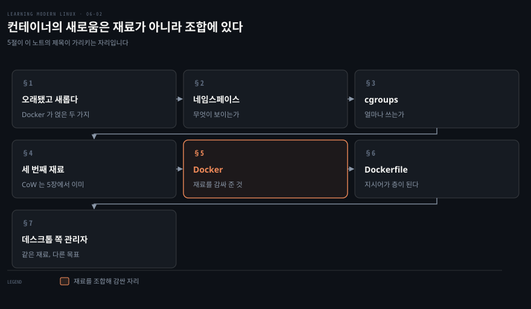
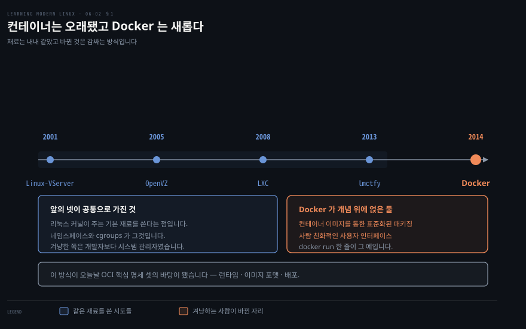
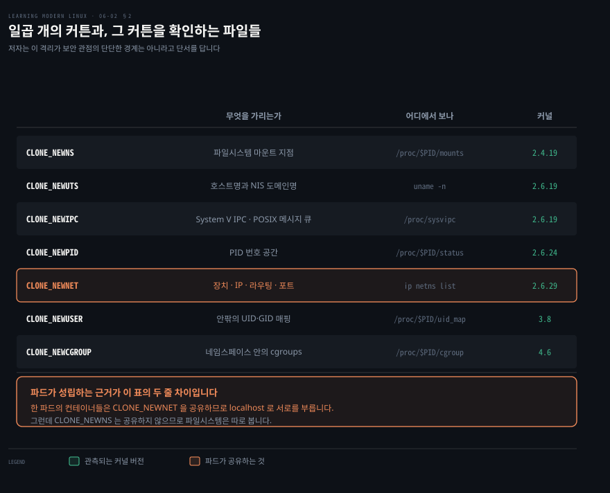
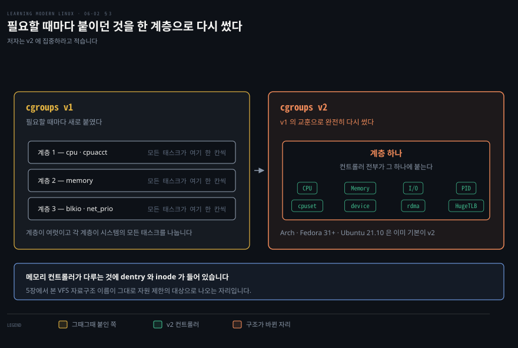
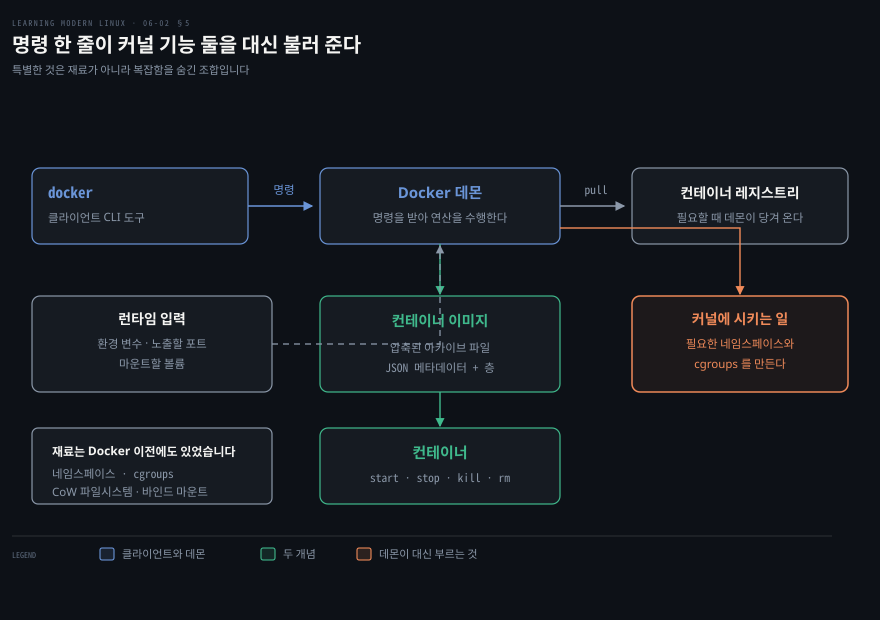
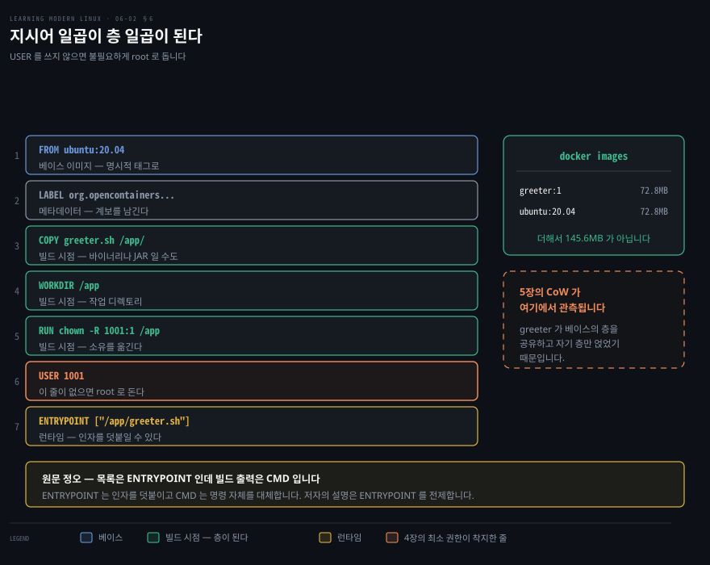

# 컨테이너의 새로움은 재료가 아니라 조합에 있다

---

> 6장의 뒤 절반은 컨테이너입니다. 저자가 이 구간에서 가장 힘주어 적는 문장이 하나 있습니다. Docker 가 특별한 것은 구성 재료가 아닙니다. 네임스페이스와 cgroups 와 CoW 파일시스템과 바인드 마운트는 Docker 이전에도 한동안 있었습니다. 특별한 것은 그 재료들을 낮은 층의 복잡함을 숨기는 방식으로 조합했다는 점입니다.

## 핵심 요약

> 이 구간이 매달린 하나의 생각은 **컨테이너가 새 커널 기능이 아니라 기존 커널 기능의 조합**이라는 것입니다.

저자의 정의부터가 조합입니다. 이 책의 문맥에서 컨테이너란 **리눅스 네임스페이스와 cgroups 를, 그리고 선택적으로 CoW 파일시스템을 쓰는 리눅스 프로세스 그룹**이며, 그렇게 해서 애플리케이션 수준의 의존성 관리를 제공하는 것입니다.

세 재료가 각각 다른 일을 합니다.

- **네임스페이스**는 무엇이 보이느냐를 정합니다. 자원 가시성의 문제입니다.
- **cgroups** 는 얼마나 쓸 수 있느냐를 정합니다. 자원 사용량의 문제입니다.
- **CoW 파일시스템**은 빌드 시점에 쓰이며, 앱과 의존성을 배포할 수 있는 자족적인 파일 하나로 묶습니다.

앞 노트가 남긴 숫자를 여기에서 다시 봅니다. Go 하나를 깔려는데 의존 패키지가 101개 딸려 오는 상황을, 컨테이너는 그 101개를 이미지 안에 함께 넣어 프로세스 단위로 가둬 버리는 방식으로 풉니다.


## 학습 목표

> 이 구간을 읽고 나면 아래 다섯 가지를 스스로 해낼 수 있습니다.

1. 컨테이너를 커널 기능의 조합으로 정의할 수 있습니다.
2. 네임스페이스를 만드는 시스템 콜 셋과 대표 플래그 일곱을 구분할 수 있습니다.
3. cgroups 가 네임스페이스와 무엇이 다른지 한 문장으로 말할 수 있습니다.
4. OCI 핵심 명세 셋이 각각 무엇을 정의하는지 말할 수 있습니다.
5. Dockerfile 의 지시어를 빌드 시점과 런타임으로 갈라 볼 수 있습니다.

아래는 이 문서 전체를 읽는 순서로 이은 지도입니다. 칸마다 절 번호와 그 절이 답하는 물음 하나를 적었습니다. 색이 붙은 칸이 이 노트의 제목이 가리키는 자리입니다.




## 이 문서가 다루지 않는 것

> 저자가 스스로 범위 밖에 둔 것과, 앞 노트로 넘긴 것을 적습니다.

- 용어·부팅·`systemd`·공급망·전통 패키지 관리자 → [앞 노트](./06-01.%EB%A8%BC%EC%A0%80%20%EC%BC%9C%EC%A7%80%EB%8A%94%20%EA%B2%83%20%ED%95%98%EB%82%98%EA%B0%80%20%EB%82%98%EB%A8%B8%EC%A7%80%20%EC%A0%84%EB%B6%80%EB%A5%BC%20%EC%BC%A0%EB%8B%A4.md)가 다룹니다
- CoW 파일시스템의 원리 → 5장에서 자세히 다뤘다며 저자가 여기서는 한 문단으로 줄입니다
- 컨테이너 오케스트레이션 → 쿠버네티스는 쓰임새로 한 번 언급될 뿐입니다
- Docker 명령의 전체 레퍼런스 → 자주 쓰는 여덟만 표로 주고 나머지는 공식 문서로 넘깁니다
- 보안 관점의 격리 강도 → 네임스페이스의 격리가 주로 프로세스가 보는 것에 관한 것이지 반드시 단단한 경계는 아니라고 단서만 답니다

1장이 남긴 물음의 답이 이 노트에 있습니다. 하드웨어를 가린 뒤에 어느 자원이 어디까지 보이는지를 namespace 와 cgroups 가 따로 정한다고 [1장 노트](./01-01.%ED%95%98%EB%93%9C%EC%9B%A8%EC%96%B4%EB%A5%BC%20%EA%B0%80%EB%A6%AC%EA%B3%A0%20%EB%82%98%EB%A9%B4%20%EB%AC%B4%EC%97%87%EC%9D%B4%20%EB%B3%B4%EC%9D%BC%EC%A7%80%EB%A5%BC%20%EC%A0%95%ED%95%B4%EC%95%BC%20%ED%95%9C%EB%8B%A4.md)에 적었는데, 그 둘이 조합되어 이름을 얻는 자리가 여기입니다.


## 1. 컨테이너는 오래됐고 Docker 는 새롭다

> 컨테이너 자체는 리눅스에서 새로운 것이 아닌데도 주류가 된 것은 2014년 무렵 Docker 때문입니다. 그 사이에 무엇이 달라졌는지가 이 절입니다.



Docker 이전에도 시도가 여럿 있었다고 저자는 적습니다. Linux-VServer 가 2001년, OpenVZ 가 2005년, LXC 가 2008년, lmctfy 가 2013년입니다. 저자는 이들이 개발자보다 시스템 관리자를 겨냥한 경우가 많았다고 덧붙입니다.

이 모든 접근이 공통으로 가진 것이 있습니다. 리눅스 커널이 제공하는 기본 구성 재료, 곧 네임스페이스나 cgroups 를 써서 사용자가 애플리케이션을 돌릴 수 있게 한다는 점입니다.

Docker 가 개념 위에 얹은 것은 둘입니다. **컨테이너 이미지를 통한 표준화된 패키징 정의 방식**과 **사람 친화적인 사용자 인터페이스**입니다. 후자의 예로 저자가 드는 것이 `docker run` 이라는 명령 한 줄입니다.

컨테이너 이미지를 정의하고 배포하는 방식과 컨테이너를 실행하는 방식이 오늘날 OCI 핵심 명세로 알려진 것의 바탕이 됐습니다. 그 명세는 셋입니다.

| 명세 | 무엇을 정의하는가 |
|---|---|
| Runtime specification | 런타임이 지원해야 할 것. 연산과 생애 주기 단계를 포함합니다 |
| Image format specification | 메타데이터와 층에 기반해 컨테이너 이미지가 어떻게 구성되는가 |
| Distribution specification | 컨테이너 이미지가 어떻게 실려 나르는가. 사실상 저장소가 동작하는 방식입니다 |

컨테이너와 함께 따라붙는 생각이 하나 더 있습니다. 불변성입니다. 설정을 한 번 짜 두면 쓰는 도중에는 바꿀 수 없다는 뜻입니다. 바꾸려면 새 정적 설정을 만들고 그것으로 새 자원을 만들어야 합니다.

이 불변성이 컨테이너 이미지에서 어떻게 나타나는지는 뒤에서 다시 봅니다.


## 2. 네임스페이스 — 무엇이 보이는가

> 1장에서 리눅스가 처음에 자원을 전역으로 봤다고 읽었습니다. 프로세스가 자원을 지역적으로 보게 하려고 도입한 것이 네임스페이스입니다.



저자가 붙이는 정의가 짧습니다. 리눅스 네임스페이스는 온전히 자원 가시성에 관한 것이며, 운영체제 자원의 서로 다른 측면을 격리하는 데 쓸 수 있습니다.

여기에 단서가 하나 붙는데 실무에서 중요합니다. 이 문맥의 격리는 주로 프로세스가 **무엇을 보느냐**에 관한 것이지 보안 관점에서 반드시 단단한 경계는 아니라는 것입니다.

네임스페이스를 만드는 데 쓰는 시스템 콜은 셋입니다.

- `clone` 은 부모 프로세스와 실행 컨텍스트의 일부를 공유할 수 있는 자식 프로세스를 만드는 데 씁니다.
- `unshare` 는 기존 프로세스에서 공유된 실행 컨텍스트를 떼어 내는 데 씁니다.
- `setns` 는 기존 프로세스를 기존 네임스페이스에 합류시키는 데 씁니다.

이 시스템 콜들이 받는 플래그가 어느 네임스페이스를 만들고 합류하고 떠날지를 세밀하게 정합니다.

| 플래그 | 무엇을 가리는가 | 어디에서 보나 | 커널 |
|---|---|---|:--:|
| `CLONE_NEWNS` | 파일시스템 마운트 지점 | `/proc/$PID/mounts` | 2.4.19 |
| `CLONE_NEWUTS` | 호스트명과 NIS 도메인명 | `uname -n`, `hostname -f` | 2.6.19 |
| `CLONE_NEWIPC` | System V IPC 객체, POSIX 메시지 큐 | `/proc/sys/fs/mqueue`, `/proc/sys/kernel`, `/proc/sysvipc` | 2.6.19 |
| `CLONE_NEWPID` | PID 번호 공간 | `/proc/$PID/status` | 2.6.24 |
| `CLONE_NEWNET` | 네트워크 장치·IP 주소·라우팅 테이블·포트 번호 | `ip netns list`, `/proc/net`, `/sys/class/net` | 2.6.29 |
| `CLONE_NEWUSER` | 네임스페이스 안팎의 UID·GID 매핑 | `id`, `/proc/$PID/uid_map`, `/proc/$PID/gid_map` | 3.8 |
| `CLONE_NEWCGROUP` | 네임스페이스 안의 cgroups | `/sys/fs/cgroup`, `/proc/cgroups`, `/proc/$PID/cgroup` | 4.6 |

이 표의 셋째 칸이 5장과 정확히 이어집니다. 네임스페이스가 무엇을 가렸는지를 확인하는 방법이 전부 파일을 읽는 일입니다. 가짜 파일시스템이 커널 인터페이스를 파일로 드러낸 덕에, 격리라는 추상적인 개념을 `cat` 한 번으로 관측할 수 있습니다.

지금 시스템에서 쓰이는 네임스페이스를 보는 방법도 명령 하나입니다.

```bash
sudo lsns
```

```bash
        NS TYPE   NPROCS   PID USER             COMMAND
4026531835 cgroup    251      1 root            /sbin/init splash
4026531836 pid       245      1 root            /sbin/init splash
4026531837 user      245      1 root            /sbin/init splash
4026531838 uts       251      1 root            /sbin/init splash
4026531839 ipc       251      1 root            /sbin/init splash
4026531840 mnt       241      1 root            /sbin/init splash
4026531860 mnt         1     33 root            kdevtmpfs
4026531992 net       244      1 root            /sbin/init splash
4026532233 mnt         1    432 root            /lib/systemd/systemd-udevd
4026532250 user        1   5319 mh9             /opt/google/chrome/nacl_he
4026532316 mnt         1    684 systemd-timesync /lib/systemd/systemd-times
4026532491 mnt         1    688 systemd-resolve  /lib/systemd/systemd-resol
```

출력을 읽으면 구조가 드러납니다. `PID` 열이 1 인 줄이 일곱 있고 그것이 PID 1 이 쓰는 기본 네임스페이스입니다. 나란히 붙어 있지 않다는 점이 눈에 띄는데, 일곱째인 `net` 앞에 `kdevtmpfs` 의 `mnt` 가 끼어 있기 때문입니다. 이 일곱의 `NPROCS` 는 240 을 넘습니다.

나머지는 프로세스 하나짜리입니다. `systemd-timesync` 와 `systemd-resolve` 의 `mnt` 가 그 예인데, `systemd` 가 서비스마다 마운트 지점을 따로 준 것입니다. 크롬이 자기 `user` 네임스페이스를 갖고 있는 것도 보입니다. 컨테이너 없이도 네임스페이스가 이미 여기저기 쓰이고 있다는 증거입니다.


## 3. cgroups — 얼마나 쓰는가

> 네임스페이스가 가시성이라면 cgroups 는 다른 종류의 기능입니다. 프로세스 그룹을 조직하는 장치이고, 그 위에서 자원 사용을 통제합니다.



cgroups 는 계층적 조직과 함께 시스템 자원 사용을 통제하게 해 줍니다. 자원 사용 추적도 제공해서, 어떤 프로세스 그룹이 RAM 을 얼마나 쓰는지 CPU 초를 얼마나 썼는지를 보여 줍니다.

저자가 붙이는 비유가 명확합니다. cgroup 을 선언적 단위로, 컨트롤러를 특정 자원 제한을 강제하거나 사용량을 보고하는 커널 코드 조각으로 생각하라는 것입니다.

집필 시점에 커널에는 두 버전이 있습니다. v1 이 여전히 널리 쓰이지만 v2 가 결국 v1 을 대체할 것이므로 v2 에 집중하라고 저자는 적습니다.

### v1 은 필요할 때마다 붙였다

v1 에서 커뮤니티는 임시방편으로 접근했습니다. 필요할 때마다 새 cgroup 과 컨트롤러를 더한 것입니다. 저자는 문서가 여기저기 흩어져 있고 일관성이 없다는 말도 덧붙입니다.

오래된 것에서 새것 순으로 이렇습니다. CFS 대역폭 제어와 CPU 계정 컨트롤러와 cpusets 가 2.6.24 에서, 메모리 자원 컨트롤러가 2.6.25 에서, 장치 화이트리스트 컨트롤러가 2.6.26 에서, freezer 가 2.6.28 에서, 네트워크 분류자가 2.6.29 에서 들어왔습니다. 이어서 블록 IO 컨트롤러가 2.6.33, `perf_event` 가 2.6.39, 네트워크 우선순위가 3.3, HugeTLB 컨트롤러가 3.5, 프로세스 수 컨트롤러가 4.3 입니다.

목록의 길이 자체가 저자의 논점입니다. 커널 버전이 2.6.24 에서 4.3 까지 흩어져 있고, 그때그때 필요가 생길 때마다 하나씩 붙었다는 것이 이 나열에 드러납니다.

### v2 는 다시 썼다

v2 는 v1 에서 얻은 교훈으로 cgroups 를 완전히 다시 쓴 것입니다. 설정과 사용이 일관되어졌고 문서도 중앙화되고 통일됐습니다.

가장 큰 구조 변화는 계층입니다. v2 는 **계층 하나**만 갖고 모든 컨트롤러가 그 하나에 붙어 같은 방식으로 관리됩니다.

> **원문 정오**: 저자는 v1 을 "프로세스별(per-process) cgroup v1 설계" 라고 적습니다. v1 의 계층이 여럿인 것은 맞지만 그 여럿이 갈리는 축은 프로세스가 아니라 컨트롤러입니다. 커널의 cgroup v1 문서는 계층을 "트리로 배열된 cgroup 의 집합이며, 시스템의 **모든 태스크**가 그 계층의 cgroup 중 정확히 하나에 든다" 고 정의하고, "언제든 태스크 cgroup 의 활성 계층이 여럿 있을 수 있다. 각 계층은 시스템의 모든 태스크를 나눈 것이다" 라고 적습니다.[^cgv1] 그러니 프로세스마다 자기 계층을 갖는 것이 아니라, 계층마다 컨트롤러 묶음이 붙고 모든 프로세스가 각 계층에 한 칸씩 드는 구조입니다.
>
> 다중 계층을 둔 이유도 그 문서에 있습니다. 서브시스템마다 태스크를 나누는 방식이 뚜렷하게 다른 상황을 위해서라는 것입니다. CPU 를 나누는 기준과 메모리를 나누는 기준이 달라야 할 때, 계층을 나란히 두면 각각이 자연스러운 구분을 가질 수 있습니다. v2 가 그것을 하나로 합친 것이 단순화이면서 동시에 유연성의 포기이기도 한 이유가 여기 있습니다.

v2 의 컨트롤러는 여덟입니다.

- **CPU 컨트롤러**는 CPU 사이클 분배를 조절합니다. 가중치와 최대값 같은 다른 모델을 지원하고 사용량 보고를 포함합니다.
- **메모리 컨트롤러**는 사용자 공간 메모리와 dentry·inode 같은 커널 자료구조와 TCP 소켓 버퍼까지 다룹니다.
- **I/O 컨트롤러**는 가중치 기반과 절대 대역폭 또는 IOPS 제한을 모두 지원합니다. 읽기·쓰기 바이트와 IOPS 를 보고합니다.
- **프로세스 수 컨트롤러**와 **cpuset 컨트롤러**와 **HugeTLB 컨트롤러**는 v1 과 비슷합니다.
- **device 컨트롤러**는 장치 파일 접근을 관리하며 eBPF 위에 구현되어 있습니다.
- **rdma 컨트롤러**는 RDMA 자원의 분배와 계정을 조절합니다.

v2 의 메모리 컨트롤러가 dentry 와 inode 를 다룬다는 것이 5장과 이어지는 대목입니다. VFS 자료구조 이름이 그대로 자원 제한의 대상으로 나옵니다.

시스템의 cgroups 를 트리로 보는 방법이 있습니다.

```bash
systemctl status
```

```bash
starlite
    State: degraded
     Jobs: 0 queued
   Failed: 1 units
    Since: Tue 2021-09-07 11:49:08 IST; 1 weeks 1 days ago
   CGroup: /
           ├─22160 bpfilter_umh
           ├─user.slice
           │ └─user-1000.slice
           │   ├─user@1000.service
           │   │ ├─gvfs-goa-volume-monitor.service
           │   │ │ └─14497 /usr/lib/gvfs/gvfs-goa-volume-monitor
```

`user.slice` 라는 이름이 앞 노트에서 본 `slice` 단위입니다. `systemd` 의 단위 종류 중 cgroups 와 엮인다고만 적혀 있던 것이 여기에서 실제 트리로 보입니다.

사용량을 대화형으로 보는 도구도 있습니다.

```bash
systemd-cgtop
```

```bash
Control Group                          Tasks   %CPU   Memory  Input/s Output/s
/                                        623   15.7     5.8G        -        -
/docker                                    -      -    48.3M        -        -
/system.slice                            122    6.2     1.6G        -        -
/system.slice/ModemManager.service         3      -   748.0K        -        -
```

앞으로 최신 커널이 널리 쓰이면 v2 가 표준이 될 것이라고 저자는 내다봅니다. 이미 Arch 와 Fedora 31 이상과 Ubuntu 21.10 은 기본이 v2 입니다.


## 4. 세 번째 재료는 이미 봤다

> 컨테이너의 셋째 구성 재료가 CoW 파일시스템입니다. 5장에서 다뤘으므로 저자는 여기서 한 문단으로 줄입니다.

재료 셋 가운데 앞의 둘은 컨테이너가 돌 때 작동합니다. 셋째만 시점이 다른데, 그래서 이 절이 짧으면서도 따로 서 있습니다.

CoW 파일시스템은 **빌드 시점에** 쓰입니다. 애플리케이션과 그 모든 의존성을, 배포할 수 있는 자족적인 파일 하나로 묶습니다.

저자가 덧붙이는 한 줄이 이 노트에서 중요합니다. CoW 파일시스템은 보통 **바인드 마운트와 조합해서** 씁니다. 서로 다른 의존성의 내용을 효율적으로 겹쳐 쌓기 위해서입니다.

바인드 마운트는 5장에서 `mount --bind` 로 만난 것입니다. 저자가 그때 "컨테이너 문맥에서 다시 보겠다" 고 미뤄 둔 그 옵션이 여기에서 재료가 됩니다. 5장에서 배운 것 셋이 그대로 컨테이너의 재료 목록이 되는 셈입니다. CoW 와 유니온 마운트와 바인드 마운트입니다.


## 5. Docker — 재료를 감싸 준 것

> Docker 가 한 일은 새 커널 기능을 만든 것이 아니라, 있는 것을 쓰기 쉽게 감싼 것입니다. 그래서 개념도 둘뿐입니다.



Docker 는 Docker Inc. 가 2014년에 개발하고 대중화한, 사람 친화적인 컨테이너 구현입니다. 프로그램과 의존성을 묶어 데스크톱부터 클라우드까지 여러 환경에서 띄우기 쉽게 해 줍니다.

저자의 핵심 문장을 다시 옮깁니다. Docker 가 특별한 것은 구성 재료가 아닙니다. 네임스페이스와 cgroups 와 CoW 파일시스템과 바인드 마운트는 Docker 이전에도 한동안 있었습니다. 특별한 것은 네임스페이스와 cgroups 같은 낮은 층을 관리하는 복잡함을 숨기는 방식으로 그것들을 조합했다는 점입니다.

주요 개념은 둘입니다.

**컨테이너 이미지**는 압축된 아카이브 파일이며 JSON 파일에 담긴 메타데이터와 층을 담습니다. 층은 사실상 디렉토리입니다. Docker 데몬이 필요할 때 컨테이너 레지스트리에서 이미지를 당겨 옵니다.

**컨테이너**는 런타임 산출물입니다. 시작하고 멈추고 죽이고 지울 수 있습니다. 사용자는 클라이언트 CLI 도구인 `docker` 로 Docker 데몬과 상호작용합니다. 이 CLI 도구가 데몬에 명령을 보내면 데몬이 빌드나 실행 같은 연산을 수행합니다.

자주 쓰는 명령은 이렇습니다.

| 명령 | 하는 일 | 예 |
|---|---|---|
| `run` | 컨테이너를 띄웁니다 | `docker run -d --rm nginx:1.21` |
| `ps` | 컨테이너를 나열합니다 | `docker ps -a` 로 안 도는 것까지 |
| `inspect` | 낮은 층 정보를 보입니다 | `docker inspect -f '{{.NetworkSettings.IPAddress}}'` |
| `build` | 컨테이너 이미지를 로컬에 만듭니다 | `docker build -t some:tag .` |
| `push` | 이미지를 레지스트리에 올립니다 | `docker push public.ecr.aws/some:tag` |
| `pull` | 이미지를 레지스트리에서 받습니다 | `docker pull public.ecr.aws/some:tag` |
| `images` | 로컬 이미지를 나열합니다 | `docker images ubuntu` |
| `image` | 이미지를 관리합니다 | `docker image prune --all` 로 안 쓰는 것 정리 |

> **원문 정오 (경미)**: 마지막 줄의 예를 원서는 `docker image prune -all` 로 적습니다. 그런 플래그는 없습니다. Docker 공식 레퍼런스의 옵션 표는 `-a, --all` 로 적고 있으므로 짧은 형태는 `-a`, 긴 형태는 `--all` 입니다.[^prune] 하이픈 하나에 긴 이름을 붙인 형태는 오타입니다.

Docker 를 쓰지 않고도 OCI 컨테이너를 다룰 수 있습니다. 저자가 대안으로 드는 것은 Red Hat 이 이끌고 후원하는 조합인 `podman` 과 `buildah` 입니다. 데몬 없이 도는 이 도구들로 OCI 이미지를 만들고(`buildah`) 실행합니다(`podman`).

그 밖에 컨테이너와 네임스페이스와 cgroups 를 다루기 쉽게 해 주는 도구도 저자가 일곱 듭니다.

- `containerd` 는 이미지 전송과 저장부터 컨테이너 런타임 감독까지 OCI 컨테이너의 생애 주기를 관리하는 데몬입니다.
- `skopeo` 는 이미지를 복사하고 매니페스트를 살펴보는 등의 조작에 씁니다.
- `systemd-cgtop` 은 cgroups 를 아는 `top` 같은 것으로 자원 사용량을 대화형으로 보여 줍니다.
- `nsenter` 는 지정한 기존 네임스페이스에서 프로그램을 실행하게 해 줍니다.
- `unshare` 는 특정 네임스페이스를 플래그로 골라 프로그램을 돌리게 해 줍니다.
- `lsns` 는 리눅스 네임스페이스에 관한 정보를 나열합니다.
- `cinf` 는 프로세스 ID 에 딸린 네임스페이스와 cgroups 정보를 함께 나열합니다.


## 6. Dockerfile 은 층을 만드는 지시서다

> 이미지를 어떻게 만들지 적는 파일이 Dockerfile 입니다. 그 안의 지시어는 성격이 갈리는데, 빌드 시점의 것과 런타임의 것입니다.



지시어를 아무 순서로나 늘어놓아도 이미지는 만들어집니다. 그런데 어떤 줄은 층으로 남고 어떤 줄은 남지 않는데, 그 차이가 이미지 크기와 빌드 시간을 가릅니다.

저자가 가르는 지시어의 범주는 다섯입니다.

- **베이스 이미지**는 `FROM` 입니다. 빌드와 실행 단계를 위해 여럿일 수 있습니다.
- **메타데이터**는 `LABEL` 이며 계보를 남깁니다.
- **인자와 환경 변수**는 `ARGS` 와 `ENV` 입니다.

> **원문 정오 (경미)**: Dockerfile 의 지시어는 `ARG` 이고 복수형 `ARGS` 라는 지시어는 없습니다. 위 목록은 원문 표기를 그대로 옮긴 것이니, 실제로 쓸 때는 `ARG` 로 적어야 합니다.
- **빌드 시점 명세**는 `COPY` 와 `RUN` 같은 것들이며, 이미지가 층 하나씩 어떻게 구성될지를 정합니다.
- **런타임 명세**는 `CMD` 와 `ENTRYPOINT` 이며, 컨테이너를 어떻게 돌릴지 정합니다.

`docker build` 명령이 애플리케이션을 나타내는 파일 모음과 Dockerfile 을 함께 받아 컨테이너 이미지로 바꿉니다. 이 이미지가 곧 돌리거나 레지스트리에 올릴 수 있는 산출물이고, 다른 사람이 당겨 와 돌릴 수 있는 것입니다.

### greeter 를 컨테이너에 넣기

앞 노트의 그 셸 스크립트를 이번에는 컨테이너로 만듭니다.

```bash
FROM ubuntu:20.04
LABEL org.opencontainers.image.authors="Michael Hausenblas"
COPY greeter.sh /app/
WORKDIR /app
RUN chown -R 1001:1 /app
USER 1001
ENTRYPOINT ["/app/greeter.sh"]
```

일곱 줄에 저자가 붙인 설명이 각각 있습니다. 베이스 이미지를 명시적인 태그(`20.04`)로 정의하고 라벨로 메타데이터를 붙입니다. 그다음 셸 스크립트를 복사하고 작업 디렉토리를 정합니다. 복사하는 것이 바이너리나 JAR 파일이나 파이썬 스크립트일 수도 있다고 저자는 덧붙입니다.

여섯째 줄과 그 앞줄에 저자가 한 문장을 답니다. 이 둘이 앱을 돌리는 사용자를 정의하며, **이렇게 하지 않으면 불필요하게 `root` 로 돌게 된다**는 것입니다. 4장에서 읽은 최소 권한이 Dockerfile 두 줄로 착지하는 자리입니다.

마지막 줄은 무엇을 돌릴지 정합니다. `ENTRYPOINT` 로 정의했으므로 `docker run greeter:1 어떤파라미터` 처럼 인자를 넘길 수 있다고 저자는 적습니다.

```bash
sudo docker build -t greeter:1 .
```

```bash
Sending build context to Docker daemon  3.072kB
Step 1/7 : FROM ubuntu:20.04
 ---> fb52e22af1b0
Step 2/7 : LABEL org.opencontainers.image.authors="Michael Hausenblas"
 ---> def717e3352b
Step 3/7 : COPY greeter.sh /app/
 ---> 5f3eb160fea3
Step 4/7 : WORKDIR /app
 ---> d73572886c13
Step 5/7 : RUN chown -R 1001:1 /app
 ---> 42c35a6db6e2
Step 6/7 : USER 1001
 ---> b6e0e27f253b
Step 7/7 : CMD ["/app/greeter.sh"]
 ---> 433a5f10d84e
Successfully built 433a5f10d84e
Successfully tagged greeter:1
```

> **원문 정오**: Dockerfile 의 마지막 줄은 `ENTRYPOINT` 인데 빌드 출력의 `Step 7/7` 은 `CMD` 라고 찍혀 있습니다. 둘은 같은 것이 아닙니다. `ENTRYPOINT` 로 만든 이미지에 `docker run greeter:1 Bob` 처럼 인자를 주면 그 인자가 스크립트의 `$1` 로 넘어갑니다. `CMD` 로 만든 이미지에 같은 인자를 주면 명령 자체가 통째로 대체되어 스크립트가 아예 실행되지 않습니다. 저자가 바로 앞 문단에서 "`ENTRYPOINT` 로 정의했으므로 파라미터를 넘길 수 있다" 고 적은 설명은 Dockerfile 쪽이 맞을 때에만 성립합니다. 빌드 출력은 그 설명 이전 판본의 Dockerfile 로 만든 것으로 보이니, 실습할 때는 목록에 적힌 `ENTRYPOINT` 를 따르는 편이 맞습니다.

이미지가 생겼는지 확인합니다.

```bash
sudo docker images
```

```bash
REPOSITORY   TAG     IMAGE ID       CREATED          SIZE
greeter      1       433a5f10d84e   35 seconds ago   72.8MB
ubuntu       20.04   fb52e22af1b0   2 weeks ago      72.8MB
```

이 출력에 5장의 CoW 가 그대로 보입니다. `greeter:1` 이 72.8MB 이고 `ubuntu:20.04` 도 72.8MB 입니다. 둘을 더하면 145.6MB 이지만 실제로 쓰는 디스크는 그렇지 않습니다. `greeter` 이미지가 베이스의 층을 공유하고 자기 층만 얹었기 때문입니다.

```bash
sudo docker run greeter:1
```

```bash
You are awesome!
```

### 돌릴 때 정해지는 것들

컨테이너는 터미널을 붙여 대화형으로 돌릴 수도 있고 데몬처럼 백그라운드로 돌릴 수도 있습니다.

`docker run` 은 컨테이너 이미지 하나와 런타임 입력 묶음을 받습니다. 환경 변수와 노출할 포트와 마운트할 볼륨 같은 것들입니다. 이 정보로 Docker 가 **필요한 네임스페이스와 cgroups 를 만들고** 컨테이너 이미지에 정의된 애플리케이션을 띄웁니다.

이 한 문장에 이 노트의 결론이 들어 있습니다. `docker run` 한 줄이 하는 일은 앞의 두 절에서 본 커널 기능을 대신 호출해 주는 것입니다.


## 7. 데스크톱 쪽에서 온 관리자들

> 마지막은 모던 패키지 관리자입니다. 이들도 컨테이너를 쓰지만 목표가 다릅니다.

전통적인 패키지 관리자가 배포판에 매인 경우가 많은 데 비해, 이들은 컨테이너를 써서 배포판을 가로지르거나 특정 환경을 겨냥합니다. 리눅스 데스크톱 사용자가 GUI 앱을 쉽게 설치하게 하는 것이 그 예입니다.

**Snap** 은 Canonical 이 설계하고 밀고 있는 소프트웨어 패키징·배포 체계입니다. 잘 다듬어진 샌드박싱 설정을 갖췄고 데스크톱과 클라우드와 IoT 환경에서 쓸 수 있습니다.

**Flatpak** 은 리눅스 데스크톱 환경에 최적화되어 있고 cgroups·네임스페이스·바인드 마운트·seccomp 를 구성 재료로 씁니다. 처음에는 Red Hat 쪽에서 왔지만 지금은 Fedora·Mint·Ubuntu·Arch·Debian·openSUSE·Chrome OS 를 비롯한 수십 개 배포판에서 쓸 수 있습니다.

**AppImage** 는 오래됐고 앱 하나가 곧 파일 하나라는 생각을 밉니다. 대상 리눅스 시스템에 포함된 것 말고는 의존성이 필요 없다는 뜻입니다. 효율적인 갱신과 데스크톱 통합과 소프트웨어 카탈로그 같은 기능이 시간이 지나며 들어왔습니다.

**Homebrew** 는 원래 macOS 세계에서 왔지만 리눅스용도 있고 인기가 늘고 있습니다. 루비로 쓰였고 강력하면서도 직관적인 사용자 인터페이스를 갖췄습니다.

Flatpak 의 구성 재료 목록이 이 노트의 정리로 알맞습니다. cgroups 와 네임스페이스와 바인드 마운트와 seccomp 인데, 앞의 셋은 이 노트에서, 마지막 하나는 4장에서 본 것들입니다. 데스크톱 앱 설치 도구조차 같은 재료를 쓴다는 사실이, 컨테이너의 새로움이 재료가 아니라 조합에 있다는 저자의 문장을 다시 증명합니다.


## 심화 학습

> 이 구간은 원서가 이름만 대고 넘어가는 자리를 표시합니다.

- **`docker run --rm` 의 `--rm` 을 저자가 설명하지 않습니다.** 표의 예에 나오지만 뜻은 적히지 않습니다. 컨테이너가 끝나면 그 컨테이너를 지우라는 옵션이고, 없으면 멈춘 컨테이너가 계속 쌓입니다.
- **네임스페이스의 격리가 "단단한 경계는 아니다" 라는 단서가 한 줄로 끝납니다.** 왜 아닌지, 어디가 새는지는 다루지 않습니다. 4장에서 본 capability 와 seccomp 가 그 빈틈을 메우는 층인데, 두 절이 이어지지 않습니다.
- **이미지 층의 개수와 크기에 관한 조언이 없습니다.** Dockerfile 의 각 지시어가 층을 만든다는 것만 적고, `RUN` 을 여러 줄로 나누면 층이 늘어난다는 실무 결과는 나오지 않습니다.
- **`docker images` 출력의 크기 중복을 저자가 짚지 않습니다.** `greeter:1` 과 `ubuntu:20.04` 가 나란히 72.8MB 로 찍혀 있는데 본문은 그냥 지나갑니다. 5장에서 배운 CoW 가 실제로 관측되는 자리인데도 그렇습니다.


## 결정 치트시트

> 이 구간이 판단으로 이어지는 자리를 모았습니다. 근거는 본문입니다.

| 상황 | 선택 | 이유 |
|---|---|---|
| 프로세스가 무엇을 볼지 정해야 함 | 네임스페이스 | 자원 가시성을 다룹니다 |
| 프로세스가 얼마나 쓸지 정해야 함 | cgroups | 자원 사용량 제한과 보고를 다룹니다 |
| 새 컨테이너 설정을 배울 때 | cgroups v2 | v1 은 여전히 쓰이지만 v2 가 대체할 것이라고 저자가 못 박습니다 |
| 이미지에 인자를 넘기고 싶을 때 | `ENTRYPOINT` | `CMD` 는 인자를 주면 명령 자체가 대체됩니다 |
| 컨테이너가 `root` 로 돌지 않게 | `USER` 지시어 | 지정하지 않으면 불필요하게 `root` 로 돕니다 |
| 데몬 없이 이미지를 만들고 돌릴 때 | `buildah` 와 `podman` | 데몬 없이 도는 OCI 도구 조합입니다 |
| 기존 네임스페이스 안을 들여다볼 때 | `nsenter` | 지정한 기존 네임스페이스에서 프로그램을 실행합니다 |
| 컨테이너 없이 네임스페이스만 시험할 때 | `unshare` | 플래그로 고른 네임스페이스에서 프로그램을 돌립니다 |


## 적용 관점

> Spring 으로 자바를 쓰다가 컨테이너와 쿠버네티스로 넘어온 사람에게 이 구간이 어디에서 되돌아오는지를 적습니다.

**파드의 정의가 이 노트의 표 안에 있습니다.** 한 파드 안의 컨테이너들이 `localhost` 로 서로를 부를 수 있는 이유는 `CLONE_NEWNET` 을 공유하기 때문이고, 그런데도 파일시스템은 따로 보이는 이유는 `CLONE_NEWNS` 를 공유하지 않기 때문입니다. 사이드카 컨테이너 패턴이 성립하는 근거가 그 두 줄의 차이입니다.

**`resources.limits.memory` 가 cgroups v2 의 메모리 컨트롤러입니다.** JVM 이 `UseContainerSupport` 로 읽는 값이 바로 그것입니다. 한도를 걸지 않으면 JVM 이 호스트 전체 메모리를 기준으로 힙을 잡습니다. 반대로 한도만 걸고 `MaxRAMPercentage` 를 조정하지 않으면 힙 밖의 메타스페이스와 스레드 스택 때문에 컨테이너가 OOMKilled 됩니다. 두 사고 모두 이 절의 컨트롤러 하나에서 설명됩니다.

**`securityContext.runAsUser` 가 Dockerfile 의 `USER` 와 같은 일을 합니다.** 저자가 "지정하지 않으면 불필요하게 `root` 로 돈다" 고 적은 그 문제를, 쿠버네티스는 파드 스펙에서 한 번 더 강제할 수 있게 해 둔 것입니다. 4장에서 본 UID 이야기가 이미지 빌드와 파드 스펙 두 자리에 동시에 나타납니다.

**`ENTRYPOINT` 와 `CMD` 의 차이가 파드 스펙의 `command` 와 `args` 로 이어집니다.** 쿠버네티스의 `command` 가 `ENTRYPOINT` 를 덮고 `args` 가 `CMD` 를 덮습니다. 원서의 정오가 실무에서 헷갈리는 바로 그 지점을 건드리고 있는 셈입니다.

**같은 베이스 이미지를 쓰라는 관례가 `docker images` 출력에서 나옵니다.** 여러 마이크로서비스가 같은 JRE 베이스 이미지를 쓰면 노드에 그 층이 한 벌만 내려옵니다. 이미지 크기를 각각 더해서 걱정할 일이 아니라는 것이 5장의 CoW 와 이 출력이 함께 말하는 것입니다.


## 면접에서 받을 만한 질문

> 답을 먼저 떠올린 뒤 아래 정답을 펼치는 것이 학습에 낫습니다.

1. 컨테이너를 커널 기능으로 정의하면 무엇입니까?
2. 네임스페이스와 cgroups 의 역할 차이를 한 문장으로 말해 보십시오.
3. cgroups v2 가 v1 과 구조적으로 다른 점은 무엇입니까?
4. `ENTRYPOINT` 와 `CMD` 로 만든 이미지에 인자를 주면 각각 어떻게 됩니까?
5. 한 파드 안의 컨테이너들이 `localhost` 로 통신되는 이유는 무엇입니까?


## 정답 (자답 후 펼치기)

<details>
<summary>1. 컨테이너의 정의</summary>

저자의 정의를 그대로 옮기면, **리눅스 네임스페이스와 cgroups 를, 그리고 선택적으로 CoW 파일시스템을 써서 애플리케이션 수준의 의존성 관리를 제공하는 리눅스 프로세스 그룹**입니다.

핵심은 "프로세스 그룹" 이라는 말입니다. 가상 머신처럼 별도의 커널이 도는 것이 아니라, 호스트 커널 위에서 도는 보통의 프로세스인데 보이는 것과 쓸 수 있는 것이 제한된 상태입니다.

</details>

<details>
<summary>2. 네임스페이스와 cgroups</summary>

**네임스페이스는 가시성을, cgroups 는 사용량을 다룹니다.**

네임스페이스는 프로세스가 무엇을 보느냐를 정합니다. 저자는 여기에 단서를 답니다. 이 격리는 주로 보이는 것에 관한 것이지 보안 관점에서 반드시 단단한 경계는 아닙니다.

cgroups 는 프로세스 그룹을 계층으로 조직하고 그 위에서 자원 사용을 통제하며, 사용량 추적도 제공합니다.

</details>

<details>
<summary>3. cgroups v2 의 구조</summary>

가장 큰 차이는 계층의 수입니다. v1 은 **활성 계층이 여럿**일 수 있고 각 계층에 컨트롤러 묶음이 붙습니다. 그리고 시스템의 모든 태스크가 각 계층의 cgroup 중 정확히 하나에 듭니다. v2 는 **계층이 하나**뿐이고 컨트롤러 전부가 거기 붙습니다.

원서는 v1 을 "프로세스별 설계" 라고 적는데 그것이 오류입니다. 여럿으로 갈리는 축은 프로세스가 아니라 컨트롤러입니다.

배경은 v1 이 임시방편으로 자라났다는 것입니다. 필요할 때마다 새 cgroup 과 컨트롤러가 붙었고 문서도 흩어졌습니다. v2 는 그 교훈으로 다시 쓴 것입니다.

</details>

<details>
<summary>4. `ENTRYPOINT` 와 `CMD` 에 인자를 주면</summary>

`ENTRYPOINT` 로 정의한 이미지는 인자가 **그 명령에 덧붙습니다**. `docker run greeter:1 Bob` 이면 스크립트의 `$1` 이 `Bob` 이 되어 "Hello Bob, you are awesome!" 이 나옵니다.

`CMD` 로 정의한 이미지는 인자가 **명령 자체를 대체합니다**. 같은 명령을 주면 `Bob` 을 실행하려 들어 스크립트가 아예 돌지 않습니다.

원서의 Dockerfile 목록은 `ENTRYPOINT` 인데 빌드 출력의 `Step 7/7` 은 `CMD` 로 찍혀 있어 둘이 어긋납니다. 저자의 설명은 `ENTRYPOINT` 를 전제로 하고 있으므로 목록 쪽이 맞습니다.

</details>

<details>
<summary>5. 파드 안의 `localhost`</summary>

같은 파드의 컨테이너들이 **`CLONE_NEWNET` 네임스페이스를 공유**하기 때문입니다. 네트워크 장치와 IP 주소와 라우팅 테이블과 포트 번호가 같은 하나이므로, 서로를 `localhost` 의 포트로 부를 수 있습니다.

그러면서도 파일시스템은 따로 보입니다. `CLONE_NEWNS` 는 공유하지 않기 때문입니다. 이 조합이 사이드카 패턴을 가능하게 합니다. 로그 수집 사이드카가 앱과 같은 포트 공간을 보면서도 자기 파일시스템을 갖는 이유가 그것입니다.

</details>


## 핵심 개념 체크리스트

- [ ] 컨테이너를 커널 기능의 조합으로 정의할 수 있는가?
- [ ] Docker 가 개념 위에 얹은 두 가지를 말할 수 있는가?
- [ ] OCI 핵심 명세 셋이 각각 무엇을 정의하는지 아는가?
- [ ] 네임스페이스를 만드는 시스템 콜 셋을 구분할 수 있는가?
- [ ] `CLONE_NEWNET` 과 `CLONE_NEWNS` 가 각각 무엇을 가리는지 아는가?
- [ ] cgroups v1 과 v2 의 계층 구조 차이를 말할 수 있는가?
- [ ] Dockerfile 지시어를 빌드 시점과 런타임으로 갈라 볼 수 있는가?
- [ ] `docker run` 한 줄이 실제로 커널에 시키는 일을 설명할 수 있는가?


## 관련 문서

- [Learning Modern Linux 정독 인덱스](./README.md) — 이 책의 장별 진행 상황
- [먼저 켜지는 것 하나가 나머지 전부를 켠다](./06-01.%EB%A8%BC%EC%A0%80%20%EC%BC%9C%EC%A7%80%EB%8A%94%20%EA%B2%83%20%ED%95%98%EB%82%98%EA%B0%80%20%EB%82%98%EB%A8%B8%EC%A7%80%20%EC%A0%84%EB%B6%80%EB%A5%BC%20%EC%BC%A0%EB%8B%A4.md) — 같은 장의 앞 절반
- [모든 것이 파일이라는 말은 손잡이가 하나라는 뜻이다](./05-01.%EB%AA%A8%EB%93%A0%20%EA%B2%83%EC%9D%B4%20%ED%8C%8C%EC%9D%BC%EC%9D%B4%EB%9D%BC%EB%8A%94%20%EB%A7%90%EC%9D%80%20%EC%86%90%EC%9E%A1%EC%9D%B4%EA%B0%80%20%ED%95%98%EB%82%98%EB%9D%BC%EB%8A%94%20%EB%9C%BB%EC%9D%B4%EB%8B%A4.md) — CoW 와 바인드 마운트가 정의된 자리
- [하드웨어를 가리고 나면 무엇이 보일지를 정해야 한다](./01-01.%ED%95%98%EB%93%9C%EC%9B%A8%EC%96%B4%EB%A5%BC%20%EA%B0%80%EB%A6%AC%EA%B3%A0%20%EB%82%98%EB%A9%B4%20%EB%AC%B4%EC%97%87%EC%9D%B4%20%EB%B3%B4%EC%9D%BC%EC%A7%80%EB%A5%BC%20%EC%A0%95%ED%95%B4%EC%95%BC%20%ED%95%9C%EB%8B%A4.md) — 자원 가시성 물음이 처음 던져진 자리


## 참고 자료

- 원서: 《Learning Modern Linux》 6장 Applications, Package Management, and Containers
- 서지: Michael Hausenblas, O'Reilly, 2022년
- [Open Container Initiative](https://opencontainers.org/) — 저자가 말한 핵심 명세 셋의 1차 자료
- [Docker 공식 문서](https://docs.docker.com/) — 저자가 전체 레퍼런스로 가리킨 곳

[^prune]: Docker 공식 CLI 레퍼런스 `docker image prune` 의 옵션 표 — 안 쓰는 이미지를 모두 지우는 플래그는 `-a, --all` 로 적혀 있습니다. <https://docs.docker.com/reference/cli/docker/image/prune/> (2026-09-05 조회)

[^cgv1]: 리눅스 커널 문서 `admin-guide/cgroup-v1/cgroups.rst` — "A *hierarchy* is a set of cgroups arranged in a tree, such that every task in the system is in exactly one of the cgroups in the hierarchy, and a set of subsystems" 이고 "At any one time there may be multiple active hierarchies of task cgroups. Each hierarchy is a partition of all tasks in the system" 이며, 다중 계층을 둔 이유는 "situations where the division of tasks into cgroups is distinctly different for different subsystems" 입니다. <https://docs.kernel.org/admin-guide/cgroup-v1/cgroups.html> (2026-09-05 조회)
