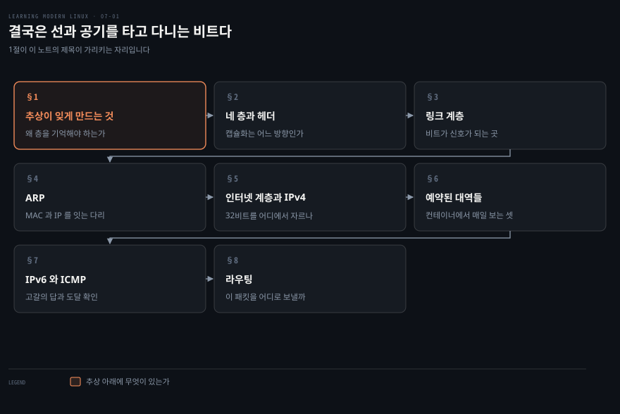
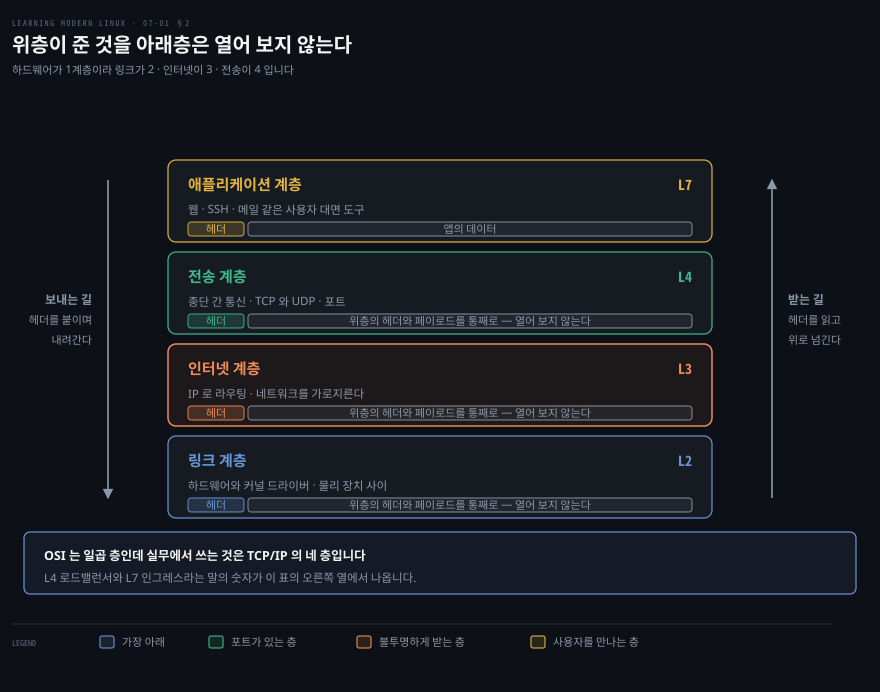
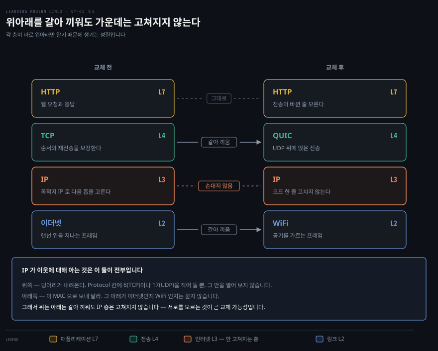
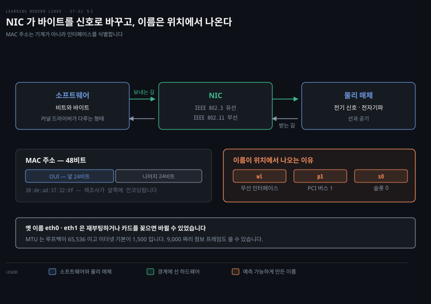
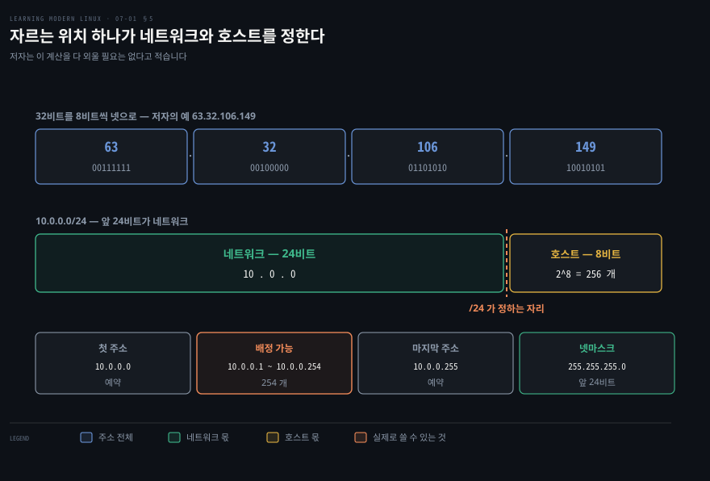
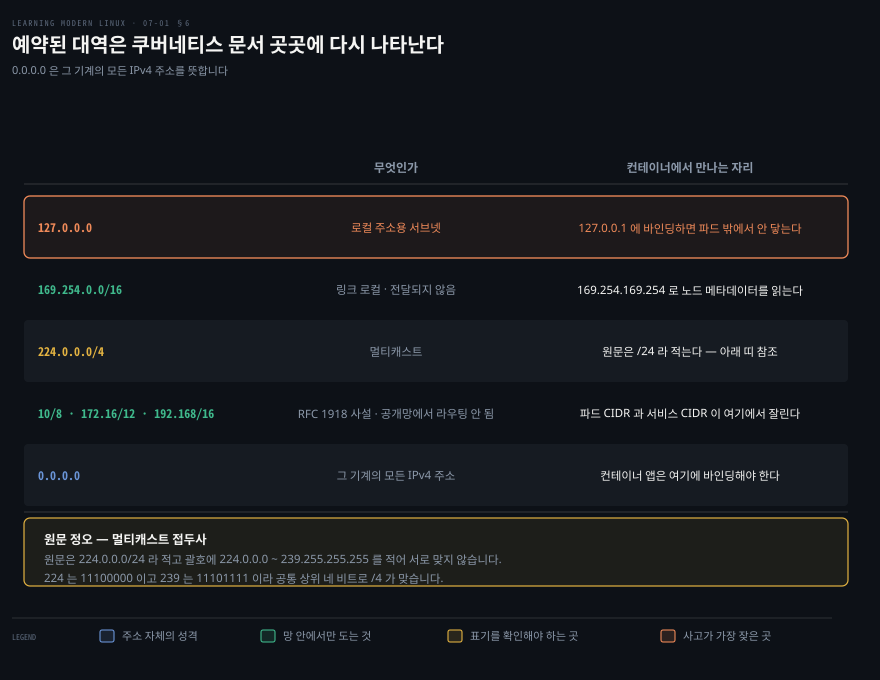
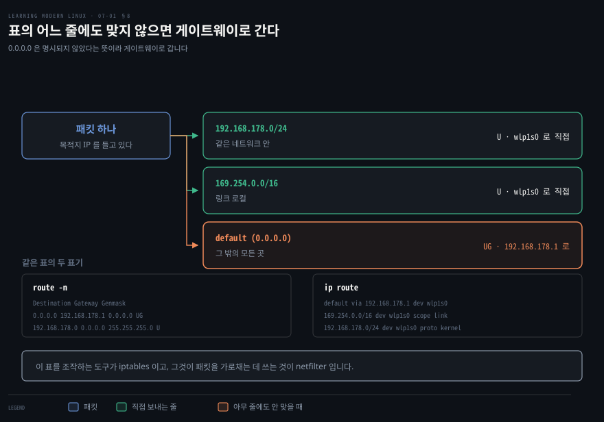
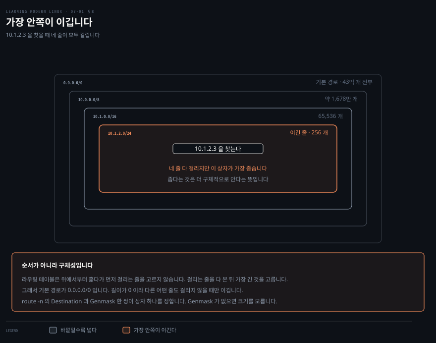

# 결국은 선과 공기를 타고 다니는 비트다

---

> 7장은 이 책을 읽는 원래 목적이 놓인 자리입니다. [쿠버네티스 네트워크 학습 로드맵](../../../network-roadmap.md)이 0단계로 지정한 장이기 때문입니다. 장이 길어 노트를 셋으로 나눴고, 이 첫 편은 스택의 아래 두 층인 링크 계층과 인터넷 계층을 다룹니다.

## 핵심 요약

> 이 구간이 매달린 하나의 문장을 저자가 직접 씁니다. **원격 자원이 로컬인 것처럼 보이게 하는 추상은 유용하지만, 결국 이 모든 것이 선을 타고 공기를 가르는 비트로 귀결된다는 것을 잊지 말라**는 것입니다.

저자는 문제를 파고들거나 시험할 때 이것을 염두에 두라고 못 박습니다. 그다음에 세우는 뼈대가 네 층입니다. 각 층은 바로 위와 바로 아래 층만 알면 됩니다. 데이터는 패킷으로 캡슐화되고, 각 층이 자기 기능에 필요한 정보를 담은 헤더로 그 데이터를 감쌉니다.

- **링크 계층**은 하드웨어와 커널 드라이버를 다루며 물리 장치 사이에서 패킷이 어떻게 오가는지에 집중합니다.
- **인터넷 계층**은 IP 로 라우팅을 다루며 네트워크를 가로질러 기계 사이에 패킷을 보냅니다.
- **전송 계층**은 호스트 사이의 종단 간 통신을 통제합니다.
- **애플리케이션 계층**은 웹과 SSH 와 메일 같은 사용자 대면 도구를 다룹니다.

이 노트가 다루는 아래 두 층에서 저자가 반복해서 보이는 것은 도구의 세대 교체입니다. `ifconfig` 대신 `ip link`, `arp` 대신 `ip neigh`, `route -n` 대신 `ip route` 입니다. 옛 도구는 교육 목적으로 한 번 보이고 곧바로 `ip` 로 넘어갑니다.

한 가지 습관을 저자가 강하게 권합니다. 네트워킹 영역에서는 거의 모든 프로토콜과 인터페이스가 공개된 명세에 기반하므로, 구현의 세부로 들어가기 전에 RFC 를 먼저 읽으라는 것입니다. 실무자가 실무자를 위해 쓴 문서라 왜 그렇게 되어 있는지가 거기 적혀 있다고 합니다.


## 학습 목표

> 이 구간을 읽고 나면 아래 일곱 가지를 스스로 해낼 수 있습니다.

1. TCP/IP 네 층과 캡슐화의 방향을 설명할 수 있습니다.
2. `ip link` 출력에서 MAC 주소와 MTU 와 인터페이스 이름의 뜻을 읽을 수 있습니다.
3. ARP 가 어느 두 층을 잇는지 말할 수 있습니다.
4. CIDR 표기에서 네트워크 부분과 호스트 부분을 갈라 호스트 수를 셀 수 있습니다.
5. 예약된 IPv4 대역을 구분하고 컨테이너 환경에서 어디에 쓰이는지 말할 수 있습니다.
6. 한 주소가 라우팅 테이블의 여러 줄에 걸릴 때 무엇이 이기는지, 그 근거가 무엇인지 말할 수 있습니다.
7. 브로드캐스트와 멀티캐스트를 구분할 수 있습니다.

아래는 이 문서 전체를 읽는 순서로 이은 지도입니다. 칸마다 절 번호와 그 절이 답하는 물음 하나를 적었습니다. 색이 붙은 칸이 이 노트의 제목이 가리키는 자리입니다.




## 이 문서가 다루지 않는 것

> 7장은 원서에서 가장 긴 장이라 노트를 셋으로 나눴습니다. 그 경계와 저자가 스스로 그은 선을 함께 적습니다.

- 전송 계층과 DNS → [둘째 노트](./07-02.%ED%8F%AC%ED%8A%B8%EA%B0%80%20%EC%9E%88%EC%96%B4%EC%95%BC%20%EC%84%9C%EB%B9%84%EC%8A%A4%EB%A5%BC%20%EA%B0%80%EB%A6%AC%ED%82%AC%20%EC%88%98%20%EC%9E%88%EA%B3%A0%20%EC%9D%B4%EB%A6%84%EC%9D%B4%20%EC%9E%88%EC%96%B4%EC%95%BC%20%EC%82%AC%EB%9E%8C%EC%9D%B4%20%EA%B8%B0%EC%96%B5%ED%95%9C%EB%8B%A4.md)가 다룹니다
- 애플리케이션 계층과 고급 주제 → [셋째 노트](./07-03.%EC%A3%BC%EA%B3%A0%EB%B0%9B%EB%8A%94%20%EC%9D%BC%EC%9D%80%20%EA%B2%B0%EA%B5%AD%20%EB%AA%87%20%EA%B0%9C%EC%9D%98%20%EB%AA%85%EB%A0%B9%EC%9C%BC%EB%A1%9C%20%EC%A4%84%EC%96%B4%EB%93%A0%EB%8B%A4.md)가 다룹니다
- 네트워크 장치의 설정과 셋업 같은 관리자 주제 → 저자가 대체로 범위 밖이라고 명시합니다
- 라우팅의 정확한 구현 세부 → 이 장의 범위를 넘는다고 밝히고 개요만 줍니다
- 성능과 문제 해결 도구 → 8장 관측의 "Monitoring" 절로 미룹니다

저자가 스스로 기대치를 조정하는 문장이 있습니다. 리눅스 네트워킹은 책 한 권을 통째로 바칠 만한 주제이며, 여기서는 최종 사용자 관점에서 손으로 만지는 쪽으로 실용적인 태도를 취한다는 것입니다.


## 1. 추상이 편한 만큼 잊게 만드는 것

> 네트워크가 왜 어려운가부터 저자는 짚습니다. 움직이는 부품과 층이 많아 문제가 하드웨어에서 왔는지 소프트웨어 스택에서 왔는지 가려내기가 어렵기 때문입니다.

여기에 저자가 두 번째 어려움을 덧붙이는데 이것이 이 노트의 제목이 됐습니다. 이 장에서 다루는 많은 것이 고수준 사용자 인터페이스를 제공한다는 것입니다. 그래서 실제로는 원격 기계에서 도는 파일이나 애플리케이션이 마치 로컬 기계에서 접근하고 다룰 수 있는 것처럼 보입니다.

**원격 자원을 로컬처럼 보이게 하는 추상은 쓸모 있는 기능**입니다. 그런데 저자가 곧바로 단서를 답니다. 결국 이 모든 것이 선을 타고 공기를 가르는 비트로 귀결된다는 사실을 잊지 말라는 것입니다.

리눅스 네트워킹의 큰 그림은 세 층으로 이루어집니다. 이더넷 카드나 무선 카드 같은 **네트워킹 하드웨어**가 맨 아래입니다. 그 위에 TCP/IP 스택 같은 **커널 수준 구성요소**가 있습니다. 사용자 공간에는 네트워킹을 설정하고 질의하고 쓰는 **도구들**이 있습니다.

### RFC 를 먼저 읽으라는 조언

저자는 이 장에서만 나오는 조언 하나를 답니다. 리눅스의 다른 영역에서는 소스 코드를 뒤지거나 인터페이스 뒤의 설계 가정이 잘 문서화되어 있기를 바라야 하지만, 네트워킹 영역은 다르다는 것입니다.

거의 모든 프로토콜과 인터페이스가 공개된 명세에 기반합니다. IETF 가 그 모든 RFC 를 무료로 공개합니다.

구현의 세부로 들어가기 전에 그 RFC 를 그냥 읽는 습관을 들이라고 저자는 적습니다. 실무자가 실무자를 위해 쓴 문서라서 좋은 관례와 구현 방법이 적혀 있고, 그것을 읽고 나면 동기와 쓰임새와 왜 그렇게 되어 있는지를 훨씬 잘 이해하게 된다는 것입니다.

이 조언이 이 노트 전체의 검증 방식이기도 합니다. 아래에서 원문의 오류를 짚는 자리마다 근거로 삼은 것이 전부 RFC 이거나 IANA 의 공식 목록입니다.


## 2. 네 층과, 층마다 붙는 헤더

> 층을 나누는 이유가 무엇인지부터 봅니다. 각 층이 바로 위와 바로 아래만 알면 되게 만들려는 것입니다.



TCP/IP 스택은 여러 프로토콜과 도구로 이루어진 계층형 네트워크 모델이고, 대부분 IETF 명세가 정의합니다.

저자가 세는 규칙이 둘입니다. 각 층은 **바로 위와 바로 아래 층만** 알고 그것과 통신할 수 있으면 됩니다. 그리고 데이터는 패킷으로 캡슐화되며, 각 층이 자기 기능에 필요한 정보를 담은 헤더로 데이터를 감쌉니다.

방향이 둘입니다. 

- 보내는 길에서는 앱이 가장 높은 층과 곧바로 상호작용하고, 그 층이 헤더를 붙여 아래로 내려갑니다.
- 받는 길은 반대입니다. 데이터가 가장 낮은 층에 도착하면 각 층이 자기가 발견한 헤더 정보에 따라 처리한 뒤 페이로드를 위층으로 넘깁니다.

캡슐화를 저자가 다시 한 번 구체적으로 풉니다. 어떤 층의 헤더와 페이로드가 합쳐져서 다음 층의 페이로드가 됩니다. 인터넷 계층의 페이로드는 전송 계층 헤더와 그 페이로드입니다. 다시 말해 인터넷 계층은 전송 계층에서 받은 패킷을 **불투명한 바이트 덩어리**로 취급하고, 자기 기능인 라우팅에만 집중할 수 있습니다.

네 층은 이렇습니다.

| 층 | 무엇을 다루는가 |
|---|---|
| 링크 계층 | 하드웨어(이더넷·WiFi)와 커널 드라이버. 물리 장치 사이의 패킷 전달 |
| 인터넷 계층 | IP 로 라우팅. 네트워크를 가로질러 기계 사이에 패킷을 보냄 |
| 전송 계층 | 호스트 사이의 종단 간 통신. TCP 는 세션 기반 신뢰 통신, UDP 는 비연결 통신 |
| 애플리케이션 계층 | 웹·SSH·메일 같은 사용자 대면 도구와 앱 |

### 왜 층 번호가 2·3·4·7 인가

저자는 OSI 모델과의 혼동을 미리 막습니다. OSI 는 일곱 층을 쓰는 이론적 모델이고 그 일곱째 최상위가 애플리케이션 계층입니다. TCP/IP 모델은 네 층뿐이지만 실무에서 쓰이는 것은 TCP/IP 스택입니다.

번호에 혼란스러워하지 말라며 저자가 관례를 정리합니다. 보통 하드웨어를 1계층으로 세므로 링크 계층이 2, 인터넷 계층이 3, 전송 계층이 4 가 됩니다. 애플리케이션 계층은 역사적인 이유로 OSI 모델에 맞춰 7 이라고 부릅니다.

여기서부터는 노트의 읽기입니다. 쿠버네티스에서 L4 로드밸런서와 L7 인그레스를 가르는 그 숫자가 이 관례에서 나옵니다. 포트까지만 보고 넘기면 4계층이고 HTTP 경로까지 읽으면 7계층입니다. 원서는 층 번호까지만 적고 이 대응은 말하지 않습니다.

### 서로를 모르기 때문에 갈아 끼울 수 있습니다

여기도 노트의 읽기입니다. 원서는 규칙과 불투명성까지만 적고, 그 규칙이 무엇을 사게 하는지는 말하지 않습니다.



규칙을 뒤집어 읽으면 이렇습니다. 인터넷 계층이 위층에 대해 아는 것은 "덩어리가 내려온다" 하나입니다. 아래층에 대해 아는 것은 "이 MAC 으로 보내 달라" 하나고요. IP 헤더의 `Protocol` 칸에 6(TCP)이나 17(UDP)을 적어 두기는 합니다. 다만 그 값은 받는 쪽이 페이로드를 위로 넘길 때 고르는 데 씁니다. 라우터는 목적지 주소를 보고 다음 홉을 정할 뿐 그 안이 TCP 인지 UDP 인지 묻지 않습니다.

그래서 전송 계층을 TCP 에서 QUIC 으로 갈아 끼워도 인터넷 계층의 코드는 그대로입니다. 링크 계층을 이더넷에서 WiFi 로 바꿔도 마찬가지입니다. 랜선을 뽑고 무선으로 옮겨 앉는 동안 IP 는 자기가 무엇 위에 얹혀 있는지 모르고, 몰라도 됩니다. **서로를 모르는 것이 불편이 아니라 교체 가능성입니다.**

이 성질을 의도적으로 어기는 것들도 있습니다. 방화벽은 IP 처리 경로에 훅으로 끼어들어 그 위의 TCP 헤더를 열고 포트를 읽습니다. NAT 도 주소만 바꾸지 않습니다. 흔히 쓰는 형태는 포트까지 함께 고쳐 쓰고, RFC 3022 가 그것을 NAPT 라는 이름으로 따로 정의합니다.[^napt] 층을 가로질러 보는 이런 예외를 계층 위반이라고 부릅니다.

여기서 주체를 헷갈리면 안 됩니다. 규칙을 어기는 것은 인터넷 계층 자신이 아니라 그 경로에 붙은 다른 코드입니다. 가르는 방법은 간단합니다. **방화벽 규칙을 전부 비워도 라우팅은 그대로 돕니다.** 라우팅에 필요한 일이었다면 멈춰야 하는데 멈추지 않습니다. 리눅스에서 그 코드가 netfilter 이고, 이 자리가 뒤에서 만날 커널의 패킷 경로와 그대로 이어집니다.


## 3. 링크 계층 — 비트가 신호가 되는 곳

> 스택의 가장 아래는 바이트와 전선과 전자기파와 장치 드라이버와 네트워크 인터페이스의 세계입니다.



저자가 이 문맥에서 만나게 되는 용어 넷을 정리합니다.

**이더넷**은 전선을 써서 기계를 잇는 네트워킹 기술의 계열이며 주로 LAN 에서 쓰입니다. **무선**은 WiFi 라고도 하며, 전선 대신 전자기파를 써서 데이터를 나르는 통신 프로토콜과 방법의 부류입니다.

**MAC 주소**는 media access control 의 줄임이고 하드웨어를 위한 고유한 48비트 식별자입니다. 정확히는 기계가 아니라 네트워크 인터페이스를 식별합니다. MAC 주소는 OUI 를 통해 인터페이스 제조사를 인코딩하는데, 보통 앞의 24비트를 차지합니다. 노트의 읽기를 한 줄 붙이면, OUI 는 organizationally unique identifier 의 줄임이고 IEEE 가 제조사에 배정합니다. 앞 24비트가 만든 회사를 가리키고 뒤 24비트를 그 회사가 자기 장비에 붙입니다.

**인터페이스**는 네트워크 연결입니다. 물리 인터페이스일 수도 있고 루프백 인터페이스 `lo` 같은 가상 인터페이스일 수도 있습니다.

핵심 하드웨어는 NIC 입니다. 유선 표준이나 무선 표준으로 네트워크에 물리적 연결을 제공합니다. 네트워크의 일부가 되고 나면 NIC 는 보내려는 바이트의 디지털 표현을 전기 신호나 전자기 신호로 바꿉니다. 받는 길에서는 반대로 받은 물리 신호를 소프트웨어가 다룰 수 있는 비트와 바이트로 바꿉니다.

### 옛 도구와 새 도구

저자는 `ifconfig` 를 먼저 보이는데 교육 목적이라고 밝힙니다. 실무에서는 `ip` 를 쓰는 편이 낫다고 못 박고, 이 장에서 가장 자주 쓰는 것도 `ip` 입니다.

```bash
ifconfig
```

```bash
lo: flags=73<UP,LOOPBACK,RUNNING>  mtu 65536
        inet 127.0.0.1  netmask 255.0.0.0
        inet6 ::1  prefixlen 128  scopeid 0x10<host>

wlp1s0: flags=4163<UP,BROADCAST,RUNNING,MULTICAST>  mtu 1500
        inet 192.168.178.40  netmask 255.255.255.0  broadcast 192.168.178.2
        ether 38:de:ad:37:32:0f  txqueuelen 1000  (Ethernet)
        RX packets 2398756  bytes 3003287387 (3.0 GB)
        TX packets 504087  bytes 85467550 (85.4 MB)
```

마지막 줄의 `broadcast 192.168.178.2` 가 이상해 보이는데 원서의 출력이 그렇습니다. 지면 폭에 맞추느라 잘린 것이고, 같은 장 뒤쪽 `ip addr show` 의 `brd 192.168.178.255` 가 온전한 값을 보입니다. 이 노트는 원서에 없는 글자를 채우지 않고 잘린 그대로 옮깁니다.

MTU 값 둘이 대비를 이룹니다. 루프백은 65,536바이트이고 무선 인터페이스는 1,500바이트입니다. MTU 는 패킷 크기이고 클수록 처리량이 높습니다. 이더넷의 기본값이 1,500바이트인 것은 역사적인 이유이며, 9,000바이트짜리 점보 프레임을 쓸 수도 있다고 저자는 덧붙입니다.

같은 일을 현대적으로 하는 방법이 `ip link` 입니다.

```bash
ip link show
```

```bash
1: lo: <LOOPBACK,UP,LOWER_UP> mtu 65536 qdisc noqueue state UNKNOWN mode DEFAULT
    link/loopback 00:00:00:00:00:00 brd 00:00:00:00:00:00
2: wlp1s0: <BROADCAST,MULTICAST,UP,LOWER_UP> mtu 1500 qdisc noqueue state UP
    link/ether 38:de:ad:37:32:0f brd ff:ff:ff:ff:ff:ff
```

인터페이스 이름 `wlp1s0` 이 아무 이름이 아니라는 설명이 이 절에서 가장 실용적입니다. 무선 인터페이스(`wl`)이고 PCI 버스 1(`p1`)의 슬롯 0(`s0`)에 있다는 뜻입니다.

이 이름 규칙이 있는 이유를 저자가 밝힙니다. 옛 방식의 이름 둘(`eth0`·`eth1`)이 있었다면, 재부팅하거나 카드를 새로 꽂았을 때 리눅스가 그 이름을 바꾸지 않으리라는 보장이 없었다는 것입니다. 이름을 위치에서 끌어오면 예측 가능해집니다.

`LOWER_UP` 이나 `MULTICAST` 같은 플래그의 뜻이 궁금하면 `netdevice` man 페이지를 보라고 저자는 가리킵니다.

### 무선을 따로 보는 도구

무선 장치를 표시하고 설정하고 문제를 파고들 때는 `iw` 를 씁니다.

```bash
iw dev wlp1s0 info
```

```bash
Interface wlp1s0
        ifindex 2
        addr 38:de:ad:37:32:0f
        ssid FRITZ!Box 7530 QJ
        type managed
        channel 5 (2432 MHz), width: 20 MHz, center1: 2432 MHz
        txpower 20.00 dBm
```

```bash
iw dev wlp1s0 link
```

```bash
Connected to 74:42:7f:67:ca:b5 (on wlp1s0)
        SSID: FRITZ!Box 7530 QJ
        freq: 2432
        RX: 28003606 bytes (45821 packets)
        TX: 4993401 bytes (15605 packets)
        signal: -67 dBm
        tx bitrate: 65.0 MBit/s MCS 6 short GI
```

`TX` 가 보낸 것이고 `RX` 가 받은 것입니다. 앞의 `ifconfig` 출력에도 같은 두 글자가 있었습니다. 이 약어가 이 장 내내 반복되므로 여기서 외워 두면 편합니다.


## 4. ARP — 두 층을 잇는 다리

> 링크 계층은 MAC 주소로 말하고 인터넷 계층은 IP 주소로 말합니다. 그 둘을 이어 주는 것이 없으면 아래 층은 위 층의 주소를 알아들을 수 없습니다.

ARP 는 MAC 주소를 IP 주소에 대응시킵니다. 저자의 표현으로는 어떤 의미에서 링크 계층과 그 위 층인 인터넷 계층을 잇는 다리입니다.

```bash
arp
```

```bash
Address              HWtype  HWaddress           Flags Mask
mh9-imac.fritz.box   ether   00:25:4b:9b:64:49   C
fritz.box            ether   3c:a6:2f:8e:66:b3   C
```

`arp` 는 MAC 주소를 호스트명이나 IP 주소에 대응시킨 캐시를 보여 줍니다. `arp -n` 을 쓰면 호스트명 해석을 막고 DNS 이름 대신 IP 주소를 보입니다.

현대적인 방법은 역시 `ip` 입니다.

```bash
ip neigh
```

```bash
192.168.178.34 dev wlp1s0 lladdr 00:25:4b:9b:64:49 STALE
192.168.178.1 dev wlp1s0 lladdr 3c:a6:2f:8e:66:b3 REACHABLE
```

- 이 캐시가 어느 단위로 갈리는지는 5장에서 확인했습니다. `/proc/PID/net` 이 프로세스별이 아니라 그 프로세스가 속한 네트워크 네임스페이스별이라는 사실입니다. 
- 한 파드의 컨테이너들이 같은 ARP 테이블을 보는 이유가 그것입니다.


## 5. 인터넷 계층 — 주소가 곧 배달 주소다

> 이 층은 네트워크의 한 기계에서 다른 기계로 패킷을 라우팅하는 데 관심이 있습니다. 그리고 그 설계는 인프라가 신뢰할 수 없다는 것을 전제합니다.



인터넷 계층의 설계는 두 가지를 가정합니다. 쓸 수 있는 네트워크 인프라가 **신뢰할 수 없다**는 것과, 참여자들이 **자주 바뀐다**는 것입니다.

그래서 이 층은 최선 노력 전달을 제공하고 모든 패킷을 독립적으로 취급합니다. 성능에 관한 보장이 없다는 뜻입니다. 그 결과 신뢰성 문제는 위층, 보통은 전송 계층이 맡습니다. 패킷 순서와 재시도와 전달 보장이 거기에 듭니다.

저자가 드는 비유가 우편입니다. 인터넷 계층 주소를 우편 주소처럼 생각하라는 것입니다. 나라 같은 거친 단위부터 번지수까지 여러 부분으로 이루어져 있고, 그 주소만 있으면 세계 어디에서든 엽서를 보낼 수 있습니다. 배와 비행기 중 무엇을 타는지, 정확히 어느 경로인지는 알 필요가 없습니다. 나와 우체국 사이의 계약이 단순하기 때문입니다. 올바른 주소를 적고 올바른 우표를 붙이면 우체국이 배달을 약속합니다.

### IPv4 와 옥텟 넷

IPv4 는 TCP/IP 통신의 종단점 역할을 하는 호스트나 프로세스를 식별하는 고유한 32비트 숫자를 정의합니다.

쓰는 방법 하나가 32비트를 8비트 조각 넷으로 쪼개 점으로 구분하는 것입니다. 각 조각은 0 에서 255 사이이고 옥텟이라 부릅니다. 저자가 드는 예 `63.32.106.149` 를 이진수로 옮기면 첫 옥텟이 `00111111`, 둘째가 `00100000`, 셋째가 `01101010`, 넷째가 `10010101` 입니다.

IP 헤더는 RFC 791 과 관련 IETF 명세가 정의하며 필드가 여럿인데, 저자가 알아 둬야 한다고 꼽는 것은 다섯입니다.

| 필드 | 비트 | 무엇인가 |
|---|:--:|---|
| Source address | 32 | 보내는 쪽의 IP 주소 |
| Destination address | 32 | 받는 쪽의 IP 주소 |
| Protocol | 8 | 페이로드 종류, 곧 다음 상위 계층 종류. TCP·UDP·ICMP 같은 것 |
| Time to live | 8 | 패킷이 존재해도 되는 최대 시간 |
| Type of service | 8 | 서비스 품질 목적으로 쓸 수 있음 |

### CIDR — 어디에서 자를 것인가

인터넷이 네트워크의 네트워크이므로 네트워크와 그 안의 개별 기계를 가르는 것이 자연스럽습니다. IP 주소 범위가 네트워크에 배정되고, 그 안에서 다시 개별 호스트에 배정됩니다.

오늘날 IP 주소를 배정하는 유일하게 유의미한 방법이 CIDR 입니다. 형식은 두 부분입니다. 앞부분은 네트워크 주소를 나타내며 보통의 IP 주소처럼 생겼고(`10.0.0.0`), 뒷부분은 몇 비트가 그 주소 범위에 드는지를 정의합니다(`/24`).

`10.0.0.0/24` 를 저자가 풉니다. 앞의 24비트, 곧 세 옥텟이 네트워크를 나타내고, 마지막 8비트가 호스트에 쓸 수 있는 IP 주소입니다. 32비트에서 네트워크가 쓰는 24비트를 뺀 것이므로 2의 8제곱, 곧 256개입니다.

이 범위의 첫 IP 주소는 `10.0.0.0` 이고 마지막은 `10.0.0.255` 입니다. 엄밀히 말하면 호스트에 배정할 수 있는 것은 `10.0.0.1` 부터 `10.0.0.254` 까지인데, `.0` 과 `.255` 는 특별한 목적으로 예약되어 있기 때문입니다. 그리고 넷마스크는 `255.255.255.0` 이라고 말할 수 있습니다. 앞의 24비트가 네트워크를 나타내기 때문입니다.

저자가 실용적인 조언 하나를 답니다. 이 계산을 다 외울 필요는 없다는 것입니다. 매일 CIDR 범위를 다룬다면 그냥 알게 되고, 어쩌다 쓰는 사람이라면 도구를 쓰면 됩니다.

```bash
ip addr show
```

```bash
1: lo: <LOOPBACK,UP,LOWER_UP> mtu 65536 qdisc noqueue state UNKNOWN
    inet 127.0.0.1/8 scope host lo
    inet6 ::1/128 scope host
2: wlp1s0: <BROADCAST,MULTICAST,UP,LOWER_UP> mtu 1500 qdisc noqueue state UP
    inet 192.168.178.40/24 brd 192.168.178.255 scope global dynamic wlp1s0
    inet6 fe80::be87:e600:7de7:e08f/64 scope link
```

`ip link` 가 링크 계층을 보였다면 `ip addr` 은 인터넷 계층을 보입니다. 같은 인터페이스에 MAC 주소와 IP 주소가 각각 붙어 있고, 두 층이 그렇게 한 장치에서 만납니다.


## 6. 예약된 대역들

> 모든 IP 주소가 아무 데나 쓸 수 있는 것은 아닙니다. 특별한 뜻이 미리 정해진 대역이 몇 있고, 그중 셋은 컨테이너 환경에서 매일 마주칩니다.



저자가 예약 주소라는 이름으로 꼽는 것은 셋입니다. 여기에 사설 범위와 `0.0.0.0` 을 더하면 이 절에서 다루는 대역이 다섯이 됩니다.

**`127.0.0.0`** 은 로컬 주소를 위해 예약된 서브넷이고, 가장 유명한 것이 루프백 주소 `127.0.0.1` 입니다.

**`169.254.0.0/16`** 은 링크 로컬 주소입니다. 여기로 보낸 패킷은 네트워크의 다른 부분으로 전달되어서는 안 된다는 뜻입니다. AWS 같은 일부 클라우드 제공자가 메타데이터 같은 특별한 서비스에 이것을 씁니다.

**멀티캐스트 대역**은 `224.0.0.0` 에서 `239.255.255.255` 까지입니다.

> **원문 정오**: 저자는 이 멀티캐스트 대역을 `224.0.0.0/24` 라고 적고 괄호 안에 `224.0.0.0` 에서 `239.255.255.255` 라고 적습니다. 한 줄 안에서 두 표기가 서로 맞지 않습니다.
>
> 괄호 안의 범위는 IANA 의 멀티캐스트 주소 등록부와 일치합니다. 그 등록부가 "The multicast addresses are in the range 224.0.0.0 through 239.255.255.255" 라고 적습니다.[^mcast] 틀린 것은 앞의 접두사입니다. 바로 앞 절에서 저자 자신이 `/24` 를 "앞의 24비트가 네트워크" 라고 설명했는데, 그 설명대로라면 `224.0.0.0/24` 는 `224.0.0.0` 부터 `224.0.0.255` 까지 256개뿐입니다.
>
> 맞는 접두사는 직접 세어 보면 나옵니다. 224 는 이진수로 `11100000` 이고 239 는 `11101111` 이라 앞의 네 비트 `1110` 이 공통입니다. 그래서 이 대역은 `224.0.0.0/4` 입니다.

여기도 노트의 읽기입니다. 저자는 대역만 적고 멀티캐스트가 무엇인지는 말하지 않습니다. 브로드캐스트와 헷갈리기 쉬운 자리라 갈라 둡니다.

| | 누가 받는가 | 이 노트 안의 예 |
|---|---|---|
| 브로드캐스트 | 그 링크에 붙은 **전부**. 받는 쪽에 선택권이 없습니다 | ARP 질의 |
| 멀티캐스트 | 그 그룹에 **가입한 것만**. 나머지는 NIC 이 걸러 버립니다 | 라우터끼리 이웃을 찾는 트래픽 |

둘 다 한 번 보내 여럿이 받습니다. 갈리는 것은 받는 쪽에 선택권이 있느냐입니다. IPv6 에는 브로드캐스트가 아예 없고 멀티캐스트가 그 자리를 대신합니다.

RFC 1918 이 정의하는 사설 IP 범위도 셋입니다. 사설 범위란 그 안의 IP 주소가 공개 인터넷에서 라우팅되지 않는다는 뜻이고, 그래서 회사 안에서처럼 내부적으로 배정해도 안전합니다.

| 범위 | 접두사 |
|---|---|
| `10.0.0.0` ~ `10.255.255.255` | `10/8` |
| `172.16.0.0` ~ `172.31.255.255` | `172.16/12` |
| `192.168.0.0` ~ `192.168.255.255` | `192.168/16` |

마지막으로 `0.0.0.0` 이 있습니다. 라우팅되지 않는 주소이고 문맥에 따라 쓰임새와 뜻이 다릅니다. 서버 관점에서 가장 중요한 뜻은 **그 기계에 있는 모든 IPv4 주소**를 가리킨다는 것입니다. 알려진 IP 로 바뀌기 전까지 "쓸 수 있는 모든 IP 주소에서 듣겠다" 고 말하는 좋은 방법이라고 저자는 적습니다.

여기서부터는 노트의 읽기입니다. 원서는 AWS 가 링크 로컬 대역을 메타데이터 같은 특별한 서비스에 쓴다고까지만 적고, 아래의 구체적인 주소나 쿠버네티스 대응은 말하지 않습니다.

- 파드 CIDR 과 서비스 CIDR 이 RFC 1918 범위에서 잘립니다.
- 노드의 인스턴스 메타데이터를 읽는 주소가 `169.254.169.254` 입니다.
- 컨테이너 안의 앱이 `127.0.0.1` 에만 바인딩하면 파드 밖에서 닿지 않습니다.

마지막 것이 특히 자주 생기는 사고입니다.


## 7. IPv6 와 ICMP

> IPv4 주소 공간은 이미 고갈됐습니다. 답은 나와 있는데 생태계가 아직 옮겨 가지 않았다는 것이 이 절의 내용입니다.

IPv6 는 TCP/IP 통신의 종단점을 식별하는 128비트 숫자입니다. 이것으로 10의 38제곱 규모의 개별 기계에 주소를 줄 수 있습니다.

표기가 IPv4 와 다릅니다. 16비트씩 여덟 묶음을 16진수로 적고 묶음을 콜론으로 구분합니다. 줄이는 규칙도 몇 있어서, 앞의 0 을 지우거나 연속된 0 구간을 콜론 둘(`::`)로 압축할 수 있습니다. IPv6 루프백 주소를 줄이면 `::1` 이 되는데 IPv4 로는 `127.0.0.1` 인 그것입니다.

중요한 단서 하나를 저자가 답니다. IPv4 와 IPv6 는 **호환되지 않습니다**. IPv6 지원이 네트워크 참여자 하나하나에 들어가 있어야 한다는 뜻입니다. 여러분의 전화 같은 가장자리 장치부터 라우터를 거쳐 서버 소프트웨어까지입니다.

적어도 리눅스 문맥에서는 그 지원이 이미 꽤 넓습니다. 앞에서 본 `ip addr` 이 기본으로 IPv6 주소까지 보여 준 것이 그 증거입니다.

ICMP 는 RFC 792 가 정의하며, 낮은 층의 구성요소가 오류 메시지와 가용성 같은 운영 정보를 보내는 데 씁니다.

여기도 노트의 읽기입니다. ICMP 에는 **포트가 없습니다.** 포트는 다음 노트에서 볼 전송 계층의 것이고, ICMP 는 그 아래 인터넷 계층에 바로 얹힙니다. 방화벽에서 ICMP 를 다룰 때 포트 번호가 아니라 타입과 코드로 거르는 이유가 그것입니다. "핑은 되는데 접속이 안 된다"와 그 반대가 둘 다 흔한 것도 서로 다른 층에서 막히기 때문입니다.

```bash
ping mhausenblas.info
```

```bash
PING mhausenblas.info (185.199.109.153): 56 data bytes
64 bytes from 185.199.109.153: icmp_seq=0 ttl=38 time=23.140 ms
64 bytes from 185.199.109.153: icmp_seq=1 ttl=38 time=23.237 ms
...
--- mhausenblas.info ping statistics ---
7 packets transmitted, 7 packets received, 0.0% packet loss
round-trip min/avg/max/stddev = 22.984/23.683/24.826/0.599 ms
```

IPv6 용으로는 이름 그대로 `ping6` 가 있습니다.


## 8. 라우팅 — 이 패킷을 어디로 보낼 것인가

> 리눅스 네트워크 스택의 일부가 라우팅을 맡습니다. 패킷마다 어디로 보낼지 정하는 일입니다.



목적지는 같은 기계의 프로세스일 수도 있고 다른 기계의 IP 주소일 수도 있습니다.

정확한 구현 세부는 이 장의 범위를 넘는다고 저자는 밝히고 개요만 줍니다. iptables 는 라우팅 테이블을 조작하게 해 주는 널리 쓰이는 도구이며, 특정 조건에서 패킷을 다시 보내거나 방화벽을 구현하는 데 씁니다. 그리고 그것이 패킷을 가로채고 조작하는 데 쓰는 것이 netfilter 입니다.

알아 둬야 할 것은 라우팅 정보를 질의하고 표시하는 방법입니다.

```bash
sudo route -n
```

```bash
Kernel IP routing table
Destination     Gateway         Genmask         Flags Metric Ref  Use Ifa
0.0.0.0         192.168.178.1   0.0.0.0         UG    600    0      0 wlp
169.254.0.0     0.0.0.0         255.255.0.0     U     1000   0      0 wlp
192.168.178.0   0.0.0.0         255.255.255.0   U     600    0      0 wlp
```

마지막 두 열이 `Ifa` 와 `wlp` 에서 끊긴 것도 원서의 출력입니다. 저자가 바로 아래에서 그 열을 `Iface` 라고 설명하므로 열 이름은 알 수 있고, 값은 이 기계의 무선 인터페이스 `wlp1s0` 일 것입니다.

칸의 뜻은 이렇습니다. **Destination** 은 목적지의 IP 주소이며 `0.0.0.0` 은 명시되지 않았거나 알 수 없다는 뜻이고, 그러면 게이트웨이로 보낼 수 있습니다. **Gateway** 는 같은 네트워크에 있지 않은 패킷을 위한 게이트웨이 주소입니다. **Genmask** 는 쓰이는 서브넷 마스크입니다. **Flags** 의 `UG` 는 네트워크가 살아 있고 게이트웨이라는 뜻입니다. **Iface** 는 패킷이 쓸 네트워크 인터페이스입니다.

현대적인 방법이 또 `ip` 입니다.

```bash
sudo ip route
```

```bash
default via 192.168.178.1 dev wlp1s0 proto dhcp metric 600
169.254.0.0/16 dev wlp1s0 scope link metric 1000
192.168.178.0/24 dev wlp1s0 proto kernel scope link src 192.168.178.40 metr
```

두 출력이 같은 표의 두 표기입니다. `route -n` 의 `Destination 0.0.0.0` 이 `ip route` 에서는 `default` 이고, `Genmask 255.255.0.0` 은 `/16` 입니다. 앞 절에서 넷마스크와 CIDR 접두사가 같은 것의 두 표기라고 읽은 그대로입니다.

### 여러 줄에 걸리면 무엇이 이기는가

여기서부터는 노트의 읽기입니다. 저자는 칸의 뜻까지만 적고, 한 주소가 여러 줄에 걸릴 때 무엇이 이기는지는 말하지 않습니다. 위 출력만 봐도 어떤 주소든 `0.0.0.0` 줄에는 늘 걸립니다.



규칙은 **가장 긴 접두사가 이긴다**는 것입니다. 최장 일치라고 부르며, RFC 1812 는 CIDR 을 이루는 세 요소 중 하나로 이 포워딩 알고리즘을 꼽습니다.[^lpm]

순서가 아니라는 점이 중요합니다. 방화벽 규칙은 위에서부터 훑다가 먼저 걸리는 줄에서 멈춥니다. 라우팅 테이블은 그렇게 하지 않습니다. 걸리는 줄을 다 본 뒤 그중 가장 긴 것을 고릅니다. 두 표가 비슷하게 생겼어도 고르는 방식이 다릅니다.

이 규칙이 기본 게이트웨이를 설명합니다. `0.0.0.0/0` 은 접두사 길이가 0 이라 모든 주소에 걸리는 대신 언제나 가장 짧습니다. 그래서 다른 어떤 줄도 걸리지 않을 때만 이깁니다. "모르겠으면 여기로"가 별도의 장치가 아니라 접두사 길이로 표현돼 있는 것입니다.

여기까지 오면 `Genmask` 가 왜 `Destination` 마다 붙는지도 보입니다. `Destination` 하나로는 상자의 크기를 알 수 없습니다. `10.0.0.0` 이 1,678만 개짜리인지 256개짜리인지를 `Genmask` 가 정합니다. 그 한 쌍이 `ip route` 에서는 `10.0.0.0/8` 한 덩이로 붙어 나옵니다.

경로를 실제로 따라가 보려면 `traceroute` 를 씁니다.

```bash
traceroute mhausenblas.info
```

```bash
traceroute to mhausenblas.info (185.199.108.153), 30 hops max, 60 byte pack
 1  _gateway (192.168.5.2)  1.350 ms  1.306 ms  1.293 ms
```

저자는 출력만 보이고 원리는 적지 않습니다. `traceroute` 는 TTL 로 경로를 캐냅니다. TTL 을 1 로 놓고 보내면 첫 라우터에서 0 이 되어 패킷이 버려지는데, 버린 라우터가 ICMP 로 "시간이 다 됐다"를 돌려줍니다. **그 응답의 출발지 주소가 곧 첫 홉입니다.** TTL 을 2, 3 으로 올리며 같은 일을 반복하면 홉이 하나씩 드러납니다. 앞 절의 ICMP 가 진단용이라는 말이 여기서 실물로 쓰입니다.

### 인터넷 전체의 라우팅

마지막으로 저자는 BGP 를 짧게 짚습니다. RFC 4271 과 다른 IETF 명세가 정의합니다. 네트워크 제공자에서 일하거나 네트워크를 관리하지 않는 한 직접 다룰 일은 없겠지만, 존재를 알고 무엇을 하는지 큰 틀에서 이해해 두는 것이 중요하다고 적습니다.

인터넷이 네트워크의 네트워크라고 앞에서 말했는데, BGP 용어로는 그 네트워크 하나를 자율 시스템이라 부릅니다. IP 라우팅이 동작하려면 이 자율 시스템들이 라우팅과 도달 가능성 데이터를 서로 나눠야 합니다. 인터넷을 가로질러 패킷을 배달할 경로를 알리는 것입니다.

저자가 곁들이는 사례가 2021년 말 Facebook 이 인터넷에서 사라진 사건입니다. BGP 설정 오류가 어떤 영향을 낼 수 있는지를 보인 일이었습니다.

### 2021년 10월 4일, Facebook 이 사라진 날

여기서부터는 노트의 읽기입니다. 저자는 사건 이름만 대고 넘어갑니다. 이 절에서 배운 라우팅 테이블이 그대로 쓰이는 사례라 회사가 낸 사후 보고를 근거로 풀어 둡니다.[^fb]

시작은 점검 명령 하나였습니다. 백본의 가용 용량을 재려던 명령이 백본의 모든 연결을 내렸고 데이터센터가 전 세계적으로 끊겼습니다. 회사는 이런 명령을 감사하는 장치를 두고 있었는데 그 장치에 결함이 있어 걸러지지 않았다고 적습니다.

여기까지는 큰 장애이긴 해도 이름까지 사라질 일은 아닙니다. 두 번째 고리가 붙어야 그렇게 됩니다. Facebook 의 DNS 서버는 자기가 데이터센터와 말이 통하지 않으면 **스스로 BGP 광고를 거두도록** 설계돼 있었습니다. 연결이 건강하지 않다는 신호로 읽은 것입니다.

백본이 통째로 사라지자 그 서버들이 스스로를 이상 상태로 선언하고 광고를 거뒀습니다. 회사의 표현을 그대로 옮기면 DNS 서버는 여전히 동작 중이었는데도 도달할 수 없게 됐습니다. 인터넷의 나머지가 그들의 서버를 찾을 방법이 없어진 것입니다.

이 절에서 배운 말로 옮기면 이렇습니다. **광고를 거둔다는 것은 주소를 틀리게 적은 일이 아니라, 전 세계 라우터의 라우팅 테이블에서 그 줄이 통째로 지워진 일입니다.** 가장 긴 접두사가 이긴다는 규칙은 걸릴 줄이 하나라도 있을 때의 이야기입니다. 줄이 없으면 기본 경로조차 목적지를 모릅니다. 이름을 물어볼 서버로 가는 길이 지도에서 사라졌습니다.

건강 검사가 스스로를 끊는 손잡이를 쥐고 있으면 이렇게 됩니다. 정상일 때는 죽은 경로를 자동으로 걷어내 주는 좋은 설계입니다. 그런데 검사가 보는 대상과 검사 결과가 조작하는 대상이 같은 망에 얹혀 있으면, 망이 흔들릴 때 그 설계가 장애를 **키우는** 쪽으로 돕니다.


## 심화 학습

> 이 구간은 원서가 이름만 대고 넘어가거나 층을 잇지 않은 자리를 표시합니다.

- **`iptables` 와 `netfilter` 의 관계가 한 문장으로 끝납니다.** 쿠버네티스의 `kube-proxy` 가 iptables 모드에서 무엇을 하는지가 이 한 문장 위에 얹히는데, 저자는 라우팅 세부가 범위 밖이라며 넘어갑니다.
- **MTU 가 왜 1,500인지는 나오지만 왜 문제가 되는지는 나오지 않습니다.** 오버레이 네트워크가 패킷을 한 번 더 감싸면 유효 MTU 가 줄어들어 조각화가 생깁니다. 컨테이너 네트워크에서 자주 겪는 증상인데 이 장에서는 다루지 않습니다.
- **ARP 캐시의 상태값이 설명되지 않습니다.** `ip neigh` 출력의 `STALE` 과 `REACHABLE` 이 무엇을 뜻하는지가 없습니다. 이 상태 기계는 `arp(7)` man 페이지가 다룹니다.
- **저자가 RFC 를 읽으라고 권하면서 정작 대역 표기를 틀립니다.** 멀티캐스트 `/24` 표기가 그것입니다. 조언 자체는 옳고, 그 조언대로 IANA 목록을 확인했더니 본문의 오류가 드러났습니다.


## 결정 치트시트

> 이 구간이 판단으로 이어지는 자리를 모았습니다. 근거는 본문입니다.

| 상황 | 선택 | 이유 |
|---|---|---|
| 인터페이스와 MAC 주소를 볼 때 | `ip link show` | `ifconfig` 는 널리 폐기된 것으로 여겨집니다 |
| IP 주소를 볼 때 | `ip addr show` | 같은 명령이 IPv6 도 기본으로 보입니다 |
| MAC 과 IP 의 대응을 볼 때 | `ip neigh` | `arp` 의 현대적 대체입니다 |
| 라우팅 테이블을 볼 때 | `ip route` | `route -n` 과 같은 표의 다른 표기입니다 |
| 무선 상태를 볼 때 | `iw dev <이름> link` | 신호 세기와 비트레이트까지 나옵니다 |
| 이름 해석 없이 IP 로 보고 싶을 때 | `-n` 플래그 | `arp -n`·`route -n` 이 그렇습니다 |
| 서버가 모든 주소에서 듣게 할 때 | `0.0.0.0` 에 바인딩 | 그 기계의 모든 IPv4 주소를 가리킵니다 |
| 내부에만 쓸 주소 대역을 고를 때 | RFC 1918 범위 | 공개 인터넷에서 라우팅되지 않습니다 |


## 적용 관점

> Spring 으로 자바를 쓰다가 컨테이너와 쿠버네티스로 넘어온 사람에게 이 구간이 어디에서 되돌아오는지를 적습니다.

**L4 와 L7 이라는 말이 이 노트의 층 번호입니다.** 서비스 타입 `LoadBalancer` 가 4계층에서 포트만 보고 넘기는 것이고, 인그레스가 7계층에서 HTTP 경로와 호스트 헤더를 읽는 것입니다. 저자가 "번호에 혼란스러워하지 말라" 며 정리한 그 관례가 쿠버네티스 문서의 용어를 그대로 설명합니다.

**Spring Boot 를 컨테이너에 넣을 때 가장 흔한 사고가 `127.0.0.1` 바인딩입니다.** `server.address` 를 루프백으로 잡아 두면 앱은 정상으로 뜨는데 파드 밖에서는 닿지 않습니다. 이 노트의 예약 대역 절이 그 이유를 설명합니다. 루프백은 그 네트워크 네임스페이스 안에서만 유효합니다. 컨테이너에서는 `0.0.0.0` 에 바인딩해야 합니다.

**노드 메타데이터를 읽는 `169.254.169.254` 가 링크 로컬 주소입니다.** IRSA 나 워크로드 아이덴티티가 자격증명을 받아 오는 그 주소이고, 그래서 그 트래픽이 네트워크의 다른 부분으로 전달되지 않습니다. 파드에서 이 주소로의 접근을 막는 것이 흔한 보안 관례인 이유도 그 특별함 때문입니다.

**파드 CIDR 과 서비스 CIDR 을 정할 때 이 절의 CIDR 계산이 그대로 쓰입니다.** `/24` 면 호스트 254개이고 `/16` 이면 65,534개입니다. 노드마다 파드 CIDR 을 `/24` 로 잘라 주는 기본 설정이 노드당 파드 수의 상한을 만드는 이유가 이 산수입니다.

**`ip neigh` 와 `ip route` 를 컨테이너 안에서 실행해 보는 것이 네트워크 문제의 첫 걸음입니다.** 파드 안에서 `ip route` 를 찍으면 기본 게이트웨이가 CNI 가 만든 가상 인터페이스로 향하는 것이 보입니다. 5장에서 본 네트워크 네임스페이스가 실제로 무엇을 갈랐는지가 이 출력에 드러납니다.


## 면접에서 받을 만한 질문

> 답을 먼저 떠올린 뒤 아래 정답을 펼치는 것이 학습에 낫습니다.

1. 캡슐화에서 인터넷 계층이 전송 계층의 패킷을 어떻게 취급합니까?
2. 인터페이스 이름 `wlp1s0` 의 각 부분은 무엇을 뜻하며, 이 규칙이 왜 생겼습니까?
3. ARP 는 어느 두 층을 잇습니까?
4. `10.0.0.0/24` 에서 호스트에 실제로 배정할 수 있는 주소는 몇 개입니까?
5. 컨테이너 안의 앱이 `127.0.0.1` 에 바인딩하면 무엇이 문제입니까?
6. `10.1.2.3` 이 `0.0.0.0/0`·`10.0.0.0/8`·`10.1.0.0/16` 세 줄에 모두 걸립니다. 라우터는 어느 줄을 고르며 그 근거는 무엇입니까?
7. 전송 계층을 TCP 에서 QUIC 으로 바꿔도 인터넷 계층 코드가 안 고쳐지는 이유는 무엇입니까?


## 정답 (자답 후 펼치기)

<details>
<summary>1. 인터넷 계층이 보는 페이로드</summary>

**불투명한 바이트 덩어리**로 취급합니다. 인터넷 계층의 페이로드는 전송 계층의 헤더와 그 페이로드가 합쳐진 것인데, 인터넷 계층은 그 안을 들여다보지 않습니다.

그 덕에 자기 기능인 라우팅에만 집중할 수 있습니다. 각 층이 바로 위와 바로 아래만 알면 된다는 규칙이 이렇게 구현됩니다.

</details>

<details>
<summary>2. `wlp1s0` 이라는 이름</summary>

**무선 인터페이스(`wl`)이고 PCI 버스 1(`p1`)의 슬롯 0(`s0`)** 이라는 뜻입니다.

규칙이 생긴 이유는 예측 가능성입니다. 옛 방식의 `eth0`·`eth1` 은 재부팅하거나 카드를 새로 꽂았을 때 리눅스가 그 이름을 바꾸지 않으리라는 보장이 없었습니다. 이름을 물리적 위치에서 끌어오면 그런 일이 생기지 않습니다.

</details>

<details>
<summary>3. ARP 가 잇는 두 층</summary>

**링크 계층과 인터넷 계층**입니다. MAC 주소를 IP 주소에 대응시킵니다.

아래 층은 MAC 주소로 말하고 위 층은 IP 주소로 말하므로, 그 사이에 번역이 필요합니다. 저자는 ARP 가 어떤 의미에서 두 층을 잇는 다리라고 표현합니다.

</details>

<details>
<summary>4. `/24` 의 호스트 수</summary>

주소 자체는 **256개**(2의 8제곱)이지만 호스트에 배정할 수 있는 것은 **254개**입니다. `10.0.0.1` 부터 `10.0.0.254` 까지입니다.

`.0` 과 `.255` 는 특별한 목적으로 예약되어 있습니다. 넷마스크는 `255.255.255.0` 이고, 앞의 24비트가 네트워크를 나타냅니다.

</details>

<details>
<summary>5. 컨테이너와 루프백 바인딩</summary>

루프백 주소는 **그 네트워크 네임스페이스 안에서만** 유효합니다. 컨테이너는 자기 네트워크 네임스페이스를 갖거나 파드 단위로 공유하므로, `127.0.0.1` 에 바인딩한 앱은 그 네임스페이스 밖에서 닿을 수 없습니다.

증상이 헷갈리는 이유는 앱이 정상으로 뜨고 로그에도 문제가 없기 때문입니다. 서비스로 접근하면 연결이 거부될 뿐입니다. 해법은 `0.0.0.0` 에 바인딩하는 것이고, 저자의 표현으로는 "쓸 수 있는 모든 IP 주소에서 듣겠다" 고 말하는 것입니다.

</details>


<details>
<summary>6. 세 줄에 다 걸릴 때</summary>

**`10.1.0.0/16` 을 고릅니다.** 근거는 줄의 순서가 아니라 **접두사 길이**입니다. 최장 일치라고 부르며, 걸리는 줄을 다 본 뒤 그중 가장 긴 것을 고릅니다.

접두사가 길수록 덮는 범위가 좁고, 좁다는 것은 그만큼 구체적으로 안다는 뜻이라서 그렇습니다. 방화벽 규칙이 위에서부터 훑다가 먼저 걸리는 줄에서 멈추는 것과 여기서 갈립니다.

기본 게이트웨이 `0.0.0.0/0` 이 언제나 마지막에 이기는 것도 같은 규칙입니다. 길이가 0 이라 항상 가장 짧습니다.

</details>

<details>
<summary>7. 위를 갈아 끼워도 안 고쳐지는 이유</summary>

**인터넷 계층이 위층의 정체를 모르기 때문입니다.** IP 헤더의 `Protocol` 칸에 6 이나 17 을 적어 두기는 하지만, 그 값은 받는 쪽이 페이로드를 위로 넘길 때 쓰는 것이고 라우팅 판단은 바꾸지 않습니다.

아래쪽도 같습니다. 인터넷 계층은 "이 MAC 으로 보내 달라"까지만 말하고 그 아래가 이더넷인지 WiFi 인지 묻지 않습니다. 서로를 모르는 것이 곧 교체 가능성입니다.

</details>


## 핵심 개념 체크리스트

- [ ] 네 층의 이름과 각 층이 다루는 것을 말할 수 있는가?
- [ ] 캡슐화에서 어느 층의 무엇이 다음 층의 페이로드가 되는지 설명할 수 있는가?
- [ ] 층 번호가 2·3·4·7 인 이유를 아는가?
- [ ] `ip link` 와 `ip addr` 이 각각 어느 층을 보이는지 구분할 수 있는가?
- [ ] MAC 주소의 비트 수와 OUI 가 차지하는 부분을 아는가?
- [ ] CIDR 표기에서 호스트 수를 셀 수 있는가?
- [ ] 이 절의 대역 다섯(`127.0.0.0`·`169.254.0.0/16`·멀티캐스트·RFC 1918·`0.0.0.0`)을 구분할 수 있는가?
- [ ] `0.0.0.0` 이 서버 관점에서 무엇을 뜻하는지 말할 수 있는가?
- [ ] 최장 일치가 왜 줄 순서 기반이 아닌지 설명할 수 있는가?
- [ ] 기본 게이트웨이가 `0.0.0.0/0` 인 이유를 접두사 길이로 설명할 수 있는가?
- [ ] 브로드캐스트와 멀티캐스트의 차이를 말할 수 있는가?
- [ ] `traceroute` 가 TTL 로 홉을 하나씩 드러내는 절차를 설명할 수 있는가?


## 관련 문서

- [Learning Modern Linux 정독 인덱스](./README.md) — 이 책의 장별 진행 상황
- [포트가 있어야 서비스를 가리킬 수 있고 이름이 있어야 사람이 기억한다](./07-02.%ED%8F%AC%ED%8A%B8%EA%B0%80%20%EC%9E%88%EC%96%B4%EC%95%BC%20%EC%84%9C%EB%B9%84%EC%8A%A4%EB%A5%BC%20%EA%B0%80%EB%A6%AC%ED%82%AC%20%EC%88%98%20%EC%9E%88%EA%B3%A0%20%EC%9D%B4%EB%A6%84%EC%9D%B4%20%EC%9E%88%EC%96%B4%EC%95%BC%20%EC%82%AC%EB%9E%8C%EC%9D%B4%20%EA%B8%B0%EC%96%B5%ED%95%9C%EB%8B%A4.md) — 같은 장의 전송 계층과 DNS
- [컨테이너의 새로움은 재료가 아니라 조합에 있다](./06-02.%EC%BB%A8%ED%85%8C%EC%9D%B4%EB%84%88%EC%9D%98%20%EC%83%88%EB%A1%9C%EC%9B%80%EC%9D%80%20%EC%9E%AC%EB%A3%8C%EA%B0%80%20%EC%95%84%EB%8B%88%EB%9D%BC%20%EC%A1%B0%ED%95%A9%EC%97%90%20%EC%9E%88%EB%8B%A4.md) — 네트워크 네임스페이스가 정의된 자리
- [Kubernetes 네트워크 학습 로드맵](../../../network-roadmap.md) — 이 장이 0단계로 지정된 자리


## 참고 자료

- 원서: 《Learning Modern Linux》 7장 Networking
- 서지: Michael Hausenblas, O'Reilly, 2022년
- [IETF Datatracker](https://datatracker.ietf.org/) — 저자가 습관을 들이라고 권한 RFC 원문
- [RFC 791 — Internet Protocol](https://www.rfc-editor.org/rfc/rfc791.txt) — IP 헤더 형식의 1차 자료
- [RFC 1918 — Address Allocation for Private Internets](https://www.rfc-editor.org/rfc/rfc1918.txt) — 사설 대역 셋의 1차 자료
- [IANA Multicast Addresses](https://www.iana.org/assignments/multicast-addresses/multicast-addresses.xhtml) — 멀티캐스트 대역 범위를 확인한 곳
- [RFC 3022 — Traditional IP Network Address Translator](https://www.rfc-editor.org/rfc/rfc3022.txt) — NAPT 가 포트까지 고쳐 쓴다는 정의의 1차 자료

[^mcast]: IANA, IPv4 Multicast Address Space Registry — "The multicast addresses are in the range 224.0.0.0 through 239.255.255.255." 접두사 `/4` 는 이 등록부가 문장으로 적지는 않으며, 위 본문의 비트 계산으로 얻은 것입니다. <https://www.iana.org/assignments/multicast-addresses/multicast-addresses.xhtml> (2026-09-05 조회)

[^napt]: RFC 3022, *Traditional IP Network Address Translator (Traditional NAT)* — "Network Address Port Translation, or NAPT is a method by which many network addresses and their TCP/UDP (Transmission Control Protocol/User Datagram Protocol) ports are translated into a single network address and its TCP/UDP ports." <https://www.rfc-editor.org/rfc/rfc3022.txt> (2026-09-06 조회)

[^fb]: Santosh Janardhan, "More details about the October 4 outage", Meta Engineering, 2021-10-05 — "During one of these routine maintenance jobs, a command was issued with the intention to assess the availability of global backbone capacity, which unintentionally took down all the connections in our backbone network, effectively disconnecting Facebook data centers globally." · "To ensure reliable operation, our DNS servers disable those BGP advertisements if they themselves can not speak to our data centers, since this is an indication of an unhealthy network connection." · "The end result was that our DNS servers became unreachable even though they were still operational. This made it impossible for the rest of the internet to find our servers." <https://engineering.fb.com/2021/10/05/networking-traffic/outage-details/> (2026-09-06 조회)

[^lpm]: RFC 1812, *Requirements for IP Version 4 Routers* — "By definition, CIDR comprises three elements: o topologically significant address assignment, o routing protocols that are capable of aggregating network layer reachability information, and o consistent forwarding algorithm (\"longest match\")." <https://www.rfc-editor.org/rfc/rfc1812.txt> (2026-09-06 조회)
