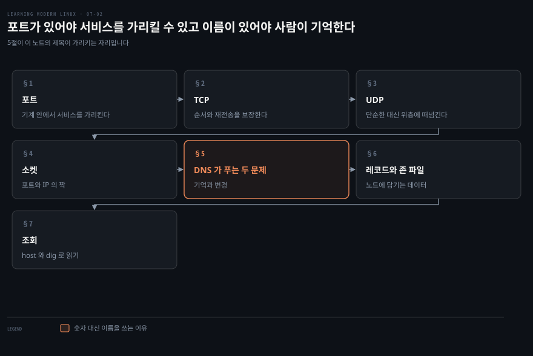
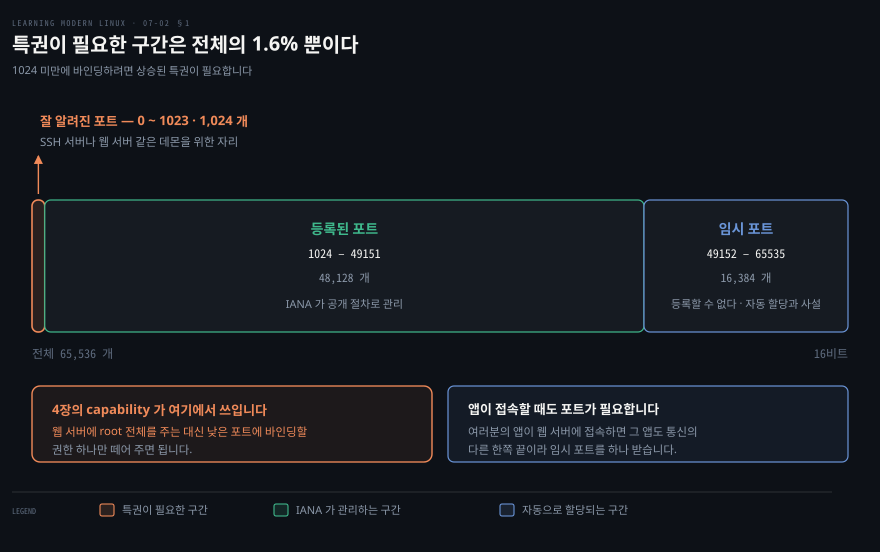
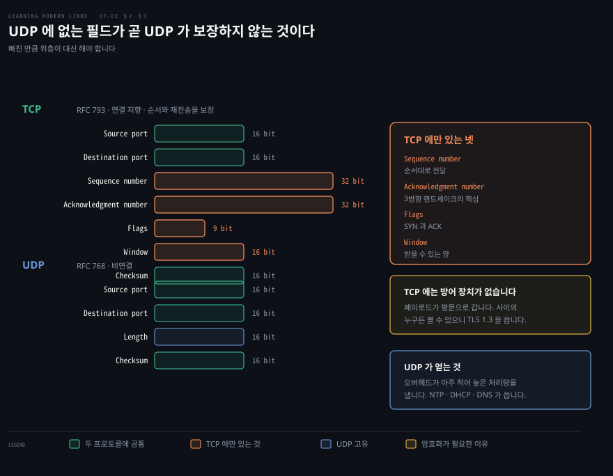
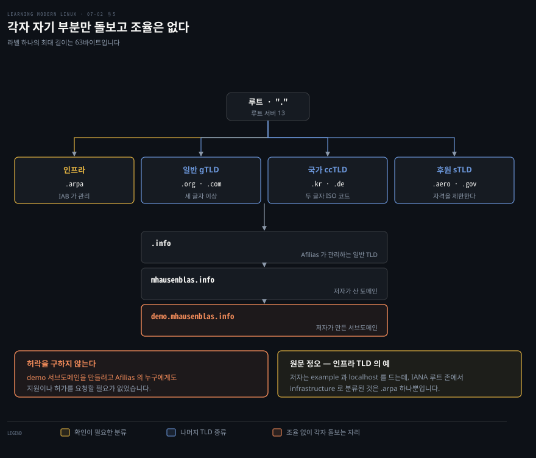
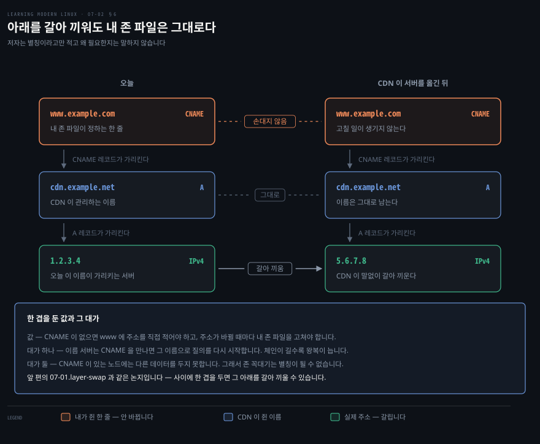
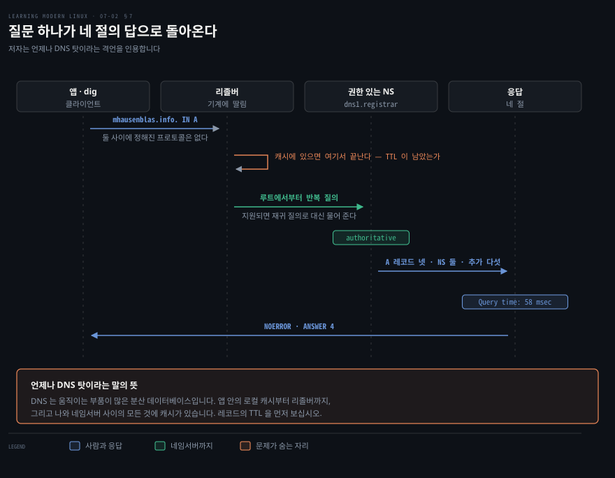

# 포트가 있어야 서비스를 가리킬 수 있고 이름이 있어야 사람이 기억한다

---

> 7장 노트의 둘째 편입니다. 앞 편이 기계까지 패킷을 배달하는 두 층을 다뤘다면, 이 편은 그 기계 안의 **어느 서비스**인지를 가리키는 층과, 그 기계를 **어떤 이름**으로 부를 것인지를 정하는 체계를 다룹니다.

## 핵심 요약

> 이 구간이 매달린 생각은 **주소만으로는 부족하다**는 것입니다. IP 주소는 기계까지만 데려다주고 사람은 숫자를 기억하지 못합니다.

그 두 부족함을 포트와 DNS 가 각각 메웁니다. 포트는 IP 주소에서 이용할 수 있는 서비스를 식별하는 고유한 16비트 숫자입니다. 한 기계에 여러 서비스가 돌 수 있으므로 그 기계의 IP 안에서 각각을 가릴 수 있어야 하기 때문입니다.

DNS 가 푸는 문제는 둘이라고 저자는 적습니다.

- 사람은 일반적으로 **긴 숫자보다 이름을 잘 기억**합니다. 친구에게 웹사이트를 알려 줄 때 `4.31.198.44` 대신 `ietf.org` 를 보라고 하면 됩니다.
- 인터넷과 그 위의 앱이 만들어진 방식 때문에 **IP 주소는 자주 바뀝니다**. 새 서버를 받으면 새 IP 를 받고, 컨테이너 문맥이라면 다른 호스트로 재배치되면서 자동으로 새 IP 를 받습니다.

한마디로 IP 주소는 기억하기 어렵고 바뀔 수 있는 데 비해, 서버나 서비스의 이름은 그대로입니다. 저자가 곧바로 덧붙이는 한 줄이 이 편을 쿠버네티스로 잇습니다. 이 명명 체계는 광역 배포에서만 쓰이는 것이 아니라 쿠버네티스 같은 컨테이너 환경에서 서비스 디스커버리의 중심 구성요소이기도 하다는 것입니다.


## 학습 목표

> 이 구간을 읽고 나면 아래 여덟 가지를 스스로 해낼 수 있습니다.

1. 포트 세 구간을 나누고 1024 미만이 특별한 이유를 말할 수 있습니다.
2. TCP 와 UDP 를 헤더 필드와 보장 수준으로 구분할 수 있습니다.
3. 소켓이 무엇으로 식별되는지 말하고 `ss` 로 조회할 수 있습니다.
4. DNS 의 네 개념과 TLD 종류를 구분할 수 있습니다.
5. `dig` 출력의 각 절과 SRV 레코드의 네 값을 읽을 수 있습니다.
6. TCP 헤더에 IP 주소 칸이 없는데 체크섬은 IP 를 보는 이유와 그 대가를 설명할 수 있습니다.
7. DNS 의 TTL 과 IP 의 TTL 을 단위와 줄이는 주체로 갈라 말할 수 있습니다.
8. 소켓이 `read` 와 `write` 로 다뤄지는 까닭을 파일 디스크립터로 설명할 수 있습니다.

아래는 이 문서 전체를 읽는 순서로 이은 지도입니다. 칸마다 절 번호와 그 절이 답하는 물음 하나를 적었습니다. 색이 붙은 칸이 이 노트의 제목이 가리키는 자리입니다.




## 이 문서가 다루지 않는 것

> 저자가 스스로 그은 선과, 노트를 나누며 생긴 경계를 함께 적습니다.

- 링크 계층과 인터넷 계층 → [앞 노트](./07-01.%EA%B2%B0%EA%B5%AD%EC%9D%80%20%EC%84%A0%EA%B3%BC%20%EA%B3%B5%EA%B8%B0%EB%A5%BC%20%ED%83%80%EA%B3%A0%20%EB%8B%A4%EB%8B%88%EB%8A%94%20%EB%B9%84%ED%8A%B8%EB%8B%A4.md)가 다룹니다
- 애플리케이션 계층 프로토콜과 도구 → [다음 노트](./07-03.%EC%A3%BC%EA%B3%A0%EB%B0%9B%EB%8A%94%20%EC%9D%BC%EC%9D%80%20%EA%B2%B0%EA%B5%AD%20%EB%AA%87%20%EA%B0%9C%EC%9D%98%20%EB%AA%85%EB%A0%B9%EC%9C%BC%EB%A1%9C%20%EC%A4%84%EC%96%B4%EB%93%A0%EB%8B%A4.md)가 다룹니다
- DNS 해석의 평가와 구성 논리 → RFC 1034·1035 가 다루며 책의 범위를 넘는다고 저자가 밝힙니다
- TLS 의 상세 → 암호화하려면 TLS 를, 되도록 RFC 8446 의 1.3 버전을 쓰라고만 적습니다
- 네트워크 문제 해결 도구 → 8장 관측으로 미룹니다

저자가 소켓에 관해 붙이는 단서도 하나 옮깁니다. 네트워크 관련 도구나 앱을 개발할 것이 아니라면 소켓을 직접 쓸 일은 없겠지만, 조회하는 방법은 알아 두라는 것입니다.


## 1. 포트 — 기계 안에서 서비스를 가리키는 번호

> IP 주소는 기계까지만 데려다줍니다. 그런데 한 기계에 서비스가 여럿 돌고 있으면 그중 어느 것인지를 가려야 합니다.



전송 계층의 핵심 개념 하나가 포트입니다. 이 층에서 어느 프로토콜을 쓰든 포트가 필요합니다.

포트는 IP 주소에서 이용할 수 있는 서비스를 식별하는 고유한 16비트 숫자입니다. 16비트이므로 0 부터 65,535 까지입니다.

세 구간으로 갈립니다.

**잘 알려진 포트**는 0 부터 1023 까지입니다. SSH 서버나 웹 서버 같은 데몬을 위한 것입니다. 이 중 하나를 쓰려면, 그러니까 거기에 바인딩하려면 상승된 특권이 필요합니다. `root` 이거나 `CAP_NET_BIND_SERVICE` capability 를 가져야 합니다.

**등록된 포트**는 1024 부터 49151 까지입니다. IANA 가 공개된 절차를 통해 관리합니다.

**임시 포트**는 49152 부터 65535 까지입니다. 등록할 수 없습니다. 임시 포트를 자동으로 할당하는 데 쓰거나 회사 내부 서비스 같은 사설 용도로 씁니다. 저자가 드는 예가 명확합니다. 여러분의 앱이 웹 서버에 접속하면 그 앱도 포트가 필요합니다. 통신의 다른 한쪽 끝이기 때문입니다.

포트와 그 대응은 `/etc/services` 에서 볼 수 있습니다.

`CAP_NET_BIND_SERVICE` 라는 이름이 4장에서 본 그 capability 입니다. 특권을 독립된 단위로 쪼갠 결과가 여기에서 하나의 구체적인 쓰임새를 얻습니다. 웹 서버에 `root` 전체를 주는 대신 낮은 포트에 바인딩할 권한만 주면 됩니다.

어떤 포트가 실제로 열려 있는지 확인할 때 저자가 꺼내는 도구가 `nmap` 입니다. 여기는 노트의 읽기입니다. 원서는 명령과 출력만 보이고 이것이 무슨 도구인지는 적지 않습니다.

이름은 network mapper 의 줄임이고, 프로젝트 자신은 네트워크 탐색과 보안 감사를 위한 오픈 소스 도구라고 소개합니다.[^nmap] 원시 IP 패킷을 직접 지어 보내서 어느 호스트가 살아 있고 그 위에 무엇이 떠 있는지를 알아냅니다. `-A` 는 그 탐지를 한꺼번에 켜는 스위치라 열린 포트 목록에 그치지 않고 서비스의 종류와 버전까지 캐냅니다. 아래 출력의 `CUPS 2.2` 가 그렇게 얻은 값입니다.

```bash
nmap -A localhost
```

```bash
Starting Nmap 7.60 ( https://nmap.org ) at 2021-09-19 14:53 IST
Nmap scan report for localhost (127.0.0.1)
Host is up (0.00025s latency).
Not shown: 999 closed ports
PORT    STATE SERVICE VERSION
631/tcp open  ipp     CUPS 2.2
```

저자가 이 명령에 경고를 답니다. 다른 사람의 기계나 로컬이 아닌 IP 를 상대로는 하지 말라는 것입니다. 열린 포트 하나가 나왔는데 631 이고 인터넷 인쇄 프로토콜입니다.


## 2. TCP — 순서와 재전송을 보장하는 쪽

> 이 층에서 갈리는 것은 통신의 성격입니다. 연결 지향 프로토콜이 있고 비연결 프로토콜이 있습니다.



둘 중 무엇을 쓸지는 취향이 아니라 무엇을 보장받아야 하는지가 정합니다. 그 보장의 목록이 곧 헤더 필드의 목록입니다.

TCP 는 연결 지향 전송 계층 프로토콜이며 HTTP 와 SSH 같은 여러 상위 프로토콜이 씁니다. 세션 기반 프로토콜이라 패킷을 순서대로 전달하는 것을 보장하고, 오류가 나면 재전송을 지원합니다.

TCP 헤더는 RFC 793 과 관련 IETF 명세가 정의하며, 저자가 가장 중요하다고 꼽는 필드는 이렇습니다.

| 필드 | 비트 | 무엇인가 |
|---|:--:|---|
| Source port | 16 | 보내는 쪽이 쓰는 포트 |
| Destination port | 16 | 받는 쪽이 쓰는 포트 |
| Sequence number | 32 | 순서대로 전달하는 것을 관리하는 데 씀 |
| Acknowledgment number | 32 | SYN·ACK 플래그와 함께 TCP/IP 3방향 핸드셰이크의 핵심 |
| Flags | 9 | 그중 가장 중요한 것이 SYN 과 ACK |
| Window | 16 | 수신 윈도 크기 |
| Checksum | 16 | TCP 헤더의 체크섬. 오류 검사용 |

저자가 든 RFC 793 은 지금 현행이 아닙니다. 2022년 8월의 RFC 9293 이 793 을 폐기하고 그 자리를 이어받았으며 인터넷 표준 번호 STD 7 도 이 문서가 답니다.[^rfc9293] 책이 같은 해에 나왔으니 저자를 탓할 일은 아닙니다. 노트만 현행을 나란히 적어 두고, 위 표의 필드는 두 문서에서 같습니다.

TCP 는 연결의 상태를 수립부터 종료까지 추적합니다. 보내는 쪽과 받는 쪽이 몇 가지를 협상해야 하는데, 얼마나 많은 데이터를 보낼지(TCP 윈도 크기)부터 서비스 품질까지입니다.

보안 관점에서 저자가 단호하게 적습니다. TCP 에는 **어떤 방어 장치도 없습니다**. 페이로드가 평문으로 전송되고, 보내는 쪽과 받는 쪽 사이에 있는 누구든 패킷을 들여다볼 수 있습니다. 그리고 설계상 그 사이에는 홉이 여럿 있습니다.

메시지를 암호화하려면 TLS 를 써야 하며, 되도록 RFC 8446 의 1.3 버전을 쓰라고 저자는 덧붙입니다.

### 헤더에 IP 주소가 없는데 체크섬은 IP 를 봅니다

여기서부터는 노트의 읽기입니다. 위 표를 다시 보면 TCP 헤더에 IP 주소 칸이 없습니다. 당연합니다. 주소를 다루는 것은 아래층인 인터넷 계층의 일이고, 앞 편에서 본 대로 각 층은 바로 위아래만 알면 됩니다. 전송 계층은 어느 기계로 가는지 모른 채 어느 서비스로 갈지만 정합니다.

그런데 체크섬 하나가 그 선을 넘습니다. RFC 9293 은 체크섬이 **의사 헤더**까지 덮는다고 적습니다. 의사 헤더는 실제로 전송되지 않고 계산할 때만 TCP 헤더 앞에 붙였다고 치는 가상의 96비트인데, 그 안에 출발지와 목적지 IP 주소가 들어갑니다.[^pseudo]

왜 그렇게 했는지도 같은 문장이 답합니다. 의사 헤더를 체크섬에 포함하면 **잘못 배달된 세그먼트로부터 연결을 보호**할 수 있다는 것입니다. 포트 번호는 맞는데 IP 는 엉뚱한 세그먼트가 흘러들어와도, 받는 쪽이 자기 IP 로 다시 계산해 보면 값이 어긋나 걸러집니다.

대가는 NAT 이 치릅니다. 주소를 바꾸는 장치는 IP 헤더만 고쳐서는 안 되고 TCP 체크섬도 다시 계산해야 합니다. RFC 3022 가 그 이유를 한 문장으로 못 박습니다. TCP·UDP 체크섬이 출발지와 목적지 IP 주소를 담은 의사 헤더를 함께 덮기 때문이라는 것입니다.[^natsum]

[앞 편](./07-01.%EA%B2%B0%EA%B5%AD%EC%9D%80%20%EC%84%A0%EA%B3%BC%20%EA%B3%B5%EA%B8%B0%EB%A5%BC%20%ED%83%80%EA%B3%A0%20%EB%8B%A4%EB%8B%88%EB%8A%94%20%EB%B9%84%ED%8A%B8%EB%8B%A4.md)이 방화벽과 NAT 을 계층 위반의 예로 든 자리와 이어집니다. 다만 방향이 반대입니다. 방화벽은 아래층에 붙은 코드가 위층 헤더를 열어 보는 쪽이고, 의사 헤더는 위층이 아래층 값을 빌려 오는 쪽입니다. 그리고 이쪽은 남이 끼어든 예외가 아니라 프로토콜 자신이 명세에 적어 둔 설계입니다.


## 3. UDP — 단순한 대신 위층에 떠넘기는 쪽

> 연결을 세우지 않고 그냥 보내는 프로토콜입니다. 그래서 오버헤드가 거의 없습니다.

UDP 는 비연결 전송 계층 프로토콜이고, UDP 에서 데이터그램이라 부르는 메시지를 통신 설정 없이 보내게 해 줍니다. TCP 가 핸드셰이크로 하는 그 설정이 없다는 뜻입니다. 다만 데이터그램 체크섬은 지원해서 무결성을 보장합니다.

UDP 를 쓰는 애플리케이션 계층 프로토콜이 여럿인데, NTP 와 DHCP 가 있고 DNS 도 그렇습니다.

RFC 768 이 정의하는 UDP 헤더의 중요한 필드는 넷입니다.

| 필드 | 비트 | 무엇인가 |
|---|:--:|---|
| Source port | 16 | 보내는 쪽이 쓰는 포트. 선택이며 쓰지 않으면 0 |
| Destination port | 16 | 받는 쪽이 쓰는 포트 |
| Length | 16 | UDP 헤더와 데이터를 합친 전체 길이 |
| Checksum | 16 | 선택적으로 오류 검사에 쓸 수 있음 |

두 표를 나란히 놓으면 무엇이 빠졌는지가 보입니다. UDP 에는 순서 번호도 확인 응답 번호도 윈도도 플래그도 없습니다. 그래서 저자의 평가가 정확합니다. UDP 는 아주 단순한 프로토콜이고, TCP 라면 자기가 처리했을 많은 것을 그 위에서 도는 상위 프로토콜이 맡아야 합니다.

그 대가로 얻는 것도 분명합니다. UDP 는 오버헤드가 아주 적어 높은 처리량을 낼 수 있습니다.


## 4. 소켓 — 통신의 끝점

> 포트와 IP 를 각각 알아 봐야 실제로 통신하는 것은 그 둘의 짝입니다. 리눅스가 그 짝에 이름을 붙인 것이 소켓입니다.

리눅스가 제공하는 고수준 통신 인터페이스가 소켓입니다. 통신의 끝점이라고 생각하면 되고, 자기만의 정체성을 갖습니다. TCP 나 UDP 포트와 IP 주소로 이루어진 튜플이 그 정체성입니다.

저자가 실무적인 단서를 답니다. 네트워크 관련 도구나 앱을 개발할 것이 아니라면 소켓을 직접 쓸 일은 없겠지만, 조회하는 방법은 알아 두라는 것입니다. Docker 데몬 문맥에서 그 소켓에 필요한 권한을 알아야 하는 경우를 예로 듭니다.

저자가 `ss` 를 아무 설명 없이 꺼내는데 여기도 노트의 읽기를 한 겹 붙입니다. `ss` 는 net-tools 의 `netstat` 을 대신하는 iproute2 쪽 도구입니다. [앞 편](./07-01.%EA%B2%B0%EA%B5%AD%EC%9D%80%20%EC%84%A0%EA%B3%BC%20%EA%B3%B5%EA%B8%B0%EB%A5%BC%20%ED%83%80%EA%B3%A0%20%EB%8B%A4%EB%8B%88%EB%8A%94%20%EB%B9%84%ED%8A%B8%EB%8B%A4.md)에서 `ifconfig` 대신 `ip link` 를 쓰라던 그 세대 교체와 같은 이동입니다.

말을 보태는 쪽이 `netstat` 자신입니다. 그 man page 는 이 프로그램이 대체로 폐기됐다고 적고 대체표까지 붙여 둡니다. `netstat` 은 `ss` 로, `netstat -r` 은 `ip route` 로, `netstat -i` 는 `ip -s link` 로 가라는 것입니다.[^netstat] 그러니 `ss` 가 밀어낸 자리는 `lsof` 가 아니라 `netstat` 입니다. `lsof` 와는 축이 달라 밀어낼 수가 없는데, 그 이야기는 아래에서 합니다.

```bash
ss -s
```

```bash
Total: 913 (kernel 0)
TCP:   10 (estab 4, closed 1, orphaned 0, synrecv 0, timewait 1/0), ports 0

Transport Total     IP        IPv6
RAW       1         0         1
UDP       10        8         2
TCP       9         8         1
INET      20        16        4
FRAG      0         0         0
```

`-s` 는 요약을 달라는 뜻입니다. 전체 TCP 소켓이 10개이고, 그 아래 표가 종류와 IP 버전으로 쪼갠 것입니다.

더 자세히 보고 싶으면 플래그를 조합합니다.

```bash
ss -ulp
```

```bash
State   Recv-Q Send-Q Local Address:Port    Peer Address:Port
UNCONN  0      0      0.0.0.0:60360         0.0.0.0:*
UNCONN  0      0      127.0.0.53%lo:domain  0.0.0.0:*
UNCONN  0      0      0.0.0.0:bootpc        0.0.0.0:*
UNCONN  0      0      0.0.0.0:ipp           0.0.0.0:*
UNCONN  0      0      0.0.0.0:mdns          0.0.0.0:*
UNCONN  0      0      [::]:mdns             [::]:*
...
```

`-u` 는 UDP 소켓으로 한정하고 `-l` 은 듣는 소켓만 고르며 `-p` 는 프로세스 정보도 보입니다.

이 출력에 앞 편의 내용이 그대로 나타납니다. `0.0.0.0` 이 그 기계의 모든 IPv4 주소를 뜻한다고 읽었는데, 여기 듣는 소켓 대부분이 그 주소에 바인딩되어 있습니다. 그리고 `127.0.0.53%lo:domain` 은 루프백에만 묶여 있어 밖에서 닿지 않습니다.

소켓과 프로세스를 함께 보려면 `lsof` 가 있습니다.

```bash
lsof -c chrome -i udp | head -5
```

`-c` 로 이름으로 프로세스를 고르고 `-i` 로 UDP 로 한정합니다. 저자는 출력이 수십 줄이라 `head -5` 로 줄였다고 밝힙니다.

`ss` 와 `lsof` 는 겹치는 것처럼 보이지만 재는 축이 다릅니다. 두 man page 의 첫 줄이 그 차이를 그대로 적어 둡니다. `ss` 는 소켓을 살피는 도구라 소켓 통계를 쏟아 내고,[^ss] `lsof` 는 프로세스가 연 파일의 정보를 나열합니다.[^lsof]

그래서 답할 수 있는 질문이 갈립니다. 「지금 무엇이 8080 을 듣고 있나」는 소켓 축이라 `ss` 가 답합니다. 「이 프로세스가 무엇을 열어 두고 있나」는 프로세스 축이라 `lsof` 가 답합니다. 포트를 쥔 범인을 찾을 때 둘을 잇는 형태를 쓰는 이유도 그것입니다.

```bash
ss -tlnp                 # 소켓 축 — 듣고 있는 TCP 소켓과 그것을 쥔 프로세스
lsof -p 1234             # 프로세스 축 — 그 프로세스가 열어 둔 것 전부
lsof -i :8080            # 두 축이 만나는 자리 — 그 포트를 쓰는 프로세스
```

### 소켓이 read 와 write 로 다뤄지는 이유

여기서부터는 노트의 읽기입니다. 저자는 소켓을 조회하는 방법까지만 보이고, 소켓이 프로그램 안에서 어떤 모습인지는 말하지 않습니다. 그 자리를 파일 디스크립터가 채웁니다.

`socket()` 시스템 콜의 설명이 짧고 정확합니다. 통신의 끝점을 만들고 **그 끝점을 가리키는 파일 디스크립터를 돌려준다**는 것입니다.[^socket] 저자가 소켓을 통신의 끝점이라 부른 그 말이 시스템 콜 설명에 그대로 붙어 있습니다.

파일 디스크립터는 프로세스가 열어 둔 것들의 표에 매긴 번호입니다. `open()` 의 반환값을 두고 man page 는 작은 음이 아닌 정수이며 그 표의 항목을 가리키는 색인이라고 적습니다.[^fd] 0·1·2 는 프로그램이 시작할 때부터 표준 입력·표준 출력·표준 오류에 매여 있어서, 우리가 여는 것은 3번부터입니다.[^stdio]

이것이 소켓을 `read` 와 `write` 로 다룰 수 있는 이유입니다. [5장](./05-01.%EB%AA%A8%EB%93%A0%20%EA%B2%83%EC%9D%B4%20%ED%8C%8C%EC%9D%BC%EC%9D%B4%EB%9D%BC%EB%8A%94%20%EB%A7%90%EC%9D%80%20%EC%86%90%EC%9E%A1%EC%9D%B4%EA%B0%80%20%ED%95%98%EB%82%98%EB%9D%BC%EB%8A%94%20%EB%9C%BB%EC%9D%B4%EB%8B%A4.md)에서 본 「모든 것이 파일」이라는 말의 손잡이가 여기까지 뻗어 있습니다. 커널이 보기에 소켓은 번호가 붙은 또 하나의 열린 것이고, 그래서 파일에 쓰던 시스템 콜이 그대로 먹힙니다.

`/proc/PID/fd` 를 열면 그 표가 눈에 보입니다. 각 항목은 실제 대상을 가리키는 심볼릭 링크인데, 소켓은 `socket:[2248868]` 처럼 종류와 inode 번호로 나타납니다.[^procfd] 그 inode 로 `/proc/net` 아래를 뒤지면 `ss` 가 보여 주던 그 소켓에 닿습니다. `lsof` 가 소켓을 나열할 수 있는 것도 소켓이 그 표 안에 있기 때문입니다.

```bash
ls -l /proc/self/fd      # 이 셸이 열어 둔 것들 — 0·1·2 와 그 뒤
ulimit -n                # 한 프로세스가 열 수 있는 파일 디스크립터 상한
```

상한이 있다는 사실이 실무에서 돌아옵니다. 연결을 많이 쥔 서버는 `accept()` 가 `EMFILE` 로 실패하는데, 그 오류에 붙은 이름이 **too many open files** 입니다.[^emfile] 흔한 원인으로 man page 가 지목하는 것이 `RLIMIT_NOFILE` 한도 초과이고, `ulimit -n` 이 보여 주는 값이 그것입니다. 연결 하나가 파일 하나를 먹는다는 것이 그 로그의 뜻입니다.


## 5. DNS 가 푸는 두 문제

> 숫자 주소에는 문제가 둘 있습니다. 사람이 기억하지 못한다는 것과, 그 숫자가 바뀐다는 것입니다.



저자가 먼저 문제를 셉니다.

사람은 일반적으로 긴 숫자보다 이름을 잘 기억합니다. 친구에게 웹사이트를 알려 줄 때 `4.31.198.44` 를 보라고 하는 대신 `ietf.org` 를 보라고 하면 됩니다.

그리고 IP 주소는 자주 바뀝니다. 전통적인 환경에서는 새 서버를 받으면 새 IP 를 받습니다. 컨테이너 문맥에서는 다른 호스트로 재배치될 수 있고, 그러면 컨테이너가 자동으로 새 IP 를 배정받습니다.

한마디로 IP 주소는 기억하기 어렵고 바뀔 수 있는 반면, 서버나 서비스의 이름은 그대로입니다.

이 문제는 인터넷의 시작부터, 그리고 유닉스가 TCP/IP 스택을 지원한 때부터 있었습니다. 처음의 해법은 기계 하나의 문맥에서 `/etc/hosts` 로 이름과 IP 의 대응을 지역적으로 유지하는 것이었습니다. NIC 라는 조직이 `HOSTS.TXT` 라는 파일 하나를 FTP 로 참여 호스트 전부에 나눠 줬습니다.

이 중앙집중 방식이 커 가는 인터넷을 따라가지 못한다는 것이 곧 분명해졌고, 1980년대 초에 분산 시스템이 설계됐습니다. 주 설계자가 Paul Mockapetris 입니다.

DNS 는 인터넷의 호스트와 서비스를 위한 세계적이고 계층적인 명명 체계입니다. 관련 RFC 가 많지만 원래의 RFC 1034 와 그 구현 지침인 RFC 1035 가 여전히 유효하며, 동기와 설계를 더 알고 싶으면 읽어 보라고 저자는 강하게 권합니다.

### 개념 넷

**도메인 이름 공간**은 `.` 을 루트로 하는 트리 구조이고, 각 트리 노드와 잎이 특정 공간에 관한 정보를 담습니다. 잎에서 루트까지의 경로를 따라가며 만나는 라벨들이 FQDN 입니다. 라벨 하나의 최대 길이는 63바이트입니다. `demo.mhausenblas.info.` 가 FQDN 이고 최상위 도메인은 `.info` 입니다. 맨 오른쪽 점, 곧 루트는 흔히 생략합니다.

**자원 레코드**는 도메인 이름 공간의 노드나 잎에 담긴 페이로드입니다.

**네임서버**는 도메인 트리 구조에 관한 정보를 갖는 서버 프로그램입니다. 어떤 공간에 관한 완전한 정보를 가지면 권한 있는 네임서버라고 부릅니다. 권한 있는 정보는 존 단위로 조직됩니다.

**리졸버**는 클라이언트 요청에 응해 네임서버에서 정보를 뽑아 오는 프로그램입니다. 기계에 딸려 있고, 리졸버와 클라이언트 사이의 상호작용에는 명시적인 프로토콜이 정의되어 있지 않습니다. DNS 를 해석하는 라이브러리 호출이 지원되는 경우가 많습니다.

저자가 현대 시스템에 관한 단서를 답니다. `/etc/resolv.conf` 의 DNS 리졸버 설정이 아직 남아 있기는 하지만, 특히 DHCP 를 쓰는 요즘 시스템에서는 보통 그것을 쓰지 않는다는 것입니다.

### 뿌리와 최상위 도메인

DNS 는 계층적 명명 체계이고, 그 뿌리에 최상위 도메인의 레코드를 관리하는 루트 서버 13개가 앉아 있습니다. 루트 바로 아래가 최상위 도메인입니다.

저자가 가르는 종류는 넷입니다.

- **인프라 최상위 도메인**
- **일반 최상위 도메인**은 세 글자 이상인 일반 도메인이며 `.org` 나 `.com` 같은 것입니다.
- **국가 코드 최상위 도메인**은 두 글자 ISO 국가 코드가 배정된 나라나 영토를 위한 것입니다.
- **후원 최상위 도메인**은 그 TLD 를 쓸 자격을 제한하는 규칙을 세우고 강제하는 사설 기관이나 조직을 위한 것이며 `.aero` 와 `.gov` 가 예입니다.

> **원문 정오**: 저자는 인프라 최상위 도메인을 "IETF 를 대신해 IANA 가 관리하며 `example` 과 `localhost` 를 포함한다" 고 적습니다. IANA 의 루트 존 데이터베이스에서 `infrastructure` 로 분류된 TLD 는 **`.arpa` 하나뿐**이고 관리 주체는 IAB 로 적혀 있습니다.[^arpa] `example` 과 `localhost` 는 루트 존에 아예 없습니다. 이 둘은 RFC 6761 이 정하는 특수 용도 도메인 이름이라 TLD 분류와는 다른 범주입니다. 그래서 인프라 TLD 의 예를 찾으려면 `.arpa` 를 보아야 하고, 앞 편에서 본 역방향 조회 `153.110.199.185.in-addr.arpa` 가 바로 그 예입니다.


## 6. 레코드 종류와 존 파일

> 네임서버가 관리하는 것은 레코드입니다. FQDN 이 노드의 주소라면 자원 레코드는 그 노드의 데이터입니다.



종류가 여럿인 이유가 있습니다. 이름을 주소로 바꾸는 일만 필요했다면 한 종류로 충분했을 텐데, 실제로는 별칭과 위임과 역방향 조회 같은 다른 일도 같은 체계로 처리해야 했습니다.

레코드는 종류와 페이로드와 다른 필드를 담는데, TTL 같은 것이 그 다른 필드입니다. TTL 은 그 레코드를 버려야 하는 시점까지의 시간입니다.

저자가 알파벳 순으로 꼽는 가장 중요한 종류는 여섯입니다.

| 종류 | RFC | 무엇인가 |
|---|---|---|
| A / AAAA | 1035 / 3596 | IPv4 와 IPv6 주소 레코드. 호스트명을 호스트의 IP 주소에 대응 |
| CNAME | 1035 | 정식 이름 레코드. 한 이름의 다른 이름에 대한 별칭 |
| NS | 1035 | 네임서버 레코드. DNS 존을 권한 있는 네임서버에 위임 |
| PTR | 1035 | 포인터 레코드. 역방향 DNS 조회에 씀. A 레코드의 반대 |
| SRV | 2782 | 서비스 위치 레코드. 일반화된 디스커버리 장치 |
| TXT | 1035 | 텍스트 레코드. 원래는 사람이 읽는 임의의 텍스트를 위한 것 |

SRV 에 저자가 붙이는 설명이 이 노트에서 중요합니다. 전통적으로 메일 교환에 `MX` 라는 전용 종류가 있었던 것처럼 하드코딩하는 대신, 일반화된 디스커버리 장치를 만든 것이라는 설명입니다.

TXT 에도 재미있는 단서가 붙습니다. 원래는 사람이 읽는 임의의 텍스트를 위한 것이었는데 시간이 지나며 새 쓰임새를 찾았고, 오늘날에는 보안 관련 DNS 확장 문맥에서 기계가 읽는 데이터를 담는 경우가 많다는 것입니다.

별표 라벨(`*`)로 시작하는 와일드카드 레코드도 있습니다. 존재하지 않는 이름에 대한 요청을 모두 받아 내는 용도입니다.

레코드는 존 파일이라는 텍스트 형식으로 표현되고, `bind` 같은 네임서버가 그것을 읽어 자기 데이터베이스의 일부로 삼습니다.

```bash
$ORIGIN example.com.
$TTL 3600
@       SOA nse.example.com. nsmaster.example.com. (
                1234567890 ; serial number
                21600      ; refresh after 6 hours
                3600       ; retry after 1 hour
                604800     ; expire after 1 week
                3600 )     ; minimum TTL of 1 hour
example.com.    IN  NS      nse
example.com.    IN  MX      10 mail.example.com.
example.com.    IN  A       1.2.3.4
nse             IN  A       5.6.7.8
www             IN  CNAME   example.com.
mail            IN  A       9.0.0.9
```

저자가 붙인 설명을 옮기면 이렇습니다. `$ORIGIN` 이 이름 공간에서 이 존 파일이 시작하는 곳입니다. `$TTL` 은 자기 TTL 을 정의하지 않는 모든 자원 레코드의 기본 만료 시간입니다.

이어서 이 도메인의 네임서버와 메일서버가 나오고 이 도메인의 IPv4 주소와 네임서버의 IPv4 주소가 나옵니다. 그다음 `www.example.com` 을 이 도메인의 별칭으로 만들고, 마지막이 메일 서버의 IPv4 주소입니다.

### CNAME 이 사는 이유

여기서부터는 노트의 읽기입니다. 저자는 CNAME 을 별칭이라고만 적고 왜 그런 것이 필요한지는 말하지 않습니다. 위 존 파일의 `www IN CNAME example.com.` 한 줄이 무엇을 사는지가 그 자리입니다.

사는 것은 **갈아 끼울 자유**입니다. `www` 에 A 레코드로 주소를 직접 적어 두면 서버를 옮길 때마다 내 존 파일을 고쳐야 합니다. 대신 CDN 이 준 이름을 가리키게 해 두면 CDN 이 서버를 옮겨 주소가 바뀌어도 내가 고칠 줄은 없습니다. 이 절의 도식에서 색이 붙은 맨 윗줄이 그 자리입니다.

[앞 편](./07-01.%EA%B2%B0%EA%B5%AD%EC%9D%80%20%EC%84%A0%EA%B3%BC%20%EA%B3%B5%EA%B8%B0%EB%A5%BC%20%ED%83%80%EA%B3%A0%20%EB%8B%A4%EB%8B%88%EB%8A%94%20%EB%B9%84%ED%8A%B8%EB%8B%A4.md) §2 의 「서로를 모르기 때문에 갈아 끼울 수 있습니다」와 같은 이야기입니다. 거기서는 층이 서로를 몰라서 갈아 끼울 수 있었고 여기서는 이름 한 겹이 사이에 있어서 그렇습니다. **사이에 한 겹을 두면 그 아래를 바꿀 수 있다**는 성질이 두 자리에서 같은 모양으로 나타납니다.

대가는 RFC 1034 가 두 문장으로 적어 둡니다. 하나는 왕복입니다. 이름 서버는 CNAME 을 만나면 그 이름으로 **질의를 다시 시작**하므로, 체인이 길수록 답에 닿기까지 오가는 횟수가 늡니다.[^cnamechain]

또 하나는 자리의 제약입니다. CNAME 이 있는 노드에는 다른 데이터를 두지 못합니다. 정식 이름과 그 별칭의 데이터가 서로 달라지는 것을 막기 위해서입니다.[^cnamealone] 그래서 저자의 존 파일에서 별칭이 된 것은 `www` 이지 `example.com` 자신이 아닙니다. 존 꼭대기에는 이미 SOA 와 NS 가 앉아 있어서 별칭이 될 수 없습니다.

이 파일에서 저자가 말한 분산의 성질이 드러납니다. `.info` 는 Afilias 라는 회사가 관리하는 일반 TLD 이고 `mhausenblas.info` 는 저자가 산 도메인인데, `demo` 서브도메인을 만들려고 Afilias 의 누구에게도 지원이나 허가를 요청할 필요가 없었다는 것입니다. 각 주체가 자기 부분만 돌보고 조율이 필요 없다는 이 단순한 사실이 DNS 를 분산적이고 확장 가능하게 만드는 핵심입니다.


## 7. 조회 — host 와 dig 로 읽기

> 네임서버와 리졸버라는 기반이 다 갖춰졌으면 이제 물어볼 차례입니다.



해석의 평가와 구성에는 논리가 많지만 대부분 RFC 1034·1035 가 다루며 이 책의 범위를 넘는다고 저자는 밝힙니다. 내부를 이해하지 않고 질의하는 방법만 봅니다.

`host` 는 지역과 전역 이름을 IP 주소로 해석하고 그 반대도 합니다.

```bash
host mhausenblas.info
```

```bash
mhausenblas.info has address 185.199.110.153
mhausenblas.info has address 185.199.109.153
mhausenblas.info has address 185.199.111.153
mhausenblas.info has address 185.199.108.153
```

```bash
host 185.199.110.153
```

```bash
153.110.199.185.in-addr.arpa domain name pointer cdn-185-199-110-153.github
```

이 줄도 `github` 에서 끊겨 있는데 원서의 출력이 그렇습니다. 역방향 조회의 이름을 잘 보면 IP 의 옥텟이 거꾸로 뒤집혀 `in-addr.arpa` 에 붙어 있습니다. 앞 절의 정오에서 말한 그 인프라 TLD 가 여기 쓰입니다.

더 강력한 방법이 `dig` 입니다.

```bash
dig mhausenblas.info
```

```bash
;; ->>HEADER<<- opcode: QUERY, status: NOERROR, id: 43159
;; flags: qr rd ra; QUERY: 1, ANSWER: 4, AUTHORITY: 2, ADDITIONAL: 5

;; QUESTION SECTION:
;mhausenblas.info.              IN      A

;; ANSWER SECTION:
mhausenblas.info.       1799    IN      A       185.199.111.153
mhausenblas.info.       1799    IN      A       185.199.108.153
...

;; AUTHORITY SECTION:
mhausenblas.info.       1800    IN      NS      dns1.registrar-servers.com.
mhausenblas.info.       1800    IN      NS      dns2.registrar-servers.com.

;; ADDITIONAL SECTION:
dns1.registrar-servers.com. 47950 IN    A       156.154.132.200
...

;; Query time: 58 msec
;; SERVER: 172.16.173.64#53(172.16.173.64)
```

위 블록은 지면에 맞춰 줄인 것이고 생략한 자리에 `...` 을 넣었습니다. 헤더의 `ANSWER: 4` 와 `ADDITIONAL: 5` 가 실제 개수이니 A 레코드가 넷, 추가 절이 다섯입니다.

네 절이 각각 무엇인지가 이 출력의 구조입니다. QUESTION 이 물어본 것, ANSWER 가 A 레코드들, AUTHORITY 가 권한 있는 네임서버, ADDITIONAL 이 그 네임서버의 주소입니다. `1799` 와 `1800` 은 각 레코드의 TTL 입니다.

`dig` 의 대안으로 `dog` 와 `nslookup` 이 있다고 저자는 덧붙입니다.

저자가 이 자리에서 인용하는 격언이 있습니다. "언제나 DNS 탓이다" 라는 말인데, 뜻은 DNS 가 움직이는 부품이 많은 분산 데이터베이스라는 것입니다. DNS 관련 문제를 파고들 때는 레코드의 TTL 을 고려하고, 앱 안의 로컬 캐시부터 리졸버까지, 그리고 나와 네임서버 사이의 모든 것에 캐시가 있다는 점을 염두에 두라고 합니다.

### 같은 TTL 인데 하나는 초이고 하나는 홉입니다

여기서부터는 노트의 읽기입니다. 저자는 TTL 을 여러 번 부르면서 그것이 앞 편의 TTL 과 다른 것이라는 말은 하지 않습니다. 이름이 같아서 겹쳐 읽기 쉬운 자리입니다.

위 출력의 `1799` 는 **초**입니다. RFC 1035 는 DNS 의 TTL 을 그 레코드를 캐시해 두어도 되는 시간 간격이라고 정의하고 단위가 초라고 못 박습니다.[^dnsttl] 줄이는 쪽은 캐시를 쥔 자리이고, 0 이 되면 그 답을 버리고 다시 물어야 합니다.

[앞 편](./07-01.%EA%B2%B0%EA%B5%AD%EC%9D%80%20%EC%84%A0%EA%B3%BC%20%EA%B3%B5%EA%B8%B0%EB%A5%BC%20%ED%83%80%EA%B3%A0%20%EB%8B%A4%EB%8B%88%EB%8A%94%20%EB%B9%84%ED%8A%B8%EB%8B%A4.md)의 IP TTL 은 **홉 수**입니다. RFC 791 은 IP 헤더를 처리하는 지점마다 이 값을 줄이라고 하면서, 실제로 얼마나 걸렸는지 모르더라도 1 은 빼라고 적습니다.[^ipttl] 이름은 시간인데 세는 것은 라우터의 개수입니다. 앞 편의 `traceroute` 가 홉을 하나씩 캐낼 수 있었던 것도 이쪽 TTL 이라서였습니다.

| | 단위 | 줄이는 쪽 | 0 이 되면 |
|---|---|---|---|
| IP TTL | 홉 하나마다 1 | 지나가는 라우터 | 패킷을 버리고 ICMP 로 알립니다 |
| DNS TTL | 초 | 캐시를 쥔 자리 | 캐시를 버리고 다시 질의합니다 |

이 구분이 실무의 한 문장을 설명합니다. 「레코드를 고쳤는데 왜 아직 옛 주소로 가지」의 답은 대개 저 초 단위 숫자입니다. 바꾼 쪽은 권한 있는 네임서버인데 중간의 캐시들은 아직 남은 TTL 만큼 옛 답을 쥐고 있습니다. 저자가 문제를 파고들 때 TTL 을 먼저 보라고 한 것이 이 뜻입니다.

그래서 주소를 바꿀 계획이 있으면 바꾸기 전에 TTL 을 미리 낮춰 두는 것이 순서입니다. 낮춘 값 자체도 옛 TTL 이 만료되어야 퍼지기 때문입니다. 이 초를 아예 무시하는 캐시도 있는데, 아래 「적용 관점」의 JVM 이 그 예입니다.

### SRV 레코드를 실제로 읽어 보기

앞에서 SRV 가 일반화된 디스커버리 장치라고 했습니다. 새 서비스가 나올 때마다 RFC 로 새 레코드 종류를 정의하는 대신, 앞으로 나올 어떤 서비스 종류든 다룰 수 있는 일반적인 방법을 만든 것입니다. RFC 2782 가 그 방법을 서술합니다.

```bash
dig +short _xmpp-client._tcp.gmail.com. SRV
```

```bash
20 0 5222 alt3.xmpp.l.google.com.
5 0 5222 xmpp.l.google.com.
20 0 5222 alt4.xmpp.l.google.com.
20 0 5222 alt2.xmpp.l.google.com.
20 0 5222 alt1.xmpp.l.google.com.
```

`+short` 는 관련 있는 답변 절만 보이라는 뜻입니다. `_xmpp-client._tcp` 부분이 RFC 2782 가 정한 형식이고, 끝의 `SRV` 가 어떤 레코드 종류에 관심이 있는지를 지정합니다.

> **원문 정오**: 저자는 이 출력을 두고 "서비스 인스턴스 하나를 `xmpp.l.google.com:5222` 에서 쓸 수 있으며 TTL 은 5초" 라고 적습니다. 그 줄의 `5` 는 TTL 이 아닙니다. RFC 2782 는 SRV 레코드의 RDATA 를 **`Priority Weight Port Target`** 순서로 정의하고, Priority 를 "이 대상 호스트의 우선순위. 클라이언트는 닿을 수 있는 것 중 가장 낮은 번호의 우선순위를 가진 대상 호스트에 접속을 시도해야 한다(MUST)" 로 설명합니다.[^srv] 그러니 `5 0 5222 xmpp.l.google.com.` 은 우선순위 5, 가중치 0, 포트 5222 입니다. TTL 은 `+short` 가 아예 출력하지 않는 값입니다.
>
> 이 구분이 실제로 중요한 이유는 다섯 줄을 읽는 방식이 달라지기 때문입니다. 우선순위로 읽으면 `xmpp.l.google.com` 이 5 로 가장 낮으므로 **먼저 시도해야 할 기본 대상**이고, 20 인 `alt1` 부터 `alt4` 는 그것이 안 될 때의 대체입니다. TTL 로 읽으면 그 우선순위 구조가 통째로 사라집니다.


## 심화 학습

> 이 구간은 원서가 이름만 대고 넘어가거나 층을 잇지 않은 자리를 표시합니다.

- **3방향 핸드셰이크가 이름만 나옵니다.** SYN·ACK 플래그와 확인 응답 번호가 그 핵심이라고 적지만 실제 순서는 그리지 않습니다. `TIME_WAIT` 상태가 왜 쌓이는지 같은 실무 증상이 그 뒤에 있습니다.
- **`ss` 출력의 상태값이 설명되지 않습니다.** `UNCONN`·`estab`·`timewait` 이 나오지만 뜻은 나오지 않습니다. TCP 상태 기계를 알아야 읽히는 값들입니다.
- **DNS 캐시가 격언으로만 언급됩니다.** "언제나 DNS 탓" 이라는 말과 함께 캐시가 여러 층에 있다고 적지만, 어느 층에 무엇이 있는지는 열거하지 않습니다. 쿠버네티스라면 앱의 JVM 캐시, `ndots` 설정, CoreDNS 캐시, 노드 로컬 캐시가 그 층들입니다.
- **저자가 RFC 2782 를 인용하면서 그 필드 순서를 잘못 읽습니다.** 그 RFC 를 열면 첫 절에 나오는 순서인데도 그렇습니다. RFC 를 읽으라는 이 장의 조언이 저자 자신에게도 필요했던 자리입니다.


## 결정 치트시트

> 이 구간이 판단으로 이어지는 자리를 모았습니다. 근거는 본문입니다.

| 상황 | 선택 | 이유 |
|---|---|---|
| 낮은 포트에 바인딩해야 함 | `CAP_NET_BIND_SERVICE` | `root` 전체를 주지 않고 그 권한만 줍니다 |
| 순서와 재전송이 필요함 | TCP | 세션 기반이라 순서 전달을 보장합니다 |
| 오버헤드를 최소로 하고 처리량이 중요함 | UDP | 통신 설정이 없고 헤더가 작습니다 |
| 평문을 막아야 함 | TLS 1.3 | TCP 자체에는 방어 장치가 없습니다 |
| 어떤 소켓이 듣고 있는지 볼 때 | `ss -l` | `-u`·`-t`·`-p` 로 좁힙니다 |
| 어느 프로세스가 그 소켓을 쓰는지 볼 때 | `lsof -c <이름> -i` | 이름으로 프로세스를 고릅니다 |
| 이름을 IP 로 빠르게 바꿀 때 | `host` | 답만 짧게 나옵니다 |
| 레코드 구조까지 볼 때 | `dig` | QUESTION·ANSWER·AUTHORITY·ADDITIONAL 을 다 보입니다 |
| 서비스의 주소와 포트를 DNS 로 알릴 때 | SRV 레코드 | 종류를 새로 정의하지 않아도 됩니다 |


## 적용 관점

> Spring 으로 자바를 쓰다가 컨테이너와 쿠버네티스로 넘어온 사람에게 이 구간이 어디에서 되돌아오는지를 적습니다.

이 절은 전부 **원서 범위 밖의 노트의 읽기**입니다. 저자가 DNS 를 쿠버네티스 서비스 디스커버리의 중심이라 한 줄 적은 것 말고는, 아래의 구체적인 대응이 원서에 나오지 않습니다.

**쿠버네티스 서비스 디스커버리가 이 편의 DNS 입니다.** `my-svc.my-namespace.svc.cluster.local` 이 FQDN 이고, 그 안에서 각 라벨이 앞에서 본 도메인 이름 공간의 노드입니다. 저자가 "이 체계가 쿠버네티스 같은 컨테이너 환경에서 서비스 디스커버리의 중심 구성요소" 라고 적은 문장이 그대로 클러스터 안에서 실현됩니다.

**헤드리스 서비스가 SRV 레코드를 씁니다.** `clusterIP: None` 으로 만든 서비스는 A 레코드로 파드 IP 들을 직접 돌려주고, `_포트이름._프로토콜.서비스이름` 형식의 SRV 레코드로 포트까지 알립니다. 이 노트의 정오가 짚은 우선순위와 가중치가 그 응답에도 들어 있습니다. 스테이트풀셋의 파드가 서로를 찾는 방식이 이것입니다.

**`ndots: 5` 가 DNS 지연의 흔한 원인입니다.** 파드의 `/etc/resolv.conf` 기본값이 그렇게 잡혀 있어서, 점이 다섯 개 미만인 이름은 검색 도메인을 차례로 붙여 가며 여러 번 질의합니다. 외부 호스트명을 부를 때 조회가 네다섯 번 나가는 셈입니다. 저자가 "언제나 DNS 탓" 이라며 캐시를 살피라고 한 그 이야기가 클러스터에서는 이 설정으로 나타납니다.

**Spring Boot 를 컨테이너에서 8080 으로 띄우는 관례가 포트 구간과 이어집니다.** 1024 미만에 바인딩하려면 `root` 이거나 `CAP_NET_BIND_SERVICE` 가 필요한데, 4장에서 본 대로 컨테이너는 `root` 로 돌리지 않는 것이 관례입니다. 그래서 앱은 등록된 포트 구간의 8080 을 쓰고, 80 으로 노출하는 일은 서비스나 인그레스가 맡습니다.

**JVM 의 DNS 캐시가 별도의 층입니다.** `networkaddress.cache.ttl` 이 기본으로 무한대에 가깝게 잡히는 환경이 있어서, 파드가 재배치되어 IP 가 바뀌어도 앱이 옛 IP 를 계속 씁니다. 저자가 "IP 주소는 자주 바뀐다" 며 DNS 의 존재 이유로 든 그 성질이, JVM 캐시 때문에 오히려 사고가 되는 자리입니다.

**`ss -tlnp` 가 컨테이너 안에서 첫 진단 명령입니다.** 앱이 정말 듣고 있는지, 어느 주소에 바인딩했는지가 한 줄로 나옵니다. `0.0.0.0:8080` 이면 정상이고 `127.0.0.1:8080` 이면 앞 편에서 본 그 사고입니다.


## 면접에서 받을 만한 질문

> 답을 먼저 떠올린 뒤 아래 정답을 펼치는 것이 학습에 낫습니다.

1. 포트가 16비트라는 사실에서 무엇이 따라나옵니까?
2. 1024 미만 포트에 바인딩하려면 무엇이 필요합니까?
3. TCP 헤더에는 있고 UDP 헤더에는 없는 필드를 셋 대 보십시오.
4. 소켓은 무엇으로 식별됩니까?
5. `5 0 5222 xmpp.l.google.com.` 이라는 SRV 응답에서 각 값은 무엇입니까?
6. TCP 헤더에는 IP 주소 칸이 없는데 체크섬은 왜 IP 주소를 봅니까? 그 대가는 무엇입니까?
7. `dig` 응답의 `1799` 와 `traceroute` 가 쓰는 TTL 은 어떻게 다릅니까?
8. 소켓을 `read` 와 `write` 로 다룰 수 있는 근거는 무엇입니까?
9. `ss` 는 무엇을 대체한 도구이며 `lsof` 와는 어떻게 갈립니까?


## 정답 (자답 후 펼치기)

<details>
<summary>1. 16비트의 귀결</summary>

포트 번호가 **0 부터 65,535 까지 65,536개**라는 것입니다. 그 공간이 세 구간으로 갈립니다. 잘 알려진 포트 0~1023, 등록된 포트 1024~49151, 임시 포트 49152~65535 입니다.

한 IP 주소에서 동시에 서비스할 수 있는 서로 다른 포트의 상한이 그 숫자이기도 합니다.

</details>

<details>
<summary>2. 낮은 포트에 바인딩</summary>

**상승된 특권**이 필요합니다. `root` 이거나 `CAP_NET_BIND_SERVICE` capability 를 가져야 합니다.

4장에서 본 capability 가 여기에서 구체적인 쓰임새를 얻습니다. 웹 서버에 `root` 전체를 주는 대신 낮은 포트에 바인딩할 권한 하나만 떼어 줄 수 있습니다.

</details>

<details>
<summary>3. TCP 에만 있는 필드</summary>

**순서 번호**와 **확인 응답 번호**와 **윈도**입니다. 앞의 둘이 32비트씩이고 윈도가 16비트입니다. 9비트짜리 플래그도 UDP 에는 없습니다.

이 목록이 곧 두 프로토콜의 차이입니다. 순서 번호와 확인 응답 번호가 순서 보장과 재전송을 가능하게 하고, 윈도가 흐름 제어를 합니다. UDP 에는 그것들이 없으므로 필요하면 위층이 직접 해야 합니다.

</details>

<details>
<summary>4. 소켓의 정체성</summary>

**TCP 또는 UDP 포트와 IP 주소로 이루어진 튜플**입니다.

저자는 소켓을 통신의 끝점이라고 표현하고, 자기만의 정체성을 갖는다고 적습니다. 그 정체성이 그 튜플입니다.

</details>

<details>
<summary>5. SRV 응답의 네 값</summary>

RFC 2782 의 순서대로 **우선순위 5, 가중치 0, 포트 5222, 대상 `xmpp.l.google.com.`** 입니다.

원서는 앞의 5 를 TTL 로 읽었는데 그것이 오류입니다. 우선순위로 읽어야 다섯 줄의 구조가 드러납니다. 5 인 `xmpp.l.google.com` 이 먼저 시도할 기본 대상이고, 20 인 `alt1`~`alt4` 는 대체입니다. RFC 는 클라이언트가 닿을 수 있는 것 중 가장 낮은 번호의 우선순위를 가진 대상에 접속을 시도해야 한다고 적습니다.

</details>

<details>
<summary>6. 체크섬이 IP 를 보는 이유</summary>

**잘못 배달된 세그먼트를 걸러 내기 위해서**입니다. RFC 9293 은 체크섬이 의사 헤더까지 덮는다고 적고, 그렇게 하면 연결이 misrouted segment 로부터 보호된다고 이유를 함께 답니다.

의사 헤더는 실제로 전송되지 않고 계산할 때만 앞에 붙였다고 치는 96비트인데, 그 안에 출발지와 목적지 IP 주소가 들어갑니다. 포트만 맞고 IP 는 엉뚱한 세그먼트가 흘러들어오면 받는 쪽의 계산값이 어긋납니다.

**대가는 NAT 이 치릅니다.** 주소를 바꾸는 장치는 IP 헤더만 고쳐서는 안 되고 TCP 체크섬도 다시 계산해야 합니다. RFC 3022 가 그 이유로 든 것이 바로 이 의사 헤더입니다.

</details>

<details>
<summary>7. 두 TTL</summary>

**단위가 다릅니다. DNS 의 TTL 은 초이고 IP 의 TTL 은 홉 수입니다.**

`dig` 응답의 `1799` 는 그 레코드를 캐시해 두어도 되는 초입니다. 줄이는 쪽은 캐시를 쥔 자리이고, 0 이 되면 답을 버리고 다시 물어야 합니다. 「고쳤는데 왜 옛 주소로 가지」의 답이 대개 이 숫자입니다.

IP 의 TTL 은 헤더를 처리하는 지점마다 1 씩 깎입니다. 줄이는 쪽은 지나가는 라우터고, 0 이 되면 패킷이 버려집니다. `traceroute` 가 홉을 하나씩 캐낼 수 있는 것이 이 성질 덕입니다.

이름만 같고 단위도 줄이는 주체도 다릅니다.

</details>

<details>
<summary>8. 소켓을 read·write 로 다루는 근거</summary>

**소켓이 파일 디스크립터이기 때문입니다.** `socket()` 은 통신의 끝점을 만들고 그 끝점을 가리키는 파일 디스크립터를 돌려줍니다.

파일 디스크립터는 프로세스가 열어 둔 것들의 표에 매긴 작은 정수입니다. 0·1·2 가 표준 입력·표준 출력·표준 오류에 매여 있고 우리가 여는 것은 3번부터입니다. 커널이 보기에 소켓은 그 표에 든 또 하나의 열린 것이라, 파일에 쓰던 시스템 콜이 그대로 먹힙니다. 5장의 「모든 것이 파일」이 여기까지 뻗은 것입니다.

`/proc/PID/fd` 에서 소켓이 `socket:[inode]` 로 보이는 것도 같은 이유이고, `lsof` 가 소켓을 나열할 수 있는 근거도 그것입니다. 상한이 있어서 `ulimit -n` 을 넘기면 `accept()` 가 `EMFILE`, 곧 too many open files 로 실패합니다.

</details>

<details>
<summary>9. ss 가 대체한 것</summary>

**`netstat` 입니다. `lsof` 가 아닙니다.** `netstat(8)` 의 man page 자신이 이 프로그램은 대체로 폐기됐다고 적고 `ss`·`ip route`·`ip -s link` 로 가라는 대체표를 붙여 둡니다. 앞 편의 `ifconfig` → `ip link` 와 같은 net-tools 에서 iproute2 로의 이동입니다.

`lsof` 와는 애초에 축이 달라 대체 관계가 성립하지 않습니다. `ss` 는 **소켓 축**이라 어떤 소켓이 어떤 상태로 있는지를 봅니다. `lsof` 는 **프로세스 축**이라 어느 프로세스가 무엇을 열어 두었는지를 봅니다.

그래서 「무엇이 8080 을 듣고 있나」는 `ss -tlnp` 로, 「이 프로세스가 무엇을 열었나」는 `lsof -p` 로 묻습니다.

</details>


## 핵심 개념 체크리스트

- [ ] 포트 세 구간의 경계 숫자를 아는가?
- [ ] `CAP_NET_BIND_SERVICE` 가 무엇을 대신하는지 말할 수 있는가?
- [ ] TCP 와 UDP 를 헤더 필드로 구분할 수 있는가?
- [ ] TCP 에 방어 장치가 없다는 말의 뜻과 그 대책을 아는가?
- [ ] 소켓의 정체성을 이루는 두 값을 말할 수 있는가?
- [ ] DNS 의 네 개념(이름 공간·자원 레코드·네임서버·리졸버)을 구분할 수 있는가?
- [ ] `dig` 출력의 네 절이 각각 무엇인지 아는가?
- [ ] SRV 레코드의 네 값을 순서대로 읽을 수 있는가?
- [ ] TCP 체크섬이 의사 헤더로 IP 주소를 덮는 이유와 그 대가를 말할 수 있는가?
- [ ] DNS 의 TTL 과 IP 의 TTL 을 단위와 줄이는 주체로 가를 수 있는가?
- [ ] 소켓이 파일 디스크립터라는 사실에서 무엇이 따라나오는지 아는가?
- [ ] `ss` 가 대체한 것이 무엇이며 `lsof` 와 축이 어떻게 다른지 말할 수 있는가?


## 관련 문서

- [Learning Modern Linux 정독 인덱스](./README.md) — 이 책의 장별 진행 상황
- [결국은 선과 공기를 타고 다니는 비트다](./07-01.%EA%B2%B0%EA%B5%AD%EC%9D%80%20%EC%84%A0%EA%B3%BC%20%EA%B3%B5%EA%B8%B0%EB%A5%BC%20%ED%83%80%EA%B3%A0%20%EB%8B%A4%EB%8B%88%EB%8A%94%20%EB%B9%84%ED%8A%B8%EB%8B%A4.md) — 같은 장의 링크·인터넷 계층
- [주고받는 일은 결국 몇 개의 명령으로 줄어든다](./07-03.%EC%A3%BC%EA%B3%A0%EB%B0%9B%EB%8A%94%20%EC%9D%BC%EC%9D%80%20%EA%B2%B0%EA%B5%AD%20%EB%AA%87%20%EA%B0%9C%EC%9D%98%20%EB%AA%85%EB%A0%B9%EC%9C%BC%EB%A1%9C%20%EC%A4%84%EC%96%B4%EB%93%A0%EB%8B%A4.md) — 같은 장의 애플리케이션 계층
- [전부 아니면 전무에서 잘게 쪼개는 쪽으로](./04-01.%EC%A0%84%EB%B6%80%20%EC%95%84%EB%8B%88%EB%A9%B4%20%EC%A0%84%EB%AC%B4%EC%97%90%EC%84%9C%20%EC%9E%98%EA%B2%8C%20%EC%AA%BC%EA%B0%9C%EB%8A%94%20%EC%AA%BD%EC%9C%BC%EB%A1%9C.md) — `CAP_NET_BIND_SERVICE` 가 정의된 자리


## 참고 자료

- 원서: 《Learning Modern Linux》 7장 Networking
- 서지: Michael Hausenblas, O'Reilly, 2022년
- [RFC 1034 — Domain Names: Concepts and Facilities](https://www.rfc-editor.org/rfc/rfc1034.txt) — 저자가 읽어 보라고 권한 원본
- [RFC 1035 — Domain Names: Implementation and Specification](https://www.rfc-editor.org/rfc/rfc1035.txt) — 그 구현 지침
- [RFC 2782 — A DNS RR for specifying the location of services (DNS SRV)](https://www.rfc-editor.org/rfc/rfc2782.txt) — SRV 필드 순서의 1차 자료
- [IANA Root Zone Database](https://www.iana.org/domains/root/db) — TLD 분류를 확인한 곳
- [RFC 9293 — Transmission Control Protocol (TCP)](https://www.rfc-editor.org/rfc/rfc9293.html) — RFC 793 을 폐기한 현행 STD 7. 의사 헤더의 1차 자료
- [RFC 791 — Internet Protocol](https://www.rfc-editor.org/rfc/rfc791.txt) — IP TTL 을 홉마다 깎으라고 정한 자리
- [RFC 3022 — Traditional IP Network Address Translator](https://www.rfc-editor.org/rfc/rfc3022.txt) — NAT 이 TCP 체크섬을 다시 계산해야 하는 이유
- [Linux man-pages](https://man7.org/linux/man-pages/) — `socket(2)`·`open(2)`·`stdin(3)`·`proc_pid_fd(5)`·`errno(3)`·`ss(8)`·`lsof(8)`·`netstat(8)` 의 인용은 전부 여기서 확인했습니다
- [Nmap Reference Guide](https://nmap.org/book/man.html) — `nmap` 이 무슨 도구인지의 1차 자료

[^srv]: RFC 2782 — SRV RR 의 RDATA 필드 순서는 "Priority Weight Port Target" 이고, Priority 는 "The priority of this target host. A client MUST attempt to contact the target host with the lowest-numbered priority it can reach" 로 정의됩니다. <https://www.rfc-editor.org/rfc/rfc2782.txt> (2026-09-05 조회)

[^arpa]: IANA Root Zone Database — 유형 분류는 generic · country-code · sponsored · generic-restricted · infrastructure 다섯이고, `infrastructure` 로 분류된 TLD 는 `.arpa` 하나이며 관리 주체는 Internet Architecture Board (IAB) 로 적혀 있습니다. `example` 과 `localhost` 는 이 데이터베이스에 없습니다. <https://www.iana.org/domains/root/db> (2026-09-05 조회)

[^nmap]: Nmap Reference Guide — "Nmap (“Network Mapper”) is an open source tool for network exploration and security auditing. It was designed to rapidly scan large networks, although it works fine against single hosts. Nmap uses raw IP packets in novel ways to determine what hosts are available on the network, what services ... those hosts are offering" <https://nmap.org/book/man.html> (2026-09-06 조회)

[^rfc9293]: RFC 9293, *Transmission Control Protocol (TCP)* — 문서 머리에 "STD: 7", "August 2022", "Obsoletes: 793, 879, 2873, 6093, 6429, 6528, 6691" 이 적혀 있습니다. <https://www.rfc-editor.org/rfc/rfc9293.html> (2026-09-06 조회)

[^pseudo]: RFC 9293 §3.1 Header Format — "The checksum also covers a pseudo-header (Figure 2) conceptually prefixed to the TCP header. The pseudo-header is 96 bits for IPv4 and 320 bits for IPv6. Including the pseudo-header in the checksum gives the TCP connection protection against misrouted segments." 그림 2 의 구성요소는 Source Address · Destination Address · zero · PTCL · TCP Length 입니다. <https://www.rfc-editor.org/rfc/rfc9293.html> (2026-09-06 조회)

[^natsum]: RFC 3022 §4.1 Packet Translations — "For TCP ([TCP]) and UDP ([UDP]) sessions, modifications must include update of checksum in the TCP/UDP headers. This is because TCP/UDP checksum also covers a pseudo header which contains the source and destination IP addresses." 앞 편이 NAPT 를 인용한 그 RFC 입니다. <https://www.rfc-editor.org/rfc/rfc3022.txt> (2026-09-06 조회)

[^netstat]: netstat(8) NOTES, net-tools — "This program is mostly obsolete. Replacement for netstat is ss. Replacement for netstat -r is ip route. Replacement for netstat -i is ip -s link." 원문의 수식어는 "obsolete" 가 아니라 "mostly obsolete" 라 그대로 옮겼습니다. <https://man7.org/linux/man-pages/man8/netstat.8.html> (2026-09-06 조회)

[^ss]: ss(8) — NAME 은 "ss - another utility to investigate sockets", DESCRIPTION 은 "ss is used to dump socket statistics. It allows showing information similar to netstat. It can display more TCP and state information than other tools." <https://man7.org/linux/man-pages/man8/ss.8.html> (2026-09-06 조회)

[^lsof]: lsof(8) DESCRIPTION — "Lsof revision ... lists on its standard output file information about files opened by processes". 문장 첫머리의 개정 번호 자리는 man page 가 판마다 채우는 값이라 생략했습니다. <https://man7.org/linux/man-pages/man8/lsof.8.html> (2026-09-06 조회)

[^socket]: socket(2) — "socket() creates an endpoint for communication and returns a file descriptor that refers to that endpoint. The file descriptor returned by a successful call will be the lowest-numbered file descriptor not currently open for the process." <https://man7.org/linux/man-pages/man2/socket.2.html> (2026-09-06 조회)

[^fd]: open(2) — "The return value of open() is a file descriptor, a small, nonnegative integer that is an index to an entry in the process's table of open file descriptors. The file descriptor is used in subsequent system calls (read(2), write(2), lseek(2), fcntl(2), ...)" <https://man7.org/linux/man-pages/man2/open.2.html> (2026-09-06 조회)

[^stdio]: stdin(3) — "On program startup, the integer file descriptors associated with the streams stdin, stdout, and stderr are 0, 1, and 2, respectively." <https://man7.org/linux/man-pages/man3/stdin.3.html> (2026-09-06 조회)

[^procfd]: proc_pid_fd(5) — "/proc/pid/fd/ This is a subdirectory containing one entry for each file which the process has open, named by its file descriptor, and which is a symbolic link to the actual file. Thus, 0 is standard input, 1 standard output, 2 standard error, and so on." 이어서 "For file descriptors for pipes and sockets, the entries will be symbolic links whose content is the file type with the inode. ... For example, socket:[2248868] will be a socket and its inode is 2248868. For sockets, that inode can be used to find more information in one of the files under /proc/net/". <https://man7.org/linux/man-pages/man5/proc_pid_fd.5.html> (2026-09-06 조회)

[^emfile]: accept(2) ERRORS — "EMFILE The per-process limit on the number of open file descriptors has been reached." 같은 코드를 errno(3) 는 "EMFILE Too many open files (POSIX.1-2001). Commonly caused by exceeding the RLIMIT_NOFILE resource limit described in getrlimit(2). Can also be caused by exceeding the limit specified in /proc/sys/fs/nr_open." 로 풀어 적습니다. <https://man7.org/linux/man-pages/man2/accept.2.html> · <https://man7.org/linux/man-pages/man3/errno.3.html> (2026-09-06 조회)

[^dnsttl]: RFC 1035 §4.1.3 Resource record format — "TTL a 32 bit unsigned integer that specifies the time interval (in seconds) that the resource record may be cached before it should be discarded." 같은 문서 §3.2.1 은 같은 필드를 "a 32 bit signed integer" 로 적고 단위를 밝히지 않습니다. 두 서술이 갈리므로 메시지 형식을 정의하는 §4.1.3 을 따랐습니다. <https://www.rfc-editor.org/rfc/rfc1035.txt> (2026-09-06 조회)

[^ipttl]: RFC 791 §3.2 Discussion, Time to Live — "This field must be decreased at each point that the internet header is processed to reflect the time spent processing the datagram. Even if no local information is available on the time actually spent, the field must be decremented by 1. The time is measured in units of seconds (i.e. the value 1 means one second)." 명세는 초를 말하지만 실제로 재는 것은 홉의 개수가 됩니다. <https://www.rfc-editor.org/rfc/rfc791.txt> (2026-09-06 조회)

[^cnamechain]: RFC 1034 §3.6.2 Aliases and canonical names — "CNAME RRs cause special action in DNS software. When a name server fails to find a desired RR in the resource set associated with the domain name, it checks to see if the resource set consists of a CNAME record with a matching class. If so, the name server includes the CNAME record in the response and restarts the query at the domain name specified in the data field of the CNAME record." <https://www.rfc-editor.org/rfc/rfc1034.txt> (2026-09-06 조회)

[^cnamealone]: RFC 1034 §3.6.2 — "If a CNAME RR is present at a node, no other data should be present; this ensures that the data for a canonical name and its aliases cannot be different." <https://www.rfc-editor.org/rfc/rfc1034.txt> (2026-09-06 조회)
