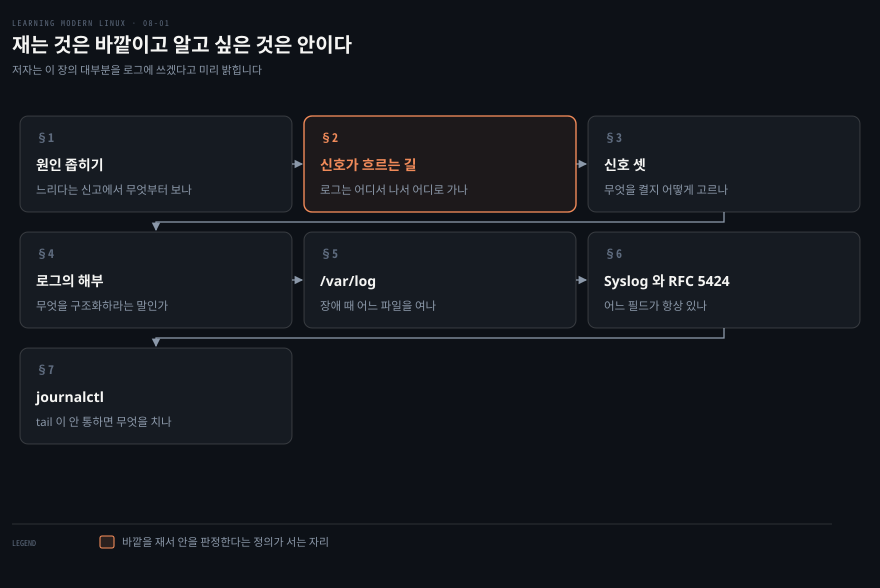
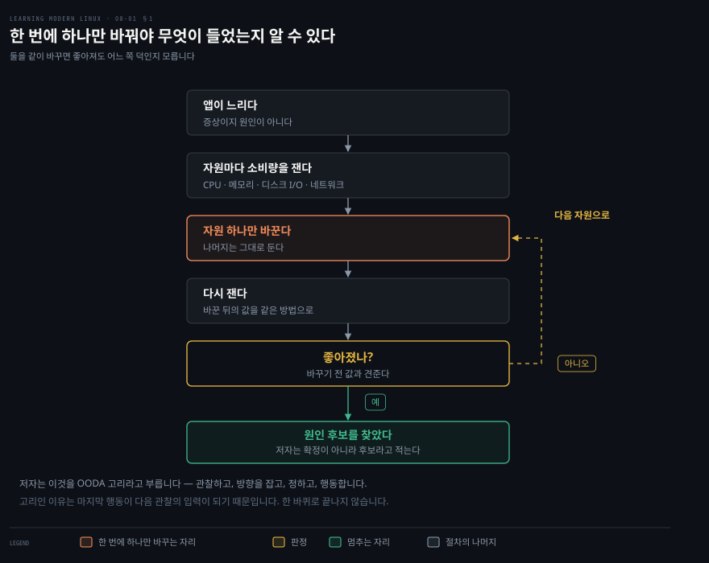
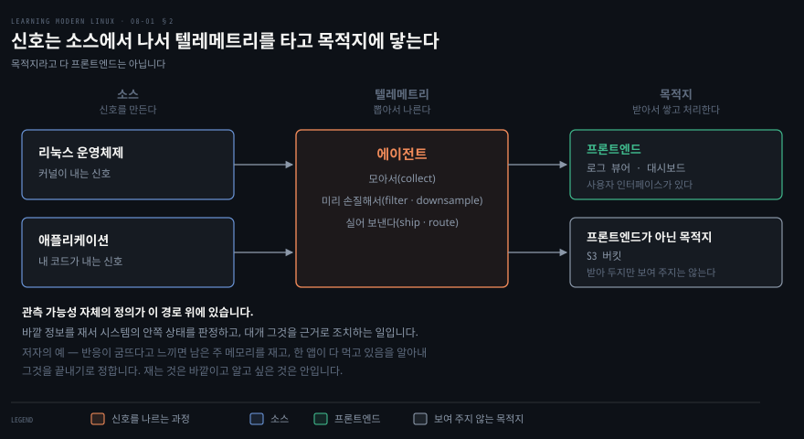
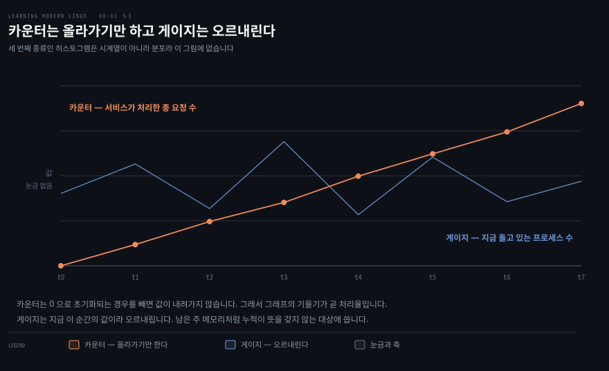
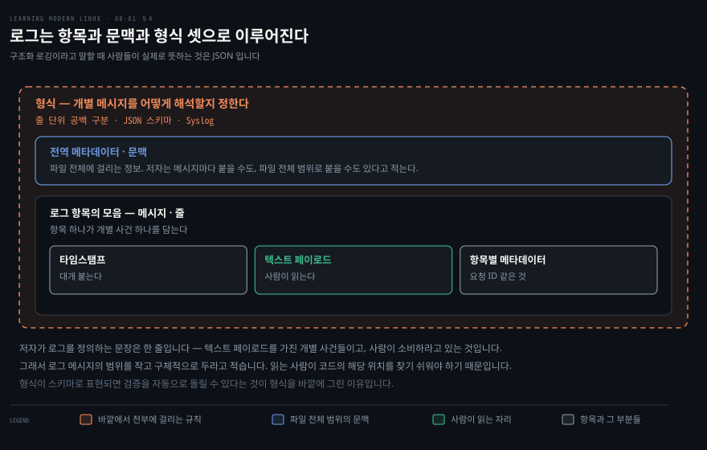
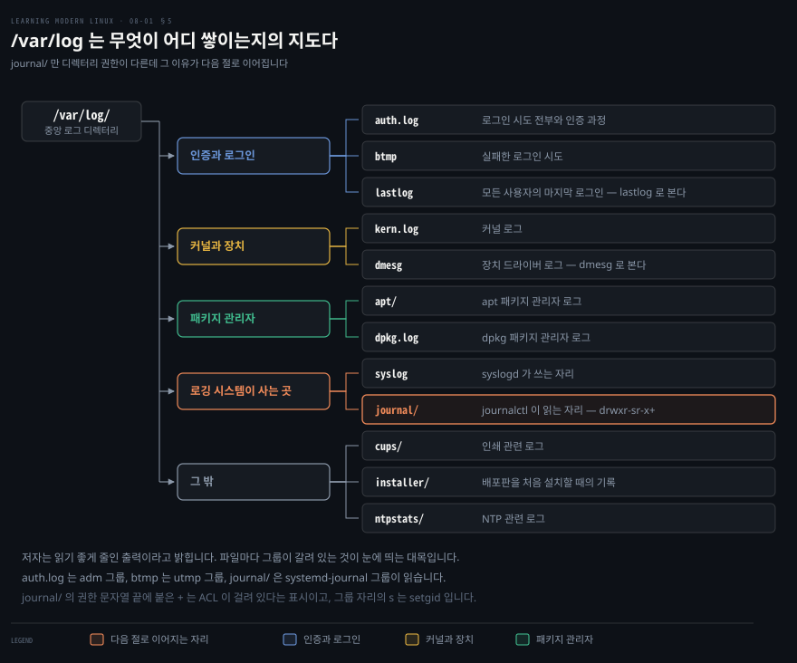
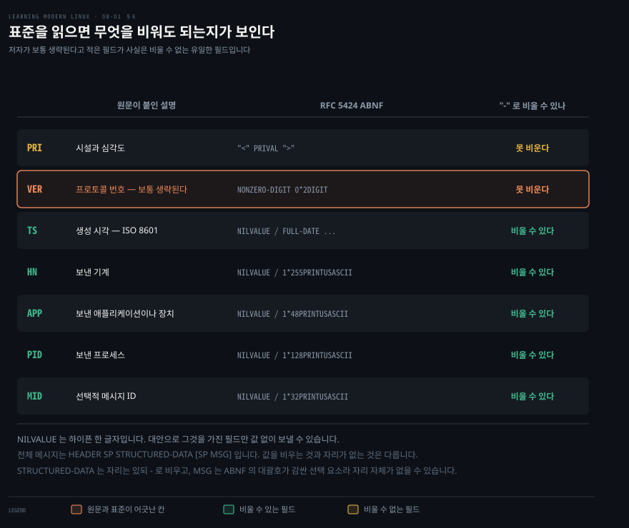
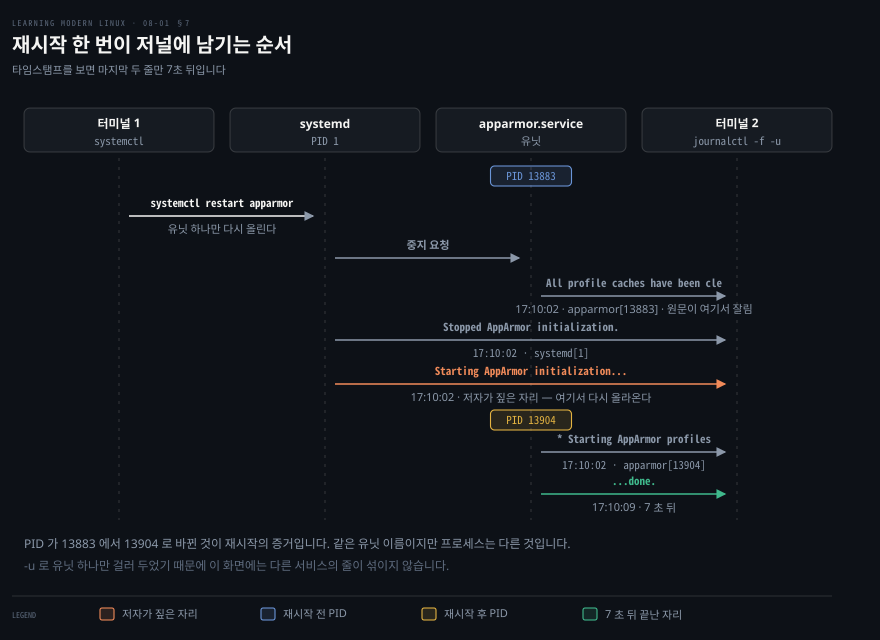

# 재는 것은 바깥이고 알고 싶은 것은 안이다

---

> 8장 노트의 첫 편입니다. 관측이라는 말이 무엇을 뜻하는지부터 세우고, 저자가 이 장의 시간 대부분을 쓰겠다고 미리 밝힌 신호 하나를 끝까지 팝니다. 그 하나가 로그입니다.

## 핵심 요약

> 이 구간이 매달린 생각은 **알고 싶은 것은 안인데 잴 수 있는 것은 바깥뿐**이라는 것입니다.

저자가 적은 관측 가능성의 정의가 그대로 그렇습니다. 리눅스 같은 시스템의 내부 상태를 바깥으로 드러난 정보를 재서 판정하는 일입니다. 대개 그 판정을 근거로 조치하는 것이 목적입니다.

저자가 든 예가 이 정의의 세 단계를 한 흐름에 담습니다. 시스템 반응이 굼뜨다고 느끼면 남은 주 메모리를 잽니다. 한 앱이 메모리를 다 먹고 있음을 알아내면 그것을 끝내기로 정합니다.

바깥으로 드러나는 정보에는 이름이 붙어 있습니다. 신호 유형은 셋이고 로그와 메트릭과 트레이스입니다. 그중 로그만 사람이 읽으라고 만들어진 텍스트이며, 저자가 이 장의 시간 대부분을 로그에 쓰겠다고 밝히는 이유가 그것입니다.

이 편의 마지막 두 절은 같은 질문을 두 시대의 답으로 받습니다. 로그 한 줄을 어떤 정해진 형태로 만들 것인가 하는 질문입니다. Syslog 는 텍스트 형식을 표준으로 못 박아 답했고, systemd 의 저널은 바이너리 형식을 골라 `tail` 을 포기하는 대신 다른 것을 얻었습니다.


## 학습 목표

> 이 구간을 읽고 나면 아래 다섯 가지를 스스로 해낼 수 있습니다.

1. 관측 가능성을 정의하고 소스·목적지·텔레메트리가 각각 경로의 어느 자리인지 말할 수 있습니다.
2. 신호 유형 셋을 페이로드와 주 소비자로 구분하고, 메트릭 세 종류를 값의 움직임으로 가를 수 있습니다.
3. 로그를 항목과 문맥과 형식 셋으로 쪼개고, "구조화 로깅" 이 실제로 뜻하는 바를 말할 수 있습니다.
4. `/var/log` 에서 찾는 로그의 자리를 짚고 `tail -f` 나 `tee -a` 로 흐르는 로그를 다룰 수 있습니다.
5. RFC 5424 헤더 필드 중 무엇을 비울 수 있는지 근거를 대고, `journalctl` 로 시간·유닛·형식을 좁힐 수 있습니다.

아래는 이 문서 전체를 읽는 순서로 이은 지도입니다. 칸마다 절 번호와 그 절이 답하는 물음 하나를 적었습니다. 색이 붙은 칸이 이 노트의 제목이 가리키는 자리입니다.




## 이 문서가 다루지 않는 것

> 저자가 스스로 그은 선과, 노트를 나누며 생긴 경계를 함께 적습니다.

- 자원별 모니터링과 그 도구들 → [다음 노트](./08-02.%EC%9E%90%EC%9B%90%EB%A7%88%EB%8B%A4%20%EC%B0%BD%EC%9D%B4%20%EB%94%B0%EB%A1%9C%20%EB%82%98%20%EC%9E%88%EC%96%B4%20%EC%96%B4%EB%8A%90%20%EC%B0%BD%EC%9D%84%20%EC%97%AC%EB%8A%90%EB%83%90%EA%B0%80%20%EA%B3%A7%20%EC%A7%84%EB%8B%A8%EC%9D%B4%EB%8B%A4.md)가 다룹니다
- 추적과 프로파일링, Prometheus 와 Grafana 구성 → 같은 다음 노트가 다룹니다
- 분산 추적 → 저자가 이 책의 범위 밖이라고 못 박습니다. 쿠버네티스의 컨테이너화된 마이크로서비스나 서버리스 앱의 람다 묶음에서 쓰는 그것을 뜻합니다
- Brendan Gregg 의 리눅스 관측 도구 전경도(원서 그림 8-1) → 원서가 CC BY-SA 4.0 으로 빌려 온 그림이라 옮기지 않고 [출처](https://www.brendangregg.com/linuxperf.html)만 남깁니다

저자가 이 장의 성격에 관해 붙이는 단서 하나도 옮깁니다. 관측은 흔히 반응적이지만 늘 그렇지는 않다는 것입니다. 이 단서가 §1 의 내용입니다.


## 1. 느리다는 말은 원인이 아니라 증상입니다

> 앱이 느리다는 신고가 들어왔을 때 후보가 여럿이면, 순서 없이 이것저것 만지는 순간 무엇이 들었는지 영영 알 수 없게 됩니다.



### 풀려는 문제

저자가 드는 장면은 이렇습니다. 앱이 느립니다. 그리고 그럴 만한 이유가 여럿입니다. 메모리가 모자라거나, CPU 사이클이 부족하거나, 네트워크 입출력이 못 따라가는 경우입니다.

여기서 흔히 하는 일은 의심 가는 것을 한꺼번에 올리는 것입니다. 메모리도 늘리고 CPU 도 늘리면 대개 좋아지기는 합니다. 그런데 그다음 질문에 답할 수 없습니다. 어느 쪽 덕이었나, 다음에 같은 증상이 오면 무엇부터 볼 것인가 하는 질문입니다.

### 왜 절차가 필요한가

저자가 부르는 이름은 OODA 고리입니다. 관찰하고 방향을 잡고 정하고 행동하는 네 국면의 앞 글자를 딴 것입니다. 관측된 데이터를 근거로 가설을 시험하고 그 위에서 행동하는 구조화된 방법이라고 저자가 적습니다. 신호에서 실행 가능한 통찰을 얻는 길이라는 뜻입니다.

절차의 핵심은 국면의 이름이 아니라 그 안의 한 문장에 있습니다. 자원 할당을 **하나씩 개별적으로** 바꾸라는 것입니다. 나머지는 그대로 둔 채 결과를 잽니다.

RAM 을 더 줬더니 성능이 좋아졌는지 묻습니다. 그렇다면 이유를 찾았을 수 있다고 저자는 적습니다. 아니라면 다른 자원으로 넘어가되 소비량을 계속 재면서 관측된 영향과 연결지어 봅니다.

여기서 저자가 "이유를 찾았다" 가 아니라 "찾았을 수 있다" 로 쓴 것이 정확합니다. 한 번의 변경으로 좋아진 것은 상관이지 인과의 증명이 아닙니다.

### 관측은 늘 반응적이지 않습니다

저자는 관측의 성격을 셋으로 나눕니다. 이 구분이 있어야 "장애가 나야 로그를 본다" 는 습관을 벗어날 수 있습니다.

| 성격 | 언제 움직이나 | 저자가 든 예 |
|------|--------------|-------------|
| 반응적(reactionary) | 무언가 죽거나 느려진 뒤 | 프로세스와 그 CPU·메모리 사용량을 보거나 로그를 판다 |
| 조사적(investigative) | 궁금해서 | 특정 알고리즘이 얼마나 걸리는지 알아내려 할 때 |
| 예측적(predictive) | 아직 일어나지 않은 일에 대비해 | 지금 동작을 외삽해 미래 조건에 알림을 건다 |

예측적 관측에 저자가 붙인 조건이 하나 있습니다. 부하가 예측 가능한 디스크 사용량이라면 잘 통할 것이라는 단서입니다. 뒤집으면 부하가 튀는 대상에는 외삽이 잘 안 든다는 뜻입니다.


## 2. 신호는 소스에서 나서 목적지에 닿습니다

> 로그 뷰어를 열면 로그가 보이는데, 그 사이에 무엇이 있는지 모르면 "왜 이 로그만 안 보이지" 를 풀 수 없습니다.



### 풀려는 문제

관측 도구를 처음 붙이면 대개 화면부터 봅니다. 그런데 화면에 무언가 빠져 있을 때 어디를 봐야 할지가 문제가 됩니다. 앱이 안 낸 것인지, 나르는 쪽이 걸러 버린 것인지, 저장은 됐는데 화면이 못 그리는 것인지가 갈립니다.

### 왜 어휘가 먼저인가

저자는 관측 분야의 용어에 형식 정의가 다 있는 것은 아니고, 단일 기계를 보느냐 네트워크로 묶인 분산 환경을 보느냐에 따라 뜻이 조금씩 달라진다고 미리 밝힙니다. 그래서 다섯 개를 자기 기준으로 정의해 두고 갑니다. 그 다섯이 곧 방금 말한 경로의 각 자리 이름입니다.

- **Observability**: 바깥 정보를 재서 시스템의 내부 상태를 판정하는 일. 대개 그 위에서 행동하는 것이 목적입니다
- **Signal types**: 시스템 상태에 관한 정보를 표현하고 내보내는 서로 다른 방식. 기호로 나르거나(로그처럼 텍스트) 수치로 나르거나(메트릭처럼) 둘을 섞습니다
- **Source**: 신호를 만드는 쪽. 리눅스 운영체제일 수도 있고 애플리케이션일 수도 있습니다
- **Destination**: 신호를 소비하고 저장하고 더 처리하는 곳
- **Telemetry**: 소스에서 신호를 뽑아 목적지로 실어 나르는 과정

### 목적지라고 다 프론트엔드는 아닙니다

저자가 목적지 안에 굳이 선을 하나 더 긋습니다. 사용자 인터페이스를 드러내는 목적지만 프론트엔드라고 부른다는 것입니다. GUI 든 TUI 든 CLI 든 상관없습니다.

예가 대비를 분명하게 만듭니다. 로그 뷰어나 시계열을 그리는 대시보드는 프론트엔드이고, S3 버킷은 프론트엔드가 아닙니다. 다만 S3 버킷도 로그의 목적지 노릇은 여전히 할 수 있습니다. 앞의 문제로 돌아가면, 화면에 안 보이는 신호가 어딘가에는 쌓여 있을 수 있다는 뜻이기도 합니다.

텔레메트리 쪽에도 사실 하나가 들어 있습니다. 신호를 모으거나 미리 손질하는 에이전트를 흔히 쓰는데, 그 손질에 필터와 다운샘플이 포함된다고 저자가 적습니다. 안 보이는 신호를 쫓을 때 이 자리를 먼저 의심할 근거입니다.

한 가지 표기 습관도 짚고 갑니다. 관측 가능성을 `o11y` 라는 축약으로도 쓰는데, `o` 와 `y` 사이에 글자가 열한 개 있어서 그렇습니다.[^o11y]


## 3. 신호는 셋이고 그중 하나만 사람을 위한 것입니다

> 로그도 메트릭도 트레이스도 다 켜라는 말은 흔한데, 셋이 무엇으로 갈리는지 모르면 무엇을 어디에 쓸지 고를 수 없습니다.

저자가 신호를 가르는 첫 축은 페이로드입니다. 크게 보아 텍스트 페이로드와 수치 페이로드로 나뉘며, 텍스트는 사람이 검색하고 해석하기에 가장 알맞고 수치는 기계에 알맞습니다. 수치도 가공하면 사람이 읽을 수 있습니다.

| 신호 유형 | 페이로드 | 주 소비자 | 저자의 정의 요지 |
|-----------|---------|----------|-----------------|
| 로그 | 텍스트 | 사람 | 텍스트 페이로드를 가진 개별 사건들. 대개 시각이 찍힙니다 |
| 메트릭 | 수치 | 기계. 가공하면 사람도 | 대개 규칙적으로 표집한 수치 데이터 점이 시계열을 이룹니다 |
| 트레이스 | 원문 미기재 | 원문 미기재 | 런타임 정보의 동적 수집. 어떤 시스템 콜을 쓰는지, 커널에서 어떤 사건이 이어졌는지 |

트레이스 행의 앞 두 칸이 비어 있는 것은 저자가 그 축으로 트레이스를 분류하지 않기 때문입니다. 텍스트와 수치라는 이분법은 저자가 로그와 메트릭에만 적용하고, 트레이스는 그 뒤에 세 번째 유형으로 덧붙일 뿐입니다.

저자가 로그 항목에 붙이는 관찰 하나가 이 표보다 실무적입니다. 모든 로그에는 어느 정도의 구조가 있는데도 사람들이 굳이 "구조화 로깅" 이라는 말을 쓴다는 것입니다. 그리고 그 말을 할 때 실제로 뜻하는 것은 JSON 으로 구조화한다는 것이라고 못 박습니다.

이 장의 무게가 어디로 쏠리는지도 저자가 미리 알려 줍니다. 로그 내용을 자동으로 다루기는 어렵지만 사람에게는 여전히 쓸모가 커서 한동안 지배적인 신호 유형으로 남을 것이며, 그래서 이 장의 시간 대부분을 로그에 쓰겠다는 것입니다.

### 메트릭은 값이 어떻게 움직이느냐로 갈립니다



메트릭을 쓸 때 첫 실수는 종류를 안 정하고 숫자부터 내보내는 것입니다. 종류가 정해지면 그 값에 무엇을 물어도 되는지가 함께 정해집니다.

- **카운터**: 값이 올라가기만 합니다. 0 으로 초기화되는 경우만 예외입니다. 서비스가 처리한 총 요청 수나 한 인터페이스로 보낸 총 바이트가 예입니다
- **게이지**: 값이 오르내립니다. 지금 쓸 수 있는 전체 주 메모리나 지금 돌고 있는 프로세스 수가 예입니다
- **히스토그램**: 버킷을 써서 값의 분포를 만듭니다. 데이터가 전체적으로 어떻게 생겼는지를 가늠하게 해 주고, 값의 50% 나 90% 가 어느 구간에 든다는 식의 진술을 가능하게 합니다

위 도식의 두 곡선에 단위가 없는 것은 원문에 수치 예시가 없기 때문입니다. 거기서 읽을 것은 크기가 아니라 방향입니다. 히스토그램은 시계열이 아니라 분포라 그 선그래프에 담기지 않습니다.

저자가 메트릭에 붙이는 소비 습관도 한 줄 있습니다. 보통 원시 메트릭을 직접 보지 않고 집계나 그래프 표현을 쓰거나, 조건이 충족되면 알림을 받는다는 것입니다.


## 4. 로그는 사람이 읽으라고 있는 텍스트입니다

> "로그를 구조화하라" 는 말을 들었을 때, 로그가 무엇으로 이루어지는지 모르면 무엇을 구조화하라는 것인지 알 수 없습니다.



### 풀려는 문제

로그 설정을 만질 일이 생기면 대개 포맷 문자열부터 고칩니다. 그런데 고칠 자리가 셋인데 하나만 알고 있으면, 파일 전체에 걸리는 문맥을 메시지마다 반복해 넣거나 형식 정의 없이 필드만 늘리는 쪽으로 흐릅니다.

### 저자가 로그를 쪼개는 세 자리

- **로그 항목의 모음**: 항목이든 메시지든 줄이든, 개별 사건 하나에 관한 정보를 담습니다
- **메타데이터 또는 문맥**: 메시지마다 붙을 수도 있고 전역 범위로 붙을 수도 있습니다. 저자가 든 전역의 예가 로그 파일 전체입니다
- **개별 메시지를 어떻게 해석할지 정하는 형식**: 로그의 부분들과 그 뜻을 정의합니다. 줄 단위 공백 구분 메시지나 JSON 스키마가 예입니다

형식이 형식 스키마로 표현되면 검증을 자동으로 돌릴 수 있다고 저자가 덧붙입니다. 도식에서 형식을 가장 바깥에 그린 이유가 그것입니다. 형식은 안쪽 항목들과 나란히 놓인 네 번째 부분이 아니라, 안쪽 전부에 뜻을 부여하는 규칙입니다.

개별 사건이라는 말에도 저자가 조건을 답니다. 코드베이스의 맥락에서 생각하라는 것입니다. 데이터베이스 연결에 성공했다는 한 줄을 내보내거나, 파일이 없다는 오류를 표시하는 한 줄이 그것입니다. 그리고 로그 메시지의 범위를 작고 구체적으로 두라고 합니다. 메시지를 받아 보는 사람이 코드의 해당 위치를 찾기 쉬워야 하기 때문입니다.

### 형식은 이미 여럿 있습니다

저자가 표로 정리한 흔한 로그 형식 다섯입니다. 데이터베이스나 프로그래밍 언어를 위한 더 좁은 범위의 형식과 프레임워크는 이것 말고도 많다고 덧붙입니다.

| 형식 | 저자가 붙인 메모 |
|------|-----------------|
| Common event format | ArcSight 가 개발. 장비와 보안 용도에 씁니다 |
| Common log format | 웹 서버용. extended log format 도 함께 보라고 적습니다 |
| Graylog extended log format | Graylog 가 개발. Syslog 를 개선한 것입니다 |
| Syslog | 운영체제·앱·장비용 |
| Embedded metric format | Amazon 이 개발. 로그와 메트릭 양쪽입니다 |

로그를 오래 굴리려면 부담을 줄여야 한다는 조언도 붙습니다. 조회가 빠르고 발자국이 작아야 한다는 것이며, 그래서 `logrotate` 같은 도구로 로그 회전을 씁니다. 데이터 온도라는 개념도 소개하는데, 오래된 로그 파일을 더 싸고 느린 저장소로 옮기는 것입니다. 붙인 디스크나 S3 버킷이나 Glacier 가 그 예입니다.

로그 항목의 중요도나 대상 소비자를 알리려고 레벨을 정의하는 일도 흔합니다. 개발용 `DEBUG`, 정상 상태를 알리는 `INFO`, 사람의 개입이 필요할 수 있는 예상 밖 상황을 위한 `ERROR` 가 저자가 든 예입니다.

### 로그에 넣으면 안 되는 것

저자가 이 절에서 유일하게 경고 상자로 세운 내용입니다. 특히 프로덕션 환경에서 주의하라고 못 박습니다.

앱에서 로그 한 줄을 내보내기로 할 때마다, 민감한 정보를 흘릴 여지가 있는지 자문하라는 것입니다. 비밀번호나 API 키일 수도 있고, 그냥 사용자를 식별하는 정보일 수도 있습니다. 이메일이나 계정 ID 가 여기 듭니다.

문제가 되는 이유는 로그의 수명에 있습니다. 로그는 대개 영속적인 형태로 저장되고, 로컬 디스크나 S3 버킷이 그 자리입니다. 그래서 프로세스가 끝나고 한참 뒤에도 누군가 그 민감 정보에 접근해 공격에 쓸 수 있습니다.


## 5. `/var/log` 는 무엇이 어디 쌓이는지의 지도입니다

> 장애가 났을 때 첫 손이 어느 파일로 가야 하는지는 외워 두는 것이 아니라 디렉터리 구조가 알려 줍니다.



장애 대응에서 시간을 잡아먹는 것은 로그를 읽는 일이 아니라 어느 로그를 읽을지 고르는 일입니다. 인증 실패를 보려는데 커널 로그를 열고 있으면 아무것도 나오지 않습니다. 배포판이 그 선택을 미리 해 두었으므로, 자리를 알면 첫 손이 바로 갑니다.

리눅스의 중앙 로그 디렉터리를 저자가 먼저 훑습니다.

```bash
ls -al /var/log
```

저자는 읽기 좋게 줄인 출력이라고 밝히면서 열두 항목에 한 줄씩 주석을 답니다. 도식의 묶음 이름은 원문에 없고 이 노트가 읽기 편하라고 붙인 것입니다.

| 자리 | 무엇이 쌓이나 |
|------|--------------|
| `auth.log` | 로그인 시도 전부와 인증 과정. 성공과 실패를 모두 담습니다 |
| `btmp` | 실패한 로그인 시도 |
| `lastlog` | 모든 사용자의 마지막 로그인. `lastlog` 명령으로 봅니다 |
| `kern.log` | 커널 로그 |
| `dmesg` | 장치 드라이버 로그. `dmesg` 명령으로 봅니다 |
| `apt/` | apt 패키지 관리자 로그 |
| `dpkg.log` | dpkg 패키지 관리자 로그 |
| `syslog` | syslogd 가 쓰는 자리 |
| `journal/` | journalctl 이 읽는 자리 |
| `cups/` | 인쇄 관련 로그 |
| `installer/` | 배포판을 처음 설치할 때의 기록 |
| `ntpstats/` | NTP 관련 로그 |

출력에서 파일 이름 못지않게 눈에 띄는 것이 소유 그룹입니다. 세 줄만 옮깁니다.

```bash
-rw-r-----   1 syslog  adm               7319 Jul 13 07:17 auth.log
-rw-rw----   1 root    utmp              1536 Sep 21 14:07 btmp
drwxr-sr-x+  3 root    systemd-journal   4096 Jan 24  2021 journal/
```

로그를 읽을 권한이 파일마다 다른 그룹에 걸려 있습니다. `auth.log` 는 `adm`, `btmp` 는 `utmp`, `journal/` 은 `systemd-journal` 입니다. 4장에서 본 원칙이 여기 그대로 적용돼 있습니다. 전부 아니면 전무 대신, 읽어도 되는 사람을 그룹 단위로 좁혀 둔 것입니다.

`journal/` 한 줄에는 표시가 둘 더 붙어 있습니다. 그룹 실행 자리의 `s` 와 권한 문자열 끝의 `+` 입니다. 앞의 것은 setgid 이고 뒤의 것은 ACL 이 걸려 있다는 뜻입니다. 원서가 이 표기를 설명하지는 않아 노트에서 재현해 확인했습니다.

```bash
mkdir -p /t/plain /t/sg /t/acl && chmod g+s /t/sg && setfacl -m u:nobody:rx /t/acl
ls -ld /t/plain /t/sg /t/acl
```

```bash
drwxr-xr-x+ 1 root root 0 Sep  5 10:25 /t/acl
drwxr-xr-x  1 root root 0 Sep  5 10:25 /t/plain
drwxr-sr-x  1 root root 0 Sep  5 10:25 /t/sg
```

ACL 을 건 쪽에만 `+` 가 붙고 setgid 를 건 쪽에만 `s` 가 붙습니다. `journal/` 에는 둘 다 걸려 있으니, 저널 디렉터리는 새로 생기는 파일이 `systemd-journal` 그룹을 물려받게 해 두고 그 위에 ACL 을 한 겹 더 얹은 셈입니다.

### 흐르는 로그를 따라가기

로그를 실시간으로 소비하는 흔한 패턴이 로그를 따라가는 것입니다. 새 줄이 붙는 대로 로그의 끝을 지켜보는 방식입니다.

```bash
tail -f /var/log/syslog
```

```bash
Sep 26 15:06:41 starlite nm-applet[31555]: ... 'GTK_IS_WIDGET (widget)' fa
Sep 26 15:06:41 starlite nm-dispatcher: ... new request (3 scripts)
Sep 26 15:06:41 starlite systemd[1]: Starting PackageKit Daemon...
Sep 26 15:06:41 starlite nm-dispatcher: ... start running ordered scripts.
Sep 26 15:06:42 starlite PackageKit: daemon start
```

출력의 각 줄이 §6 에서 볼 Syslog 형식입니다. 줄 끝이 잘려 보이는 것은 원서가 지면에 맞춰 편집한 결과라 그대로 두었습니다.

프로세스의 출력을 화면으로 보면서 동시에 파일에도 남기고 싶을 때가 있습니다. 그때 쓰는 것이 `tee` 입니다.

```bash
someprocess | tee -a some.log
```

`-a` 를 붙이는 이유를 저자가 짚습니다. 붙이지 않으면 로그 파일이 잘려 나가기 때문입니다.


## 6. 표준을 읽으면 무엇을 비워도 되는지가 보입니다

> Syslog 한 줄을 파싱하려는데 어느 필드가 항상 있는지 모르면, 없을 수도 있는 값을 필수로 다루거나 그 반대를 하게 됩니다.



Syslog 는 커널부터 데몬과 사용자 공간까지 여러 소스를 아우르는 로깅 표준입니다. 뿌리가 네트워크 환경에 있고, 오늘날의 프로토콜은 RFC 5424 가 정의한 텍스트 형식과 배포 시나리오와 보안 고려사항으로 이루어진다고 저자가 적습니다.[^rfc5424]

저자는 형식을 그림 하나로 보이면서 단서를 답니다. 좀처럼 쓰이지 않는 선택적 필드가 많다는 것입니다. 이 노트의 도식은 그 그림을 옮긴 것이 아니라 RFC 의 ABNF 에서 직접 세운 것이고, 그래서 헤더 일곱 필드만 담습니다.

헤더 필드는 일곱입니다. 저자는 그중 `TS` 와 `HN` 이 가장 자주 쓰인다고 덧붙입니다.

| 필드 | 저자가 붙인 설명 |
|------|-----------------|
| `PRI` | 메시지의 시설과 심각도 |
| `VER` | Syslog 프로토콜 번호 |
| `TS` | 메시지가 생성된 시각. ISO 8601 형식 |
| `HN` | 메시지를 보낸 기계 |
| `APP` | 메시지를 보낸 애플리케이션 또는 장비 |
| `PID` | 메시지를 보낸 프로세스 |
| `MID` | 선택적 메시지 ID |

> **원문 정오**: 저자는 `VER` 에 관해 "1 밖에 될 수 없으므로 보통 생략된다(usually left out since it can only be 1)" 고 적습니다. 앞의 절반은 맞지만 뒤의 절반은 RFC 5424 형식에서 성립하지 않습니다. 같은 RFC §6 의 ABNF 가 `HEADER = PRI VERSION SP TIMESTAMP SP HOSTNAME SP APP-NAME SP PROCID SP MSGID` 이고, `VERSION = NONZERO-DIGIT 0*2DIGIT` 이라 대안이 없습니다. 값을 비울 수 있는 필드는 `NILVALUE /` 대안을 가진 쪽이고 `NILVALUE = "-"` 입니다. `TIMESTAMP`·`HOSTNAME`·`APP-NAME`·`PROCID`·`MSGID` 다섯이 그 대안을 갖는 반면 `VERSION` 은 갖지 않습니다. 저자가 유일하게 "선택적" 이라 부른 `MID` 는 실제로 비울 수 있고, 보통 생략된다고 적은 `VER` 은 비울 수 없는 두 필드 중 하나입니다.

이 정오가 실무에 닿는 지점이 있습니다. RFC 5424 형식의 줄을 파싱한다면 `-` 하나만 들어 있는 필드를 다섯 자리에서 만날 각오를 해야 하고, 버전 자리에서는 만나지 않습니다. 저자가 말한 "보통 생략된다" 는 아마 RFC 5424 이전의 오래된 형식을 쓰는 구현들을 가리킬 것입니다. RFC 5424 자신이 표지에서 RFC 3164 를 폐기한다고 밝히고 있으므로, 두 형식이 현장에 섞여 있다는 뜻이기도 합니다.

형식에는 구조화 데이터도 들어갑니다. 키와 값 기반의 목록이고 각 요소가 대괄호로 묶인다고 저자가 적습니다.

저자가 말한 대괄호는 맞습니다. RFC §6.3 의 `SD-ELEMENT = "[" SD-ID *(SP SD-PARAM) "]"` 가 각 요소를 대괄호로 감쌉니다.

> **노트의 읽기**: 다만 저자가 구조화 데이터를 "페이로드" 라고 부르는 대목은 RFC 의 구성과 조금 다릅니다. 전체 메시지가 `SYSLOG-MSG = HEADER SP STRUCTURED-DATA [SP MSG]` 라서 구조화 데이터와 메시지 본문이 나란한 두 부분입니다. RFC §6.4 는 `MSG` 를 사건에 관한 자유 형식 메시지라고 정의하고, §6.3 은 구조화 데이터가 메시지에 관한 메타 정보나 애플리케이션 고유 정보를 표현한다고 정의합니다.
>
> 여기서 대괄호가 두 층으로 나옵니다. 저자가 말한 것은 SD 요소를 감싸는 **문자 그대로의 대괄호**이고, `[SP MSG]` 의 대괄호는 그 부분이 **선택 사항임을 뜻하는 ABNF 표기**입니다. 그래서 값을 `-` 로 비우는 것과 자리가 아예 없는 것이 갈립니다. 구조화 데이터는 자리는 있되 비울 수 있고, 메시지 본문은 통째로 없을 수 있습니다.

### syslogd 다음에 온 것들

로그 관리는 보통 `syslogd` 바이너리가 맡습니다. 시간이 지나면서 알아 둘 만한 다른 선택지가 생겼다고 저자가 둘을 소개합니다.

| 도구 | 저자가 적은 내용 | 저자가 적은 시기 |
|------|-----------------|-----------------|
| `syslog-ng` | `syslogd` 를 그대로 갈아 끼울 수 있는 향상된 로그 데몬. TLS·내용 기반 필터링·PostgreSQL 과 MongoDB 같은 데이터베이스로의 로깅을 추가로 지원합니다 | "late 1990" |
| `rsyslog` | Syslog 프로토콜을 확장하며 systemd 와 함께 쓸 수도 있습니다 | "since 2004" |

오른쪽 열은 저자의 표기를 그대로 옮긴 것입니다. 이 노트는 둘 다 1차 자료로 확정하지 못했습니다.

`syslog-ng` 쪽의 "late 1990" 은 연도로 읽으면 어색합니다. "1990년대 후반" 의 오기로 보이지만 그렇게 단정할 근거를 찾지 못해 저자의 표기를 지우지 않고 그대로 둡니다. 연도가 판단에 필요하면 각 프로젝트의 저장소에서 확인하는 편이 낫습니다.

`rsyslog` 쪽은 한 가지만 확인됐습니다. 프로젝트 자신의 ChangeLog 가 Rainer Gerhards 의 작업 시작을 2003년 10월로 기록합니다.[^rsyslog] 작업 시작과 배포 시점은 다르므로 이것이 "since 2004" 를 반증하지는 않습니다.

한 가지 연결은 확인해 둘 만합니다. RFC 5424 의 저자가 Adiscon 의 R. Gerhards 이고, `rsyslog` 를 만든 사람이 같은 인물입니다.[^rsyslog] 표준과 구현이 한 손에서 나온 셈입니다.

저자는 이 절을 이렇게 닫습니다. 나이에도 불구하고 Syslog 계열의 프로토콜과 도구는 여전히 살아 있고 널리 쓰입니다. 다만 systemd 가 사실상의 init 표준이 되어 모든 주요 배포판에 들어가면서 로깅에도 새 길이 생겼습니다.


## 7. journalctl 은 바이너리를 골라 `tail` 을 포기했습니다

> `cat` 과 `grep` 이 안 통하는 로그를 처음 만나면 도구가 이상해 보입니다. 그런데 그 불편은 대가로 치른 것이고 무엇을 받았는지가 있습니다.



`grep` 으로 로그를 뒤지던 손이 저널 앞에서 처음 멈춥니다. 파일을 찾아 열어도 사람이 읽을 글자가 거기 없기 때문입니다. 이 절은 그 불편이 무엇과 맞바꾼 것인지부터 봅니다.

`journalctl` 은 systemd 생태계에서 로그 관리를 맡는 구성요소입니다. 지금까지 본 다른 시스템과 달리 로그 항목을 바이너리 형식으로 저장합니다. 이 선택이 더 빠른 접근과 더 나은 저장 발자국을 가능하게 한다고 저자가 적습니다.

바이너리 저장 형식은 도입 당시 비판을 받았습니다. 사람들이 익숙한 `tail` 과 `cat` 과 `grep` 으로 로그를 보고 검색하는 일을 계속할 수 없게 됐기 때문입니다. 저자는 그 비판을 인정하면서도 균형을 답니다. `journalctl` 을 쓰면 로그와 상호작용하는 새 방식을 배워야 하지만 학습 곡선이 그렇게 나쁘지는 않다는 것입니다.

인자 없이 실행하면 모든 로그에 대한 대화형 페이저로 나타납니다. 화살표 키나 스페이스 바로 넘기고 `q` 로 빠져나옵니다.

### 무엇을 묻느냐가 옵션을 정합니다

시간 범위를 제한하는 두 가지 방법입니다.

```bash
journalctl --since "3 hours ago"
journalctl --since "2021-09-26 15:30:00" --until "2021-09-26 18:30:00"
```

앞의 것은 지난 세 시간 동안 일어난 일로 좁히고, 뒤의 것은 시작과 끝을 명시합니다.

특정 systemd 유닛으로 좁히려면 `-u` 를 씁니다. `abc.service` 라는 서비스가 있다고 가정한 예입니다.

```bash
journalctl -u abc.service
```

출력 형식은 `--output` 또는 짧게 `-o` 로 고릅니다. 저자가 중요하다고 꼽은 값 셋입니다.

| 값 | 저자가 적은 쓰임 |
|----|-----------------|
| `cat` | 시각도 소스도 없는 짧은 형태 |
| `short` | 기본값. Syslog 출력을 흉내 냅니다 |
| `json` | 줄마다 JSON 형식 항목 하나. 자동화용입니다 |

`tail -f` 와 같은 경험, 곧 로그를 따라가는 것도 됩니다.

```bash
journalctl -f
```

### 배운 것을 한 장면에 합치기

저자가 앞의 정보를 전부 합쳐 구체적인 예를 하나 만듭니다. systemd 가 관리하는 보안 구성요소 AppArmor 를 다시 띄우는 장면입니다. 한 터미널에서 `systemctl restart apparmor` 를 실행하고, 다른 터미널에서 다음을 실행합니다.

```bash
journalctl -f -u apparmor.service
```

```bash
-- Logs begin at Sun 2021-01-24 14:36:30 GMT. --
Sep 26 17:10:02 starlite apparmor[13883]: All profile caches have been cle
                                          but no profiles have been unload
Sep 26 17:10:02 starlite apparmor[13883]: Unloading profiles will leave al
                                          running processes permanently
...
Sep 26 17:10:02 starlite systemd[1]: Stopped AppArmor initialization.
Sep 26 17:10:02 starlite systemd[1]: Starting AppArmor initialization...
Sep 26 17:10:02 starlite apparmor[13904]: * Starting AppArmor profiles
Sep 26 17:10:03 starlite apparmor[13904]: Skipping profile in
                                          /etc/apparmor.d/disable: usr.sbin.rsy
Sep 26 17:10:09 starlite apparmor[13904]:
...done.
Sep 26 17:10:09 starlite systemd[1]: Started AppArmor initialization.
```

원서가 지면에 맞추려고 출력을 편집했고 실제로는 로그 항목 하나가 한 줄이라고 밝힙니다. 잘린 줄과 줄임표를 그대로 둔 것은 그 때문입니다.

저자가 이 출력에서 짚는 자리는 하나입니다. systemd 가 서비스를 멈춘 다음, 여기서 다시 올라온다는 것입니다. 그 자리가 `Starting AppArmor initialization...` 줄입니다.

노트에서 두 가지를 더 읽습니다. 첫째로 프로세스 ID 가 `13883` 에서 `13904` 로 바뀝니다. 유닛 이름은 그대로지만 프로세스는 다른 것이며, 그것이 재시작이 실제로 일어났다는 증거입니다. 둘째로 타임스탬프를 보면 대부분이 `17:10:02` 안에 몰려 있고 마지막 두 줄만 `17:10:09` 입니다. 프로파일을 올리는 데 7초가 걸렸다는 뜻입니다.

`-u` 로 유닛 하나를 걸러 두었기 때문에 이 화면에는 다른 서비스의 줄이 섞이지 않습니다. 6장에서 systemd 의 유닛을 배운 것이 여기서 조회 조건으로 돌아옵니다.


## 심화 학습

> 책 밖으로 나가 확인한 것만 모읍니다. 각 항목의 근거는 각주의 1차 자료입니다.

**RFC 5424 는 앞선 표준을 폐기했습니다.** 표지에 `Obsoletes: 3164` 이라고 적혀 있고 발행은 2009년 3월입니다.[^rfc5424] 같은 문서의 부록은 RFC 3164 가 표준이 아니라 관찰된 형식들을 기술한 정보성 문서였다고 적습니다. 그래서 현장에는 성격이 다른 두 세대의 syslog 줄이 섞여 있을 수 있고, 파서를 쓴다면 두 형식을 구분해 받는 편이 안전합니다. 저자가 버전 필드를 두고 "보통 생략된다" 고 느낀 배경도 그 옛 형식 쪽일 가능성이 있는데, 이 노트는 그 인과까지는 확인하지 못했습니다.

**표준을 쓴 사람과 구현을 만든 사람이 같습니다.** RFC 5424 의 저자는 Adiscon GmbH 의 R. Gerhards 이고, `rsyslog` 의 ChangeLog 는 Rainer Gerhards 가 2003년 10월 17일에 sysklogd 패키지를 손보며 작업을 시작했다고 기록합니다.[^rsyslog] 그 ChangeLog 의 가장 오래된 항목들이 sysklogd 시절의 것이라, `rsyslog` 가 무에서 시작하지 않고 기존 syslogd 계보를 이어받았다는 것도 파일 자체가 보여 줍니다.

**"구조화 로깅" 이라는 말의 모호함은 저자만의 관찰이 아닙니다.** 저자는 사람들이 그 말로 JSON 을 뜻한다고 적는데, RFC 5424 는 그보다 앞서 `STRUCTURED-DATA` 라는 이름의 자리를 형식 안에 따로 만들어 두었습니다. 같은 단어가 두 층에서 다른 것을 가리키므로, 팀에서 "구조화" 를 말할 때는 JSON 페이로드를 뜻하는지 syslog 의 SD 요소를 뜻하는지 먼저 맞추는 편이 낫습니다.


## 결정 치트시트

> 로그를 어디로 보내고 어떻게 읽을지의 판단 기준을 한 표로 압축합니다.

| 상황 | 고를 것 | 왜 |
|------|--------|-----|
| systemd 유닛 하나의 최근 동작을 본다 | `journalctl -u <unit> -f` | 유닛 단위 필터가 조회 조건으로 이미 있습니다 |
| 텍스트 파일을 그대로 grep 해야 한다 | `/var/log/syslog` 와 `tail -f` | 저널의 바이너리 형식은 이 습관을 막습니다 |
| 로그를 다른 기계로 보내야 한다 | Syslog 계열 | 뿌리가 네트워크 환경이고 형식이 표준입니다 |
| TLS 나 데이터베이스 적재가 필요하다 | `syslog-ng` | 저자가 꼽은 차별점이 그 셋입니다 |
| 자동화가 로그를 파싱한다 | `journalctl -o json` 또는 앱의 JSON 로깅 | 줄마다 JSON 항목 하나가 자동화용이라고 저자가 적습니다 |
| 오래된 로그가 디스크를 먹는다 | `logrotate` 와 데이터 온도 | 조회 속도와 발자국을 함께 줄이는 방법입니다 |


## 적용 관점

> 이 절은 전부 **원서 범위 밖의 노트의 읽기**입니다. 저자는 Spring 도 자바도 다루지 않으며, 아래는 이 장의 원칙을 그 문맥에 옮겨 본 것입니다.

**컨테이너 안의 앱은 파일 대신 표준 출력으로 로그를 냅니다.** 6장에서 본 컨테이너의 격리가 이유입니다. 컨테이너의 파일시스템은 그 컨테이너와 함께 사라지므로 `/var/log` 에 쌓아 봐야 프로세스가 끝나면 같이 없어집니다. 표준 출력으로 내면 런타임이 그것을 받아 목적지로 나르므로, §2 의 용어로 말하면 앱은 소스 역할만 하고 텔레메트리를 런타임에 맡기는 것입니다.

**로그 레벨은 사람이 볼 것과 기계가 볼 것을 가르는 축입니다.** 저자가 든 셋을 그대로 옮기면, `ERROR` 는 사람의 개입이 필요할 수 있는 예상 밖 상황이고 `INFO` 는 정상 상태입니다. 이 정의를 지키면 `ERROR` 개수에 알림을 걸 수 있고, 지키지 않으면 알림이 울려도 아무도 안 보게 됩니다.

**MDC 에 무엇을 넣는지가 §4 의 경고가 닿는 자리입니다.** 요청 ID 나 사용자 ID 를 문맥으로 붙이는 일은 흔한데, 그 자리에 토큰이나 이메일을 넣으면 모든 로그 줄에 민감 정보가 복제됩니다. 저자의 경고를 그대로 옮기면, 프로세스가 끝나고 한참 뒤에도 누군가 그것에 접근할 수 있습니다.

**구조화 로깅을 켠다면 그 뜻이 JSON 인지 먼저 정합니다.** 저자의 관찰대로 사람들이 그 말로 뜻하는 것은 대개 JSON 입니다. 그리고 JSON 으로 바꾸는 순간 `tail -f` 로 읽기가 나빠지므로, 개발 프로필은 사람이 읽는 형식으로 두고 운영 프로필만 JSON 으로 두는 편이 §3 의 "주 소비자" 구분과 맞습니다.


## 면접에서 받을 만한 질문

1. 관측 가능성을 한 문장으로 정의하고, 그 정의 안에서 소스·텔레메트리·목적지가 각각 어느 자리인지 말해 보십시오.
2. 목적지와 프론트엔드는 어떻게 다릅니까. 프론트엔드가 아닌 목적지의 예를 하나 들어 보십시오.
3. 카운터와 게이지를 값의 움직임으로 구분하고, 각각에 어울리는 지표를 하나씩 들어 보십시오.
4. 로그를 구조 관점에서 셋으로 쪼갠다면 무엇입니까. 그중 형식이 하는 일은 무엇입니까.
5. RFC 5424 헤더에서 값을 비울 수 있는 필드와 그렇지 않은 필드를 가르는 근거는 무엇입니까.
6. `journalctl` 이 바이너리 형식을 골라 잃은 것과 얻은 것을 각각 말해 보십시오.


## 정답 (자답 후 펼치기)

<details>
<summary>펼쳐 보기</summary>

1. 시스템의 내부 상태를 바깥으로 드러난 정보를 재서 판정하는 일이고, 대개 그 위에서 조치하는 것이 목적입니다. 소스는 신호를 만드는 쪽으로 리눅스 운영체제나 애플리케이션입니다. 텔레메트리는 소스에서 신호를 뽑아 목적지로 나르는 과정이며 흔히 에이전트가 모으고 미리 손질합니다. 목적지는 신호를 소비하고 저장하고 더 처리하는 곳입니다.

2. 목적지 중에서 사용자 인터페이스를 드러내는 것만 프론트엔드입니다. GUI 든 TUI 든 CLI 든 상관없습니다. 로그 뷰어와 대시보드는 프론트엔드이고 S3 버킷은 아닙니다. 다만 S3 버킷도 로그의 목적지 노릇은 합니다.

3. 카운터는 0 으로 초기화되는 경우를 빼면 값이 올라가기만 합니다. 서비스가 처리한 총 요청 수나 한 인터페이스로 보낸 총 바이트가 예입니다. 게이지는 오르내립니다. 지금 쓸 수 있는 전체 주 메모리나 지금 돌고 있는 프로세스 수가 예입니다.

4. 로그 항목의 모음과, 메타데이터 또는 문맥과, 개별 메시지를 어떻게 해석할지 정하는 형식입니다. 형식은 로그의 부분들과 그 뜻을 정의하며, 형식 스키마로 표현하면 검증을 자동으로 돌릴 수 있습니다.

5. ABNF 정의에 `NILVALUE /` 대안이 있는지가 근거입니다. `NILVALUE` 는 하이픈 한 글자이고, `TIMESTAMP`·`HOSTNAME`·`APP-NAME`·`PROCID`·`MSGID` 다섯이 그 대안을 갖습니다. `PRI` 와 `VERSION` 은 갖지 않습니다. 원서는 `VER` 이 보통 생략된다고 적지만 RFC 5424 형식에서는 그렇지 않습니다.

6. 잃은 것은 `tail`·`cat`·`grep` 으로 로그를 보고 검색하던 습관입니다. 얻은 것은 더 빠른 접근과 더 나은 저장 발자국입니다. 저자는 새 방식을 배워야 하지만 학습 곡선이 그렇게 나쁘지는 않다고 평가합니다.

</details>


## 핵심 개념 체크리스트

- [ ] 관측 가능성의 정의에서 "바깥" 과 "안" 이 각각 무엇을 가리키는지 말할 수 있는가?
- [ ] 자원을 하나씩 바꿔 재야 하는 이유를 한 문장으로 설명할 수 있는가?
- [ ] 반응적·조사적·예측적 관측을 예로 구분할 수 있는가?
- [ ] 신호 유형 셋을 페이로드와 주 소비자로 갈라 말할 수 있는가?
- [ ] 카운터·게이지·히스토그램을 각각 어디에 쓰는지 판단할 수 있는가?
- [ ] "구조화 로깅" 이 실제로 무엇을 뜻하는지 설명할 수 있는가?
- [ ] 로그에 민감 정보를 넣으면 안 되는 이유를 수명 관점에서 말할 수 있는가?
- [ ] `/var/log` 에서 인증·커널·패키지 로그의 자리를 짚을 수 있는가?
- [ ] RFC 5424 에서 비울 수 있는 필드와 그렇지 않은 필드를 근거와 함께 가를 수 있는가?
- [ ] `journalctl` 로 시간·유닛·출력 형식을 좁히는 옵션을 각각 댈 수 있는가?


## 관련 문서

- [8장 둘째 편 — 자원마다 창이 따로 나 있어 어느 창을 여느냐가 곧 진단이다](./08-02.%EC%9E%90%EC%9B%90%EB%A7%88%EB%8B%A4%20%EC%B0%BD%EC%9D%B4%20%EB%94%B0%EB%A1%9C%20%EB%82%98%20%EC%9E%88%EC%96%B4%20%EC%96%B4%EB%8A%90%20%EC%B0%BD%EC%9D%84%20%EC%97%AC%EB%8A%90%EB%83%90%EA%B0%80%20%EA%B3%A7%20%EC%A7%84%EB%8B%A8%EC%9D%B4%EB%8B%A4.md) — 이 편이 미룬 모니터링과 추적이 거기 있습니다
- [6장 첫 편 — 먼저 켜지는 것 하나가 나머지 전부를 켠다](./06-01.%EB%A8%BC%EC%A0%80%20%EC%BC%9C%EC%A7%80%EB%8A%94%20%EA%B2%83%20%ED%95%98%EB%82%98%EA%B0%80%20%EB%82%98%EB%A8%B8%EC%A7%80%20%EC%A0%84%EB%B6%80%EB%A5%BC%20%EC%BC%A0%EB%8B%A4.md) — `journalctl` 이 속한 systemd 생태계와 유닛 개념
- [5장 — 모든 것이 파일이라는 말은 손잡이가 하나라는 뜻이다](./05-01.%EB%AA%A8%EB%93%A0%20%EA%B2%83%EC%9D%B4%20%ED%8C%8C%EC%9D%BC%EC%9D%B4%EB%9D%BC%EB%8A%94%20%EB%A7%90%EC%9D%80%20%EC%86%90%EC%9E%A1%EC%9D%B4%EA%B0%80%20%ED%95%98%EB%82%98%EB%9D%BC%EB%8A%94%20%EB%9C%BB%EC%9D%B4%EB%8B%A4.md) — 로그가 놓이는 `/var` 의 자리와 파일 권한
- [4장 — 전부 아니면 전무에서 잘게 쪼개는 쪽으로](./04-01.%EC%A0%84%EB%B6%80%20%EC%95%84%EB%8B%88%EB%A9%B4%20%EC%A0%84%EB%AC%B4%EC%97%90%EC%84%9C%20%EC%9E%98%EA%B2%8C%20%EC%AA%BC%EA%B0%9C%EB%8A%94%20%EC%AA%BD%EC%9C%BC%EB%A1%9C.md) — `adm`·`utmp` 그룹과 ACL 로 로그 읽기를 좁히는 근거
- [Learning Modern Linux 정독 인덱스](./README.md) — 이 책의 MOC


## 참고 자료

- 원서: 《Learning Modern Linux》 Michael Hausenblas, O'Reilly Media, 2022. ISBN 978-1-098-10894-6
- [Linux Performance — Brendan Gregg](https://www.brendangregg.com/linuxperf.html) — 원서 그림 8-1 의 출처
- [RFC 5424 — The Syslog Protocol](https://www.rfc-editor.org/rfc/rfc5424.txt) — 헤더 필드와 ABNF 의 1차 자료
- [rsyslog ChangeLog](https://raw.githubusercontent.com/rsyslog/rsyslog/main/ChangeLog) — 프로젝트 자신이 기록한 계보

[^o11y]: 원서 8장의 각주. `observability` 에서 `o` 와 `y` 사이에 글자가 열한 개 있어 `o11y` 로 줄여 쓴다고 적습니다.

[^rfc5424]: R. Gerhards, "The Syslog Protocol", RFC 5424, Adiscon GmbH, March 2009. 표지에 `Obsoletes: 3164`, `Category: Standards Track` 이 적혀 있고, §6 이 메시지 형식의 ABNF 를, §6.2.2 가 VERSION 을, §6.3 이 STRUCTURED-DATA 를, §6.4 가 MSG 를 정의합니다. <https://www.rfc-editor.org/rfc/rfc5424.txt>

[^rsyslog]: rsyslog ChangeLog 의 가장 오래된 구획. "The following comments were left in the syslogd source ... they help to date when Rainer started work on the project (which was 2003)" 와 `\date 2003-10-17` 가 그대로 남아 있고, 저자 줄에 Rainer Gerhards 의 이름이 적혀 있습니다. <https://raw.githubusercontent.com/rsyslog/rsyslog/main/ChangeLog>
