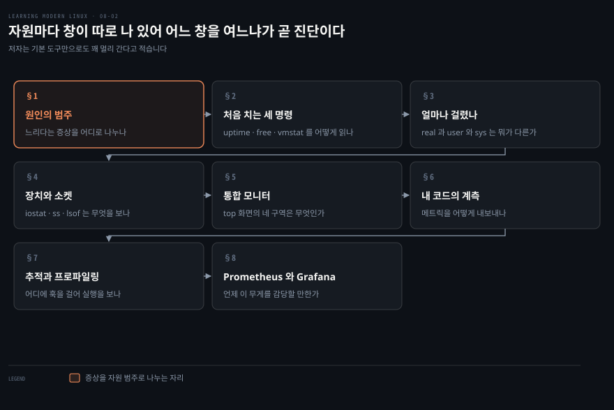
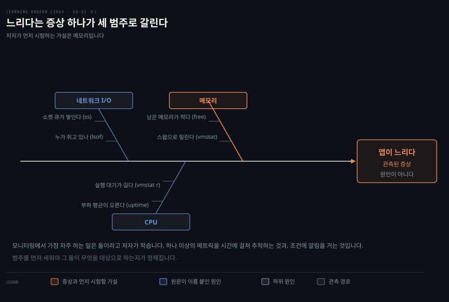
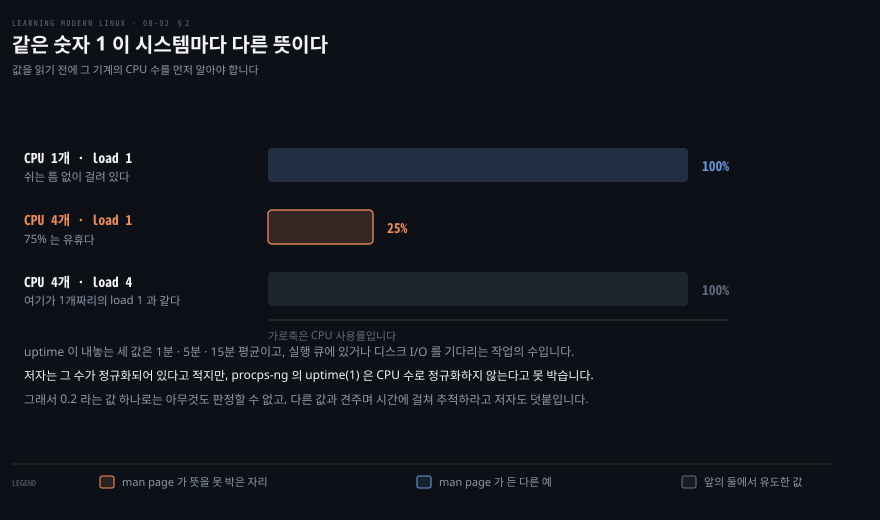
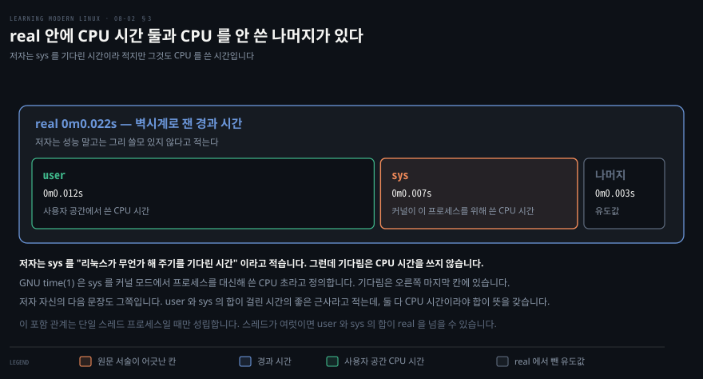
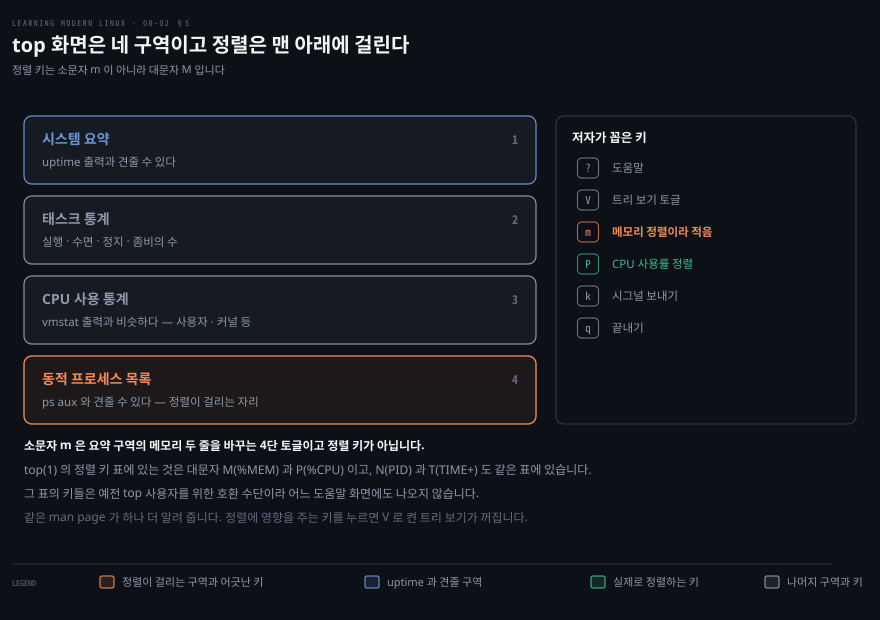
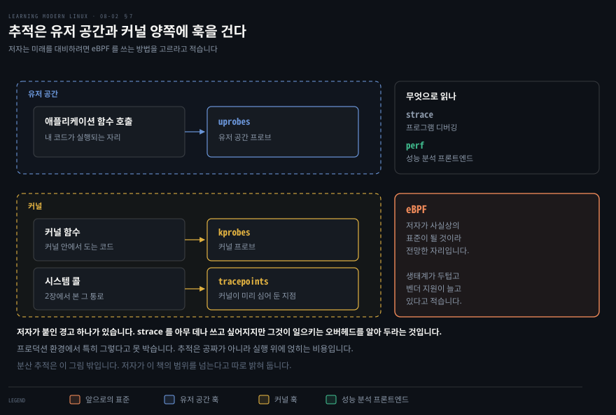
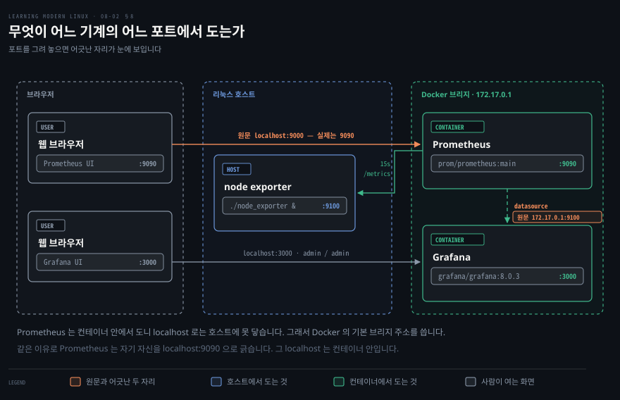

# 자원마다 창이 따로 나 있어 어느 창을 여느냐가 곧 진단이다

---

> 8장 노트의 둘째 편입니다. 앞 편이 신호가 무엇인지와 로그를 다뤘다면, 이 편은 수치를 읽는 명령들과 그 위에 얹히는 층을 다룹니다.

## 핵심 요약

> 이 구간이 매달린 생각은 **자원마다 창이 따로 나 있다**는 것입니다. 어느 창을 먼저 여느냐가 곧 진단의 순서입니다.

앞 편에서 저자는 느린 앱의 원인 후보가 여럿이라고 적었습니다. 메모리와 CPU 사이클과 네트워크 입출력이 그 후보였습니다. 이 편의 명령들은 그 후보 하나마다 하나씩 붙습니다. `free` 는 메모리를 보고 `vmstat` 는 실행 대기와 컨텍스트 전환을 보며 `iostat` 는 장치를, `ss` 는 소켓을 봅니다.

명령마다 무엇을 보여 주는지는 그 명령의 man page 가 정확히 적어 두었습니다. 그래서 이 편에서는 원서의 서술을 man page 와 나란히 놓고 읽습니다. 그 대조에서 원문 정오 여섯이 나왔고, 그중 셋은 값을 잘못 해석하게 만드는 종류입니다.

마지막 두 절은 리눅스 기본 도구 위에 얹히는 층입니다. 추적은 실행 자체를 잡고, Prometheus 와 Grafana 는 시계열을 쌓아 대시보드와 알림을 만듭니다. 저자는 그 무게를 사소한 일에 쓰지는 않을 것이라고 미리 선을 그어 둡니다.


## 학습 목표

> 이 구간을 읽고 나면 아래 다섯 가지를 스스로 해낼 수 있습니다.

1. 느린 앱의 원인을 자원 범주로 나누고 범주마다 어느 명령을 칠지 정할 수 있습니다.
2. `uptime` 의 부하 평균을 CPU 수와 함께 읽고, 값 하나만으로 판정하지 않을 수 있습니다.
3. `time` 의 `real`·`user`·`sys` 를 구분하고 무엇이 CPU 시간인지 말할 수 있습니다.
4. `iostat`·`ss`·`lsof` 가 각각 무엇을 보여 주는지 고르고, `top` 화면의 네 구역을 읽을 수 있습니다.
5. 추적의 훅 지점 셋을 대고, Prometheus 와 Grafana 구성에서 어느 포트가 무엇인지 짚을 수 있습니다.

아래는 이 문서 전체를 읽는 순서로 이은 지도입니다. 칸마다 절 번호와 그 절이 답하는 물음 하나를 적었습니다. 색이 붙은 칸이 이 노트의 제목이 가리키는 자리입니다.




## 이 문서가 다루지 않는 것

> 저자가 스스로 그은 선과, 노트를 나누며 생긴 경계를 함께 적습니다.

- 신호 유형의 정의와 로그 전반 → [앞 노트](./08-01.%EC%9E%AC%EB%8A%94%20%EA%B2%83%EC%9D%80%20%EB%B0%94%EA%B9%A5%EC%9D%B4%EA%B3%A0%20%EC%95%8C%EA%B3%A0%20%EC%8B%B6%EC%9D%80%20%EA%B2%83%EC%9D%80%20%EC%95%88%EC%9D%B4%EB%8B%A4.md)가 다룹니다
- 분산 추적 → 저자가 이 책의 범위 밖이라고 못 박습니다
- `sar` 와 `perf` 의 상세 사용법 → 저자가 이름과 성격만 적고 넘어갑니다
- Prometheus 질의 언어와 Grafana 대시보드 편집 → 저자의 구성은 화면이 뜨는 데까지입니다
- 원서의 화면 캡처(그림 8-3 부터 8-8) → 도구의 실제 화면이라 옮기지 않고 직접 띄워 보기를 권합니다


## 1. 느리다는 증상 하나가 세 범주로 갈립니다

> 명령을 아무리 많이 외워도 순서가 없으면 소용이 없습니다. 순서를 만드는 것은 증상을 원인 범주로 나누는 일입니다.



### 풀려는 문제

앞 편 §1 에서 자원을 하나씩 바꿔 재라고 했습니다. 그런데 "하나씩" 이 성립하려면 자원이 몇 개인지, 각각을 어떻게 재는지가 먼저 있어야 합니다. 그것이 없으면 하나씩 바꾸는 절차는 실행할 수 없는 조언으로 남습니다.

### 범주가 명령의 순서를 만듭니다

저자가 이름 붙인 원인은 셋입니다. 메모리 부족과 CPU 사이클 부족과 네트워크 입출력 부족입니다. 위 도식의 뼈대 셋이 그것입니다.

저자는 그 뒤에 "등등" 을 붙여 나머지를 열어 두었습니다. 그 열린 자리에 디스크 입출력이 들어가는데, 저자가 §4 에서 `iostat` 를 다루는 것이 근거입니다. 도식에 네 번째 뼈대를 세우지 않은 것은 원문이 이름 붙인 것이 셋뿐이기 때문입니다.

범주가 서면 각 범주를 여는 창이 정해집니다. 도식의 가지 끝에 붙은 도구 이름이 그것이며, 이 편의 나머지 절이 그 창을 하나씩 엽니다.

### 모니터링이 하는 일은 둘입니다

저자는 모니터링을 시스템과 애플리케이션 메트릭을 붙잡는 일이라고 정의합니다. 무언가 얼마나 걸리는지가 궁금할 수도 있고, 프로세스가 자원을 얼마나 쓰는지가 궁금할 수도 있습니다. 앞의 것이 성능 모니터링이고 뒤의 것은 건강하지 않은 시스템을 진단하는 일입니다.

그 맥락에서 가장 자주 하게 되는 활동은 둘입니다.

1. 하나 이상의 메트릭을 시간에 걸쳐 추적합니다.
2. 어떤 조건에 알림을 겁니다.

이 둘이 §8 의 Prometheus 와 Grafana 가 하는 일이기도 합니다. 그전까지의 절은 그 둘을 손으로 하는 방법입니다.


## 2. 처음 치는 세 명령이 시스템의 첫인상입니다

> 부하 평균 값 하나를 보고 "바쁘다" 고 판정하는 습관이 있는데, 그 값은 CPU 수를 모르면 아무것도 뜻하지 않습니다.



### `uptime` — 시스템이 얼마나 오래 얼마나 바쁜가

저자가 가장 먼저 치는 명령입니다. 시스템이 얼마나 오래 돌았는지와 메모리 사용량 같은 기본 메트릭을 보여 줍니다.

```bash
uptime
```

```bash
08:48:29 up 21 days, 20:59,  1 user,  load average: 0.76, 0.20, 0.09
```

쉼표로 갈린 출력이 시스템이 얼마나 오래 돌았는지, 로그인한 사용자가 몇인지, 그리고 부하 평균 구간의 세 게이지를 알려 줍니다. 세 게이지는 1분·5분·15분 평균입니다.

세 값이 무엇을 센 것인지는 저자가 정확히 적습니다. 실행 큐에 있거나 디스크 입출력을 기다리는 작업의 수입니다. `uptime(1)` 도 같은 말을 합니다. 실행 가능(runnable) 상태이거나 인터럽트 불가(uninterruptable) 상태인 프로세스의 평균 수라는 것입니다.[^uptime]

> **원문 정오**: 저자는 이어서 "그 수는 정규화되어 있고 CPU 가 얼마나 바쁜지를 가리킨다(the numbers are normalized and indicate how busy the CPUs are)" 고 적습니다. procps-ng 의 `uptime(1)` 은 정반대를 못 박습니다. "부하 평균은 시스템의 CPU 수에 대해 정규화되지 않으므로, 부하 평균 1 은 단일 CPU 시스템이라면 내내 걸려 있다는 뜻이고 4 CPU 시스템이라면 75% 를 놀았다는 뜻이다."[^uptime] 정규화되어 있다고 읽으면 4 CPU 기계에서 부하 1 을 보고 포화라고 오판하게 됩니다.

저자 자신의 마지막 문장은 옳습니다. 여기 나온 5분 평균 0.2 는 그것만으로는 아무것도 말해 주지 않으니 다른 값과 견주고 시간에 걸쳐 추적하라는 것입니다. 정오를 고쳐 읽으면 그 조언에 조건이 하나 더 붙습니다. 견주기 전에 그 기계의 CPU 수를 알아야 합니다.

### `free` — 메모리가 어디로 갔나

```bash
free -h
```

```bash
              total   used   free   shared  buff/cache   available
Mem:           7.6G   1.3G   355M     395M        6.0G        5.6G
Swap:          975M   1.2M   974M
```

`-h` 는 사람이 읽기 좋은 출력을 뜻합니다. 저자가 각 열을 이렇게 읽습니다. 전체와 사용 중과 여유와 공유 메모리가 있고, 버퍼에 쓰인 것과 캐시에 쓰인 것이 있으며, 마지막이 사용 가능한 메모리입니다.

버퍼와 캐시가 합쳐진 값이 싫으면 `-w` 를 쓰라고 저자가 덧붙입니다. `free(1)` 이 그것을 확인해 줍니다. 넓은 모드로 바꾸면 버퍼와 캐시가 두 열로 갈려 보고됩니다.

`available` 열이 이 출력에서 가장 실무적인 값입니다. 여유 메모리가 355M 뿐인데 사용 가능한 메모리는 5.6G 입니다. 캐시로 쓰인 6.0G 의 상당 부분을 새 프로그램이 요구하면 커널이 내어 주기 때문입니다. `free` 열만 보고 메모리가 없다고 판정하는 것이 흔한 오독입니다.

`Swap` 줄은 스왑 공간의 전체와 사용과 여유입니다. 저자의 표현으로는 스왑 디스크 공간으로 밀려난 물리 메모리입니다.

### `vmstat` — 한 줄에 여섯 축을 담습니다

메모리 사용을 더 정교하게 보는 방법으로 저자가 `vmstat` 를 듭니다. 이름은 가상 메모리 통계의 줄임말입니다. 인자로 초를 주면 그 간격으로 새 요약 줄을 계속 찍습니다.

```bash
vmstat 1
```

```bash
procs -----------memory--------- ---swap-- ----io---- -system- -----cpu--
 r  b   swpd   free   buff  cache   si   so    bi    bo   in   cs us sy id wa
 4  0   1184 482116 682388 5447048    0    0    12   105   28  191  6  3 91  0
 0  0   1184 483444 682388 5446600    0    0     0     0  369  522  1  0 99  0
 0  0   1184 483696 682392 5446600    0    0     0   104  278  374  1  1 99  0
```

첫 줄이 `-----cpu--` 에서 끊긴 것은 원서가 지면 폭에 맞춰 자른 자리라 그대로 두었습니다. 이 편의 표 형태 출력은 원서 지면에서 열이 접혀 있어 값을 그대로 두고 열 간격만 다시 맞춘 것입니다.

저자가 중요하다고 꼽은 열들의 뜻입니다. 괄호 안은 `vmstat(8)` 이 확인해 주는 부분입니다.

| 열 | 저자가 적은 뜻 | man page 의 정의 |
|----|--------------|-----------------|
| `r` | 실행 중이거나 CPU 를 기다리는 프로세스 수. 갖고 있는 CPU 수보다 작거나 같아야 한다 | 실행 가능한 프로세스의 수 |
| `free` | 여유 주 메모리(KB) | 유휴 메모리의 양 |
| `in` | 초당 인터럽트 수 | 초당 인터럽트 수. 클럭 인터럽트를 포함한다 |
| `cs` | 초당 컨텍스트 전환 수 | 초당 컨텍스트 전환 수 |
| `us` ~ `st` | 사용자 공간·커널·유휴 등에 걸친 전체 CPU 시간의 백분율 | 전체 CPU 시간의 백분율 |

`r` 열에 저자가 붙인 조건이 부하 평균 정오와 짝을 이룹니다. 실행 대기 수를 CPU 수와 견주라는 것이며, 부하 평균도 정확히 같은 방식으로 읽어야 합니다.


## 3. `real` 안에 CPU 시간 둘과 나머지가 있습니다

> 어떤 작업이 오래 걸렸을 때 "CPU 가 바빴나" 와 "무언가를 기다렸나" 는 완전히 다른 진단으로 이어집니다. 그 둘을 가르는 것이 `time` 의 세 값입니다.



"3초 걸렸다" 는 보고는 조치로 이어지지 않습니다. 그 3초가 계산이었는지 대기였는지에 따라 손댈 곳이 완전히 달라지기 때문입니다.

어떤 연산이 얼마나 걸리는지 보려면 `time` 을 씁니다. 저자가 든 예는 `/etc` 아래 전부를 재귀로 나열하는 데 걸리는 시간입니다.

```bash
time (ls -R /etc 2&> /dev/null)
```

```bash
real    0m0.022s
user    0m0.012s
sys     0m0.007s
```

> **원문 정오**: 명령 안의 `2&>` 는 의도한 리다이렉션이 아닙니다. bash 는 `2` 를 `ls` 의 인자로 넘기고 `&>` 만 리다이렉션으로 처리합니다. 실제로 `bash -xc 'ls /tmp 2&> /dev/null'` 을 돌리면 추적 출력이 `+ ls /tmp 2` 로 찍힙니다. 없는 경로 `2` 를 나열하려다 실패해 종료 상태가 1 이 되고, 그 오류 메시지는 `&>` 덕분에 버려져 보이지 않습니다. 저자의 주석이 설명하는 동작을 얻으려면 `ls -R /etc &> /dev/null` 이나 `ls -R /etc > /dev/null 2>&1` 로 써야 합니다.

세 값에 저자가 붙인 주석입니다. `real` 은 걸린 전체 시간이며 벽시계 시간이라 성능 말고는 그리 쓸모 있지 않다고 적습니다. `user` 는 `ls` 자신이 사용자 공간에서 CPU 위에 있던 시간입니다.

> **원문 정오**: `sys` 에 대해 저자는 "How long ls was waiting for Linux to do something (kernel space)" 이라고 적습니다. 괄호 안의 "kernel space" 는 앞 항목의 "(user space)" 와 짝이라 저자가 커널 쪽 시간을 가리킨 것은 분명합니다. 틀린 것은 그것을 "기다린 시간" 이라고 부른 대목입니다. 기다림은 CPU 시간을 쓰지 않으므로 그 서술은 `sys` 가 아니라 `real` 에서 `user` 와 `sys` 를 뺀 나머지에 해당합니다. GNU `time(1)` 은 `S` 를 "커널 모드에서 프로세스를 대신해 시스템이 쓴 CPU 초" 로, `U` 를 "프로세스가 직접 사용자 모드에서 쓴 CPU 초" 로 정의합니다.[^gnutime] 저자 자신의 다음 문장도 그쪽을 가리킵니다. `user` 와 `sys` 의 합이 걸린 시간의 좋은 근사라고 적는데, 둘 다 CPU 시간이어야 그 합이 뜻을 갖습니다.

두 값의 비율이 실행 시간의 대부분을 어디서 쓰는지 알려 준다는 마지막 조언은 그대로 유효합니다. `sys` 가 크면 시스템 콜이 잦다는 뜻이고, 2장에서 본 `strace -c` 로 어느 시스템 콜인지까지 좁힐 수 있습니다.

> **노트의 읽기**: 위 도식이 `real` 안에 `user` 와 `sys` 를 담은 것은 이 예가 단일 스레드 프로세스이기 때문입니다. 스레드가 여럿이면 여러 CPU 위에서 동시에 시간이 쌓이므로 `user` 와 `sys` 의 합이 `real` 을 넘을 수 있습니다. 그때는 포함 관계가 아니라 별개의 두 축으로 읽어야 합니다.


## 4. 장치와 소켓과 열린 파일에는 각각의 창이 있습니다

> 앱이 느린데 CPU 도 메모리도 한가하면 남은 후보는 장치와 네트워크입니다. 그 둘을 여는 명령은 서로 다릅니다.

### `iostat` — 블록 장치가 얼마나 바쁜가

```bash
iostat -z --human
```

```bash
Linux 5.4.0-81-generic (starlite)   09/26/21   _x86_64_   (4 CPU)

avg-cpu:  %user  %nice  %system  %iowait  %steal  %idle
           5.8%   0.0%     2.7%     0.1%    0.0%  91.4%

Device   tps   kB_read/s   kB_wrtn/s   kB_read   kB_wrtn
loop0   0.00        0.0k        0.0k    343.0k      0.0k
loop1   0.00        0.0k        0.0k      2.8M      0.0k
...
sda     0.38        1.4k       12.4k      2.5G     22.5G
dm-0    0.72        1.3k       12.5k      2.4G     22.7G
...
loop12  0.00        0.0k        0.0k      1.5M      0.0k
```

두 옵션의 뜻을 저자가 적습니다. `-z` 는 표집 구간에 활동이 있었던 장치만 보이라는 것이고, `--human` 은 단위를 사람이 읽는 형태로 만듭니다. `iostat(1)` 이 둘 다 확인해 줍니다.

행 하나를 읽는 법도 저자가 짚습니다. `tps` 는 그 장치에 대한 초당 전송 수, 곧 입출력 요청 수입니다. `kB_read` 가 읽은 데이터 양이고 `kB_wrtn` 이 쓴 양입니다.

`avg-cpu` 줄의 `%iowait` 가 §1 의 디스크 입출력 범주와 이어집니다. `iostat(1)` 의 정의로는 CPU 가 유휴였는데 시스템에 처리되지 않은 디스크 입출력 요청이 있던 시간의 비율입니다. 이 값이 높으면 CPU 가 놀면서 디스크를 기다리고 있다는 뜻입니다.

### `ss` — 지금 열려 있는 소켓

```bash
ss -atup
```

```bash
Netid  State   Recv-Q  Send-Q  Local Address:Port      Peer Address:Port
udp    UNCONN       0       0        0.0.0.0:60360           0.0.0.0:*
...
udp    ESTAB        0       0  192.168.178.40:51008    74.125.193.113:443
...
tcp    LISTEN       0     128        0.0.0.0:sunrpc          0.0.0.0:*
tcp    ESTAB        0       0  192.168.178.40:57628    74.125.193.188:5228
tcp    LISTEN       0       5           [::1]:ipp              [::]:*
```

저자가 지면에 맞춰 편집했다고 밝힌 출력이라 `-p` 가 만들어 낼 Process 열은 여기 없습니다.

네 옵션의 뜻을 저자가 적습니다.

- `-a`: 듣고 있는 소켓과 그렇지 않은 소켓을 모두 고릅니다
- `-t`: TCP 소켓을 고릅니다
- `-u`: UDP 소켓을 고릅니다
- `-p`: 소켓을 쓰는 프로세스를 보입니다

`ss(8)` 의 `-a` 정의가 저자의 서술과 같습니다. 듣는 소켓과 듣지 않는 소켓을 모두 표시하며 TCP 에서 뒤의 것은 확립된 연결을 뜻한다는 것입니다.

저자가 예로 짚은 행은 확립된 TCP 연결 하나입니다. 로컬 IPv4 주소와 원격 주소 사이의 연결인데 놀고 있는 것으로 보인다고 적습니다. 근거는 받을 큐(`Recv-Q`)와 보낼 큐(`Send-Q`)가 둘 다 0 이라는 것입니다. 이 두 열이 §1 의 네트워크 범주를 여는 창입니다. 큐가 쌓여 있으면 그 소켓의 양쪽 중 한쪽이 못 따라가고 있습니다.

저자가 오래된 방법이라고 소개하는 것이 `netstat` 입니다. 세 가지를 한꺼번에 원할 때 다음을 쓸 수 있다고 적습니다. TCP 와 UDP 를 계속 갱신해 보는 것, 프로세스 ID 를 포함하는 것, FQDN 대신 IP 주소를 쓰는 것입니다.

```bash
netstat -ctulpn
```

> **노트의 읽기**: 이 조합은 저자의 설명보다 좁습니다. `netstat(8)` 에서 `-l` 은 "듣고 있는 소켓만 표시한다" 이므로, 위 명령은 확립된 연결을 보여 주지 않습니다.[^netstat] 앞의 `ss -atup` 이 `-a` 로 양쪽을 다 고른 것과 대비됩니다. 확립된 연결까지 계속 보려면 `-l` 을 빼거나 `-a` 로 바꿔야 합니다. 나머지 옵션은 설명대로입니다. `-c` 는 매초 계속 찍고, `-p` 는 소켓이 속한 프로그램의 PID 와 이름을 보이며, `-n` 은 이름 해석 대신 숫자 주소를 씁니다.

### `lsof` — 열린 파일 목록에서 소켓도 보입니다

이름은 "list open files" 의 줄임말이고, 저자는 쓸모가 많은 다재다능한 도구라고 소개합니다. 5장의 "모든 것은 파일" 이 여기서 실용적인 이득으로 돌아옵니다. 소켓도 파일이므로 같은 도구로 보입니다.

특권 포트 범위의 TCP 소켓을 보려면 다음과 같이 씁니다. root 권한이 필요합니다.

```bash
sudo lsof -i TCP:1-1024
```

```bash
COMMAND   PID   USER  FD   TYPE  DEVICE  SIZE/OFF  NODE  NAME
...
rpcbind 26901   root  8u   IPv4  615970       0t0   TCP  *:sunrpc (L
rpcbind 26901   root 11u   IPv6  615973       0t0   TCP  *:sunrpc (L
```

마지막 칸이 `(L` 에서 끊긴 것은 원서 지면이 자른 자리입니다. 실제 값은 소켓 상태이고 이 두 줄은 `LISTEN` 입니다. 소켓에서는 `NODE` 열이 프로토콜을 담는다는 것도 이 출력에서 보입니다.

같은 도구를 프로세스 중심으로 쓸 수도 있습니다. 프로세스의 PID 를 안다면 파일 디스크립터와 입출력 등을 추적할 수 있다고 저자가 적습니다. 예로 든 것은 Chrome 입니다.

```bash
lsof -p 5299
```

```bash
COMMAND  PID  USER  FD   TYPE  DEVICE     SIZE/OFF     NODE  NAME
chrome  5299   mh9  cwd    DIR   253,0         4096  6291458  /home/mh9
chrome  5299   mh9  rtd    DIR   253,0         4096        2  /
chrome  5299   mh9  txt    REG   253,0    179093936  3673554  /opt/google/chrome/
```

포트에서 시작해 프로세스로 가는 길과, 프로세스에서 시작해 자원으로 가는 길이 같은 명령의 두 옵션입니다. 장애 대응에서 "이 포트를 누가 쥐고 있나" 와 "이 프로세스가 무엇을 열고 있나" 는 자주 이어지는 두 질문입니다.

저자는 성능 모니터링 도구가 더 많다고 덧붙이며 둘을 이름만 언급합니다. 여러 카운터를 아우르고 스크립트에 쓰기 좋은 `sar` 와, §7 에서 다시 나올 `perf` 입니다.


## 5. `top` 화면은 네 구역이고 정렬은 맨 아래에 걸립니다

> 개별 도구를 하나씩 치는 것과 화면 하나에서 전부 보는 것은 다른 작업입니다. 후자를 하려면 그 화면의 구역을 먼저 알아야 합니다.



앞 절까지의 명령은 한 번에 하나씩 칩니다. 그런데 장애 대응에서는 CPU 와 메모리와 프로세스를 동시에 보면서 무엇이 먼저 움직이는지를 봐야 할 때가 있습니다.

앞 절의 도구들은 시작점으로 좋고 스크립트에도 쓸모가 있습니다. 더 편한 모니터링을 원하면 통합 솔루션이 낫다고 저자가 적습니다. 이런 도구는 보통 텍스트 사용자 인터페이스를 갖추고 다음 세 가지를 제공합니다.

1. 여러 자원 유형을 지원합니다. CPU 와 RAM 과 입출력입니다.
2. 프로세스나 사용자나 자원으로 대화형 정렬과 필터링을 합니다.
3. 실시간으로 갱신하고 상세로 파고듭니다. 프로세스 그룹은 물론 cgroups 와 네임스페이스까지 내려가는 경우도 있습니다.

거의 모든 환경에 있는 `top` 이 그 예입니다. 헤더에 `uptime` 출력과 비슷한 개요를 주고, CPU 와 메모리 상세를 표로 그린 다음, 추적할 수 있는 프로세스 목록을 잇습니다.

```bash
top - 12:52:54 up 22 days,  1:04,  1 user,  load average: 0.23, 0.26, 0.23
Tasks: 263 total,   1 running, 205 sleeping,   0 stopped,   0 zombie
%Cpu(s):  0.2 us,  0.4 sy,  0.0 ni, 99.3 id,  0.0 wa,  0.0 hi,  0.0 si, \
  0.0 st%
KiB Mem : 7975928 total,  363608 free, 1360348 used, 6251972 buff/cach
KiB Swap:  999420 total,  998236 free,    1184 used. 5914992 avail Mem

  PID USER   PR  NI    VIRT   RES   SHR S  %CPU  %MEM     TIME+  COMMAND
    1 root   20   0  225776  9580  6712 S   0.0   0.1   0:25.84  systemd
  433 root   20   0  105908  1928  1700 S   0.0   0.0   0:00.05  `- lvme
  775 root   20   0   36552  4240  3880 S   0.0   0.1   0:00.16  `- blue
  789 syslog 20   0  263040  4384  3616 S   0.0   0.1   0:01.98  `- rsys
```

저자가 붙인 네 주석이 곧 화면의 네 구역입니다.

1. **시스템 요약**: `uptime` 출력과 견줄 수 있습니다.
2. **태스크 통계**: 전체와 실행·수면·정지·좀비의 수입니다.
3. **CPU 사용 통계**: 사용자와 커널 등으로 나뉘며 `vmstat` 출력과 비슷합니다.
4. **동적 프로세스 목록**: 프로세스별 상세를 담고 `ps aux` 출력과 견줄 수 있습니다.

저자가 외워 두라고 꼽은 키는 여섯입니다. 그중 넷은 설명대로 동작합니다.

- `?`: 키 매핑을 포함한 도움말
- `V`: 프로세스 트리 보기 토글
- `k`: 시그널 보내기
- `q`: 끝내기

> **원문 정오**: 나머지 둘 중 하나가 어긋납니다. 저자는 `m` 을 "메모리 사용량으로 정렬" 로, `P` 를 "CPU 소비로 정렬" 로 적습니다. `P` 는 맞지만 `m` 은 아닙니다. procps-ng `top(1)` 에서 소문자 `m` 은 요약 구역의 물리·가상 메모리 두 줄을 바꾸는 4단 토글입니다. 정렬 키 표에 있는 것은 대문자 `M`(`%MEM`)이고 같은 표에 `P`(`%CPU`)와 `N`(PID)과 `T`(`TIME+`)가 함께 있습니다.[^top] 소문자를 누르면 정렬이 아니라 요약 표시가 바뀌므로, 목록이 그대로인 것을 보고 도구가 이상하다고 여기게 됩니다.

그 표에는 저자가 옮기지 않은 단서가 붙어 있습니다. 이 키들은 예전 `top` 사용자를 위한 호환 수단이라 어느 도움말 화면에도 나오지 않는다는 것입니다. `?` 를 눌러도 `M` 과 `P` 는 안 보이므로, 저자가 굳이 목록으로 적어 준 데는 이유가 있습니다.

같은 man page 가 하나를 덤으로 알려 줍니다. 정렬 순서에 영향을 주는 키를 누르면 `V` 로 켜 둔 트리 보기가 꺼집니다. 저자가 나란히 꼽은 두 키가 서로를 끄는 관계라는 뜻입니다.

### `top` 말고도 있습니다

저자가 대안으로 든 도구들입니다. 각 줄은 저자가 붙인 성격 그대로입니다.

| 도구 | 저자가 적은 성격 |
|------|-----------------|
| `htop` | `top` 을 점진적으로 개선한 것. 더 빠르고 인터페이스가 낫습니다 |
| `atop` | 강력한 대안. CPU 와 메모리에 더해 입출력과 네트워크 통계를 상세히 다룹니다 |
| `below` | 비교적 새 도구. cgroups v2 를 이해한다는 점이 특기할 만합니다 |
| `glances` | 보통의 자원에 더해 장치까지 아우르는 하이브리드 |
| `guider` | 여러 메트릭을 표시하고 그래프로 그리는 통합 성능 분석기 |
| `neoss` | 네트워크 트래픽 모니터링용. TUI 를 갖춘 `ss` 대체재 |
| `mtr` | 네트워크 트래픽 모니터링용. `traceroute` 의 더 강력한 대안 |

`below` 에 저자가 붙인 단서가 이 표에서 가장 실무적입니다. 다른 도구들은 cgroups 를 이해하지 못해 전역 자원 뷰만 제공한다는 것입니다. 6장에서 본 컨테이너가 cgroups 로 자원을 제한한다는 사실과 이어집니다. 컨테이너 안에서 `top` 을 띄우면 컨테이너의 한도가 아니라 호스트 전체가 보입니다.


## 6. 내 코드에서 신호를 내보내려면 방향을 골라야 합니다

> 지금까지의 신호는 전부 커널이나 남의 앱에서 나온 것입니다. 내 코드가 신호를 내려면 그것을 어디로 보낼지부터 정해야 합니다.

여기까지 다룬 신호는 커널이나 이미 있는 애플리케이션에서 나온 것이었습니다. 내가 소유하지 않은 코드입니다. 이제 내 코드가 로그처럼 메트릭을 내보내게 만드는 이야기로 넘어갑니다.

신호를 내보내려고 코드를 삽입하는 과정을 계측(instrumentation)이라고 부릅니다. 저자는 전략이 둘 있다고 적습니다. 개발자가 따로 손대지 않아도 되는 자동 계측과, 코드베이스의 특정 지점에서 메트릭을 내보내도록 조각을 직접 넣는 사용자 정의 계측입니다.

도구로는 StatsD 를 들 수 있습니다. Ruby 와 Node.js 와 Python 과 Go 를 비롯한 여러 언어에 클라이언트 라이브러리가 있습니다. 다만 한계가 있다고 저자가 단서를 답니다.

그 한계가 드러나는 자리가 쿠버네티스나 IoT 같은 동적 환경입니다. 이런 환경에서는 다른 접근이 대개 더 낫다고 적습니다. 끌어오기 방식 또는 스크래핑이라고 부르는 것입니다.

두 방식의 차이는 화살표의 방향입니다. StatsD 는 앱이 메트릭을 보낼 곳을 설정으로 알고 있어야 합니다. 스크래핑에서는 애플리케이션이 메트릭을 노출하기만 합니다. 노출 통로는 보통 HTTP 엔드포인트이고, 에이전트가 그 엔드포인트를 호출해 가져갑니다.

동적 환경에서 이 방향이 유리한 이유는 저자가 명시하지 않지만 §8 의 구성이 답을 보여 줍니다. 앱이 늘고 줄 때 앱마다 목적지 설정을 고치는 대신 에이전트의 대상 목록만 관리하면 됩니다.


## 7. 추적은 유저 공간과 커널 양쪽에 훅을 겁니다

> 메트릭은 값이 얼마인지를 알려 주지만 왜 그런지는 알려 주지 않습니다. 실행 자체를 잡아야 하는 순간이 있습니다.



추적이라는 말은 과하게 쓰인다고 저자가 먼저 경고합니다. 리눅스 맥락에서 단일 기계 위의 추적은 프로세스 실행을 시간에 걸쳐 붙잡는 것을 뜻합니다. 유저 공간의 함수 호출과 시스템 콜 같은 것들입니다.

쿠버네티스의 컨테이너화된 마이크로서비스나 서버리스 앱의 람다 묶음 같은 분산 환경에서는 분산 추적을 줄여 그냥 추적이라고 부르기도 합니다. OpenTelemetry 와 Jaeger 가 그 예이며, 그 유형은 이 책의 범위 밖이라고 저자가 못 박습니다.

### 소스는 둘, 훅은 셋

단일 리눅스 기계에서 추적의 소스는 둘입니다.

- **리눅스 커널**: 커널의 함수에서 트레이스가 나오거나 시스템 콜이 트리거가 됩니다. 커널 프로브(kprobes)와 커널 트레이스포인트가 그 예입니다
- **유저 공간**: 애플리케이션의 함수 호출이 소스가 될 수 있습니다. 유저 공간 프로브(uprobes)를 통하는 것이 그 예입니다

2장에서 시스템 콜이 커널이 기능을 드러내는 유일한 통로라고 했는데, 그 통로가 여기서는 관측의 훅 지점이 됩니다. 경계를 지나는 모든 것이 한자리를 통과하므로 그 자리에 걸면 다 보입니다.

용도는 둘로 갈립니다. `strace` 같은 추적 도구로 프로그램을 디버깅하는 것과, `perf` 를 프론트엔드 삼아 성능을 분석하는 것입니다. `sudo perf top` 은 프로세스별 요약을 만들어 줍니다.

> 저자가 경고 상자로 세운 내용이 하나 있습니다. `strace` 를 아무 데나 쓰고 싶어지겠지만 그것이 일으키는 오버헤드를 알아 두라는 것이고, 프로덕션 환경에서 특히 그렇다고 못 박습니다. 근거로 Brendan Gregg 의 글 "strace Wow Much Syscall" 을 읽으라고 권합니다.

### 앞으로는 eBPF 쪽입니다

저자의 전망은 분명합니다. eBPF 가 추적을 구현하는 사실상의 표준이 될 것으로 보이며 사용자 정의 사례에서 특히 그렇다는 것입니다. 생태계가 두텁고 벤더 지원이 늘고 있으니, 미래에도 통할 추적 방법을 찾는다면 eBPF 를 쓰는 것을 고르라고 권합니다.

2장에서 커널을 확장하는 현대적 방법으로 eBPF 를 본 것이 여기서 이어집니다. 커널을 다시 빌드하지 않고 커널 안에서 코드를 돌릴 수 있다는 성질이, 추적처럼 커널 안 이벤트를 잡아야 하는 일에 그대로 맞습니다.

### 프로파일링은 추적의 한 용도입니다

추적의 특정 용도 하나가 프로파일링입니다. 자주 호출되는 코드 구간을 식별하는 일입니다. 저자가 든 저수준 도구는 `pprof` 와 Valgrind 와 플레임 그래프 시각화입니다.

`perf` 출력을 대화형으로 소비하고 트레이스를 시각화하는 선택지도 많다고 하며, Mark Hansen 의 "Linux perf Profiler UIs" 를 참고로 답니다.

지속적 프로파일링은 그 진화된 형태입니다. 커널과 유저 공간의 트레이스를 시간에 걸쳐 붙잡습니다. 시각이 찍힌 트레이스가 모이면 그것을 그리고 견주며 흥미로운 구간으로 파고들 수 있습니다. 저자가 유망하다고 꼽은 예는 eBPF 기반의 오픈 소스 프로젝트 parca 입니다.


## 8. Prometheus 와 Grafana 는 언제 감당할 만한가

> 지금까지의 도구는 지금 이 순간을 봅니다. 시간에 걸친 값을 쌓고 조건에 알림을 걸려면 다른 층이 필요합니다.



여기까지의 도구는 화면을 닫으면 값이 사라집니다. "어제 이 시각에는 어땠나" 를 물으려면 값을 어딘가에 쌓아 두어야 하고, 쌓아 두면 조건에 알림을 걸 수 있습니다.

시간에 걸친 메트릭, 곧 시계열 데이터를 다룬다면 Prometheus 와 Grafana 조합을 고려할 만하다고 저자가 적습니다. 보여 주는 것은 단일 기계 구성이며, 그것으로 대시보드를 만들고 알림까지 걸 수 있습니다.

### 구성의 세 조각

node exporter 가 CPU 와 메모리와 네트워크를 아우르는 시스템 메트릭을 노출합니다. Prometheus 가 그것을 긁어 갑니다. 긁는다는 것은 node exporter 가 `/metrics` 라는 URL 경로로 제공하는 HTTP 엔드포인트를 Prometheus 가 호출한다는 뜻입니다. 마지막으로 Grafana 가 Prometheus 를 데이터소스로 삼아 대시보드를 그리고 조건에 알림을 겁니다.

첫 단계는 node exporter 를 내려받아 풀고 배경에서 돌리는 것입니다.

```bash
./node_exporter &
curl localhost:9100/metrics
```

```bash
# TYPE go_gc_duration_seconds summary
go_gc_duration_seconds{quantile="0"} 7.2575e-05
go_gc_duration_seconds{quantile="0.25"} 0.00011246
go_gc_duration_seconds{quantile="0.5"} 0.000227351
go_gc_duration_seconds_sum 0.126529838
go_gc_duration_seconds_count 390
```

포트 9100 은 node exporter 의 기본값입니다. 프로젝트의 README 가 그것을 못 박습니다.[^nodeexp]

> **노트의 읽기**: 저자는 이 엔드포인트가 "OpenMetrics 형식으로" 메트릭을 돌려준다고 적습니다. 지금 실측하면 그렇지 않습니다. node exporter 1.12.1 은 `Content-Type: text/plain; version=0.0.4` 를 돌려주며, 이것은 Prometheus 텍스트 노출 형식입니다. `Accept: application/openmetrics-text; version=1.0.0` 을 명시해 요청해도 응답 형식이 바뀌지 않고, OpenMetrics 가 요구하는 `# EOF` 종결자도 없습니다. 원서가 나온 2022년의 버전을 확인하지는 못했으므로 버전 차이일 가능성을 남겨 둡니다. 다만 위 출력 자체가 Prometheus 텍스트 형식의 모양이라는 점은 원서 안에서도 확인됩니다.

다음은 Prometheus 설정 파일입니다.

```yaml
global:
  scrape_interval: 15s
  evaluation_interval: 15s
  external_labels:
    monitor: 'mymachine'
scrape_configs:
  - job_name: 'prometheus'
    static_configs:
      - targets: ['localhost:9090']
  - job_name: 'machine'
    static_configs:
      - targets: ['172.17.0.1:9100']
```

두 대상에 저자가 각각 주석을 답니다. 첫 번째는 Prometheus 자신이 메트릭을 노출하므로 넣은 자기 모니터링입니다. 두 번째가 node exporter 인데, Prometheus 를 Docker 에서 돌리므로 `localhost` 를 쓸 수 없어 Docker 가 기본으로 쓰는 IP 주소를 씁니다.

이제 Prometheus 와 Grafana 를 컨테이너로 띄웁니다.

```bash
docker run --name prometheus \
  --rm -d -p 9090:9090 \
  -v /home/mh9/lml/o11y/prometheus.yml:/etc/prometheus/prometheus.yml \
  prom/prometheus:main
```

```bash
docker run --name grafana \
  --rm -d -p 3000:3000 \
  grafana/grafana:8.0.3
```

인자에 저자가 붙인 설명입니다. 종료 시 컨테이너를 지우게 하고 데몬으로 돌립니다. 포트 9090 을 노출해 내 기계에서 쓸 수 있게 합니다.

설정 파일은 볼륨으로 컨테이너 안에 매핑합니다. 절대 경로여야 하므로 유연하게 두려면 bash 의 `$PWD` 나 Fish 의 `(pwd)` 를 쓰라고 덧붙입니다.

> **노트의 읽기**: 추출한 원문에서 이 설명의 옵션이 `-rm` 으로, 대시가 하나입니다. 바로 위 명령에는 `--rm` 으로 적혀 있습니다. 같은 어긋남이 §4 에도 있습니다. `iostat` 명령은 `--human` 인데 설명 문장은 `-human` 입니다. 같은 자리에서 같은 방식으로 두 번 반복되므로 저자의 오기라기보다 인라인 코드의 조판이나 텍스트 추출에서 대시 하나가 사라진 것으로 보입니다. 그래서 정오로 세지 않고, 이 노트의 본문에서는 두 곳 모두 대시 둘로 적었습니다.
>
> 다만 읽는 사람에게는 결과가 같습니다. 대시 하나로는 동작하지 않습니다. `docker run -rm hello-world` 는 `unknown shorthand flag: 'r' in -rm` 으로 거부됩니다.

### 어긋난 포트 둘

명령을 실행한 다음 브라우저에서 화면을 여는 단계가 남았습니다.

> **원문 정오**: 저자는 "브라우저에서 `localhost:9000` 을 열고 위쪽 Status 드롭다운에서 Targets 을 누르라" 고 적습니다. 포트가 틀렸습니다. 바로 위 명령이 `-p 9090:9090` 으로 게시한 포트가 9090 이고, 설정 파일의 자기 모니터링 대상도 `localhost:9090` 입니다. Prometheus 문서도 Prometheus 가 자신의 메트릭을 `localhost:9090` 에서 제공한다고 적습니다.[^prom] 9000 에서는 아무것도 응답하지 않습니다.

> **원문 정오**: 이어서 Grafana 에서 할 일 두 가지를 적는데 첫 번째가 "`172.17.0.1:9100` 을 URL 로 삼아 Prometheus 를 데이터소스로 추가" 하라는 것입니다. 9100 은 node exporter 의 포트이므로 그 URL 을 넣으면 Grafana 가 Prometheus 가 아니라 node exporter 를 가리키게 됩니다. Prometheus 는 9090 이니 `172.17.0.1:9090` 이라야 합니다. 두 번째로 적은 Node Exporter Full 대시보드를 가져오는 단계는 그대로 유효합니다.

두 정오가 같은 뿌리에서 나옵니다. 한 화면에 9090 과 9100 과 3000 이 함께 있고 그중 둘이 비슷하게 생겼습니다. 위 도식처럼 무엇이 어디서 도는지를 그려 두면 이런 어긋남이 눈에 띕니다.

### 저자가 그은 선

이 절을 닫으며 저자가 조건을 답니다. Prometheus 와 Grafana 구성은 더 공들여야 하고 움직이는 부품이 많으니 사소한 일에는 쓰지 않을 것이라는 말입니다. 앞에서 다룬 리눅스 기본 도구만으로도 꽤 멀리 갈 수 있다고 덧붙입니다.

그러면서 이 무게가 정당해지는 자리도 짚습니다. 홈 오토메이션이나 미디어 서버처럼 더 완전한 해법을 원하는 고급 사례입니다. 시간에 걸친 값을 계속 쌓고 조건에 알림을 걸어야 하는 상황이 그 기준입니다.


## 심화 학습

> 책 밖으로 나가 확인한 것만 모읍니다. 각 항목의 근거는 각주의 1차 자료이거나 이 노트가 실행한 명령입니다.

**정오 여섯 중 셋이 같은 종류입니다.** 부하 평균이 정규화되어 있다는 서술, `sys` 가 기다린 시간이라는 서술, `m` 이 메모리 정렬이라는 서술은 모두 **값이나 키의 뜻을 잘못 붙인 것**입니다. 도구를 실행하는 데는 문제가 없지만 결과를 읽는 방향을 틀리게 만듭니다. 이런 오류는 실행해 봐도 드러나지 않으므로 man page 와 대조하는 수밖에 없습니다.

**`free` 의 `used` 계산은 procps 버전에 따라 다릅니다.** 원서의 출력에서 `total` 7.6G 에서 `free` 355M 과 `buff/cache` 6.0G 를 빼면 1.3G 가 남고 그것이 `used` 와 맞습니다. 현재의 `free(1)` 은 `used` 를 `total - available` 로 정의하는데, 그 식으로는 2.0G 가 나옵니다.

실제로 procps-ng 4.0.4 에서 `free -k` 를 돌려 재어 보면 `used` 가 `total - available` 과 정확히 일치하고, `total - free - buff/cache` 와는 어긋납니다. 원서의 출력은 옛 계산식을 쓰던 버전의 것이므로 지금 같은 기계에서 돌려도 숫자가 그대로 나오지 않습니다. 열 이름이 같아도 계산이 바뀔 수 있다는 예입니다.

**`ss` 와 `lsof` 는 겹치지만 다른 축입니다.** `ss -p` 는 소켓에서 출발해 프로세스를 붙이고, `lsof -i` 는 열린 파일 목록에서 네트워크만 걸러 냅니다. 5장의 "모든 것은 파일" 이 없으면 뒤의 것은 성립하지 않습니다. 소켓이 파일 디스크립터가 아니었다면 파일 나열 도구로 소켓을 볼 이유가 없습니다.


## 결정 치트시트

> 어느 창을 언제 여는지를 한 표로 압축합니다.

| 묻고 싶은 것 | 칠 명령 | 무엇을 볼 것인가 |
|-------------|--------|-----------------|
| 이 기계가 지금 바쁜가 | `uptime` | 부하 평균 세 값. **CPU 수와 함께** 읽습니다 |
| 메모리가 모자란가 | `free -h` | `free` 가 아니라 `available` 열 |
| 실행 대기가 밀렸나 | `vmstat 1` | `r` 열을 CPU 수와 견줍니다 |
| 이 작업이 CPU 를 썼나 기다렸나 | `time` | `user`+`sys` 와 `real` 의 차이 |
| 디스크가 병목인가 | `iostat -z --human` | `%iowait` 와 장치별 `tps` |
| 이 포트를 누가 쥐고 있나 | `ss -atup` 또는 `lsof -i` | `Recv-Q`·`Send-Q` 와 프로세스 |
| 이 프로세스가 무엇을 열었나 | `lsof -p <PID>` | 파일 디스크립터와 경로 |
| 한 화면에서 다 보고 싶다 | `top` · `htop` · `atop` | 네 구역. 정렬은 `M` 과 `P` |
| 컨테이너의 한도까지 보고 싶다 | `below` | cgroups v2 를 이해하는 유일한 항목 |
| 시스템 콜을 잡고 싶다 | `strace` | 오버헤드를 감수할 때만 |
| 시간에 걸쳐 쌓고 알림을 걸고 싶다 | Prometheus + Grafana | 부품이 많으니 사소한 일에는 쓰지 않습니다 |


## 적용 관점

> 이 절은 전부 **원서 범위 밖의 노트의 읽기**입니다. 저자는 Spring 도 자바도 다루지 않으며, 아래는 이 장의 도구를 그 문맥에 옮겨 본 것입니다.

**컨테이너 안에서 `top` 을 띄우면 한도가 안 보입니다.** JVM 이 도는 컨테이너의 메모리 한도는 cgroups 가 정하는데, `top` 은 그것을 모르고 호스트 전체를 보여 줍니다. 저자가 `below` 에 붙인 단서가 그것입니다. 컨테이너 안에서 자원을 진단할 때는 `/sys/fs/cgroup` 아래를 직접 읽거나 cgroups 를 이해하는 도구를 써야 합니다.

**`vmstat` 의 `cs` 열이 스레드 풀 진단의 첫 창입니다.** 초당 컨텍스트 전환 수가 뛰는데 처리량은 그대로라면, 스레드가 일하는 시간보다 서로 자리를 넘기는 시간이 길다는 신호입니다. 풀 크기를 늘리면 나아질 것 같지만 이 값이 이미 높다면 반대로 가야 할 수도 있습니다.

**애플리케이션 메트릭도 §6 의 두 방향 중 하나를 고릅니다.** Spring Boot 의 Actuator 가 `/actuator/prometheus` 엔드포인트를 여는 것이 저자가 말한 스크래핑 쪽입니다. 앱은 목적지를 모르고 노출만 하며, 어디로 가져갈지는 에이전트가 정합니다. 앱이 늘고 줄어도 앱의 설정은 그대로라는 점이 동적 환경에서 이 방향을 고르는 이유입니다.

**메트릭 이름을 정하기 전에 종류를 정합니다.** 앞 편 §3 의 카운터와 게이지 구분이 여기서 실무 규칙이 됩니다. 누적이 뜻을 갖는 값은 카운터로 두고 증가분을 질의에서 계산하며, 지금 이 순간의 값은 게이지로 둡니다. 카운터를 게이지처럼 내보내면 재시작 때마다 값이 0 으로 떨어져 그래프가 망가집니다.


## 면접에서 받을 만한 질문

1. 부하 평균 2.0 을 보고 시스템이 바쁜지 판정할 수 있습니까. 왜 그렇습니까.
2. `time` 이 내놓는 `real`·`user`·`sys` 중 무엇이 CPU 시간입니까. 셋의 관계는 어떻게 됩니까.
3. `free` 출력에서 `free` 열과 `available` 열 중 무엇을 보아야 하고 왜 그렇습니까.
4. `%iowait` 가 높다는 것은 무엇을 뜻합니까. 그때 다음으로 볼 것은 무엇입니까.
5. 컨테이너 안에서 `top` 을 띄웠을 때 무엇이 문제가 됩니까.
6. 추적의 훅 지점 셋을 대고, 각각이 유저 공간과 커널 중 어디에 걸리는지 말해 보십시오.
7. 메트릭을 밀어 보내는 방식과 끌어가는 방식 중 동적 환경에 어느 쪽이 유리하며 왜 그렇습니까.


## 정답 (자답 후 펼치기)

<details>
<summary>펼쳐 보기</summary>

1. 판정할 수 없습니다. 부하 평균은 CPU 수로 정규화되지 않기 때문입니다. `uptime(1)` 의 예로는 부하 1 이 단일 CPU 시스템에서는 내내 걸려 있다는 뜻이고 4 CPU 시스템에서는 75% 를 놀았다는 뜻입니다. 값과 함께 그 기계의 CPU 수를 알아야 하고, 한 값이 아니라 세 구간을 견주며 시간에 걸쳐 추적해야 합니다.

2. `user` 와 `sys` 가 CPU 시간입니다. `user` 는 사용자 모드에서 프로세스가 직접 쓴 CPU 초이고 `sys` 는 커널 모드에서 시스템이 프로세스를 대신해 쓴 CPU 초입니다. `real` 은 벽시계로 잰 경과 시간이라 CPU 를 쓰지 않은 대기까지 포함합니다. 단일 스레드라면 `real` 에서 두 값을 뺀 나머지가 기다린 시간이고, 스레드가 여럿이면 `user`+`sys` 가 `real` 을 넘을 수 있습니다.

3. `available` 을 보아야 합니다. `free` 는 아무 데도 안 쓰인 메모리만 세는데, 커널은 남는 메모리를 페이지 캐시로 쓰기 때문에 정상 상태에서도 이 값이 작습니다. `available` 은 스왑 없이 새 애플리케이션을 시작할 수 있는 양의 추정치이며 회수 가능한 캐시를 감안합니다. 원서 출력에서도 `free` 는 355M 뿐이지만 `available` 은 5.6G 입니다.

4. CPU 가 유휴였는데 처리되지 않은 디스크 입출력 요청이 있던 시간의 비율이 높다는 뜻입니다. CPU 가 놀면서 디스크를 기다리고 있는 상태입니다. 다음으로 볼 것은 같은 `iostat` 출력의 장치별 행이며, `tps` 와 읽기·쓰기 양으로 어느 장치에 몰렸는지를 좁힙니다.

5. `top` 은 cgroups 를 이해하지 못해 전역 자원 뷰만 보여 줍니다. 컨테이너에 걸린 메모리나 CPU 한도가 아니라 호스트 전체의 값이 보이므로, 한도에 부딪혀 죽는 프로세스를 여유 있어 보이는 화면과 함께 보게 됩니다. 저자가 `below` 를 특기할 만하다고 꼽은 이유가 이것입니다.

6. 커널 프로브(kprobes)와 커널 트레이스포인트가 커널에 걸리고, 유저 공간 프로브(uprobes)가 유저 공간에 걸립니다. 커널 쪽 트레이스는 커널 함수에서 나오거나 시스템 콜이 트리거가 되고, 유저 공간 쪽은 애플리케이션의 함수 호출이 소스가 됩니다.

7. 끌어가는 방식, 곧 스크래핑이 유리합니다. 밀어 보내는 방식에서는 앱이 목적지를 설정으로 알고 있어야 하므로, 인스턴스가 늘고 줄 때마다 앱 쪽 설정이 따라 움직여야 합니다. 스크래핑에서는 앱이 HTTP 엔드포인트로 노출만 하고 에이전트가 대상 목록을 관리하므로 앱 설정이 그대로입니다.

</details>


## 핵심 개념 체크리스트

- [ ] 느린 앱의 원인 범주 셋을 대고 각각을 여는 명령을 붙일 수 있는가?
- [ ] 부하 평균이 정규화되지 않았다는 사실이 판정에 어떤 영향을 주는지 말할 수 있는가?
- [ ] `free` 의 `available` 열이 `free` 열과 무엇이 다른지 설명할 수 있는가?
- [ ] `vmstat` 의 `r`·`in`·`cs` 가 각각 무엇을 세는지 말할 수 있는가?
- [ ] `real`·`user`·`sys` 중 무엇이 CPU 시간인지 근거와 함께 가를 수 있는가?
- [ ] `iostat` 의 `%iowait` 와 `tps` 를 이어서 읽을 수 있는가?
- [ ] `ss -atup` 의 네 옵션과 `Recv-Q`·`Send-Q` 를 설명할 수 있는가?
- [ ] `top` 화면의 네 구역을 대고 정렬 키가 무엇인지 말할 수 있는가?
- [ ] 계측의 두 전략과 밀기·끌어가기의 차이를 설명할 수 있는가?
- [ ] 추적의 훅 지점 셋과 eBPF 가 그 자리를 가져가는 이유를 말할 수 있는가?
- [ ] Prometheus 구성에서 9090 과 9100 과 3000 이 각각 무엇인지 짚을 수 있는가?


## 관련 문서

- [8장 첫 편 — 재는 것은 바깥이고 알고 싶은 것은 안이다](./08-01.%EC%9E%AC%EB%8A%94%20%EA%B2%83%EC%9D%80%20%EB%B0%94%EA%B9%A5%EC%9D%B4%EA%B3%A0%20%EC%95%8C%EA%B3%A0%20%EC%8B%B6%EC%9D%80%20%EA%B2%83%EC%9D%80%20%EC%95%88%EC%9D%B4%EB%8B%A4.md) — 신호 유형과 로그가 거기 있습니다
- [2장 — 커널은 전부를 하지만 운영체제는 아니다](./02-01.%EC%BB%A4%EB%84%90%EC%9D%80%20%EC%A0%84%EB%B6%80%EB%A5%BC%20%ED%95%98%EC%A7%80%EB%A7%8C%20%EC%9A%B4%EC%98%81%EC%B2%B4%EC%A0%9C%EB%8A%94%20%EC%95%84%EB%8B%88%EB%8B%A4.md) — 시스템 콜과 eBPF 가 여기서 추적의 훅으로 돌아옵니다
- [6장 둘째 편 — 컨테이너의 새로움은 재료가 아니라 조합에 있다](./06-02.%EC%BB%A8%ED%85%8C%EC%9D%B4%EB%84%88%EC%9D%98%20%EC%83%88%EB%A1%9C%EC%9B%80%EC%9D%80%20%EC%9E%AC%EB%A3%8C%EA%B0%80%20%EC%95%84%EB%8B%88%EB%9D%BC%20%EC%A1%B0%ED%95%A9%EC%97%90%20%EC%9E%88%EB%8B%A4.md) — cgroups 가 `below` 의 특기 사항으로 이어집니다
- [5장 — 모든 것이 파일이라는 말은 손잡이가 하나라는 뜻이다](./05-01.%EB%AA%A8%EB%93%A0%20%EA%B2%83%EC%9D%B4%20%ED%8C%8C%EC%9D%BC%EC%9D%B4%EB%9D%BC%EB%8A%94%20%EB%A7%90%EC%9D%80%20%EC%86%90%EC%9E%A1%EC%9D%B4%EA%B0%80%20%ED%95%98%EB%82%98%EB%9D%BC%EB%8A%94%20%EB%9C%BB%EC%9D%B4%EB%8B%A4.md) — 소켓이 파일이라 `lsof` 로 보이는 근거
- [Learning Modern Linux 정독 인덱스](./README.md) — 이 책의 MOC


## 참고 자료

- 원서: 《Learning Modern Linux》 Michael Hausenblas, O'Reilly Media, 2022. ISBN 978-1-098-10894-6
- [Linux Performance — Brendan Gregg](https://www.brendangregg.com/linuxperf.html) — 저자가 기초 자료로 꼽은 곳
- [node_exporter](https://github.com/prometheus/node_exporter) — 기본 포트와 노출 형식의 1차 자료
- [Prometheus — Getting started](https://prometheus.io/docs/prometheus/latest/getting_started/) — 웹 UI 포트의 1차 자료
- procps-ng·GNU coreutils·net-tools·sysstat 의 man page — 이 노트의 정오 판정은 전부 여기서 확인했습니다

[^uptime]: procps-ng `uptime(1)`. "System load averages is the average number of processes that are either in a runnable or uninterruptable state. ... Load averages are not normalized for the number of CPUs in a system, so a load average of 1 means a single CPU system is loaded all the time while on a 4 CPU system it means it was idle 75% of the time." Ubuntu 24.04 의 procps 2:4.0.4 패키지에서 확인했습니다.

[^gnutime]: GNU `time(1)` 의 FORMATTING 절. "S — Total number of CPU-seconds used by the system on behalf of the process (in kernel mode), in seconds." · "U — Total number of CPU-seconds that the process used directly (in user mode), in seconds."

[^top]: procps-ng `top(1)`. 대화형 명령 절의 "m :Memory/Swap-Usage toggle — This command affects the two summary area lines dealing with physical and virtual memory. This command serves as a 4-way toggle" 와, 정렬 절의 표에 있는 "M %MEM · N PID · P %CPU · T TIME+" 입니다.

[^netstat]: net-tools `netstat(8)` 의 OPTIONS. "-l, --listening — Show only listening sockets. (These are omitted by default.)" · "-c, --continuous — This will cause netstat to print the selected information every second continuously."

[^nodeexp]: Prometheus node_exporter README. "The `node_exporter` listens on HTTP port 9100 by default." <https://github.com/prometheus/node_exporter>

[^prom]: Prometheus 공식 문서 Getting started. "about itself at localhost:9090" 과 "navigate to http://localhost:9090/query" 로 웹 UI 포트를 적습니다. <https://prometheus.io/docs/prometheus/latest/getting_started/>
