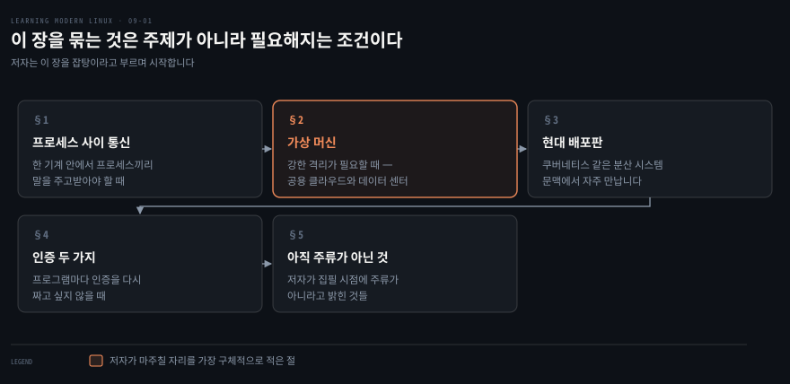
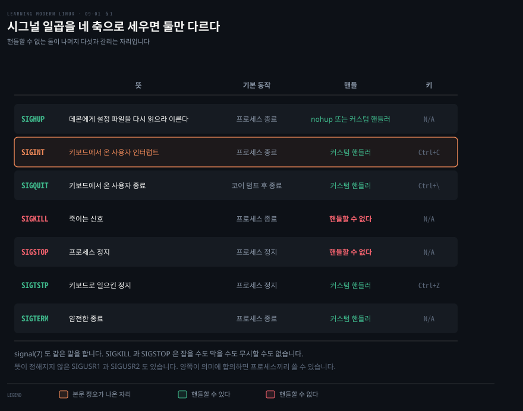
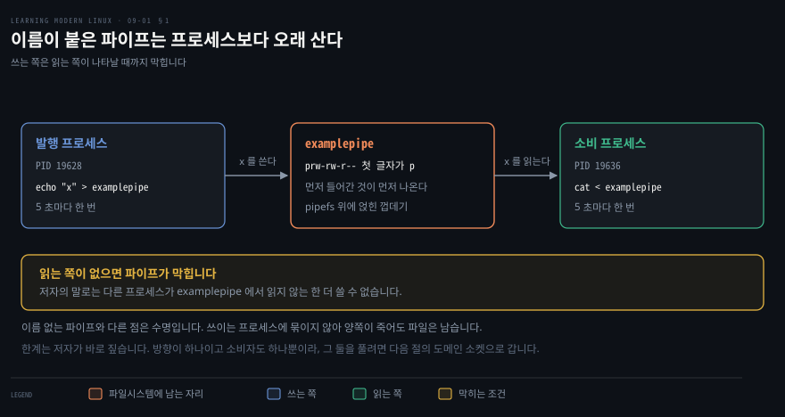
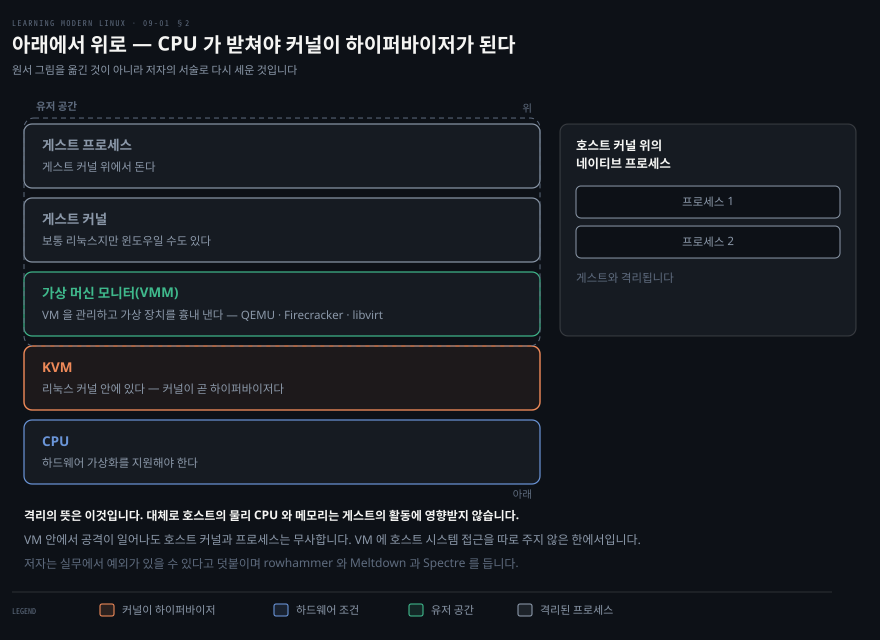
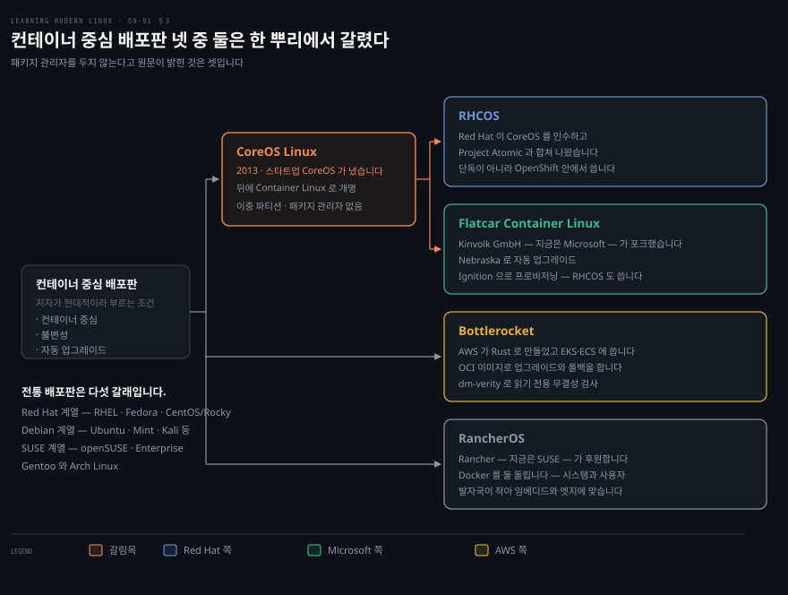
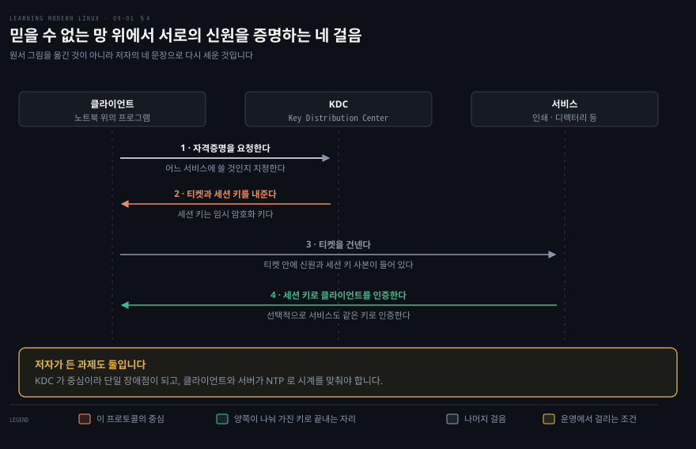

# 이 장을 묶는 것은 주제가 아니라 필요해지는 조건이다

---

> 이 책의 마지막 장입니다. 저자 스스로 잡탕이라 부르는 구간이고, 다섯 주제를 잇는 것은 내용이 아니라 각각이 언제 필요해지는가입니다.

## 핵심 요약

> 이 장이 매달린 생각은 **여기 있는 것들은 쓸 일이 생겨야 필요해진다**는 것입니다. 저자가 서두에서 직접 그렇게 적습니다.

이 장의 주제들이 공통으로 갖는 것은, 대부분 구체적인 용례가 머릿속에 있거나 업무 환경이 요구할 때에만 여러분에게 의미가 있다는 점이라고 저자는 씁니다. 그래서 이 노트의 일도 각 주제를 남김없이 설명하는 것이 아니라, 그것이 필요해지는 조건을 함께 적는 것입니다.

다섯 주제 중 둘은 앞 장들의 연장입니다. 프로세스 사이 통신은 3장의 파이프와 7장의 소켓을 한 기계 안으로 좁힌 것입니다. 인증은 4장의 접근 제어에서 인증 부분만 떼어 낸 것입니다.

나머지 셋은 새 이야기입니다. 가상 머신은 컨테이너가 주지 못하는 강한 격리를 줍니다. 현대 배포판은 시스템을 고치는 대신 새로 만듭니다. 마지막 절은 아직 주류가 아닌 것들을 모읍니다.

원문 정오는 하나 나왔는데 그 하나가 무겁습니다. 시그널 핸들러가 기본 동작 **전에** 실행된다는 서술인데, 실제로는 핸들러가 기본 동작을 **대체**합니다. `signal(7)` 과 직접 돌린 실험이 함께 그것을 가리킵니다.


## 학습 목표

> 이 장을 읽고 나면 아래 다섯 가지를 스스로 해낼 수 있습니다.

1. 시그널의 기본 동작과 핸들러의 관계를 정확히 말하고, 핸들할 수 없는 둘을 댈 수 있습니다.
2. 명명 파이프를 만들어 두 프로세스를 붙이고, 그것이 왜 막히는지 설명할 수 있습니다.
3. 가상화 스택을 아래에서 위로 쌓아 설명하고, 내 기계가 KVM 을 쓸 수 있는지 확인할 수 있습니다.
4. 컨테이너 중심 배포판 넷을 계보와 특징으로 구분할 수 있습니다.
5. Kerberos 의 네 걸음을 순서대로 설명하고 그 운영상 제약 둘을 댈 수 있습니다.

아래는 이 문서 전체를 읽는 순서로 이은 지도입니다. 칸마다 절 번호와 그 절이 언제 필요해지는지를 적었습니다.




## 이 문서가 다루지 않는 것

> 저자가 스스로 그은 선을 옮깁니다.

- IPC 전반 → 저자가 파이프와 소켓과 공유 메모리까지 긴 목록이 있다고만 밝히고, 잘 자리 잡고 널리 쓰이는 셋만 고릅니다
- 도메인 소켓의 프로그래밍 → 보통 프로그램에서 쓰는 것이라 하고, 명령줄에서는 `socat` 으로 만져 보라고만 적습니다
- KVM 위에서 실제로 VM 을 띄우는 절차 → 이 장은 스택의 구성과 가용성 확인까지입니다
- 데스크톱 배포판·임베디드·클라우드 IDE 의 실습 → 저자가 소개 수준으로만 다룹니다
- 원서 그림 9-1(가상화 아키텍처)과 그림 9-2(Kerberos 개념) → 이 노트의 도식은 그 그림을 옮긴 것이 아니라 저자의 서술 문장으로 다시 세운 것입니다


## 1. 한 기계 안에서 프로세스끼리 말하는 세 가지 방법

> 네트워크 없이 같은 기계에 있는 프로세스에게 무언가를 전하려면, 무엇을 전할지에 따라 도구가 달라집니다.

같은 기계에 있는 두 프로그램을 붙이려다 보면 대뜸 TCP 소켓을 여는 손버릇이 나옵니다. 네트워크를 거칠 이유가 없는데도 그렇습니다. 무엇을 주고받을지에 따라 훨씬 가벼운 길이 이미 셋 있습니다.

리눅스에는 프로세스 사이 통신 선택지가 긴 목록으로 있습니다. 파이프에서 소켓, 공유 메모리까지입니다. 이것이 하는 일을 저자는 셋으로 적습니다.

- 프로세스가 서로 **통신**하게 합니다
- 활동을 **동기화**하게 합니다
- 데이터를 **나누게** 합니다

실제로 쓰이는 예도 하나 듭니다. Docker 데몬이 컨테이너를 관리할 때 설정 가능한 소켓을 씁니다. 6장에서 본 컨테이너 런타임이 여기 다시 나옵니다.

### 시그널 — 커널이 프로세스를 두드리는 방법



시그널은 원래 커널이 유저 공간 프로세스에 특정 사건을 알리려고 만들어졌습니다. 프로세스로 보내는 비동기 알림이라고 생각하면 된다고 저자는 적습니다.

시그널은 아주 많고, 자세한 것은 `man 7 signal` 로 볼 수 있습니다. 대부분은 기본 동작을 하나씩 갖는데, 프로세스를 정지시키거나 종료하는 식입니다. 그리고 대부분의 시그널에서는 리눅스가 기본 동작을 하게 두는 대신 커스텀 핸들러를 정의할 수 있습니다. 정리 작업을 하고 싶거나 특정 시그널을 그냥 무시하고 싶을 때 쓸모가 있습니다.

위 도식이 저자가 익혀 두라고 꼽은 일곱입니다. 마지막 두 열이 갈리는 자리를 보면, `SIGKILL` 과 `SIGSTOP` 만 핸들할 수 없습니다. `signal(7)` 도 같은 말을 합니다. 이 둘은 잡을 수도 막을 수도 무시할 수도 없습니다.[^signal]

뜻이 정해지지 않은 시그널도 있습니다. `SIGUSR1` 과 `SIGUSR2` 인데, 양쪽이 그 시그널의 의미에 합의하기만 하면 프로세스끼리 비동기 알림을 주고받는 데 쓸 수 있습니다.

프로세스에 시그널을 보내는 전형적인 방법이 `kill` 명령입니다. 이름이 좀 이상한 것은 기본 동작이 프로세스를 종료시키는 것이기 때문이라고 저자가 덧붙입니다.

```bash
while true ; do sleep 1 ; done &
ps
kill 17030
```

```bash
[1] 17030
  PID TTY          TIME CMD
16939 pts/2    00:00:00 bash
17030 pts/2    00:00:00 bash
17041 pts/2    00:00:00 sleep
17045 pts/2    00:00:00 ps
[1]+  Terminated              while true; do sleep 1; done
```

저자가 읽는 것은 둘입니다. 셸의 작업 제어가 우리 프로그램이 작업 ID 1 번으로 배경에서 돌고 있음을 확인해 주고 PID 를 알려 줍니다. 그리고 `ps` 목록의 그 PID 가 우리 프로그램이라고 짚습니다.

> **노트의 읽기**: 저자가 설명하지 않고 넘어간 것이 그 줄의 이름입니다. `ps` 에서 PID 17030 은 `sleep` 이 아니라 `bash` 로 나옵니다. 반복문 전체가 서브셸로 떠서 그 서브셸이 우리가 죽일 대상이기 때문입니다. `sleep` 은 PID 17041 로 그 아래에서 따로 도는 별개의 프로세스이고, 매 회차마다 새로 뜹니다.

마지막으로 `kill` 은 기본으로 `SIGTERM` 을 보내고 기본 동작은 프로세스를 얌전히 종료하는 것입니다. 커스텀 핸들러를 등록하지 않았으므로 그대로 종료됩니다.

핸들러를 다는 쪽은 `trap` 입니다. 셸 환경에서 커스텀 핸들러를 정의하게 해 줍니다.

```bash
trap "echo kthxbye" SIGINT ; while true ; do sleep 1 ; done
```

```bash
^Ckthxbye
```

> **원문 정오**: 저자는 이 예제를 설명하며 사용자가 Ctrl+C 를 누르면 "리눅스가 **기본 동작(종료) 전에** `echo kthxbye` 를 실행해야 한다(Linux should execute echo kthxbye before the default action (terminate))" 고 적습니다. 핸들러는 기본 동작 앞에 끼어드는 것이 아니라 기본 동작을 **대체**합니다. `signal(7)` 은 프로세스가 셋 중 **하나를** 고른다고 적습니다. 기본 동작을 수행하거나, 시그널을 무시하거나, 핸들러로 잡는 것입니다.[^signal] 그래서 핸들러를 달면 그 시그널의 기본 동작은 일어나지 않습니다.
>
> 이것은 해석이 갈리는 자리도 아닙니다. 저자가 같은 절 앞에서 이미 옳게 적었기 때문입니다. "대부분의 시그널에서는 리눅스가 **기본 동작을 이어 가게 두는 대신** 커스텀 핸들러를 정의합니다(With most signals, you define a custom handler, rather than letting Linux carry on with the default action)." 두 문장이 서로를 반박합니다.

직접 재어 보면 분명합니다. 자동으로 무시되지 않는 `SIGTERM` 으로 같은 구조를 두 번 돌려 비교했습니다.

```bash
bash -c 'trap "echo TRAP-RAN" SIGTERM; while true; do sleep 0.2; done' &
kill -TERM $!
```

```bash
TRAP-RAN
LOOP-FINISHED
종료상태=0
```

핸들러가 실행된 뒤 반복문이 계속 돌아 정상 종료했습니다. 같은 코드에서 `trap` 만 빼면 종료상태가 143 으로 나옵니다. 128 에 `SIGTERM` 의 번호 15 를 더한 값이며, 기본 동작이 프로세스를 죽였다는 뜻입니다.

원서의 출력이 `^Ckthxbye` 에서 끝나는 것이 오해를 부릅니다. 지면이 거기서 멈춘 것이지 반복문이 끝난 것이 아닙니다. 핸들러를 단 채로는 반복문이 계속 돌기 때문에, 저 화면에서 프롬프트로 돌아가려면 Ctrl+C 를 더 누르거나 다른 방법으로 끝내야 합니다.

이 차이가 실무에서 갈리는 지점은 종료 처리입니다. `SIGTERM` 에 정리 핸들러를 달았다면 그 핸들러가 끝난 뒤 프로세스를 직접 종료시켜야 합니다. 핸들러만 달아 두면 프로세스는 계속 삽니다.

> **노트의 읽기**: 표의 `SIGHUP` 행에 저자가 적은 뜻은 "데몬에게 설정 파일을 다시 읽으라 이른다" 입니다. 그것은 널리 쓰이는 관례이고 시그널 자체의 정의는 아닙니다. `signal(7)` 이 적는 뜻은 제어 터미널에서 끊김이 감지되었거나 제어 프로세스가 죽었다는 것입니다.[^signal] 기본 동작이 종료인 이유가 그쪽에 있습니다.
>
> 저자의 표 안에도 그 흔적이 남아 있습니다. 같은 행의 핸들 칸이 `nohup` 을 듭니다. 그 도구의 이름 자체가 hangup 을 뜻하며, 끊김에 죽지 않게 하려고 만들어진 것입니다. 정오로 세지 않은 것은 그 칸의 이름이 "Meaning" 이 아니라 실무에서 이 시그널을 쓰는 용도를 적은 자리로도 읽히기 때문입니다. 다만 정의와 관례를 구분해 두지 않으면 기본 동작이 왜 종료인지 설명할 수 없게 됩니다.

### 명명 파이프 — 이름을 붙이면 프로세스보다 오래 삽니다



3장에서 파이프(`|`)로 한 프로세스의 표준 출력을 다른 프로세스의 표준 입력에 이어 데이터를 넘기는 것을 봤습니다. 그것을 이름 없는 파이프라고 부릅니다. 여기서 한 걸음 나아간 것이 명명 파이프이고, 사용자 정의 이름을 붙일 수 있는 파이프입니다.

이름 없는 파이프와 같은 점부터 저자가 적습니다. 보통의 파일 입출력으로 다루고, 먼저 들어간 것이 먼저 나옵니다. 다른 점은 수명입니다. 명명 파이프의 수명은 그것을 쓰는 프로세스에 묶이지 않습니다. 기술적으로는 파이프를 감싼 껍데기이며 `pipefs` 라는 가짜 파일시스템을 씁니다. 5장에서 본 그 부류입니다.

```bash
mkfifo examplepipe
ls -l examplepipe
```

```bash
prw-rw-r-- 1 mh9 mh9 0 Oct  2 14:04 examplepipe
```

권한 문자열의 첫 글자가 `p` 인 것이 명명 파이프라는 표시입니다. 이제 발행 쪽과 소비 쪽을 하나씩 붙입니다.

```bash
while true ; do echo "x" > examplepipe ; sleep 5 ; done &
while true ; do cat < examplepipe ; sleep 5 ; done &
```

```bash
[1] 19628
[2] 19636
x
x
...
```

저자가 붙인 주의가 하나 있습니다. 다른 프로세스가 `examplepipe` 에서 읽지 않는 한 파이프가 막히고 더 쓸 수 없다는 것입니다. 결과로 터미널에 `x` 가 대략 5초마다 나타나는데, PID 19636 인 프로세스가 `cat` 으로 읽어 갈 수 있을 때마다 나오는 것입니다.

막히는 자리를 직접 재어 보면 저자의 말이 정확합니다.

```bash
mkfifo p1
timeout 2 bash -c "echo x > p1"
```

```bash
종료상태=124
```

`124` 는 `timeout` 이 시간이 다 되어 죽였다는 뜻입니다. 읽는 쪽을 하나 붙이고 같은 명령을 다시 치면 곧바로 `0` 으로 끝납니다. `fifo(7)` 이 그 이유를 적습니다. FIFO 는 데이터가 오가려면 읽는 쪽과 쓰는 쪽 양끝이 모두 열려야 하고, 보통은 다른 쪽이 열릴 때까지 열기 자체가 막힙니다.[^fifo]

> **노트의 읽기**: `ls -l` 의 크기가 `0` 인 것도 같은 문서가 설명합니다. FIFO 특수 파일은 파일시스템에 내용을 갖지 않고, 파일시스템의 항목은 프로세스가 이름으로 파이프에 닿게 해 주는 기준점 노릇만 합니다.[^fifo] 데이터는 커널이 안에서 넘기며 파일시스템에 쓰이지 않습니다. 이름이 파일처럼 보이지만 저장 장치를 쓰지 않는다는 뜻입니다.

저자는 한계를 바로 짚습니다. 설계 덕분에 보통 파일처럼 보이고 그렇게 다뤄지지만, 방향이 하나이고 소비자도 하나뿐이라는 제약이 있습니다.

> **노트의 읽기**: `fifo(7)` 은 FIFO 를 여러 프로세스가 읽기나 쓰기로 열 수 있다고 적습니다.[^fifo] 저자의 "소비자 하나" 와 어긋나 보이지만 실제로는 어긋나지 않습니다. 소비자 둘을 붙이고 여섯 줄을 흘려 보내는 실험을 여러 번 돌려 보면, 두 쪽이 받은 줄을 합쳐 항상 여섯이고 같은 줄이 두 번 나오지 않습니다. 여럿이 열 수는 있어도 **데이터가 복제되지 않는다**는 것이 불변인 사실입니다.
>
> 어느 쪽이 어느 줄을 받을지는 정해져 있지 않습니다. 같은 스크립트를 여섯 번 돌리니 매번 여섯 줄이 한쪽으로 몰렸는데 몰리는 쪽이 회차마다 바뀌었습니다. 그런데 이 노트를 검증하며 같은 실험을 다른 환경에서 돌린 결과는 두 쪽에 나뉘어 들어갔습니다. 어느 쪽이 맞는 것이 아니라 정해져 있지 않은 것이므로, 분배 방식을 설계의 근거로 삼으면 안 됩니다. 여럿에게 같은 내용을 보내야 한다면 애초에 파이프가 아닌 다른 것을 써야 합니다.

### 유닉스 도메인 소켓 — 양방향이고 여럿을 받습니다

7장에서 네트워크 맥락의 소켓을 봤습니다. 한 기계 안에서만 동작하는 다른 종류의 소켓도 있습니다. 그중 하나가 유닉스 도메인 소켓입니다.

저자의 정의로는 양방향이고 다방향인 통신 종단점입니다. 소비자를 여럿 둘 수 있다는 뜻입니다.

앞 절의 두 한계가 여기서 풀립니다. 그것이 저자가 이 순서로 세 가지를 놓은 이유입니다.

| 갈래 | 저자가 적은 것 |
|------|---------------|
| `SOCK_STREAM` | 스트림 지향 |
| `SOCK_DGRAM` | 데이터그램 지향 |
| `SOCK_SEQPACKET` | 순서 있는 패킷 |

주소 지정은 파일시스템 경로 이름으로 합니다. IP 주소와 포트 대신 단순한 파일 경로면 충분합니다. 7장에서 포트가 기계 안의 서비스를 가리키는 번호였다면, 여기서는 그 역할을 경로가 대신합니다.

보통은 프로그램 안에서 도메인 소켓을 쓰게 된다고 저자가 적습니다. 다만 시스템을 진단하다가 명령줄에서 소켓과 직접 주고받아야 하는 상황을 만날 수 있고, 그때 쓸 도구로 `socat` 을 듭니다. 8장에서 양방향 바이트 스트림을 세우는 도구로 이미 나온 이름입니다.

이 절이 이미 손에 잡히는 자리가 하나 있습니다. 이 절의 서두에서 저자가 든 예, 곧 Docker 데몬이 컨테이너를 관리하며 쓰는 소켓이 바로 유닉스 도메인 소켓입니다. 파일 경로로 주소를 지정한다는 성질이 `/var/run/docker.sock` 이라는 경로로 그대로 드러납니다. 컨테이너에 그 경로를 마운트해 주면 컨테이너 안에서 호스트의 Docker 를 부릴 수 있게 되는 것도, 주소가 포트가 아니라 파일이기 때문입니다.


## 2. 가상 머신은 컨테이너가 주지 않는 격리를 줍니다

> 컨테이너가 있는데 왜 아직 VM 을 쓰는가 하는 물음에, 저자는 격리의 세기가 다르다고 답합니다.



저자가 서두에서 대비를 분명히 합니다. 6장에서 본 컨테이너는 애플리케이션 수준의 의존성 관리에 좋고, VM 은 워크로드에 강한 격리를 준다는 것입니다. 둘은 같은 문제의 두 답이 아니라 다른 문제의 답입니다.

VM 을 만나는 자리도 적어 둡니다. 공용 클라우드 맥락에서 가장 자주 만나고 일반적으로는 데이터 센터에서 만납니다. 다만 로컬에서 쓰는 것도 쓸모가 있다고 덧붙이는데, 시험용이거나 분산 시스템을 흉내 낼 때입니다.

위 도식이 저자가 밑에서부터라고 밝힌 순서입니다. 맨 아래 CPU 가 하드웨어 가상화를 지원해야 합니다. 그 위에 리눅스 커널 안의 KVM 이 있습니다. 유저 공간에는 VMM 과 게스트 커널과 게스트 프로세스가 놓입니다.

VMM 은 VM 을 관리하고 QEMU 나 Firecracker 처럼 가상 장치를 흉내 냅니다. `libvirt` 도 있는데 VMM 을 표준화하려는 일반 API 를 노출하는 라이브러리입니다. 저자는 그것을 그림에 따로 그리지 않고 VMM 덩어리의 일부로 보라고 적습니다.

격리의 뜻은 이렇습니다. 호스트 커널 위에서 네이티브로 도는 프로세스들은 게스트 프로세스와 격리됩니다. 대체로 호스트의 물리 CPU 와 메모리는 게스트의 활동에 영향받지 않습니다. VM 안에서 공격이 일어나도 호스트 커널과 프로세스는 무사한데, VM 에 호스트 시스템 접근을 특별히 주지 않은 한에서입니다.

저자가 여기에 단서를 답니다. 실무에서는 예외가 있을 수 있고, rowhammer 나 Meltdown 과 Spectre 가 그 예라는 것입니다. 격리가 설계상의 보장이지 물리적 보장이 아니라는 뜻입니다.

### KVM — 커널이 곧 하이퍼바이저입니다

KVM 은 가상화 확장을 지원하는 x86 하드웨어를 위한 리눅스 고유의 가상화 해법입니다. AMD-V 나 Intel VT 가 그 확장입니다.

커널 모듈은 두 부분입니다. 핵심 모듈 `kvm.ko` 와 CPU 아키텍처별 모듈 `kvm-intel.ko` 또는 `kvm-amd.ko` 입니다. 여기서 저자가 짚는 한 문장이 이 절의 핵심입니다. KVM 에서는 리눅스 커널이 곧 하이퍼바이저이고 무거운 일의 대부분을 커널이 맡습니다. 그 위에 입출력 가상화를 가능하게 하는 Virtio 같은 드라이버가 붙습니다.

요즘 하드웨어는 대개 가상화를 지원하고 KVM 도 이미 있지만, 내 시스템이 쓸 수 있는지 확인하는 방법을 저자가 둘로 보입니다.

```bash
grep 'svm\|vmx' /proc/cpuinfo
lsmod | grep kvm
```

```bash
flags        : fpu vme de pse tsc msr pae mce cx8 apic sep mtrr pge mca
pat pse36 clflush dts acpi mmx fxsr sse sse2 ss ht tm pbe syscall nx pdpe1
... ds_cpl vmx tm2 ssse3 sdbg cx16 xtpr pdcm sse4_1 sse4_2 x2apic movbe popcnt
...
kvm_intel   253952  0
kvm         659456  1 kvm_intel
```

첫 명령은 CPU 정보에서 `svm` 이나 `vmx` 를 찾습니다. CPU 마다 보고하므로 코어가 여덟이면 같은 `flags` 덩어리가 여덟 번 나온다고 저자가 덧붙입니다. 위 출력에 `vmx` 가 있으니 하드웨어 보조 가상화는 문제가 없습니다.

두 번째 명령은 KVM 커널 모듈이 올라와 있는지 봅니다. 저자가 여기서 읽는 것은 한 가지입니다. `kvm_intel` 모듈이 올라와 있으니 KVM 을 쓸 준비가 끝났다는 것입니다. `flags` 줄이 중간에 끊긴 것은 원서가 지면 폭에 맞춰 자른 자리라 그대로 두었습니다.

> **노트의 읽기**: 저자가 설명하지 않은 열이 하나 있습니다. `lsmod` 의 셋째 열은 그 모듈을 쓰고 있는 것의 수이고, 이어지는 이름은 누가 쓰는지입니다. 그래서 `kvm` 행의 `1 kvm_intel` 은 `kvm` 을 쓰는 것이 하나이며 그것이 `kvm_intel` 이라는 뜻입니다. `kvm_intel` 행의 `0` 은 그 모듈을 쓰는 것이 아직 없다는 뜻이고, VM 을 띄우면 그 수가 올라갑니다. 핵심 모듈과 아키텍처별 모듈이 어떻게 얹혀 있는지가 이 두 줄에 그대로 보입니다.

### Firecracker — microVM 을 HTTP 로 다룹니다

Firecracker 는 KVM 인스턴스를 관리할 수 있는 VMM 입니다. Rust 로 쓰였고 Amazon Web Services 에서 주로 서버리스 제품을 위해 개발했습니다. AWS Lambda 와 AWS Fargate 가 그 제품입니다.

설계 목표는 같은 물리 기계에서 여러 테넌트의 워크로드를 안전하게 돌리는 것입니다. Firecracker VMM 이 관리하는 것을 microVM 이라 부르는데, 호스트에 HTTP API 를 드러내어 microVM 을 띄우고 조회하고 멈출 수 있게 합니다.

장치를 다루는 방식도 적어 둡니다. 네트워크 인터페이스는 호스트의 TUN/TAP 장치로 흉내 내고, 블록 장치는 호스트의 파일이 뒤를 받치며 Virtio 장치를 지원합니다.

보안과 관측 쪽에도 앞 장들의 이름이 돌아옵니다. 지금까지 이야기한 가상화에 더해 Firecracker 는 기본으로 seccomp 필터를 써서 자신이 쓸 수 있는 호스트 시스템 콜을 제한합니다. 4장에서 본 그 seccomp 입니다. cgroups 도 함께 쓸 수 있습니다. 관측 쪽에서는 Firecracker 에서 로그와 메트릭을 모을 수 있는데, 그 통로가 이 장 §1 의 명명 파이프입니다.


## 3. 현대 배포판은 고치지 않고 새로 만듭니다

> 기계 한 대를 손보는 일과 수백 대를 손보는 일은 다른 문제이고, 그 차이가 배포판의 설계를 바꿨습니다.



컨테이너가 늘면서 호스트 운영체제의 역할이 바뀌었다고 저자가 적습니다. 컨테이너 맥락에서 전통적인 패키지 관리자는 다른 역할을 맡습니다. 대부분의 베이스 컨테이너 이미지가 특정 리눅스 배포판에서 만들어지고 그 안의 의존성은 `.deb` 나 `.rpm` 으로 채워지는데, 그 위에 애플리케이션 수준 의존성을 컨테이너 이미지가 통째로 싸는 구조입니다.

그다음이 이 절의 논지입니다. 시스템을 조금씩 고쳐 나가는 일이 큰 도전이 된다는 것이며, 규모가 커질수록 특히 그렇습니다. 기계 무리를 관리해야 할 때가 그런 경우입니다.

그래서 현대 배포판의 초점이 점점 불변성으로 옮겨 갑니다. 설정이나 코드에 어떤 변경이든 생기면 그것이 새 산출물을 만들게 한다는 발상입니다. 보안 문제를 고치는 패치나 새 기능을 생각하면 됩니다. 새로 만들어진 컨테이너 이미지가 뜨는 것이지 돌고 있는 시스템을 바꾸는 것이 아닙니다.

저자가 "현대 배포판" 이라 말할 때의 뜻도 못 박습니다. 컨테이너 중심이고, 불변성과 자동 업그레이드를 앞세운 배포판입니다. 자동 업그레이드는 Chrome 이 개척했다고 덧붙입니다.

전통 배포판도 나쁠 것이 없다고 먼저 적어 둡니다. 필요와 취향에 따라 설치부터 패치까지 전부 직접 챙기며 완전히 통제하는 쪽과, 대부분의 일을 배포판이 대신해 주는 완전 관리형 사이에서 고르면 됩니다.

| 배포판 | 누가 | 앱을 올리는 방식 | 눈에 띄는 점 |
|--------|------|-----------------|-------------|
| RHCOS | Red Hat | 컨테이너 | 단독으로 쓰라고 만든 것이 아니라 OpenShift Container Platform 안에서 씁니다 |
| Flatcar Container Linux | Kinvolk GmbH, 지금은 Microsoft | 컨테이너 | Nebraska 로 자동 업그레이드하고 Ignition 으로 부팅 장치를 세밀하게 제어합니다 |
| Bottlerocket | AWS | OCI 이미지 | `dm-verity` 기반의 대체로 읽기 전용인 무결성 검사 파일시스템을 씁니다 |
| RancherOS | Rancher, 지금은 SUSE | Docker 컨테이너 | Docker 를 둘 돌립니다. 첫 프로세스로 뜨는 시스템 Docker 와 앱을 만드는 사용자 Docker 입니다 |

공통점 하나가 눈에 띕니다. 저자가 패키지 관리자를 두지 않는다고 **직접 적은 것은 셋**입니다. CoreOS Linux 가 처음부터 그랬습니다. Flatcar 는 그 전통을 이어 모든 것을 컨테이너로 돌립니다. Bottlerocket 은 패키지 관리자 대신 OCI 이미지 기반 모델로 업그레이드와 롤백을 합니다.

> **노트의 읽기**: 나머지 둘에는 그런 서술이 없습니다. RHCOS 와 RancherOS 를 두고 저자는 패키지 관리자를 언급하지 않습니다. 넷 전부가 그렇다고 넘겨짚기 쉬운 자리인데, RHCOS 는 실제로 `rpm-ostree` 를 쓰므로 넘겨짚으면 틀립니다. 이 노트도 처음 쓸 때 넷으로 적었다가 원문을 다시 세어 셋으로 고쳤습니다.

Bottlerocket 에 저자가 붙인 접근 이야기도 옮길 만합니다. 접근해서 제어하려면 별도의 `containerd` 인스턴스에서 도는 제어 컨테이너를 씁니다. SSH 로도 되지만 권장하지는 않는다고 적습니다.

계보에서 갈림목은 Container Linux 하나입니다. 2013년 CoreOS 라는 신생 기업이 CoreOS Linux 를 내놓았고 나중에 Container Linux 로 이름을 바꿨습니다. 주요 기능은 시스템 업데이트를 위한 이중 파티션 구조와 패키지 관리자의 부재였습니다. 그 생태계에서 나온 도구 중 지금도 쓰이는 것으로 저자는 `etcd` 를 꼽는데, 설정 작업을 위한 `/etc` 디렉터리의 분산 버전이라 생각하면 된다고 설명합니다.

Red Hat 이 CoreOS 를 인수한 뒤 CoreOS Linux 를 자사의 Project Atomic 과 합치겠다고 밝혔고, 그 합병이 RHCOS 로 이어졌습니다. 그 발표 조금 뒤에 독일 스타트업 Kinvolk GmbH 가 Container Linux 를 포크해 Flatcar Container Linux 라는 새 이름으로 계속 개발하겠다고 알렸습니다.


## 4. 인증을 프로그램 밖으로 빼는 두 방법

> 프로그램마다 인증을 따로 짜면 인증 방식이 바뀔 때마다 모든 프로그램을 고쳐야 합니다.



인증 코드를 프로그램 안에 직접 짜 두면 인증 방식이 바뀌는 날 프로그램을 전부 다시 건드려야 합니다. LDAP 을 붙이라는 요구가 오면 어디를 고쳐야 할지부터 세어 보게 됩니다.

4장에서 접근 제어 장치를 여럿 봤습니다. 인증은 사용자의 신원을 확인하는 일이고 어떤 종류의 인가에도 앞서는 전제 조건이라는 구분도 거기서 세웠습니다. 이 절은 그중 인증 쪽에서 널리 쓰이는 도구 둘을 짧게 다룹니다.

### Kerberos — 티켓과 세션 키로 도는 네 걸음

Kerberos 는 매사추세츠 공과대학교가 1980년대에 개발한 인증 모음입니다. 오늘날에는 RFC 4120 과 관련 IETF 문서에 형식적으로 규정되어 있습니다.[^rfc4120]

핵심 발상을 저자가 한 문장으로 적습니다. 우리는 대개 안전하지 않은 망을 상대하지만, 클라이언트와 서비스가 서로에게 신원을 증명할 안전한 방법을 원한다는 것입니다.

위 도식의 네 걸음이 저자가 번호로 적은 그대로입니다.

1. 클라이언트가 Key Distribution Center 라는 Kerberos 구성요소에 특정 서비스에 쓸 자격증명을 요청합니다.
2. KDC 가 그 서비스용 티켓과 임시 암호화 키를 함께 내줍니다. 그 임시 키가 세션 키입니다.
3. 클라이언트가 티켓을 서비스에 건넵니다. 티켓 안에는 클라이언트의 신원과 세션 키의 사본이 들어 있습니다.
4. 클라이언트와 서비스가 나눠 가진 세션 키로 클라이언트를 인증합니다. 선택적으로 서비스도 같은 키로 인증할 수 있습니다.

저자가 과제도 둘 듭니다. KDC 가 중심 역할을 맡는다는 점이 단일 장애점이 되고, 시간 요구가 엄격해 클라이언트와 서버가 NTP 로 시계를 맞춰야 합니다. 7장에서 NTP 를 애플리케이션 계층 프로토콜로 본 것이 여기서 운영 조건으로 돌아옵니다.

> **노트의 읽기**: 규격이 요구하는 것은 NTP 가 아니라 느슨한 동기화입니다. RFC 4120 은 인증이 서버의 현재 시각에 기반한다고 하면서 괄호 안에 "시계가 느슨하게 동기화되어 있어야 한다(clocks MUST be loosely synchronized)" 라고만 적습니다.[^rfc4120] 문서 어디에서도 NTP 를 지정하지 않고, 오히려 시계 오차를 보정할 때는 시스템 시계를 직접 바꾸는 대신 정해진 기법을 써야 한다고 못 박습니다. NTP 는 그 요구를 채우는 흔한 수단이지 규격이 요구한 프로토콜이 아닙니다.

총평도 균형이 잡혀 있습니다. 운영하고 관리하기가 간단하지는 않지만, Kerberos 는 기업과 클라우드 제공자에서 널리 쓰이고 지원됩니다.

### PAM — 인증 방식을 프로그램 밖에서 갈아 끼웁니다

역사적으로 프로그램은 사용자 인증 과정을 스스로 관리했습니다. PAM 과 함께 구체적인 인증 방식과 무관하게 프로그램을 개발하는 유연한 길이 리눅스에 들어왔다고 저자는 적습니다.

구조는 모듈식입니다. 개발자에게는 PAM 과 연결할 강력한 라이브러리를 주고, 시스템 관리자에게는 서로 다른 모듈을 꽂아 넣을 수 있게 합니다.

| 모듈 | 하는 일 |
|------|--------|
| `pam_localuser` | 사용자가 `/etc/passwd` 에 있을 것을 요구합니다 |
| `pam_keyinit` | 세션 키링을 위한 것입니다 |
| `pam_krb5` | Kerberos 5 의 비밀번호 기반 검사를 위한 것입니다 |

마지막 줄이 앞 절과 이어집니다. Kerberos 를 쓰기로 했다면 프로그램을 고치는 것이 아니라 PAM 설정에 모듈 하나를 꽂는 것으로 끝납니다. 그것이 인증을 프로그램 밖으로 뺀다는 말의 실제 모습입니다.

> **노트의 읽기**: 저자는 PAM 이 "1990년대 말부터 더 넓은 유닉스 생태계에 있어 왔다" 고 적습니다. 시기가 그보다 조금 이릅니다. Linux-PAM 프로젝트 자신의 문서가 근거로 드는 것은 1995년 10월의 DCE-RFC 86.0 이고, 그 제안을 낸 Sun Microsystems 에 감사를 표합니다.[^pam] "1990년대 말" 이 널리 퍼진 시점을 가리킨 것일 수는 있지만, 규격 자체는 1990년대 중반의 것입니다.


## 5. 아직 주류가 아닌 것들

> 저자가 집필 시점에 주류가 아니라고 명시한 구간입니다. 지금 배울 것이 아니라 지켜볼 것으로 읽는 편이 맞습니다.

이 절의 항목들이 공통으로 갖는 것은 집필 시점에 아직 주류에 들어오지 않았다는 점이라고 저자가 먼저 밝힙니다. 앞으로의 전개가 궁금하거나 리눅스에 아직 성장 여지가 큰 곳이 어디인지 궁금하다면 읽어 보라는 조건도 함께 답니다.

**NixOS** 는 소스 기반 배포판이고 패키지 관리와 시스템 설정에 함수형 접근을 취하며 업그레이드의 롤백도 그렇게 다룹니다. 함수형이라 부르는 이유를 저자가 밝히는데, 산출물이 불변성에 기반하기 때문입니다. Nix 패키지 관리자가 커널부터 시스템 패키지와 앱까지 운영체제 전체를 빌드하고, 다중 사용자 패키지 관리와 같은 패키지의 여러 버전 설치를 허용합니다.

한 가지 대가도 적혀 있습니다. 대부분의 다른 배포판과 달리 NixOS 는 5장에서 본 표준 파일시스템 배치를 따르지 않습니다. 시스템 프로그램이 `/usr/bin` 이나 `/usr/lib` 에 있고 설정이 대개 `/etc` 에 있는 그 배치입니다. 다 받아들이고 싶지 않다면 Nix 패키지 관리자만 따로 쓸 수도 있고, CI 파이프라인에 특히 쓸모가 있다고 덧붙입니다.

**데스크톱 리눅스** 쪽에서는 구조를 짚습니다. 유닉스 전통대로 GUI 부분이 나머지 운영체제와 분리되어 있습니다. 보통 X 윈도 관리자가 디스플레이 관리자의 도움을 받아 창 관리부터 스타일과 렌더링까지 GUI 책임을 맡습니다. 그 위에 아이콘과 위젯과 툴바 같은 데스크톱 경험을 구현하는 데스크톱 환경이 앉는데, KDE 나 MATE 가 그 예입니다. 저자가 촉매로 꼽는 것은 뜻밖의 방향입니다. Windows 11 이 그래픽 리눅스 앱을 기본으로 돌릴 수 있게 되면서 유인과 채택이 바뀔지도 모른다는 것입니다.

**임베디드 시스템** 은 자동차부터 라우터 같은 네트워크 장비, 냉장고 같은 스마트 홈 기기, 미디어 기기와 스마트 TV 까지 넓은 분야입니다. 적은 돈으로 구할 수 있는 범용 플랫폼으로 저자는 라즈베리 파이를 듭니다. Debian 기반의 Raspberry Pi OS 를 갖고 있으며 microSD 카드로 다른 배포판도 간단히 설치할 수 있습니다. 범용 입출력 핀이 여럿 있어 브레드보드로 외부 센서와 회로를 붙이기 쉽고, 파이썬 같은 것으로 하드웨어를 프로그래밍하며 전자 회로를 배울 수 있습니다.

**클라우드 IDE** 는 최근 몇 년간 크게 진전했습니다. IDE 와 Git 과 여러 프로그래밍 언어를 리눅스 환경에 묶은 상용 제품이 나올 정도가 되었습니다. IDE 는 대개 Visual Studio Code 입니다. 개발자에게 필요한 것은 웹 브라우저와 네트워크 접근뿐입니다. 코드를 클라우드에서 편집하고 시험하고 돌립니다. 저자가 꼽은 두 예는 Gitpod 과 Codespaces 입니다. 앞의 것은 관리형으로도 오픈 소스 자체 호스팅으로도 쓸 수 있고, 뒤의 것은 GitHub 에 깊이 통합되어 있습니다.


## 심화 학습

> 책 밖으로 나가 확인한 것만 모읍니다. 각 항목의 근거는 각주의 1차 자료이거나 이 노트가 직접 돌린 실험입니다.

**시그널 배치는 프로세스마다 하나뿐입니다.** `signal(7)` 은 배치(disposition)를 프로세스 단위 속성이라 적고, 다중 스레드 애플리케이션에서 특정 시그널의 배치는 모든 스레드에서 같다고 못 박습니다.[^signal] 그래서 스레드마다 다른 핸들러를 다는 설계는 성립하지 않습니다. 자바 애플리케이션에서 종료 훅이 프로세스 단위인 이유도 결국 여기 닿습니다.

**`execve` 는 핸들러를 초기화하지만 무시는 남깁니다.** 같은 문서가 적기를, `fork` 로 만든 자식은 부모의 시그널 배치 사본을 물려받고, `execve` 중에는 핸들되던 시그널의 배치가 기본으로 되돌아가되 무시되던 시그널의 배치는 그대로 남습니다.[^signal] 셸 스크립트에서 `trap` 을 걸어 두고 다른 프로그램을 실행하면 그 핸들러가 따라가지 않는 이유가 이것입니다.

**Kerberos 규격은 앞선 것을 폐기했습니다.** RFC 4120 은 표지에 `Obsoletes: 1510` 이라 적고 2005년 7월에 나왔습니다. 제목은 "The Kerberos Network Authentication Service (V5)" 이고 저자는 USC-ISI 의 C. Neuman 과 MIT 의 세 사람입니다.[^rfc4120] 저자가 1980년대 MIT 라고 말한 뿌리가 규격 문서의 소속에도 남아 있습니다.


## 결정 치트시트

> 이 장의 다섯 주제가 각각 언제 필요해지는지를 한 표로 압축합니다. 조건은 저자가 밝힌 것만 옮겼습니다.

| 상황 | 고를 것 | 왜 |
|------|--------|-----|
| 돌고 있는 프로세스에 사건만 알리면 된다 | 시그널 | 데이터를 나르지 않고 알림만 보냅니다 |
| 종료 시 정리 작업을 하고 싶다 | `SIGTERM` 에 핸들러 | 단 핸들러가 기본 동작을 대체하므로 직접 끝내야 합니다 |
| 어떤 경우에도 확실히 죽여야 한다 | `SIGKILL` | 잡을 수도 막을 수도 무시할 수도 없습니다 |
| 두 프로세스가 데이터를 흘려보낸다 | 명명 파이프 | 파일처럼 다루고 프로세스보다 오래 삽니다 |
| 양방향이거나 소비자가 여럿이다 | 유닉스 도메인 소켓 | 파이프의 두 한계가 여기서 풀립니다 |
| 워크로드를 강하게 격리해야 한다 | VM | 컨테이너의 의존성 관리와는 다른 문제입니다 |
| 여러 테넌트를 한 기계에서 돌린다 | Firecracker microVM | 그 목적으로 설계됐고 seccomp 를 기본으로 씁니다 |
| 기계 무리를 관리한다 | 컨테이너 중심 배포판 | 조금씩 고치는 일이 규모에서 무너집니다 |
| 인증 방식이 바뀔 수 있다 | PAM | 프로그램을 고치지 않고 모듈을 갈아 끼웁니다 |
| 기업망에서 신원을 증명해야 한다 | Kerberos | 단 KDC 의 단일 장애점과 NTP 동기화를 감수합니다 |


## 적용 관점

> 이 절은 전부 **원서 범위 밖의 노트의 읽기**입니다. 저자는 Spring 도 자바도 다루지 않으며, 아래는 이 장의 원칙을 그 문맥에 옮겨 본 것입니다.

**컨테이너의 종료는 시그널로 옵니다.** 오케스트레이터가 파드를 내릴 때 보내는 것이 `SIGTERM` 이고, 유예 시간이 지나면 `SIGKILL` 입니다. §1 의 정오가 여기서 실무 규칙이 됩니다. 종료 훅을 달았다고 프로세스가 알아서 끝나지 않으므로, 정리 작업을 마친 뒤 실제로 종료하는 경로가 있어야 합니다. 그리고 `SIGKILL` 은 잡을 수 없으니 유예 시간 안에 끝내는 것이 유일한 방법입니다.

**애플리케이션 이미지를 고치지 말고 새로 만듭니다.** §3 의 불변성이 배포판이 아니라 애플리케이션 층에도 그대로 적용됩니다. 돌고 있는 컨테이너에 들어가 설정 파일을 고치면 다음 재배포에서 사라지고, 왜 두 인스턴스가 다르게 도는지 아무도 설명할 수 없게 됩니다. 변경은 이미지 태그를 바꾸는 것으로 표현합니다.

**인증은 애플리케이션 밖으로 뺄수록 바꾸기 쉽습니다.** PAM 이 유닉스에서 한 일을, Spring Security 의 인증 공급자 추상이 애플리케이션 안에서 합니다. 인증 방식이 바뀔 때 고치는 자리를 한 곳으로 모아 두는 것이 두 설계의 공통 목적입니다.

**로컬에서 분산 시스템을 흉내 낼 때 VM 과 컨테이너를 가릅니다.** 저자가 로컬 VM 의 쓸모로 든 것이 시험과 분산 시스템 흉내입니다. 커널 수준의 동작을 보아야 하거나 노드마다 다른 커널이 필요하면 VM 이고, 애플리케이션 사이의 통신만 보면 되면 컨테이너로 충분합니다.

**`/var/run/docker.sock` 을 마운트하는 일의 무게가 §1 에서 나옵니다.** Testcontainers 로 통합 테스트를 돌리려면 그 경로를 컨테이너에 넘겨야 합니다. 도메인 소켓의 주소가 파일 경로라는 성질 덕분에 마운트 한 줄로 되는 것인데, 같은 이유로 그 소켓을 얻은 쪽은 호스트의 Docker 를 사실상 전부 부릴 수 있습니다. 파일 권한 말고는 그 사이에 막는 것이 없습니다.


## 면접에서 받을 만한 질문

1. 시그널에 커스텀 핸들러를 달면 기본 동작은 어떻게 됩니까. 근거는 무엇입니까.
2. 핸들할 수 없는 시그널은 무엇이고 그것이 운영에서 뜻하는 바는 무엇입니까.
3. 이름 없는 파이프와 명명 파이프의 결정적인 차이는 무엇입니까.
4. 명명 파이프에 쓰는데 아무 일도 일어나지 않고 멈춰 있습니다. 무엇을 의심해야 합니까.
5. 컨테이너가 있는데 VM 을 쓰는 이유를 저자의 대비로 설명해 보십시오.
6. KVM 에서 하이퍼바이저 역할을 하는 것은 무엇입니까.
7. 현대 배포판이 말하는 불변성이란 무엇이고 왜 규모에서 중요해집니까.
8. Kerberos 의 두 가지 운영상 제약을 대 보십시오.


## 정답 (자답 후 펼치기)

<details>
<summary>펼쳐 보기</summary>

1. 기본 동작은 일어나지 않습니다. 핸들러가 기본 동작을 대체합니다. `signal(7)` 은 프로세스가 셋 중 하나를 고른다고 적습니다. 기본 동작을 수행하거나, 무시하거나, 핸들러로 잡는 것입니다. 원서는 핸들러가 기본 동작 전에 실행된다고 적었지만 그렇지 않습니다.

2. `SIGKILL` 과 `SIGSTOP` 입니다. 잡을 수도 막을 수도 무시할 수도 없습니다. 운영에서 뜻하는 바는 두 방향입니다. 확실히 죽여야 할 때 쓸 수 있는 마지막 수단이라는 것과, 그 시그널을 받은 프로세스는 정리 작업을 할 기회가 전혀 없다는 것입니다.

3. 수명입니다. 이름 없는 파이프는 그것을 쓰는 프로세스에 수명이 묶이지만, 명명 파이프는 묶이지 않습니다. 파일시스템에 항목이 남아 있어 양쪽 프로세스가 죽어도 그대로 있습니다. 이름이 있어 서로 모르는 프로세스끼리 붙을 수 있다는 것도 여기서 나옵니다.

4. 읽는 쪽이 없는 것을 의심합니다. `fifo(7)` 은 FIFO 가 데이터를 넘기려면 양끝이 모두 열려야 하고 보통은 다른 쪽이 열릴 때까지 열기 자체가 막힌다고 적습니다. 저자도 같은 주의를 답니다. 다른 프로세스가 읽지 않는 한 파이프가 막혀 더 쓸 수 없습니다.

5. 목적이 다릅니다. 저자의 대비로는 컨테이너가 애플리케이션 수준의 의존성 관리에 좋고 VM 은 워크로드에 강한 격리를 줍니다. 격리의 뜻은 호스트의 물리 CPU 와 메모리가 게스트의 활동에 대체로 영향받지 않는다는 것이며, VM 안에서 공격이 나도 호스트는 무사합니다. 다만 rowhammer 나 Meltdown 과 Spectre 같은 예외가 실무에 있습니다.

6. 리눅스 커널 자신입니다. KVM 에서는 커널이 하이퍼바이저이고 무거운 일의 대부분을 맡습니다. 커널 모듈은 핵심 모듈 `kvm.ko` 와 아키텍처별 모듈 `kvm-intel.ko` 또는 `kvm-amd.ko` 로 나뉩니다.

7. 설정이나 코드의 어떤 변경이든 돌고 있는 시스템을 바꾸는 대신 새 산출물을 만들게 하는 것입니다. 규모에서 중요해지는 이유는 조금씩 고쳐 나가는 방식이 기계 무리를 관리할 때 무너지기 때문입니다. 기계마다 고쳐 온 이력이 달라지면 같은 상태를 보장할 수 없습니다.

8. KDC 가 중심 역할을 맡아 단일 장애점이 된다는 것과, 시간 요구가 엄격해 클라이언트와 서버가 NTP 로 시계를 맞춰야 한다는 것입니다.

</details>


## 핵심 개념 체크리스트

- [ ] 시그널의 배치 세 가지를 대고 핸들러가 기본 동작과 어떤 관계인지 말할 수 있는가?
- [ ] `SIGTERM` 과 `SIGKILL` 의 차이를 종료 처리 관점에서 설명할 수 있는가?
- [ ] `mkfifo` 로 파이프를 만들고 `ls -l` 에서 무엇을 확인해야 하는지 아는가?
- [ ] 명명 파이프가 막히는 조건과 그것을 푸는 방법을 말할 수 있는가?
- [ ] 유닉스 도메인 소켓이 파이프의 어떤 한계를 푸는지 설명할 수 있는가?
- [ ] 가상화 스택 다섯 층을 아래에서 위로 댈 수 있는가?
- [ ] 내 기계가 KVM 을 쓸 수 있는지 두 명령으로 확인할 수 있는가?
- [ ] 컨테이너 중심 배포판 넷을 만든 곳과 특징으로 구분할 수 있는가?
- [ ] 불변성이 규모에서 왜 중요해지는지 한 문장으로 말할 수 있는가?
- [ ] Kerberos 의 네 걸음을 순서대로 재현할 수 있는가?
- [ ] PAM 이 무엇을 프로그램 밖으로 빼는지 설명할 수 있는가?


## 관련 문서

- [8장 둘째 편 — 자원마다 창이 따로 나 있어 어느 창을 여느냐가 곧 진단이다](./08-02.%EC%9E%90%EC%9B%90%EB%A7%88%EB%8B%A4%20%EC%B0%BD%EC%9D%B4%20%EB%94%B0%EB%A1%9C%20%EB%82%98%20%EC%9E%88%EC%96%B4%20%EC%96%B4%EB%8A%90%20%EC%B0%BD%EC%9D%84%20%EC%97%AC%EB%8A%90%EB%83%90%EA%B0%80%20%EA%B3%A7%20%EC%A7%84%EB%8B%A8%EC%9D%B4%EB%8B%A4.md) — `socat` 과 관측이 이 장에서 다시 쓰입니다
- [6장 둘째 편 — 컨테이너의 새로움은 재료가 아니라 조합에 있다](./06-02.%EC%BB%A8%ED%85%8C%EC%9D%B4%EB%84%88%EC%9D%98%20%EC%83%88%EB%A1%9C%EC%9B%80%EC%9D%80%20%EC%9E%AC%EB%A3%8C%EA%B0%80%20%EC%95%84%EB%8B%88%EB%9D%BC%20%EC%A1%B0%ED%95%A9%EC%97%90%20%EC%9E%88%EB%8B%A4.md) — VM 과 대비되는 컨테이너의 격리와 cgroups
- [5장 — 모든 것이 파일이라는 말은 손잡이가 하나라는 뜻이다](./05-01.%EB%AA%A8%EB%93%A0%20%EA%B2%83%EC%9D%B4%20%ED%8C%8C%EC%9D%BC%EC%9D%B4%EB%9D%BC%EB%8A%94%20%EB%A7%90%EC%9D%80%20%EC%86%90%EC%9E%A1%EC%9D%B4%EA%B0%80%20%ED%95%98%EB%82%98%EB%9D%BC%EB%8A%94%20%EB%9C%BB%EC%9D%B4%EB%8B%A4.md) — `pipefs` 같은 가짜 파일시스템과 표준 파일시스템 배치
- [4장 — 전부 아니면 전무에서 잘게 쪼개는 쪽으로](./04-01.%EC%A0%84%EB%B6%80%20%EC%95%84%EB%8B%88%EB%A9%B4%20%EC%A0%84%EB%AC%B4%EC%97%90%EC%84%9C%20%EC%9E%98%EA%B2%8C%20%EC%AA%BC%EA%B0%9C%EB%8A%94%20%EC%AA%BD%EC%9C%BC%EB%A1%9C.md) — 인증과 인가의 구분, Firecracker 가 쓰는 seccomp
- [3장 첫 편 — 셸의 실체는 스트림과 변수와 종료 상태다](./03-01.%EC%85%B8%EC%9D%98%20%EC%8B%A4%EC%B2%B4%EB%8A%94%20%EC%8A%A4%ED%8A%B8%EB%A6%BC%EA%B3%BC%20%EB%B3%80%EC%88%98%EC%99%80%20%EC%A2%85%EB%A3%8C%20%EC%83%81%ED%83%9C%EB%8B%A4.md) — 이름 없는 파이프와 스트림
- [Learning Modern Linux 정독 인덱스](./README.md) — 이 책의 MOC


## 참고 자료

- 원서: 《Learning Modern Linux》 Michael Hausenblas, O'Reilly Media, 2022. ISBN 978-1-098-10894-6
- [RFC 4120 — The Kerberos Network Authentication Service (V5)](https://www.rfc-editor.org/rfc/rfc4120.txt) — Kerberos 규격의 1차 자료
- [Linux-PAM](https://github.com/linux-pam/linux-pam) — PAM 의 유래를 프로젝트 자신이 밝힌 곳
- [Firecracker](https://firecracker-microvm.github.io/) — 저자가 이 장에서 소개한 VMM
- `signal(7)` 과 `fifo(7)` — 이 노트의 정오 판정과 실험 해석은 여기서 확인했습니다

[^signal]: `signal(7)`. "Each signal has a current disposition, which determines how the process behaves when it is delivered the signal." · "Using these system calls, a process can elect one of the following behaviors to occur on delivery of the signal: perform the default action; ignore the signal; or catch the signal with a signal handler" · "The signals SIGKILL and SIGSTOP cannot be caught, blocked, or ignored." · "SIGHUP — Term — Hangup detected on controlling terminal or death of controlling process" · "The signal disposition is a per-process attribute" · "During an execve(2), the dispositions of handled signals are reset to the default; the dispositions of ignored signals are left unchanged." Ubuntu 24.04 의 manpages 패키지에서 확인했습니다.

[^fifo]: `fifo(7)`. "the FIFO special file has no contents on the filesystem; the filesystem entry merely serves as a reference point so that processes can access the pipe using a name in the filesystem." · "The FIFO must be opened on both ends (reading and writing) before data can be passed. Normally, opening the FIFO blocks until the other end is opened also." · "It can be opened by multiple processes for reading or writing."

[^rfc4120]: C. Neuman, T. Yu, S. Hartman, K. Raeburn, "The Kerberos Network Authentication Service (V5)", RFC 4120, July 2005. 표지에 `Obsoletes: 1510` 과 `Category: Standards Track` 이 있고 소속은 USC-ISI 와 MIT 입니다. <https://www.rfc-editor.org/rfc/rfc4120.txt>

[^pam]: Linux-PAM 의 관리자 안내서(`doc/adg/Linux-PAM_ADG.xml`). 같은 문서가 참고 문헌을 "Request For Comments 86.0, October 1995" 와 "DCE-RFC 86.0, October 1995" 두 표기로 적고, Sun Microsystems 및 그 제안자들에게 감사를 표합니다. <https://github.com/linux-pam/linux-pam>
