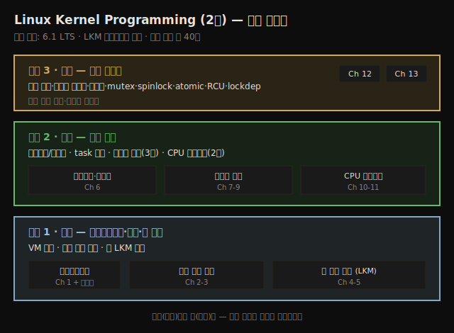

# Linux Kernel Programming (2판) — 책 개요와 학습 로드맵
---
> 이 책은 LKM(Loadable Kernel Module) 프레임워크로 리눅스 커널 개발을 손으로 익히는 실습 중심 입문서입니다. 6.1 LTS 커널을 기준으로 빌드·모듈 작성부터 메모리 관리·CPU 스케줄러·커널 동기화까지 세 단계로 올라갑니다. 이 노트는 각 챕터 본문에 들어가기 전, 책 전체가 어디로 향하는지를 먼저 잡아 두는 지도입니다.

리눅스 커널은 범위가 넓어서 어디부터 손대야 할지 막막한 영역입니다. 이 책은 그 막막함을 줄이려고 **모듈 개발이라는 하나의 입구**를 택합니다. 디바이스 드라이버를 포함한 실무·산업 현장의 커널 프로젝트가 대부분 LKM 방식으로 이뤄지기 때문입니다. 그래서 이 노트도 "커널 전체를 다 안다"가 아니라 "모듈 작성자(module author)로서 알아야 할 만큼"을 기준선으로 삼습니다.

이 첫 노트의 목적은 단 하나입니다. 뒤따라올 챕터별 학습 노트를 읽기 전에, **세 섹션의 큰 줄기와 13개 챕터의 배치**를 머릿속에 넣어 두는 것입니다. 그래야 개별 주제(예: 메모리 할당 API)가 전체에서 어디쯤 위치하는지 알고 읽을 수 있습니다.

## 1. 이 책이 택한 접근 — LKM 중심 실습

> 커널을 통째로 다시 컴파일하지 않고, 모듈을 끼웠다 뺐다 하며 배우는 방식이 LKM입니다. 실무 커널 작업 대부분이 이 방식이기 때문에 입구로 택했습니다.

이 책의 중심 도구는 **LKM(Loadable Kernel Module) 프레임워크**입니다. 커널 코드를 별도 모듈로 빌드해 실행 중인 커널에 동적으로 적재(insert)하고 제거(remove)하는 구조입니다. 디바이스 드라이버 개발을 포함한 현실의 커널 프로젝트와 제품이 대부분 이 방식으로 진행되기 때문에, 저자는 이 프레임워크를 학습의 입구로 삼습니다.

학습 철학은 **경험주의(empirical approach)** 입니다. 저자는 "누구의 말도 그대로 믿지 말고, 직접 해보고 겪어라"를 반복해서 강조합니다. 이 철학이 실제로 책에 반영된 근거는 다음과 같습니다.

1. 책의 GitHub 저장소에 **약 40개의 커널 모듈**이 들어 있습니다(여러 유저 앱과 셸 스크립트는 별도이며, 모듈 수는 1판의 두 배입니다).
2. 디지털 버전 독자에게는 코드를 직접 타이핑하거나 GitHub에서 받아 쓰라고 권합니다. 복사-붙여넣기에서 생기는 오류를 피하기 위해서입니다.

> 코드 저장소: `https://github.com/PacktPublishing/Linux-Kernel-Programming_2E` — 업데이트가 반영되므로 `git pull`로 최신 상태를 유지하라고 안내합니다.

## 2. 왜 6.1 LTS 커널인가

> 6.1은 장기 지원(LTS) 커널이라 책 내용이 오래도록 유효합니다. CIP가 SLTS로 채택해 2033년까지 유지 계획이 잡혀 있습니다.

이 책은 커널 커뮤니티의 **6.1 LTS(Long Term Support)** 커널을 기준으로 합니다. 특정 커널 버전을 콕 집은 이유는 책의 수명과 직결됩니다.

1. **6.1 LTS는 2022년 12월부터 2026년 12월까지** 버그·보안 수정이 유지됩니다.
2. 더 나아가 **CIP(Civil Infrastructure Project)가 6.1을 SLTS(Super LTS)로 채택**해, 10년간 — **2033년 8월까지** — 유지할 계획입니다.

버전을 고정한 덕분에 코드와 설명이 수년간 산업 현장에서 그대로 통용된다는 점이 저자가 내세우는 강점입니다. 학습 노트를 읽을 때도 "이 동작이 6.1 기준"임을 전제로 두면, 이후 커널 버전과 차이가 생기더라도 기준점을 잡고 비교할 수 있습니다.

## 3. 세 섹션 구조 — 학습의 큰 줄기

> 책은 기초(빌드·첫 모듈) → 핵심 내부(아키텍처·메모리·스케줄러) → 고급(동기화) 세 단계로 올라갑니다. 뒤로 갈수록 추상이 깊어집니다.

책 전체는 세 개의 섹션으로 나뉩니다. 각 섹션은 앞 섹션을 전제로 쌓이는 구조라서, 순서대로 읽는 것이 자연스럽습니다. 아래 종합도는 세 섹션과 그 안의 챕터 배치를 한 장으로 보여줍니다.

세 섹션의 역할은 다음과 같습니다.

1. **섹션 1 (기초)**: 커널 개발에 맞는 작업 환경을 꾸리고, 소스에서 현대 커널을 빌드하고, 첫 커널 모듈을 작성합니다.
2. **섹션 2 (커널 내부 핵심)**: 책의 핵심 섹션입니다. 리눅스 커널 아키텍처, task 구조, 유저·커널 모드 스택, 메모리 관리를 다룹니다. 특히 **메모리 관리에 세 개 챕터를 통째로 할애**합니다. CPU(task) 스케줄링의 내부 동작이 이 섹션을 마무리합니다.
3. **섹션 3 (고급)**: 전문적인 커널 설계·코드에 필수인 **커널 동기화(synchronization)** 를 다룹니다. 두 개 챕터를 할애합니다.

## 4. 챕터별 로드맵 — 13챕터 + 온라인 챕터

> 어느 챕터가 무엇을 다루는지의 지도입니다. 각 행이 향후 작성될 학습 노트 한 편(또는 묶음)에 대응합니다.

아래 표는 Preface의 "What this book covers"가 밝힌 각 챕터의 범위입니다. 기술 세부 내용은 해당 챕터 본문을 받아 별도 노트로 채울 예정이며, 이 표는 그 자리를 잡아 두는 골격입니다.

| Ch | 제목 | 섹션 | 다루는 범위 |
|----|------|------|------------|
| 1 | Linux Kernel Programming – A Quick Introduction | 기초 | 책 전체 여정 소개 |
| 2 | Building the 6.x Linux Kernel from Source – Part 1 | 기초 | 커널 버전 명명법, 소스 트리, 소스 다운로드·추출·설정, 커스텀 설정 메뉴 |
| 3 | Building the 6.x Linux Kernel from Source – Part 2 | 기초 | 커널 빌드·모듈 설치, initramfs(initrd) 이미지, 부트로더, x86_64→AArch64 크로스 컴파일 |
| 4 | Writing Your First Kernel Module – Part 1 | 기초 | LKM 프레임워크 기초, "Hello, world" 모듈 작성·적재·제거, `printk` 로깅, printk indexing, dynamic debug |
| 5 | Writing Your First Kernel Module – Part 2 | 기초 | "더 나은" Makefile(v0.2), 모듈 크로스 컴파일, 라이브러리식 코드(링크·모듈 스태킹), 모듈 파라미터, 부팅 시 자동 적재, 보안 가이드 |
| 6 | Kernel Internals Essentials – Processes and Threads | 핵심 | 프로세스/인터럽트 컨텍스트, 유저 VAS 레이아웃, task 구조, 유저·커널 모드 스택, `current` 매크로, task 리스트 순회 |
| 7 | Memory Management Internals – Essentials | 핵심 | VM split, 유저/커널 VAS, 주소 변환, [K]ASLR, 물리 메모리 조직 |
| 8 | Kernel Memory Allocation for Module Authors – Part 1 | 핵심 | slab 할당자와 page 할당자(BSA), `kzalloc()`/`kfree()`, `devm_*()` 자원 관리 API, 내부 단편화 |
| 9 | Kernel Memory Allocation for Module Authors – Part 2 | 핵심 | 커스텀 slab 캐시, slab shrinker, `vmalloc()`, API 선택 기준, 메모리 회수와 OOM killer, demand paging, MGLRU·DAMON |
| 10 | The CPU Scheduler – Part 1 | 핵심 | KSE(=스레드), 스케줄링 정책, `perf`, CFS 스케줄링 주기/타임슬라이스, `thread_info`, preempt dynamic, `schedule()` 호출 시점 |
| 11 | The CPU Scheduler – Part 2 | 핵심 | CPU affinity 마스크, per-thread 정책·우선순위, cgroups(v2), systemd와 cgroups, CPU 대역폭 할당, RTOS로서의 리눅스 |
| 12 | Kernel Synchronization – Part 1 | 고급 | 임계 영역·원자성·데이터 레이스(LKMM), 락의 의미, 동시성, 데드락 회피, mutex·spinlock, 인터럽트 컨텍스트의 spinlock |
| 13 | Kernel Synchronization – Part 2 | 고급 | atomic·refcount, RMW 비트 연산, reader-writer spinlock, CPU 캐시·false sharing, per-CPU 데이터, RCU, lockdep, 메모리 배리어 |
| 온라인 | Kernel Workspace Setup | — | 커널 개발 워크스페이스 구성, 필수 패키지 설치(Ubuntu 자동 설치 스크립트 제공) |

> 메모리 관리(7·8·9)와 스케줄러(10·11), 동기화(12·13)가 각각 여러 챕터로 쪼개진 점에 주목하면, 이 책의 무게 중심이 어디에 있는지 보입니다. 메모리·스케줄링·동기화가 모듈 작성자에게 가장 깊이 알아야 할 영역이라는 신호입니다.

## 5. 학습 전제와 환경

> C 언어와 셸 사용은 전제 조건입니다. 실습은 가상 머신(VM) 게스트에 커널 개발 환경을 꾸려 진행합니다.

이 책을 제대로 활용하려면 다음이 전제됩니다.

1. 리눅스 시스템을 **커맨드 라인(셸)** 에서 다룰 줄 알아야 합니다.
2. **C 프로그래밍 언어**를 알아야 합니다.
3. (필수는 아니지만) 리눅스 시스템 프로그래밍 경험이 있으면 크게 도움이 됩니다.

저자가 실제로 코드를 테스트한 환경은 다음과 같습니다. 실습 환경을 맞출 때 참고할 수 있는 기준점입니다.

| 플랫폼 | 비고 |
|--------|------|
| x86_64 Ubuntu 22.04 LTS (게스트) | Oracle VirtualBox 7.0 |
| x86_64 Ubuntu 23.04 (게스트) | Oracle VirtualBox 7.0 |
| x86_64 Fedora 38·39 | 네이티브(노트북) |
| ARM Raspberry Pi 4 Model B (64-bit) | distro 커널 + 커스텀 6.1 커널, 가볍게 테스트 |

리눅스를 게스트(VM)로 돌릴 때 호스트는 Windows 10 이상, 최신 리눅스 배포판, 또는 macOS를 가정합니다. 하드웨어·소프트웨어 요구사항과 설치 절차는 별도의 **온라인 챕터(Kernel Workspace Setup)** 에서 상세히 다루며, 저자는 이 챕터를 먼저 정독하라고 강조합니다.

## 6. 짝이 되는 후속서

> 이 책은 1부입니다. 문자 디바이스 드라이버와 하드웨어 인터럽트는 2부가 이어받습니다.

저자는 이 책의 동반서로 **Linux Kernel Programming Part 2 – Char Device Drivers and Kernel Synchronization** 을 함께 권합니다. misc 문자 드라이버 작성, 주변장치 칩 메모리 I/O, 하드웨어 인터럽트 처리를 다루는 입문서입니다. 인쇄본을 사면 무료로 받을 수 있고, GitHub 저장소에서 eBook으로도 제공됩니다.

이 노트 시리즈는 우선 1부(본서)의 13개 챕터를 따라가며, 후속서 주제(드라이버·인터럽트)는 필요해질 때 별도로 다룹니다.

## 다음 단계

> 이 지도를 펼친 뒤에는 섹션 1부터 순서대로 챕터 본문을 받아 노트를 채웁니다.

이 노트는 책의 골격만 잡은 지도입니다. 실제 기술 내용은 각 챕터 본문을 받아 채워야 합니다. 작성 순서는 책 구조를 그대로 따릅니다.

1. **섹션 1 (Ch 2~5)**: 커널 빌드와 첫 모듈 — 실습의 토대입니다.
2. **섹션 2 (Ch 6~11)**: 프로세스/스레드, 메모리 관리(3편), 스케줄러(2편) — 책의 핵심입니다.
3. **섹션 3 (Ch 12~13)**: 커널 동기화 — 전문 커널 코드의 필수기입니다.

## 관련 문서

> 이 책은 "커널 개발자 관점"의 내부를 다룹니다. 기존 02_os의 "K8s 운영 관점" 커널 노트와는 시선이 다르므로, 같은 메커니즘이 양쪽에서 나오면 서로 교차참조합니다.

- [02_os/ MOC](../../README.md) — OS 공통 기반 전체 지도
- [02_os/kernel/ MOC](../../kernel/README.md) — K8s 운영 관점에서 본 커널 메커니즘(namespace·cgroup·/proc). 본서의 Ch 11(cgroups v2)과 주제가 겹칩니다
- [02_os/kernel/01-01.커널과 컨테이너](../../kernel/01-01.커널과%20컨테이너.md) — 유저/커널 스페이스·시스템 콜·코어 영역의 K8s 관점 정리. 본서 Ch 6·7의 운영 측 대응편
