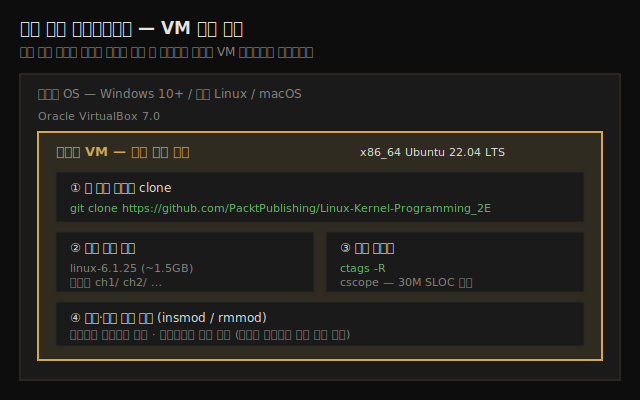

# 커널 개발 워크스페이스 셋업
---
> 커널 실습은 가상 머신(VM) 게스트에 리눅스를 설치하고, 책 코드를 GitHub에서 클론한 뒤, `ctags`/`cscope`로 인덱싱하는 환경에서 시작합니다. VM을 쓰는 핵심 이유는 격리와 안전입니다 — 커널 코드가 잘못되면 시스템 전체가 영향을 받기 때문입니다. 이 노트는 본격적인 챕터에 들어가기 전 손에 맞는 작업 환경을 갖추는 단계입니다.

커널 개발은 일반 애플리케이션 개발과 위험도가 다릅니다. 유저 공간 프로그램은 크래시해도 그 프로세스만 죽지만, 커널 코드의 실수는 시스템 전체를 멈출 수 있습니다. 그래서 저자는 실습 환경을 **격리된 가상 머신**에 두라고 권합니다. 망가져도 호스트는 안전하고, 스냅숏으로 되돌릴 수 있기 때문입니다.

이 노트의 목적은 챕터 2 이후의 실습(커널 빌드, 모듈 작성)을 시작할 수 있는 토대를 만드는 것입니다. 저자가 강조하는 학습 태도 하나를 먼저 짚고 갑니다 — **경험주의(empirical approach)** 입니다. 누구의 말도 그대로 믿지 말고, 직접 해보고 겪으라는 것입니다. 그래서 이 책은 따라 할 실험과 코드 예제를 많이 싣고 있고, 환경 셋업은 그 실험을 직접 돌리기 위한 첫걸음입니다.

> 책의 안내: 지면 제약상 워크스페이스 셋업의 **전체·상세 내용은 온라인 챕터 PDF**에 있습니다. 저자는 이 PDF를 받아 정독하라고 요청합니다. 이 노트는 1장이 담은 개요 수준만 정리하며, 온라인 챕터의 세부 패키지 목록·설치 절차는 그 PDF를 따릅니다.
> 온라인 챕터: `http://www.packtpub.com/sites/default/files/downloads/9781803232225_Online_Chapter.pdf`


## 1. 왜 가상 머신(VM) 게스트인가

> 네이티브 리눅스가 가장 빠르지만, 전용 리눅스 머신을 늘 가질 수는 없습니다. VM 게스트는 격리라는 안전 계층을 더해 줍니다.

저자는 노련한 커널 개발자라면 **네이티브 리눅스 시스템**에서 작업하는 것이 가장 좋다고 말합니다. 다만 이 책은 독자가 항상 전용 네이티브 리눅스 머신을 가지고 있다고 가정할 수 없으므로, **리눅스 게스트 VM**에서 작업하는 것을 전제로 합니다. 아래 그림이 호스트 위에 VM 게스트를 올리고 그 안에서 소스·도구를 갖추는 전체 구조입니다.



VM 게스트를 쓰는 이유와 대가는 다음과 같습니다.

1. **격리와 안전**: VM은 호스트와 분리된 추가 계층을 둡니다. 커널 코드가 시스템을 망가뜨려도 호스트는 보호됩니다.
2. **성능이라는 대가**: 단점은 성능입니다. 고사양 네이티브 리눅스 머신은 VM 대비 최대 2배까지 빠를 수 있습니다.

> 책 기준 환경: x86_64 Ubuntu 22.04 LTS 게스트 VM, Oracle VirtualBox 7.0에서 실행. 책에 실린 출력은 이 환경 기준이므로, 배포판·버전 차이로 여러분의 출력과 (대개 사소하게) 다를 수 있습니다.


## 2. 하드웨어 요구사항

> 커널 빌드는 메모리·CPU를 많이 먹는 작업입니다. 권장 최소 사양을 넘어서는, 가능한 한 강력한 시스템이 좋습니다.

커널을 소스에서 빌드하는 작업은 **메모리와 CPU를 크게 소모**합니다. 그래서 저자는 현대적이고 가능하면 강력한 데스크톱 PC나 노트북을 권합니다.

1. Ubuntu 데스크톱이 권장하는 최소 시스템 요구사항을 출발점으로 삼되, 그 **최소치를 한참 넘어서는** 시스템을 쓰라고 조언합니다.
2. 호스트 시스템의 **RAM·CPU 성능·디스크 공간이 많을수록** 빌드가 빠르고 쾌적합니다.

> Ubuntu 권장 최소 사양: `https://help.ubuntu.com/community/Installation/SystemRequirements`

VM 게스트로 리눅스를 돌릴 때 호스트는 Windows 10 이상, 최신 리눅스 배포판, 또는 macOS를 가정합니다.


## 3. 책 코드 저장소 클론

> 책의 전체 소스 코드는 GitHub에 공개되어 있습니다. `git clone`으로 받아 챕터별 디렉토리로 정리된 코드를 따라갑니다.

이 책의 완전한 소스 코드는 GitHub에서 자유롭게 받을 수 있습니다. 다음 명령으로 git 트리를 클론합니다.

```bash
git clone https://github.com/PacktPublishing/Linux-Kernel-Programming_2E
```

소스 코드는 **챕터별로 정리**되어 있습니다. 구조를 이해하면 노트와 코드를 짝지어 읽기 쉽습니다.

1. 각 챕터가 디렉토리 하나로 표현됩니다 — 예를 들어 `ch1/`에는 1장 소스 코드가 들어 있습니다.
2. 소스 트리의 루트에는 모든 챕터가 공통으로 쓰는 코드가 있습니다 — `convenient.h`, `klib.c` 같은 파일입니다.


## 4. 코드 인덱싱 — ctags와 cscope

> 방대한 커널 코드를 효율적으로 탐색하려면 인덱스가 필수입니다. `ctags`/`cscope`로 소스 트리를 인덱싱합니다.

커널 소스는 규모가 커서 에디터로 단순 검색만 하면 길을 잃기 쉽습니다. 저자는 코드 베이스를 **항상 `ctags`나 `cscope`로 인덱싱**하라고 강하게 권합니다.

예를 들어 소스 트리에 ctags 인덱스를 만들려면, 소스 트리 루트로 이동한 뒤 다음을 실행합니다.

```bash
ctags -R
```

> 저자의 권유: 아직 익숙하지 않다면 `cscope`, `ctags` 같은 코드 탐색 도구를 배우는 데 시간을 투자하라고 합니다. 커널처럼 큰 코드를 다룰 때 탐색 속도가 학습 속도를 좌우하기 때문입니다.


## 5. 추가로 유용한 프로젝트

> 온라인 챕터는 커널 여정에 도움이 되는 다른 오픈소스 프로젝트들도 소개합니다. 상세는 그 PDF를 따릅니다.

1장과 온라인 챕터는 커널 학습 여정에 도움이 되는 **몇몇 오픈소스 프로젝트**를 함께 소개한다고 안내합니다. 다만 그 구체적인 목록과 설명은 지면 제약상 온라인 챕터 PDF에 담겨 있습니다. 이 노트는 그 존재만 표시하고, 실제 프로젝트별 내용은 PDF를 정독한 뒤 필요해질 때 별도로 다룹니다.

> 추측으로 프로젝트 목록을 채우지 않습니다 — 원문(온라인 챕터)을 확인한 뒤 보강합니다.


## 다음 단계

> 환경이 준비되면 섹션 1의 본 작업 — 커널 소스 빌드 — 로 넘어갑니다.

워크스페이스가 갖춰졌다면 이제 커널 개발의 본 무대로 들어갑니다. 저자의 안내에 따르면 다음 두 챕터가 커널을 소스에서 다운로드·추출·설정·빌드하는 방법을 가르칩니다.

1. **Ch 2 (커널 빌드 Part 1)**: 커널 버전 명명법, 소스 트리, 소스 다운로드·추출·설정.
2. **Ch 3 (커널 빌드 Part 2)**: 빌드·모듈 설치, initramfs, 부트로더, 크로스 컴파일.


## 관련 문서

> 이 노트는 책의 출발점입니다. 전체 로드맵은 개요 노트가, 책의 학습 철학·환경 배경은 그쪽에서 더 넓게 다룹니다.

- [00-00.책 개요와 학습 로드맵](./00-00.책%20개요와%20학습%20로드맵.md) — 3섹션·13챕터 전체 지도와 학습 환경(6.1 LTS·VM) 배경
- [02_os/linux-kernel-programming/ MOC](./README.md) — 본 책 노트 시리즈 인덱스
