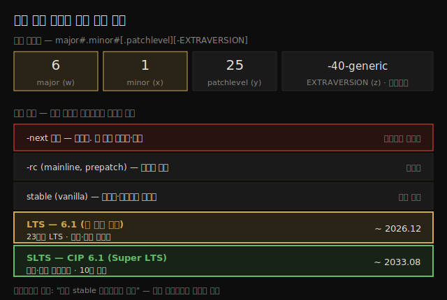
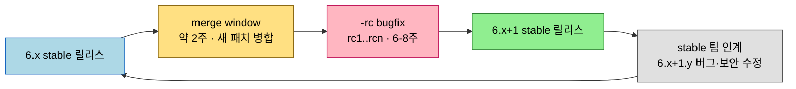

# 커널 빌드 (1) — 버전 체계와 소스 트리 종류
---
> 커널을 빌드하기 전에 알아야 할 배경입니다. 리눅스 커널 버전은 `major.minor[.patchlevel][-EXTRAVERSION]` 체계이고, 릴리스는 기능이 아니라 시간 기반으로 매겨집니다. 소스 트리는 안정성 순으로 -next → -rc(mainline) → stable → LTS/SLTS 로 나뉘며, 이 책은 수명이 가장 긴 6.1 LTS 를 씁니다. 시니어 메인테이너들의 권고는 단순합니다 — "최신 stable 업데이트를 쓰라".

커널을 소스에서 직접 빌드하는 일은 커널 개발 여정의 좋은 출발점입니다. 다만 빌드 명령을 치기 전에 먼저 잡아야 할 개념들이 있습니다. 지금 보는 `uname -r` 출력이 무슨 뜻인지, kernel.org 에 왜 여러 종류의 커널이 있는지, 그중 무엇을 골라야 하는지를 모르면 빌드는 기계적 따라하기에 그칩니다.

이 노트는 Ch 2 의 전반부 — 빌드 실습에 들어가기 전의 배경 지식 — 을 다룹니다. 실제 다운로드·추출·설정(Step 1~3)과 Kconfig/Kbuild 빌드 시스템은 짝이 되는 다음 노트에서 이어집니다. 아래 종합도가 이 노트의 척추 — 버전 명명법 분해와 소스 트리 안정성 사다리 — 입니다.



> 전제: 이 책은 커널 소스 자체의 빌드만 다룹니다. 루트 파일시스템은 다루지 않습니다. 현대 리눅스 시스템은 부트로더·OS 커널·루트 파일시스템 세 가지가 필수이고, ARM/PPC 라면 DTB(Device Tree Blob) 와 initramfs(initrd) 이미지가 선택적으로 더해집니다.


## 1. 커널 버전 명명법

> 버전은 `major#.minor#[.patchlevel][-EXTRAVERSION]` 형식입니다. `uname -r` 출력을 이 틀에 맞춰 읽으면 됩니다.

커널 버전을 보려면 셸에서 `uname -r` 을 실행합니다. 책의 x86_64 Ubuntu 22.04 LTS 게스트 VM 기준 출력은 다음과 같았습니다.

```bash
$ uname -r
5.19.0-40-generic
```

현대 리눅스 커널의 릴리스 번호 체계는 다음과 같으며, 흔히 `w.x[.y][-z]` 로도 표기합니다. 대괄호는 선택 항목이라는 뜻입니다.

```
major#.minor#[.patchlevel][-EXTRAVERSION]
```

각 구성 요소의 의미는 다음과 같습니다.

| 구성 요소 | 의미 | 예시 |
|-----------|------|------|
| Major # (w) | 주 번호. 현재 6.x 시리즈이므로 major 는 6 | 2, 3, 4, 5, 6 |
| Minor # (x) | major 아래 부 번호 | 0 이상 |
| [patchlevel] (y) | minor 아래. ABI·revision 이라고도 함. 중요한 버그/보안 수정이 필요할 때 stable 커널에 적용 | 0 이상 |
| [-EXTRAVERSION] (z) | localversion 이라고도 함. 배포판·벤더가 자기 내부 변경을 추적할 때 사용 | 다양. Ubuntu 는 `w.x.y-<z>-generic` |

따라서 Ubuntu 22.04 LTS 의 `5.19.0-40-generic` 은 이렇게 해석됩니다.

1. Major (w): 5
2. Minor (x): 19
3. patchlevel (y): 0
4. -EXTRAVERSION (z): -40-generic

> 주의: 배포판 커널은 이 관례를 정확히 따르지 않을 수 있습니다 — 그건 배포판 재량입니다. kernel.org 의 vanilla 커널은 이 관례를 따릅니다. 참고로 2.6 이전 커널에서는 minor 가 짝수면 stable, 홀수면 unstable/beta 를 뜻했지만 지금은 아닙니다.


## 2. "손가락·발가락" 릴리스 모델 — 시간 기반 버저닝

> major/minor 번호가 바뀌어도 대단한 새 설계가 들어온다는 뜻이 아닙니다. Linus 의 말로 "유기적 진화"이며, 릴리스는 기능이 아니라 느슨한 시간 기반입니다.

현대 커널에서 major 나 minor 번호가 올라가는 것은 거대한 새 아키텍처나 기능이 등장했다는 신호가 아닙니다. Linus 의 표현으로는 단지 **유기적 진화(organic evolution)** 입니다. 버전 체계는 기능 기반이 아니라 느슨한 시간 기반입니다.

그래서 새 major 번호가 주기적으로 등장합니다. 얼마나 자주일까요? Linus 는 이를 **"손가락과 발가락(fingers and toes)" 모델**이라 부릅니다. minor 번호(x)를 셀 손가락·발가락이 떨어지면 major 를 w 에서 w+1 로 올립니다. 즉 minor 를 0 부터 19 까지 20 개 돌면 새 major 가 나옵니다.

```
3.0 ~ 3.19  (minor 릴리스 20개)
4.0 ~ 4.19  (minor 릴리스 20개)
5.0 ~ 5.19  (minor 릴리스 20개)
6.0 ~ …      (계속 진행 중)
```

각 minor 에서 다음 minor 까지는 대략 6~10 주가 걸립니다.


## 3. 커널 개발 워크플로

> 한 stable 릴리스가 나오면 약 2주 merge window 가 열리고, 닫힌 뒤 -rc(bugfix) 단계를 거쳐 다음 stable 이 나옵니다. 흔히 알려진 것과 달리 이 과정은 잘 문서화된 체계입니다.

커널이 즉흥적(ad hoc)으로 개발된다는 것은 흔한 오해입니다. 실제로는 잘 정비된 시스템이며, 기여자가 알아야 할 절차가 문서로 정리되어 있습니다(공식 문서: `https://www.kernel.org/doc/html/latest/process/2.Process.html`).

6.x 시리즈를 예로 든 전형적 워크플로는 다음과 같습니다.

1. 6.x stable 릴리스가 나옵니다. 동시에 6.x+1 mainline 을 위한 **2주 merge window** 가 열립니다.
2. merge window 동안 각 서브시스템 메인테이너가 새 패치를 mainline 에 병합합니다. 실제 작업은 훨씬 전부터 진행됐고, 그 결실이 이 시점에 합쳐집니다.
3. 약 2주가 지나면 merge window 가 닫힙니다.
4. 이제 **bugfix 기간** — rc(prepatch, mainline) 커널이 시작됩니다. `6.x+1-rc1, -rc2, …, -rcn` 으로 진행되며 6~8 주가 걸립니다.
5. 약 1주의 finalization 을 거쳐 새 `6.x+1` stable 커널이 릴리스됩니다.
6. 릴리스는 stable 팀에 인계됩니다.
   - 중요한 버그·보안 수정은 `6.x+1.y`(`.1, .2, …`)로 나옵니다. 이 책은 주로 `6.1.25` 를 쓰므로 y=25 입니다.
   - 다음 stable 또는 EOL(End Of Life) 까지 유지됩니다. 6.1 LTS 의 EOL 예정일은 2026년 12월입니다.

merge window 를 놓치면 다음 window 까지 약 2.5~3 개월을 기다려야 합니다. 한 stable 에서 다음 stable 까지의 흐름은 다음과 같습니다.



### Git 로그로 본 6.1 의 진화

저자는 mainline Git 트리에서 `git log` 로 태그를 날짜순 출력해 6.1 의 진화를 보여줍니다. (이 명령은 Git 트리에서만 동작하며, 진화를 시연하는 용도입니다.)

```bash
$ git log --date-order --tags --simplify-by-decoration \
--pretty=format:'%ai %h %d'
[ … ]
2022-12-11 14:15:18 -0800 830b3c68c1fb  (tag: v6.1)
2022-12-04 14:48:12 -0800 76dcd734eca2  (tag: v6.1-rc8)
[ … ]
2022-10-16 15:36:24 -0700 9abf2313adc1  (tag: v6.1-rc1)
2022-10-02 14:09:07 -0700 4fe89d07dcc2  (tag: v6.0)
[ … ]
```

출력을 읽으면, stable 6.1 LTS 의 최초 릴리스는 **2022년 12월 11일**, 직전 6.0 트리는 **2022년 10월 2일** 입니다. 6.0 릴리스일(10월 2일)이 6.1 의 merge window 시작점이고, 2주 뒤인 10월 16일 `6.1-rc1` 이 나왔습니다. `6.1-rc1` 부터 `6.1-rc8` 까지 8 개의 rc 를 거쳐 70일(10주) 만에 12월 11일 v6.1 이 나왔습니다.

> Git 커널 히스토리는 2.6.12 커널부터 유지됩니다(그래서 타임라인 그림이 거기서 시작합니다).


## 4. 소스 트리 종류 — 안정성 순서

> 커널 트리는 -next(최첨단) → -rc(mainline) → stable(vanilla) → 배포판/LTS 순으로 안정적이고 수명이 깁니다. 기여자는 -next, 제품은 LTS 를 씁니다.

kernel.org 저장소에는 여러 종류의 커널이 있습니다. 안정성이 낮은 것부터(수명이 짧은 것부터) 높은 순으로 정리하면 다음과 같습니다.

| 종류 | 성격 | 누가 쓰나 |
|------|------|----------|
| `-next` 트리 | 최첨단(화살표 끝). 새 패치를 테스트·리뷰용으로 모음 | 업스트림 기여자 — 패치를 올리려면 최신 -next 에서 작업 |
| Prepatch (`-rc`, mainline) | 릴리스 직전 release candidate | 테스트 |
| Stable (vanilla) | 본 무대. 배포판·프로젝트가 가져다 씀 | 일반 사용·배포판 베이스 |
| 배포판·LTS | 배포판이 제공. LTS 는 더 오래 유지 | 산업·프로덕션 |

### LTS 커널

LTS(Long Term Support)는 특정 EOL 까지 메인테이너가 중요한 버그·보안 수정을 백포트하는 "특별한" 릴리스입니다. 관례상 매년 마지막(보통 12월) 릴리스가 LTS 로 지정됩니다. 수명은 최소 2년이고 더 연장될 수 있습니다.

이 책이 쓰는 **6.1.y LTS 는 23번째 LTS** 커널로, 수명은 2022년 12월부터 2026년 12월까지 4년으로 예정돼 있습니다. 참고로 5.4 LTS 는 2025년 12월, 5.10 LTS 는 6.1 과 같은 2026년 12월까지 유지됩니다.

### SLTS 와 SoC 벤더 커널

언급할 트리가 둘 더 있습니다.

1. **SLTS(Super LTS)**: LTS 보다도 오래 유지됩니다. Linux Foundation 산하 CIP(Civil Infrastructure Platform)가 유지하며, 산업·민간 인프라용 산업 등급 오픈소스 "base layer" 를 목표로 합니다. 책 집필 시점 최신 CIP 커널인 **SLTS v6.1 / v6.1-rt 는 6.1 LTS 기반이고 EOL 예정일이 2033년 8월(10년)** 입니다.
2. **칩(SoC) 벤더 커널**: 실리콘 벤더가 자사 보드용으로 유지합니다. 기존 vanilla LTS(최신이 아닐 수도 있음)를 베이스로 벤더 패치·BSP·드라이버를 얹습니다. 시간이 지나면 최신 stable 과 차이가 커져 유지보수가 어려워지므로, Yocto Project 같은 산업 강도 솔루션을 쓰는 편이 낫습니다.

### 2023년 9월의 LTS 새 방침

> 2023년 9월 빌바오 OSS Summit 에서 Jon Corbet 이 "이제 LTS 는 2년만 유지"라고 발표했습니다.

중요한 업데이트가 있습니다. 2023년 9월 스페인 빌바오 Open Source Summit 의 "kernel report" 발표에서 Jonathan Corbet 이 **앞으로 LTS 커널은 2년만 유지**한다고 발표했습니다. 이유는 둘입니다.

1. 사람들이 실제로 안 쓰는 시리즈를 수년간 유지할 이유가 적습니다. 엔터프라이즈·SoC 벤더는 자체 커널을 유지합니다.
2. **메인테이너 피로(maintainer fatigue)**. 현재 7개의 major LTS(4.14, 4.19, 5.4, 5.10, 5.15, 6.1, 6.6)를 계속 유지하기는 벅찹니다. 예를 들어 4.14 LTS 는 약 300번의 업데이트와 거의 28,000 커밋이 있었습니다. 오래된 버그가 뒤늦게 드러나고, 새 버그를 옛 LTS 로 백포트하는 부담이 누적됩니다.

다만 이 책이 쓰는 6.1 LTS 는 기존 일정대로 2026년 12월까지 유지될 것으로 보입니다.


## 5. 어느 커널을 써야 하는가

> 환경에 따라 답이 갈리지만, 시니어 메인테이너들의 정답은 하나입니다 — "최신 stable 업데이트를 쓰라".

"어느 커널을 돌려야 하나"는 임베디드/데스크톱/서버, 신규/레거시, 유지 기간, 보안 요구에 따라 갈립니다. 그래도 시니어 메인테이너들의 답은 명확합니다.

> "최신 stable 업데이트를 돌려라. 그것이 지금 우리가 만들 수 있는 가장 안정적이고 안전한 최선의 커널이다." — Jon Corbet, 2023년 9월

> "안전하고 안정적인 시스템을 가지려면 모든 stable/LTS 릴리스를 순서대로 받아야 한다. 무작위 패치를 체리픽하면 알려진·알려지지 않은 문제를 다 고치지 못하고, 오히려 더 불안전하고 알려진 버그를 품은 시스템이 된다." — Greg Kroah-Hartman

kernel.org 첫 화면의 큰 노란 버튼 안 번호가 오늘자 최신 stable 커널입니다. 저장소 상태는 `curl` 로도 조회할 수 있습니다.

```bash
$ curl -L https://www.kernel.org/finger_banner
The latest stable version of the Linux kernel is:             6.6.4
The latest mainline version of the Linux kernel is:           6.7-rc4
[ … ]
The latest longterm 6.1 version of the Linux kernel is:       6.1.65
[ … ]
```

이 책은 집필 시점에 EOL 이 가장 먼 LTS 인 **6.1.x** 를 택했습니다. 1판이 5.4.0 을 썼던 것과 같은 기준 — 그때 수명이 가장 길었던 LTS — 입니다.


## 다음 단계

> 배경을 잡았으니 다음 노트에서 실제로 커널을 다운로드·추출·설정합니다.

여기까지 커널 버전 명명법, 개발 워크플로, 소스 트리 종류, 어느 커널을 쓸지를 정리했습니다. 이 지식을 갖추면 빌드 과정이 기계적 따라하기가 아니라 이해 위에서 이뤄집니다.

다음 노트는 빌드의 처음 세 단계를 다룹니다.

1. **Step 1**: 커널 소스 트리 얻기 (tarball 다운로드 또는 git clone).
2. **Step 2**: 소스 트리 추출 + 10,000피트 뷰로 본 소스 레이아웃.
3. **Step 3**: Kconfig/Kbuild 로 커널 설정 + menuconfig + 메뉴 커스터마이징.


## 관련 문서

> 이 노트는 빌드 실습의 배경입니다. 실제 빌드는 짝 노트가 잇고, 책 전체 지도는 개요 노트에 있습니다.

- [02-02.커널 빌드 (2) — 다운로드·설정과 Kconfig/Kbuild](./02-02.커널%20빌드%20(2)%20—%20다운로드·설정과%20Kconfig·Kbuild.md) — Step 1~3 실습과 빌드 시스템 (짝 노트)
- [00-00.책 개요와 학습 로드맵](./00-00.책%20개요와%20학습%20로드맵.md) — 3섹션·13챕터 전체 지도
- [01-00.커널 개발 워크스페이스 셋업](./01-00.커널%20개발%20워크스페이스%20셋업.md) — 빌드를 돌릴 VM·환경 준비
