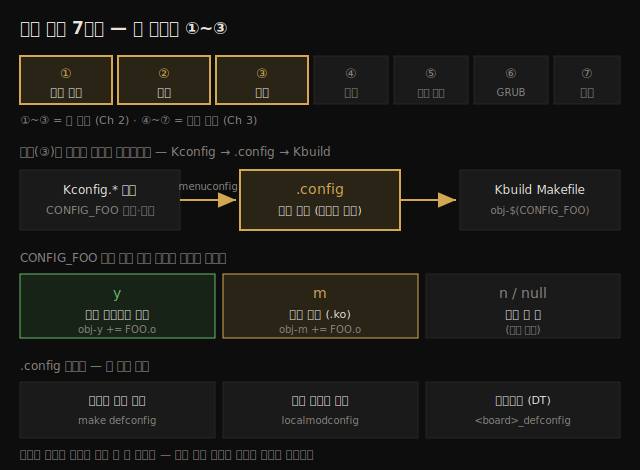

# 커널 빌드 (2) — 다운로드·설정과 Kconfig/Kbuild
---
> 커널 빌드는 x86 기준 6~7단계이고, 이 노트는 처음 셋 — 소스 얻기(Step 1), 추출(Step 2), 설정(Step 3) — 을 다룹니다. 설정이 가장 중요한 단계입니다. 같은 단일 소스로 서버·데스크톱·임베디드를 모두 만들 수 있고, 그 차이를 만드는 것이 Kconfig 설정입니다. 설정 결과는 소스 트리 루트의 `.config` 텍스트 파일 하나로 모입니다.

리눅스가 호평받는 이유 하나는 다재다능함입니다. 엔터프라이즈 서버, 데이터센터, 워크스테이션, 작은 임베디드 기기가 **모두 같은 단일 커널 소스**를 씁니다. 별도 코드 베이스가 아닙니다. 그 차이를 만드는 것이 커널 설정(configuration)이고, 그래서 설정이 빌드에서 가장 중요한 단계입니다.

이 노트는 짝 노트(버전 체계·소스 트리 종류)에서 배운 배경 위에서 실제 손을 움직입니다. 빌드 전체 7단계 중 처음 셋(소스 얻기·추출·설정)을 다루고, 나머지(빌드·모듈 설치·부트로더)는 Ch 3 에 해당하는 다음 노트로 넘깁니다.

> 빌드 7단계 요약: ① 소스 트리 얻기 → ② 추출(git clone 했으면 생략) → ③ 설정(`make menuconfig`) → ④ `make [-j n] all` 로 커널 이미지·모듈·DTB 빌드 → ⑤ `sudo make modules_install` 로 모듈 설치 → ⑥ `sudo make install` 로 GRUB·initramfs 설정 → ⑦ GRUB 메뉴 커스터마이징(선택). 이 노트는 ①~③.

아래 종합도는 7단계 전체와, 설정(③)이 어떻게 `.config` 로 모여 빌드를 제어하는지를 한 장으로 보여줍니다.




## 1. Step 1 — 커널 소스 트리 얻기

> 특정 버전 tarball 을 받거나, Git 트리를 clone 합니다. 제품 개발은 보통 정해진 버전 tarball 을, 업스트림 기여는 Git 트리를 씁니다.

소스 트리를 얻는 방법은 크게 둘입니다.

1. kernel.org 저장소에서 **특정 버전 tarball 다운로드·추출**. 대부분의 프로젝트는 쓸 커널 버전이 이미 정해져 있으므로 이 방법을 씁니다. 책은 **6.1.25 LTS** 를 택합니다.
2. Linus 의 트리(또는 linux-next)를 **git clone**. 업스트림에 코드를 기여하려는 경우입니다.

### tarball 다운로드

브라우저로 kernel.org 에서 tarball 링크를 클릭하거나, CLI 에서 `wget`/`curl` 로 받습니다. 6.1.25 를 받는 명령은 다음과 같습니다(한 줄).

```bash
wget –https-only -O ~/Downloads/linux-6.1.25.tar.xz  https://mirrors.edge.kernel.org/pub/linux/kernel/v6.x/linux-6.1.25.tar.xz
```

> `.tar.gz` 와 `.tar.xz` 는 내용이 같고 압축 방식만 다릅니다. `.tar.xz` 가 더 작아 다운로드가 빠릅니다.

### Git 트리 clone

업스트림 기여용으로는 최신 코드 베이스에서 작업해야 합니다. 가장 첨단은 linux-next 지만, 책의 목적에는 mainline(Linus 의 트리) clone 으로 충분합니다.

```bash
git clone https://git.kernel.org/pub/scm/linux/kernel/git/torvalds/linux.git
cd linux
```

> 전체 트리 clone 은 시간·네트워크·디스크를 많이 씁니다(최소 수 GB). `git clone --depth n` 으로 히스토리 깊이를 줄이면 다운로드·디스크를 아낄 수 있습니다. 되돌리려면 `git pull --unshallow`. Git 으로 clone 했다면 Step 2(추출)는 건너뛰고 Step 3 으로 갑니다.


## 2. Step 2 — 소스 트리 추출

> tarball 은 `tar xf` 로 풉니다. 옛날과 달리 홈 디렉토리 어디든 풀 수 있습니다. 소스 위치는 환경변수로 잡아 둡니다.

6.1.25 tarball 을 `~/Downloads` 에 받았다고 가정하고 풉니다.

```bash
tar xf ~/Downloads/linux-6.1.25.tar.xz
```

다른 폴더(예: `~/kernels`)에 풀려면 `--directory` 를 씁니다.

```bash
mkdir -p ~/kernels
tar xf ~/Downloads/linux-6.1.25.tar.xz --directory=~/kernels/
```

편의상 소스 루트를 가리키는 환경변수를 잡아 둡니다. 이후 이 변수가 6.1.25 소스 위치를 담는다고 가정합니다.

```bash
export LKP_KSRC=~/kernels/linux-6.1.25
```

> 옛날에는 트리를 항상 `/usr/src/` 같은 root 쓰기 위치에 풀었지만, 지금은 홈 디렉토리 어디든 됩니다. 자주 쓰는 옵션은 `tldr tar` 로 빠르게 찾을 수 있습니다.

### 소스 트리 버전 확인

소스만 보고 정확한 버전을 알려면 최상위 Makefile 의 첫 몇 줄을 봅니다. 커널은 거의 모든 디렉토리에 Makefile 을 두며, 루트의 것을 "top-level Makefile" 이라 부릅니다.

```bash
$ head Makefile
# SPDX-License-Identifier: GPL-2.0
VERSION = 6
PATCHLEVEL = 1
SUBLEVEL = 25
EXTRAVERSION =
NAME = Hurr durr I'ma ninja sloth
```

`VERSION/PATCHLEVEL/SUBLEVEL/EXTRAVERSION` 태그가 `w.x.y.z` 명명법에 직접 대응합니다. `NAME` 은 릴리스에 붙인 별명입니다(커널 유머입니다).


## 3. 소스 트리 레이아웃 — 10,000피트 뷰

> 30M SLOC 규모의 소스를 디렉토리 단위로 봅니다. `kernel/`(코어), `mm/`(메모리), `fs/`(VFS·파일시스템), `net/`(네트워크 스택), `drivers/`(가장 큰 영역), `arch/`(CPU별 코드) 가 핵심입니다.

추출된 6.1.25 소스는 약 1.5 GB, 추정 30M SLOC 규모입니다(물론 빌드 시 전부 컴파일되진 않습니다). 루트의 주요 파일·디렉토리는 다음과 같습니다.

| 이름 | 용도 |
|------|------|
| `README` | 공식 문서가 `Documentation/` 에 있음을 안내. 빌드 최소 소프트웨어 버전은 `Documentation/process/changes.rst` 참조 |
| `COPYING` | 라이선스. 대부분 GPL-2.0. 현대는 grep 가능한 SPDX 식별자 사용 |
| `MAINTAINERS` | 서브시스템별 메인테이너 목록. `scripts/get_maintainer.pl` 로 조회 |
| `Makefile` | top-level Makefile. Kbuild 와 커널 모듈이 이걸 씀 |
| `kernel/` | 코어 커널: 프로세스/스레드 생명주기, CPU 스케줄링, locking, cgroups, timer, 인터럽트, signal, module, tracing, RCU, [e]BPF |
| `mm/` | 메모리 관리(mm) 코드 대부분 |
| `fs/` | VFS(가상 파일시스템 스위치) 추상층 + 개별 파일시스템 드라이버(ext4, btrfs, overlayfs 등) |
| `block/` | VFS/FS 아래 블록 I/O 경로. page cache, blk-mq, IO 스케줄러 |
| `net/` | 네트워크 프로토콜 스택 전체 구현(TCP/UDP/IP …). IPv4 TCP/IP 는 `net/ipv4/` |
| `ipc/` | IPC: SysV·POSIX 메시지 큐, 공유 메모리, 세마포어 |
| `sound/` | 오디오(ALSA) |
| `virt/` | 가상화(하이퍼바이저). KVM 구현 |
| `arch/` | CPU(arch)별 코드. CPU 마다 디렉토리 하나 |
| `crypto/` | 커널 수준 암호 알고리즘과 API |
| `drivers/` | 디바이스 드라이버. 가장 자주 기여되고 디스크를 가장 많이 차지 |
| `include/` | arch 독립 커널 헤더(arch별은 `arch/<cpu>/include/`) |
| `init/` | arch 독립 초기화 코드. `init/main.c:start_kernel()` 이 초기화의 C 진입점에 가장 가까움 |
| `io_uring/` | 새 고속 I/O 프레임워크 io_uring 인프라 |
| `lib/` | 커널용 "라이브러리" 격. 커널은 유저 앱처럼 공유 라이브러리를 쓰지 않음. [un]compression, checksum, string 등 |
| `rust/` | Rust 언어 지원 인프라 |
| `samples/` | 여러 커널 기능의 샘플 코드 |
| `scripts/` | 빌드·분석·디버깅용 스크립트(주로 Bash·Perl) |
| `security/` | LSM(Linux Security Module), MAC 프레임워크. SELinux·AppArmor 등. 기본은 off |
| `tools/` | 커널과 밀결합된 유저 모드 도구 소스. perf, eBPF 툴링 등 |
| `usr/` | initramfs 이미지 생성·적재 지원 코드 |

원문이 강조한 몇 가지를 덧붙입니다.

1. **라이선스(GPL-2.0)**: 커널 코드를 직접 쓰는 프로젝트는 "파생 저작물"로서 같은 라이선스를 따라야 합니다. 다만 현장은 더 복잡해서, 많은 상용 제품이 드라이버 작업을 LKM 형태로 분리하고 dual-license 로 배포하기도 합니다.
2. **arch 포트**: `arch/` 아래에 alpha, arm, arm64, x86, riscv 등 CPU별 디렉토리가 있습니다. 크로스 컴파일 시 `ARCH` 환경변수를 이 폴더 이름으로 설정합니다 — 예: `make ARCH=arm64 CROSS_COMPILE=<...> foo`.
3. **코드 탐색**: 30M SLOC 에서 함수·변수를 찾으려면 인덱스가 필수입니다. top-level Makefile 에 타겟이 있습니다 — `make tags`, `make cscope`(arm64 면 `make ARCH=arm64 cscope`).
4. **io_uring 과 Rust**: io_uring 은 공유 링 버퍼·zero-copy·적은 시스템 콜로 고 I/O 성능을 냅니다. Rust 는 6.0 에 기본 지원이 들어왔고 메모리 안전성이 강점이지만, 아직 코어 코드는 Rust 를 쓰지 않고 향후 모듈 작성 지원이 목적입니다.


## 4. Step 3 — 커널 설정과 Kconfig/Kbuild

> 설정 인프라는 Kconfig, 빌드 인프라는 Kbuild 입니다. 설정 한 항목은 `CONFIG_FOO` 매크로로 표현되고 y(내장)/m(모듈)/n(미빌드) 중 하나가 됩니다. 변경이 없어도 설정 단계는 최소 한 번 반드시 거쳐야 합니다 — 자동 생성 헤더가 빠지면 뒤에서 깨집니다.

설정을 변경할 필요가 없더라도 설정 단계는 빌드의 일부로 최소 한 번 실행해야 합니다. 여기서 자동 생성되는 헤더가 없으면 나중에 문제가 생기기 때문입니다. 최소한 `make old[def]config` 라도 거쳐야 합니다.

### Kconfig + Kbuild 의 구조

| 구성 요소 | 용도 |
|-----------|------|
| `CONFIG_FOO` 심볼 | 설정 가능한 기능 FOO 를 나타내는 매크로. `y`(커널 이미지에 내장) / `m`(별도 .ko 모듈) / `n`(미빌드) 중 하나로 결정 |
| `Kconfig.*` 파일 | `CONFIG_FOO` 가 정의되는 곳. 타입(bool/tristate/int 등)·의존성·메뉴 항목을 명세 |
| `Makefile(s)` | Kbuild 는 재귀적 make 방식. 6.1 소스에 Makefile 이 2,700개 이상 |
| `.config` | 최종 커널 설정 파일. 소스 루트에 ASCII 텍스트로 생성. 제품의 핵심이므로 잘 보관 |

### 동작 원리 — 최소 설명

설정 메뉴에서 고른 선택이 `.config` 와 자동 생성 헤더에 `CONFIG_FOO={y|m}` 형태로 기록됩니다. 그러면 각 컴포넌트의 Makefile 이 다음 디렉티브로 빌드를 제어합니다.

```makefile
obj-$(CONFIG_FOO) += FOO.o
```

`CONFIG_FOO` 값에 따라 이 한 줄이 빌드 시 셋 중 하나로 펼쳐집니다.

```makefile
obj-y += FOO.o    # FOO 를 커널 이미지에 내장
obj-m += FOO.o    # FOO 를 별도 커널 모듈(foo.ko)로
# (CONFIG_FOO 가 null 이면 빌드 안 함)
```

루트의 Kbuild 파일에서 실제로 이렇게 디렉토리로 내려가는 것을 볼 수 있습니다.

```bash
$ cat Kconfig
[ … ]
obj-y                   += init/
obj-y                   += kernel/
[ … ]
obj-$(CONFIG_BLOCK)     += block/
obj-$(CONFIG_IO_URING)  += io_uring/
obj-$(CONFIG_RUST)      += rust/
```


## 5. 시작점 설정 — 세 가지 접근

> 처음 `.config` 를 어떻게 얻느냐가 갈립니다. 데스크톱/서버는 `defconfig` 나 `localmodconfig`, 임베디드는 검증된 보드별 defconfig 또는 Device Tree 를 씁니다. 프로덕션은 반드시 검증된 설정에서 시작해야 합니다.

### (1) 배포판 설정 기반 — 가장 쉬움

소스를 깨끗이 비우고 all-defaults 설정을 만듭니다.

```bash
$ make mrproper      # .config 포함 거의 전부 정리 (주의)
$ make defconfig     # x86_64_defconfig 기반 새 .config 생성
```

defconfig 파일이 없으면 현재 배포판 설정을 복사합니다.

```bash
cp /boot/config-$(uname -r) ${LKP_KSRC}/.config
```

> 단점: 데스크톱/서버 default 는 옵션이 너무 많이 켜져 빌드 시간이 길고 이미지가 큽니다.

### (2) localmodconfig — 현재 시스템 기반 (튜닝됨)

현재 메모리에 적재된 모듈 목록(`lsmod`)을 스냅숏으로 줘서, 그 기능만 포함한 비교적 작은 설정을 만듭니다.

```bash
lsmod > /tmp/lsmod.now
cd ${LKP_KSRC}
make LSMOD=/tmp/lsmod.now localmodconfig
```

빌드 중인 커널(6.1.25)과 현재 실행 커널(예: 5.19.0-41-generic)의 설정 차이로 **새 옵션**이 나오면 Kconfig 가 질문합니다. `(NEW)` 가 붙고 Enter 로 기본값을 받습니다.

> `LMC_KEEP` 환경변수(5.8+)로 특정 경로 모듈을 보존할 수 있습니다 — 예: `LMC_KEEP="drivers/usb:drivers/gpu:fs"`.

### (3) 임베디드 — 검증된 defconfig 또는 Device Tree

임베디드는 검증된(known·tested·working) 설정에서 시작해야 합니다. AArch32 는 보드별 config 가 `arch/<arch>/configs/<platform>_defconfig` 에 있습니다. 예를 들어 NXP i.MX 7 이면 `imx_v6_v7_defconfig`, Raspberry Pi 면 `bcm2835_defconfig` 를 `.config` 로 복사해 시작합니다.

> x86_64 설정으로 임베디드를 빌드하면 안 됩니다 — 맞는 보드 defconfig 를 골라야 합니다.

**현대 접근 — Device Tree(DT)**: 보드별 설정·코드를 커널 코드 베이스 안에 두는 AArch32 방식은 OS 입장에서 잘못된 것으로 평가됩니다. 현대 ARM/PPC 는 DT 를 씁니다. DT 는 코드가 아니라 하드웨어 토폴로지 "기술(description)" 로, VHDL 에 비유됩니다. 부트로더가 넘긴 DTB 를 커널이 부팅 시 파싱해 하드웨어를 열거합니다. DTB 는 DTC(Device Tree Compiler)가 `.dts` 소스(`arch/<arch>/boot/dts`)로부터 빌드 시 생성합니다. 같은 커널을 모델별 DT 차이만으로 재사용할 수 있어 유지보수가 크게 줄어듭니다(수십 종 Android 모델이 커널 하나로 충분).


## 6. menuconfig UI 로 설정 다듬기

> 권장 방식은 `make menuconfig` 입니다. C 기반 mconf 실행 파일이 메뉴 UI 를 띄웁니다. GUI 없이 SSH 터미널에서도 동작합니다.

`make menuconfig` 는 Kbuild 가 `scripts/kconfig/mconf` 실행 파일을 만들어 메뉴 UI 를 띄웁니다. GUI 모드가 아니어도, SSH 로그인 셸에서도 동작합니다.

> 처음 실행 시 `bison`/`flex`/`libncurses5-dev`(Fedora 는 `ncurses-devel`) 가 없으면 빌드가 실패합니다. 실패 메시지를 읽고 해당 패키지를 설치하면 됩니다. (`<book_src>/ch1/pkg_install4ubuntu_lkp.sh` 가 Ubuntu 에서 필요한 패키지를 모두 설치합니다.)

UI 의 기호 의미는 다음과 같습니다.

| 기호 | 의미 |
|------|------|
| `[*]` | On, 커널 이미지에 내장(y) |
| `[ ]` | Off, 미빌드(n) |
| `<*>` | tristate On, 내장(y) |
| `<M>` | 모듈로 빌드(m) |
| `< >` | tristate Off(n) |
| `-*-` | 의존성이 내장(y)을 강제 |
| `(...)` | 영숫자 입력 프롬프트 |
| `--->` | 하위 메뉴 |

### 검색·차이·스크립트

1. **검색**: UI 에서 `/`(슬래시)를 누르면 검색 다이얼로그가 뜹니다. 결과는 심볼·타입·프롬프트·**메뉴 위치(Location)**·의존성·정의 파일(`Defined at .../Kconfig:n`)을 보여줍니다.
2. **차이 보기**: `.config` 를 쓸 때 기존 것은 `.config.old` 로 백업됩니다. 일반 diff 는 읽기 어려우니 전용 스크립트를 씁니다.
   ```bash
   $ scripts/diffconfig .config.old .config
   HZ 250 -> 300
   HZ_250 y -> n
   HZ_300 n -> y
   LOCALVERSION "" -> "-lkp-kernel"
   ```
3. **비대화식 편집**: `scripts/config` 로 스크립트 가능하게 설정을 조회·변경합니다.
   ```bash
   $ scripts/config --enable IKCONFIG --enable IKCONFIG_PROC
   $ scripts/config -s LKP_OPTION1    # 상태 조회
   ```
   다만 유효성은 다음 빌드 때 검증되므로, 의심되면 `make menuconfig` 로 의존성을 먼저 확인하세요.

> `.config` 를 손으로 직접 편집하지 마세요. 알기 어려운 상호 의존성이 많습니다. 항상 `make menuconfig` 를 쓰는 것이 좋습니다.

### 변경 검증

설정 변경이 반영됐는지는 `.config` 를 grep 해 확인합니다.

```bash
$ grep -E "CONFIG_IKCONFIG|CONFIG_LOCALVERSION|CONFIG_HZ_300" .config
CONFIG_LOCALVERSION="-lkp-kernel"
CONFIG_IKCONFIG=y
CONFIG_IKCONFIG_PROC=y
CONFIG_HZ_300=y
```


## 7. 보안 설정 — kconfig-hardened-check

> 커널 설정은 보안 자세를 결정하지만 옵션이 너무 많아 판단이 어렵습니다. Alexander Popov 의 `kconfig-hardened-check` 가 설정을 보안 강화 기준과 비교해 줍니다.

커널 공간 보안 강화는 유저 공간을 따라잡는 중입니다. 설정 옵션이 워낙 많아 무엇이 보안상 좋은지 판단하기 어렵습니다. `kconfig-hardened-check`(Python 스크립트)는 주어진 설정을 KSPP, grsecurity, CLIP OS, security lockdown LSM, 메인테이너 피드백에서 모은 강화 기준과 비교합니다.

```bash
# 보안 지향 설정 fragment 생성 (예: AArch64)
kconfig-hardened-check -g ARM64 > my_kconfig_hardened
```

기존 설정과 병합하려면 커널의 `scripts/kconfig/merge_config.sh` 에 원본과 생성된 fragment 경로를 넘깁니다.

> 그 밖에 유용한 설정: VirtualBox Guest Additions 용 `CONFIG_ISO9660_FS=y`, eBPF 용 `CONFIG_IKHEADERS`·`CONFIG_DEBUG_INFO_BTF`(pahole 필요), 경고를 에러로 다루는 `CONFIG_WERROR=y`, 부팅 시 key=value 를 더하는 boot config(`BOOT_CONFIG`) 등.


## 8. 메뉴 커스터마이징 — 내 Kconfig 항목 추가

> 새 커널 기능을 알리려면 `CONFIG_` 매크로를 만들고 메뉴에 항목을 넣습니다. 어느 `Kconfig*` 파일을 고치는지는 Help 화면의 "Defined at" 줄이 알려줍니다.

새 드라이버·기능을 만들면 사람들이 그것을 내장/모듈로 고를 수 있게 새 `CONFIG_` 매크로와 메뉴 항목을 만듭니다. 어느 메뉴가 어느 파일에서 오는지는 Help 화면의 `Defined at <path/Kconfig:n>` 이 알려줍니다.

주요 메뉴와 정의 파일은 다음과 같습니다.

| 메뉴 | Kconfig 파일 |
|------|--------------|
| 메인 메뉴(초기 화면) | `Kconfig` |
| General setup + 모듈 지원 | `init/Kconfig` |
| Processor types 등(arch별) | `arch/<arch>/Kconfig*` |
| Memory management options | `mm/Kconfig*` |
| Device drivers | `drivers/Kconfig, drivers/*/Kconfig*` |
| Filesystems | `fs/Kconfig, fs/*/Kconfig*` |
| Kernel hacking(디버깅) | `lib/Kconfig.debug` |

### 예: General Setup 에 항목 추가

`CONFIG_LKP_OPTION1` 이라는 Boolean 항목을 추가하려면 `init/Kconfig`(General Setup 정의 파일)를 편집합니다.

```bash
cp init/Kconfig init/Kconfig.orig   # 백업
vi init/Kconfig                     # 적절한 위치에 config 항목 삽입
```

추가한 뒤 `make menuconfig` 로 General Setup 에서 항목을 확인·선택하고, 빌드 후 검증합니다.

```bash
$ grep "LKP_OPTION1" .config
CONFIG_LKP_OPTION1=y
$ scripts/config -s LKP_OPTION1
y
```

빌드 후에는 자동 생성 헤더에도 매크로가 나타납니다.

```bash
$ grep LKP_OPTION1 include/generated/* 2>/dev/null
include/generated/autoconf.h:#define CONFIG_LKP_OPTION1 1
```

이 설정을 쓰는 C 코드를 빌드에 넣으려면 해당 Makefile 에 한 줄을 더합니다.

```makefile
obj-${CONFIG_LKP_OPTION1}  +=  lkp_option1.o
```

C 코드에서 조건부로 쓸 때는, 커널 코딩 스타일이 `#ifdef` 보다 `IS_ENABLED()` 를 권합니다.

```c
if (IS_ENABLED(CONFIG_LKP_OPTION1))
    do_our_thing();
```

> 커널 코딩 스타일은 조건부 컴파일을 가능한 한 피하라고 합니다. Kconfig 심볼을 조건으로 쓸 때는 `IS_ENABLED()` 를 쓰세요. (코딩 스타일: `https://www.kernel.org/doc/html/latest/process/coding-style.html`)

### Kconfig 언어 주요 구문

| 구문 | 의미 |
|------|------|
| `config <FOO>` | 메뉴 항목 이름(`CONFIG_FOO` 의 FOO 부분) |
| `bool "..."` | Boolean(y 또는 미존재) |
| `tristate "..."` | tristate(y/m 또는 미존재) |
| `int "..."` / `range x-y` | 정수 / 유효 범위 |
| `default <value>` | 기본값(y/m/n 등) |
| `prompt "..." [if expr]` | 입력 프롬프트(조건부 가능) |
| `depends on "expr"` | 의존성. `FOO1 && (FOO2 || FOO3)` 형태 |
| `select <config>` | 역의존성 |
| `help "..."` | Help 버튼 텍스트 |


## 다음 단계

> 설정까지 끝냈으니 다음 노트에서 실제로 빌드하고 부팅합니다.

여기까지 빌드 7단계 중 처음 셋 — 소스 얻기·추출·설정 — 을 마쳤습니다. 첫 설정은 손이 많이 가지만, 한 번 제대로 잡으면 이후는 반복 가능한 레시피가 됩니다.

다음 노트(Ch 3)는 나머지 단계를 다룹니다.

1. **Step 4~5**: `make all` 로 빌드 + 모듈 설치.
2. **Step 6~7**: initramfs 이해 + GRUB 부트로더 설정 + 메뉴 커스터마이징.
3. **보너스**: x86_64 호스트에서 ARM(Raspberry Pi 4 64-bit) 타깃으로 크로스 컴파일.


## 관련 문서

> 이 노트는 빌드 실습편입니다. 배경(버전·소스 트리 종류)은 짝 노트에, 빌드 마무리는 다음 노트에 있습니다.

- [02-01.커널 빌드 (1) — 버전 체계와 소스 트리 종류](./02-01.커널%20빌드%20(1)%20—%20버전%20체계와%20소스%20트리%20종류.md) — 명명법·워크플로·LTS/SLTS (짝 노트)
- [01-00.커널 개발 워크스페이스 셋업](./01-00.커널%20개발%20워크스페이스%20셋업.md) — 빌드를 돌릴 VM·환경
- [00-00.책 개요와 학습 로드맵](./00-00.책%20개요와%20학습%20로드맵.md) — 3섹션·13챕터 전체 지도
