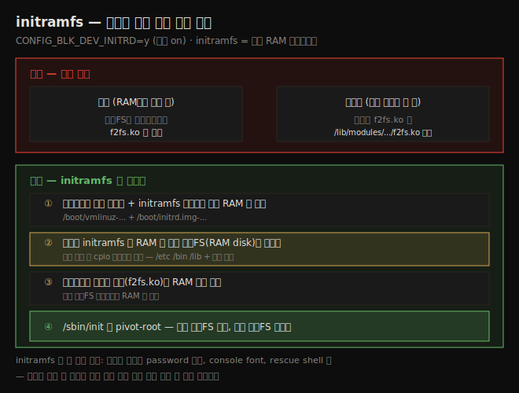
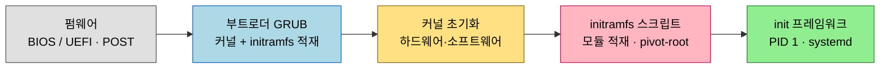

# 커널 빌드 (3) — 빌드·모듈 설치·initramfs·GRUB
---
> 커널 빌드 7단계 중 나머지 넷을 다룹니다. `make` 로 커널 이미지·모듈을 빌드하고(④), `make modules_install` 로 모듈을 설치하고(⑤), `make install` 로 initramfs 이미지 생성과 GRUB 설정을 하고(⑥), GRUB 을 커스터마이징(⑦)합니다. 핵심 개념은 initramfs 입니다 — 루트FS 마운트에 필요한 모듈이 아직 마운트 안 된 디스크 안에 있는 "닭과 달걀" 문제를 푸는 중간자입니다.

이 노트는 짝 노트(02-02)에서 끝낸 설정 단계 다음을 이어갑니다. 02-02 가 빌드 7단계 중 ①~③(소스 얻기·추출·설정)을 다뤘다면, 이 노트는 ④~⑦(빌드·모듈 설치·initramfs+GRUB·메뉴 커스터마이징)을 다루고 마지막에 새 커널로 부팅해 검증합니다.

전제는 `.config` 가 준비된 상태입니다. 아래 종합도는 이 노트의 핵심 — initramfs 가 부팅 시 닭과 달걀 문제를 어떻게 푸는지 — 를 한 장으로 보여줍니다.




## 1. Step 4 — 커널 이미지와 모듈 빌드

> 설정된 소스 루트에서 `make` 한 줄이면 됩니다. `-jn` 으로 병렬화하면 빠릅니다(n = CPU 코어 × 2). vmlinux(비압축)·bzImage(압축)·System.map 세 파일이 핵심 산출물입니다.

빌드는 사용자 입장에서 단순합니다. 설정된 소스 트리 루트에서 `make` 만 치면 커널 이미지와 모듈(임베디드면 DTB 도)이 빌드됩니다. kbuild 에서 `make` 는 `make all` 과 같습니다.

`make help` 로 `all` 이 빌드하는 타겟(`*` 표시)을 볼 수 있습니다.

```bash
$ make help
 [...]
* vmlinux  - Build the bare kernel
* modules - Build all modules
 [...]
 * bzImage - Compressed kernel image (arch/x86/boot/bzImage)
```

세 타겟의 의미는 다음과 같습니다.

1. **vmlinux**: 비압축 커널 이미지. 크고(디버그 빌드 시 매우 큼), 부팅에는 안 쓰지만 커널 디버깅에 필수이므로 보관합니다.
2. **modules**: `m` 으로 표시된 설정이 `.ko` 모듈로 빌드됩니다.
3. **bzImage**: x86 의 압축 커널 이미지. 부트로더가 RAM 에 적재·압축 해제·부팅하는 실제 이미지입니다.

### 병렬 빌드

현대 커널은 25~30M SLOC 규모라 빌드가 메모리·CPU 집약적입니다. `make -jn` 으로 병렬 프로세스를 띄웁니다. 경험칙은 다음과 같습니다.

```
n = CPU 코어 수 × factor
```

`factor` 는 보통 2(코어 수백~수천의 초고사양은 1.5)입니다. CPU 코어 수는 `nproc` 으로 확인합니다.

```bash
$ nproc
4
```

코어 4개면 `n = 4×2 = 8` 로 잡습니다. `tee` 로 출력을 파일에 동시 저장하면 좋습니다.

```bash
$ make -j8 2>&1 | tee out.txt
```

> VM 에서 빌드가 RAM 부족으로 실패하면, run level 3(`multi-user.target`, GUI 없는 멀티유저)로 부팅하거나 `sudo systemctl isolate multi-user.target` 로 전환해 RAM 을 아낍니다. SSH 로 접속해 콘솔에서 작업하는 것도 좋습니다.

### 흔한 빌드 오류 둘

1. **libelf 경고**: `Cannot use CONFIG_STACK_VALIDATION=y, please install libelf-dev` → `sudo apt install libelf-dev`.
2. **Ubuntu cert 오류**: `No rule to make target 'debian/canonical-revoked-certs.pem'` → `CONFIG_SYSTEM_REVOCATION_KEYS` 가 원인. 끄면 됩니다.
   ```bash
   scripts/config --disable SYSTEM_REVOCATION_KEYS
   ```

> 빌드가 실패하면 커널이 아니라 자신을 의심하세요. 필요 패키지가 다 설치됐는지, 설정이 온전한지, RAM·swap 이 충분한지, 하드웨어 문제(`internal compiler error: Segmentation fault`)는 아닌지 점검합니다. 최후엔 `make mrproper` 로 처음부터 다시 합니다.

### 산출물 확인

빌드가 끝나면 세 핵심 파일이 생깁니다.

```bash
$ ls -lh vmlinux System.map
-rw-rw-r-- 1 c2kp c2kp 4.8M May 16 16:12 System.map
-rwxrwxr-x 1 c2kp c2kp 704M May 16 16:12 vmlinux
$ ls -lh arch/x86/boot/bzImage
-rw-rw-r-- 1 c2kp c2kp 12M May 16 16:12 arch/x86/boot/bzImage
```

vmlinux 가 704M 로 거대한 이유는 커널 심볼과 디버그 정보를 담기 때문입니다. 실제 부팅 이미지인 bzImage 는 약 12M 입니다. 버전 문자열은 Makefile 타겟으로 확인합니다.

```bash
$ make kernelrelease kernelversion image_name
6.1.25-lkp-kernel
6.1.25
arch/x86/boot/bzImage
```


## 2. Step 5 — 커널 모듈 설치

> 빌드된 `.ko` 모듈은 `/lib/modules/$(uname -r)/` 에 설치돼야 부팅 시 적재됩니다. `sudo make modules_install` 한 줄입니다. 설치 위치는 `INSTALL_MOD_PATH` 로 바꿀 수 있습니다.

빌드된 `.ko` 모듈은 소스 트리 안에 있을 뿐, 루트FS 의 알려진 위치에 설치돼야 부팅 시 시스템이 찾아 적재합니다. 그 위치는 `/lib/modules/$(uname -r)/` 입니다. 소스 안 모듈은 `find` 로 찾을 수 있습니다.

```bash
$ find . -name "*.ko"
./crypto/crypto_simd.ko
[...]
./fs/vboxsf/vboxsf.ko
```

설치는 한 줄입니다.

```bash
$ sudo make modules_install
 INSTALL /lib/modules/6.1.25-lkp-kernel/kernel/arch/x86/crypto/aesni-intel.ko
  SIGN    /lib/modules/6.1.25-lkp-kernel/kernel/arch/x86/crypto/aesni-intel.ko
[ … ]
  DEPMOD  /lib/modules/6.1.25-lkp-kernel
```

세 가지를 짚습니다.

1. **`sudo` 필요**: 기본 설치 위치(`/lib/modules/`)는 root 만 쓸 수 있습니다.
2. **SIGN(서명)**: `CONFIG_MODULE_SIG` 가 켜져 있으면 모듈에 암호 서명을 합니다. `CONFIG_MODULE_SIG_FORCE` 가 on 이면 올바르게 서명된 모듈만 적재됩니다.
3. **depmod**: 모듈 간 의존성을 해석해 메타파일에 기록합니다.

설치 후 `/lib/modules/` 아래에 커널 릴리스 이름의 폴더가 생깁니다.

```bash
$ ls /lib/modules
5.19.0-40-generic/  5.19.0-41-generic/  6.1.25-lkp-kernel/
```

### 설치 위치 재정의

`INSTALL_MOD_PATH` 환경변수로 설치 위치를 바꿉니다. 임베디드 타깃용 모듈을 호스트의 모듈 위에 덮어쓰면 재앙이므로, 이 재정의가 중요합니다.

```bash
export STG_MYKMODS=../staging/rootfs/my_kernel_modules
make INSTALL_MOD_PATH=${STG_MYKMODS} modules_install
```


## 3. Step 6 — initramfs 이미지 생성과 부트로더 설정

> x86 에서 `sudo make install` 한 줄이 initramfs 이미지 생성과 GRUB 설정을 동시에 합니다. `/boot` 에 vmlinuz·initrd.img·config·System.map 이 설치되고 GRUB 설정이 갱신됩니다.

x86 데스크톱/서버에서 이 단계는 내부적으로 둘(initramfs 생성 + GRUB 설정)로 나뉘지만, 편의 스크립트가 둘을 한 번에 처리해 한 단계처럼 보입니다.

```bash
$ sudo make install
  INSTALL /boot
[ … ]
update-initramfs: Generating /boot/initrd.img-6.1.25-lkp-kernel
[ … ]
Found linux image: /boot/vmlinuz-6.1.25-lkp-kernel
Found initrd image: /boot/initrd.img-6.1.25-lkp-kernel
[ … ]
done
```

`sudo` 가 필요한 이유는 `/boot` 에 파일을 쓰기 때문입니다. 저장 위치는 `INSTALL_PATH` 로 바꿀 수 있습니다(임베디드 빌드 시).

### 내부 동작

`make install` 은 `scripts/install.sh` 를 호출하고, x86 에서는 `arch/x86/boot/install.sh` 가 `/boot` 에 다음을 복사합니다.

```
/boot/config-6.1.25-lkp-kernel
/boot/System.map-6.1.25-lkp-kernel
/boot/initrd.img-6.1.25-lkp-kernel
/boot/vmlinuz-6.1.25-lkp-kernel
```

initramfs 이미지는 Ubuntu 의 `update-initramfs`(내부적으로 `mkinitramfs`)가 만듭니다. 이미지의 정체는 **cpio 아카이브(newc 포맷)를 gzip 압축**한 것입니다.

```bash
find my_initramfs/ | sudo cpio -o --format=newc -R root:root | gzip -9 > initramfs.img
```

> `vmlinuz` 의 이름 유래: 옛 Unix 가 커널을 `vmunix` 라 불러서 Linux 는 `vmlinux`, 압축본은 `vmlinuz`(z 는 gzip 압축 힌트)로 부릅니다. 현대 x86 의 기본 압축은 gzip 이 아니라 더 빠른 ZSTD 지만 이름 관례는 그대로입니다.


## 4. initramfs 프레임워크 — 닭과 달걀 문제

> initramfs 는 이른 커널 부팅과 유저 모드 사이의 중간자입니다. 실제 루트FS 가 마운트되기 전에 유저 공간 앱·스크립트를 돌릴 수 있게 해줍니다. 핵심 용도는 루트FS 드라이버 모듈을 미리 적재하는 것입니다.

initramfs 사용은 선택입니다(`CONFIG_BLK_DEV_INITRD`, 기본 y). 부팅 디스크 컨트롤러 종류나 루트FS 포맷(ext4·btrfs·f2fs 등)을 미리 모르거나, 그 기능이 모듈로 빌드된 시스템에 필요합니다.

### 닭과 달걀

배포판을 만든다고 상상해 봅니다. 사용자가 SSD 를 f2fs 로 포맷할 수 있으니, 가능한 모든 파일시스템 모듈을 미리 빌드해 제공합니다. 그런데 부팅 시 문제가 생깁니다.

1. 커널은 RAM 에서 돌지만, 루트FS 를 마운트하려면 `f2fs.ko` 모듈이 필요합니다.
2. 그런데 `f2fs.ko` 는 아직 마운트 안 된 **루트FS 안**(`/lib/modules/.../f2fs.ko`)에 있습니다.

루트FS 를 마운트하려면 모듈이 필요한데, 그 모듈이 루트FS 안에 있는 순환입니다. (이 흐름은 위 종합도 SVG 참조.)

### 해결

initramfs 가 중간자로 이 순환을 끊습니다.

1. 부트로더가 커널 이미지 + initramfs 이미지를 함께 RAM 에 적재합니다.
2. 커널이 initramfs 를 RAM 에 임시 루트FS(RAM disk)로 마운트합니다.
3. 스크립트가 필요한 모듈(`f2fs.ko`)을 RAM 으로 적재합니다.
4. `/sbin/init` 이 **pivot-root** 로 임시 루트FS 를 해제하고 실제 루트FS 를 마운트합니다.

initramfs 의 다른 쓰임도 많습니다 — console font 설정, 키보드 레이아웃, 암호화 디스크 password 입력, 모듈 적재, rescue shell 등. 핵심은 **커널이 평소 못 돌리는 유저 모드 앱을 부팅 중에 돌릴 수 있게** 한다는 것입니다. 암호화 디스크가 좋은 예입니다 — password 를 받는 C 프로그램을 돌리려면 C 런타임(라이브러리·로더·모듈)이 필요한데, initramfs 가 그 임시 환경을 RAM 에 차려 줍니다.

### x86 부팅 과정

x86 데스크톱/서버의 전형적 부팅 흐름입니다.

1. **펌웨어**: 레거시 BIOS 또는 현대 UEFI 가 POST 후 부트로더를 적재합니다.
2. **부트로더(GRUB)**: 커널 이미지(`/boot/vmlinuz-...`)와 initramfs(`/boot/initrd.img-...`)를 RAM 에 적재하고, 커널을 일부 압축 해제한 뒤 커널 진입점으로 점프합니다.
3. **커널 초기화**: 하드웨어·소프트웨어 환경을 초기화합니다. `CONFIG_BLK_DEV_INITRD=y` 면 initramfs 를 RAM 에 임시 루트FS 로 마운트합니다.
4. **initramfs 스크립트**: 필요한 모듈을 적재하고, `/sbin/init` 이 pivot-root 로 실제 루트FS 로 전환합니다.
5. **init 프레임워크**: 첫 유저 프로세스(PID 1)가 시작됩니다. 현대는 SysV init 대신 systemd 입니다.

이 흐름을 한눈에 보면 다음과 같습니다.



> BIOS vs UEFI 차이: UEFI 는 x86 전용이 아니고, 서명된 OS 만 부팅(Secure Boot), ESP 별도 파티션 사용, 부팅이 빠르고, 2.2TB 초과 디스크 지원(BIOS 는 2.2TB 한계). BIOS 는 16비트 코드, UEFI 는 32/64비트 GUI 가능.

### initramfs 들여다보기

Ubuntu 의 `lsinitramfs`(Fedora 는 `lsinitrd`)로 이미지 내용을 봅니다.

```bash
$ lsinitramfs /boot/initrd.img-6.1.25-lkp-kernel | wc -l
364
$ lsinitramfs /boot/initrd.img-6.1.25-lkp-kernel
[ ... ]
bin
etc/modprobe.d/alsa-base.conf
lib64
sbin
usr/bin/cpio
usr/lib/modules/6.1.25-lkp-kernel/kernel/fs/f2fs/f2fs.ko
usr/sbin/modprobe
[ ... ]
```

`/etc`, `/bin`, `/sbin`, `/usr`, 라이브러리, 모듈을 갖춘 최소 루트FS 임을 볼 수 있습니다. (older initrd 와 newer initramfs 의 차이는 생성 방식 — initramfs 는 `--format=newc` 를 씁니다.)


## 5. Step 7 — GRUB 부트로더 커스터마이징

> 현대 GRUB 은 기본적으로 메뉴 없이 새 커널로 바로 부팅합니다. `/etc/default/grub` 을 편집해 매번 메뉴를 띄우거나 기본 커널을 바꿀 수 있습니다. 편집 후 `sudo update-grub` 으로 반영합니다.

기본 GRUB 은 메뉴를 안 보여주고 새로 빌드한 커널로 바로 부팅합니다(x86 Ubuntu 기준). 부팅 중 `Shift`(UEFI 면 `Esc`)를 누르면 메뉴가 뜹니다. 매번 메뉴를 보려면 `/etc/default/grub` 을 편집합니다.

```bash
sudo cp /etc/default/grub /etc/default/grub.orig   # 백업
sudo vi /etc/default/grub
```

주요 디렉티브는 다음과 같습니다.

| 디렉티브 | 의미 |
|----------|------|
| `GRUB_HIDDEN_TIMEOUT_QUIET=false` | 부팅 시 항상 GRUB 프롬프트 표시 |
| `GRUB_TIMEOUT_STYLE=menu` | (배포판에 따라) hidden→menu 로 변경 시 같은 효과 |
| `GRUB_TIMEOUT=3` | 기본 OS 부팅 대기(초). 0=즉시, -1=무한 대기 |
| `GRUB_DEFAULT=0` | 기본 부팅 커널. 0=가장 최근 추가된 커널 |

기본 커널을 배포판 커널로 바꾸려면 `GRUB_DEFAULT` 를 메뉴 경로로 지정합니다.

```bash
GRUB_DEFAULT="Advanced options for Ubuntu>Ubuntu, with Linux 5.19.0-43-generic"
```

편집 후 반드시 반영합니다.

```bash
sudo update-grub
```

> 보안: 항상 메뉴 표시는 개발·테스트엔 좋지만 프로덕션은 속도·보안상 끕니다. 펌웨어(BIOS/UEFI)와 부트로더 접근은 password 로 보호해야 합니다. Fedora 는 `sudo grub2-editenv - unset menu_auto_hide` 를 씁니다.

### GRUB 프롬프트 실험

원본 배포판 커널은 지우지 말고 두세요 — 새 커널이 부팅 실패하면 fallback 이 됩니다. GRUB 메뉴에서 커널 항목을 highlight 하고 `e`(편집)를 누르면 부팅 파라미터를 고칠 수 있습니다.

1. **Exercise 1**: `linux` 로 시작하는 줄에서 `quiet`·`splash` 를 지우고 `Ctrl+X`/`F10` 으로 부팅하면, splash 없이 콘솔에서 커널 메시지가 흐르는 걸 봅니다.
2. **Exercise 2 (password 재설정)**: `linux` 줄 끝에 `single`(또는 `1`)을 붙여 부팅하면 single-user 모드로 root 셸을 얻습니다. `passwd <username>` 으로 password 를 바꿉니다.

> 이것이 보안을 가르칩니다 — 부트로더 메뉴(나아가 BIOS/UEFI) 접근이 password 없이 가능하면 시스템은 안전하지 않습니다. 고보안 환경에선 콘솔 물리 접근도 제한합니다.


## 6. 새 커널 검증

> 부팅했다고 끝이 아닙니다. `uname -r` 로 버전을, `extract-ikconfig` 나 `/proc/config.gz` 로 설정이 의도대로인지 확인합니다.

경험주의가 최선입니다 — 새 커널로 부팅한 뒤 실제로 확인합니다.

```bash
$ uname -r
6.1.25-lkp-kernel
$ uname -m ; uname -o
x86_64
GNU/Linux
```

02-02 에서 바꾼 설정(`CONFIG_LOCALVERSION`, `CONFIG_IKCONFIG`, `CONFIG_HZ=300`)이 반영됐는지 봅니다. `CONFIG_IKCONFIG` 를 켰으므로 `extract-ikconfig` 스크립트나 `/proc/config.gz` 로 현재 커널 설정을 조회할 수 있습니다.

```bash
$ scripts/extract-ikconfig /boot/vmlinuz-6.1.25-lkp-kernel | grep -E "LOCALVERSION|CONFIG_HZ"
CONFIG_LOCALVERSION="-lkp-kernel"
CONFIG_HZ_300=y
CONFIG_HZ=300
```

또는 `/proc/config.gz` 로도 같은 검증을 합니다.

```bash
gunzip -c /proc/config.gz | grep -E "LOCALVERSION|CONFIG_HZ"
```

의도한 설정이 정확히 반영됐습니다. x86 커널 빌드가 끝났습니다.

> 짚을 점: 새 커널로 부팅해도 루트FS 와 다른 마운트는 그대로입니다. 커널(과 initramfs)만 바뀝니다. 이는 Unix 의 커널-루트FS 느슨한 결합 덕분입니다 — 같은 베이스 시스템에 여러 커널을 둘 수 있습니다.


## 다음 단계

> x86 빌드를 마쳤으니 다음 노트에서 다른 아키텍처(ARM)로 크로스 컴파일합니다.

여기까지 빌드 7단계를 모두 마치고 새 커널로 부팅·검증했습니다. 다음 노트는 호스트와 다른 아키텍처용 커널을 만드는 크로스 컴파일을 다룹니다.

1. **Raspberry Pi AArch64 크로스 컴파일**: 소스 clone, x86_64→AArch64 툴체인 설치, `ARCH`/`CROSS_COMPILE` 설정.
2. **빌드 팁**: deb/rpm 패키징, verbose 빌드(`V=1`), 최소 버전 요구, 패닉 대응.


## 관련 문서

> 이 노트는 빌드 마무리편입니다. 앞 단계(소스·설정)는 02-02 가, 크로스 컴파일은 다음 노트가 잇습니다.

- [02-02.커널 빌드 (2) — 다운로드·설정과 Kconfig/Kbuild](./02-02.커널%20빌드%20(2)%20—%20다운로드·설정과%20Kconfig·Kbuild.md) — 빌드 ①~③ (소스·추출·설정)
- [03-02.커널 빌드 (4) — Raspberry Pi 크로스 컴파일과 빌드 팁](./03-02.커널%20빌드%20(4)%20—%20Raspberry%20Pi%20크로스%20컴파일과%20빌드%20팁.md) — ARM 크로스 컴파일 (짝 노트)
- [00-00.책 개요와 학습 로드맵](./00-00.책%20개요와%20학습%20로드맵.md) — 3섹션·13챕터 전체 지도
