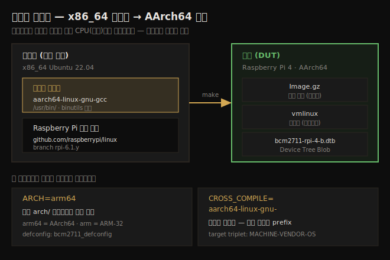

# 커널 빌드 (4) — Raspberry Pi 크로스 컴파일과 빌드 팁
---
> 호스트(x86_64)와 다른 아키텍처(AArch64) 커널을 만드는 크로스 컴파일입니다. Raspberry Pi 4 를 타깃으로, 소스 clone → 크로스 툴체인 설치 → `ARCH`/`CROSS_COMPILE` 설정 후 빌드 세 단계를 거칩니다. `ARCH` 는 어느 `arch/` 디렉토리를 쓸지, `CROSS_COMPILE` 은 어느 툴체인을 쓸지 정합니다. 마지막에 deb/rpm 패키징·verbose 빌드 같은 실무 팁을 정리합니다.

이 노트는 짝 노트(03-01)의 x86 빌드를 마친 뒤, 호스트와 다른 CPU 용 커널을 만드는 크로스 컴파일을 다룹니다. 호스트에서 빌드한 코드가 타깃 CPU 에서 실행되며, 이것이 임베디드 Linux 개발의 정석입니다.

타깃은 ARM 기반 Raspberry Pi 4 Model B(64비트)이고, 빌드는 x86_64 Ubuntu 게스트 VM 에서 합니다. 아래 종합도가 이 노트의 핵심 — 호스트·타깃·두 환경변수의 역할 — 을 한 장으로 보여줍니다.



> 커널을 타깃에 빌드하는 방법은 둘입니다 — ① 강력한 호스트(x86_64)에서 빌드, ② 타깃 기기에서 직접 빌드. 이 노트는 ①(크로스 컴파일)을 따릅니다. 더 빠르고 임베디드 개발의 올바른 방법입니다.


## 1. Step 1 — Raspberry Pi 커널 소스 clone

> Raspberry Pi 전용 커널 트리를 GitHub 에서 clone 합니다. `--depth=1` 로 다운로드를 줄이고, 6.1 LTS 와 맞는 `rpi-6.1.y` 브랜치를 고릅니다.

작업 폴더를 환경변수로 잡고(하드코딩 회피) 디스크 공간을 확보합니다. Raspberry Pi Git 트리는 약 1.7GB, 툴체인은 40MB 남짓, deb 패키지까지 만들면 1GB+ 가 더 필요하므로 7~8GB 여유를 둡니다.

```bash
export RPI_STG=~/rpi_work
mkdir -p ${RPI_STG}/kernel_rpi
```

공식 Raspberry Pi GitHub 에서 clone 합니다.

```bash
cd ${RPI_STG}/kernel_rpi
git clone --depth=1 --branch=rpi-6.1.y \
  https://github.com/raspberrypi/linux.git
```

두 가지를 짚습니다.

1. **브랜치 `rpi-6.1.y`**: 최신(예: rpi-6.8.y)이 아니라 6.1 을 고릅니다 — LTS 이고 x86 빌드와도 맞기 때문입니다.
2. **`--depth=1`**: 히스토리를 줄여 다운로드·압축 해제 부담을 낮춥니다.

clone 후 버전을 확인합니다.

```bash
$ cd ${RPI_STG}/kernel_rpi/linux ; head -n5 Makefile
VERSION = 6
PATCHLEVEL = 1
SUBLEVEL = 34
EXTRAVERSION =
```

6.1.34 Raspberry Pi 포트입니다(x86 은 6.1.25 — 소소한 차이는 괜찮습니다).


## 2. Step 2 — x86_64→AArch64 크로스 툴체인 설치

> 현대 배포판은 크로스 컴파일 패키지를 바로 제공합니다. `gcc-aarch64-linux-gnu` 와 `binutils-aarch64-linux-gnu` 를 설치하면 `/usr/bin/` 에 `aarch64-linux-gnu-` 접두사 도구들이 깔립니다.

호스트(x86 Ubuntu VM)에 크로스 툴체인을 설치합니다. Debian/Ubuntu 는 바로 쓸 수 있는 크로스 빌드 패키지를 제공합니다.

```bash
$ sudo apt install gcc-aarch64-linux-gnu binutils-aarch64-linux-gnu
```

크로스 도구는 `/usr/bin/` 에 설치돼 이미 PATH 에 있고, 모두 `aarch64-linux-gnu-` 로 시작합니다. 이 접두사를 **크로스 컴파일러 접두사(toolchain prefix)** 라 하며 `CROSS_COMPILE` 환경변수에 넣습니다.

### 접두사 명명 규칙

접두사에는 규칙이 있습니다.

```
MACHINE-VENDOR-OS-      (target triplet, 3요소)
<CPU>-<MANUFACTURER>[-<KERNEL>]-<OS>-
```

`aarch64-linux-gnu-` 는 target triplet(3요소)입니다 — MACHINE=`aarch64`(ARM 64비트), VENDOR=`linux`, OS=`gnu`.

> ARM-32 가 목표면 `sudo apt install gcc-arm-linux-gnueabihf binutils-arm-linux-gnueabihf` 를 설치합니다(`hf` = hard float). 대안 툴체인은 ARM developer 사이트에도 있습니다.


## 3. Step 3 — Raspberry Pi AArch64 커널 설정·빌드

> `ARCH=arm64` 와 `CROSS_COMPILE=aarch64-linux-gnu-` 를 매 make 에 넘깁니다. 보드별 `bcm2711_defconfig` 로 시작하고 `all` 타겟으로 커널·모듈·DTB 를 빌드합니다.

두 환경변수를 반드시 이해합니다.

| 환경변수 | 의미 |
|----------|------|
| `ARCH` | 크로스 컴파일 대상 CPU. `arch/` 아래 디렉토리 이름. arm64=AArch64, arm=ARM-32, powerpc=PowerPC |
| `CROSS_COMPILE` | 툴체인 접두사. Makefile 이 `${CROSS_COMPILE}<utility>` 로 도구를 호출 |

### 설정

```bash
cd ${RPI_STG}/kernel_rpi/linux
make mrproper
KERNEL=kernel8
make ARCH=arm64 bcm2711_defconfig
```

`bcm2711_defconfig` 는 Raspberry Pi 3/3+/4/400/Zero 2 W 등의 Broadcom SoC 용 올바른 보드별 config 입니다(02-02 의 "임베디드는 검증된 보드 defconfig 로 시작" 원칙). `kernel8` 은 프로세서가 ARMv8(64비트)이기 때문입니다.

추가 설정이 필요하면 `make ARCH=arm64 menuconfig` 를, 아니면 건너뜁니다.

### 빌드

```bash
make -j8 ARCH=arm64 CROSS_COMPILE=aarch64-linux-gnu- all
```

`all` 타겟이 빌드하는 것은 `help` 의 `*` 표시 타겟입니다.

```bash
$ make ARCH=arm64 help | grep "^\*"
* vmlinux      - Build the bare kernel
* modules      - Build all modules
* dtbs             - Build device tree blobs for enabled boards
* Image.gz      - Compressed kernel image (arch/arm64/boot/Image.gz)
```

빌드 후 주요 산출물입니다.

```bash
$ ls -lh vmlinux System.map arch/arm64/boot/Image* arch/arm64/boot/dts/broadcom/bcm2711-rpi-4-b.dtb
-rw-rw-r-- 1 c2kp c2kp  54K ... arch/arm64/boot/dts/broadcom/bcm2711-rpi-4-b.dtb
-rw-rw-r-- 1 c2kp c2kp  22M ... arch/arm64/boot/Image
-rw-rw-r-- 1 c2kp c2kp 7.9M ... arch/arm64/boot/Image.gz
-rwxrwxr-x 1 c2kp c2kp 237M ... vmlinux
```

1. **Image.gz**: 압축 커널 이미지 — 부팅용. `Image` 는 그 비압축 버전.
2. **vmlinux**: 비압축 커널 이미지 — 디버깅용, 보관.
3. **bcm2711-rpi-4-b.dtb**: 이 타깃 플랫폼의 DTB(Device Tree Blob).

`file` 로 vmlinux 가 AArch64 용임을 확인합니다.

```bash
$ file ./vmlinux
./vmlinux: ELF 64-bit LSB pie executable, ARM aarch64, version 1 (SYSV), statically linked, [...] not stripped
```

> 여기서는 호스트와 다른 아키텍처용으로 커널을 빌드(크로스 컴파일)하는 법만 보였습니다. 이미지·모듈·DTB 를 microSD 에 올리는 상세는 공식 Raspberry Pi 문서를 따릅니다.


## 4. 빌드 팁

> 패키징(deb/rpm)으로 다른 사이트에 배포하고, `V=1` 로 빌드 명령을 들여다보고, 최소 버전 요구를 맞춥니다. 빌드/부팅 실패 시 점검 순서도 정리합니다.

### 다른 사이트용 빌드 — 패키징

다른 사이트·고객 시스템용 커널은 수동으로 옮기지 말고 패키지로 묶습니다. Makefile 에 패키징 타겟이 있습니다.

| 타겟 | 결과 |
|------|------|
| `deb-pkg` / `bindeb-pkg` | Debian deb 패키지(소스+바이너리 / 바이너리만) |
| `rpm-pkg` / `binrpm-pkg` | Red Hat RPM 패키지 |
| `tar-pkg` / `targz-pkg` | 타르볼 |

예를 들어 AArch64 Raspberry Pi 4 용 deb 패키지를 만듭니다.

```bash
make -j8 ARCH=arm64 CROSS_COMPILE=aarch64-linux-gnu- bindeb-pkg
```

`debian/` 폴더가 채워지고, 패키지 파일은 소스 디렉토리 바로 위에 생깁니다. 다른 (CPU·배포판이 맞는) 시스템에 `sudo dpkg -i <package>` 로 설치합니다.

### verbose 빌드

`V=1` 을 넘기면 실행되는 명령·GCC 플래그를 모두 봅니다. 빌드 실패 디버깅이나 컴파일 옵션 학습에 유용합니다.

```bash
make -j8 V=1 ARCH=arm64 CROSS_COMPILE=aarch64-linux-gnu- all 2>&1 | tee out.txt
```

> `tee -a <file>` 는 덮어쓰지 않고 이어붙입니다.

### 빌드 단축 구문

패키지가 설치되고 설정이 끝났다면, 비대화식 스크립트용 단축 구문입니다.

```bash
time make -j8 [ARCH=<...> CROSS_COMPILE=<...>] all && \
 sudo make modules_install && \
 sudo make install
```

`cmd1 && cmd2` 는 cmd1 성공 시 cmd2 실행, `cmd1 || cmd2` 는 cmd1 실패 시 cmd2 실행입니다.

### 최소 버전 요구

빌드하려면 툴체인이 문서화된 최소 버전을 충족해야 합니다(`Documentation/process/changes.rst`). 집필 시점 권장 최소는 gcc 5.1, Clang 11.0.0, make 3.82 등입니다.

> OpenSSL 헤더 누락(`fatal error: openssl/opensslv.h: No such file`)은 `libssl-dev`(Fedora 는 `openssl-devel`) 설치로 해결합니다. v4.3+(모듈 서명 시 3.7+)부터 OpenSSL 개발 패키지가 필요합니다.

### 설치된 배포판 커널 조회

디스크 공간 회수 등으로 설치된 커널을 알아야 할 때입니다.

```bash
dpkg --list | grep linux-image     # Debian/Ubuntu
dnf list installed kernel          # Red Hat/Fedora
```

(패키지 기반 커널만 — 수동 빌드한 것은 안 나옵니다.)

### 부팅 실패 — 커널 패닉

빌드·initramfs 생성이 다 잘됐는데 부팅이 패닉으로 끝나는 경우입니다.

```
Kernel panic - not syncing: Attempted to kill init!
Kernel panic - not syncing: No working init found.
```

원인은 보통 커널 설정 오류, 커널 커맨드라인(특히 root 디바이스) 오류, 실제 루트FS 마운트 실패입니다.

### Linux 빌더 프로젝트

전체 Linux 시스템·배포판을 빌드하는 프레임워크가 있습니다(임베디드용). 집필 시점 **Yocto** 가 업계 표준, **Buildroot** 가 오래됐지만 잘 지원됩니다. 실제 프로젝트에선 별도 BSP 팀이나 Yocto 가 빌드의 기계적 부분을 처리하는 경우가 많지만, 커널을 프로젝트에 맞게 설정하는 능력은 여전히 여기서 얻은 지식이 필요합니다.

> 최후의 수단: 못 고치는 빌드·부팅 오류는 정확한 메시지를 검색 엔진에 `linux kernel build <ver> fails with <message>` 형태로 검색하면 의외로 자주 해결됩니다.


## 다음 단계

> 커널 빌드 두 챕터를 모두 마쳤습니다. 다음은 커널 모듈(LKM) 작성입니다.

커널 빌드(Ch 2~3)를 끝냈습니다. 소스를 받아 설정·빌드하고, x86 에서 부팅·검증하고, ARM 으로 크로스 컴파일까지 했습니다. 다음 두 챕터(Ch 4~5)는 본격적인 커널 개발 — 첫 커널 모듈(LKM) 작성 — 으로 들어갑니다.

1. **Ch 4 (첫 모듈 Part 1)**: LKM 프레임워크, "Hello, world" 모듈, `printk` 로깅, dynamic debug.
2. **Ch 5 (첫 모듈 Part 2)**: 더 나은 Makefile, 모듈 크로스 컴파일, 모듈 파라미터, 자동 적재.


## 관련 문서

> 이 노트는 크로스 컴파일편입니다. x86 빌드는 03-01 이, 첫 모듈은 다음 챕터가 잇습니다.

- [03-01.커널 빌드 (3) — 빌드·모듈 설치·initramfs·GRUB](./03-01.커널%20빌드%20(3)%20—%20빌드·모듈%20설치·initramfs·GRUB.md) — x86 빌드 마무리 (짝 노트)
- [02-02.커널 빌드 (2) — 다운로드·설정과 Kconfig/Kbuild](./02-02.커널%20빌드%20(2)%20—%20다운로드·설정과%20Kconfig·Kbuild.md) — 임베디드 defconfig·Device Tree 배경
- [00-00.책 개요와 학습 로드맵](./00-00.책%20개요와%20학습%20로드맵.md) — 3섹션·13챕터 전체 지도
