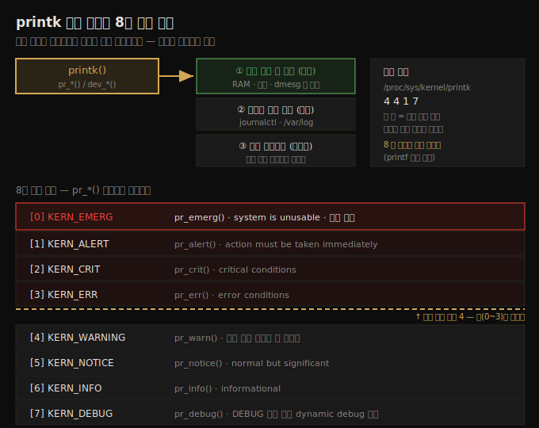
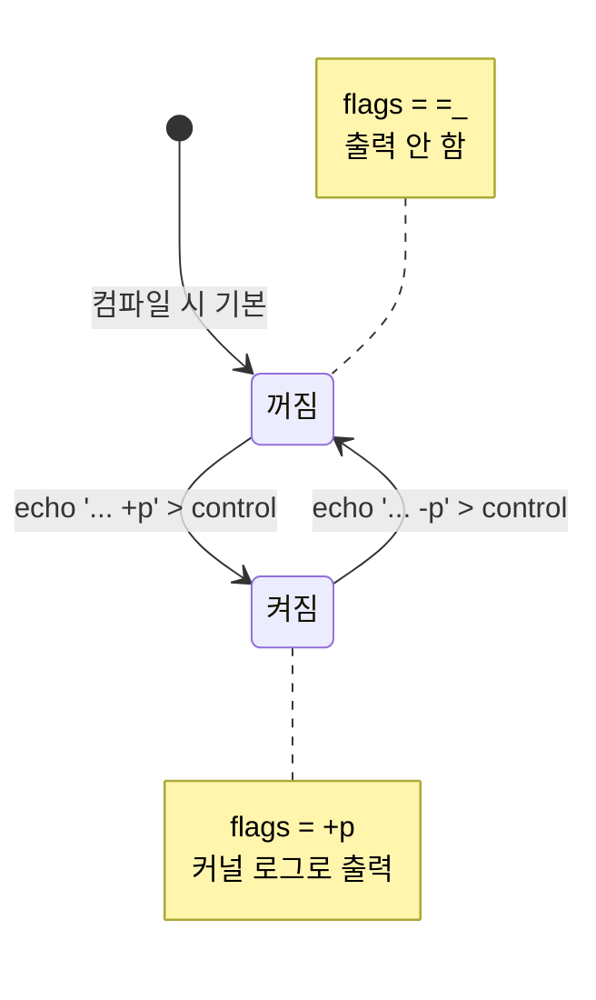

# 첫 커널 모듈 (2) — printk 로깅과 Makefile
---
> 커널에는 유저 모드 라이브러리가 없어 `printf` 대신 `printk`(와 `pr_*()`/`dev_*()` 매크로)를 씁니다. printk 출력은 항상 RAM 의 로그 링 버퍼로 가고, 보통 비휘발 파일에도 가며, 콘솔 로그 레벨보다 낮은(긴급한) 메시지는 콘솔에도 갑니다. 로그 레벨은 0(EMERG)~7(DEBUG) 8단계입니다. dynamic debug 로 디버그 print 를 런타임에 켤 수 있고, rate limiting 으로 폭주를 막습니다. 모듈 Makefile 은 `obj-m` 과 Kbuild 재귀 빌드로 동작합니다.

이 노트는 짝 노트(04-01)에서 만든 첫 모듈을 바탕으로, 로깅과 빌드 구조를 깊이 봅니다. printk 는 커널/드라이버 개발의 1차 디버그 도구이므로 정확히 이해하는 게 중요합니다. 아래 종합도가 이 노트의 핵심 — printk 출력 3경로와 8개 로그 레벨, 콘솔 필터링 — 입니다.




## 1. printk 와 출력 경로

> 커널에는 유저 라이브러리가 없어 `printf` 를 못 씁니다. `printk` 가 그 자리를 대신하며, 출력은 RAM 로그 버퍼·로그 파일·콘솔 최대 3곳으로 갑니다.

유저 공간은 `printf()`(glibc)를 쓰지만, **커널 공간에는 (유저 모드) 라이브러리가 없습니다**. 그래서 `printf` 가 커널 안에 `printk` 로 재구현됐습니다(`include/linux/printk.h` 매크로, `kernel/printk/printk.c:_printk()`).

사용법은 `printf` 와 비슷하지만 출력 목적지가 다릅니다.

```c
printk(KERN_INFO "Hello, world\n");
```

`printf` 는 포맷해서 `write()` 로 stdout(터미널)에 쓰지만, `printk` 는 최소 한 곳, 가능하면 더 많은 곳에 씁니다.

1. **RAM 의 커널 로그 링 버퍼** (항상).
2. **비휘발 로그 파일** (보통).
3. **콘솔 디바이스** (조건부).

> GUI 모드(X server)에서는 printk 출력이 직접 안 보입니다. `dmesg` 로 로그 버퍼를 봅니다 — 단 최근 배포판은 `dmesg_restrict` sysctl 로 일반 사용자 조회를 막아 `sudo dmesg` 가 필요합니다.

```bash
$ sudo dmesg | tail -n2
[39884.691954] Hello, world
```

> dmesg 의 `[초.마이크로초]` 는 부팅 후 경과 시간입니다(`CONFIG_PRINTK_TIME`). out-of-tree 모듈을 끼우면 "taints kernel"(오염) 메시지가 나올 수 있는데, 무시해도 됩니다 — 일종의 법적 면책 표시입니다.


## 2. 로그 링 버퍼와 journalctl

> 로그 버퍼는 RAM 의 고정 크기 링 버퍼라 휘발적이고 작습니다(기본 256KB). 그래서 systemd 의 journal 이 모든 로그를 비휘발 파일에 병합 저장합니다.

커널 로그 버퍼는 커널 VAS 안의 메모리 버퍼(`__log_buf[]`)입니다. **링(원형) 버퍼**라 가득 차면 0번 바이트부터 덮어씁니다. 크기는 `CONFIG_LOG_BUF_SHIFT`(기본 18 → 2^18 = 256KB)로 정해지고, `log_buf_len` 커널 파라미터로 덮어쓸 수 있습니다.

두 가지 한계가 있습니다.

1. **휘발성**: RAM 이라 크래시·전원 차단 시 로그를 잃습니다.
2. **작은 크기**: 기본 256KB 라 대량 print 가 버퍼를 덮어써 정보를 잃습니다.

해결은 모든 printk 를 비휘발 파일에 append 하는 것입니다. systemd 의 **journal**(`systemd-journal` 데몬, `journalctl` 인터페이스)이 이를 합니다. 장점은 앱·라이브러리·데몬·커널 로그가 한 곳에 **병합**돼 시간순 타임라인을 볼 수 있다는 것입니다.

```bash
$ journalctl -b -k --no-pager | tail -n2   # 이번 부팅 커널 로그
journalctl -k --since="30 min ago"          # 최근 30분 커널 로그
journalctl -f -k                            # 라이브 watch (tail -f 처럼)
```

기본 로그 포맷은 `[timestamp] [hostname] [source]: [message]` 입니다. `-b` 는 이번 부팅만, `--no-pager` 는 grep 등으로 추가 필터링 가능하게 합니다.


## 3. 로그 레벨과 pr_*() 매크로

> 로그 레벨은 우선순위가 아니라 **필터 기준**입니다. 8단계(0 EMERG ~ 7 DEBUG)이며, `KERN_INFO` 같은 토큰은 메시지에 붙는 문자열일 뿐입니다. `pr_*()` 매크로로 간결하게 씁니다.

`printk(KERN_INFO "Hello, world\n")` 의 `KERN_INFO` 는 **파라미터가 아닙니다**(쉼표 없이 공백으로 붙음). 8개 로그 레벨 중 하나로, 메시지에 prefix 되는 문자열("0"~"7")일 뿐입니다 — 우선순위가 아니라 필터 기준입니다.

| 레벨 | 매크로 | 의미 |
|------|--------|------|
| 0 KERN_EMERG | `pr_emerg()` | system is unusable · 항상 콘솔 |
| 1 KERN_ALERT | `pr_alert()` | action must be taken immediately |
| 2 KERN_CRIT | `pr_crit()` | critical conditions |
| 3 KERN_ERR | `pr_err()` | error conditions |
| 4 KERN_WARNING | `pr_warn()` | warning · 레벨 미지정 시 기본값 |
| 5 KERN_NOTICE | `pr_notice()` | normal but significant |
| 6 KERN_INFO | `pr_info()` | informational |
| 7 KERN_DEBUG | `pr_debug()` | debug-level |

`printk(KERN_FOO ...)` 의 투박함을 `pr_foo(...)` 가 대신합니다(`include/linux/printk.h`). 권장됩니다. 로그 레벨 미지정 시 기본은 4(KERN_WARNING)지만, 항상 적절한 레벨을 지정하는 게 좋습니다.

> 연속 메시지는 `pr_cont()` 로 이어 붙입니다 — 마지막 `pr_cont()` 에만 `\n` 을 둡니다. **드라이버 작성자는 `dev_*()` 매크로를 써야 합니다** — 첫 인자로 `struct device *` 를 넘기면, 드라이버 코어가 드라이버명·버스 번호·칩 주소 등을 자동 prefix 해 더 나은 로그를 만듭니다.

> 깜빡한 surprise 를 피하려면 printk 를 항상 `\n` 으로 끝내는 습관을 들입니다(printf 도 마찬가지).


## 4. 콘솔 출력 제어

> `/proc/sys/kernel/printk` 의 첫 값(콘솔 로그 레벨)보다 낮은 레벨이 콘솔로 갑니다. 이 값을 8 로 올리면 모든 printk 가 콘솔에 나와 `printf` 처럼 동작합니다.

콘솔은 비그래픽 환경의 최초 터미널(`/dev/console`)입니다. 임베디드 개발에서는 USB-serial 케이블로 연결한 직렬 포트가 콘솔이 되는 경우가 많습니다. printk 는 sysctl(proc)로 조건부로 콘솔에 로그를 보냅니다.

```bash
$ cat /proc/sys/kernel/printk
4    4    1    7
```

네 정수의 의미는 다음과 같습니다.

1. **현재 콘솔 로그 레벨**: 이 값보다 작은(긴급한) 모든 메시지가 콘솔에도 보내짐.
2. 로그 레벨 없는 메시지의 기본 레벨.
3. 최소 허용 로그 레벨.
4. 부팅 기본 레벨.

첫 값이 4 면 레벨 0~3(EMERG/ALERT/CRIT/ERR)이 콘솔로 갑니다. 레벨 0(EMERG)은 설정과 무관하게 항상 모든 비GUI 터미널·로그 버퍼·파일에 갑니다.

첫 값을 **8 로 올리면 모든 printk 가 콘솔로** 가, `printf` 처럼 동작합니다 — 개발·디버깅에 편리합니다.

```bash
$ sudo sh -c "echo '8 4 1 7' > /proc/sys/kernel/printk"
```

> proc 변경은 세션 한정(재부팅 시 사라짐)입니다. 영구화하려면 `sysctl -w kernel.printk='8 4 1 7'` 를 씁니다. 부팅 파라미터 `ignore_loglevel` 이나 `/sys/module/printk/parameters/ignore_loglevel` 에 `Y` 를 써도 모든 print 가 콘솔로 갑니다.


## 5. 디버그 메시지와 dynamic debug

> `pr_debug()`(KERN_DEBUG)는 기본적으로 꺼져 있어, `DEBUG` 심볼을 정의해야 보입니다. 더 동적인 방법이 dynamic debug 로, 런타임에 디버그 print 를 켜고 끕니다.

`pr_debug()`/`dev_dbg()` 는 특수 케이스입니다 — `DEBUG` 심볼이 정의돼야 보입니다. Makefile 에서 켤 수 있습니다.

```makefile
ccflags-y += -DDEBUG
# 또는 CFLAGS_<filename>.o := -DDEBUG
```

> `EXTRA_CFLAGS` 는 deprecated 라 `ccflags-y` 를 씁니다.

하지만 프로덕션에서 디버그 print 하나 보려고 재빌드·재적재하는 건 비현실적입니다. **dynamic debug**(`CONFIG_DYNAMIC_DEBUG=y`)는 모든 KERN_DEBUG print 를 커널에 컴파일해 두고 런타임에 켭니다. 인터페이스는 debugfs(또는 proc)의 control 파일입니다.

```bash
$ head -n1 /proc/dynamic_debug/control
# filename:lineno [module]function flags format
```

`flags` 가 `=_` 면 꺼짐, `+p` 를 쓰면 켜집니다. control 파일로 런타임 전이합니다.



예시입니다.

```bash
# 파일 스코프 — 경로에 "usb" 포함된 파일의 디버그 print 켜기
echo -n 'file *usb* +p' > /sys/kernel/debug/dynamic_debug/control
echo -n 'file *usb* -p' > /sys/kernel/debug/dynamic_debug/control   # 끄기

# 모듈 스코프 — 메모리의 모든 모듈 디버그 print (출력 폭주 주의)
echo -n 'module * +pflmt' > /sys/kernel/debug/dynamic_debug/control
```

> dynamic debug 는 **디버그 print 만** 다루고, printk indexing 은 **모든 printk** 를 다룹니다(둘은 다름). `pr_devel()` 은 프로덕션에 절대 안 보여야 할 커널 내부 디버그용입니다.


## 6. rate limiting 과 기타 printk 기능

> 자주 실행되는 경로의 printk 는 버퍼를 덮어쓰므로 rate limiting 으로 억제합니다. `pr_fmt()` 로 출력 형식을 표준화하고, 포터블 포맷 지정자로 아키텍처 독립 코드를 씁니다.

### rate limiting

인터럽트 핸들러처럼 고빈도 경로의 printk 는 로그 버퍼를 덮어씁니다. `pr_*_ratelimited()` 매크로가 조건을 충족하면 print 를 억제합니다. sysctl `printk_ratelimit`(기본 5초)·`printk_ratelimit_burst`(기본 10)로 제어됩니다 — 기본은 5초에 같은 메시지 10개까지 통과 후 억제입니다.

```c
// 권장: pr_*_ratelimited(), 드라이버는 dev_*_ratelimited()
// 금지: printk_ratelimited() (커널이 경고), printk_ratelimit() (deprecated)
```

### 유저 공간에서 커널 메시지 생성

테스트 스크립트가 커널 로그에 메시지를 끼워 시점을 표시할 수 있습니다 — `/dev/kmsg` 에 씁니다(root 필요).

```bash
$ sudo bash -c "echo \"test_script: @user msg 1\" > /dev/kmsg"
# 레벨 지정: <6> 을 prefix → KERN_INFO
$ sudo bash -c "echo \"<6>test_script: msg at KERN_INFO\" > /dev/kmsg"
```

유저 생성 메시지와 커널 printk 는 구분되지 않으므로, `@user` 같은 서명을 prefix 해 구분합니다.

### pr_fmt() 로 출력 표준화

`pr_fmt()` 매크로를 코드 맨 위(첫 `#include` 보다도 앞)에 정의하면, 이후 모든 printk 에 지정 형식이 prefix 됩니다.

```c
#define pr_fmt(fmt) "%s:%s(): " fmt, KBUILD_MODNAME, __func__
```

이러면 모듈명·함수명이 자동 prefix 됩니다 — 6.1.25 커널에 2,200건 넘게 쓰입니다.

```
[381534.391966] lkm_template:lkm_template_init(): inserted
```

### 포터블 포맷 지정자

아키텍처 독립 printk 를 위한 지정자입니다.

| 대상 | 지정자 |
|------|--------|
| `size_t` / `ssize_t` | `%zu` / `%zd` |
| 커널 포인터 | `%pK`(해시·보안), `%px`(실제·프로덕션 금지), `%pa`(물리 주소, 참조 전달) |
| raw 버퍼(hex) | `%*ph`(64자 이내) |
| IPv4 / IPv6 | `%pI4` / `%pI6` |

> 장식 없는 `%p` 는 보안 이슈를 일으킬 수 있어 커널이 deprecated 로 문서화합니다.

### printk indexing

printk indexing(5.15+, `CONFIG_PRINTK_INDEX`)은 모든 printk 의 메타데이터(포맷 문자열·위치·레벨)를 `.printk_index` 섹션에 저장해 debugfs 로 노출합니다. 유저 공간 모니터링 데몬이 로그 메시지가 바뀌어도 추적할 수 있게 합니다.

```bash
# grep -Hn -i -w "fire" /sys/kernel/debug/printk/index/*
/sys/kernel/debug/printk/index/lp:13:<6> drivers/char/lp.c:262 lp_check_status "lp%d on fire\n"
```


## 7. 모듈 Makefile

> 모듈 Makefile 의 핵심은 `obj-m += module.o` 한 줄과, `make -C $(KDIR) M=$(PWD) modules` 의 재귀 빌드입니다. Kbuild 가 커널 top-level Makefile 을 먼저 파싱해 모듈이 커널과 바이너리 호환되게 합니다.

`make` 는 현재 디렉토리의 `Makefile` 을 파싱합니다. printk_loglvl 모듈의 Makefile 입니다.

```makefile
PWD          := $(shell pwd)
KDIR          := /lib/modules/$(shell uname -r)/build/
obj-m       += printk_loglvl.o

all:
	make -C $(KDIR) M=$(PWD) modules
install:
	make -C $(KDIR) M=$(PWD) modules_install
clean:
	make -C $(KDIR) M=$(PWD) clean
```

> Makefile 규칙은 `target: [deps]` 다음 줄에 **Tab**(공백 아님)으로 시작합니다.

Kbuild 는 두 변수로 빌드를 묶습니다.

1. **`obj-y`**: 커널 이미지(vmlinux·bzImage)에 내장될 객체 목록(y=Yes).
2. **`obj-m`**: 모듈로 따로 빌드할 객체 목록(m=Module).

그래서 `obj-m += printk_loglvl.o` 한 줄이 핵심입니다 — Kbuild 에게 이 소스를 모듈로 빌드하라고 지시합니다.

### 재귀 빌드의 동작

`all` 규칙의 `make -C $(KDIR) M=$(PWD) modules` 가 하는 일입니다.

1. **`-C $(KDIR)`**: make 가 `$(KDIR)`(`/lib/modules/$(uname -r)/build` 소프트 링크 → 커널 소스)로 디렉토리를 바꿉니다. 거기서 **커널 top-level Makefile**(6.1.25 에서 2,000줄 넘음)을 파싱합니다.
2. 이렇게 매번 커널 top-level Makefile 을 파싱하므로, out-of-tree 모듈도 **커널과 단단히 결합**됩니다 — 같은 컴파일러/링커 설정으로 빌드돼 바이너리 호환됩니다.
3. **`M=$(PWD)`**: 다시 모듈 디렉토리로 돌아와 모듈을 빌드합니다(재귀 빌드).

빌드 시 중간 파일이 여럿 생깁니다(`modules.order`, `<file>.mod.c`, `.<file>.o.cmd`, `Module.symvers` 등). `make clean` 으로 모두 정리합니다.

> Ch 5 에서 코딩 스타일 검사·정적 분석·패키징 타겟을 가진 "더 나은" Makefile 을 도입해 이후 모든 코드에 씁니다.


## 다음 단계

> 첫 모듈과 로깅·빌드를 익혔으니, 다음 챕터에서 더 나은 Makefile 과 모듈 파라미터·크로스 컴파일을 다룹니다.

여기까지 printk 로깅(로그 레벨·pr_* 매크로·dynamic debug·rate limiting·indexing)과 모듈 Makefile 의 동작을 정리했습니다. 다음 챕터(Ch 5)는 LKM 의 둘째 부분입니다.

1. **더 나은 Makefile**: 코드 검사·정적 분석·스타일 교정 타겟.
2. **모듈 크로스 컴파일, 라이브러리식 코드(링크·모듈 스태킹), 모듈 파라미터, 부팅 시 자동 적재.**


## 관련 문서

> 이 노트는 로깅·빌드편입니다. LKM 기초는 짝 노트가, 모듈 설치 배경은 앞 챕터가 다룹니다.

- [04-01.첫 커널 모듈 (1) — 커널 아키텍처와 LKM](./04-01.첫%20커널%20모듈%20(1)%20—%20커널%20아키텍처와%20LKM.md) — 커널 아키텍처·LKM·Hello world (짝 노트)
- [02-02.커널 빌드 (2) — 다운로드·설정과 Kconfig/Kbuild](./02-02.커널%20빌드%20(2)%20—%20다운로드·설정과%20Kconfig·Kbuild.md) — Kconfig/Kbuild·`obj-$(CONFIG_FOO)` 배경
- [00-00.책 개요와 학습 로드맵](./00-00.책%20개요와%20학습%20로드맵.md) — 3섹션·13챕터 전체 지도
