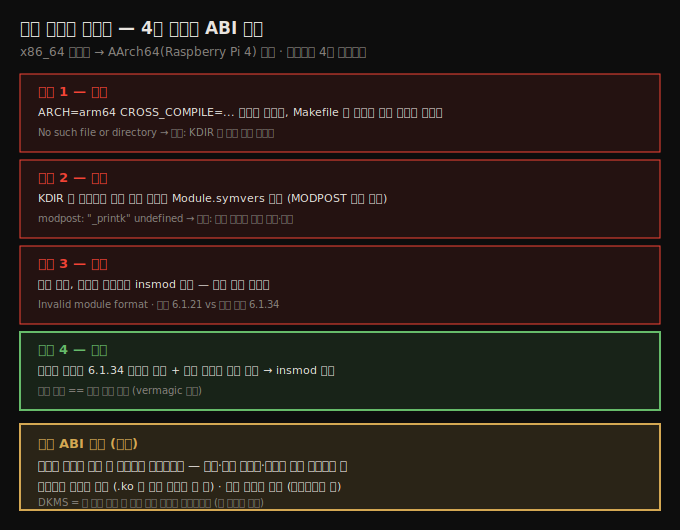
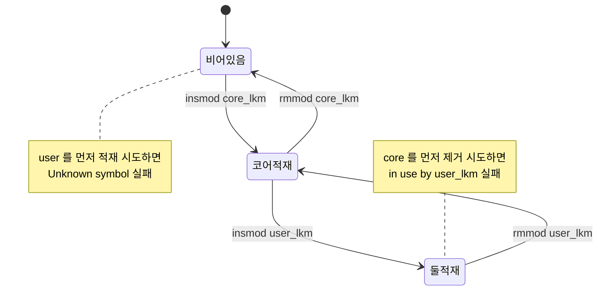

# 첫 커널 모듈 (3) — Makefile·크로스 컴파일·라이브러리식 기능
---
> LKM 의 둘째 부분 중 빌드·구조 측면을 다룹니다. 정적 분석·코딩 스타일 검사 타겟을 갖춘 "더 나은" Makefile, 디버그 커널 설정, 모듈 크로스 컴파일(4번 시도 끝에 성공하며 배우는 커널 ABI 규칙), 그리고 커널에는 없는 라이브러리 개념을 흉내 내는 두 방법(다중 소스 링킹·모듈 스태킹)과 모듈 파라미터를 다룹니다. 핵심은 커널 ABI 규칙 — 모듈은 빌드된 바로 그 커널에만 적재됩니다.

이 노트는 짝 노트(04-02)에서 익힌 기본 Makefile 을 넘어, 실무에서 쓸 더 나은 빌드 구조와 크로스 컴파일·라이브러리식 기능을 다룹니다. 시스템 정보 수집·라이선스·자동 적재·보안은 짝 노트(05-02)로 넘깁니다. 아래 종합도가 이 노트의 백미 — 크로스 컴파일 4번 시도와 그 끝에 드러나는 커널 ABI 규칙 — 입니다.




## 1. "더 나은" Makefile 과 디버그 커널

> 실무용 Makefile 은 빌드·설치·정리뿐 아니라 코딩 스타일 검사(checkpatch·indent), 정적 분석(sparse·gcc·flawfinder·cppcheck), 패키징 타겟을 갖춰야 합니다. 그리고 버그를 잡으려면 디버그 옵션을 켠 별도의 "디버그 커널"을 함께 운용합니다.

좋고 안전한 코드를 쓰려면 도구의 도움이 필요합니다. 저자는 여러 타겟을 갖춘 Makefile "템플릿"(`ch5/lkm_template`)을 제공합니다. `make` 뒤 Tab 을 두 번 누르면 모든 타겟이 보입니다.

| 타겟 | 역할 |
|------|------|
| `all` / `install` / `clean` | 빌드·설치·정리(debug 설정 반영, off면 strip) |
| `code-style` / `indent` / `checkpatch` | 커널 코딩 스타일 생성·검사(`indent`, `checkpatch.pl`) |
| `sa` / `sa_sparse` / `sa_gcc` / `sa_flawfinder` / `sa_cppcheck` | 정적 분석(static analysis) |
| `tarxz-pkg` | 소스를 tar.xz 로 묶어 다른 시스템에 전달 |

`make sa` 는 모든 정적 분석 타겟을 한 번에 돌립니다. Makefile 은 변수로 빌드 성격을 제어합니다.

```
FYI: KDIR=/lib/modules/6.1.25-lkp-kernel/build ARCH= CROSS_COMPILE= ccflags-y="-UDEBUG -DDYNAMIC_DEBUG_MODULE" MYDEBUG=n DBG_STRIP=n
```

1. **`MYDEBUG`**(기본 n): 'debug' 빌드 여부.
2. **`DBG_STRIP`**: 모듈에서 debug 심볼을 떼낼지. `MYDEBUG=n` 이고 모듈 서명을 안 쓸 때만 strip.
3. **`KDIR`**: 커널 헤더(제한된 소스 트리) 경로. `ARCH`/`CROSS_COMPILE` 은 크로스 컴파일 안 할 땐 null.

> 이 Makefile 을 제대로 쓰려면 `indent`·`sparse`·`flawfinder`·`cppcheck`·`tar` 등이 설치돼야 합니다. dynamic analysis(da) 타겟은 메시지만 출력하는 더미 — "디버그 커널에서 충분히 테스트하라"는 알림입니다.

### 디버그 커널

버그를 잡으려면 디버그 옵션을 켠 별도 커널을 운용합니다. 두 커널을 두는 게 이상적입니다.

1. **프로덕션 커널**: 최적화 중심.
2. **디버그 커널**: 디버그 config 다수 활성화(최적화 안 됐을 수 있으나 버그 포착이 목적).

켜둘 만한 주요 디버그 config(Kernel Hacking 메뉴, 6.1.25 기준)는 다음과 같습니다.

| 분류 | config |
|------|--------|
| 일반 | `CONFIG_DEBUG_KERNEL`, `CONFIG_DEBUG_INFO`, `CONFIG_DEBUG_MISC`, `CONFIG_MAGIC_SYSRQ`, `CONFIG_DEBUG_FS`, `CONFIG_UBSAN`, `CONFIG_KCSAN` |
| 메모리 | `CONFIG_SLUB_DEBUG`, `CONFIG_DEBUG_MEMORY_INIT`, `CONFIG_KASAN`(강력한 메모리 검사기), `CONFIG_DEBUG_SHIRQ`, `CONFIG_SCHED_STACK_END_CHECK` |
| 락 | `CONFIG_PROVE_LOCKING`(lockdep — 락 버그 포착), `CONFIG_LOCK_STAT`, `CONFIG_DEBUG_ATOMIC_SLEEP` |
| 기타 | `CONFIG_STACKTRACE`, `CONFIG_FTRACE`(트레이서 포함), `CONFIG_BUG_ON_DATA_CORRUPTION` |

> 이 옵션들은 성능 비용을 동반하지만, 버그(특히 찾기 힘든 종류)를 잡는 게 목적이라 괜찮습니다. 프로덕션·디버그 두 커널 모두에서 코드를 테스트하는 게 좋은 워크플로입니다.


## 2. 모듈 크로스 컴파일 — 4번 시도와 ABI 규칙

> 모듈도 `ARCH`/`CROSS_COMPILE` 을 설정해 크로스 컴파일합니다. 그런데 성공까지 4번 걸립니다 — 그 과정에서 커널 ABI 규칙(모듈은 빌드된 바로 그 커널에만 적재된다)을 배웁니다.

x86_64 호스트에서 AArch64 Raspberry Pi 4 용으로 `ch5/lkm_template` 을 크로스 컴파일합니다. 전제는 타깃 커널 소스 트리와 x86_64→ARM64 크로스 툴체인(`aarch64-linux-gnu-`)입니다. (이 흐름은 위 종합도 SVG 참조.)

### 시도 1 — KDIR 이 호스트를 가리킴

`ARCH`/`CROSS_COMPILE` 만 설정하고 빌드하면 실패합니다 — Makefile 이 **호스트 커널 소스**를 가리키기 때문입니다.

```bash
$ make ARCH=arm64 CROSS_COMPILE=aarch64-linux-gnu-
make[1]: *** ~/arm64_prj/kernel/linux: No such file or directory.  Stop.
```

고침: Makefile 에서 `KDIR` 을 `ARCH` 값에 따라 **타깃 커널 소스**로 조건부 설정합니다.

```makefile
else ifeq ($(ARCH),arm64)
  KDIR ?= ~/rpi_work/kernel_rpi/linux
```

### 시도 2 — Module.symvers 없음

KDIR 은 맞췄으나 MODPOST 단계에서 실패합니다 — 타깃 커널 트리에 `Module.symvers`(모든 exported 심볼 정보)가 없기 때문입니다.

```bash
ERROR: modpost: "_printk" [.../lkm_template.ko] undefined!
```

고침: 타깃 커널을 먼저 설정·빌드(`make mrproper` 후 재빌드)하면 `Module.symvers` 가 생기고 모듈 빌드가 통과합니다.

### 시도 3 — ABI 불일치

빌드는 성공했으나 보드에서 `insmod` 가 실패합니다.

```bash
$ sudo insmod ./lkm_template.ko
insmod: ERROR: could not insert module: Invalid module format
```

원인은 **커널 버전 불일치**입니다. 보드는 6.1.21-v8+ 인데 모듈은 6.1.34-v8+ 에 빌드됐습니다(`modinfo` 의 vermagic 으로 확인).

### 커널 ABI 호환성 규칙

> 커널은 ABI 규칙을 가집니다 — 모듈은 빌드된 **바로 그 커널**에만 적재됩니다. 버전·빌드 플래그·설정이 모두 일치해야 합니다.

핵심을 정리합니다.

1. **바이너리 호환성 없음**: `.ko` 는 빌드된 커널 외 다른 커널(다른 배포판·버전)에 적재 안 됩니다.
2. **소스 호환성 있음**: 소스가 있으면 대상 시스템에서 재빌드해 쓸 수 있습니다(아키텍처 독립으로 작성 가능).

> **DKMS(Dynamic Kernel Module Support)** 가 이 규칙을 증명합니다 — "새 커널이 설치되면 DKMS 모듈을 자동 재빌드"합니다. VirtualBox 가 이 방식으로 자기 모듈을 유지합니다.

### 시도 4 — 성공

해결책 셋(커스텀 커널로 부팅+그 커널에 빌드 / DKMS / 현재 보드 커널에 맞춰 재빌드) 중, 임베디드 프로젝트의 정석인 첫째를 따릅니다 — 보드를 **커스텀 6.1.34 커널로 부팅**하고 같은 커널에 모듈을 빌드합니다. 이제 보드 커널과 모듈 빌드 커널이 일치(vermagic 일치)해 `insmod` 가 성공합니다.

| 시도 | 실패 원인 | 고침 |
|------|----------|------|
| 1 | 호스트 커널 소스에 빌드 | `KDIR` 을 타깃 커널 소스로 |
| 2 | `Module.symvers` 없음 | 타깃 커널 먼저 설정·빌드 |
| 3 | ABI 불일치(Invalid module format) | (시도 4가 해결) |
| 4 | — | 커스텀 커널로 부팅 + 같은 커널에 빌드 → 성공 |


## 3. 라이브러리식 기능 (1) — 다중 소스 링킹

> 커널에는 유저 공간의 "라이브러리" 개념이 없습니다. 흉내 내는 첫 방법은 여러 소스 파일을 한 모듈로 링킹하는 것입니다. EXPORT_SYMBOL 없이도 되고, 함수가 그 모듈에만 보여 더 깔끔합니다.

유저-모드와 커널-모드 프로그래밍의 큰 차이 하나는 커널에 **전통적 의미의 라이브러리가 없다**는 것입니다(`lib/` 폴더에 라이브러리 격 루틴이 있긴 합니다). 흉내 내는 두 방법이 있습니다.

첫째는 여러 C 소스를 한 `.ko` 로 **링킹**하는 것입니다. 모듈 `projx` 가 세 소스(`prj1.c`, `prj2.c`, `prj3.c`)로 이뤄진다면 Makefile 에 이렇게 씁니다.

```makefile
obj-m      := projx.o
projx-objs := prj1.o prj2.o prj3.o
```

빌드 시스템이 셋을 개별 `.o` 로 컴파일한 뒤 하나의 `projx.ko` 로 링킹합니다. 이 책도 이 방식으로 `klib.c` 라이브러리 루틴을 다른 모듈에 링킹합니다.

```makefile
lowlevel_mem_lkm-objs := ${FNAME_C}.o ../../klib.o
```

> 이 방법의 장점: ① EXPORT_SYMBOL 로 일일이 export 표시 안 해도 됨 ② 함수·데이터가 링킹된 그 모듈에만 보임(좋은 격리). 단점: 링킹한 파일이 많으면 모듈 크기가 커짐.

### 함수·변수 스코프와 EXPORT_SYMBOL

2.6 커널부터 모듈의 static·global 변수와 함수는 기본적으로 그 모듈에만 private 합니다. 두 모듈이 같은 이름 전역 변수를 가져도 충돌 없습니다. 스코프를 바꾸려면 `EXPORT_SYMBOL()` 매크로로 export 합니다.

```c
int my_glob = 5;
EXPORT_SYMBOL(my_glob);
long my_foo(int key) { ... }
EXPORT_SYMBOL(my_foo);   // static 키워드 제거에 주의
```

이 개념이 두 방향으로 쓰입니다.

1. **커널이 export**: 커널이 코어 기능의 부분집합을 export 해 모듈이 쓸 수 있게 합니다 — 예: `request_threaded_irq()`, 문자열 처리 `str*()` 함수들. **out-of-tree 모듈은 export 된 것만 접근 가능**합니다. export 안 된 함수(예: `pick_next_task_fair()`)는 모듈에서 못 부릅니다.
2. **모듈이 export**: 모듈 작성자가 데이터·기능을 export 해 다른 모듈이 쓰게 합니다 — 이것이 **모듈 스태킹**입니다.

> `EXPORT_SYMBOL_GPL()` 은 `MODULE_LICENSE()` 에 GPL 을 포함한 모듈에만 보입니다 — 커널 커뮤니티의 라이선스 강제 수단입니다. 모든 export 심볼은 `make export_report` 로 봅니다(빌드된 트리에서).


## 4. 라이브러리식 기능 (2) — 모듈 스태킹

> 둘째 방법은 모듈 스태킹입니다. "코어" 모듈이 라이브러리처럼 데이터·함수를 export 하고, "유저" 모듈이 그 위에 쌓여 그것을 씁니다. 적재·제거에 순서 의존성이 생깁니다.

모듈 스태킹은 프로젝트를 "코어" 모듈(라이브러리 격)과 그것을 쓰는 "유저" 모듈로 설계합니다. `lsmod` 로 의존성을 봅니다 — 오른쪽 모듈이 왼쪽 모듈에 의존합니다(왼쪽 함수·데이터를 씀).

```bash
$ lsmod | grep vbox
vboxnetadp             28672   0
vboxnetflt             28672   1
vboxdrv                614400  3 vboxnetadp,vboxnetflt
```

`vboxnetadp`·`vboxnetflt` 가 `vboxdrv`(코어, 사용 카운트 3)에 의존합니다. 사용 카운트가 0 이어야 `rmmod` 가 됩니다.

### 코어·유저 모듈 만들기

1. **코어 모듈**: `EXPORT_SYMBOL()` 로 데이터·함수를 export.
   ```c
   int exp_int = 200;
   EXPORT_SYMBOL_GPL(exp_int);
   void llkd_sysinfo2(void) { ... }
   EXPORT_SYMBOL(llkd_sysinfo2);
   ```
2. **유저 모듈**: `extern` 으로 그 데이터·함수를 선언(컴파일러가 알아야 함).
   ```c
   extern void llkd_sysinfo2(void);
   extern int exp_int;
   ```
3. **Makefile**: 두 모듈을 모두 빌드.
   ```makefile
   obj-m := core_lkm.o
   obj-m += user_lkm.o
   ```

### 순서 의존성

적재·제거에 순서가 있습니다. 코어가 먼저 들어가야 유저가 쓸 심볼이 커널 심볼 테이블에 있고, 제거는 그 역순입니다.



적재·제거 명령은 다음과 같습니다.

```bash
# 잘못: user 를 먼저 적재 → 심볼 없음
$ sudo insmod ./user_lkm.ko
insmod: ERROR: Unknown symbol in module
# dmesg: user_lkm: Unknown symbol exp_int (err -2)

# 올바름: core 먼저, user 나중
$ sudo insmod ./core_lkm.ko
$ sudo insmod ./user_lkm.ko

# 제거도 역순: user 먼저, core 나중
$ sudo rmmod core_lkm        # 실패: in use by user_lkm
$ sudo rmmod user_lkm core_lkm
```

라이선스도 중요합니다 — `exp_int` 가 `EXPORT_SYMBOL_GPL` 이므로, 유저 모듈을 MIT-only 로 바꾸면 빌드 단계에서 실패합니다(`GPL-incompatible module uses GPL-only symbol`).

> 스태킹에서 흔한 실수: 잘못된 순서로 적재/제거, 이미 메모리에 있는 export 루틴 중복(namespace 충돌), `EXPORT_SYMBOL_GPL` 라이선스 이슈. 항상 `dmesg`/`journalctl` 을 보면 원인이 드러납니다.

### 두 방법 비교

| | 다중 소스 링킹 | 모듈 스태킹 |
|---|---------------|------------|
| export 표시 | 불필요 | 함수·데이터마다 `EXPORT_SYMBOL()` |
| 가시성 | 링킹된 모듈에만 | 모든 모듈에 |
| 모듈 수 | 1개(.ko) | 여러 개 |
| 단점 | 모듈 크기 커짐 | 순서·라이선스 관리 |

> 첫째(링킹)가 보통 더 낫습니다 — export 표시 불필요, 격리가 좋음. 프로젝트에 따라 다릅니다.


## 5. 모듈 파라미터

> 모듈 파라미터는 적재 시 name=value 쌍으로 전달됩니다. `module_param()` 으로 전역 변수를 파라미터로 만들고, sysfs 로 런타임에 읽고 쓸 수 있습니다.

모듈은 `main()` 이 없어 `(argc, argv)` 가 없습니다. 대신 전역 변수를 `module_param()` 매크로로 파라미터로 선언합니다.

```c
static int mp_debug_level;
module_param(mp_debug_level, int, 0660);
MODULE_PARM_DESC(mp_debug_level, "Debug level [0-2]; 0 => no debug, 2 => high verbosity");
```

`module_param()` 3인자: 변수 / 데이터 타입 / 권한(sysfs 가시성). `MODULE_PARM_DESC()` 로 설명을 답니다 — `modinfo -p` 로 봅니다.

```bash
sudo insmod ./modparams1.ko mp_debug_level=2 mp_strparam=\"Hello\"
```

> static 변수를 `= 0` 으로 명시 초기화하면 checkpatch 가 "do not initialise statics to 0" 에러를 냅니다. 데이터 타입은 byte/short/int/uint/long/ulong/charp(문자 포인터)/bool/invbool 등이 있습니다.

### 적재 후 읽기·쓰기 (sysfs)

권한을 non-zero 로 주면 `/sys/module/<name>/parameters/` 에 pseudofile 이 생겨 런타임에 읽고 쓸 수 있습니다(root).

```bash
$ sudo cat /sys/module/modparams1/parameters/mp_debug_level
2
$ sudo sh -c "echo 0 > /sys/module/modparams1/parameters/mp_debug_level"
```

> 스크립트로 디바이스 동작·디버그 정보를 제어할 수 있어 강력합니다. 다만 동적 디버그 instrumentation 은 커널의 dynamic debug(`CONFIG_DYNAMIC_DEBUG`)가 더 우수합니다(04-02 참조).

### 검증·이름 override

1. **필수 파라미터 강제**: 모듈 파라미터는 기본적으로 선택입니다. 필수로 만들려면 init 에서 기본값 여부·범위를 검사해 아니면 `-EINVAL` 반환.
   ```c
   if ((control_freak < 1) || (control_freak > 5)) {
       pr_warn("must pass control_freak in [1-5]; aborting...\n");
       return -EINVAL;
   }
   ```
2. **이름 override**: `module_param_named()` 으로 내부 변수명과 다른 직관적 파라미터명을 쓸 수 있습니다.
   ```c
   module_param_named(current_allocated_bytes, dm_bufio_current_allocated, ulong, S_IRUGO);
   ```
3. **하드웨어 파라미터**: io port·irq 등 하드웨어 값은 `module_param_hw()` 로 — secure boot lockdown 지원을 위함.


## 다음 단계

> 빌드·구조를 익혔으니, 다음 노트에서 시스템 정보·라이선스·보안·자동 적재를 다룹니다.

여기까지 더 나은 Makefile·디버그 커널, 크로스 컴파일과 ABI 규칙, 라이브러리식 기능 두 방법, 모듈 파라미터를 정리했습니다. 다음 노트는 운영·보안 측면입니다.

1. **시스템 정보 수집·라이선스·FP 금지**: 포터블 코드, GPL/dual 라이선스, 커널 내 부동소수점 금지.
2. **자동 적재·보안·코딩 스타일**: 부팅 시 자동 적재, 모듈 서명·sysctl·lockdown, checkpatch·기여.


## 관련 문서

> 이 노트는 빌드·구조편입니다. 운영·보안은 짝 노트가, 기본 Makefile 은 앞 노트가 다룹니다.

- [05-02.첫 커널 모듈 (4) — 시스템 정보·보안·자동 적재](./05-02.첫%20커널%20모듈%20(4)%20—%20시스템%20정보·보안·자동%20적재.md) — 운영·보안 (짝 노트)
- [04-02.첫 커널 모듈 (2) — printk 로깅과 Makefile](./04-02.첫%20커널%20모듈%20(2)%20—%20printk%20로깅과%20Makefile.md) — 기본 모듈 Makefile·obj-m
- [03-02.커널 빌드 (4) — Raspberry Pi 크로스 컴파일과 빌드 팁](./03-02.커널%20빌드%20(4)%20—%20Raspberry%20Pi%20크로스%20컴파일과%20빌드%20팁.md) — 커널 크로스 컴파일 배경(모듈 크로스 컴파일의 전제)
- [00-00.책 개요와 학습 로드맵](./00-00.책%20개요와%20학습%20로드맵.md) — 3섹션·13챕터 전체 지도
