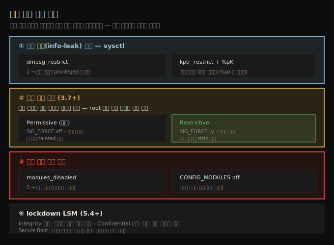

# 첫 커널 모듈 (4) — 시스템 정보·보안·자동 적재
---
> LKM 둘째 부분의 운영·보안 측면입니다. 모듈에서 시스템 정보(CPU·bit·endian)를 얻는 포터블 코드, 커널/모듈 라이선스(GPL/dual·SPDX), 커널 내 부동소수점 금지, 부팅 시 자동 적재(install·depmod·modprobe), 그리고 보안 계층(info-leak 방지 sysctl·모듈 암호 서명·적재 차단·lockdown LSM)과 코딩 스타일·기여를 다룹니다. 유저 공간 보안이 강해지자 커널 공간 공격이 늘었고, 모듈 작성자의 역할이 큽니다.

이 노트는 짝 노트(05-01)의 빌드·구조에 이어, 운영과 보안을 다룹니다. 섹션 1(기초)의 마지막입니다. 아래 종합도가 이 노트의 핵심 — 커널 모듈을 둘러싼 4개 보안 계층 — 입니다.




## 1. 시스템 정보 수집과 포터블 코드

> 여러 아키텍처에서 도는 모듈은 CPU 패밀리·bit 폭·endian 을 런타임에 감지해야 할 때가 있습니다. 커널이 제공하는 매크로로 합니다. 모듈 바이너리는 비포터블이지만 소스는 포터블하게 쓸 수 있습니다.

이식 가능한 모듈을 쓸 때 실제 프로세서 패밀리에 따라 조건부로 일해야 할 때가 있습니다. 커널 매크로로 시스템 세부를 감지합니다.

```c
#ifdef CONFIG_X86
  #if(BITS_PER_LONG == 32)
    strncat(msg, "x86-32, ", 9);
  #else
    strncat(msg, "x86_64, ", 9);
  #endif
#endif
#ifdef CONFIG_ARM64
  strncat(msg, "AArch64 (ARM-64), ", 19);
#endif
#ifdef __BIG_ENDIAN
  strncat(msg, "big-endian; ", 13);
#else
  strncat(msg, "little-endian; ", 16);
#endif
```

> 모듈 바이너리(`.ko`)는 비포터블이지만, **소스는 포터블하게 작성**할 수 있습니다 — 대상 아키텍처에서 빌드만 하면 됩니다. 같은 모듈을 AArch64 로 크로스 컴파일해 보드에서 돌리면 `AArch64 (ARM-64), little-endian; 64-bit OS.` 가 나옵니다.

### 보안 인식 — 오래된 루틴 주의

`sprintf`·`strlen`·`strncat` 같은 옛 루틴은 위험할 수 있습니다. 정적 분석기가 잠재 보안 버그를 잡아줍니다. `make sa_flawfinder` 로 flawfinder 를 돌립니다.

```
min_sysinfo.c:136: [1] (buffer) strncat:
  Easily used incorrectly ... (CWE-120). Consider strcat_s, strlcat, snprintf
```

이 경고를 따라 `strncat` 을 `strlcat` 으로, `snprintf` 는 반환값을 검사하는 래퍼(`my_snprintf_lkp()`)로 바꿉니다. **CWE-120** 은 "Classic Buffer Overflow" — 해킹의 주요 표적인 BoF(Buffer Overflow) 결함 클래스입니다.


## 2. 커널/모듈 라이선스

> 커널은 GPL-2.0 으로 배포됩니다. inline 코드를 업스트림하려면 GPL-2.0 으로 내야 하고, SPDX 식별자를 첫 줄에 둡니다. out-of-tree 모듈은 `MODULE_LICENSE()` 매크로로 라이선스를 표시합니다(dual 가능).

라이선스는 두 갈래입니다.

1. **inline 커널 코드**: 업스트림하려면 커널과 같은 **GNU GPL-2.0** 으로 내야 합니다("파생 저작물"). 모든 소스 첫 줄에 SPDX 식별자를 둡니다.
   ```c
   // SPDX-License-Identifier: GPL-2.0
   ```
2. **out-of-tree 모듈**: 커뮤니티 도움을 받으려면 GPL-2.0 으로 내는 게 기대됩니다(dual 라이선스 가능). 라이선스는 `MODULE_LICENSE()` 매크로로 표시합니다.

`include/linux/module.h` 가 허용 ident 를 보여줍니다.

| ident | 의미 |
|-------|------|
| `"GPL"` | GPL v2 이상 |
| `"GPL v2"` | GPL v2 |
| `"Dual BSD/GPL"` | GPL v2 또는 BSD |
| `"Dual MIT/GPL"` | GPL v2 또는 MIT |
| `"Dual MPL/GPL"` | GPL v2 또는 Mozilla |
| `"Proprietary"` | 비자유 제품 |

> `MODULE_LICENSE()` 의 주 목적은 Proprietary 모듈을 표시해 GPL-only export 심볼(`EXPORT_SYMBOL_GPL`) 사용을 제한하고, 코드베이스가 오픈소스인지 빠르게 가늠하게 하는 것입니다. 라이선스는 복잡한 법적 주제라 전문가 상담을 권합니다.


## 3. 커널 내 부동소수점 금지

> 커널 공간에서는 부동소수점(FP) 연산이 허용되지 않습니다. FP 상태 저장·복원 비용이 크기 때문입니다. 온도 변환 같은 FP 작업은 유저 공간으로 넘깁니다.

커널 공간에서 FP 연산은 **허용되지 않습니다**. FP 유닛 상태를 저장·켜고·복원하는 비용이 커널 안에서 할 가치가 없다고 보는 의식적 설계 결정입니다.

```c
// ❌ 커널에서 이러면 안 됨
double temperature_fp = temperature / 1000.0;
printk(KERN_INFO "temperature is %.3f degrees C\n", temperature_fp);
```

해결: millidegrees 정수값을 유저 공간으로 넘겨 거기서 FP 작업을 합니다. 일반적으로 FP 연산·파일 I/O·앱 실행은 커널이 아니라 유저 공간이 맞습니다(소수 예외 있음).

> 강제로 FP 를 쓰려면 `kernel_fpu_begin()`/`kernel_fpu_end()` 사이에 둡니다(crypto/AES·CRC 등 몇 곳에서 씀). 다만 FP 값을 `printk("%f")` 로 출력하면 `WARN_ONCE()` 가 "Please remove unsupported %f in format string" 을 냅니다. 프로덕션에서 `panic_on_warn=1` 이면 panic 합니다. 결론: 일반 모듈은 커널에서 정수 연산만.


## 4. 부팅 시 자동 적재

> 모듈을 부팅 시 자동 적재하려면 먼저 `sudo make install` 로 알려진 위치에 설치하고, `/etc/modules-load.d/<foo>.conf` 에 모듈명을 적습니다. modprobe 는 의존성 순서를 알아서 처리합니다.

실무 제품은 out-of-tree 모듈을 부팅 시 자동 적재해야 합니다. 절차는 다음과 같습니다.

1. **빌드 후 설치**: 반드시 먼저 빌드하고 설치합니다.
   ```bash
   make && sudo make install
   # → /lib/modules/<ver>/extra/min_sysinfo.ko 에 설치 + depmod 실행
   ```
2. **자동 적재 등록**: `/etc/modules-load.d/<foo>.conf` 에 모듈명을 적습니다(`#` 은 주석). systemd 가 부팅 시 이를 파싱해 적재합니다.
   ```
   # /etc/modules-load.d/min_sysinfo.conf
   min_sysinfo
   ```
3. **재부팅 후 확인**: `lsmod` + `dmesg`/`journalctl` 로 적재 확인.

> 파라미터를 함께 넘기려면 modprobe 설정 파일(`/etc/modprobe.d/<foo>.conf`)에 `options <module> <param>=<value>` 를 씁니다. 예: `options snd-cmipci mpu_port=0x330 fm_port=0x388`.

### modprobe 와 의존성 순서

`modprobe` 는 insmod 의 똑똑한 버전입니다 — 모듈 스태킹처럼 여러 모듈을 올바른 순서로 적재합니다. 빌드 시 생성된 `modules.order` 와, depmod 가 만든 `/lib/modules/$(uname -r)/modules.dep` 의 의존성 정보로 순서를 정합니다.

```bash
$ grep user_lkm /lib/modules/<ver>/modules.dep
extra/user_lkm.ko: extra/core_lkm.ko    # user 가 core 에 의존
```

> 오작동하는 자동 적재 모듈은 **blacklist** 로 막습니다 — 커널 커맨드라인 `module_blacklist=mod1,mod2` 또는 설정 파일에. 부팅 디버깅에 `initcall_debug`(어디서 오래 걸리는지), `ignore_loglevel`(모든 메시지를 콘솔로) 같은 커널 파라미터가 유용합니다.


## 5. 보안 (1) — 정보 유출 방지 sysctl

> 단 하나의 유효한 커널 주소·심볼만 노출돼도 privesc 공격의 실마리가 됩니다. `dmesg_restrict`·`kptr_restrict` sysctl 과 `%pK` 포맷 지정자로 정보 유출을 막습니다.

유저 공간 보안이 강해지자(BoF 대응책 다수) 커널 공간 공격이 늘었습니다. 단 하나의 유효 커널 주소·심볼 노출이 내부 구조 위치를 알려 privesc(권한 상승) 공격으로 이어집니다.

### dmesg_restrict

커널 로그 조회에 필요한 최소 권한을 정합니다. 커널 로그조차 해커에게 가치 있는 정보입니다.

| 값 | 의미 |
|----|------|
| 0 | 제한 없음 |
| 1 | privileged 사용자(CAP_SYSLOG)만 조회 |

```bash
$ sysctl kernel.dmesg_restrict
kernel.dmesg_restrict = 1
```

### kptr_restrict 와 %pK

커널 주소를 출력할 때 `%p`/`%px` 대신 `%pK` 를 쓰는 게 보안 best practice 입니다. `kptr_restrict` 값이 동작을 정합니다.

| kptr_restrict | 비특권 + %pK | 특권(root) + %pK |
|---------------|--------------|------------------|
| 0 | 제한 없음(주소 노출) | 제한 없음 |
| 1 | 0으로 마스킹(CAP_SYSLOG 없으면) | 제한 없음 |
| 2 | 0으로 마스킹 | 0으로 마스킹 |

> 디버깅용으로 실주소가 필요하면 `%px` 를 쓰되 프로덕션에선 제거합니다. 안타깝게도 6.1.25 의 8만여 printk 중 `%pK` 를 쓰는 건 24건뿐입니다 — 보안 조치는 개발자가 써야 효과가 있습니다. `scripts/leaking_addresses.pl` 이 유출 주소를 탐지합니다.


## 6. 보안 (2) — 모듈 암호 서명

> root 라도, 커널 키링의 키로 암호 서명된 모듈만 적재하게 할 수 있습니다(3.7+). rootkit 설치를 막는 강력한 방어입니다. Permissive(미서명 허용·tainted)와 Restrictive(서명된 것만) 두 모드가 있습니다.

공격자가 root 를 얻으면 rootkit(시스템 콜 hijack·백도어·키로거)을 설치하려 합니다. 강력한 방어는 — root 라도 — **커널 키링의 키로 암호 서명된 모듈만** 적재하게 하는 것입니다(3.7+).

관련 config 와 동작은 다음과 같습니다.

| config | 효과 |
|--------|------|
| `CONFIG_MODULE_SIG=y` | 적재 시 서명 검증 |
| `CONFIG_MODULE_SIG_ALL=y` | 설치 시 모든 모듈 서명 |
| `CONFIG_MODULE_SIG_FORCE=y` | 서명된 모듈만 적재 |
| `CONFIG_MODULE_COMPRESS_XZ=y` | 설치 시 모듈 압축 |

두 모드가 있습니다.

1. **Permissive(기본)**: `SIG_FORCE` off. 미서명 모듈 적재 허용하되 커널을 **tainted**(오염, E 비트) 표시. 대부분 배포판 기본.
2. **Restrictive**: `SIG_FORCE=y`(또는 `module.sig_enforce=1`). 유효 서명 모듈만 적재. 추가 보안에 좋음.

> ⚠️ 핵심 경고: 서명 후 모듈을 **strip 하면 안 됩니다**(서명이 깨짐). 그래서 "더 나은" Makefile 은 `CONFIG_MODULE_SIG*` 가 켜져 있으면 strip 을 안 합니다. 보안상 커널 기본 키 대신 별도 키페어(`certs/x509.genkey`)를 쓰는 걸 권합니다. 수동 서명은 `scripts/sign-file` 로 합니다.


## 7. 보안 (3) — 적재 차단과 lockdown

> 더 강하게는 모듈 적재를 아예 차단할 수 있습니다 — `modules_disabled` sysctl(되돌릴 수 없음) 또는 `CONFIG_MODULES` off(영구). lockdown LSM(5.4+)은 유저의 커널 수정·기밀 정보 추출을 막습니다.

편집증적으로는 모듈 적재를 완전히 막을 수 있습니다.

1. **`CONFIG_MODULES` off**: 빌드 시 결정 — 영구적이고 가장 강력.
2. **`modules_disabled` sysctl**: 런타임에 1 로 설정하면 적재·제거 차단. **한 번 1 이면 되돌릴 수 없음**.
   ```bash
   $ cat /proc/sys/kernel/modules_disabled
   0
   ```

### lockdown LSM

더 강력한 하드닝 기능(5.4+)입니다. 기본 비활성입니다.

1. **Integrity 모드**: 유저-모드 앱/스크립트가 실행 중 커널을 수정하지 못하게 합니다.
2. **Confidential 모드**: 추가로 기밀 커널 정보 추출을 막습니다(info-leak 방지).

> lockdown 은 (U)EFI Secure Boot 시 자동 활성화될 수 있고, 그러면 모듈 적재가 실패할 수 있습니다 — 보안은 양날의 검입니다. (K)ASLR 같은 조치도 정기적으로 우회됩니다. 보안은 끝없는 cat-and-mouse 게임이라, 개발자가 보안을 인식하고 도구·테스트로 지속 검증해야 합니다.


## 8. 코딩 스타일과 기여

> 커널 코드는 커뮤니티 코딩 스타일을 따라야 합니다. `checkpatch.pl` 로 검사합니다. 메인라인 기여는 상세한 제출 체크리스트(현재 24항목)를 따릅니다.

### 코딩 스타일

Linux 커널은 자체 코딩 스타일 가이드를 가집니다(공식 문서). 코드를 업스트림하려면 `scripts/checkpatch.pl` 로 검사받아야 합니다. out-of-tree 코드에도 돌릴 수 있습니다.

```bash
<kernel-src>/scripts/checkpatch.pl --no-tree -f <filename>.c
# 또는 "더 나은" Makefile 의 make checkpatch
```

> 습관적으로 `make checkpatch` 를 돌려 사소한(때론 심각한) 이슈를 미리 잡습니다(첫 SPDX 경고는 무시 가능).

### 메인라인 기여

오픈소스의 기반은 커뮤니티의 기여 의지입니다. 시작점은 공식 문서 `HOWTO do Linux kernel development` 입니다(`make pdfdocs` 로 전체 문서 생성 가능). 품질 유지를 위해 엄격한 **제출 체크리스트**(현재 24항목)를 따릅니다.

> 실전 팁: 이 책을 계속 읽기 + Eudyptula Challenge(아쉽게 종료됨, 단 GitHub 에 챌린지·해답 보존: `github.com/agelastic/eudyptula`)를 풀면 커널 해킹 실력이 크게 늡니다.


## 다음 단계

> 섹션 1(기초)을 모두 마쳤습니다. 다음 챕터부터 섹션 2 — 커널 내부 핵심 — 으로 들어갑니다.

여기까지 시스템 정보 수집·라이선스·FP 금지·자동 적재·보안(서명·sysctl·lockdown)·코딩 스타일·기여를 정리했습니다. 이로써 커널 빌드(Ch 2~3)와 첫 모듈(Ch 4~5) — 섹션 1 기초 — 을 모두 마쳤습니다.

다음 챕터(Ch 6)부터 섹션 2(커널 내부 핵심)입니다.

1. **Ch 6 (프로세스와 스레드)**: 프로세스/인터럽트 컨텍스트, task 구조, 유저·커널 모드 스택, `current` 매크로, task 리스트 순회.
2. **Ch 7~9 (메모리 관리)**, **Ch 10~11 (CPU 스케줄러)**.


## 관련 문서

> 이 노트는 운영·보안편입니다. 빌드·구조는 짝 노트가, 보안 운영 관점은 이웃 폴더가 다룹니다.

- [05-01.첫 커널 모듈 (3) — Makefile·크로스 컴파일·라이브러리식 기능](./05-01.첫%20커널%20모듈%20(3)%20—%20Makefile·크로스%20컴파일·라이브러리식%20기능.md) — 빌드·구조 (짝 노트)
- [04-02.첫 커널 모듈 (2) — printk 로깅과 Makefile](./04-02.첫%20커널%20모듈%20(2)%20—%20printk%20로깅과%20Makefile.md) — 기본 Makefile·dynamic debug
- [../../kernel/01-07.OverlayFS와 user namespace — Netflix UID 격리](../../kernel/01-07.OverlayFS와%20user%20namespace%20—%20Netflix%20UID%20격리.md) — 커널 보안의 K8s 운영 관점(user namespace·격리)
- [00-00.책 개요와 학습 로드맵](./00-00.책%20개요와%20학습%20로드맵.md) — 3섹션·13챕터 전체 지도
