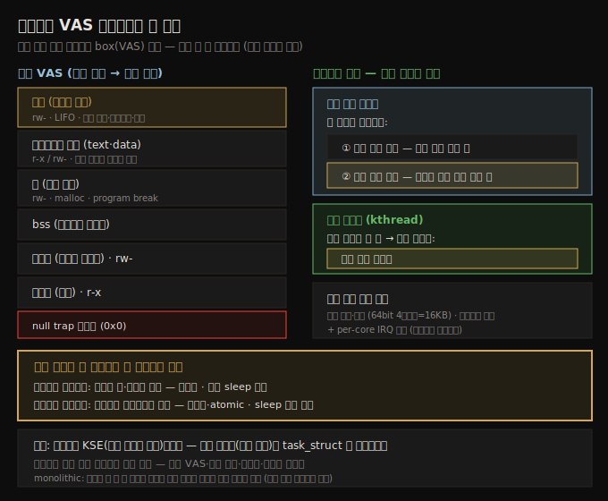

# 프로세스와 스레드 (1) — 컨텍스트·VAS·스택
---
> 커널 내부의 첫 핵심입니다. 커널 코드는 두 컨텍스트(프로세스·인터럽트) 중 하나에서 실행됩니다. 프로세스 VAS 는 텍스트·데이터·힙·라이브러리·스택 세그먼트로 나뉩니다. 모든 유저 스레드는 두 스택(유저 모드·커널 모드)을 갖고, 커널 스레드는 커널 스택 하나만 갖습니다. 스레드가 커널 스케줄 단위(KSE)이며, 모든 스레드는 task_struct 로 표현됩니다. 스택은 디버깅의 핵심이라 전통·eBPF 두 방법으로 봅니다.

이 노트부터 섹션 2 — 커널 내부 핵심 — 입니다. 모듈을 쓸 줄 알게 됐으니, 이제 OS 가 프로세스·스레드·스택을 어떻게 관리하는지 봅니다. 이 이해는 다음 챕터의 메모리 관리와 디버깅의 토대가 됩니다.

이 노트는 컨텍스트(프로세스·인터럽트), 프로세스 VAS 세그먼트, 유저/커널 스택 조직, 스택 보는 법을 다룹니다. task 구조·current·순회는 짝 노트(06-02)로 넘깁니다. 아래 종합도가 이 노트의 척추 — VAS 세그먼트와 스레드당 두 스택 — 입니다.




## 1. 프로세스 컨텍스트와 인터럽트 컨텍스트

> 커널 코드는 두 컨텍스트 중 하나에서 실행됩니다 — 프로세스 컨텍스트(시스템 콜·예외로 진입, 동기적)와 인터럽트 컨텍스트(하드웨어 인터럽트로 진입, 비동기적). 둘은 상호 배타적입니다.

모던 프로세서는 여러 특권 레벨에서 코드를 실행합니다(x86 4개 ring, AArch64 4개 EL). 다만 모던 OS 는 그중 둘만 씁니다 — 비특권 **유저 모드**와 특권 **커널 모드**.

Linux 는 **monolithic**(단일 큰 돌) 설계입니다. 프로세스가 시스템 콜을 내면 그 프로세스 자신이 커널 모드로 전환해 커널 코드를 실행합니다 — **별도의 커널 프로세스가 대신 실행하지 않습니다**. 이렇게 유저 프로세스 컨텍스트에서 커널 코드가 실행되는 것을 **프로세스 컨텍스트**라 합니다. 드라이버 코드 상당 부분, 페이지 폴트·시스템 콜 처리, CPU 스케줄링도 프로세스 컨텍스트에서 일어납니다.

커널 코드가 실행되는 또 다른 방식이 있습니다. 하드웨어 인터럽트(키보드·NIC·디스크)가 발생하면 CPU 가 현재 컨텍스트를 저장하고 즉시 인터럽트 핸들러(ISR)로 재vector 합니다 — 이는 비동기적으로 커널 모드로 전환하는 방식이며, 이 코드는 **인터럽트 컨텍스트**에서 실행됩니다.

| 컨텍스트 | 진입 계기 | 성격 |
|----------|----------|------|
| 프로세스 컨텍스트 | 시스템 콜·프로세서 예외(페이지 폴트) | 동기적 · 보통 sleep 가능 |
| 인터럽트 컨텍스트 | 주변장치의 하드웨어 인터럽트 | 비동기적 · atomic · sleep 절대 금지 |

> 모든 커널/모듈 코드는 이 둘 중 하나에서 실행됩니다. 커널 스레드도 커널 코드를 프로세스 컨텍스트에서 실행합니다. 많은 모던 드라이버는 threaded interrupt 모델을 써서 인터럽트 처리 대부분을 커널 스레드(즉 프로세스 컨텍스트)에서 합니다.


## 2. 프로세스 VAS 기초

> 가상 메모리의 기본 규칙: 모든 주소 가능 메모리는 box(프로세스 VAS) 안에 있어 밖을 볼 수 없습니다. VAS 는 텍스트·데이터·힙·라이브러리·스택 같은 균질한 세그먼트(매핑)로 나뉩니다.

가상 메모리의 근본 규칙은 — 모든 주소 가능 메모리가 box 안에 sandbox 된다는 것입니다. 이 box 를 프로세스 이미지(VAS)라 하고, 밖을 보는 건 불가능합니다. 유저 VAS 는 균질한 메모리 영역인 **세그먼트(기술적으로는 매핑 — `mmap()` 으로 구성됨)** 로 나뉩니다. (이 레이아웃은 위 종합도 SVG 참조.)

세그먼트를 아래에서 위로 봅니다.

1. **텍스트**: 기계어 코드. `r-x`. 0x0 에서 시작하지 않고, 첫 가상 페이지(0x0 포함)는 "null trap" 페이지입니다.
2. **데이터**: `rw-`. 셋으로 나뉩니다 — 초기화 데이터(고정 크기), 미초기화 데이터(bss, 런타임에 0 초기화), **힙**(동적, "위로 성장", malloc 계열이 여기서 받음; 마지막 합법 위치가 program break).
3. **라이브러리 매핑**: 동적 링크된 공유 라이브러리의 text·data. 힙과 스택 사이에 매핑되며, 다른 스레드 스택·익명 메모리도 이 영역에.
4. **스택**: LIFO 영역. 함수 호출 메커니즘 구현 — 인자 전달·지역변수·복귀값. 동적이며 모든 모던 CPU 에서 **"아래로 성장"**(낮은 주소로). SP 레지스터가 현재 프레임(스택 top)을 가리키는데, 아래로 성장하므로 top 이 실제로는 가장 낮은 주소입니다(직관에 반하지만 사실).

> 프로세스는 최소 한 스레드(main())를 가집니다. 모든 스레드는 **스택을 빼고** 프로세스 VAS 의 모든 것을 공유합니다 — 각 스레드는 자기 private 스택을 가집니다. (저자가 만든 `procmap` 유틸리티로 전체 VAS 를 시각화할 수 있습니다.)


## 3. 프로세스·스레드·스택 조직

> 스레드가 커널 스케줄 단위(KSE)입니다. 모든 스레드(커널 포함)는 task_struct 로 표현됩니다. CPU 특권 레벨당 스택 하나가 필요해, 유저 스레드는 두 스택(유저·커널 모드), 커널 스레드는 커널 스택 하나만 갖습니다.

전통 UNIX 모델 — "모든 것이 프로세스, 아니면 파일" — 은 50년 넘게 유효합니다. 다만 이제 **스레드**가 원자적 실행 컨텍스트입니다(스레드 = 프로세스 안의 실행 경로). 스레드는 스택을 빼고 모든 프로세스 자원(유저 VAS·열린 파일·시그널·페이징 테이블)을 공유합니다.

스레드에 집중하는 이유는 **스레드가 KSE(Kernel Schedulable Entity)** 이기 때문입니다 — CPU 코어에 스케줄되는 것이 스레드입니다. Linux 에서 모든 스레드(커널 스레드 포함)는 **task_struct** 라는 커널 메타데이터 구조로 매핑됩니다.

핵심: **CPU 특권 레벨당 스택 하나**가 필요합니다. Linux 는 두 레벨(유저·커널)을 쓰므로, 모든 유저 스레드는 두 스택을 가집니다.

1. **유저 모드 스택**: 스레드가 유저 코드를 실행할 때.
2. **커널 모드 스택**: 시스템 콜·예외로 커널 모드로 전환해 커널 코드를 실행할 때(프로세스 컨텍스트).

예외: **커널 스레드(kthread)** 는 커널 안에만 살고 유저랜드를 못 보므로 **커널 모드 스택 하나만** 가집니다. (하드웨어 인터럽트 핸들러용으로 코어당 IRQ 스택도 있습니다.)

> 예: "Hello, world" 가 `printf()` 를 유저 모드 스택에서 실행하다 `write()` 시스템 콜을 내면, 커널 모드로 전환해 tty 코드를 **커널 모드 스택**에서 실행합니다.

### 프로세스·스레드 수 세기

`ps` 기반 스크립트로 살아있는 프로세스·스레드 수를 셀 수 있습니다.

```
Total # of processes alive      =  234
Total # of threads alive        =  514
Total # of kernel threads alive =  116
Thus, total # of user mode threads alive = 398
```

### 유저 공간 조직

각 프로세스는 여러 세그먼트(텍스트 r-x / 데이터 rw- 셋 / 라이브러리 / 아래로 성장하는 스택)로 구성됩니다. 위 398 유저 스레드는 **398 유저 공간 스택**을 뜻합니다(스레드당 유저 스택 하나).

1. **main() 스택**: 유저 VAS 최상단 근처. 단일 스레드 프로세스는 이 하나만.
2. **나머지 스레드 스택**: 멀티스레드면 스레드당 하나. `fork()`(main) 또는 `pthread_create()`(나머지) 시 할당.

> 시스템 콜 `foo()` 는 보통 커널에서 `sys_foo()` 가 되고, 흔히 `do_[*]_foo()` 를 부르는 래퍼입니다. `SYSCALL_DEFINEn(foo, ...)` 매크로가 `sys_foo()` 가 되며 n 은 파라미터 수입니다. `pthread_create()` 는 Linux 의 `clone()` 시스템 콜을 호출합니다. 유저 스택은 동적이고 `RLIMIT_STACK`(보통 8MB)까지 성장합니다.

### 커널 공간 조직

398 유저 스레드 + 116 커널 스레드 = **514 커널 공간 스택**입니다(유저 스레드마다 커널 스택 + 커널 스레드마다 커널 스택). 커널 모드 스택 특징:

1. **고정 크기·작음**: 32bit 2페이지, 64bit 4페이지(페이지 보통 4KB). `getpagesize()`(유저)·`PAGE_SIZE`(커널)로 확인.
2. **스레드 생성 시 할당**: `kernel_clone() → copy_process() → dup_task_struct()`.
3. **오버플로 주의**: 작으므로 큰 지역변수·재귀로 커널 스택을 넘치게 하면 안 됩니다. `CONFIG_FRAME_WARN`(기본 64bit 2048)으로 컴파일 시 경고.

> 정리: 514 스레드 → 514 task_struct. 스택은 398(유저) + 398(유저 스레드의 커널) + 116(커널 스레드) = **912 스택**. 64bit 4페이지면 약 14.25MB. `grep KernelStack /proc/meminfo` 로 현재 사용량 확인.


## 4. 유저·커널 스택 보기

> 스택은 스레드의 실행 컨텍스트(어디서·어떻게 왔는지)를 담아 디버깅의 핵심입니다. 커널 스택은 `/proc/PID/stack`(root), 유저 스택은 GDB 로 봅니다. eBPF(BCC stackcount)는 둘을 한 번에 봅니다.

스택은 스레드의 현재 실행 컨텍스트 — 지금 어느 함수에 있고 어떻게 왔는지(콜 체인) — 를 담아 디버깅의 핵심입니다. 스레드마다 유저·커널 두 스택이 있습니다.

### 커널 스택 — /proc/PID/stack

`/proc/PID/stack` 의사파일을 읽습니다(root 필요 — 정보 유출 방지).

```bash
$ sudo cat /proc/2549/stack
[<0>] do_wait+0x184/0x340
[<0>] kernel_wait4+0xaf/0x150
[<0>] __do_sys_wait4+0x89/0xa0
[<0>] __x64_sys_wait4+0x1e/0x30
[<0>] do_syscall_64+0x5c/0x90
[<0>] entry_SYSCALL_64_after_hwframe+0x63/0xcd
```

해석 요령:

1. **아래에서 위로** 읽습니다 — 콜 그래프 순서. 여기선 `do_syscall_64() → ... → do_wait()`. Bash 가 `wait4()` 시스템 콜로 자식을 기다리는 중.
2. **`?` 접두사** 프레임은 무시 — 커널이 신뢰할 수 없다고 보는 것(이전 콜 스택의 잔재).
3. **`func+x/y`**: x(hex)는 함수 시작에서의 byte offset, y(hex)는 함수 길이. `do_wait+0x184/0x340` 은 오프셋 0x184(388)에서 실행 중, 함수 길이 0x340(832).

> `[<0>]` 주소가 0으로 마스킹된 것도 보안(정보 유출 방지)입니다.

### 유저 스택 — GDB

유저 스택은 의외로 보기 어렵습니다. `gstack` 유틸이 있지만 Ubuntu 엔 없을 수 있어, GDB batch 모드로 우회합니다("poor man's profiler").

```bash
sudo gdb -ex "set pagination 0" -ex "thread apply all bt" --batch -p $1
```

```
Thread 1 (process 2549):
#0  __GI___wait4 (...) at .../wait4.c:27
#1  ... in ?? ()
#2  ... in wait_for ()
#3  ... in execute_command_internal ()
...
#6  ... in main ()
```

`Thread 1` 의 각 줄이 콜 프레임 — 아래에서 위로 읽습니다. `#0` 이 스택 top(가장 최근 함수). `??` 프레임은 무시. Bash 가 명령 실행 후 `wait4()` 를 호출하는 것이 보입니다.

### eBPF — 모던 방법 (둘을 한 번에)

eBPF(extended Berkeley Packet Filter, 4.x+)는 강력한 모던 추적 기술입니다. 직접 쓰기 어려워 BCC·bpftrace 같은 프론트엔드를 씁니다. BCC 의 `stackcount[-bpfcc]` 는 **유저·커널 스택을 한 번에** 봅니다(root 필요, 4.6+).

```bash
# 특정 함수가 불릴 때만 스택을 추적·집계 (와일드카드·정규식 가능)
stackcount-bpfcc --delimited <function>
```

`--delimited` 의 `--` 가 커널-유저 스택 경계를 표시합니다. 커널 심볼은 보통 보이지만, 유저 앱은 `-fomit-frame-pointer` 로 컴파일돼 심볼이 `[unknown]` 으로 나올 수 있습니다(`-fno-omit-frame-pointer`·debug 심볼로 해결).

> eBPF 는 시스템 추적·성능 분석·observability 의 모던·강력한 접근입니다. Brendan Gregg 의 Flame Graphs 는 스택 트레이스 시각화로 자주-on-CPU 코드를 빠르게 찾습니다. (lockdown LSM 이 켜지면 일부 eBPF 가 실패할 수 있습니다.)


## 다음 단계

> 컨텍스트·VAS·스택을 봤으니, 다음 노트에서 모든 스레드의 "루트" 메타데이터 — task_struct — 와 current 매크로, task 리스트 순회를 다룹니다.

여기까지 두 컨텍스트, 프로세스 VAS 세그먼트, 유저/커널 스택 조직, 스택 보는 법을 정리했습니다. 다음 노트는 각 스레드를 표현하는 핵심 구조를 봅니다.

1. **task_struct**: 스레드의 모든 속성을 담는 루트 메타데이터.
2. **current 매크로·컨텍스트 판별·task 리스트 순회·TGID/PID**: 지금 실행 중인 스레드의 task_struct 접근, 프로세스 vs 스레드 구분.


## 관련 문서

> 이 노트는 컨텍스트·VAS·스택편입니다. task 구조는 짝 노트가, 유저/커널 공간의 K8s 운영 관점은 이웃 폴더가 다룹니다.

- [06-02.프로세스와 스레드 (2) — task 구조와 current](./06-02.프로세스와%20스레드%20(2)%20—%20task%20구조와%20current.md) — task_struct·순회 (짝 노트)
- [04-01.첫 커널 모듈 (1) — 커널 아키텍처와 LKM](./04-01.첫%20커널%20모듈%20(1)%20—%20커널%20아키텍처와%20LKM.md) — 유저/커널 공간·시스템 콜·monolithic 기초
- [../../kernel/01-01.커널과 컨테이너](../../kernel/01-01.커널과%20컨테이너.md) — 유저/커널 스페이스의 K8s 운영 관점 대응편
- [00-00.책 개요와 학습 로드맵](./00-00.책%20개요와%20학습%20로드맵.md) — 3섹션·13챕터 전체 지도
