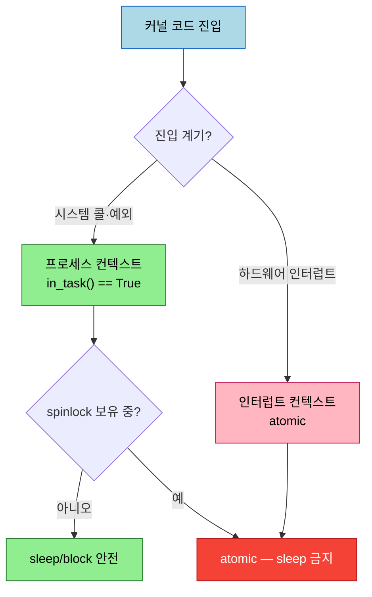

# 프로세스와 스레드 (2) — task 구조와 current
---
> 모든 스레드는 task_struct 라는 루트 메타데이터로 표현됩니다 — 스케줄링·메모리·PID/TGID·자격·시그널·열린 파일·하드웨어 컨텍스트를 담습니다. `current` 매크로가 지금 실행 중인 스레드의 task_struct 포인터를 줍니다(OOP 의 this 와 유사). 모든 task_struct 는 순환 이중 연결 리스트(task list)에 묶여 순회 가능합니다. TGID/PID 로 프로세스와 스레드를 구분합니다. 모듈의 init/exit 코드를 insmod/rmmod 프로세스가 직접 실행하는 것이 monolithic 의 증명입니다.

이 노트는 짝 노트(06-01)의 컨텍스트·VAS·스택에 이어, 각 스레드를 표현하는 핵심 구조와 그 접근법을 다룹니다. 아래 종합도가 이 노트의 척추 — task_struct 가 담는 것, current, task 리스트, TGID/PID — 입니다.


## 1. task 구조 (task_struct)

> 모든 유저·커널 스레드는 task_struct 메타데이터로 표현됩니다 — 스레드의 모든 속성을 담는 "루트" 구조입니다. 6.1.25 에서 약 13,120 바이트로 큽니다.

모든 스레드는 커널 안에서 `struct task_struct`(`include/linux/sched.h`)로 표현됩니다. 흔히 "process descriptor" 라 잘못 불려 혼란을 주지만, **task structure** 가 더 정확합니다 — 실행 가능한 task(=스레드)를 나타내기 때문입니다.

> Linux 설계: 모든 프로세스는 하나 이상의 스레드로 구성되고, 각 스레드는 task_struct 하나로 매핑됩니다.

task 구조는 스레드의 "루트" 메타데이터로, OS 가 그 스레드에 필요한 모든 정보를 담습니다 — 메모리(세그먼트·페이징 테이블·사용 정보), CPU 스케줄링, 열린 파일, 자격, capability, 타이머, 락, AIO 컨텍스트, 하드웨어 컨텍스트, 시그널, IPC, 자원 한도 등. (담는 내용은 위 종합도 SVG 참조.) 주요 멤버를 봅니다(6.1.25 기준 — 버전마다 다름).

```c
// include/linux/sched.h
struct task_struct {
    struct thread_info  thread_info;   // 플래그·상태 비트
    unsigned int        __state;
    void                *stack;         // 커널 모드 스택 위치
    // ... 스케줄링: prio, policy, se 등 (Ch 10·11)
    struct mm_struct    *mm;            // 메모리 관리 (Ch 7)
    pid_t               pid;            // 스레드 식별
    pid_t               tgid;           // 프로세스(스레드 그룹) 식별
    const struct cred __rcu *cred;      // 자격 (UID·EUID)
    struct signal_struct *signal;       // 시그널 핸들러
    char                comm[TASK_COMM_LEN];  // 태스크 이름
    struct files_struct *files;         // 열린 파일
    struct thread_struct thread;        // 하드웨어 컨텍스트
};
```

> `fork()`/`pthread_create()` 시 일부 속성은 자식에 상속되고, 일부는 기본값으로 리셋됩니다. 구조가 커서 `crash` 유틸·C `sizeof` 가 6.1.25 x86_64 에서 13,120 바이트로 보고합니다.


## 2. current 매크로

> `current` 는 지금 커널 코드를 실행 중인 스레드의 task_struct 포인터를 줍니다 — OOP 의 this 와 유사합니다. arch별로 O(1) 에 가깝게 최적화돼 있습니다. 프로세스 컨텍스트에서만 유효합니다.

수백~수천 개 task_struct 중, 지금 커널 코드를 실행 중인 스레드가 자기 task_struct 를 어떻게 찾을까요? `current` 매크로로 합니다.

1. `current` 는 **지금 실행 중인 프로세스 컨텍스트의 task_struct 포인터**를 줍니다.
2. OOP 언어의 `this` 포인터와 유사합니다(정확히 같진 않음).

구현은 arch별로 매우 다르고 빠르게(보통 O(1)) 설계됩니다 — ARM32 는 O(1) 계산, AArch64·PowerPC 는 전용 레지스터, x86_64 는 per-CPU 변수(락 없이)로 보관합니다. `<linux/sched.h>` 만 include 하면 씁니다.

```c
#include <linux/sched.h>
current->pid, current->comm    // 단, 헬퍼 메서드 사용이 권장됨
```

### 헬퍼 메서드 권장

멤버를 직접 `current->member` 로 접근하기보다 헬퍼를 씁니다 — PID 는 `task_pid_nr()`, 자격(EUID)은 `from_kuid()`. 이유는 ① 접근에 락이 필요할 수 있고 ② 더 최적의 방법이 있을 수 있고 ③ namespace 안에서만 의미가 있을 수 있기 때문입니다.

```c
unsigned int uid = from_kuid(&init_user_ns, current_uid());
task_pid_nr(current);  task_tgid_nr(current);
```


## 3. 컨텍스트 판별 — in_task()

> 커널의 황금률: atomic 컨텍스트에서는 sleep/block 하면 안 됩니다 — 커널 버그(락업·패닉)를 일으킵니다. `in_task()` 로 프로세스 컨텍스트인지 판별합니다.

커널 코드는 프로세스 컨텍스트(때로 atomic)와 인터럽트 컨텍스트(항상 atomic) 중 하나에서 실행되며, 둘은 상호 배타적입니다. **황금률: atomic 컨텍스트에서 sleep(block) 금지** — 커널 버그를 일으킵니다.

왜냐하면 sleep 은 context-switch(스케줄러 호출 + 컨텍스트 전환)를 뜻하는데, atomic 컨텍스트(하드웨어/소프트 인터럽트, spinlock 보유 중)는 중단 없이 완료돼야("atomic") 하기 때문입니다.

```c
#include <linux/preempt.h>
if (in_task())
    foo(); /* 프로세스 컨텍스트 — 보통 sleep/block 안전 */
else
    bar(); /* atomic 컨텍스트 — sleep/block 절대 금지 */
```

진입 계기에 따라 컨텍스트와 sleep 허용 여부가 갈립니다.



> 주의: ① `in_task()` 가 True 여도, spinlock 을 잡은 critical section 안이면 atomic 이라 sleep 하면 안 됩니다. ② `in_interrupt()` 는 BH disabling 간섭 때문에 권장 안 함 — `in_task()` 를 씁니다. ③ `current` 는 프로세스 컨텍스트에서만 유효합니다.


## 4. current 로 task 구조 다루기 + monolithic 증명

> `show_ctx()` 함수가 `current` 로 task_struct 멤버를 읽어 PID·TGID·UID·이름·상태를 출력합니다. 모듈의 init/exit 코드를 insmod/rmmod 프로세스가 직접 실행하는 것이 monolithic 의 증명입니다.

`current` 로 task_struct 를 dereference 해 정보를 출력하는 모듈입니다.

```c
// ch6/current_affairs/current_affairs.c
static void show_ctx(char *nm)
{
    unsigned int uid = from_kuid(&init_user_ns, current_uid());
    unsigned int euid = from_kuid(&init_user_ns, current_euid());
    if (likely(in_task())) {
        pr_info("... name: %s PID: %d TGID: %d UID: %u EUID: %u (%s root)\n"
            " state: %c current: 0x%pK stack: 0x%pK\n",
            current->comm, task_pid_nr(current), task_tgid_nr(current),
            uid, euid, (euid == 0 ? "have" : "don't have"),
            task_state_to_char(current), current, current->stack);
    } else
        pr_alert("Whoa! running in interrupt context [Should NOT Happen here!]\n");
}
```

> `likely()` 는 컴파일러 branch prediction 힌트(`__builtin_expect`)로 fast path 를 유지하는 마이크로 최적화입니다. `%pK` 는 보안용(kptr_restrict 에 따라 0/해시) — 단 root + 기본 설정이면 `%px` 와 같게 나옵니다.

### monolithic 증명

이 모듈을 insmod 하면 init 코드가 실행됩니다 — **누가 실행할까요?** 출력의 `name : insmod` 가 답입니다. **insmod 프로세스 자신**이 시스템 콜로 커널에 진입해 모듈 init 코드를 프로세스 컨텍스트에서 실행합니다. rmmod 도 마찬가지로 cleanup 코드를 실행합니다.

```
name : insmod   PID : ...   (init 코드 실행)
name : rmmod    PID : ...   (cleanup 코드 실행)
```

> **별도의 "커널" 프로세스가 모듈 코드를 실행하지 않습니다** — 유저 프로세스가 커널 모드로 전환해 직접 실행합니다. 이것이 monolithic 커널입니다. (microkernel 은 정반대 — 메시지 전달 방식. QNX·VxWorks 가 잘 만든 예.) 단 Linux 는 순수 monolithic 이 아니라 LKM 으로 모듈화도 지원합니다.

> 보안: 프로덕션에선 `kptr_restrict` 를 1 또는 2 로, `dmesg_restrict` 를 1 로 설정합니다.


## 5. task 리스트 순회

> 모든 task_struct 는 순환 이중 연결 리스트(task list)에 묶입니다. `for_each_process()`(프로세스만)·`for_each_process_thread()`(모든 스레드, 6.6+) 매크로로 순회합니다. 작업 시 `get_task_struct()`/`put_task_struct()` 로 참조를 보호합니다.

모든 task_struct 는 커널 메모리에서 순환 이중 연결 리스트(task list)에 묶입니다. `list_head` 구조(prev·next 포인터)가 기본입니다. 순회 매크로는 `include/linux/sched/signal.h`(4.11+)에 있습니다.

### 모든 프로세스 순회

`for_each_process()` 는 task list 의 모든 프로세스를 순회합니다 — 단 **각 프로세스의 main(T0) 스레드만** 봅니다.

```c
#define for_each_process(p) \
    for (p = &init_task ; (p = next_task(p)) != &init_task ; )
```

`init_task` 는 head — 항상 코어의 "idle" 스레드 task_struct 포인터(달리 실행할 게 없을 때 도는 스레드)입니다. 출력에서 TGID == PID 가 항상 같은 것이 main 스레드만 본다는 증거입니다.

### 모든 스레드 순회

모든 스레드를 보려면 `do_each_thread() { } while_each_thread()`(6.6 미만) 또는 `for_each_process_thread()`(6.6+)를 씁니다. 버전 차이를 매크로로 처리해 포터블하게 합니다.

```c
#if LINUX_VERSION_CODE < KERNEL_VERSION(6, 6, 0)
    do_each_thread(p, t) {     // p: 프로세스 ptr, t: 스레드 ptr
#else
    for_each_process_thread(p, t) {
#endif
        get_task_struct(t);    // 참조 획득 — 커널이 free 못 하게
        task_lock(t);
        // ... t->pid, t->tgid, t, t->stack 출력
        task_unlock(t);
        put_task_struct(t);    // 참조 해제
#if LINUX_VERSION_CODE < KERNEL_VERSION(6, 6, 0)
    } while_each_thread(p, t);
#else
    }
#endif
```

순회 시 짚을 점:

1. **참조 보호**: task_struct 를 읽기만 해도 `get_task_struct()`/`put_task_struct()` 로 참조를 잡아 커널이 갑자기 free 하지 못하게 합니다.
2. **idle 스레드**: 각 코어에 dedicated idle 스레드(`swapper/n`)가 있지만 루프가 거기서 시작 안 하므로 `init_task` 로 따로 표시합니다.
3. **커널 스레드 판별**: `p->mm` 이 NULL 이면 커널 스레드(유저 매핑 없음) — 관례상 이름을 `[대괄호]` 로 표시.
4. **안전한 출력**: `sprintf` 대신 버퍼 오버플로를 검사하는 래퍼(`snprintf_lkp()`)를 씁니다.
5. **스레드 수**: `get_nr_threads()` 로 프로세스의 스레드 수를 얻습니다.

> 스택 시작 주소가 모두 `0x...000` 으로 끝나는 건 커널 스택이 페이지 경계 정렬(4KB 배수)이기 때문입니다.


## 6. TGID 와 PID — 프로세스 vs 스레드

> Linux 는 모든 스레드에 고유 PID 를 줍니다. POSIX 의 "프로세스 PID 공유" 요구를 맞추려고 TGID(Thread Group ID)를 도입했습니다 — 같은 프로세스 스레드들은 같은 TGID 를, 각자 고유 PID 를 가집니다.

Linux 는 모든 스레드를 고유 task_struct 로 표현하고 그 안 PID 가 고유하므로, **모든 스레드가 고유 PID** 를 가집니다. 그런데 POSIX 는 한 프로세스의 스레드들이 공통 PID 를 공유하길 요구합니다. 이 충돌을 풀려고 Ingo Molnar 가 2.5 에 **TGID(Thread Group IDentifier)** 를 도입했습니다.

| | TGID | PID |
|---|------|-----|
| 단일 스레드 프로세스 | == PID | 고유 |
| 멀티스레드 main(T0) | == PID | 고유 |
| 멀티스레드 나머지 스레드 | == main 의 PID | 각자 고유 |

`ps -LA` 로 유저 공간에서 봅니다.

```
    PID   LWP  TTY  CMD
   2301  2301  ?    dhclient        ← main: PID==LWP
   2301  2302  ?    isc-worker0000  ← 같은 PID(=TGID), 다른 LWP
   2301  2303  ?    isc-socket
   2301  2304  ?    isc-timer
```

`ps` 의 **PID 열은 사실 커널의 tgid**, **LWP 열은 커널의 pid** 입니다. dhclient 는 TGID/PID 2301 의 main + 3개 worker = 4 스레드입니다.

> GNU ps 만 `-LA` 로 스레드를 보여줍니다(busybox ps 는 불가). `/proc/2301/task` 아래 sub-folder 로도 worker 스레드를 볼 수 있습니다 — GNU ps 도 내부적으로 이렇게 합니다.


## 다음 단계

> 프로세스·스레드·스택·task 구조를 익혔습니다. 다음 챕터부터 메모리 관리 내부로 들어갑니다.

여기까지 task_struct, current 매크로, 컨텍스트 판별, monolithic 증명, task 리스트 순회, TGID/PID 구분을 정리했습니다. 이 커널 내부 이해는 시스템 프로그래밍 디버깅과 다음 메모리 관리 학습의 토대입니다.

다음 챕터(Ch 7~9)는 메모리 관리 내부 — 책이 세 챕터를 할애하는 핵심 — 입니다.

1. **Ch 7 (메모리 관리 핵심)**: VM split, 유저/커널 VAS, 주소 변환, [K]ASLR, 물리 메모리 조직.
2. **Ch 8~9 (메모리 할당)**: slab/page 할당, `kzalloc`/`kfree`, `vmalloc`, OOM·demand paging.


## 관련 문서

> 이 노트는 task 구조편입니다. 컨텍스트·스택은 짝 노트가, 보안(kptr_restrict)은 앞 챕터가 다룹니다.

- [06-01.프로세스와 스레드 (1) — 컨텍스트·VAS·스택](./06-01.프로세스와%20스레드%20(1)%20—%20컨텍스트·VAS·스택.md) — 컨텍스트·VAS·스택 (짝 노트)
- [05-02.첫 커널 모듈 (4) — 시스템 정보·보안·자동 적재](./05-02.첫%20커널%20모듈%20(4)%20—%20시스템%20정보·보안·자동%20적재.md) — `%pK`·kptr_restrict 보안 배경
- [04-01.첫 커널 모듈 (1) — 커널 아키텍처와 LKM](./04-01.첫%20커널%20모듈%20(1)%20—%20커널%20아키텍처와%20LKM.md) — monolithic·시스템 콜 기초
- [00-00.책 개요와 학습 로드맵](./00-00.책%20개요와%20학습%20로드맵.md) — 3섹션·13챕터 전체 지도
