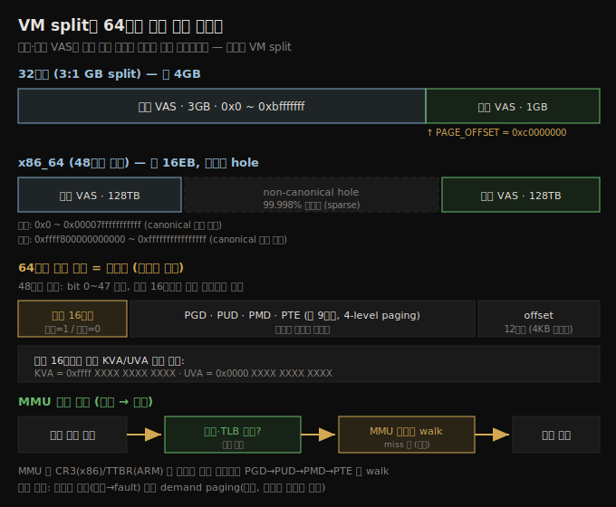

# 메모리 관리 (1) — VM split과 주소 변환
---
> 책이 세 챕터를 할애하는 메모리 관리의 시작입니다. 유저와 커널 VAS 는 같은 주소 공간을 User:Kernel 비율로 나눠 공유합니다 — 이것이 VM split 입니다(32비트 보통 3:1GB, x86_64 는 48비트로 128TB:128TB). 64비트 가상 주소는 절대값이 아니라 비트맵이라, 상위 16비트가 커널은 1·유저는 0이라 `0xffff.../0x0000...` 로 구분됩니다. MMU 가 페이징 테이블을 walk 해 가상 주소를 물리 주소로 변환합니다.

이 노트는 Ch 6 의 프로세스·스레드·스택 이해 위에서, 메모리가 어떻게 가상화되는지를 봅니다. VM split 의 개념과 위치, 가상 주소가 비트맵으로 어떻게 해석되는지, MMU 의 주소 변환을 다룹니다. VAS 검사(maps·procmap)와 물리 메모리는 이어지는 노트로 넘깁니다. 아래 종합도가 이 노트의 척추 — VM split 과 64비트 주소 비트맵, MMU 변환 — 입니다.




## 1. VM split — 유저와 커널이 주소 공간을 나누는 법

> 시스템 콜을 내면 커널 코드를 호출해야 하는데, 커널 VAS 가 "box 밖"이면 부를 수 없습니다. 해결책은 유저와 커널 VAS 를 같은 box 안에 User:Kernel 비율로 나눠 두는 것입니다 — 이것이 VM split.

가용 VAS 의 최고 주소는 주소 비트 수에 달렸습니다 — 32비트는 2^32 = 4GB, 64비트는 2^64 = 16EB(exabyte). 32비트로 단순화해 보면, 프로세스 VAS 는 0~4GB 이고 빈 공간(sparse 영역·hole)과 유효 매핑(text·data·library·stack)으로 이뤄집니다.

### Hello, world 가 보여주는 것

`printf()` 코드는 직접 쓴 적 없고 glibc 안에 있습니다. 그런데 "box 밖은 볼 수 없다"면 어떻게 호출할까요? 답: glibc 의 코드·데이터가 프로세스 VAS 안에 **매핑**돼 있기 때문입니다. 앱 시작 시 **loader**(`ld-linux*.so`)가 필요한 공유 라이브러리를 `mmap()` 으로 프로세스 VAS 에 매핑합니다.

```bash
$ ldd ./helloworld
        linux-vdso.so.1 (0x00007fffcfce3000)
        libc.so.6 => /lib/x86_64-linux-gnu/libc.so.6 (0x00007feb7b85b000)
        /lib64/ld-linux-x86-64.so.2 (0x00007feb7be4e000)
```

모든 Linux 프로세스는 자동으로 최소 둘 — glibc 와 loader — 에 링크됩니다(명시적 스위치 불필요). 괄호 안은 매핑된 UVA 로, ASLR 이 켜지면 매 실행마다 달라집니다.

### write() 와 VM split 의 필요성

`printf()` 는 `write()` 시스템 콜을 내고, 그 커널 코드는 커널 VAS 에 있습니다. 커널 VAS 가 "box 밖"이면 부를 수 없습니다. 유저·커널 VAS 를 별도 4GB 공간에 두면 컨텍스트 스위칭이 크게 느려지므로(TLB flush 비용), **둘을 같은 box 안에 User:Kernel(U:K) 비율로 나눠** 둡니다 — 이것이 VM split.

AArch32·x86-32 의 기본 split 은 보통 **3:1 GB**(유저 3GB + 커널 1GB)입니다. 시스템 콜 시 같은 프로세스 VAS 안에서 커널 VAS 로 컨텍스트 스위치해 커널 코드를 프로세스 컨텍스트·특권 모드로 실행하고, 끝나면 유저 모드로 돌아옵니다.

커널 VAS 시작 가상 주소는 **`PAGE_OFFSET`** 매크로로 표현됩니다. 32비트에서 VM split 은 빌드 시 설정 가능합니다.

```bash
$ zcat /proc/config.gz | grep VMSPLIT
CONFIG_VMSPLIT_3G=y
# CONFIG_VMSPLIT_3G_OPT is not set
# CONFIG_VMSPLIT_2G is not set
# CONFIG_VMSPLIT_1G is not set
CONFIG_PAGE_OFFSET=0xC0000000
```

3:1 split 이면 `PAGE_OFFSET` = `0xC0000000`(3GB)입니다.


## 2. 가상 주소와 주소 변환

> 가상 주소는 절대값(0부터의 오프셋)이 아니라 MMU 가 해석하는 비트맵입니다. 코드를 유저 공간에서 보면 UVA, 커널에서 보면 KVA 입니다. 비트맵은 페이징 테이블 인덱스(PGD·PUD·PMD·PTE)와 offset 으로 나뉩니다.

다음 코드가 출력하는 주소는 (거의 항상) 물리 주소가 아니라 **가상 주소**입니다.

```c
int i = 5;
printf("address of i is 0x%x\n", &i);
```

두 종류로 나뉩니다.

1. **UVA(User Virtual Address)**: 유저 공간 프로세스에서 본 주소.
2. **KVA(Kernel Virtual Address)**: 커널/모듈에서 본 주소(`printk()` 로 출력).

가상 주소는 절대값이 아니라 **MMU 가 해석하는 비트맵**입니다(MMU 는 모던 프로세서 silicon 안에 있음). 32비트 Linux 에서 32비트는 PGD·PT 값과 offset 으로 나뉘어 물리 메모리 인덱스가 됩니다.

### 64비트 가상 주소 비트맵

x86_64 는 보통 LSB **48비트만** 주소에 씁니다(64비트 전부는 너무 큼 — 2^64 = 16EB). 상위 16비트는 부호 확장처럼 처리되며, 그 값이 주소 공간에 따라 갈립니다.

1. **커널 VAS**: 상위 16비트가 항상 1.
2. **유저 VAS**: 상위 16비트가 항상 0.

그래서 전체 64비트 주소만 보고 KVA/UVA 를 즉시 구분할 수 있습니다.

| 종류 | 형식 |
|------|------|
| KVA | `0xffff XXXX XXXX XXXX` |
| UVA | `0x0000 XXXX XXXX XXXX` |

> bit 63 이 페이징 테이블 selector — 설정 시 커널 페이징 테이블(`swapper_pg_dir`), 클리어 시 프로세스 페이징 테이블(베이스 물리 주소는 x86 의 CR3, ARM 의 TTBR0)이 쓰입니다. **N-level paging**: 48비트 비트맵은 PGD·PUD·PMD·PTE 4단계 indirection 을 거쳐 offset 에 닿습니다 — 그래서 4-level paging.


## 3. MMU 의 주소 변환 — 개요

> 가상 주소는 비트맵이라 MMU 가 페이징 테이블을 walk 해 물리 주소로 변환합니다. 캐시·TLB 히트면 빠른 경로로 건너뛰고, miss 면 MMU 가 PGD→PUD→PMD→PTE 를 따라 물리 페이지 프레임을 찾습니다.

메모리 관리는 일이 나뉩니다 — 모든 프로세스는 가상 페이지를 물리 페이지 프레임에 매핑하는 페이징 테이블을 갖고(커널도 자기 것을), OS 가 이를 만들고 조작하며, MMU 가 런타임에 변환합니다.

하드웨어 페이징의 전체 흐름(x86 기준)입니다. (이 흐름은 위 종합도 SVG 참조.)

1. 프로세스가 가상 주소(UVA/KVA)를 읽기/쓰기/실행합니다.
2. 그 위치에서 작업하려면 물리 주소로 변환해야 합니다.
3. 하드웨어 최적화 — 빠른 경로로 건너뛸 수 있습니다.
   - **CPU 캐시(L1/L2/L3)** 에 이미 있으면 cache-hit — 캐시 안에서 처리. 없으면 cache miss(LLC miss, 비쌈).
   - **TLB(Translation Lookaside Buffer)** 에 변환이 이미 있으면 TLB hit — 캐시된 물리 주소로 5단계로. 없으면 TLB miss(비쌈).
4. **MMU 가 페이징 테이블을 walk** — 프로세스(또는 커널) 베이스 페이지 테이블의 물리 주소를 시스템 레지스터에서 알고, 페이지 프레임·물리 주소를 얻습니다.
5. 물리 주소가 CPU 주소 라인에 실려 작업이 수행됩니다.

### MMU 가 하는 일 (상세)

MMU 는 베이스 주소(x86 의 CR3, ARM 의 user=TTBR0/kernel=TTBR1 — 모두 **물리 주소**, 아니면 무한 재귀)에서 시작해, 가상 주소 비트맵의 PGD 9비트를 더해 lookup → 다음 테이블 포인터 → PUD → PMD → PTE 반복. PTE 가 물리 페이지 프레임 포인터를 담고, 12비트 offset 을 더하면 물리 주소가 나옵니다.

두 가지 nuance:

1. **변환 실패 가능**: ① 잘못된 가상 주소(unmapped) — 버그라 MMU 가 fault 를 raise(OS fault handler 처리). ② **demand paging** — 가상 주소는 합법이나 물리 메모리가 아직 미할당이라 변환 실패 → MMU 가 'good' fault 를 raise 해 페이지 프레임 할당(Ch 9 에서 상세).
2. **커널은 MMU 우회 가능**: 커널은 소프트웨어로 직접 변환할 수 있으나 느려서 드물게만 합니다(`/proc/PID/mem` mmap 으로 read-only 메모리에 쓰는 경우 등).


## 4. 64비트 시스템의 VM split

> 64비트는 64비트 전부를 주소에 쓰지 않습니다(2^64 = 16EB 는 너무 큼). x86_64 는 48비트로 128TB:128TB split 이 기본이고, 중간은 거대한 non-canonical hole 입니다.

x86_64(48비트 주소, 4KB 페이지)는 16EB VAS 를 둘로 나눕니다.

1. **canonical 하위 절반** (128TB): 유저 VAS — `0x0` ~ `0x0000 7fff ffff ffff`.
2. **canonical 상위 절반** (128TB): 커널 VAS — `0xffff 8000 0000 0000` ~ `0xffff ffff ffff ffff`.

> canonical = 법·관례대로. 중간(`0x0000 8000...` ~ `0xffff 7fff...`)은 **non-canonical hole** — sparse 영역입니다. 48비트 주소면 VAS 의 99.998% 가 미사용이라, VAS 는 대부분 비어 있어 sparse 합니다.

### 공통 VM split

| arch | VM split | 주소 비트 |
|------|----------|----------|
| IA-32 / x86-32 | 3:1 GB | 32 |
| AArch32 | 2:2 GB 등 | 32 |
| **x86_64 (4-level, 일반)** | **128TB : 128TB** | **48** |
| x86_64 (5-level, 4.14+) | 64PB : 64PB | 57 |
| AArch64 (VA_BITS=39) | 512GB : 512GB | 40 |
| AArch64 (VA_BITS=48) | 256TB : 256TB | 49 |
| AArch64 (LPA, 64K 페이지) | 4PB : 4PB | 53 |

> 주소 비트 수가 전체 in-use VAS(유저+커널) 크기를 정하고, 각 VAS 가 보통 절반씩 가집니다(32비트 x86·ARM 은 의도적으로 불균등 가능). x86_64 가 48비트인 이유: 유저 128TB + 커널 128TB = 256TB = 2^48 이라서.

> **커널 메모리는 항상 non-swappable** — swap 으로 page out 되지 않습니다(성능 최적화). 유저 페이지는 `mlock[all]()` 으로 잠그지 않는 한 paging 대상.

### 전체 프로세스 VAS

모든 프로세스는 고유한 유저 VAS 를 갖되 **같은 커널 VAS 를 공유**합니다. 32비트 3:1 split 에서 유저 VAS 는 0~`0xbfffffff`, 커널 VAS 는 `0xc0000000`(3GB)~`0xffffffff`(4GB). 64비트도 개념은 같고 숫자만 (크게) 달라집니다(128TB:128TB).


## 다음 단계

> split 과 변환을 봤으니, 다음 노트에서 실제 프로세스·커널 VAS 를 도구로 들여다봅니다.

여기까지 VM split, 가상 주소 비트맵, MMU 주소 변환을 정리했습니다. 다음 노트는 이 VAS 를 실제로 검사하는 법입니다.

1. **프로세스 VAS 검사**: `/proc/PID/maps`, VMA, procmap 유틸리티.
2. **커널 VAS 검사 + [K]ASLR**: 커널 VAS 매크로, LKM 으로 조회, 메모리 레이아웃 랜덤화.


## 관련 문서

> 이 노트는 split·변환편입니다. VAS 검사는 짝 노트가, 프로세스 VAS 기초는 앞 챕터가 다룹니다.

- [07-02.메모리 관리 (2) — VAS 검사와 KASLR](./07-02.메모리%20관리%20(2)%20—%20VAS%20검사와%20KASLR.md) — maps·VMA·procmap·커널 VAS (짝 노트)
- [07-03.메모리 관리 (3) — 물리 메모리와 NUMA](./07-03.메모리%20관리%20(3)%20—%20물리%20메모리와%20NUMA.md) — 노드·존·sparsemem (짝 노트)
- [06-01.프로세스와 스레드 (1) — 컨텍스트·VAS·스택](./06-01.프로세스와%20스레드%20(1)%20—%20컨텍스트·VAS·스택.md) — 프로세스 VAS 세그먼트 기초
- [00-00.책 개요와 학습 로드맵](./00-00.책%20개요와%20학습%20로드맵.md) — 3섹션·13챕터 전체 지도
