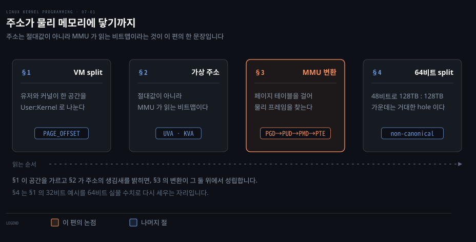
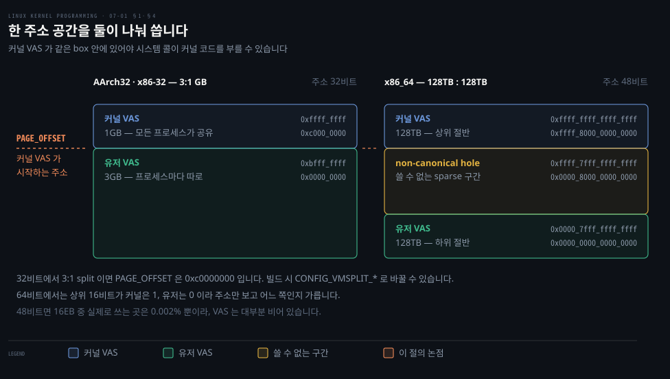
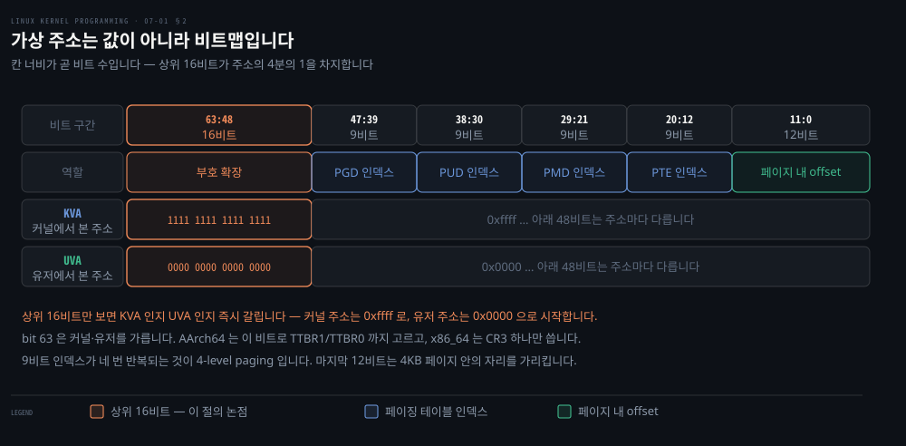
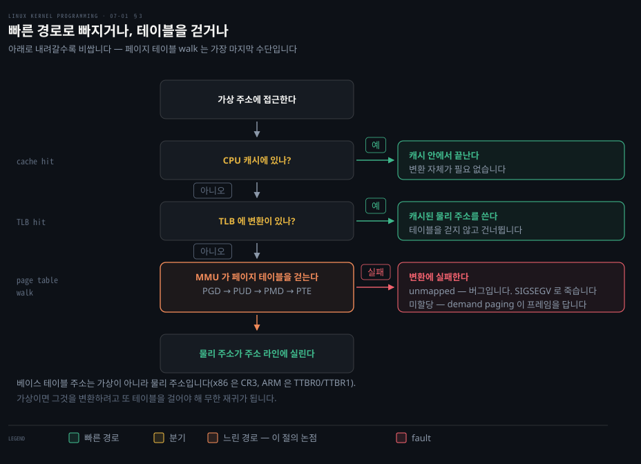

# 메모리 관리 (1) — VM split과 주소 변환
---
> 유저와 커널 VAS 는 별도 공간이 아니라 같은 주소 공간을 User:Kernel 비율로 나눠 씁니다. 그리고 64비트 가상 주소는 절대값이 아니라 MMU 가 읽는 비트맵입니다.

이 두 문장이 이 노트의 전부입니다. 첫 번째가 VM split 이고, 32비트는 보통 3:1 GB, x86_64 는 48비트 주소로 128TB:128TB 를 씁니다. 두 번째 덕분에 주소의 상위 16비트만 보고 커널 주소(`0xffff...`)인지 유저 주소(`0x0000...`)인지 즉시 가릴 수 있습니다.

이 노트는 Ch 6 의 프로세스·스레드·스택 이해 위에서, 메모리가 어떻게 가상화되는지를 봅니다. VM split 의 개념과 위치, 가상 주소의 비트맵 해석, MMU 의 주소 변환을 다룹니다. VAS 검사(maps·procmap)와 물리 메모리는 이어지는 노트로 넘깁니다.

아래는 이 노트의 네 절이 어떻게 이어지는지를 한 장으로 이은 지도입니다. 각 카드의 절 번호가 본문에서 그것을 다루는 곳입니다.




## 1. VM split — 유저와 커널이 주소 공간을 나누는 법

> 시스템 콜을 내면 커널 코드를 호출해야 하는데, 커널 VAS 가 "box 밖"이면 부를 수 없습니다. 해결책은 유저와 커널 VAS 를 같은 box 안에 User:Kernel 비율로 나눠 두는 것입니다.



도식의 두 열은 같은 이야기를 다른 수치로 합니다. 왼쪽은 32비트 3:1 GB, 오른쪽은 x86_64 의 128TB:128TB 이고, 띠 높이가 곧 크기 비율입니다.

### 풀려는 문제

`printf()` 한 줄을 쓴 프로그램이 있다고 해 봅시다. `printf()` 코드는 직접 쓴 적이 없고 glibc 안에 있습니다. 프로세스가 자기 주소 공간이라는 "box 밖"은 볼 수 없다면, 이 호출은 어떻게 성립할까요. 그리고 `printf()` 가 결국 부르는 `write()` 시스템 콜의 커널 코드는 또 어디에 있을까요.

이 물음에 답하려면 프로세스 VAS 가 어디서 시작해 어디서 끝나는지, 그 안에 무엇이 매핑돼 있는지를 알아야 합니다. 이 절이 그 답을 줍니다.

### VAS 의 크기는 주소 비트 수가 정합니다

가용 VAS 의 최고 주소는 주소 비트 수에 달렸습니다. 32비트는 2^32 = 4GB, 64비트는 2^64 = 16EB(exabyte)입니다. 32비트로 단순화해 보면 프로세스 VAS 는 0~4GB 이고, 그 안은 두 종류로 채워집니다.

- **빈 공간**: sparse 영역, 또는 hole
- **유효 매핑**: text, data, library, stack

### Hello, world 가 보여주는 것

`printf()` 를 부를 수 있는 이유는 간단합니다. glibc 의 코드와 데이터가 프로세스 VAS 안에 **매핑**돼 있기 때문입니다. 앱이 시작할 때 **loader**(`ld-linux*.so`)가 필요한 공유 라이브러리를 `mmap()` 으로 프로세스 VAS 에 매핑합니다.

```bash
ldd ./helloworld
```

```bash
linux-vdso.so.1 (0x00007fffcfce3000)
libc.so.6 => /lib/x86_64-linux-gnu/libc.so.6 (0x00007feb7b85b000)
/lib64/ld-linux-x86-64.so.2 (0x00007feb7be4e000)
```

모든 Linux 프로세스는 glibc 와 loader 둘에 자동으로 링크됩니다. 명시적인 스위치가 필요 없습니다. 괄호 안은 매핑된 UVA 입니다. ASLR 이 켜지면 매 실행마다 이 값이 달라집니다.

### write() 와 VM split 의 필요성

`printf()` 는 `write()` 시스템 콜을 내고, 그 커널 코드는 커널 VAS 에 있습니다. 커널 VAS 가 "box 밖"이면 부를 수 없습니다.

유저와 커널 VAS 를 별도 4GB 공간에 두는 방법도 있지만, 그러면 컨텍스트 스위칭이 크게 느려집니다. TLB flush 비용 때문입니다. 그래서 **둘을 같은 box 안에 User:Kernel(U:K) 비율로 나눠** 둡니다. 이것이 VM split 입니다.

AArch32·x86-32 의 기본 split 은 보통 **3:1 GB** 입니다. 유저 3GB 에 커널 1GB 입니다. 시스템 콜이 나면 같은 프로세스 VAS 안에서 커널 VAS 로 컨텍스트 스위치해 커널 코드를 프로세스 컨텍스트·특권 모드로 실행하고, 끝나면 유저 모드로 돌아옵니다.

커널 VAS 가 시작하는 가상 주소는 **`PAGE_OFFSET`** 매크로로 표현됩니다. 32비트에서 VM split 은 빌드 시 설정할 수 있습니다.

```bash
zcat /proc/config.gz | grep VMSPLIT
```

```bash
CONFIG_VMSPLIT_3G=y
# CONFIG_VMSPLIT_3G_OPT is not set
# CONFIG_VMSPLIT_2G is not set
# CONFIG_VMSPLIT_1G is not set
CONFIG_PAGE_OFFSET=0xC0000000
```

3:1 split 이면 `PAGE_OFFSET` 은 `0xC0000000`(3GB)입니다.


## 2. 가상 주소와 주소 변환

> 가상 주소는 0부터의 오프셋 같은 절대값이 아니라 MMU 가 해석하는 비트맵입니다. 그래서 상위 16비트만 보고 커널 주소인지 유저 주소인지 즉시 가릴 수 있습니다.



도식의 칸 너비는 비트 수에 비례합니다. 상위 16비트가 주소의 4분의 1을 차지하고, 나머지 48비트가 네 개의 9비트 인덱스와 12비트 offset 으로 갈립니다.

### 풀려는 문제

다음 코드가 출력하는 주소는 (거의 항상) 물리 주소가 아닙니다.

```c
int i = 5;
printf("address of i is 0x%x\n", &i);
```

출력된 것이 물리 주소가 아니라면 대체 무엇이고, 그 숫자를 어떻게 읽어야 할까요. 이 절이 그 숫자의 생김새를 밝힙니다.

### UVA 와 KVA

가상 주소는 보는 자리에 따라 두 이름으로 갈립니다.

- **UVA(User Virtual Address)**: 유저 공간 프로세스에서 본 주소
- **KVA(Kernel Virtual Address)**: 커널·모듈에서 본 주소, `printk()` 로 출력하는 것

둘 다 절대값이 아니라 **MMU 가 해석하는 비트맵**입니다. MMU(Memory Management Unit)는 모던 프로세서 silicon 안에 들어 있는 주소 변환 전용 하드웨어입니다. 32비트 Linux 에서 32비트는 PGD·PT 값과 offset 으로 나뉘어 물리 메모리 인덱스가 됩니다.

### 64비트 가상 주소 비트맵

x86_64 는 보통 LSB **48비트만** 주소에 씁니다. 64비트 전부는 너무 크기 때문입니다(2^64 = 16EB). 상위 16비트는 부호 확장처럼 처리되며, 그 값이 주소 공간에 따라 갈립니다.

1. **커널 VAS**: 상위 16비트가 항상 1
2. **유저 VAS**: 상위 16비트가 항상 0

그래서 전체 64비트 주소만 보고 KVA 인지 UVA 인지 즉시 구분할 수 있습니다.

| 종류 | 형식 |
|------|------|
| KVA | `0xffff XXXX XXXX XXXX` |
| UVA | `0x0000 XXXX XXXX XXXX` |

> bit 63 은 페이징 테이블 selector 이기도 합니다. 설정되면 커널 페이징 테이블(`swapper_pg_dir`), 클리어되면 프로세스 페이징 테이블이 쓰입니다. 프로세스 테이블의 베이스 물리 주소는 x86 의 CR3, ARM 의 TTBR0 가 갖습니다.

48비트 비트맵은 PGD·PUD·PMD·PTE 네 단계 indirection 을 거쳐 offset 에 닿습니다. **N-level paging** 이라 부르고, 여기서는 4-level paging 입니다.


## 3. MMU 의 주소 변환 — 개요

> 가상 주소가 비트맵이므로 누군가는 그것을 물리 주소로 바꿔야 합니다. 그 일을 MMU 가 하는데, 캐시나 TLB 에 답이 이미 있으면 변환 자체를 건너뜁니다.



도식에서 아래로 내려갈수록 비쌉니다. 오른쪽으로 빠지는 두 화살표가 빠른 경로이고, 페이지 테이블 walk 는 둘 다 빗나갔을 때의 마지막 수단입니다.

### 풀려는 문제

메모리 관리는 일이 나뉘어 있습니다. 모든 프로세스는 가상 페이지를 물리 페이지 프레임에 매핑하는 페이징 테이블을 갖고(커널도 자기 것을 갖습니다), OS 가 이를 만들고 조작하며, MMU 가 런타임에 변환합니다.

그런데 변환을 매번 다 한다면 메모리 접근마다 테이블을 네 번 걷게 됩니다. 실제로는 그렇지 않은데, 어디서 건너뛰는지를 알아야 성능 문제를 읽을 수 있습니다.

### 하드웨어 페이징의 전체 흐름

x86 기준입니다.

1. 프로세스가 가상 주소(UVA 또는 KVA)를 읽기·쓰기·실행합니다.
2. 그 위치에서 작업하려면 물리 주소로 변환해야 합니다.
3. 하드웨어 최적화가 여기서 빠른 경로를 엽니다.
   - **CPU 캐시(L1/L2/L3)** 에 이미 있으면 cache hit 이라 캐시 안에서 처리합니다. 없으면 cache miss 이고, LLC miss 는 비쌉니다.
   - **TLB(Translation Lookaside Buffer)** 에 변환이 이미 있으면 TLB hit 이라 캐시된 물리 주소로 5단계로 건너뜁니다. 없으면 TLB miss 이고 역시 비쌉니다.
4. **MMU 가 페이징 테이블을 걷습니다.** 프로세스(또는 커널) 베이스 페이지 테이블의 물리 주소를 시스템 레지스터에서 알고, 페이지 프레임과 물리 주소를 얻습니다.
5. 물리 주소가 CPU 주소 라인에 실려 작업이 수행됩니다.

### MMU 가 하는 일 (상세)

MMU 는 베이스 주소에서 시작합니다. x86 은 CR3, ARM 은 유저가 TTBR0·커널이 TTBR1 이고, 모두 **물리 주소**입니다. 가상이면 그것을 변환하려고 또 테이블을 걸어야 해 무한 재귀가 됩니다.

거기에 가상 주소 비트맵의 PGD 9비트를 더해 lookup 하면 다음 테이블 포인터가 나옵니다. PUD, PMD 로 같은 일을 반복해 PTE 에 닿습니다. PTE 가 물리 페이지 프레임 포인터를 담고 있어, 12비트 offset 을 더하면 물리 주소가 나옵니다.

여기에 두 가지 nuance 가 있습니다.

**변환은 실패할 수 있습니다.** 원인이 둘로 갈립니다. 하나는 잘못된 가상 주소(unmapped)로, 이건 버그라 MMU 가 fault 를 raise 하고 OS fault handler 가 처리합니다. 다른 하나는 **demand paging** 으로, 가상 주소는 합법인데 물리 메모리가 아직 미할당이라 변환에 실패하는 경우입니다. 이때 MMU 는 'good' fault 를 raise 해 페이지 프레임을 할당하게 합니다(Ch 9 에서 상세히 다룹니다).

**커널은 MMU 를 우회할 수 있습니다.** 소프트웨어로 직접 변환할 수 있으나 느려서 드물게만 합니다. `/proc/PID/mem` 을 mmap 해 read-only 메모리에 쓰는 경우 등입니다.


## 4. 64비트 시스템의 VM split

> 64비트라고 64비트 전부를 주소에 쓰지는 않습니다. x86_64 는 48비트로 128TB:128TB 를 나누고, 그 사이는 거대한 non-canonical hole 입니다.

§1 의 3:1 GB 는 32비트 예시였습니다. 실제로 쓰는 64비트 수치를 여기서 세워 둡니다.

x86_64 는 48비트 주소와 4KB 페이지를 전제로 16EB VAS 를 둘로 나눕니다.

1. **canonical 하위 절반** (128TB): 유저 VAS — `0x0` ~ `0x0000 7fff ffff ffff`
2. **canonical 상위 절반** (128TB): 커널 VAS — `0xffff 8000 0000 0000` ~ `0xffff ffff ffff ffff`

canonical 은 법·관례대로라는 뜻입니다. 중간(`0x0000 8000...` ~ `0xffff 7fff...`)은 **non-canonical hole** 이고 sparse 영역입니다. 48비트 주소면 VAS 의 99.998% 가 미사용이라, VAS 는 대부분 비어 있습니다.

### 공통 VM split

| arch | VM split | 주소 비트 |
|------|----------|----------|
| IA-32 / x86-32 | 3:1 GB | 32 |
| AArch32 | 2:2 GB 등 | 32 |
| **x86_64 (4-level, 일반)** | **128TB : 128TB** | **48** |
| x86_64 (5-level, 4.14+) | 64PB : 64PB | 57 |
| AArch64 (VA_BITS=39) | 512GB : 512GB | 40 |
| AArch64 (VA_BITS=48) | 256TB : 256TB | 49 |
| AArch64 (LPA, 64K 페이지) | 4PB : 4PB | 53 |

주소 비트 수가 전체 in-use VAS 의 크기를 정합니다. 유저와 커널이 보통 절반씩 나눠 갖되, 32비트 x86·ARM 은 의도적으로 불균등하게 둘 수 있습니다.

x86_64 가 48비트인 이유도 여기서 나옵니다. 유저 128TB 에 커널 128TB 를 더하면 256TB 입니다. 그 값이 정확히 2^48 입니다.

> **커널 메모리는 항상 non-swappable 입니다.** swap 으로 page out 되지 않습니다(성능 최적화). 유저 페이지는 `mlock[all]()` 으로 잠그지 않는 한 paging 대상입니다.

### 전체 프로세스 VAS

모든 프로세스는 고유한 유저 VAS 를 갖되 **같은 커널 VAS 를 공유**합니다.

32비트 3:1 split 의 경계는 이렇습니다.

- **유저 VAS**: `0x0` ~ `0xbfffffff`
- **커널 VAS**: `0xc0000000`(3GB) ~ `0xffffffff`(4GB)

64비트도 개념은 같고 숫자만 크게 달라집니다. x86_64 면 128TB 대 128TB 입니다.


## 다음 단계

> split 과 변환을 봤으니, 다음 노트에서 실제 프로세스·커널 VAS 를 도구로 들여다봅니다.

여기까지 VM split, 가상 주소 비트맵, MMU 주소 변환을 정리했습니다. 다음 노트는 이 VAS 를 실제로 검사하는 법입니다.

1. **프로세스 VAS 검사**: `/proc/PID/maps`, VMA, procmap 유틸리티.
2. **커널 VAS 검사 + [K]ASLR**: 커널 VAS 매크로, LKM 으로 조회, 메모리 레이아웃 랜덤화.


## 관련 문서

> 이 노트는 split·변환편입니다. VAS 검사는 짝 노트가, 프로세스 VAS 기초는 앞 챕터가 다룹니다.

- [07-02.메모리 관리 (2) — VAS 검사와 KASLR](./07-02.메모리%20관리%20(2)%20—%20VAS%20검사와%20KASLR.md) — maps·VMA·procmap·커널 VAS (짝 노트)
- [07-03.메모리 관리 (3) — 물리 메모리와 NUMA](./07-03.메모리%20관리%20(3)%20—%20물리%20메모리와%20NUMA.md) — 노드·존·sparsemem (짝 노트)
- [06-01.프로세스와 스레드 (1) — 컨텍스트·VAS·스택](./06-01.프로세스와%20스레드%20(1)%20—%20컨텍스트·VAS·스택.md) — 프로세스 VAS 세그먼트 기초
- [00-00.책 개요와 학습 로드맵](./00-00.책%20개요와%20학습%20로드맵.md) — 3섹션·13챕터 전체 지도
