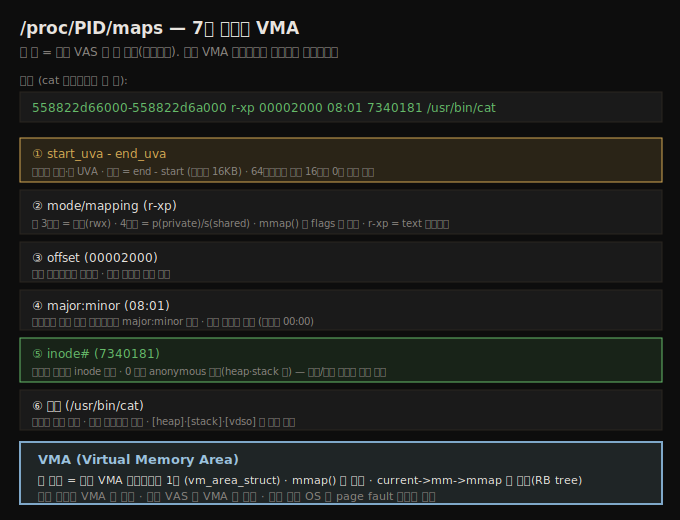

# 메모리 관리 (2) — VAS 검사와 KASLR
---
> 앞 노트의 VM split 개념 위에서, 실제 VAS 를 도구로 들여다봅니다. `/proc/PID/maps` 한 줄은 유저 VAS 의 한 매핑이며 7개 필드로 구성되고, 각 매핑은 커널의 VMA 메타데이터 하나에 대응합니다(mmap 시 생성). 커널 VAS 는 매크로(`PAGE_OFFSET`·`VMALLOC_START` 등)와 LKM 으로 조회합니다. [K]ASLR 은 메모리 레이아웃을 랜덤화해 공격을 막습니다 — 매 실행마다 주소가 달라집니다.

이 노트는 짝 노트(07-01)의 VM split 위에서, 프로세스 VAS 와 커널 VAS 를 실제로 검사하는 법을 다룹니다. 물리 메모리는 이어지는 노트로 넘깁니다. 아래 종합도가 이 노트의 실용 핵심 — `/proc/PID/maps` 7개 필드와 VMA — 입니다.




## 1. 프로세스 VAS 검사 — /proc/PID/maps

> procfs 가 커널 내부를 들여다보는 인터페이스입니다. `/proc/PID/maps` 는 유저 VAS 의 상세 메모리 맵을 제공합니다. 자기 프로세스는 `self` 키워드로, 임의 프로세스는 root 권한으로 봅니다.

procfs(`/proc`)는 항상 마운트되는 pseudo 파일시스템으로 두 역할을 합니다 — ① 커널·하드웨어 내부를 들여다보는 통합 인터페이스 ② root 가 커널 파라미터를 바꾸는 통합 인터페이스(`/proc/sys/`, sysctl).

자기 프로세스의 VAS 는 `self` 키워드로 봅니다(임의 프로세스는 root 필요).

```bash
$ cat /proc/self/maps
```

### maps 한 줄 해석 — 7개 필드

각 줄은 유저 VAS 의 한 세그먼트(매핑)이며, 7개 필드로 구성됩니다(샘플은 위 종합도 SVG 참조).

```
558822d66000-558822d6a000  r-xp  00002000  08:01  7340181  /usr/bin/cat
```

1. **start_uva - end_uva**: 시작·끝 UVA. 길이 = end - start(여기선 16KB). 64비트라도 UVA 는 상위 16비트가 0이라 생략 표시(`558822d66000`).
2. **mode/mapping (r-xp)**: 앞 3글자 = 권한(rwx), 4번째 = p(private)/s(shared). `mmap()` 의 flags 가 결정 — 모든 매핑은 `mmap()` 이 만듭니다. `r-xp` = text 세그먼트.
3. **offset (00002000)**: 파일 시작에서의 오프셋(파일 매핑일 때만).
4. **major:minor (08:01)**: 이미지가 있는 블록 디바이스 번호(파일 매핑일 때만, 아니면 00:00).
5. **inode# (7340181)**: 이미지 파일 inode. **0 이면 anonymous 매핑**(heap·stack) — 파일/익명 구분의 빠른 방법.
6. **경로 (/usr/bin/cat)**: 매핑된 파일 경로. 익명이면 빈칸.

> 모든 주소는 가상(UVA)이며 그 프로세스의 페이징 테이블로 변환됩니다. `[vsyscall]`·`[vdso]`·`[vvar]` 같은 특수 매핑도 보입니다 — 일부 시스템 콜(gettimeofday 등)을 커널 모드 전환 없이 빠르게 하는 최적화입니다.

### 프론트엔드

raw `/proc/PID/maps` 외에 더 읽기 쉬운 도구들이 있습니다.

| 도구 | 역할 |
|------|------|
| `/proc/PID/smaps` | 각 세그먼트의 상세 정보(RSS·PSS 등) |
| `pmap` | 프로세스 VAS 표시 (`-X`·`-XX` 로 상세) |
| `smem` | 어느 프로세스가 물리 메모리를 가장 많이 쓰나(RSS·PSS·USS) |
| `procmap` | 커널+유저 VAS 를 세로 타일로 시각화 (저자 작) |


## 2. procmap — VAS 시각화

> procmap 은 커널·유저 VAS 전체를 세로 타일 형식(주소 내림차순)으로 시각화하는 콘솔 유틸리티입니다. 커널 정보는 LKM 으로, 유저 정보는 `/proc/PID/maps` 로 얻습니다.

`procmap`(저자 작, `github.com/kaiwan/procmap`)은 Linux 프로세스의 완전한 메모리 맵 — 커널+유저 VAS — 을 세로 타일 형식(주소 내림차순)으로 시각화합니다. 각 세그먼트는 상대 크기로 스케일·색상 구분되고, 64비트에선 거대한 non-canonical hole 도 보입니다.

```bash
$ ./procmap --pid=<PID>          # 커널+유저 VAS 둘 다
$ ./procmap --only-user --pid=<PID>   # 유저만
$ ./procmap --only-kernel --pid=<PID> # 커널만
```

동작 방식: 커널 정보는 **LKM(커널 모듈)**으로 커널을 조회해 debugfs pseudo 파일로 user space 와 인터페이스하고, 유저 정보는 `/proc/PID/maps` raw 인터페이스로 얻습니다.

> 64비트에선 sparse(빈) 영역이 거의 100% 를 차지합니다 — 16EB VAS 중 극히 일부만 실제 사용. procmap 은 끝에 통계(커널·유저 VAS 크기, sparse 비율, RAM, ps·smem 메모리 사용)도 출력합니다.

### VMA 기초

`/proc/PID/maps` 의 각 줄은 커널 메타데이터 **VMA(Virtual Memory Area)** 에서 추출됩니다. 유저 VAS 의 매핑(세그먼트)마다 VMA 객체 하나가 있습니다. **유저 매핑만 VMA 로 관리되고, 커널 VAS 는 VMA 가 없습니다.**

VMA 수 = 유저 VAS 의 매핑 수입니다. 커널은 `current->mm->mmap` 에 VMA "체인"(효율 위해 red-black tree)을 둡니다. 이름이 `mmap` 인 건 의도적 — `mmap()` 시스템 콜마다 매핑이 생기고 VMA 가 생성되기 때문입니다.

```c
// include/linux/mm_types.h
struct vm_area_struct {
    unsigned long vm_start;   // vm_mm 안 시작 주소
    unsigned long vm_end;     // 끝 다음 첫 바이트
    struct mm_struct *vm_mm;  // 속한 주소 공간
    pgprot_t vm_page_prot;
    unsigned long vm_flags;
    const struct vm_operations_struct *vm_ops;
    struct file *vm_file;     // 매핑 파일 (NULL 가능)
};
```

> `cat /proc/self/maps` 의 동작: `read()` 시스템 콜 → VFS 가 procfs 콜백으로 라우팅 → 모든 VMA 를 순회하며 정보를 user space 로 보냄 → cat 이 stdout 에 dump. 즉 유저 VAS 의 모든 세그먼트가 보이는 것입니다.


## 3. 커널 VAS 검사 — 매크로와 LKM

> 커널 VAS 레이아웃은 arch 마다 크게 다르지만 공통 영역(lowmem·vmalloc·모듈·KASAN)이 있습니다. 각 영역의 경계는 커널 매크로(`PAGE_OFFSET`·`VMALLOC_START` 등)로 표현되고, LKM 으로 조회·출력할 수 있습니다.

커널 VAS(커널 세그먼트)는 여러 영역으로 이뤄집니다. 일부는 arch 독립(lowmem·모듈·vmalloc/ioremap), 정확한 위치는 arch 의존적입니다.

| 영역 | 매크로 | 역할 |
|------|--------|------|
| 모듈 영역 | `MODULES_VADDR`·`MODULES_END` | LKM static code/data |
| KASAN(선택) | `KASAN_SHADOW_START`·`_END` | 메모리 버그 검출(shadow, VAS 의 1/8) |
| vmemmap(선택) | `VMEMMAP_START`·`_SIZE` | sparsemem 의 page 구조 배열 |
| vmalloc 영역 | `VMALLOC_START`·`_END` | `vmalloc()` 메모리 |
| **lowmem** | `PAGE_OFFSET`·`high_memory` | RAM direct-map(1:1) — 핵심 |
| highmem(선택, 32비트) | `PKMAP_BASE` | high-memory 페이지 매핑 |
| 커널 이미지 | `_text`·`_etext`·`_sdata` 등 | 비압축 커널 code/data(private 심볼) |
| 유저 VAS | `TASK_SIZE` | 유저 VAS 크기(바이트) |

### lowmem 과 high memory (32비트)

**lowmem 영역**은 OS 가 플랫폼 RAM 을 `PAGE_OFFSET` 부터 커널 VAS 에 direct-map 하는 곳입니다. 이 주소들은 물리 주소와 고정 오프셋이라 **kernel logical address** 라 합니다. 코어 커널·드라이버가 여기서 (물리적으로 연속된) 메모리를 할당받습니다.

> 32비트 문제: RAM 이 커널 VAS 보다 크면(예: 1GB 커널 VAS 에 2GB RAM) 전부 direct-map 못 합니다. 그래서 일부(IA-32 보통 896MB)만 lowmem 으로 direct-map 하고, 나머지는 `ZONE_HIGHMEM`(high-memory 영역)에 간접 매핑합니다. **64비트에선 이 문제가 사라집니다** — x86_64 커널 VAS 가 128TB 라 모든 RAM 을 쉽게 direct-map.

### LKM 으로 조회

`show_kernel_vas` LKM 이 각 영역의 경계를 조회·출력합니다. `totalram_pages()` 로 RAM 양을 얻어 lowmem 영역을 계산합니다. 코드는 arch별로 갈립니다.

```c
// 모듈 영역 (64비트는 높이, 32비트 ARM 은 PAGE_OFFSET 아래)
#if (BITS_PER_LONG == 64)
    pr_info("|module region: %px - %px |\n",
        SHOW_DELTA_M((void *)MODULES_VADDR, (void *)MODULES_END));
#endif
    // vmalloc 영역
    pr_info("|vmalloc region: %px - %px |\n",
        SHOW_DELTA_M((void *)VMALLOC_START, (void *)VMALLOC_END));
    // lowmem 영역 (RAM direct-map)
    pr_info("|lowmem region: %px - %px |  (PAGE_OFFSET)\n",
        SHOW_DELTA_M((void *)PAGE_OFFSET, (void *)(PAGE_OFFSET) + ram_size));
```

> `%px`·`%zu` 포맷으로 포터블하게. `SHOW_DELTA_*()` 매크로가 low·high 값과 그 차이(KB/MB/GB)를 사람이 읽기 쉽게 출력합니다. 모듈 영역은 64비트에선 커널 VAS 높이, 32비트 ARM 에선 `PAGE_OFFSET` 바로 아래라 출력 순서를 arch별로 조정합니다.

3:1 split Raspberry Pi 에서 `PAGE_OFFSET` = `0xc0000000`(3GB)입니다. AArch32 는 유저 공간이 약간 2GB 미만(2GB - 16MB) — 16MB 가 `PAGE_OFFSET` 바로 아래 모듈 영역이기 때문입니다(`0xbf000000`~`0xc0000000`).

> procmap 의 LKM 은 빌드에 kernel headers 패키지가 필요합니다. 커스텀 커널엔 없을 수 있어, 호스트에서 크로스 컴파일해 보드로 복사합니다(Ch 3 의 커널 크로스 컴파일과 동일 원리).

### null trap 페이지

유저 VAS 맨 앞 한 페이지(`0x0`~`0x1000`)는 **null trap 페이지**입니다 — 권한이 없어(MMU/PTE 레벨) read/write/execute 어떤 접근도 프로세서 fault 를 raise 합니다. OS handler 가 프로세스 컨텍스트(culprit 프로세스 = `current`)로 실행돼 SIGSEGV 를 전달, 프로세스를 죽입니다. **이것이 NULL 포인터 역참조 버그를 OS 가 잡는 방법**입니다(0~4095 어느 주소든 트리거).


## 4. [K]ASLR — 메모리 레이아웃 랜덤화

> 공격자가 함수·전역의 정확한 가상 주소를 알면 공격을 짤 수 있습니다. ASLR(유저)·KASLR(커널)은 메모리 레이아웃을 랜덤 오프셋으로 옮겨, 매 실행마다 절대 주소가 달라지게 합니다 — 통계적 방어.

procfs 와 해킹 도구로 함수·전역의 정확한 가상 주소를 알면 공격(privesc 등)을 짤 수 있습니다. 이를 막으려고 유저·커널 공간 모두 **ASLR·KASLR**(주소 공간 레이아웃 랜덤화)을 지원합니다. 핵심은 랜덤화 — 메모리 일부를 베이스에서 랜덤(페이지 정렬) 오프셋만큼 옮깁니다.

> 단 **통계적 방어**일 뿐 — 랜덤화 비트가 많지 않아 엔트로피가 낮고, 숙련된 공격자에겐 우회 가능합니다.

### 유저 ASLR

ASLR 이 켜지면 매 실행마다 유저 VAS 절대 맵이 달라집니다. 무엇이 랜덤화되나: 공유 라이브러리 load 주소, mmap 기반 할당(128KB 초과 malloc 포함), stack 시작, heap, vDSO 페이지. sysctl `/proc/sys/kernel/randomize_va_space` 로 제어합니다.

| 값 | 의미 |
|----|------|
| 0 | ASLR off (부팅 `norandmaps` 파라미터로도) |
| 1 | ASLR on: mmap·stack·vDSO·공유 라이브러리 랜덤화 |
| 2 | 위 + heap 랜덤화 (기본값) |

```bash
# ASLR 동작 확인 — 두 번 실행하면 heap·stack UVA 가 달라짐
grep -E "heap|stack" /proc/self/maps
```

### 커널 KASLR

3.14+ 부터 커널 VAS 도 랜덤화됩니다(`CONFIG_RANDOMIZE_MEMORY`). lowmem·vmalloc·vmemmap 영역과 모듈 코드의 베이스가 부팅 시 랜덤 오프셋으로 옮겨집니다(그 세션 동안 유지). x86[_64]·AArch64 지원, AArch32 미지원.

```
부팅 파라미터: nokaslr (끄기) · kaslr (켜기)
```

> 5.13+ 부터 `CONFIG_RANDOMIZE_KSTACK_OFFSET_DEFAULT` — 시스템 콜마다 커널 스택 오프셋을 랜덤화합니다. `ASLR_check.sh` 스크립트로 ASLR/KASLR 상태를 조회·변경할 수 있습니다.

> [K]ASLR 을 쓰려면 앱을 `-fPIE -pie` 로 컴파일해야 합니다(Position Independent Executable). return-to-libc·ROP 공격을 막지만, 보안은 cat-and-mouse 라 `setarch --addr-no-randomize` 같은 우회도 있습니다. 디버깅 시엔 [K]ASLR 을 끄는 게 흔합니다.


## 다음 단계

> VAS 검사와 랜덤화를 봤으니, 다음 노트에서 물리 메모리 조직(노드·존·NUMA)을 봅니다.

여기까지 프로세스 VAS 검사(maps·VMA·procmap), 커널 VAS 검사(매크로·LKM), [K]ASLR 을 정리했습니다. 다음 노트는 물리 RAM 이 어떻게 조직되는지입니다.

1. **물리 메모리 조직**: 노드·존·페이지 프레임, NUMA vs UMA.
2. **direct-map 과 메모리 모델**: 주소 변환 API, sparsemem 모델.


## 관련 문서

> 이 노트는 VAS 검사편입니다. split·변환은 앞 짝 노트가, 물리 메모리는 다음 짝 노트가 다룹니다.

- [07-01.메모리 관리 (1) — VM split과 주소 변환](./07-01.메모리%20관리%20(1)%20—%20VM%20split과%20주소%20변환.md) — VM split·MMU 변환 (짝 노트)
- [07-03.메모리 관리 (3) — 물리 메모리와 NUMA](./07-03.메모리%20관리%20(3)%20—%20물리%20메모리와%20NUMA.md) — 노드·존·sparsemem (짝 노트)
- [06-01.프로세스와 스레드 (1) — 컨텍스트·VAS·스택](./06-01.프로세스와%20스레드%20(1)%20—%20컨텍스트·VAS·스택.md) — 프로세스 VAS 세그먼트 기초
- [05-02.첫 커널 모듈 (4) — 시스템 정보·보안·자동 적재](./05-02.첫%20커널%20모듈%20(4)%20—%20시스템%20정보·보안·자동%20적재.md) — [K]ASLR 보안 맥락
- [00-00.책 개요와 학습 로드맵](./00-00.책%20개요와%20학습%20로드맵.md) — 3섹션·13챕터 전체 지도
