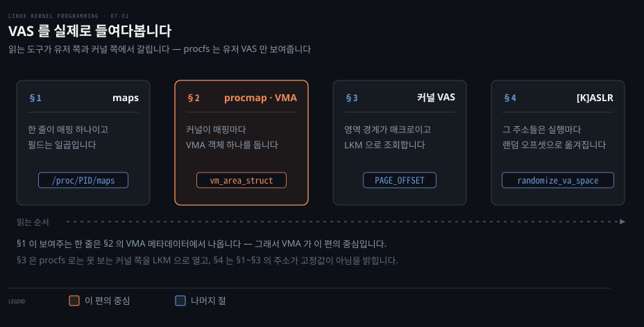
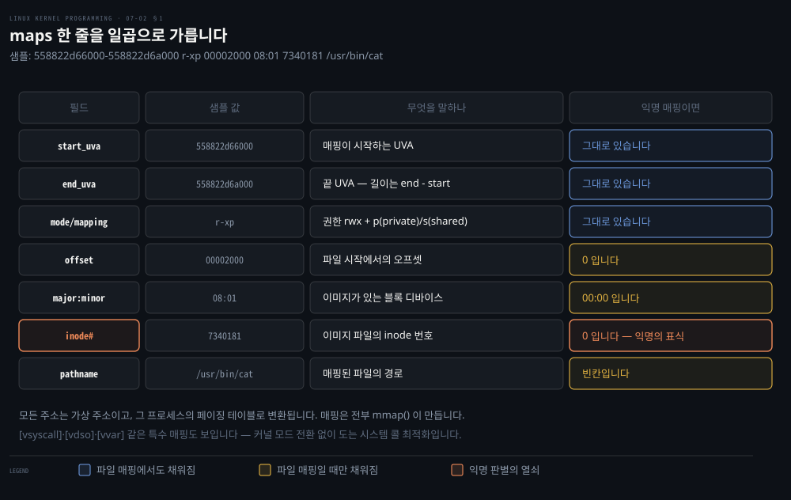
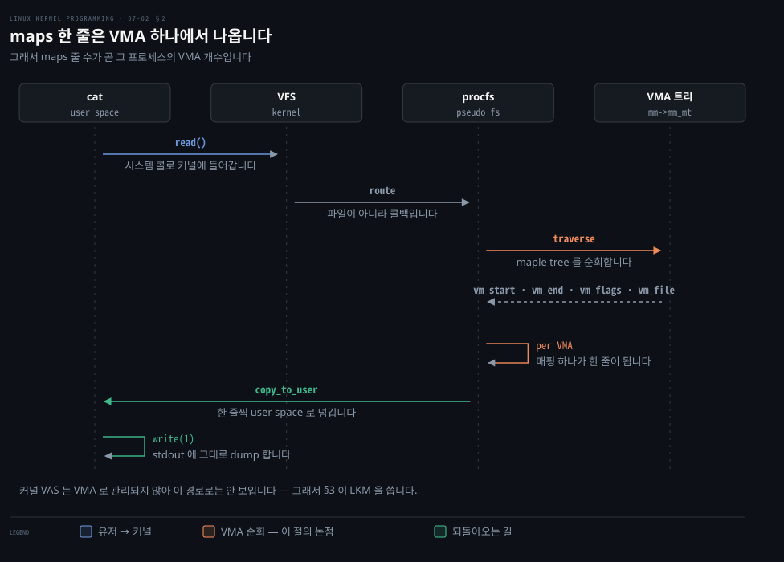
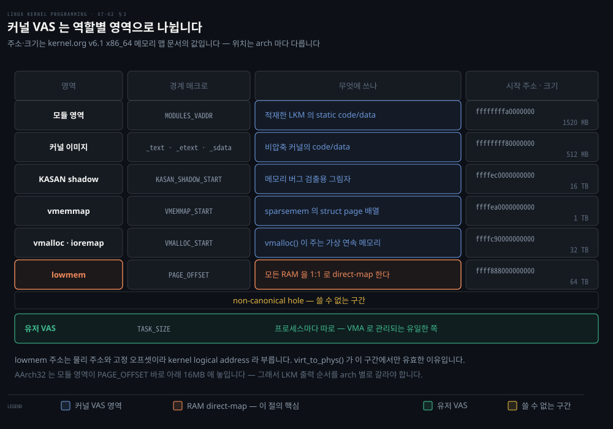
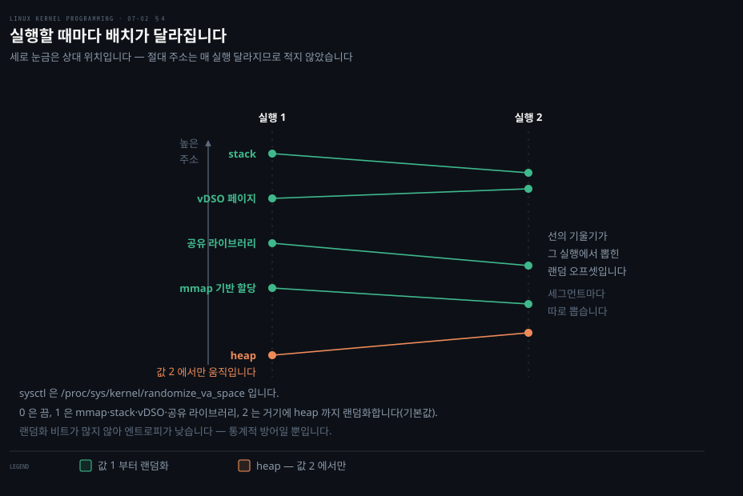

# 메모리 관리 (2) — VAS 검사와 KASLR
---
> 앞 노트의 VM split 은 개념이었습니다. 이 노트는 그 VAS 를 실제 도구로 열어 봅니다.

유저 쪽은 procfs 가 열어 줍니다. `/proc/PID/maps` 한 줄이 매핑 하나이고 일곱 필드로 이뤄지며, 각 줄은 커널의 VMA 메타데이터 하나에서 나옵니다. 커널 쪽은 procfs 로 안 보여서 매크로(`PAGE_OFFSET`·`VMALLOC_START` 등)와 LKM 을 씁니다. 마지막으로 [K]ASLR 은 그렇게 읽은 주소가 왜 실행마다 달라지는지를 설명합니다.

물리 메모리는 이어지는 노트로 넘깁니다.

아래는 이 노트의 네 절이 어떤 도구로 어디까지 들여다보는지를 이은 지도입니다.




## 1. 프로세스 VAS 검사 — /proc/PID/maps

> `/proc/PID/maps` 한 줄은 유저 VAS 의 매핑 하나이고, 일곱 필드가 그 매핑에 대해 각각 다른 것을 말합니다.



도식의 오른쪽 끝 열이 이 절에서 가장 실용적인 부분입니다. 익명 매핑이면 파일 관련 필드가 비고, 특히 inode 가 0 이 됩니다.

### 풀려는 문제

프로세스가 지금 무엇을 어디에 매핑해 두었는지 알고 싶을 때가 있습니다. 메모리를 많이 쓰는 프로세스를 만났을 때, 그게 힙인지 매핑된 파일인지 라이브러리인지부터 갈라야 다음 수를 둘 수 있습니다.

그 정보는 커널 안에 있고, 커널 안을 들여다보는 통합 인터페이스가 procfs 입니다.

### procfs 는 두 가지 일을 합니다

procfs(`/proc`)는 항상 마운트되는 pseudo 파일시스템이고, 역할이 둘입니다.

- **조회**: 커널과 하드웨어의 내부를 들여다보는 통합 인터페이스
- **설정**: root 가 커널 파라미터를 바꾸는 통합 인터페이스(`/proc/sys/`, sysctl)

자기 프로세스의 VAS 는 `self` 키워드로 봅니다. 임의 프로세스를 보려면 root 권한이 필요합니다.

```bash
cat /proc/self/maps
```

### maps 한 줄 해석 — 일곱 필드

각 줄은 유저 VAS 의 한 세그먼트(매핑)입니다.

```bash
558822d66000-558822d6a000  r-xp  00002000  08:01  7340181  /usr/bin/cat
```

1. **start_uva - end_uva**: 시작·끝 UVA. 길이는 end - start 이고 여기선 16KB 입니다. 64비트라도 UVA 는 상위 16비트가 0 이라 생략해 표시합니다(`558822d66000`).
2. **mode/mapping (r-xp)**: 앞 3글자가 권한(rwx), 4번째가 p(private) 또는 s(shared)입니다. `mmap()` 의 flags 가 이 값을 정합니다. 모든 매핑은 `mmap()` 이 만들기 때문입니다. `r-xp` 는 text 세그먼트입니다.
3. **offset (00002000)**: 파일 시작에서의 오프셋. 파일 매핑일 때만 의미가 있습니다.
4. **major:minor (08:01)**: 이미지가 있는 블록 디바이스 번호. 파일 매핑이 아니면 `00:00` 입니다.
5. **inode# (7340181)**: 이미지 파일의 inode. **0 이면 anonymous 매핑**(heap·stack)이라, 파일인지 익명인지 가르는 가장 빠른 방법입니다.
6. **경로 (/usr/bin/cat)**: 매핑된 파일 경로. 익명이면 빈칸입니다.

> 모든 주소는 가상 주소(UVA)이며 그 프로세스의 페이징 테이블로 변환됩니다. `[vsyscall]`·`[vdso]`·`[vvar]` 같은 특수 매핑도 보입니다. `gettimeofday()` 같은 일부 시스템 콜을 커널 모드 전환 없이 빠르게 하는 최적화입니다.

### 프론트엔드

raw `/proc/PID/maps` 를 그대로 읽는 것 말고도 더 읽기 쉬운 도구들이 있습니다.

| 도구 | 역할 |
|------|------|
| `/proc/PID/smaps` | 각 세그먼트의 상세 정보(RSS·PSS 등) |
| `pmap` | 프로세스 VAS 표시 (`-X`·`-XX` 로 상세) |
| `smem` | 어느 프로세스가 물리 메모리를 가장 많이 쓰나(RSS·PSS·USS) |
| `procmap` | 커널+유저 VAS 를 세로 타일로 시각화 (저자 작) |


## 2. procmap 과 VMA — 그 한 줄은 어디서 오나

> maps 한 줄은 파일에서 읽은 것이 아니라, 커널이 VMA 체인을 순회하며 그 자리에서 만들어 내보내는 것입니다.



도식의 주황색 구간이 이 절의 논점입니다. `procfs` 콜백이 VMA 를 하나씩 훑으며 줄을 만들기 때문에, maps 줄 수가 곧 그 프로세스의 VMA 개수입니다.

### procmap — VAS 를 세로 타일로 봅니다

`procmap`(저자 작, `github.com/kaiwan/procmap`)은 Linux 프로세스의 완전한 메모리 맵을 세로 타일 형식으로 시각화합니다. 커널과 유저 VAS 를 함께 보여주고, 주소 내림차순으로 배치합니다. 각 세그먼트는 상대 크기로 스케일·색상이 구분되고, 64비트에서는 거대한 non-canonical hole 도 보입니다.

```bash
./procmap --pid=<PID>            # 커널+유저 VAS 둘 다
./procmap --only-user --pid=<PID>    # 유저만
./procmap --only-kernel --pid=<PID>  # 커널만
```

동작 방식은 두 갈래입니다. 커널 정보는 **LKM(커널 모듈)** 으로 커널을 조회해 debugfs pseudo 파일로 user space 와 인터페이스합니다. 유저 정보는 `/proc/PID/maps` raw 인터페이스로 얻습니다.

> 64비트에서는 sparse(빈) 영역이 거의 100% 를 차지합니다. 16EB VAS 중 극히 일부만 실제로 쓰기 때문입니다. procmap 은 끝에 통계도 출력합니다 — 커널·유저 VAS 크기, sparse 비율, RAM, ps·smem 메모리 사용량입니다.

### VMA 기초

`/proc/PID/maps` 의 각 줄은 커널 메타데이터 **VMA(Virtual Memory Area)** 에서 추출됩니다. 유저 VAS 의 매핑(세그먼트)마다 VMA 객체 하나가 있습니다. **유저 매핑만 VMA 로 관리되고, 커널 VAS 에는 VMA 가 없습니다.**

그래서 VMA 수는 곧 유저 VAS 의 매핑 수입니다. 커널은 `current->mm->mmap` 에 VMA 체인을 두는데, 효율을 위해 실제로는 red-black tree 입니다. 이름이 `mmap` 인 것은 의도적입니다. `mmap()` 시스템 콜마다 매핑이 생기고 VMA 가 만들어지기 때문입니다.

```c
// include/linux/mm_types.h
struct vm_area_struct {
    unsigned long vm_start;   // vm_mm 안 시작 주소
    unsigned long vm_end;     // 끝 다음 첫 바이트
    struct mm_struct *vm_mm;  // 속한 주소 공간
    pgprot_t vm_page_prot;
    unsigned long vm_flags;
    const struct vm_operations_struct *vm_ops;
    struct file *vm_file;     // 매핑 파일 (NULL 가능)
};
```

> `cat /proc/self/maps` 는 이렇게 동작합니다. `read()` 시스템 콜이 나면 VFS 가 procfs 콜백으로 라우팅하고, 콜백이 모든 VMA 를 순회하며 정보를 user space 로 보내고, cat 이 그것을 stdout 에 dump 합니다. 유저 VAS 의 모든 세그먼트가 보이는 것이 이 때문입니다.


## 3. 커널 VAS 검사 — 매크로와 LKM

> 커널 VAS 는 VMA 가 없어 procfs 로 안 보입니다. 대신 영역마다 경계를 나타내는 매크로가 있어, LKM 을 적재해 그 값을 읽습니다.



도식의 주소와 크기는 kernel.org v6.1 의 x86_64 메모리 맵 문서에서 확인한 값입니다.[^x86-mm] 위가 높은 주소이고, 아래로 내려가면 lowmem 에 닿습니다.

### 풀려는 문제

§2 의 경로는 VMA 를 훑는 길이었는데, 커널 VAS 에는 VMA 가 없습니다. 그러면 `vmalloc()` 이 준 메모리가 어느 주소 대역에 있는지, 내 모듈의 코드가 어디에 적재됐는지를 어떻게 확인할까요.

답은 커널이 그 경계를 매크로로 들고 있다는 것입니다. 모듈 코드에서 그 매크로를 그대로 읽어 출력하면 됩니다.

### 영역과 매크로

커널 VAS(커널 세그먼트)는 여러 영역으로 이뤄집니다. 일부는 arch 독립(lowmem·모듈·vmalloc/ioremap)이고, 정확한 위치는 arch 의존적입니다.

| 영역 | 매크로 | 역할 |
|------|--------|------|
| 모듈 영역 | `MODULES_VADDR`·`MODULES_END` | LKM static code/data |
| KASAN(선택) | `KASAN_SHADOW_START`·`_END` | 메모리 버그 검출(shadow, VAS 의 1/8) |
| vmemmap(선택) | `VMEMMAP_START`·`_SIZE` | sparsemem 의 page 구조 배열 |
| vmalloc 영역 | `VMALLOC_START`·`_END` | `vmalloc()` 메모리 |
| **lowmem** | `PAGE_OFFSET`·`high_memory` | RAM direct-map(1:1) — 핵심 |
| highmem(선택, 32비트) | `PKMAP_BASE` | high-memory 페이지 매핑 |
| 커널 이미지 | `_text`·`_etext`·`_sdata` 등 | 비압축 커널 code/data(private 심볼) |
| 유저 VAS | `TASK_SIZE` | 유저 VAS 크기(바이트) |

### lowmem 과 high memory (32비트)

**lowmem 영역**은 OS 가 플랫폼 RAM 을 `PAGE_OFFSET` 부터 커널 VAS 에 direct-map 하는 곳입니다. 이 주소들은 물리 주소와 고정 오프셋이라 **kernel logical address** 라 부릅니다. 코어 커널과 드라이버가 여기서 물리적으로 연속된 메모리를 할당받습니다.

> 32비트에는 문제가 있습니다. RAM 이 커널 VAS 보다 크면, 예를 들어 1GB 커널 VAS 에 2GB RAM 이면 전부 direct-map 할 수 없습니다. 그래서 일부만 lowmem 으로 direct-map 하고(IA-32 는 보통 896MB), 나머지는 `ZONE_HIGHMEM` 에 간접 매핑합니다. **64비트에서는 이 문제가 사라집니다.** x86_64 커널 VAS 가 128TB 라 모든 RAM 을 쉽게 direct-map 할 수 있기 때문입니다.

### LKM 으로 조회

`show_kernel_vas` LKM 이 각 영역의 경계를 조회해 출력합니다. `totalram_pages()` 로 RAM 양을 얻어 lowmem 영역을 계산합니다. 코드는 arch 별로 갈립니다.

```c
// 모듈 영역 (64비트는 높이, 32비트 ARM 은 PAGE_OFFSET 아래)
#if (BITS_PER_LONG == 64)
    pr_info("|module region: %px - %px |\n",
        SHOW_DELTA_M((void *)MODULES_VADDR, (void *)MODULES_END));
#endif
    // vmalloc 영역
    pr_info("|vmalloc region: %px - %px |\n",
        SHOW_DELTA_M((void *)VMALLOC_START, (void *)VMALLOC_END));
    // lowmem 영역 (RAM direct-map)
    pr_info("|lowmem region: %px - %px |  (PAGE_OFFSET)\n",
        SHOW_DELTA_M((void *)PAGE_OFFSET, (void *)(PAGE_OFFSET) + ram_size));
```

> `%px`·`%zu` 포맷으로 포터블하게 씁니다. `SHOW_DELTA_*()` 매크로가 low·high 값과 그 차이를 KB/MB/GB 로 환산해 사람이 읽기 쉽게 출력합니다. 모듈 영역은 64비트에서는 커널 VAS 높은 쪽에, 32비트 ARM 에서는 `PAGE_OFFSET` 바로 아래에 놓이므로 출력 순서를 arch 별로 조정합니다.

3:1 split 인 Raspberry Pi 에서 `PAGE_OFFSET` 은 `0xc0000000`, 곧 3GB 입니다.

AArch32 의 유저 공간은 2GB 보다 약간 작습니다. 정확히는 2GB 에서 16MB 를 뺀 값인데, 그 16MB 가 `PAGE_OFFSET` 바로 아래에 놓인 모듈 영역(`0xbf000000`~`0xc0000000`)이기 때문입니다.

> procmap 의 LKM 을 빌드하려면 kernel headers 패키지가 필요합니다. 커스텀 커널에는 없을 수 있어, 호스트에서 크로스 컴파일해 보드로 복사합니다. Ch 3 의 커널 크로스 컴파일과 같은 원리입니다.

### null trap 페이지

유저 VAS 맨 앞 한 페이지(`0x0`~`0x1000`)는 **null trap 페이지**입니다. MMU·PTE 레벨에서 권한이 없어 read·write·execute 어느 접근이든 프로세서 fault 를 raise 합니다.

그러면 OS handler 가 프로세스 컨텍스트로 실행돼(culprit 프로세스가 `current` 입니다) SIGSEGV 를 전달하고 프로세스를 죽입니다. **이것이 NULL 포인터 역참조 버그를 OS 가 잡는 방법**입니다. 0 부터 4095 사이 어느 주소든 이 트랩을 건드립니다.


## 4. [K]ASLR — 메모리 레이아웃 랜덤화

> 공격자가 함수나 전역의 정확한 가상 주소를 알면 공격을 짤 수 있습니다. 그래서 메모리 레이아웃을 랜덤 오프셋만큼 옮겨, 매 실행마다 절대 주소가 달라지게 합니다.



도식의 세로 눈금은 상대 위치입니다. 절대 주소는 매 실행 달라지는 것이 이 그림의 논점이라 수치를 적지 않았습니다.

### 왜 필요한가

procfs 와 해킹 도구를 조합하면 함수나 전역 변수의 정확한 가상 주소를 알아낼 수 있습니다. 그 주소를 알면 권한 상승 같은 공격을 짤 수 있습니다.

이를 막으려고 유저 공간과 커널 공간 모두 **ASLR·KASLR**(주소 공간 레이아웃 랜덤화)을 지원합니다. 핵심은 랜덤화입니다. 메모리 일부를 베이스에서 랜덤한 페이지 정렬 오프셋만큼 옮깁니다.

> 단 **통계적 방어**일 뿐입니다. 랜덤화 비트가 많지 않아 엔트로피가 낮고, 숙련된 공격자에게는 우회됩니다.

### 유저 ASLR

ASLR 이 켜지면 매 실행마다 유저 VAS 의 절대 맵이 달라집니다. 랜덤화 대상은 다섯입니다.

- 공유 라이브러리 load 주소
- mmap 기반 할당(128KB 를 넘는 malloc 포함)
- stack 시작
- heap
- vDSO 페이지

sysctl `/proc/sys/kernel/randomize_va_space` 로 제어합니다.

| 값 | 의미 |
|----|------|
| 0 | ASLR off (부팅 `norandmaps` 파라미터로도 가능) |
| 1 | ASLR on: mmap·stack·vDSO·공유 라이브러리 랜덤화 |
| 2 | 위 + heap 랜덤화 (기본값) |

```bash
# ASLR 동작 확인 — 두 번 실행하면 heap·stack UVA 가 달라짐
grep -E "heap|stack" /proc/self/maps
```

### 커널 KASLR

3.14 부터 커널 VAS 도 랜덤화됩니다(`CONFIG_RANDOMIZE_MEMORY`). lowmem·vmalloc·vmemmap 영역과 모듈 코드의 베이스가 부팅 시 랜덤 오프셋으로 옮겨지고, 그 값은 해당 세션 동안 유지됩니다. x86[_64]·AArch64 가 지원하고 AArch32 는 지원하지 않습니다.

```bash
# 부팅 파라미터
nokaslr    # 끄기
kaslr      # 켜기
```

> 5.13 부터 `CONFIG_RANDOMIZE_KSTACK_OFFSET_DEFAULT` 가 들어와, 시스템 콜마다 커널 스택 오프셋을 랜덤화합니다. `ASLR_check.sh` 스크립트로 ASLR·KASLR 상태를 조회하고 변경할 수 있습니다.

[K]ASLR 을 쓰려면 앱을 `-fPIE -pie` 로 컴파일해야 합니다(Position Independent Executable). 이것이 return-to-libc 와 ROP 공격을 막습니다.

다만 보안은 늘 cat-and-mouse 입니다. `setarch --addr-no-randomize` 같은 우회 수단이 있고, 디버깅할 때는 [K]ASLR 을 끄는 것이 흔합니다.


## 다음 단계

> VAS 검사와 랜덤화를 봤으니, 다음 노트에서 물리 메모리 조직(노드·존·NUMA)을 봅니다.

여기까지 프로세스 VAS 검사(maps·VMA·procmap), 커널 VAS 검사(매크로·LKM), [K]ASLR 을 정리했습니다. 다음 노트는 물리 RAM 이 어떻게 조직되는지입니다.

1. **물리 메모리 조직**: 노드·존·페이지 프레임, NUMA vs UMA.
2. **direct-map 과 메모리 모델**: 주소 변환 API, sparsemem 모델.


## 관련 문서

> 이 노트는 VAS 검사편입니다. split·변환은 앞 짝 노트가, 물리 메모리는 다음 짝 노트가 다룹니다.

- [07-01.메모리 관리 (1) — VM split과 주소 변환](./07-01.메모리%20관리%20(1)%20—%20VM%20split과%20주소%20변환.md) — VM split·MMU 변환 (짝 노트)
- [07-03.메모리 관리 (3) — 물리 메모리와 NUMA](./07-03.메모리%20관리%20(3)%20—%20물리%20메모리와%20NUMA.md) — 노드·존·sparsemem (짝 노트)
- [06-01.프로세스와 스레드 (1) — 컨텍스트·VAS·스택](./06-01.프로세스와%20스레드%20(1)%20—%20컨텍스트·VAS·스택.md) — 프로세스 VAS 세그먼트 기초
- [05-02.첫 커널 모듈 (4) — 시스템 정보·보안·자동 적재](./05-02.첫%20커널%20모듈%20(4)%20—%20시스템%20정보·보안·자동%20적재.md) — [K]ASLR 보안 맥락
- [00-00.책 개요와 학습 로드맵](./00-00.책%20개요와%20학습%20로드맵.md) — 3섹션·13챕터 전체 지도

[^x86-mm]: Linux kernel v6.1 — x86_64 Complete virtual memory map with 4-level page tables. <https://www.kernel.org/doc/html/v6.1/x86/x86_64/mm.html>
