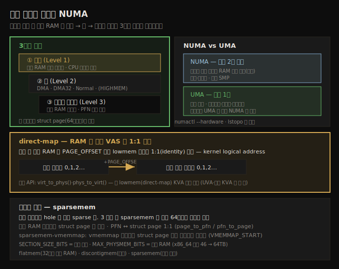

# 메모리 관리 (3) — 물리 메모리와 NUMA
---
> 가상 메모리를 봤으니 물리 메모리 조직을 봅니다. 커널은 부팅 시 물리 RAM 을 노드 → 존 → 페이지 프레임 3단계 트리로 조직합니다. 노드는 물리 RAM 뱅크를 추상화하며, NUMA 는 노드 2개 이상·UMA 는 1개입니다(리눅스는 UMA 도 가짜 NUMA 로 취급). RAM 은 부팅 시 `PAGE_OFFSET` 부터 커널 VAS 에 1:1 direct-map 됩니다. sparsemem 모델이 모든 페이지를 `struct page` 로 추적합니다.

이 노트는 짝 노트(07-01·07-02)의 가상 메모리 위에서, 물리 RAM 이 어떻게 조직되는지를 다룹니다. 메모리 관리 3부작의 마지막입니다. 아래 종합도가 이 노트의 척추 — 노드·존·페이지프레임 계층, NUMA, direct-map, sparsemem — 입니다.




## 1. 물리 RAM 조직 — 노드·존·페이지 프레임

> 커널은 부팅 시 물리 RAM 을 노드 → 존 → 페이지 프레임 3단계 트리로 분할합니다. 노드는 물리 RAM 뱅크, 존은 노드 안의 구획(DMA·Normal 등), 페이지 프레임은 물리 RAM 페이지입니다.

커널은 부팅 시 물리 RAM 을 트리형 계층으로 조직합니다.

```
노드 (Level 1)
  존 (Level 2)
    페이지 프레임 (Level 3)
```

1. **노드**: 물리 RAM 뱅크를 추상화하는 메타데이터(`pg_data_t`). CPU 코어와 연관됩니다.
2. **존**: 노드 안의 구획. 페이지 프레임으로 구성.
3. **페이지 프레임**: 물리 RAM 페이지. PFN(Page Frame Number)으로 추적.


## 2. 노드와 NUMA

> 노드는 물리 RAM 모듈을 추상화하며 CPU 소켓과 연관됩니다. NUMA(노드 2개 이상)는 코어에 가장 가까운 RAM 에서 할당해 성능을 높이고, UMA(노드 1개)는 코어 무관입니다. 리눅스는 코드 베이스 통일을 위해 UMA 도 가짜 NUMA 로 취급합니다.

노드는 시스템 보드의 물리 RAM 모듈과 그 컨트롤러 칩셋을 추상화합니다. 두 종류가 있습니다.

1. **NUMA(Non-Uniform Memory Access)**: 할당이 일어난 CPU 코어가 중요합니다(메모리를 비균일하게 취급). **노드 2개 이상**.
2. **UMA(Uniform Memory Access)**: 코어가 무관합니다. **노드 1개**.

진짜 NUMA 는 항상 멀티코어(SMP)이고 RAM 뱅크가 2개 이상이라 노드도 2개 이상입니다. 왜 복잡할까요? **성능** — NUMA 시스템은 스레드가 도는 코어에 **가장 가까운 노드**의 RAM 을 우선 할당합니다(그래서 NUMA). 서버·데이터센터·슈퍼컴은 거의 NUMA 입니다.

> 핵심: 리눅스는 **UMA 도 NUMA 로 취급**(가짜/pseudo-NUMA)합니다 — 코드 베이스를 갈래내지(fork) 않으려는 설계입니다. UMA 는 노드 1개를 가집니다. 진짜 NUMA = 노드 2개+ & 멀티코어, 그 외는 가짜 NUMA. `numactl --hardware`·`lstopo` 로 확인합니다.

### 예: AMD 서버

32 코어(2 소켓 × 8 코어 × 2 hyperthread) + 32GB RAM(4 뱅크 × 8GB)인 시스템은 멀티코어 + RAM 뱅크 2개+ 라 진짜 NUMA — 커널이 4 NUMA 노드를 만듭니다. CPU #18 에서 도는 스레드가 RAM 을 요청하면, 가장 가까운 NUMA 노드 #2 의 free 페이지 프레임으로 우선 서비스합니다(없으면 interconnect 너머 다른 노드로 fallback).


## 3. 노드 안의 존

> 존은 하드웨어 quirk(특히 x86)와 소프트웨어 난점을 다루는 리눅스의 방식입니다. 노드에 속하고 페이지 프레임으로 구성되며, 부팅 시 동적으로 결정됩니다(DMA·DMA32·Normal 등).

존은 하드웨어 quirk(x86 에서 번성)와 소프트웨어 난점(32비트 `ZONE_HIGHMEM` 등)을 다루는 방식입니다. 항상 특정 노드에 속하고 페이지 프레임으로 구성됩니다 — 존마다 PFN 범위가 할당됩니다. 존 수·이름은 부팅 시 커널이 동적 결정합니다.

```bash
$ cat /proc/buddyinfo
Node 0, zone  DMA      3   2   4 ...
Node 0, zone  DMA32  31306 ...
Node 0, zone  Normal 49135 ...
```

맨 왼쪽이 Node 0 하나뿐 — UMA 시스템입니다(리눅스가 가짜 NUMA 로 취급). 이 노드가 DMA·DMA32·Normal 세 존으로 나뉩니다.

```bash
$ journalctl -b -k | grep -A7 "NUMA"
No NUMA configuration found
Faking a node at [mem 0x0 - 0x4427fffff]    # 16GB
Zone ranges:
  DMA     [mem 0x1000 - 0xffffff]
  DMA32   [mem 0x1000000 - 0xffffffff]
  Normal  [mem 0x100000000 - 0x4427fffff]
```

NUMA 가 아니라(UMA) 커널이 노드 하나를 fake 하고, 그 범위가 전체 RAM(16GB)입니다. 존 데이터 구조는 `include/linux/mmzone.h:struct zone`.


## 4. direct-map 과 주소 변환

> 부팅 시 모든 RAM 을 `PAGE_OFFSET` 부터 커널 VAS 에 1:1(identity) 매핑합니다 — kernel logical address(lowmem). 변환 API(`virt_to_phys`·`phys_to_virt`)는 lowmem KVA 에만 유효합니다.

부팅 시 커널은 모든 RAM 을 커널 VAS 에 **direct-map** 합니다.

```
물리 프레임 0 → 커널 가상 페이지 0
물리 프레임 1 → 커널 가상 페이지 1
물리 프레임 2 → 커널 가상 페이지 2 ...
```

이를 1:1·direct·identity 매핑이라 합니다. 모든 커널 가상 페이지가 물리 페이지와 **고정 오프셋**(`PAGE_OFFSET`)만큼 떨어져 있어 **kernel logical address** 라 합니다. 이 영역이 lowmem 입니다.

3:1 split 32비트에서 물리 주소 `0x0` = KVA `0xc0000000`(`PAGE_OFFSET`). 따라서 변환은 이렇게 보입니다.

```c
pa = kva - PAGE_OFFSET   // KVA → PA
kva = pa + PAGE_OFFSET   // PA → KVA
```

> ⚠️ 핵심 주의: 이 계산은 **lowmem(direct-map) KVA 에만** 유효합니다. 모든 UVA, lowmem 밖 KVA(모듈·vmalloc·ioremap·KASAN·highmem·DMA)는 안 됩니다. 물리 RAM 이 항상 연속이지도 않습니다(hole). 변환 API 가 있습니다.

| API | 역할 |
|-----|------|
| `virt_to_phys()` | 가상 → 물리 |
| `phys_to_virt()` | 물리 → 가상 |

> 이 API 들은 드라이버 작성자가 쓰지 말라고 커널 주석이 명시합니다(direct-map 또는 kmalloc 메모리에만 유효, DMA 버스 매핑 아님). 주로 커널 내부 MM 코드가 씁니다. `crash` 유틸의 `vtop`/`ptov` 명령으로도 변환 가능.

> RAM 을 자기 VAS 에 매핑한다고 커널이 RAM 을 예약하는 게 아닙니다 — 그저 모든 RAM 을 매핑해 할당 가능하게 합니다(OS = 시스템 자원 관리자). 부팅 시 정적 커널 code/data·페이지 테이블이 일부를 차지하지만(1GB RAM 에 커널 직접 사용은 ~100MB), 메모리를 가장 많이 쓰는 건 거의 항상 user space 입니다. **커널 페이지는 사용 안 해도 절대 swap 되지 않습니다**(성능). 커널 메모리도 `swapper_pg_dir` 마스터 페이징 테이블로 가상화됩니다.


## 5. 물리 메모리 모델 — sparsemem

> 물리 메모리는 hole 이 많아 sparse 합니다. 모델은 flatmem·discontigmem·sparsemem 셋이 제안됐고, sparsemem 이 모던 64비트의 사실상 표준입니다. 모든 RAM 페이지를 `struct page` 로 추적하고, PFN ↔ struct page 가 1:1 매핑됩니다.

물리 메모리는 복잡한 계층에 hole 이 흩어져 있고, NUMA 노드마다 자기 메타데이터가 필요하며, hot-plug 같은 하드웨어 요구도 있습니다. 그래서 커널은 **메모리 모델**을 둡니다 — flatmem·discontigmem·sparsemem. 현실적으로 **sparsemem 이 모던 64비트의 표준**이고, discontigmem 은 폐기, flatmem 은 32비트 소량 RAM 용입니다.

모든 모델의 공통점:

1. 모든 RAM 페이지를 **`struct page`**(page descriptor, 64바이트)로 추적합니다. 페이지가 무엇에 쓰이는지·flag·mapping 을 담습니다.
2. 각 물리 프레임은 **PFN(Page Frame Number)** 으로 표현 — `struct page` 배열의 인덱스. PFN ↔ struct page 1:1.
3. 헬퍼 `page_to_pfn()`·`pfn_to_page()` 가 둘을 변환합니다.

### sparsemem-vmemmap

sparsemem 은 hot-plug·persistent device memory·deferred init 등을 지원하는 versatile 모델입니다. 헬퍼를 두 방식으로 구현하는데, 흔한 **sparse vmemmap** 방식은 `vmemmap` 포인터가 `struct page` 배열 베이스(`VMEMMAP_START`)를 가리킵니다 — 07-02 의 vmemmap 영역이 이것입니다.

> 모던 64비트는 `CONFIG_SPARSEMEM_VMEMMAP=y` 가 흔합니다(x86_64 항상, AArch64·Android GKI 도). 32비트는 이 모델을 지원 안 하고 더 단순한 flatmem 을 씁니다.

두 매크로가 필요합니다.

| 매크로 | 의미 |
|--------|------|
| `SECTION_SIZE_BITS` | 섹션(물리 연속 구간)이 커버하는 주소 비트 수. 섹션 크기 = 2^이 값 |
| `MAX_PHYSMEM_BITS` | 물리 주소 최대 비트 수 = 최대 RAM |

플랫폼별 값(`ch7/sparsemem_show` LKM 으로 조회):

| 플랫폼 | SECTION_SIZE_BITS | 섹션 크기 | MAX_PHYSMEM_BITS | 최대 RAM |
|--------|-------------------|-----------|------------------|----------|
| AArch64 (stock RPi) | 27 | 128MB | 48 | 256TB |
| AArch64 (VA_BITS=52) | 29 | 512MB | 52 | 4PB |
| x86_64 (Ubuntu 22.04) | 27 | 128MB | 46 | 64TB |

> 이 메모리 모델·계층 이해가 다음 두 챕터(메모리 할당)의 토대입니다.


## 다음 단계

> 메모리 관리 3부작(가상·검사·물리)을 마쳤습니다. 다음 챕터부터 실제 커널 메모리 할당 API 를 다룹니다.

여기까지 물리 RAM 조직(노드·존·페이지 프레임), NUMA vs UMA, direct-map 과 주소 변환, sparsemem 메모리 모델을 정리했습니다. 이 가상·물리 메모리 이해가 효율적 커널 메모리 할당과 디버깅의 토대입니다.

다음 챕터(Ch 8~9)는 메모리 할당입니다.

1. **Ch 8 (메모리 할당 Part 1)**: page 할당자(BSA)·slab 할당자, `kzalloc`/`kfree`, `devm_*()`, 내부 단편화.
2. **Ch 9 (메모리 할당 Part 2)**: 커스텀 slab 캐시, `vmalloc`, API 선택, 메모리 회수·OOM·demand paging.


## 관련 문서

> 이 노트는 물리 메모리편입니다. 가상 메모리는 앞 짝 노트들이, 다음 할당 API 는 다음 챕터가 다룹니다.

- [07-01.메모리 관리 (1) — VM split과 주소 변환](./07-01.메모리%20관리%20(1)%20—%20VM%20split과%20주소%20변환.md) — VM split·MMU 변환 (짝 노트)
- [07-02.메모리 관리 (2) — VAS 검사와 KASLR](./07-02.메모리%20관리%20(2)%20—%20VAS%20검사와%20KASLR.md) — maps·VMA·커널 VAS 매크로(vmemmap·lowmem) (짝 노트)
- [../../kernel/01-06.cgroup 사례 — Endowus OOMKilled](../../kernel/01-06.cgroup%20사례%20—%20Endowus%20OOMKilled.md) — 물리 메모리·OOM 의 K8s 운영 관점
- [00-00.책 개요와 학습 로드맵](./00-00.책%20개요와%20학습%20로드맵.md) — 3섹션·13챕터 전체 지도
