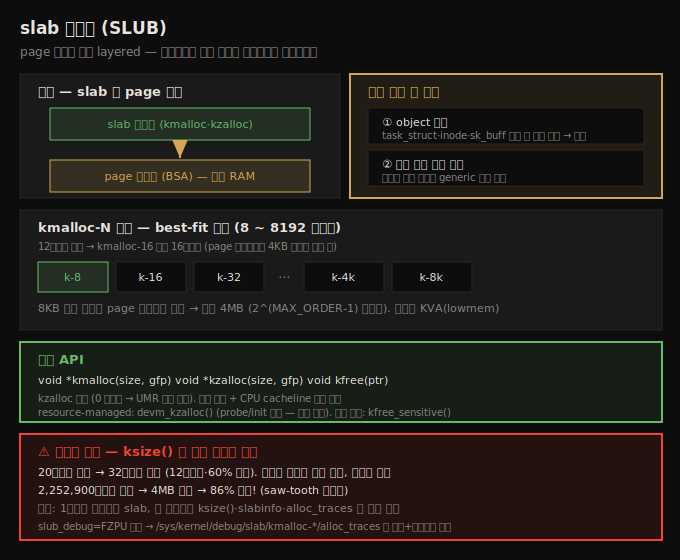

# 메모리 할당 (2) — slab 할당자와 kmalloc 낭비
---
> slab 할당자(현대 구현은 SLUB)는 페이지 할당자 위에 layered 됩니다. 두 가지 존재 이유가 있습니다. ① `task_struct`·`inode` 같은 자주 쓰는 커널 객체를 부팅 시 캐시해 빠르게 (de)할당하고, ② 페이지보다 작은 크기 요청의 큰 낭비를 완화합니다. `kmalloc`/`kzalloc`/`kfree` 가 핵심 API 이며, 8~8192바이트의 `kmalloc-N` 캐시에서 best-fit 으로 할당합니다. 8KB 초과 요청은 페이지 할당자로 위임되어 최대 4MB 까지 가능하지만, 임계값을 넘으면 낭비가 100% 가까이 치솟으므로 `ksize()` 로 실제 할당량을 검증해야 합니다.

앞 노트(08-01)에서 페이지 할당자가 1차 엔진임을 봤습니다. 하지만 OS 와 드라이버의 일상에서는 한 페이지(4KB)보다 훨씬 작은 조각을 요청하는 일이 훨씬 흔합니다. 페이지 할당자에 12바이트를 요청하면 4KB 를 통째로 줘 낭비가 큽니다. 이 문제를 풀기 위해 페이지 할당자 위에 **slab 할당자**가 얹힙니다.

이 노트는 slab 할당자의 두 설계 의도, 핵심 API(`kmalloc`·`kzalloc`·`kfree`), `kmalloc-N` 캐시 구조, 그리고 결정적으로 — slab API 를 써도 여전히 발생하는 낭비를 `ksize()` 로 측정하고 디버깅하는 법을 다룹니다. 아래 종합도가 척추 — 계층 관계, 두 목적, `kmalloc-N` 캐시, 낭비 측정 — 입니다.




## 1. slab 할당자의 두 존재 이유

> slab 할당자는 페이지 할당자 위에 layered 됩니다. ① 자주 쓰는 커널 객체를 부팅 시 캐시해 빠른 (de)할당을 제공하고, ② 페이지보다 작은 크기의 generic 캐시를 제공해 페이지 할당자의 낭비를 완화합니다.

slab 할당자(slab cache)는 페이지 할당자 위에 얹혀, 두 가지 1차 목적으로 존재를 정당화합니다.

1. **object 캐싱**: 자주 할당·해제되는 커널 데이터 구조("객체")를 미리 캐시해 둡니다.
2. **작은 할당 낭비 완화**: 페이지 조각 크기의 작고 편리한 캐시를 여러 크기로 제공합니다.

**① object 캐싱** — 오래전 SunOS 개발자 Jeff Bonwick 은 특정 커널 객체가 OS 안에서 자주 할당·해제됨을 발견하고, 이를 미리 캐시하자는 아이디어를 냈습니다. 이것이 slab cache 로 발전했습니다.

리눅스도 부팅 초기화 시 상당수 객체를 여러 slab 캐시에 사전 할당합니다. 이유는 성능입니다. 핵심 커널 코드나 드라이버가 이런 객체용 메모리를 요청하면 slab 할당자에 직접 요청하고, 캐시돼 있으면 할당이 거의 즉시 이뤄집니다(해제도 마찬가지).

고성능이 필요한 좋은 예는 네트워크·블록 I/O 서브시스템의 임계 경로입니다. 그래서 네트워크 스택의 `sk_buff`, 블록 계층의 `biovec`, 그리고 핵심 `task_struct` 같은 구조가 slab 캐시에 자동 캐시됩니다. 파일시스템 메타데이터(`inode`·`dentry`), 메모리 디스크립터(`mm_struct`)도 사전 할당됩니다.

> slab(정확히는 SLUB) 할당자가 빠른 또 다른 이유는, 전통적 heap 할당자가 잦은 할당·해제로 메모리에 "구멍"(단편화)을 만드는 반면, slab 객체는 부팅 시 한 번 캐시에 할당되어 그곳으로 반납되므로(실제로 풀리지 않음) 성능이 유지되기 때문입니다. 물론 메모리 압박이 커지면 커널은 캐시를 우아하게 풀기 시작하고, RAM 이 극히 부족하면 OOM(Out-Of-Memory) killer 를 부릅니다(다음 챕터 주제).

현재 slab 캐시 상태는 여러 방법으로 조회합니다.

| 방법 | 보는 것 |
|------|---------|
| `sudo vmstat -m` | 사용 중인 모든 slab 캐시(이름·활성 객체 수·총 객체·객체 크기·페이지 수) |
| `grep "^Slab" /proc/meminfo` | slab 이 쓰는 총 RAM |
| `slabinfo -T` | totals — 전체 메모리·사용·loss(낭비) |
| `slabinfo -S` | 크기순 정렬(가장 큰 캐시 먼저) |
| `slabtop` | 상위 빈출 캐시 실시간 뷰 |

> slab 캐시 사용량과 페이지 캐시(page cache) 사용량을 혼동하지 않습니다. 페이지 캐시는 커널이 모든 파일시스템 I/O 를 캐싱하는 RAM 으로, 보통 훨씬 큽니다(`free -h` 의 buff/cache 열 대부분). slab 캐시는 그보다 작습니다.


## 2. slab 할당 API — kmalloc·kzalloc·kfree

> kmalloc·kzalloc 이 핵심 할당 API 이며, 둘째 인자는 GFP 플래그입니다. kzalloc 은 0 초기화를 하므로 권장됩니다. 반환 메모리는 물리 연속 + CPU cacheline 정렬이 보장됩니다. 해제는 kfree, 보안 해제는 kfree_sensitive 입니다.

핵심 API 는 둘입니다(`<linux/slab.h>` 필요).

```c
#include <linux/slab.h>
void *kmalloc(size_t size, gfp_t flags);
void *kzalloc(size_t size, gfp_t flags);
```

6.1.25 기준 `kmalloc()` 은 약 4,800회, `kzalloc()` 은 13,000회 넘게 호출되는, 커널에서 가장 빈번한 메모리 할당 API 입니다. 두 인자는 (1) 필요한 바이트 수, (2) GFP 플래그입니다(08-01 §6 참조 — 프로세스 컨텍스트면 `GFP_KERNEL`).

성공 시 반환값은 할당 메모리 시작의 KVA(kernel logical address)입니다. 유저 공간 `malloc()` 과 닮았지만 내부는 완전히 다릅니다. `malloc()` 은 UVA 를 반환하고, `malloc()` 호출이 곧장 `kmalloc()` 을 부르지도 않습니다.

중요한 보장 두 가지입니다.

1. 반환 메모리는 **물리 연속**입니다.
2. 반환 주소는 **CPU cacheline 경계에 정렬**됩니다(하드웨어 cacheline 정렬). CPU 는 캐시↔RAM 을 cacheline(보통 64바이트) 단위로 atomic 하게 읽고 씁니다.

`kmalloc()` 직후 내용은 random 입니다. 반면 `kzalloc()` 은 할당 메모리를 0 으로 초기화해 UMR(Uninitialized Memory Read) 같은 버그를 막아 줍니다. 임계 경로가 아니라면 best practice 로 `kzalloc()` 을 씁니다.

**정수 오버플로(IoF) 회피** — 할당 크기(첫 인자)를 동적으로 계산하는 것은 피합니다. 배열 할당에는 `kcalloc()`·`kmalloc_array()` 를 쓰고, 구조체 배열에는 `struct_size()`·`array_size()` 헬퍼를 씁니다(곱셈 오버플로를 검사). `krealloc()` 도 있습니다.

**해제 — kfree** — 유저 공간 `free()` 처럼 단일 인자(해제할 메모리 포인터)를 받습니다. 그 값은 반드시 slab API 의 반환값이어야 합니다. 잘못된 값을 넘기면 메모리 손상으로 시스템이 불안정해집니다.

```c
void kfree(const void *);
```

`kfree()` 사용 시 흔한 실수 두 가지입니다.

1. `if (kptr) kfree(kptr);` — NULL 체크는 불필요합니다. `kfree(NULL)` 은 no-op 입니다.
2. `kfree()` 후 포인터가 NULL 로 *자동 설정된다고 가정* — 그렇지 않습니다. 루프에서 이를 가정하면 두 번째 반복에서 double-free 버그가 납니다.

**보안 해제 — kfree_sensitive** — `kfree()` 는 메모리를 캐시로 반납만 하고 내용은 그대로 둡니다. 따라서 비밀(secret)이 담겼던 메모리는 해제 전 덮어써야 합니다(info-leak 방지). 이를 위한 API 가 `kfree_sensitive()` 입니다(5.9 이전엔 `kzfree()` 라는 잘못된 이름이었습니다). 단순 `memset()` 은 컴파일러가 최적화로 제거할 수 있으니, 이 전용 API 를 씁니다.


## 3. kmalloc 이 실제 쓰는 캐시 — kmalloc-N

> kmalloc 은 8~8192바이트의 kmalloc-N slab 캐시에서 best-fit 으로 할당합니다. 12바이트 요청은 kmalloc-16 에서 16바이트를 받습니다. 8KB 초과 요청은 페이지 할당자로 위임됩니다.

`k{m|z}alloc()` 의 메모리가 어디서 오는지는 `sudo vmstat -m | grep "^kmalloc"` 로 보입니다. 커널은 generic kmalloc 메모리를 위해 8192바이트부터 8바이트까지 다양한 크기의 전용 slab 캐시를 둡니다.

| 캐시 | 객체 크기 |
|------|----------|
| `kmalloc-8` | 8바이트 |
| `kmalloc-16` | 16바이트 |
| `kmalloc-32` | 32바이트 |
| ⋮ | ⋮ |
| `kmalloc-4k` | 4096바이트 |
| `kmalloc-8k` | 8192바이트 |

12바이트를 요청하면 slab 할당자는 `kmalloc-16` 에서 16바이트를 줍니다 — best-fit 방식이라 두 캐시 사이 크기는 큰 쪽으로 올립니다(더 줄 수는 있어도 덜 줄 수는 없으니까). 페이지 할당자였다면 4KB 를 통째로 줬을 것이니, 낭비가 크게 줄었습니다.

몇 가지 유의점입니다.

1. 캐시 크기는 arch 마다 다릅니다. Raspberry Pi(ARM)에서는 `kmalloc-N` 이 64~8192바이트 범위입니다(최소가 64바이트).
2. 5.0 커널부터 reclaimable 캐시(`kmalloc-rcl-N`)가 추가됐습니다. 메모리 압박 시 페이지 회수·anti-fragmentation 에 쓰이지만 모듈 작성자가 신경 쓸 필요는 없습니다.
3. `kmalloc()` 은 8192바이트 이하 요청만 `kmalloc-N` 캐시로 처리하고, 그보다 큰 요청은 그대로 페이지 할당자로 위임합니다.


## 4. 크기 한계 — 한 번에 최대 4MB

> kmalloc 한 번으로 받을 수 있는 최대치는 페이지 크기와 MAX_ORDER 가 결정합니다. 4KB 페이지·MAX_ORDER 11 가정 시 2^(MAX_ORDER-1) 페이지 = 1024 페이지 = 4MB 입니다.

`k{m|z}alloc()` 한 번으로 받을 수 있는 최대 메모리에는 한계가 있습니다. 물리 연속을 보장하기 때문입니다. 이 한계는 두 요소가 결정합니다.

1. 시스템 페이지 크기(`PAGE_SIZE`).
2. order 개수(`MAX_ORDER`) — 페이지 할당자 freelist 의 리스트 수.

표준 4KB 페이지·`MAX_ORDER` 11 에서 한 번에 받을 수 있는 최대치는 **4MB** 입니다(x86_64·ARM 공통). 계산은 이렇습니다. slab 요청이 최대 slab 캐시 크기(보통 8KB)를 넘으면 커널은 요청을 페이지 할당자로 넘깁니다. 페이지 할당자 최대치는 `2^(MAX_ORDER-1)` = 2^10 = 1024 페이지 = 1024 × 4KB = 4MB 입니다.

이를 실증하는 커널 모듈은, 루프를 돌며 할당량을 step size 만큼 늘려 `kmalloc()` 이 실패할 때까지 시도합니다. 4MB 를 넘는 순간(예: 4,300,800바이트) 실패하며, 커널은 `WARN()` 매크로로 진단 정보(스택 트레이스)를 덤프합니다. 스택에 `__alloc_pages()`(zoned buddy allocator 의 심장)가 보여 거기서 실패했음을 드러냅니다.

> `kmalloc(0, GFP_xxx)` 는 zero 포인터(x86 에서 16, `0x10`)를 반환합니다. page 0 NULL 포인터 trap 안의 무효 가상 주소로, 접근하면 페이지 폴트(버그)가 납니다. 쓰라는 게 아니라 동작이 그렇다는 것입니다.

**중요한 보충** — 4MB 가 최대치라고 해서 요청하면 항상 받는 건 아닙니다. 그 시점 freelist 에 물리 연속 4MB 청크가 있어야 합니다. 오래(수일~수주) 가동된 시스템은 단편화가 진행돼 상위 order 청크가 하위 order 로 내려가 있을 확률이 높습니다.

`/proc/buddyinfo` 로 확인할 수 있습니다. order 10(4MB) 열을 봅니다.

```
# 7일 이상 가동된 시스템 (order 10 = 0, 4MB 청크 없음)
Node 0, zone Normal  23653 5314 1284 747 233 67 16 17 18 0 0
# 막 재부팅한 같은 시스템 (order 10 = 6571, 4MB 청크 풍부)
Node 0, zone Normal   3859 6778 6131 5025 3810 2274 1130 382 78 9 6571
```

가동 시간이 늘수록 상위 order 청크가 잘려 하위 order 로 percolate 됩니다.


## 5. 낭비 측정 — ksize() 와 saw-tooth 그래프

> slab API 를 써도 낭비는 여전합니다. ksize() 는 실제 할당된 바이트 수를 반환합니다. 요청 크기가 임계값(캐시·페이지 할당자 청크 크기)에 가까울수록 낭비가 적고, 넘으면 100% 가까이 치솟습니다.

slab API 를 쓴다고 효율적인 것은 아닙니다. `ksize()` 로 실제 할당량을 확인할 수 있습니다.

```c
size_t ksize(const void *);   // 인자: 유효한 slab 포인터, 반환: 실제 할당된 바이트 수
```

**case 1 — 작은 구조** — 20바이트 구조를 `kzalloc()` 하면 x86_64 에서 실제로는 32바이트가 할당됩니다(`kmalloc-16` 과 `kmalloc-32` 사이라 큰 쪽). 12바이트·60% 낭비입니다. ARM(Raspberry Pi)에서는 최소 캐시가 64바이트라 64바이트를 받습니다.

> `ksize()` 는 할당된 slab 메모리에만 동작합니다. 페이지 할당자 API 의 반환값에는 쓸 수 없습니다.

**case 2 — 크기를 키우며** — 루프에서 할당량을 늘리며 `ksize()` 로 실제 할당량·낭비·낭비율을 기록하면, 임계값 근처 거동이 드러납니다.

```
kmalloc(1638500) : 2097152 : 458652 : 27%
kmalloc(1843300) : 2097152 : 253852 : 13%
kmalloc(2048100) : 2097152 :  49052 :  2%
kmalloc(2252900) : 4194304 : 1941404 : 86%   ← 임계값을 넘는 순간 급증
kmalloc(2457700) : 4194304 : 1736604 : 70%
kmalloc(2662500) : 4194304 : 1531804 : 57%
```

요청 크기가 커널의 실제 크기(slab 캐시·페이지 할당자 청크 크기)에 *가까워질수록* 낭비가 줄고, *임계값을 넘는 순간* 다음 크기로 점프해 낭비가 치솟습니다(2,048,100 → 2% 였다가 2,252,900 → 86%). 이를 그래프로 그리면 **saw-tooth(톱니)** 모양이 됩니다 — 임계값마다 낭비가 거의 0 으로 떨어졌다가 다시 100% 가까이 수직 상승합니다.

교훈은 명확합니다. slab API 를 쓴다고 안심하지 말고, 메모리를 할당하는 코드를 `ksize()` 로 점검해 *생각한 양*이 아니라 *실제 할당된 양*을 확인합니다. 지름길은 하나뿐입니다 — **1페이지 미만이면 slab 을, 1페이지 초과면 위 논의가 적용됩니다.**


## 6. 낭비 디버깅 — slabinfo 와 alloc_traces

> slabinfo -L 로 캐시별 loss 를 정렬해 보고, slub_debug=FZPU 로 부팅하면 alloc_traces 의사 파일에서 낭비와 호출 스택까지 추적할 수 있습니다.

페이지를 넘는 큰 할당이 아니라, 일상적인 *1페이지 미만* 요청의 낭비를 정량화하는 두 방법입니다.

**쉬운 방법 — slabinfo -L** — loss(낭비) 기준 정렬입니다.

```
# slabinfo -L | head -n5
Name          Objects  Objsize   Loss  Slabs/Part/Cpu ...
dentry          148162     192   14.9M ...
kmalloc-4k        1153    4096   14.2M ...
```

`Loss` 열이 각 캐시가 지금까지 낸 누적 낭비입니다. 모든 slab 캐시의 낭비를 보여 주지만 총합만 보인다는 한계가 있습니다.

**상세한 방법 — alloc_traces** — 6.1 커널에 병합된 패치로, `slub_debug=FZPU` 를 커널 커맨드라인에 넘겨 부팅하면(`CONFIG_SLUB_DEBUG=y` 전제) `/sys/kernel/debug/slab/kmalloc-*/alloc_traces` 에서 낭비와 *할당으로 이어진 호출 스택*까지 볼 수 있습니다.

```
# cat /sys/kernel/debug/slab/kmalloc-64/alloc_traces
975 populate_error_injection_list+0x8d/0x110 waste=15600/16 age=... pid=1 cpus=0
        __kmem_cache_alloc_node+0x279/0x2b0
        kmalloc_trace+0x2a/0xa0
        populate_error_injection_list+0x8d/0x110
        ...
```

해석: `populate_error_injection_list()` 함수가 64바이트씩 975회 요청했고(`kmalloc-64` 캐시), 매번 16바이트씩 낭비해 총 975 × 16 = 15,600바이트를 낭비했습니다. 실제로 그 함수는 48바이트 구조(`struct ei_entry`)를 할당하는데, best-fit 으로 `kmalloc-64` 가 서비스하니 64 − 48 = 16바이트가 매번 낭비됩니다. 스택 트레이스(아래에서 위로 읽음)가 어떻게 거기 도달했는지 이력을 보여 주어 디버깅에 유용합니다.

> `waste=x/y` 에서 x 는 총 낭비 바이트, y 는 매 할당당 낭비 바이트입니다. 낭비 추적은 `kmalloc-*` 캐시에 한정됩니다. 책은 `wastage_kmalloc_slabs.sh` 커스텀 스크립트로 이 의사 파일을 순회해 낭비 상위 항목을 정렬해 보여 줍니다.


## 7. resource-managed 할당 — devm_

> devm_kmalloc·devm_kzalloc 은 드라이버 detach·모듈 제거 시 메모리를 자동 해제합니다. 단 init·probe() 에서만 써야 하며, 모든 k{m|z}alloc 을 맹목적으로 바꾸면 안 됩니다.

특히 디바이스 드라이버에서 유용한, 커널의 device resource-managed(devres) API 입니다. 모두 `devm_` 접두어를 갖습니다.

```c
#include <linux/device.h>
void *devm_kmalloc(struct device *dev, size_t size, gfp_t gfp);
void *devm_kzalloc(struct device *dev, size_t size, gfp_t gfp);
```

이 API 가 유용한 이유는 개발자가 명시적으로 해제하지 않아도 되기 때문입니다. 커널 resource management 프레임워크가 드라이버 detach 시(또는 모듈 제거 시) 자동으로 버퍼를 해제합니다. 메모리 누수(특히 에러 경로)는 흔한 버그라, 이것만으로 코드 견고성이 올라갑니다.

유의점입니다.

1. **모든 `k{m|z}alloc()` 을 맹목적으로 바꾸지 않습니다.** 이 API 는 드라이버의 `init`·`probe()` 메서드에서만 쓰도록 설계됐습니다.
2. `devm_kzalloc()` 이 보통 선호됩니다(0 초기화). 내부적으로 `devm_kmalloc()` 의 얇은 래퍼입니다.
3. 첫 인자는 드라이버가 다루는 `struct device` 포인터입니다.
4. 자동 해제되므로 보통 아무것도 안 해도 됩니다. `devm_kfree()` 로 수동 해제할 수 있지만, 그렇게 한다면 애초에 managed API 가 잘못된 선택이라는 신호입니다.
5. 라이선스: managed API 는 GPL 라이선스 모듈에만 export 됩니다.


## 8. slab 구현과 장단점

> 커널에는 SLAB·SLUB·SLOB 세 구현이 있고 런타임에 하나만 동작합니다. 기본은 SLUB(Unqueued Allocator)입니다. slab 은 빠르고 물리 연속·cacheline 정렬을 보장하나, 한 번에 4MB 상한이고 낭비를 ksize() 등으로 검증해야 합니다.

커널에는 상호 배타적인 slab 구현이 셋 있고, 커널 설정 시 하나가 선택됩니다.

1. **`CONFIG_SLAB`**: 초기 구현. 잘 지원되나 덜 최적화됨.
2. **`CONFIG_SLUB`**: Unqueued Allocator. 메모리 효율·성능·진단이 크게 개선된 기본값. 임계 경로 성능을 위해 per-CPU 변수로 lockless 작성.
3. **`CONFIG_SLOB`**: Simple Allocator. 대폭 단순화. "대형 시스템에서 성능이 나쁨".

장단점 요약입니다.

| 장점 | 단점 |
|------|------|
| 빠름 — identity-mapped lowmem RAM 사용, 페이지 테이블 설정 불필요 | 한 번에 최대 4MB(MAX_ORDER=11·4KB 가정) |
| 물리 연속 + CPU cacheline 정렬 보장 | 보안: 해제 메모리가 기본 비워지지 않아 info-leak 가능(`kfree_sensitive()`·`CONFIG_PAGE_POISONING`) |
| 페이지 조각(8바이트~8KB) 할당 가능 | `ksize()`·slab 도구·`alloc_traces` 로 낭비를 꼼꼼히 검증해야 함 |

**데이터 구조 설계 팁** — slab API 가 cacheline 정렬을 보장하므로, 임계 코드에서는 자주 접근하는("hot") 멤버를 구조 상단에 모읍니다. 한 멤버를 접근하면 같은 cacheline(보통 64바이트)의 다른 멤버도 함께 캐시로 올라오기 때문입니다. 연결 리스트를 쓸 때는 노드를 큰 구조로 만들어(hot 멤버 상단 집중) 배열의 캐시 이점에 가깝게 합니다(`task_struct` 의 task list 가 좋은 예입니다).


## 자주 받는 오해

1. "slab API(`kmalloc`)를 쓰면 항상 효율적"이라고 생각하지만, 임계값을 넘으면 낭비가 100% 가까이 치솟습니다. 2,252,900바이트 요청 시 4MB 가 할당되어 86% 가 낭비됩니다. `ksize()` 로 실제 할당량을 검증해야 합니다.
2. "`kfree()` 후 포인터가 NULL 이 된다"고 생각하지만, 자동 NULL 설정은 없습니다. 루프에서 이를 가정하면 double-free 버그가 납니다. 또 `kfree(NULL)` 은 no-op 이므로 NULL 체크도 불필요합니다.
3. "`devm_kzalloc()` 으로 모든 `kzalloc()` 을 대체하면 누수가 사라진다"고 생각하지만, devm 계열은 드라이버 `init`·`probe()` 에서만 쓰도록 설계됐습니다. 임의 위치에 쓰면 자동 해제 시점이 의도와 어긋납니다.
4. "`kmalloc()` 으로 8KB 를 넘게 요청하면 slab 캐시에서 온다"고 생각하지만, 8KB 초과 요청은 그대로 페이지 할당자로 위임되어 페이지 할당자의 내부 단편화를 그대로 겪습니다.


## 면접에서 받을 만한 질문

1. **slab 할당자는 왜 존재하나요?** → 두 이유입니다. ① `task_struct`·`inode`·`sk_buff` 같은 자주 쓰는 커널 객체를 부팅 시 캐시해 거의 즉시 (de)할당하고(성능), ② 페이지보다 작은 크기의 generic 캐시(`kmalloc-8`~`kmalloc-8k`)를 제공해 페이지 할당자의 낭비를 완화합니다. slab 은 페이지 할당자 위에 layered 되어 결국 메모리는 페이지 할당자에서 받습니다.
2. **kmalloc 으로 한 번에 받을 수 있는 최대 메모리는?** → 4KB 페이지·`MAX_ORDER` 11 가정 시 4MB 입니다. slab 요청이 최대 slab 캐시 크기(8KB)를 넘으면 페이지 할당자로 위임되고, 페이지 할당자 최대치가 `2^(MAX_ORDER-1)` = 1024 페이지 = 4MB 이기 때문입니다. 단 freelist 에 물리 연속 4MB 청크가 있어야 실제로 받습니다.
3. **kmalloc 과 kzalloc 중 무엇을 쓰나요?** → `kzalloc()` 을 권장합니다. 할당 메모리를 0 으로 초기화해 UMR(Uninitialized Memory Read) 같은 버그를 막기 때문입니다. `kmalloc()` 직후 내용은 random 입니다. 임계 경로가 아니라면 0 초기화 비용보다 버그 방지 이득이 큽니다.
4. **slab 할당의 낭비를 어떻게 측정·디버깅하나요?** → `ksize()` 로 실제 할당 바이트를 확인하고, `slabinfo -L` 로 캐시별 누적 loss 를 정렬해 봅니다. 더 깊게는 `slub_debug=FZPU` 로 부팅해 `/sys/kernel/debug/slab/kmalloc-*/alloc_traces` 에서 낭비량(`waste=총/개당`)과 할당으로 이어진 호출 스택까지 추적합니다.
5. **devm_kzalloc() 의 이점과 제약은?** → 드라이버 detach·모듈 제거 시 메모리를 자동 해제해 누수(특히 에러 경로)를 막습니다. 단 `init`·`probe()` 에서만 써야 하고, GPL 모듈에만 export 됩니다. 모든 `kzalloc()` 을 맹목적으로 바꾸면 자동 해제 시점이 의도와 어긋납니다.


## 관련 문서

- [상위 MOC](../../README.md) — 커널 개발자 관점 리눅스 내부 인덱스
- [08-01. 메모리 할당 (1) — 페이지 할당자와 GFP 플래그](./08-01.메모리 할당 (1) — 페이지 할당자와 GFP 플래그.md) — 짝 노트. slab 이 그 위에 layered 되는 1차 엔진
- [06-02. 프로세스와 스레드 (2) — task 구조와 current](./06-02.프로세스와 스레드 (2) — task 구조와 current.md) — slab 에 캐시되는 대표 객체 `task_struct`
