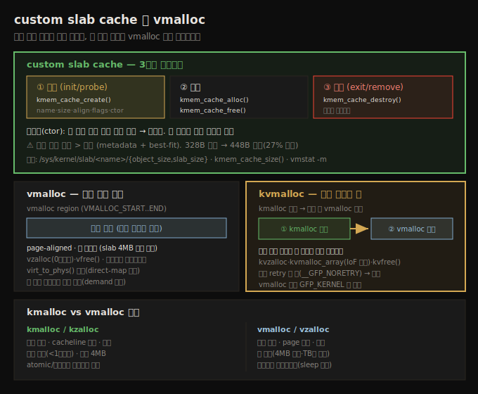

# 메모리 할당 (3) — custom slab cache와 vmalloc
---
> 자주 할당·해제하는 객체는 `kmem_cache_create()`로 전용 slab cache 를 만들어 성능을 올립니다. 3단계 수명주기(생성→`kmem_cache_alloc`/`free` 사용→`kmem_cache_destroy` 파괴)를 따르며, 생성자(ctor)로 할당 즉시 초기화할 수 있습니다. `vmalloc()`은 가상 연속(물리 비연속 가능) 메모리를 vmalloc region 에서 할당해, slab 의 4MB 한계를 넘는 큰 소프트웨어 버퍼에 씁니다. 크기를 모를 때는 `kvmalloc()`이 `kmalloc` 을 먼저 시도하고 실패 시 `vmalloc` 으로 폴백합니다.

앞 두 노트(08-01·08-02)에서 페이지·slab 할당자의 기본 API 를 봤습니다. 이 노트는 그 위에서 한 단계 더 들어갑니다. 드라이버를 쓰다 보면 특정 데이터 구조가 빈번하게 할당·해제되는 경우가 있습니다. 이럴 때 커널은 모듈/드라이버 작성자에게도 slab 계층 API 를 열어 주어, **자신만의 custom slab cache** 를 만들 수 있게 합니다.

이 노트는 custom slab cache 의 3단계 생성·사용·파괴, slab shrinker 인터페이스, 그리고 큰 가상 연속 버퍼를 위한 `vmalloc()` 계열(`vzalloc`·`kvmalloc`)을 다룹니다. 아래 종합도가 척추 — custom slab 수명주기, vmalloc, kvmalloc 폴백, kmalloc vs vmalloc 비교 — 입니다.




## 1. custom slab cache 의 3단계 수명주기

> 자주 쓰는 객체는 전용 캐시로 성능을 올립니다. kmem_cache_create() 로 생성(init/probe), kmem_cache_alloc/free 로 사용, kmem_cache_destroy() 로 파괴(exit/remove)합니다.

slab cache 의 핵심 설계 개념은 object 캐싱입니다(08-02 §1). 자주 쓰는 객체를 미리 캐시해 두면 할당·해제가 빨라집니다. 드라이버 안에서 어떤 구조가 빈번하게 할당·해제된다면, 평소처럼 `kzalloc()`/`kfree()` 를 쓰는 대신 전용 cache 를 만들 수 있습니다.

세 단계를 거칩니다.

1. **생성**: `kmem_cache_create()` 로 주어진 크기의 custom slab cache 를 만듭니다. 보통 모듈 init(또는 드라이버 `probe()`)에서.
2. **사용**: `kmem_cache_alloc()` 으로 객체 인스턴스 하나를 할당하고, 쓰고, `kmem_cache_free()` 로 cache 에 반납합니다.
3. **파괴**: 다 쓰면 `kmem_cache_destroy()` 로 cache 를 파괴합니다. 보통 모듈 exit(또는 드라이버 remove)에서.

6.1 커널에서 `kmem_cache_create()` 는 430곳 넘게 호출됩니다. 이 API 는 프로세스 컨텍스트에서만 호출할 수 있습니다.


## 2. Step 1 — cache 생성과 생성자(ctor)

> kmem_cache_create() 는 name·size·align·flags·ctor 다섯 인자를 받습니다. size 는 객체 크기, ctor 는 할당 즉시 자동 호출되는 생성자입니다. 반환값(struct kmem_cache *)은 전역 보관합니다.

```c
#include <linux/slab.h>
struct kmem_cache *kmem_cache_create(const char *name,
       unsigned int size, unsigned int align, slab_flags_t flags,
       void (*ctor)(void *));
```

다섯 인자입니다.

1. **`name`**: cache 이름. proc(과 vmstat·slabtop)에 표시됩니다. 보통 캐시하는 구조 이름과 맞춥니다.
2. **`size`**: 각 객체의 바이트 크기. 이 크기로 best-fit 알고리즘을 써서 cache 를 만듭니다. 단 실제 객체 크기는 요청보다 (약간) 클 수 있습니다(아래 §4).
3. **`align`**: 객체 정렬. 중요치 않으면 0, 워드 정렬이 필요하면 `sizeof(long)`(단위는 바이트).
4. **`flags`**: 0(특별 동작 없음) 또는 다음 플래그의 bitwise-OR.
5. **`ctor`**: 함수 포인터. 객체 할당 즉시 호출되는 생성자입니다.

flag 세 가지를 봅니다.

| flag | 동작 | 용도 |
|------|------|------|
| `SLAB_POISON` | cache 메모리를 알려진 값(`0xa5a5a5a5`)으로 초기화 | 디버깅 — raw 메모리 들여다볼 때 눈에 띔 |
| `SLAB_RED_ZONE` | 할당 버퍼 둘레에 red zone(guard) 삽입 | OOB·버퍼 오버플로/언더플로 검출(주로 개발/테스트) |
| `SLAB_HWCACHE_ALIGN` | 모든 객체를 하드웨어(CPU) cacheline 에 정렬 | 성능 권장. `k{m|z}alloc()` 메모리가 cacheline 정렬인 이유 |

다섯 번째 인자 `ctor` 가 흥미롭습니다. OOP 의 생성자처럼 동작해, custom cache 에서 객체가 할당되는 순간 초기화할 수 있게 합니다. 커널은 디자인 관점에서 상당히 객체지향적입니다(코드는 평범한 C 이지만). 예를 들어 integrity LSM 은 다음처럼 생성자 `init_once` 를 넘깁니다.

```c
iint_cache = kmem_cache_create("iint_cache",
       sizeof(struct integrity_iint_cache), 0, SLAB_PANIC, init_once);
```

> 생성자는 이 cache 가 **새 페이지를 할당할 때마다** 호출됩니다. 따라서 단일 `kmem_cache_alloc()` 한 번에도, 커널이 미리 여러 객체를 사전 할당하면서 생성자가 여러 번(예: 18회) 실행될 수 있습니다.

반환값은 성공 시 새 custom slab cache 포인터, 실패 시 NULL 입니다. 객체를 할당하려면 이 포인터가 필요하므로 보통 전역 보관합니다.


## 3. Step 2·3 — cache 사용과 파괴

> kmem_cache_alloc() 은 cache 포인터를 받아 객체 인스턴스 하나를 반환합니다(KVA). kmem_cache_free() 로 반납하고, 다 쓰면 kmem_cache_destroy() 로 cache 를 파괴합니다.

**Step 2 — 사용**:

```c
void *kmem_cache_alloc(struct kmem_cache *s, gfp_t gfpflags);
void kmem_cache_free(struct kmem_cache *s, void *x);
```

`kmem_cache_alloc()` 의 첫 인자는 앞 단계에서 만든 cache 포인터, 둘째는 GFP 플래그(프로세스 컨텍스트면 `GFP_KERNEL`, atomic 이면 `GFP_ATOMIC`)입니다. 반환값은 새 메모리 KVA 입니다. 실은 `k{m|z}alloc()` 도 내부적으로 이렇게 동작합니다.

`kmem_cache_free()` 는 첫 인자가 cache 포인터, 둘째가 반납할 객체 포인터(방금 `kmem_cache_alloc()` 으로 받은 것)입니다. 반환값은 없습니다.

**Step 3 — 파괴**:

```c
void kmem_cache_destroy(struct kmem_cache *);
```

인자는 첫 단계에서 만든 cache 포인터입니다. 보통 모듈 cleanup/exit(또는 드라이버 remove)에서 호출합니다.


## 4. 실제 객체 크기는 요청보다 크다 — 정보 추출

> sizeof·kmem_cache_size·ksize 가 모두 같은 값(328)을 반환해도, 커널이 실제 할당한 크기는 더 큽니다(448). /sys/kernel/slab/<name>/ 의사 파일로 정확한 크기와 낭비를 확인합니다.

328바이트 구조로 cache 를 만들면 `sizeof()`·`kmem_cache_size()`·`ksize()` 가 모두 328 을 반환합니다. 하지만 이것은 사실이 아닙니다. 커널이 실제 할당한 크기는 더 큽니다. `vmstat -m` 으로 보입니다.

```
$ sudo vmstat -m | grep our_ctx
our_ctx     0   18   448   18
```

실제 객체 크기는 328 이 아니라 **448바이트** — 객체당 120바이트(약 27%) 낭비입니다. 더 큰 이유는 세 가지입니다.

1. 요청보다 더 줄 수는 있어도 덜 줄 수는 없습니다.
2. metadata(housekeeping) 공간이 필요합니다.
3. 커널은 정확한 크기를 못 줄 때 가장 가까운(같거나 큰) slab cache 메모리를 씁니다(08-02 §5 의 낭비와 같은 원리).

sysfs 의 `/sys/kernel/slab/<cache-name>/` 디렉토리에 cache 별 의사 파일이 있습니다(root 필요). `grep` 으로 빠르게 봅니다.

```
# grep . /sys/kernel/slab/our_ctx/* | grep -E "object_size|slab_size"
/sys/kernel/slab/our_ctx/object_size:328
/sys/kernel/slab/our_ctx/slab_size:448
```

`object_size`(요청 크기)와 `slab_size`(실제 할당 크기)의 차이가 낭비입니다.


## 5. slab shrinker — 메모리 압박 시 cache 축소

> custom slab cache 는 shrinker 인터페이스를 등록해 커널과 협조하는 게 best practice 입니다. 메모리 압박이 높아지면 커널이 shrinker 콜백을 불러 slab 객체를 풀게 합니다.

캐시는 성능에 좋지만 필수는 아닙니다. 메모리 압박이 높아지면(너무 많이 쓰고 자유 메모리가 적으면) 커널은 캐시를 지능적으로 풀어 메모리를 회수합니다(memory reclamation). `kswapd*` 커널 스레드가 이 일을 합니다(다음 노트 09-02 주제).

custom slab cache 를 만든 코드는 커널과 잘 협조하도록 **shrinker 인터페이스**를 등록하는 게 best practice 입니다. 그러면 메모리 압박이 높아질 때 커널이 shrinker 콜백을 불러 slab 객체를 풀(축소할) 수 있습니다.

```c
int register_shrinker(struct shrinker *shrinker, const char *fmt, …);
```

첫 인자 shrinker 구조는 두 콜백 함수 포인터를 담습니다.

1. **`count_objects()`**: 풀 수 있는 객체 수를 세어 반환합니다. 0 이면 지금 풀 수 없다(또는 풀지 말아야 한다)는 뜻, `SHRINK_EMPTY` 면 애초에 풀 객체가 없다는 뜻입니다.
2. **`scan_objects()`**: 첫 콜백이 0(과 `SHRINK_EMPTY`)이 아닌 값을 반환할 때만 호출됩니다. 실제로 cache 를 풀고(축소하고), 회수 사이클에서 푼 객체 수를 반환합니다. 진행 불가(deadlock 가능)면 `SHRINK_STOP` 을 반환합니다.

> `register_shrinker()` 는 6.0 커널에서 식별 이름 문자열을 받도록 갱신됐습니다. `CONFIG_SHRINKER_DEBUG` 가 켜지면 `/sys/kernel/debug/shrinker` 에 등록된 shrinker 가 보입니다. 6.1 커널에서 이 인터페이스를 쓰는 컴포넌트는 소수입니다(예: `drivers/md/dm-bufio.c`).


## 6. vmalloc — 큰 가상 연속 버퍼

> vmalloc() 은 가상 연속(물리 비연속 가능) 메모리를 vmalloc region 에서 할당합니다. slab 의 4MB 한계를 넘는 큰 소프트웨어 버퍼에 쓰며, 프로세스 컨텍스트에서만 호출할 수 있습니다.

페이지 할당자, 그 위의 slab 외에, 커널 VAS 안에는 또 하나의 완전히 가상인 주소 공간이 있습니다 — **vmalloc region**(`VMALLOC_START` ~ `VMALLOC_END-1`, arch 의존). 처음엔 가상 페이지가 물리 프레임에 매핑되지 않은 순수 가상 영역입니다.

```c
#include <linux/vmalloc.h>
void *vmalloc(unsigned long size);
```

핵심 특성입니다.

1. **가상 연속**을 보장합니다. 물리 연속은 보장하지 않습니다(클수록 물리 비연속 가능성↑).
2. 내용은 이론상 random(arch 의존, x86_64 는 0 처럼 보임). 0 초기화가 필요하면 `vzalloc()` 을 씁니다.
3. **프로세스 컨텍스트(sleep 안전)에서만** 호출합니다. spinlock 보유 중 호출은 규칙 위반입니다.
4. 반환값은 vmalloc region 안의 KVA(실패 시 NULL).
5. 시작 주소는 page-aligned 입니다 — 큰 할당용이라는 신호입니다.

`vmalloc()` 은 slab API(`k{m|z}alloc`, 보통 최대 4MB)로 못 주는 **크고 가상 연속인 버퍼**가 필요할 때 씁니다. 커널 자신도 모듈 적재 시 정적 메모리, `CONFIG_VMAP_STACK` 시 스레드 커널 스택, `ioremap()`, bpf 코드 등에 vmalloc 을 씁니다.

```c
void *vzalloc(unsigned long size);   // 0 초기화 래퍼
void vfree(const void *addr);        // 해제 (NULL 은 무해)
```

> 주의: vmalloc region 주소는 `virt_to_phys()` 로 변환할 수 없습니다 — direct-map(lowmem) 주소가 아니기 때문입니다(08-01·07-03). 단 물리 프레임은 **즉시** 할당됩니다 — 유저 공간 malloc 의 demand paging 과 달리 lazy 가 아닙니다(다음 노트 09-02 에서 다룹니다).


## 7. kvmalloc — 크기를 모를 때

> kvmalloc() 은 kmalloc 을 먼저 시도하고 실패하면 vmalloc 으로 폴백합니다. 물리 연속을 빠르게 못 얻으면 가상 연속으로 안전하게 받습니다. 크기가 불확실한 할당에 적합합니다.

어떤 API(메모리 계층)를 쓸지 확신이 안 설 때가 많습니다. 다음 패턴이 흔했습니다.

```c
kptr = kmalloc(n);
if (!kptr) { kptr = vmalloc(n); if (!kptr) <실패 처리>; }
```

이를 깔끔하게 대체하는 게 `kvmalloc()` 입니다. 내부 동작은 이렇습니다.

1. 먼저 효율적인 `kmalloc()` 시도.
2. 성공하면 물리 연속 메모리를 빠르게 얻고 종료.
3. 실패하면 느리지만 확실한 `vmalloc()` 으로 폴백(가상 연속 메모리).

```c
#include <linux/mm.h>
void *kvmalloc(size_t size, gfp_t flags);   // vmalloc 폴백 시 GFP_KERNEL 만 가능
void kvfree(const void *addr);
```

`kvzalloc()`(0 초기화)도 있고, 배열에는 `kvmalloc_array()`(곱셈 시 정수 오버플로 IoF 검사 — `check_mul_overflow()`)·`kvcalloc()` 을 씁니다. NUMA 인지가 필요하면 `kvmalloc_node()` 로 노드를 지정합니다.

> kvmalloc 이 유용한 또 다른 이유: 일반 `kmalloc` 은 작은 요청(`CONFIG_PAGE_ALLOC_COSTLY_ORDER`=3, 8페이지 이하)을 무한 retry 해 성능을 해칠 수 있습니다. kvmalloc 은 `__GFP_NORETRY|__GFP_NOWARN` 으로 무한 retry 를 하지 않아 더 빠릅니다.

주소가 vmalloc region 에서 왔는지 확인하려면 `/proc/vmallocinfo` 조회, procmap 유틸, 또는 `is_vmalloc_addr()` API 를 씁니다.


## 자주 받는 오해

1. "`kmem_cache_size()`·`ksize()` 가 328 을 반환하니 실제 328바이트가 할당됐다"고 생각하지만, 실제 할당은 더 큽니다(448). metadata + best-fit 때문입니다. `/sys/kernel/slab/<name>/slab_size` 가 정확한 값입니다.
2. "생성자(ctor)는 `kmem_cache_alloc()` 호출당 한 번 실행된다"고 생각하지만, **새 페이지를 할당할 때마다** 실행됩니다. 단일 alloc 한 번에도 커널이 여러 객체를 사전 할당하며 생성자가 여러 번 돕니다.
3. "`vmalloc()` 메모리도 `virt_to_phys()` 로 물리 주소를 얻을 수 있다"고 생각하지만, vmalloc region 은 direct-map 이 아니라 불가능합니다. 단 물리 프레임은 즉시(non-lazy) 할당됩니다.
4. "`vmalloc` 은 물리 연속이 아니니 느리고 쓸모없다"고 생각하지만, slab 의 4MB 한계를 넘는 큰 소프트웨어 버퍼(물리 연속이 필요 없는)에는 vmalloc 이 정답입니다.


## 면접에서 받을 만한 질문

1. **custom slab cache 는 언제·어떻게 쓰나요?** → 특정 구조가 빈번하게 할당·해제될 때 성능을 위해 씁니다. 3단계입니다 — `kmem_cache_create()`(init/probe), `kmem_cache_alloc()`/`kmem_cache_free()`(사용), `kmem_cache_destroy()`(exit/remove). 생성자(ctor)를 넘기면 객체 할당 즉시 초기화되며, 이는 새 페이지 할당 때마다 호출됩니다.
2. **kmalloc 과 vmalloc 의 차이는?** → `kmalloc` 은 물리 연속 + cacheline 정렬을 보장하고 빠르지만 최대 4MB, atomic 컨텍스트에서도 가능합니다. `vmalloc` 은 가상 연속(물리 비연속 가능)·page 정렬이고 느리지만 4MB 를 훨씬 넘는 큰 버퍼(TB급도)를 줄 수 있고 프로세스 컨텍스트에서만 가능합니다. 용도가 다르지 우열은 아닙니다.
3. **kvmalloc 은 왜 쓰나요?** → 크기가 불확실하거나 물리 연속이 꼭 필요하지 않을 때입니다. `kmalloc` 을 먼저 시도해 성공하면 빠른 물리 연속 메모리를 얻고, 실패하면 `vmalloc` 으로 폴백해 가상 연속 메모리를 받습니다. 무한 retry 를 하지 않아(`__GFP_NORETRY`) 일반 kmalloc 보다 빠를 수 있습니다.
4. **slab shrinker 는 왜 등록하나요?** → custom slab cache 가 커널의 메모리 회수와 협조하도록 하기 위해서입니다. 메모리 압박이 높아지면 커널이 `count_objects()`(풀 수 있는 수)·`scan_objects()`(실제 축소) 콜백을 불러 cache 를 풀게 합니다. 등록하지 않으면 압박 시에도 커널이 이 cache 를 회수하지 못합니다.


## 관련 문서

- [상위 MOC](../../README.md) — 커널 개발자 관점 리눅스 내부 인덱스
- [09-02. 메모리 할당 (4) — API 선택과 memory reclaim](./09-02.메모리 할당 (4) — API 선택과 memory reclaim.md) — 짝 노트. 어느 API 를 언제 쓰는가와 kswapd·MGLRU·DAMON 회수
- [08-02. 메모리 할당 (2) — slab 할당자와 kmalloc 낭비](./08-02.메모리 할당 (2) — slab 할당자와 kmalloc 낭비.md) — slab 기본 API 와 kmalloc-N 캐시·낭비 측정
