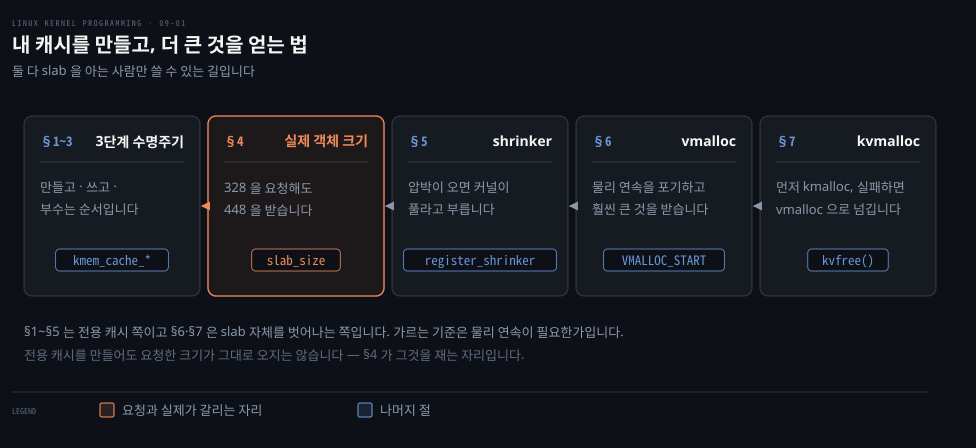
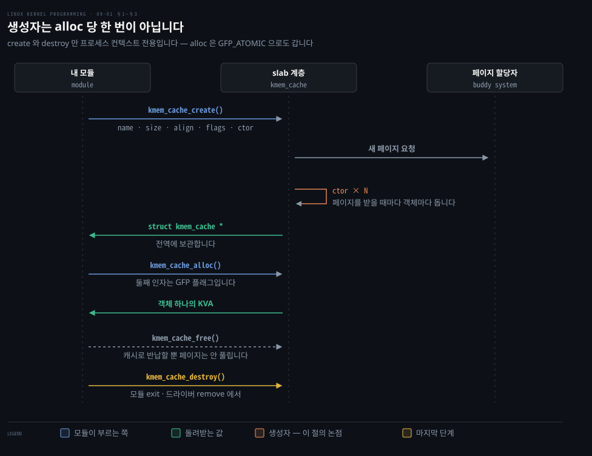
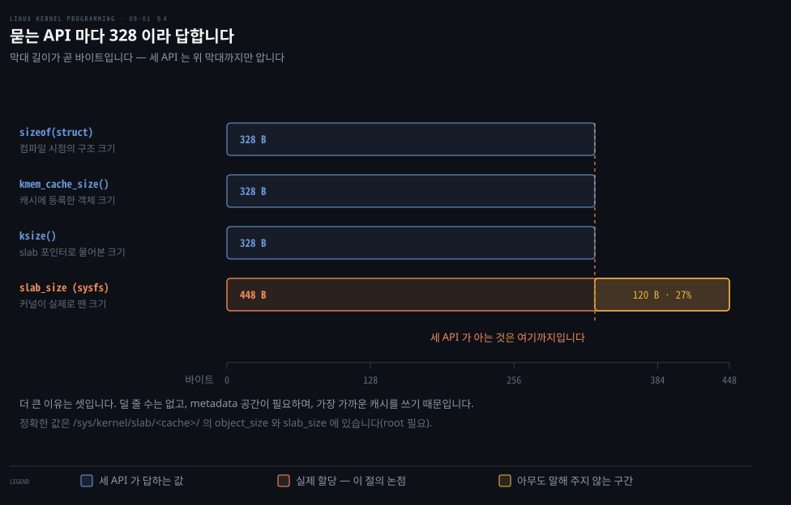
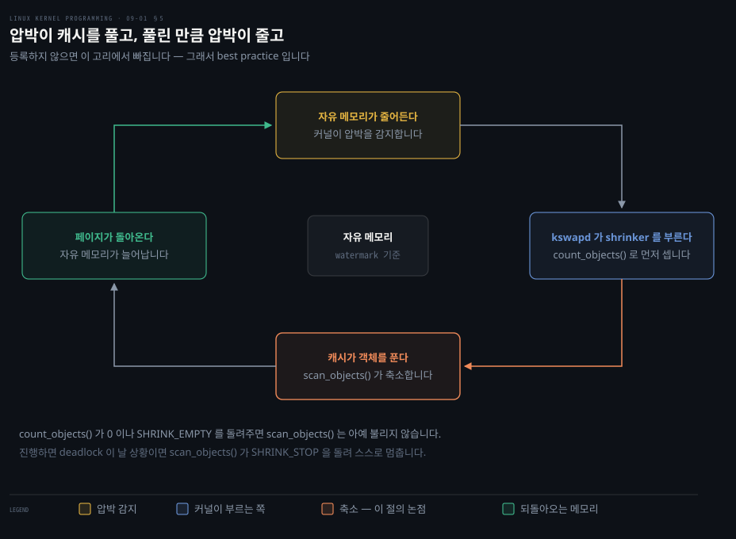
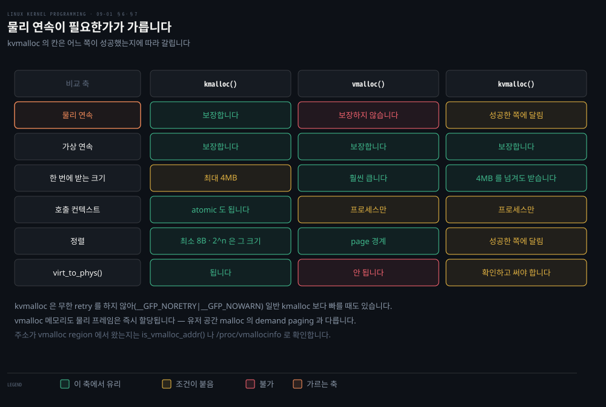

# 메모리 할당 (3) — custom slab cache와 vmalloc
---
> 커널은 모듈 작성자에게도 slab 계층 API 를 열어 줍니다. 자주 할당·해제하는 객체가 있다면 전용 캐시를 직접 만들 수 있습니다.

수명주기는 3단계입니다.

- **생성**: `kmem_cache_create()`
- **사용**: `kmem_cache_alloc()`·`kmem_cache_free()`
- **파괴**: `kmem_cache_destroy()`

생성자(ctor)를 넘기면 객체가 할당되는 즉시 초기화됩니다.

반대편에는 slab 이 못 주는 크기가 있습니다. `vmalloc()` 은 물리 연속을 포기하는 대신 4MB 한계를 넘는 큰 버퍼를 vmalloc region 에서 내줍니다. 크기를 모를 때는 `kvmalloc()` 이 `kmalloc` 을 먼저 시도하고 실패하면 `vmalloc` 으로 폴백합니다.

앞 두 노트(08-01·08-02)에서 페이지·slab 할당자의 기본 API 를 봤습니다. 이 노트는 그 위에서 한 단계 더 들어갑니다.




## 1. custom slab cache 의 3단계 수명주기

> 자주 쓰는 객체를 전용 캐시로 옮기면 할당·해제가 빨라집니다. 만들고, 쓰고, 부수는 세 단계를 거칩니다.



도식의 주황색 자기 호출이 이 절에서 가장 헷갈리는 자리입니다. 생성자는 `kmem_cache_alloc()` 호출당 한 번이 아닙니다.

### 언제 전용 캐시를 만드나

slab cache 의 핵심 설계 개념은 object 캐싱입니다(08-02 §1). 자주 쓰는 객체를 미리 캐시해 두면 할당과 해제가 빨라집니다.

드라이버 안에서 어떤 구조가 빈번하게 할당·해제된다면, 평소처럼 `kzalloc()`·`kfree()` 를 쓰는 대신 그 구조만을 위한 전용 cache 를 만들 수 있습니다. 커널 자신이 `task_struct` 에 하는 일을 내 구조에도 하는 셈입니다.

### 세 단계

1. **생성**: `kmem_cache_create()` 로 주어진 크기의 custom slab cache 를 만듭니다. 보통 모듈 init 이나 드라이버 `probe()` 에서 합니다.
2. **사용**: `kmem_cache_alloc()` 으로 객체 인스턴스 하나를 할당하고, 쓰고, `kmem_cache_free()` 로 cache 에 반납합니다.
3. **파괴**: 다 쓰면 `kmem_cache_destroy()` 로 cache 를 파괴합니다. 보통 모듈 exit 이나 드라이버 remove 에서 합니다.

6.1 커널에서 `kmem_cache_create()` 는 430곳 넘게 호출됩니다. 이 API 는 프로세스 컨텍스트에서만 호출할 수 있습니다.


## 2. Step 1 — cache 생성과 생성자(ctor)

> `kmem_cache_create()` 는 다섯 인자를 받습니다. 그중 마지막 `ctor` 가 객체 할당 즉시 도는 생성자입니다.

```c
#include <linux/slab.h>
struct kmem_cache *kmem_cache_create(const char *name,
       unsigned int size, unsigned int align, slab_flags_t flags,
       void (*ctor)(void *));
```

다섯 인자는 이렇습니다.

1. **`name`**: cache 이름입니다. proc 과 `vmstat`·`slabtop` 에 표시되므로 보통 캐시하는 구조 이름과 맞춥니다.
2. **`size`**: 각 객체의 바이트 크기입니다. 이 크기로 best-fit 알고리즘을 써서 cache 를 만듭니다. 단 실제 객체 크기는 요청보다 약간 클 수 있습니다(§4).
3. **`align`**: 객체 정렬입니다. 중요치 않으면 0, 워드 정렬이 필요하면 `sizeof(long)` 을 넘깁니다(단위는 바이트).
4. **`flags`**: 특별한 동작이 없으면 0, 아니면 아래 플래그의 bitwise-OR 입니다.
5. **`ctor`**: 함수 포인터입니다. 객체 할당 즉시 호출되는 생성자입니다.

### 세 가지 flag

| flag | 동작 | 용도 |
|------|------|------|
| `SLAB_POISON` | cache 메모리를 알려진 값(`0xa5a5a5a5`)으로 초기화 | 디버깅 — raw 메모리를 들여다볼 때 눈에 띔 |
| `SLAB_RED_ZONE` | 할당 버퍼 둘레에 red zone(guard) 삽입 | OOB·버퍼 오버플로/언더플로 검출(주로 개발·테스트) |
| `SLAB_HWCACHE_ALIGN` | 모든 객체를 하드웨어(CPU) cacheline 에 정렬 | 성능 권장. `k{m|z}alloc()` 메모리가 cacheline 정렬인 이유 |

### 생성자가 도는 시점

다섯 번째 인자 `ctor` 가 흥미롭습니다. OOP 의 생성자처럼 동작해 custom cache 에서 객체가 할당되는 순간 초기화할 수 있게 합니다. 커널은 코드가 평범한 C 이지만 디자인 관점에서는 상당히 객체지향적입니다.

예를 들어 integrity LSM 은 생성자 `init_once` 를 넘깁니다.

```c
iint_cache = kmem_cache_create("iint_cache",
       sizeof(struct integrity_iint_cache), 0, SLAB_PANIC, init_once);
```

> 생성자는 이 cache 가 **새 페이지를 할당할 때마다** 호출됩니다. 따라서 `kmem_cache_alloc()` 을 한 번 불러도, 커널이 미리 여러 객체를 사전 할당하면서 생성자가 여러 번 실행될 수 있습니다. 열여덟 번쯤 도는 일도 드물지 않습니다.

반환값은 성공 시 새 custom slab cache 포인터이고 실패 시 NULL 입니다. 객체를 할당하려면 이 포인터가 필요하므로 보통 전역에 보관합니다.


## 3. Step 2·3 — cache 사용과 파괴

> 사용은 `kmem_cache_alloc()` 과 `kmem_cache_free()` 두 짝입니다. 둘 다 첫 인자가 캐시 포인터입니다.

### Step 2 — 사용

```c
void *kmem_cache_alloc(struct kmem_cache *s, gfp_t gfpflags);
void kmem_cache_free(struct kmem_cache *s, void *x);
```

`kmem_cache_alloc()` 의 첫 인자는 앞 단계에서 만든 cache 포인터이고, 둘째는 GFP 플래그입니다. 프로세스 컨텍스트면 `GFP_KERNEL`, atomic 이면 `GFP_ATOMIC` 입니다. 반환값은 새 메모리의 KVA 입니다. 실은 `k{m|z}alloc()` 도 내부적으로 이렇게 동작합니다.

`kmem_cache_free()` 는 첫 인자가 cache 포인터, 둘째가 반납할 객체 포인터입니다. 방금 `kmem_cache_alloc()` 으로 받은 것을 넘깁니다. 반환값은 없습니다.

### Step 3 — 파괴

```c
void kmem_cache_destroy(struct kmem_cache *);
```

인자는 첫 단계에서 만든 cache 포인터입니다. 보통 모듈 cleanup·exit 이나 드라이버 remove 에서 호출합니다.


## 4. 실제 객체 크기는 요청보다 크다 — 정보 추출

> `sizeof`·`kmem_cache_size`·`ksize` 세 API 가 모두 328 이라 답해도, 커널이 실제로 뗀 것은 448바이트입니다.



도식의 노란 구간이 세 API 어디에도 안 나오는 낭비입니다. 그 값은 sysfs 에만 있습니다.

328바이트 구조로 cache 를 만들면 `sizeof()`·`kmem_cache_size()`·`ksize()` 가 모두 328 을 반환합니다. 하지만 이것은 사실이 아닙니다. `vmstat -m` 으로 보면 드러납니다.

```bash
sudo vmstat -m | grep our_ctx
```

```bash
our_ctx     0   18   448   18
```

실제 객체 크기는 328 이 아니라 **448바이트** 입니다. 객체당 120바이트, 약 27% 가 낭비입니다.

### 왜 더 큰가

이유가 셋입니다.

1. 요청보다 더 줄 수는 있어도 덜 줄 수는 없습니다.
2. metadata(housekeeping) 공간이 필요합니다.
3. 커널은 정확한 크기를 못 줄 때 가장 가까운, 같거나 큰 slab cache 메모리를 씁니다. 08-02 §5 의 낭비와 같은 원리입니다.

### 정확한 값 보기

sysfs 의 `/sys/kernel/slab/<cache-name>/` 디렉토리에 cache 별 의사 파일이 있습니다(root 필요). `grep` 으로 빠르게 봅니다.

```bash
grep . /sys/kernel/slab/our_ctx/* | grep -E "object_size|slab_size"
```

```bash
/sys/kernel/slab/our_ctx/object_size:328
/sys/kernel/slab/our_ctx/slab_size:448
```

`object_size`(요청 크기)와 `slab_size`(실제 할당 크기)의 차이가 낭비입니다.


## 5. slab shrinker — 메모리 압박 시 cache 축소

> 캐시는 성능에 좋지만 필수는 아닙니다. shrinker 를 등록해 두면 메모리가 모자랄 때 커널이 그 캐시를 풀 수 있습니다.



도식은 순환입니다. shrinker 를 등록하지 않은 캐시는 이 고리에서 빠져, 압박이 와도 커널이 회수하지 못합니다.

메모리 압박이 높아지면, 곧 메모리를 너무 많이 쓰고 자유 메모리가 적어지면 커널은 캐시를 지능적으로 풀어 메모리를 회수합니다. 이것이 memory reclamation 이고 `kswapd*` 커널 스레드가 담당합니다. 다음 노트 09-02 의 주제입니다.

그래서 custom slab cache 를 만든 코드는 커널과 잘 협조하도록 **shrinker 인터페이스**를 등록하는 것이 best practice 입니다. 그러면 메모리 압박이 높아질 때 커널이 shrinker 콜백을 불러 slab 객체를 풀 수 있습니다.

```c
int register_shrinker(struct shrinker *shrinker, const char *fmt, …);
```

첫 인자 shrinker 구조는 두 콜백 함수 포인터를 담습니다.

1. **`count_objects()`**: 풀 수 있는 객체 수를 세어 반환합니다. 0 이면 지금은 풀 수 없다는(또는 풀지 말아야 한다는) 뜻이고, `SHRINK_EMPTY` 면 애초에 풀 객체가 없다는 뜻입니다.
2. **`scan_objects()`**: 첫 콜백이 0 도 `SHRINK_EMPTY` 도 아닌 값을 반환할 때만 호출됩니다. 실제로 cache 를 축소하고, 회수 사이클에서 푼 객체 수를 반환합니다. 진행하면 deadlock 이 날 상황이면 `SHRINK_STOP` 을 반환합니다.

> `register_shrinker()` 는 6.0 커널에서 식별 이름 문자열을 받도록 갱신됐습니다. `CONFIG_SHRINKER_DEBUG` 가 켜지면 `/sys/kernel/debug/shrinker` 에 등록된 shrinker 가 보입니다. 6.1 커널에서 이 인터페이스를 쓰는 컴포넌트는 소수입니다(예: `drivers/md/dm-bufio.c`).


## 6. vmalloc — 큰 가상 연속 버퍼

> 물리 연속을 포기하면 훨씬 큰 버퍼를 받을 수 있습니다. `vmalloc()` 이 그 길입니다.

페이지 할당자와 그 위의 slab 외에, 커널 VAS 안에는 또 하나의 완전히 가상인 주소 공간이 있습니다. **vmalloc region** 이고, `VMALLOC_START` 부터 `VMALLOC_END-1` 까지이며 위치는 arch 의존적입니다. 처음에는 가상 페이지가 물리 프레임에 매핑되지 않은 순수 가상 영역입니다.

```c
#include <linux/vmalloc.h>
void *vmalloc(unsigned long size);
```

핵심 특성이 다섯입니다.

1. **가상 연속**을 보장합니다. 물리 연속은 보장하지 않습니다. 클수록 물리 비연속일 가능성이 올라갑니다.
2. 내용은 이론상 random 입니다(arch 의존, x86_64 에서는 0 처럼 보입니다). 0 초기화가 필요하면 `vzalloc()` 을 씁니다.
3. **프로세스 컨텍스트에서만** 호출합니다. sleep 이 안전해야 하므로 spinlock 보유 중 호출은 규칙 위반입니다.
4. 반환값은 vmalloc region 안의 KVA 이고, 실패 시 NULL 입니다.
5. 시작 주소는 page-aligned 입니다. 큰 할당용이라는 신호입니다.

`vmalloc()` 은 slab API 로 못 주는 **크고 가상 연속인 버퍼**가 필요할 때 씁니다. `k{m|z}alloc` 은 보통 최대 4MB 입니다. 커널 자신도 모듈 적재 시 정적 메모리, `CONFIG_VMAP_STACK` 일 때 스레드 커널 스택, `ioremap()`, bpf 코드 등에 vmalloc 을 씁니다.

```c
void *vzalloc(unsigned long size);   // 0 초기화 래퍼
void vfree(const void *addr);        // 해제 (NULL 은 무해)
```

> 주의할 점이 둘입니다. vmalloc region 주소는 `virt_to_phys()` 로 변환할 수 없습니다. direct-map(lowmem) 주소가 아니기 때문입니다(08-01·07-03). 다만 물리 프레임은 **즉시** 할당됩니다. 유저 공간 malloc 의 demand paging 과 달리 lazy 가 아닙니다(다음 노트 09-02 에서 다룹니다).


## 7. kvmalloc — 크기를 모를 때

> 어느 계층을 쓸지 확신이 안 설 때가 있습니다. `kvmalloc()` 은 `kmalloc` 을 먼저 시도하고 실패하면 `vmalloc` 으로 폴백합니다.



도식은 세 API 를 같은 여섯 축으로 견줍니다. 우열이 아니라 용도가 다릅니다.

예전에는 다음 패턴이 흔했습니다.

```c
kptr = kmalloc(n);
if (!kptr) { kptr = vmalloc(n); if (!kptr) <실패 처리>; }
```

이를 깔끔하게 대체하는 것이 `kvmalloc()` 입니다. 내부 동작은 이렇습니다.

1. 먼저 효율적인 `kmalloc()` 을 시도합니다.
2. 성공하면 물리 연속 메모리를 빠르게 얻고 종료합니다.
3. 실패하면 느리지만 확실한 `vmalloc()` 으로 폴백해 가상 연속 메모리를 받습니다.

```c
#include <linux/mm.h>
void *kvmalloc(size_t size, gfp_t flags);   // vmalloc 폴백 시 GFP_KERNEL 만 가능
void kvfree(const void *addr);
```

친척 API 도 있습니다. 0 초기화는 `kvzalloc()`, 배열은 `kvmalloc_array()`·`kvcalloc()` 입니다. 배열 쪽은 곱셈 시 정수 오버플로를 `check_mul_overflow()` 로 검사합니다. NUMA 인지가 필요하면 `kvmalloc_node()` 로 노드를 지정합니다.

> kvmalloc 이 유용한 또 다른 이유가 있습니다. 일반 `kmalloc` 은 작은 요청(`CONFIG_PAGE_ALLOC_COSTLY_ORDER`=3, 8페이지 이하)을 무한 retry 해 성능을 해칠 수 있습니다. kvmalloc 은 `__GFP_NORETRY|__GFP_NOWARN` 으로 무한 retry 를 하지 않아 더 빠릅니다.

주소가 vmalloc region 에서 왔는지 확인하려면 `/proc/vmallocinfo` 를 조회하거나, procmap 유틸, 또는 `is_vmalloc_addr()` API 를 씁니다.


## 자주 받는 오해

> 네 오해가 반복됩니다. 앞 둘은 크기에 관한 것이고, 뒤 둘은 vmalloc 에 관한 것입니다.

1. "`kmem_cache_size()`·`ksize()` 가 328 을 반환하니 실제 328바이트가 할당됐다"고 생각하지만, 실제 할당은 448 로 더 큽니다. metadata 와 best-fit 때문입니다. `/sys/kernel/slab/<name>/slab_size` 가 정확한 값입니다.
2. "생성자(ctor)는 `kmem_cache_alloc()` 호출당 한 번 실행된다"고 생각하지만, **새 페이지를 할당할 때마다** 실행됩니다. 단일 alloc 한 번에도 커널이 여러 객체를 사전 할당하며 생성자가 여러 번 돕니다.
3. "`vmalloc()` 메모리도 `virt_to_phys()` 로 물리 주소를 얻을 수 있다"고 생각하지만, vmalloc region 은 direct-map 이 아니라 불가능합니다. 다만 물리 프레임은 즉시 할당되므로 lazy 는 아닙니다.
4. "`vmalloc` 은 물리 연속이 아니니 느리고 쓸모없다"고 생각하지만, slab 의 4MB 한계를 넘으면서 물리 연속이 필요 없는 큰 소프트웨어 버퍼에는 vmalloc 이 정답입니다.


## 면접에서 받을 만한 질문

1. **custom slab cache 는 언제·어떻게 쓰나요?** → 특정 구조가 빈번하게 할당·해제될 때 성능을 위해 씁니다. 3단계입니다. `kmem_cache_create()` 로 init·probe 에서 만들고, `kmem_cache_alloc()`·`kmem_cache_free()` 로 쓰고, `kmem_cache_destroy()` 로 exit·remove 에서 부숩니다. 생성자(ctor)를 넘기면 객체 할당 즉시 초기화되며, 이는 새 페이지 할당 때마다 호출됩니다.
2. **kmalloc 과 vmalloc 의 차이는?** → `kmalloc` 은 물리 연속과 cacheline 정렬을 보장하고 빠르지만 최대 4MB 이며 atomic 컨텍스트에서도 가능합니다. `vmalloc` 은 가상 연속만 보장하고 page 정렬이며 느리지만 4MB 를 훨씬 넘는 큰 버퍼를 줄 수 있고 프로세스 컨텍스트에서만 가능합니다. 용도가 다르지 우열이 아닙니다.
3. **kvmalloc 은 왜 쓰나요?** → 크기가 불확실하거나 물리 연속이 꼭 필요하지 않을 때입니다. `kmalloc` 을 먼저 시도해 성공하면 빠른 물리 연속 메모리를 얻고, 실패하면 `vmalloc` 으로 폴백해 가상 연속 메모리를 받습니다. 무한 retry 를 하지 않아 일반 kmalloc 보다 빠를 수 있습니다.
4. **slab shrinker 는 왜 등록하나요?** → custom slab cache 가 커널의 메모리 회수와 협조하도록 하기 위해서입니다. 메모리 압박이 높아지면 커널이 `count_objects()` 로 풀 수 있는 수를 묻고 `scan_objects()` 로 실제 축소를 시킵니다. 등록하지 않으면 압박 시에도 커널이 이 cache 를 회수하지 못합니다.


## 관련 문서

- [상위 MOC](../../README.md) — 커널 개발자 관점 리눅스 내부 인덱스
- [09-02.메모리 할당 (4) — API 선택과 memory reclaim](./09-02.메모리%20할당%20(4)%20—%20API%20선택과%20memory%20reclaim.md) — 짝 노트. 어느 API 를 언제 쓰는가와 kswapd·MGLRU·DAMON 회수
- [08-02.메모리 할당 (2) — slab 할당자와 kmalloc 낭비](./08-02.메모리%20할당%20(2)%20—%20slab%20할당자와%20kmalloc%20낭비.md) — slab 기본 API 와 kmalloc-N 캐시·낭비 측정
