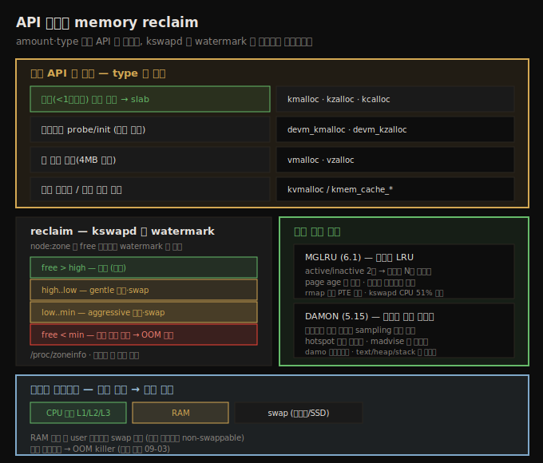

# 메모리 할당 (4) — API 선택과 memory reclaim
---
> 커널 메모리 API 는 필요한 **양**과 **타입**으로 고릅니다. 1차 선택은 slab(`kmalloc`/`kzalloc`, 1페이지 미만), 드라이버 `probe()`면 `devm_`, 큰 가상 버퍼면 `vmalloc`, 크기가 불확실하면 `kvmalloc`, 자주 쓰는 객체면 custom slab 입니다. memory reclaim 은 `kswapd` 커널 스레드가 node:zone 별 watermark(min/low/high)를 보고 수행합니다. free 가 high~low 면 gentle, low~min 이면 aggressive 회수, min 미만이면 신규 요청을 거부합니다. MGLRU 는 세대별 LRU 로 더 세밀하게 회수하고, DAMON 은 접근 패턴을 sampling 으로 모니터링합니다.

앞 세 노트에서 페이지 할당자·slab·custom slab·vmalloc 까지 다양한 할당 계층을 봤습니다. 선택지가 많으니 자연스러운 질문이 생깁니다 — **어느 API 를 언제 쓰는가?** 올바른 선택은 성능·안정성에 직결됩니다.

이 노트는 그 선택 가이드(타입별·양별), 그리고 커널이 자유 메모리를 유지하기 위해 늘 수행하는 housekeeping 인 memory reclaim(zone watermark·kswapd·MGLRU·DAMON)을 다룹니다. 아래 종합도가 척추 — API 선택표, watermark·kswapd, MGLRU·DAMON, 메모리 피라미드 — 입니다.




## 1. 어느 API 를 언제 — 양과 타입으로 선택

> API 는 필요한 양과 타입으로 고릅니다. 1차 선택은 slab(kmalloc/kzalloc), 드라이버 probe 면 devm_, 큰 가상 버퍼면 vmalloc, 불확실하면 kvmalloc, 자주 쓰는 객체면 custom slab 입니다.

커널 할당 엔진은 결국 페이지(buddy system) 할당자 하나이고, 그 위에 slab 이 layered 되며, 별도로 vmalloc region 이 있습니다. 선택은 두 축으로 봅니다 — **필요한 양**과 **타입**.

타입별 선택표입니다.

| 필요한 메모리 타입 | 계층 | API |
|------------------|------|-----|
| 작은(1페이지 미만) 물리 연속 — 모듈 일반 | slab | `kmalloc`·`kzalloc`·`kcalloc`·`krealloc` |
| 드라이버 `probe()`/init 의 작은 물리 연속 (자동 해제) | resource-managed | `devm_kmalloc`·`devm_kzalloc` |
| 물리 연속, 범용 | 페이지 할당자 | `__get_free_page[s]`·`get_zeroed_page`·`alloc_page[s][_exact]` |
| 물리 연속, DMA 용 | DMA API 계층(+CMA) | `dma_alloc_coherent`·`dma_map_*` (직접 slab/page 쓰지 않음) |
| 큰 가상 연속(소프트웨어 버퍼) | vmalloc | `vmalloc`·`vzalloc` |
| 크기 불확실, 가상/물리 무관 | slab 또는 vmalloc | `kvmalloc[_array]` |
| 자주 쓰는 custom 객체 | custom slab cache | `kmem_cache_{create,destroy,alloc,free}` |

핵심 규칙입니다.

1. **1차 선택은 slab** — `[devm_]kzalloc()`/`[devm_]kmalloc()`. 1페이지 미만 일반 할당에 가장 효율적입니다.
2. atomic("sleep 불가") 컨텍스트(인터럽트 등)면 반드시 `GFP_ATOMIC`, 프로세스 컨텍스트에서 sleep 안전하면 `GFP_KERNEL`(08-01 §6).
3. slab 으로 할당하면 `ksize()` 또는 `/sys/kernel/slab/<name>/slab_size` 로 실제 크기를 확인합니다(08-02 §5).
4. 크기를 모르면 `kvmalloc()`, 정확히 2의 거듭제곱 페이지면 페이지 할당자가 최적입니다.

> **DMA·CMA**: DMA 는 전용 DMA Engine API 를 써야 합니다(slab/page 직접 사용 시 미묘한 하드웨어 문제 발생). Samsung 이 기여한 CMA(Contiguous Memory Allocator)는 4MB 한계를 넘는 큰 물리 연속 청크를 할당하며, DMA Engine 에 투명하게 내장됩니다. 드라이버 작성자는 DMA Engine 계층만 쓰면 됩니다.


## 2. memory reclaim — 자유 메모리 유지라는 housekeeping

> 커널은 RAM 안에 최소한의 자유 페이지를 늘 확보하려고 background 로 페이지를 회수합니다. kswapd 커널 스레드가 메모리가 부족해지면 이 일을 수행합니다.

성능을 위해 커널은 working set 을 메모리 피라미드 위쪽(빠른 곳)에 두려 합니다. 피라미드는 위에서 아래로 — CPU 레지스터 → CPU 캐시(L1/L2/L3) → RAM → swap(디스크/SSD) — 순으로 작고 빠른 것에서 크고 느린 것으로 갑니다.

코드 실행 중 working set 이 CPU 캐시를 넘치면 RAM 으로, RAM 도 부족하면 OS 가 더 들어가지 않는 페이지를 swap 으로 내보냅니다. 단 유저 공간 페이지만 swap 대상이고, 커널 페이지는 non-swappable 입니다.

커널은 RAM 안에 최소 자유 페이지를 늘 확보하려고 background 페이지 회수를 합니다. **`kswapd` 커널 스레드**가 메모리 사용을 감시하다가 부족해지면 회수 메커니즘을 발동합니다. "회수(reclaim)"란 페이지를 풀어 시스템이 다시 쓸 수 있게 만드는 것입니다.


## 3. zone watermark — 회수 발동 기준

> 회수는 node:zone 별로 min·low·high 세 watermark 를 기준으로 합니다. free 가 high~low 면 gentle, low~min 이면 aggressive 회수, min 미만이면 신규 요청을 거부합니다. /proc/zoneinfo 로 현재 값을 봅니다.

회수는 **node:zone 단위**로 합니다. 커널은 node:zone 마다 min·low·high 세 watermark(단위는 페이지)를 두어 언제 회수할지 결정합니다. `/proc/zoneinfo` 로 봅니다.

```
Node 0, zone Normal
  pages free  75060
  min   16188
  low   23952
  high  31716
```

여기선 free(75,060) > high(31,716)이라 여유롭습니다. 페이지 회수 알고리즘(PFA, "reclaim")의 단계입니다.

1. **low < free < high** — 일부 캐시를 evict 하고 "gentle" swap. free 가 high 위로 올라오면 정상 복귀.
2. **min < free < low** — 캐시를 더 evict 하고 aggressive swap.
3. **free < min** — "경보". 캐시를 적극 evict, aggressive swap, 그리고 그 zone 의 신규 메모리 요청을 거부합니다.

캐시(page cache·dentry·inode·slab)는 회수의 첫 희생자로, 압박이 커질수록 지능적으로 축소됩니다.


## 4. MGLRU — 다세대 LRU 회수 (6.1)

> 전통 LRU 는 active·inactive 두 리스트뿐이라 정밀도가 낮았습니다. MGLRU 는 세대별 LRU 리스트 N개를 두어 page age 로 정렬하고, 오래된 세대부터 회수합니다. rmap 대신 PTE 스캔으로 kswapd CPU 를 51% 절감합니다.

전통적으로 커널은 LRU(Least Recently Used) 알고리즘으로 회수 대상을 골랐습니다 — 최근 안 쓴 페이지는 곧 필요할 가능성이 낮다는 가정입니다. 단순화하면 active·inactive 두 LRU 리스트를 유지했습니다. 하지만 경험상 잘 안 맞는 경우가 있었습니다(예: 큰 파일 순차 읽기로 active 에 올라간 페이지가 다시 안 쓰임). 익명 페이지를 reverse-mapping(rmap)으로 스캔하는 것도 비쌌습니다.

6.1 커널에 병합된 **MGLRU(multi-generational LRU)**의 특성입니다.

1. active~inactive 사이에 여러 LRU 리스트(각각 generation)를 두어 회수 대상 선택을 훨씬 세밀하게 합니다.
2. page age 로 정렬 — generation 0(가장 젊음·active)부터 generation N-1(가장 오래됨·LRU)까지. 회수 시 오래된 세대가 후보입니다. 기본 `MAX_NR_GENS = 4`(Android 는 보통 4, 대형 서버는 더 큼).
3. 비싼 rmap 대신 프로세스 PTE 를 직접 스캔합니다(recent bit 확인). 더 빠릅니다.
4. CPU 를 적게 씁니다("kswapd CPU 51% 절감"). 메모리는 약간 더 씁니다.

`CONFIG_LRU_GEN` 설정 기능이며, 켜지면 `/sys/kernel/mm/lru_gen` 과 debugfs 에 tunable 이 생깁니다. `/sys/kernel/debug/lru_gen` 을 읽으면 memcg·NUMA 노드별로 시점별 접근 페이지 수 히스토그램이 나옵니다(generation 번호·age·익명/파일 페이지 수).

> control group(cgroup)은 프로세스 그룹에 자원 제약(CPU/메모리/IO/…)을 거는 메커니즘입니다. 메모리 제약을 받는 cgroup 을 memcg 라 합니다(클라우드 워크로드에 유용). `systemd-cgls -u <scope>` 로 특정 memcg 의 프로세스를 봅니다. cgroups 상세는 09-03 §6 과 별도 챕터에서 다룹니다.


## 5. DAMON — 데이터 접근 모니터 (5.15)

> DAMON 은 유저 공간 프로세스의 메모리 접근 패턴을 포착·분석해 최적화를 돕습니다. 비용을 낮추려 전수가 아닌 sampling(통계) 방식을 쓰고, hotspot 영역을 세분화합니다.

5.15 커널에 병합된 **DAMON(Data Access MONitor)**은 유저 공간 프로세스의 메모리 접근 패턴을 포착·분석해, 개발자가 인사이트를 얻고 최적화하도록 돕습니다.

커널 컴포넌트가 대상 프로세스를 같은 크기 영역들로 나눠 데이터 접근을 모니터링합니다. hotspot 으로 보이는 영역은 더 잘게 나눕니다. 접근 횟수는 히스토그램으로 제공됩니다 — producer-consumer 구조로, DAMON 커널 컴포넌트가 producer 입니다. consumer(유저 앱 또는 커널)는 패턴을 분석해 `madvise()` 로 메모리 영역 변경을 요청할 수 있습니다.

64비트의 거대한 VAS 를 다루려고, DAMON 은 text·heap·stack 매핑만 모니터링합니다. 프로덕션용이라 전수 모니터링은 비싸므로(KCSAN 처럼) sampling/통계 방식을 씁니다 — 각 매핑에서 랜덤 페이지를 골라 접근을 기록하고, hotspot 을 "zoom in" 해 세분화합니다.

인터페이스는 여럿입니다 — `damo` 유저 도구, sysfs(`/sys/kernel/mm/damon/admin/`), debugfs(deprecated), 커널 API. `damo record` 로 접근을 기록하고 `damo report heats --heatmap` 으로 heatmap 을 시각화합니다(`masim` 같은 메모리 집약 워크로드와 함께).

> `damo` 는 `perf` 가 필요합니다. 커스텀 커널이면 그 커널 소스 트리(`tools/perf`)에서 `perf` 를 직접 빌드해야 합니다(stock 커널이면 설치돼 있음). 이 회수 기술들이 충분히 메모리를 회수하지 못하면, 다음 노트(09-03)의 OOM killer 가 옵니다.


## 자주 받는 오해

1. "메모리 API 는 아무거나 쓰면 된다"고 생각하지만, 양과 타입으로 골라야 성능·안정성이 확보됩니다. 1페이지 미만이면 slab, 드라이버 probe 면 devm_, 큰 가상 버퍼면 vmalloc, DMA 면 DMA Engine API 입니다.
2. "DMA 메모리도 그냥 `kmalloc` 으로 할당하면 된다"고 생각하지만, DMA 는 전용 DMA Engine API 를 써야 합니다. slab/page 를 직접 쓰면 미묘한 하드웨어 문제가 생깁니다(캐시 일관성 등).
3. "MGLRU 가 켜지면 항상 빠르다"고 생각하지만, 트레이드오프가 있습니다 — CPU 는 51% 적게 쓰지만 메모리를 약간 더 씁니다(memcg·노드·프로세스당 오버헤드). 또 6.1 시점엔 opt-in 이라 기본 비활성인 배포판도 있습니다.
4. "회수가 시작되면 곧 프로세스가 죽는다"고 생각하지만, 회수는 free 가 high~low 면 gentle 부터 단계적으로 진행됩니다. 캐시가 먼저 풀리고, min 미만으로 떨어져 전부 소진될 때만 OOM killer 가 옵니다.


## 면접에서 받을 만한 질문

1. **커널 메모리 API 를 어떻게 고르나요?** → 필요한 양과 타입으로 고릅니다. 1차 선택은 slab(`kmalloc`/`kzalloc`, 1페이지 미만 물리 연속), 드라이버 `probe()`면 자동 해제되는 `devm_`, 4MB 초과 가상 버퍼면 `vmalloc`, 크기가 불확실하면 `kvmalloc`, 자주 쓰는 객체면 custom slab, DMA 면 DMA Engine API 입니다. 컨텍스트가 atomic 이면 GFP_ATOMIC 을 씁니다.
2. **memory reclaim 은 누가·어떻게 하나요?** → `kswapd` 커널 스레드가 node:zone 별 watermark(min/low/high)를 보고 수행합니다. free 가 high~low 면 gentle 하게 캐시를 evict 하고 swap, low~min 이면 aggressive 하게, min 미만이면 신규 요청을 거부합니다. 캐시(page/slab 등)가 첫 회수 대상입니다.
3. **MGLRU 가 전통 LRU 보다 나은 점은?** → 전통 LRU 는 active·inactive 두 리스트뿐이라 정밀도가 낮고 rmap 스캔이 비쌌습니다. MGLRU 는 세대별 리스트 N개(기본 4)로 page age 를 세밀하게 추적해 오래된 세대부터 회수하고, rmap 대신 PTE 를 스캔해 kswapd CPU 를 51% 절감합니다. 6.1 에 병합됐습니다.
4. **DAMON 은 무엇이고 왜 sampling 을 쓰나요?** → 유저 공간 프로세스의 메모리 접근 패턴을 모니터링해 최적화를 돕는 5.15 기능입니다. 64비트 VAS 의 모든 페이지를 전수 모니터링하면 프로덕션에서 너무 비싸므로, text/heap/stack 매핑에서 랜덤 페이지를 골라 통계적으로 추적하고 hotspot 을 세분화합니다. `madvise()` 로 최적화를 적용할 수 있습니다.


## 관련 문서

- [상위 MOC](../../README.md) — 커널 개발자 관점 리눅스 내부 인덱스
- [09-01. 메모리 할당 (3) — custom slab cache와 vmalloc](./09-01.메모리 할당 (3) — custom slab cache와 vmalloc.md) — 짝 노트. custom slab·vmalloc·kvmalloc 의 구체 API
- [09-03. 메모리 할당 (5) — demand paging과 OOM killer](./09-03.메모리 할당 (5) — demand paging과 OOM killer.md) — 회수가 실패할 때의 OOM killer·overcommit·cgroups
