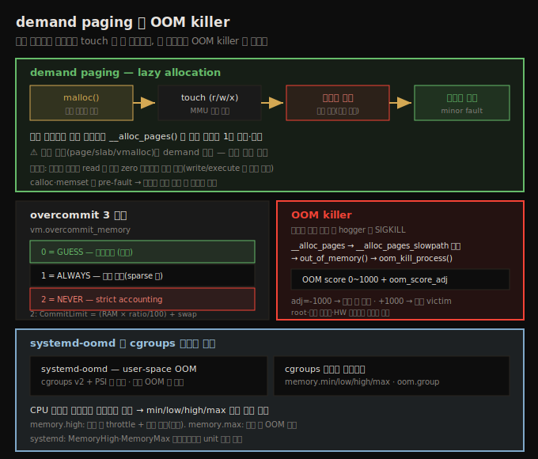
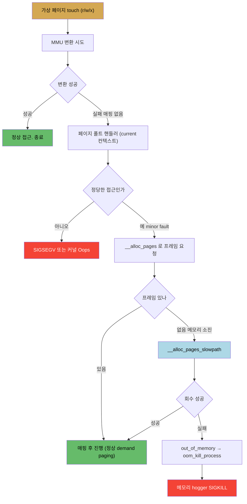

# 메모리 할당 (5) — demand paging과 OOM killer
---
> 유저 공간 `malloc()`은 가상 공간만 예약하고, 물리 프레임은 페이지를 touch(read/write/execute)할 때 **demand paging**으로 할당됩니다. MMU 가 변환에 실패하면 페이지 폴트 핸들러가 `__alloc_pages()`로 프레임을 매핑합니다. 메모리가 완전히 소진되면 `__alloc_pages_slowpath`가 실패하고 **OOM killer**가 호출되어 메모리 hogger 를 `SIGKILL` 합니다. overcommit 정책은 세 가지(0=GUESS 기본·1=ALWAYS·2=NEVER)이며, OOM score(0~1000)에 `oom_score_adj`를 더해 victim 을 고릅니다.

앞 노트(09-02)에서 커널이 memory reclaim 으로 자유 메모리를 유지하려 애쓰는 것을 봤습니다. 그런데 회수가 충분치 않고 메모리 압박이 계속 커져 전체 피라미드(CPU 캐시+RAM+swap)가 소진되면 어떻게 될까요? 대부분 시스템은 이 지점에서 사실상 멈춘 것처럼 느려집니다. 리눅스는 이때 **OOM killer** 를 발동합니다.

이 노트는 그 배경이 되는 demand paging(왜 `malloc` 성공이 물리 할당을 뜻하지 않는가), overcommit 세 정책, 그리고 OOM killer 의 발동·victim 선택(OOM score)·cgroups 메모리 제어를 다룹니다. 아래 종합도가 척추 — demand paging 흐름, overcommit 3정책, OOM killer, systemd-oomd·cgroups — 입니다.




## 1. demand paging — malloc 성공은 물리 할당이 아니다

> 유저 malloc 은 가상 공간만 예약합니다. 물리 프레임은 페이지를 touch 할 때 페이지 폴트를 거쳐 할당됩니다(lazy allocation). 커널 할당(page/slab/vmalloc)은 이와 달리 즉시 물리 할당됩니다.

유저 공간에서 `p = malloc(10000);` 이 성공했다고 해서, 주소 `p` 부터 10,000바이트의 물리 RAM 이 준비된 게 아닙니다. 모던 OS 에서는 사실이 아닙니다(적어도 즉시는).

`malloc()` 이 성공하면 지금까지 일어난 일은 **가상 메모리 영역 예약**뿐입니다 — 물리 메모리는 아직 할당되지 않았습니다. 실제 물리 프레임 할당은 가상 페이지를 **touch**(read/write/execute) 할 때, 페이지 단위로 일어납니다. 이를 **demand paging**(또는 lazy allocation)이라 합니다.

내부 동작입니다. 커널(또는 유저 프로세스)이 가상 주소에 접근하면 CPU 가 그 주소를 MMU 로 보냅니다. CPU 캐시·TLB 히트를 확인하고, TLB 미스면 MMU 가 프로세스 페이징 테이블을 walk 해 물리 주소를 얻습니다(07-01 §3). 그런데 MMU 가 변환에 실패하면(매핑이 없거나 잘못된 주소) — silicon 인 MMU 는 포기하고 OS 의 **페이지 폴트 핸들러**로 제어를 넘깁니다. 핸들러는 `current`(현재 프로세스) 컨텍스트에서 실행됩니다.

`malloc` 의 경우, 핸들러는 이 접근이 정당하다고 판단하면 페이지 할당자에 물리 프레임 1개(order 0)를 요청해 가상 페이지에 매핑합니다(프로세스 페이징 테이블 갱신). 가상 페이지가 *접근될 때 비로소* 물리 할당된 것입니다.

> 중요: 이 demand paging 은 **커널 메모리 할당에는 적용되지 않습니다**. 페이지 할당자·slab·vmalloc 으로 커널 메모리를 할당하면 물리 프레임이 **즉시** 할당됩니다(부팅 시 buddy freelist 가 이미 모든 RAM 을 lowmem 에 매핑해 둬 빠릅니다). 그래서 vmalloc region 주소는 `virt_to_phys()` 로 변환할 수 없지만(direct-map 이 아니라서), 물리 할당 자체는 즉시 이뤄집니다.
>
> 따름정리: `malloc` 후 `memset`(또는 `calloc`)을 하면 각 가상 페이지가 쓰일 때 물리 프레임이 할당됩니다. 실시간 시스템에서는 이를 이용해 시간 임계 코드 진입 전에 프레임을 pre-fault 합니다.


## 2. demand paging 흐름과 OOM 으로의 전개

> 페이지 폴트는 정당하면 minor fault 로 프레임을 할당합니다. 하지만 메모리가 완전히 소진되면 __alloc_pages 가 실패하고 OOM killer 가 호출됩니다.

페이지 폴트 → 프레임 할당 → (소진 시) OOM killer 로 이어지는 흐름입니다.



흐름의 핵심은 H~N 입니다. 페이지 폴트로 `__alloc_pages()`(zoned buddy allocator 의 심장)가 프레임을 찾는데, 극심한 메모리 압박으로 프레임을 못 찾으면 `__alloc_pages_slowpath()` 로 가고, 그것마저 실패하면 `out_of_memory()` → `oom_kill_process()` 가 호출됩니다. 커널 로그의 kernel-mode 스택을 아래에서 위로 읽으면 이 순서가 그대로 드러납니다(`do_page_fault` → `handle_mm_fault` → `__alloc_pages` → `__alloc_pages_slowpath` → `out_of_memory`).

OOM killer 는 "전체 시스템 건강을 위해 희생할 task 를 골라" `SIGKILL` 합니다. 그 자손까지 죽일 수 있습니다.


## 3. overcommit 세 정책

> 리눅스는 메모리를 의도적으로 overcommit 합니다. vm.overcommit_memory 가 0(GUESS·기본·휴리스틱), 1(ALWAYS·항상 허용), 2(NEVER·strict accounting) 세 값을 가집니다.

리눅스는 VM overcommit 정책을 따라 메모리를 어느 정도 의도적으로 over-commit 합니다. `cat /proc/sys/vm/overcommit_memory` 로 봅니다(기본 0).

| 값 | 매크로 | 동작 |
|----|--------|------|
| 0 | `OVERCOMMIT_GUESS` | 휴리스틱 overcommit 허용 (**기본**) |
| 1 | `OVERCOMMIT_ALWAYS` | 항상 overcommit (sparse 메모리 과학 앱용) |
| 2 | `OVERCOMMIT_NEVER` | overcommit 안 함 (strict accounting) |

`mm/util.c:__vm_enough_memory()` 로직을 보면:

1. **`OVERCOMMIT_ALWAYS`(1)**: 그냥 진행시킵니다.
2. **`OVERCOMMIT_GUESS`(0, 기본)**: 요청 페이지가 전체 가용(RAM+swap)보다 많으면 에러, 아니면 진행. 단일 대형 spike 는 실패시키지만, 작은 할당 수만 건은 가능한 한 통과시킵니다. 최악의 경우 OOM killer 가 처리합니다.
3. **`OVERCOMMIT_NEVER`(2)**: CommitLimit 을 넘으면 거부합니다.

값 2 일 때 가용 메모리 공식입니다(`overcommit_ratio` 기본 50).

```
Total allowed = (total_RAM - total_huge_TLB) × (overcommit_ratio / 100) + total_swap
```

`/proc/meminfo` 의 `CommitLimit`(strict accounting 시에만 적용)·`Committed_AS`(현재 할당된 총량)로 확인합니다.

> `__vm_enough_memory()` 는 매 할당마다 호출되는 게 아니라 일부 LSM 이 on-demand 로 부릅니다. 여기선 내부 기제 이해용일 뿐입니다. 또 overcommit 을 2로 끄면 가용 메모리가 급감해 GUI 로그인조차 안 될 수 있으니, 대부분 워크로드에선 기본값이 best 입니다.


## 4. OOM killer 실증 — 두 정책의 차이

> overcommit 0(기본)에서 crazy allocator 는 전체 메모리를 소진해 OOM killer 에게 죽습니다. overcommit 2(strict)에서는 OOM 전에 malloc 자체가 실패합니다.

OOM killer 를 발동시키려면 메모리에 큰 압박을 줍니다. 두 가지 발동 방법입니다.

1. **Magic SysRq**: `sudo sh -c "echo 1 > /proc/sys/kernel/sysrq"` 로 활성화 후 `echo f > /proc/sysrq-trigger` 로 OOM killer 호출(heavyweight 프로세스를 무조건 죽임).
2. **crazy allocator**: 수만 번 `malloc` 하고 절대 free 하지 않는 유저 프로그램으로 압박.

`force_page_fault` 인자로 각 페이지에 1바이트씩 써서 demand paging 을 강제하면 차이가 선명합니다.

**Case 1 — `vm.overcommit_memory == 0`(기본)**: crazy allocator 가 약 3.5GB 가상 메모리(force 시 ~1,758MB 물리)를 할당하다 전체 메모리를 소진해 OOM killer 에게 `Killed` 됩니다.

```
$ dmesg | tail -n1
Out of memory: Killed process 812 (oom_killer_try) total-vm:1791976kB,
  anon-rss:1711176kB, ... oom_score_adj:0
```

**Case 2 — `vm.overcommit_memory == 2`(strict, ratio 50)**: CommitLimit(~1GB)을 기준으로, OOM 이 아니라 **`malloc` 자체가 실패**합니다(약 820MB 에서). strict accounting 이 작동한 것입니다.

```
__vm_enough_memory: pid: 929, comm: oom_killer_try, no enough memory for the allocation
```

820MB 는 1GB 보다 작은데, 코드가 root 프로세스용·예비용 메모리를 남기기 때문입니다.

> **systemd-oomd**: 설정에 따라 커널 OOM killer 가 호출되기 전에 user-space 데몬 `systemd-oomd` 가 먼저 개입할 수 있습니다. cgroups v2 + PSI(Pressure Stall Information, 4.20+) 로 프로세스의 과도한 메모리 사용을 감시해, 한계 초과 프로세스를 죽입니다. Ubuntu 22.04 는 기본 활성, Arch 는 기본 비활성입니다. OOM killer 를 빨리 부르려면 `swapoff -a` 로 swap 을 끄고 페이지를 write/execute 로 touch 해 물리 할당을 강제합니다.


## 5. OOM score 와 victim 선택

> OOM score(0~1000)는 프로세스의 메모리 사용 비중입니다. 여기에 oom_score_adj 를 더해 victim 을 고릅니다. adj=-1000 은 절대 안 죽고, +1000 은 우선 victim 입니다.

victim 을 빨리 찾으려고 커널은 프로세스별 **OOM score** 를 유지합니다(`/proc/<pid>/oom_score`). 범위는 0~1000 입니다.

1. score 0 — 가용 메모리를 전혀 안 씀.
2. score 1000 — 가용 메모리의 100% 사용.

score 가 가장 높은 프로세스가 victim 으로 선택됩니다. 단 커널은 휴리스틱으로 중요한 task 를 보호합니다 — root 소유 프로세스, 커널 스레드, 하드웨어 디바이스를 연 task 는 선택하지 않습니다.

특정 프로세스를 OOM 에서 보호하려면(root 필요) `/proc/<pid>/oom_score_adj`(기본 0)를 조정합니다. 최종 점수는 합입니다.

```
net_oom_score = oom_score + oom_score_adj
```

`oom_score_adj` 를 +1000 으로 하면 거의 확실히 죽고, -1000 으로 하면 절대 victim 이 되지 않습니다. `choom(1)` 유틸로 조회·설정합니다(`choom -p 1` 로 systemd 의 점수 조회).

> 커널 로그의 OOM 진단은 `oom_dump_tasks`(기본 1)로 활성화되어, 살아있는 모든 thread 와 메모리 사용(특히 `rss` — resident set size, 단위 페이지)을 표로 보여 줍니다. 앱 메모리뿐 아니라 `pgtables_bytes`(페이징 테이블 metadata — x86_64 4-level 은 매핑 페이지당 16KB)·`swapents` 도 합산됩니다. 4.6+ 커널은 `oom_reaper` 스레드로 victim 을 reap 하기도 합니다.

**최적화 — 미매핑 read**: 미매핑 페이지를 **read** 하면 다르게 처리됩니다. 커널은 모든 새 read 가상 페이지를 0 으로 채운 **단일 커널 프레임**에 공유 매핑합니다. 천만 페이지를 read 해도 물리 프레임은 1개만 매핑됩니다. 실제 프레임 할당은 write/execute 대상에만 일어납니다. 그래서 sparse(빈) 데이터라면 거대한 가상 메모리를 할당할 수 있습니다(webkit·KASAN 등이 활용).


## 6. cgroups 메모리 제어

> cgroups 메모리 컨트롤러로 프로세스 그룹의 메모리 사용을 제한합니다. CPU 시간은 무한하나 메모리는 유한해 min/low/high/max 여러 한계를 둡니다. memory.high 가 권장, memory.max 초과 시 OOM 이 호출됩니다.

control group(cgroup, v2)은 프로세스 그룹에 자원 제약(CPU/메모리/IO/PID 수 등)을 거는 메커니즘입니다. **메모리 컨트롤러**는 cgroup 안 프로세스들의 합산 메모리 사용을 제한합니다.

CPU 시간 제약과는 성격이 다릅니다 — CPU 시간은 무한하지만 메모리는 그렇지 않아, 여러 한계를 둡니다(`memory.min`/`low`/`high`/`max`).

1. **`memory.high`**: 권장 메커니즘. 초과 시 프로세스를 heavily throttle 하고 메모리를 적극 회수합니다(초과는 불가피하면 허용).
2. **`memory.max`**: 절대 상한. 초과 시 OOM killer 가 호출됩니다.
3. **`memory.oom.group`**(4.19+): 설정 시 cgroup 안 한 프로세스가 OOM 을 트리거하면 그 cgroup 전체를 죽입니다(워크로드 무결성 보장).

systemd 로도 제어합니다 — `MemoryMin`·`MemoryLow`·`MemoryHigh`·`MemoryMax`(바이트/KB/MB/GB 또는 RAM 백분율), swap 은 `MemorySwapMax`. `MemoryHigh` 가 주 제어 수단으로 권장됩니다.

> 내부적으로 5.9 커널부터 새 slab 메모리 컨트롤러(Roman Gushchin 등)가 도입돼, memcg 마다 slab 을 복제해 쓰던 비효율(심각한 slab 낭비)을 해결했습니다. slab 메모리 절감은 데스크톱·서버에서 35~50% 에 달합니다.

OOM killer 에 대한 합리적 결론은 — **애초에 OOM 을 부르는 상황을 만들지 말 것**입니다. Andries Brouwer 의 비유처럼, OOM killer 알고리즘은 연료가 부족한 비행기에서 승객을 던지는 것에 비유됩니다. 프로덕션마다 다르니, 부하 테스트로 최적 overcommit 모드를 찾는 게 정석입니다.


## 자주 받는 오해

1. "`malloc(10000)` 이 성공하면 10,000바이트 물리 RAM 이 준비됐다"고 생각하지만, 가상 공간만 예약됐을 뿐입니다. 물리 프레임은 페이지를 touch 할 때 demand paging 으로 할당됩니다.
2. "demand paging 은 커널 할당에도 적용된다"고 생각하지만, page/slab/vmalloc 같은 커널 할당은 물리 프레임이 즉시 할당됩니다. lazy 한 것은 유저 공간 할당입니다.
3. "overcommit 을 2(NEVER)로 끄면 안전하다"고 생각하지만, 가용 메모리가 급감해 GUI 로그인조차 안 될 수 있습니다. 대부분 워크로드에선 기본값(0)이 best 입니다.
4. "미매핑 페이지를 read 하면 write 처럼 물리 프레임이 할당된다"고 생각하지만, read 는 0 으로 채운 단일 공유 프레임에 매핑됩니다. 실제 프레임 할당은 write/execute 대상에만 일어납니다.


## 면접에서 받을 만한 질문

1. **demand paging 이란?** → 유저 `malloc` 이 성공해도 물리 메모리는 할당되지 않고 가상 공간만 예약됩니다. 가상 페이지를 touch(read/write/execute)할 때 MMU 변환이 실패하면 페이지 폴트가 발생하고, 핸들러가 정당 접근이면 `__alloc_pages()` 로 물리 프레임을 할당·매핑합니다. lazy allocation 이라고도 하며, 커널 할당(page/slab/vmalloc)에는 적용되지 않습니다.
2. **OOM killer 는 언제·어떻게 동작하나요?** → 메모리(CPU 캐시+RAM+swap)가 완전히 소진되어 `__alloc_pages` → `__alloc_pages_slowpath` 가 프레임을 못 찾으면 `out_of_memory()` → `oom_kill_process()` 가 호출되어 메모리 hogger 를 `SIGKILL` 합니다. victim 은 OOM score(0~1000) + `oom_score_adj` 가 가장 높은 프로세스이며, root·커널 스레드·HW 디바이스 보유 task 는 보호됩니다.
3. **overcommit 세 정책의 차이는?** → 0=GUESS(기본·휴리스틱, 단일 대형 요청만 차단하고 작은 요청은 통과), 1=ALWAYS(항상 허용), 2=NEVER(strict accounting, CommitLimit = RAM×ratio/100 + swap 초과 시 malloc 실패). 2로 끄면 가용 메모리가 급감하므로 보통 기본값이 best 입니다.
4. **특정 프로세스를 OOM killer 에서 보호하려면?** → `/proc/<pid>/oom_score_adj` 를 -1000 으로 설정합니다. 최종 점수는 `oom_score + oom_score_adj` 이므로 -1000 은 절대 victim 이 되지 않게 하고, +1000 은 우선 victim 으로 만듭니다. `choom(1)` 유틸로 조회·설정할 수 있습니다.
5. **cgroups 로 메모리를 어떻게 제한하나요?** → 메모리 컨트롤러로 `memory.high`(권장 — 초과 시 throttle + 적극 회수)·`memory.max`(절대 상한 — 초과 시 OOM 호출)를 둡니다. CPU 시간과 달리 메모리는 유한해 min/low/high/max 여러 한계가 있고, `memory.oom.group` 으로 cgroup 전체를 한 단위로 죽일 수도 있습니다. systemd 는 `MemoryHigh`·`MemoryMax` 인터페이스를 제공합니다.


## 관련 문서

- [상위 MOC](../../README.md) — 커널 개발자 관점 리눅스 내부 인덱스
- [09-02. 메모리 할당 (4) — API 선택과 memory reclaim](./09-02.메모리 할당 (4) — API 선택과 memory reclaim.md) — 짝 노트. 회수가 OOM 으로 이어지기 직전까지의 kswapd·watermark
- [07-01. 메모리 관리 (1) — VM split과 주소 변환](./07-01.메모리 관리 (1) — VM split과 주소 변환.md) — MMU 주소 변환과 페이지 폴트의 기반
