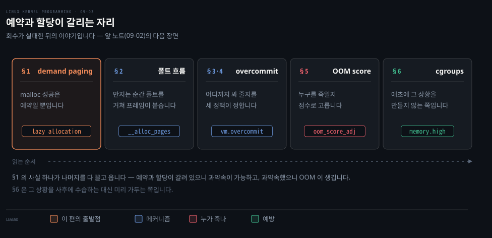
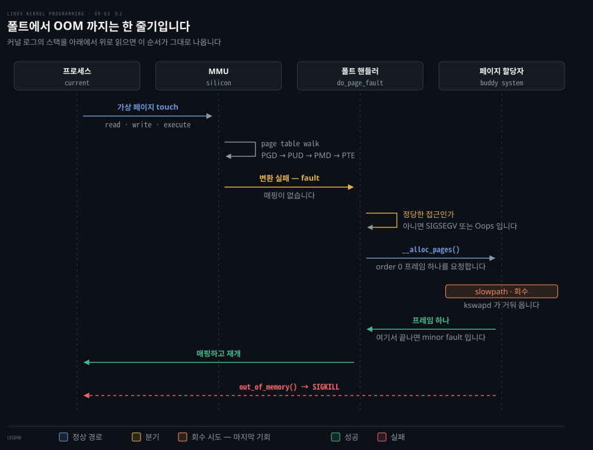
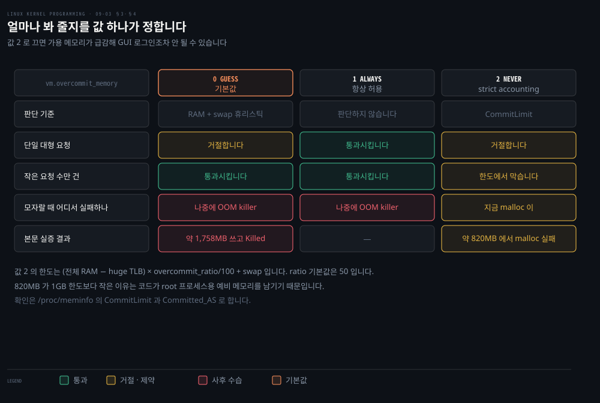
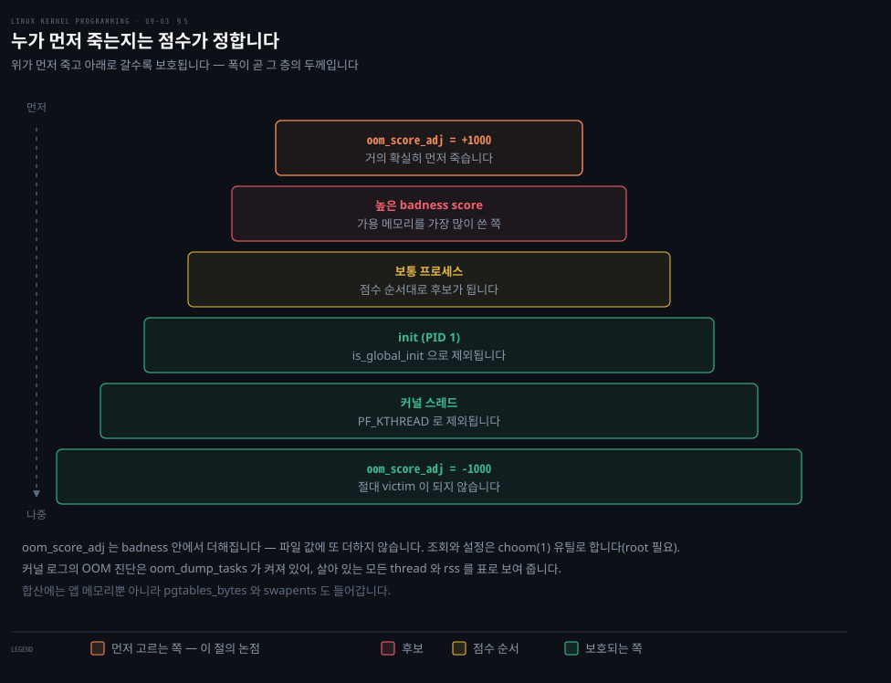
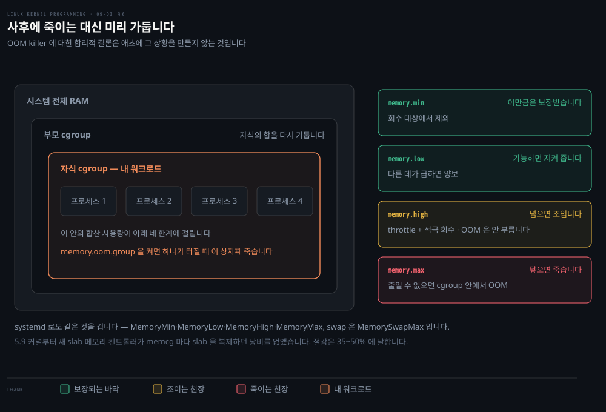

# 메모리 할당 (5) — demand paging과 OOM killer
---
> 유저 공간 `malloc()` 이 성공해도 물리 메모리는 아직 없습니다. 가상 공간을 예약했을 뿐입니다.

물리 프레임은 그 페이지를 touch 할 때, 곧 읽거나 쓰거나 실행할 때 붙습니다. 이것이 **demand paging** 입니다. MMU 가 변환에 실패하면 페이지 폴트 핸들러가 `__alloc_pages()` 로 프레임을 얻어 매핑합니다.

메모리가 완전히 소진되면 `__alloc_pages_slowpath()` 가 실패하고 **OOM killer** 가 호출되어 메모리 hogger 를 `SIGKILL` 합니다. 어디까지 봐 줄지는 overcommit 정책 세 값이 정하고, 누가 죽을지는 OOM score 에 `oom_score_adj` 를 더한 값이 정합니다.

앞 노트(09-02)에서 커널이 memory reclaim 으로 자유 메모리를 유지하려 애쓰는 것을 봤습니다. 회수가 충분치 않고 압박이 계속 커져 전체 피라미드가 소진되면 대부분 시스템은 사실상 멈춘 것처럼 느려집니다. 리눅스는 이때 OOM killer 를 발동합니다.




## 1. demand paging — malloc 성공은 물리 할당이 아니다

> `p = malloc(10000)` 이 성공해도 주소 `p` 부터 10,000바이트의 물리 RAM 이 준비된 것은 아닙니다. 적어도 즉시는 아닙니다.

`malloc()` 이 성공하면 지금까지 일어난 일은 **가상 메모리 영역 예약** 하나뿐입니다. 물리 메모리는 아직 할당되지 않았습니다.

실제 물리 프레임 할당은 가상 페이지를 **touch** 할 때, 곧 읽거나 쓰거나 실행할 때 페이지 단위로 일어납니다. 이를 **demand paging**, 또는 lazy allocation 이라 합니다.

### 내부에서 벌어지는 일

커널이나 유저 프로세스가 가상 주소에 접근하면 CPU 가 그 주소를 MMU 로 보냅니다. CPU 캐시와 TLB 히트를 확인하고, TLB 미스면 MMU 가 프로세스 페이징 테이블을 walk 해 물리 주소를 얻습니다(07-01 §3).

그런데 MMU 가 변환에 실패하면, 곧 매핑이 없거나 잘못된 주소면 어떻게 될까요. silicon 인 MMU 는 거기서 포기하고 OS 의 **페이지 폴트 핸들러** 로 제어를 넘깁니다. 핸들러는 `current`, 곧 현재 프로세스 컨텍스트에서 실행됩니다.

`malloc` 의 경우 핸들러는 이 접근이 정당하다고 판단하면 페이지 할당자에 물리 프레임 하나(order 0)를 요청해 가상 페이지에 매핑합니다. 프로세스 페이징 테이블이 갱신되고, 가상 페이지가 *접근될 때 비로소* 물리 할당된 것입니다.

> 중요한 예외가 있습니다. 이 demand paging 은 **커널 메모리 할당에는 적용되지 않습니다.** 페이지 할당자·slab·vmalloc 으로 커널 메모리를 할당하면 물리 프레임이 **즉시** 할당됩니다. 부팅 시 buddy freelist 가 이미 모든 RAM 을 lowmem 에 매핑해 둬 빠르기 때문입니다. 그래서 vmalloc region 주소는 direct-map 이 아니라 `virt_to_phys()` 로 변환할 수 없지만, 물리 할당 자체는 즉시 이뤄집니다.

여기서 따름정리가 하나 나옵니다. `malloc` 후 `memset` 을 하면(또는 `calloc` 을 쓰면) 각 가상 페이지가 쓰일 때 물리 프레임이 할당됩니다. 실시간 시스템은 이를 이용해 시간 임계 코드에 진입하기 전에 프레임을 pre-fault 합니다.


## 2. demand paging 흐름과 OOM 으로의 전개

> 페이지 폴트에서 시작해 OOM killer 까지는 한 줄기입니다. 중간에 프레임을 얻으면 minor fault 로 끝나고, 끝내 못 얻으면 누군가 죽습니다.



도식의 주황색 자기 호출이 마지막 기회입니다. 거기서도 프레임이 안 나오면 빨간 점선으로 갑니다.

흐름의 핵심은 뒤쪽입니다. 페이지 폴트로 `__alloc_pages()`(zoned buddy allocator 의 심장)가 프레임을 찾는데, 극심한 메모리 압박으로 못 찾으면 `__alloc_pages_slowpath()` 로 갑니다. 그것마저 실패하면 `out_of_memory()` 와 `oom_kill_process()` 가 호출됩니다.

커널 로그의 kernel-mode 스택을 아래에서 위로 읽으면 이 순서가 그대로 드러납니다.

```bash
do_page_fault → handle_mm_fault → __alloc_pages → __alloc_pages_slowpath → out_of_memory
```

OOM killer 는 전체 시스템 건강을 위해 희생할 task 를 골라 `SIGKILL` 합니다. 그 자손까지 죽일 수 있습니다.


## 3. overcommit 세 정책

> 리눅스는 메모리를 어느 정도 의도적으로 over-commit 합니다. 어디까지 봐 줄지를 `vm.overcommit_memory` 값 하나가 정합니다.



도식의 마지막 행이 본문 §4 의 실증 결과입니다. 같은 프로그램이 정책에 따라 다른 자리에서 실패합니다.

`cat /proc/sys/vm/overcommit_memory` 로 현재 값을 봅니다. 기본은 0 입니다.

| 값 | 매크로 | 동작 |
|----|--------|------|
| 0 | `OVERCOMMIT_GUESS` | 휴리스틱 overcommit 허용 (**기본**) |
| 1 | `OVERCOMMIT_ALWAYS` | 항상 overcommit (sparse 메모리 과학 앱용) |
| 2 | `OVERCOMMIT_NEVER` | overcommit 안 함 (strict accounting) |

`mm/util.c` 의 `__vm_enough_memory()` 로직을 보면 이렇습니다.

1. **`OVERCOMMIT_ALWAYS`(1)**: 그냥 진행시킵니다.
2. **`OVERCOMMIT_GUESS`(0, 기본)**: 요청 페이지가 전체 가용(RAM+swap)보다 많으면 에러를 내고, 아니면 진행합니다. 단일 대형 spike 는 실패시키지만 작은 할당 수만 건은 가능한 한 통과시킵니다. 최악의 경우는 OOM killer 가 처리합니다.
3. **`OVERCOMMIT_NEVER`(2)**: CommitLimit 을 넘으면 거부합니다.

값이 2 일 때 가용 메모리 공식입니다. `overcommit_ratio` 기본값은 50 입니다.

```bash
Total allowed = (total_RAM - total_huge_TLB) × (overcommit_ratio / 100) + total_swap
```

확인은 `/proc/meminfo` 의 `CommitLimit`(strict accounting 시에만 적용)과 `Committed_AS`(현재 할당된 총량)로 합니다.

> 이 공식은 **원서가 든 것**입니다. kernel.org v6.1 의 overcommit 문서는 같은 내용을 "swap 에 더해 물리 RAM 의 설정 가능한 비율(기본 50%)" 로만 적고, huge TLB 를 빼는 항은 언급하지 않습니다.[^overcommit] 매크로 이름 `OVERCOMMIT_GUESS`·`ALWAYS`·`NEVER` 도 그 문서가 아니라 커널 소스(`include/linux/mman.h`)에 있습니다.

> `__vm_enough_memory()` 는 매 할당마다 호출되는 게 아니라 일부 LSM 이 on-demand 로 부릅니다. 여기서는 내부 기제를 이해하기 위한 것일 뿐입니다. 또 overcommit 을 2로 끄면 가용 메모리가 급감해 GUI 로그인조차 안 될 수 있으니, 대부분 워크로드에서는 기본값이 best 입니다.


## 4. OOM killer 실증 — 두 정책의 차이

> 같은 crazy allocator 를 두 정책에서 돌리면 실패하는 자리가 다릅니다. 기본값에서는 OOM killer 에게 죽고, strict 에서는 malloc 자체가 실패합니다.

### 발동시키는 두 방법

OOM killer 를 발동시키려면 메모리에 큰 압박을 줍니다.

1. **Magic SysRq**: `sudo sh -c "echo 1 > /proc/sys/kernel/sysrq"` 로 활성화한 뒤 `echo f > /proc/sysrq-trigger` 로 OOM killer 를 호출합니다. heavyweight 프로세스를 무조건 죽입니다.
2. **crazy allocator**: 수만 번 `malloc` 하고 절대 free 하지 않는 유저 프로그램으로 압박합니다.

`force_page_fault` 인자로 각 페이지에 1바이트씩 써서 demand paging 을 강제하면 차이가 선명해집니다.

### Case 1 — vm.overcommit_memory == 0 (기본)

crazy allocator 가 약 3.5GB 가상 메모리를 할당합니다. force 를 주면 물리로 약 1,758MB 를 쓰다가 전체 메모리를 소진해 OOM killer 에게 `Killed` 됩니다.

```bash
dmesg | tail -n1
```

```bash
Out of memory: Killed process 812 (oom_killer_try) total-vm:1791976kB,
  anon-rss:1711176kB, ... oom_score_adj:0
```

### Case 2 — vm.overcommit_memory == 2 (strict, ratio 50)

CommitLimit 이 약 1GB 인 상황에서, OOM 이 아니라 **`malloc` 자체가 실패** 합니다. 약 820MB 에서 멈춥니다. strict accounting 이 작동한 것입니다.

```bash
__vm_enough_memory: pid: 929, comm: oom_killer_try, no enough memory for the allocation
```

820MB 가 1GB 보다 작은 이유는 코드가 root 프로세스용과 예비용 메모리를 남기기 때문입니다.

> **systemd-oomd**: 설정에 따라 커널 OOM killer 가 호출되기 전에 user-space 데몬 `systemd-oomd` 가 먼저 개입할 수 있습니다. cgroups v2 와 PSI(Pressure Stall Information, 4.20+)로 프로세스의 과도한 메모리 사용을 감시해 한계를 넘은 프로세스를 죽입니다. Ubuntu 22.04 는 기본 활성이고 Arch 는 기본 비활성입니다. 커널 OOM killer 를 빨리 부르려면 `swapoff -a` 로 swap 을 끄고 페이지를 write 나 execute 로 touch 해 물리 할당을 강제합니다.


## 5. OOM score 와 victim 선택

> victim 은 무작위가 아닙니다. 커널이 프로세스마다 유지하는 점수와, 사람이 조정할 수 있는 보정값이 정합니다.



도식은 위가 먼저 죽고 아래로 갈수록 보호됩니다. 맨 아래 두 층은 사실상 대상이 아닙니다.

victim 을 빨리 찾으려고 커널은 프로세스별 **OOM score** 를 유지합니다(`/proc/<pid>/oom_score`). 범위는 0 부터 1000 입니다.

- **score 0** — 가용 메모리를 전혀 안 씁니다.
- **score 1000** — 가용 메모리의 100% 를 씁니다.

score 가 가장 높은 프로세스가 victim 으로 선택됩니다. 단 커널은 휴리스틱으로 중요한 task 를 보호합니다. root 소유 프로세스, 커널 스레드, 하드웨어 디바이스를 연 task 는 선택하지 않습니다.

### 보호하거나 먼저 죽이거나

특정 프로세스를 OOM 에서 보호하려면 `/proc/<pid>/oom_score_adj` 를 조정합니다(기본 0, root 권한 필요). 최종 점수는 둘의 합입니다.

```bash
net_oom_score = oom_score + oom_score_adj
```

`oom_score_adj` 를 +1000 으로 하면 거의 확실히 죽고, -1000 으로 하면 절대 victim 이 되지 않습니다. 조회와 설정은 `choom(1)` 유틸로 합니다. `choom -p 1` 로 systemd 의 점수를 볼 수 있습니다.

> 커널 로그의 OOM 진단은 `oom_dump_tasks`(기본 1)로 활성화됩니다. 살아 있는 모든 thread 와 메모리 사용을 표로 보여 주는데, 특히 `rss`(resident set size, 단위는 페이지)가 핵심입니다. 앱 메모리뿐 아니라 `pgtables_bytes` 와 `swapents` 도 합산됩니다. `pgtables_bytes` 는 페이징 테이블 metadata 이고, x86_64 4-level 은 매핑 페이지당 16KB 입니다. 4.6 이상 커널은 `oom_reaper` 스레드로 victim 을 reap 하기도 합니다.

### 최적화 — 미매핑 페이지 read

미매핑 페이지를 **read** 하면 다르게 처리됩니다. 커널은 모든 새 read 가상 페이지를 0 으로 채운 **단일 커널 프레임** 에 공유 매핑합니다.

천만 페이지를 read 해도 물리 프레임은 하나만 매핑된다는 뜻입니다. 실제 프레임 할당은 write 나 execute 대상에만 일어납니다. 그래서 sparse 한 데이터라면 거대한 가상 메모리를 할당할 수 있습니다. webkit 과 KASAN 등이 이를 활용합니다.


## 6. cgroups 메모리 제어

> OOM killer 에 대한 합리적 결론은 애초에 그 상황을 만들지 않는 것입니다. cgroup 은 사후에 죽이는 대신 미리 가둡니다.



도식의 오른쪽 네 한계가 이 절의 본체입니다. 아래로 갈수록 강한 제약입니다.

control group(cgroup, v2)은 프로세스 그룹에 자원 제약을 거는 메커니즘입니다. CPU·메모리·IO·PID 수 등을 제약합니다. 그중 **메모리 컨트롤러** 는 cgroup 안 프로세스들의 합산 메모리 사용을 제한합니다.

CPU 시간 제약과는 성격이 다릅니다. CPU 시간은 무한하지만 메모리는 그렇지 않아 한계가 하나가 아니라 여럿입니다(`memory.min`·`low`·`high`·`max`).

1. **`memory.high`**: 초과하면 프로세스를 heavily throttle 하고 메모리를 적극 회수합니다. 커널 문서는 "high 한계를 넘는 것이 OOM killer 를 부르는 일은 결코 없고, 극단적 상황에서는 한계가 뚫릴 수 있다" 고 적습니다.[^cgroup2]
2. **`memory.max`**: 절대 상한입니다. 사용량이 이 한계에 닿고 줄일 수 없으면 그 cgroup 안에서 OOM killer 가 호출됩니다.
3. **`memory.oom.group`**(4.19+): 설정하면 cgroup 안 한 프로세스가 OOM 을 트리거할 때 그 cgroup 전체를 죽입니다. 워크로드 무결성을 보장하기 위한 것입니다.

systemd 로도 제어합니다. `MemoryMin`·`MemoryLow`·`MemoryHigh`·`MemoryMax` 를 바이트·KB·MB·GB 또는 RAM 백분율로 지정하고, swap 은 `MemorySwapMax` 입니다.

> **어느 것이 주 수단인가에서 두 자료가 갈립니다.** 원서와 systemd 는 `MemoryHigh`(=`memory.high`)를 주 제어 수단으로 권합니다. 반면 커널 cgroup v2 문서는 `memory.max` 를 두고 "cgroup 의 메모리 사용을 제한하는 주 메커니즘" 이라 적습니다.[^cgroup2] 둘을 섞어 새 결론을 만들지 않고 그대로 나란히 둡니다. 실무에서는 죽이지 않고 조이려면 high, 절대 넘기면 안 되는 천장이면 max 로 읽는 편이 안전합니다.

> 내부적으로 5.9 커널부터 새 slab 메모리 컨트롤러가 도입됐습니다(Roman Gushchin 등). memcg 마다 slab 을 복제해 쓰던 비효율을 해결한 것인데, 그 낭비가 심각했습니다. slab 메모리 절감은 데스크톱과 서버에서 35~50% 에 달합니다.

Andries Brouwer 의 비유처럼, OOM killer 알고리즘은 연료가 부족한 비행기에서 승객을 던지는 것에 비유됩니다. 프로덕션마다 사정이 다르니 부하 테스트로 최적 overcommit 모드를 찾는 것이 정석입니다.


## 자주 받는 오해

> 네 오해가 반복됩니다. 전부 "예약과 할당이 같다"는 착각에서 갈라져 나옵니다.

1. "`malloc(10000)` 이 성공하면 10,000바이트 물리 RAM 이 준비됐다"고 생각하지만, 가상 공간만 예약됐을 뿐입니다. 물리 프레임은 페이지를 touch 할 때 demand paging 으로 할당됩니다.
2. "demand paging 은 커널 할당에도 적용된다"고 생각하지만, page·slab·vmalloc 같은 커널 할당은 물리 프레임이 즉시 할당됩니다. lazy 한 것은 유저 공간 할당입니다.
3. "overcommit 을 2(NEVER)로 끄면 안전하다"고 생각하지만, 가용 메모리가 급감해 GUI 로그인조차 안 될 수 있습니다. 대부분 워크로드에서는 기본값 0 이 best 입니다.
4. "미매핑 페이지를 read 하면 write 처럼 물리 프레임이 할당된다"고 생각하지만, read 는 0 으로 채운 단일 공유 프레임에 매핑됩니다. 실제 프레임 할당은 write 나 execute 대상에만 일어납니다.


## 면접에서 받을 만한 질문

1. **demand paging 이란?** → 유저 `malloc` 이 성공해도 물리 메모리는 할당되지 않고 가상 공간만 예약됩니다. 가상 페이지를 touch 할 때 MMU 변환이 실패하면 페이지 폴트가 발생하고, 핸들러가 정당한 접근이면 `__alloc_pages()` 로 물리 프레임을 할당해 매핑합니다. lazy allocation 이라고도 하며, 커널 할당에는 적용되지 않습니다.
2. **OOM killer 는 언제·어떻게 동작하나요?** → 메모리가 완전히 소진되어 `__alloc_pages` 와 `__alloc_pages_slowpath` 가 프레임을 못 찾을 때입니다. 그러면 `out_of_memory()` 와 `oom_kill_process()` 가 호출되어 메모리 hogger 를 `SIGKILL` 합니다. victim 은 OOM score 에 `oom_score_adj` 를 더한 값이 가장 높은 프로세스입니다. root·커널 스레드·HW 디바이스 보유 task 는 보호됩니다.
3. **overcommit 세 정책의 차이는?** → 0 은 GUESS 로 기본값이며 단일 대형 요청만 차단하고 작은 요청은 통과시킵니다. 1 은 ALWAYS 로 항상 허용합니다. 2 는 NEVER 로 strict accounting 이며 CommitLimit 을 넘으면 malloc 이 실패합니다. 2로 끄면 가용 메모리가 급감하므로 보통 기본값이 best 입니다.
4. **특정 프로세스를 OOM killer 에서 보호하려면?** → `/proc/<pid>/oom_score_adj` 를 -1000 으로 설정합니다. 최종 점수가 `oom_score + oom_score_adj` 이므로 -1000 은 절대 victim 이 되지 않게 하고 +1000 은 우선 victim 으로 만듭니다. `choom(1)` 유틸로 조회하고 설정할 수 있습니다.
5. **cgroups 로 메모리를 어떻게 제한하나요?** → 메모리 컨트롤러로 `memory.high` 와 `memory.max` 를 둡니다. `memory.high` 는 권장 수단으로 초과 시 throttle 하고 적극 회수하며, `memory.max` 는 절대 상한으로 초과 시 OOM 을 호출합니다. CPU 시간과 달리 메모리는 유한해 min·low·high·max 여러 한계가 있고, `memory.oom.group` 으로 cgroup 전체를 한 단위로 죽일 수도 있습니다. systemd 는 `MemoryHigh`·`MemoryMax` 인터페이스를 제공합니다.


## 관련 문서

- [상위 MOC](../../README.md) — 커널 개발자 관점 리눅스 내부 인덱스
- [09-02.메모리 할당 (4) — API 선택과 memory reclaim](./09-02.메모리%20할당%20(4)%20—%20API%20선택과%20memory%20reclaim.md) — 짝 노트. 회수가 OOM 으로 이어지기 직전까지의 kswapd·watermark
- [07-01.메모리 관리 (1) — VM split과 주소 변환](./07-01.메모리%20관리%20(1)%20—%20VM%20split과%20주소%20변환.md) — MMU 주소 변환과 페이지 폴트의 기반

[^overcommit]: Linux kernel v6.1 — Overcommit Accounting. <https://www.kernel.org/doc/html/v6.1/mm/overcommit-accounting.html>
[^cgroup2]: Linux kernel — Control Group v2, Memory Interface Files. <https://docs.kernel.org/admin-guide/cgroup-v2.html#memory-interface-files>
