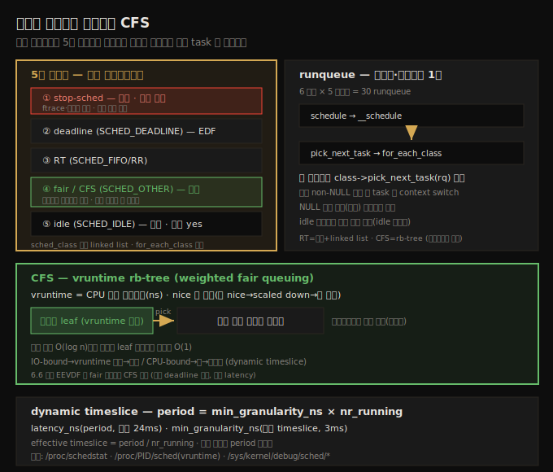
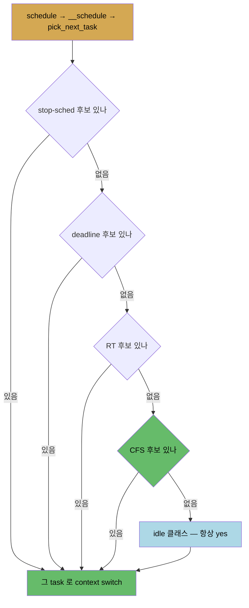

# CPU 스케줄러 (2) — 모듈식 스케줄링 클래스와 CFS
---
> 코어 스케줄러 `__schedule()`은 5개 모듈식 스케줄링 클래스를 우선순위 순으로 순회하며 각 클래스에 `pick_next_task()`를 묻습니다. 클래스는 stop-sched(최고)·deadline·RT(FIFO/RR)·fair(CFS·기본)·idle(최저) 순입니다. runqueue 는 **CPU 코어당·스케줄 클래스당** 하나씩 존재합니다(6코어×5클래스=30 runqueue). CFS 는 `vruntime`(나노초 가상 실행시간, nice 로 가중)을 키로 rb-tree 에 스레드를 정렬하고, 가장 왼쪽 leaf(vruntime 최소)를 다음에 실행합니다. 스케줄링 period 는 `min_granularity_ns × nr_running` 으로 dynamic timeslice 를 계산합니다.

앞 노트(10-01)에서 KSE·상태 머신·POSIX 정책을 봤습니다. 이 노트는 그 정책들이 커널 안에서 어떻게 구현되는지 — 2007년 Ingo Molnar 가 도입한 **모듈식 스케줄링 클래스** 설계와, 그중 가장 많이 쓰이는 **CFS(Completely Fair Scheduling)** — 를 다룹니다.

아래 종합도가 척추 — 5개 클래스, runqueue, CFS vruntime rb-tree, dynamic timeslice 공식 — 입니다.




## 1. 모듈식 스케줄링 클래스 — 우선순위 순 5개

> 코어 스케줄링 코드에 추상화 계층(scheduling class)을 두어, 5개 클래스를 우선순위 순으로 순회합니다. 하나는 반드시 다음에 실행할 스레드를 고르고, 코어는 그 스레드로 context switch 합니다.

2007년(2.6.23), Ingo Molnar 등이 스케줄러 내부를 재설계해 **scheduling class** 접근을 도입했습니다. 코어 스케줄링 코드 `kernel/sched/core.c:schedule()` 에 추상화 계층을 넣은 것으로, 모듈식 설계입니다(여기서 "모듈식"은 in-tree 코드에서 클래스를 추가·제거할 수 있다는 뜻이지 LKM 과 무관합니다).

기본 아이디어는 이렇습니다. 6.1 커널은 5개 스케줄링 클래스를 가지며 각각 우선순위가 있습니다. 코어 스케줄러 `schedule()`(`__schedule()` 의 얇은 래퍼)이 호출되면, 클래스들을 미리 정한 우선순위 순으로 순회하며 "실행할 스레드가 있냐"고 묻습니다. 그중 하나가 반드시 후보를 고르고, 코어는 그 스레드로 context switch 합니다.

| 정책 | 클래스 | sched_class 이름 | 정의 위치 |
|------|--------|------------------|----------|
| — | stop-task / stop-sched (최고) | `stop_sched_class` | `kernel/sched/stop_task.c` |
| `SCHED_DEADLINE` | deadline (EDF) | `dl_sched_class` | `kernel/sched/deadline.c` |
| `SCHED_FIFO`/`SCHED_RR` | RT (real-time) | `rt_sched_class` | `kernel/sched/rt.c` |
| `SCHED_OTHER`(기본) | CFS | `fair_sched_class` | `kernel/sched/fair.c` |
| `SCHED_IDLE` | idle (최저) | `idle_sched_class` | `kernel/sched/idle.c` |

`struct sched_class` 들이 단일 연결 리스트로 묶여, 코어 스케줄링 코드가 순회합니다. 각 스레드의 task 구조 안에는 `struct sched_class *`(속한 클래스 포인터, 배타적, 기본은 CFS)·`policy`(정책)·우선순위 멤버(`prio`·`static_prio`·`normal_prio`·`rt_priority`)가 있습니다.

> stop-sched 스레드는 극단 우선순위라 거의 없습니다 — 한 코어에서 실행되면 다른 모든 코어의 실행·락·인터럽트를 끄고 선점 불가로 혼자 돕니다(ftrace·라이브 패치용). deadline 은 RTOS 식 마감 시한이 있는 task 용입니다. stop-sched·deadline 은 드물어, 실제로는 RT 와 — 대부분 — fair(CFS) 스레드가 살아 돕니다.


## 2. 코어 스케줄러의 클래스 순회 — pick_next_task

> 스케줄 시 호출 시퀀스는 schedule() → __schedule() → pick_next_task() 입니다. for_each_class 로 클래스를 순회하며 class->pick_next_task(rq) 를 호출하고, non-NULL 을 반환하는 첫 클래스의 task 로 switch 합니다.

스케줄이 필요하면 호출 시퀀스는 `schedule()` → `__schedule()` → `pick_next_task()` 입니다. 실제 순회는 여기서 일어납니다.

```c
static inline struct task_struct *
__pick_next_task(struct rq *rq, struct task_struct *prev, struct rq_flags *rf)
{
    const struct sched_class *class;
    struct task_struct *p;
    [ ... ]
    for_each_class(class) {
        p = class->pick_next_task(rq);
        if (p)
            return p;
    }
    BUG(); /* idle class 는 항상 runnable task 를 가져야 함 */
}
```

`for_each_class()` 매크로는 `__sched_class_highest` 부터 `__sched_class_lowest` 까지 순회합니다. 각 클래스에 `class->pick_next_task()` "메서드"로 누구를 다음에 스케줄할지 묻고, 클래스는 자신의 runqueue 를 보고 후보를 결정합니다.

객체지향이 작동합니다 — `class->pick_next_task(rq)` 는 사실상 클래스의 메서드 호출이며, 반환값은 고른 task 의 구조 포인터입니다. NULL 이면 그 클래스에 후보가 없다는 뜻이라 다음 클래스로 갑니다. idle 클래스는 항상 non-NULL(idle 스레드)을 반환하므로 루프는 반드시 종료됩니다.



보통 중간 부하의 시스템에서는 stop-sched·deadline·RT 후보가 없고 fair(CFS) 후보가 적어도 하나는 있어, 경쟁은 대개 **CFS runnable 스레드 사이**에서 일어납니다. 정말 아무도 없으면 시스템이 idle 이고, idle 스레드(`swapper/n`, n 은 코어 번호)로 switch 합니다. swapper 는 옛 Unix 잔재일 뿐이며 `ps` 에 안 보입니다.


## 3. runqueue — 코어당·클래스당 1개

> 커널은 CPU 코어마다, 그리고 스케줄 클래스마다 runqueue 를 하나씩 유지합니다. 6코어×5클래스이면 30 runqueue 입니다. 실제 자료구조는 클래스마다 다릅니다.

핵심 포인트입니다 — 커널은 **모든 프로세서 코어마다, 그리고 모든 스케줄 클래스마다** runqueue 를 하나씩 유지합니다. 6코어 시스템이면 6코어 × 5클래스 = **30 runqueue** 입니다(예외: UP 시스템엔 stop-sched 가 없음).

runqueue 는 클래스별로 구현됩니다 — CFS 는 `struct cfs_rq`, RT 는 `struct rt_rq` 등입니다. 실제 자료구조는 클래스마다 다릅니다 — RT 는 (우선순위별) linked list 배열, fair 는 red-black(rb) tree 입니다.

`sched_class` 구조는 모든 가능한 연산과 hook 을 담습니다.

```c
struct sched_class {
    void (*enqueue_task)(struct rq *rq, struct task_struct *p, int flags);
    void (*dequeue_task)(struct rq *rq, struct task_struct *p, int flags);
    struct task_struct *(*pick_next_task)(struct rq *rq);
    void (*task_tick)(struct rq *rq, struct task_struct *p, int queued);
    void (*task_fork)(struct task_struct *p);
    [ ... ]
};
```

각 클래스는 이 구조를 인스턴스화해 메서드(함수 포인터)로 채웁니다. fair 클래스의 예입니다(5.11 부터 `DEFINE_SCHED_CLASS()` 매크로 사용).

```c
DEFINE_SCHED_CLASS(fair) = {
    .enqueue_task   = enqueue_task_fair,
    .dequeue_task   = dequeue_task_fair,
    .pick_next_task = __pick_next_task_fair,
    .task_tick      = task_tick_fair,
    .task_fork      = task_fork_fair,
    [ ... ]
};
```

`task_tick`·`task_fork` 는 hook 의 예로, 매 timer tick(`CONFIG_HZ` 회/초)마다, 그리고 이 클래스의 스레드가 fork 할 때 각각 코어 스케줄러가 호출합니다.


## 4. CFS — vruntime 과 rb-tree runqueue

> CFS 는 모든 runnable 스레드의 실제 CPU 실행시간을 추적해, 가장 적게 실행한 스레드에 다음 CPU 를 줍니다. vruntime(nice 로 가중한 가상 실행시간)을 키로 rb-tree 에 정렬하고, 최좌측 leaf 를 고릅니다.

2007년 이래 CFS 는 일반 스레드의 사실상 표준 스케줄링 코드입니다(대부분 스레드가 SCHED_OTHER). 동기는 공정성과 throughput 입니다.

구현은 간단합니다 — 커널은 모든 runnable CFS 스레드의 실제 CPU 실행시간(나노초 granularity)을 추적해, 실행시간이 가장 작은 스레드가 가장 실행될 자격이 있다고 보아 다음 epoch 에 CPU 를 줍니다. 반대로 CPU 를 계속 두드리는 스레드는 큰 실행시간을 쌓아 페널티를 받습니다.

task 구조 안 `struct sched_entity` 에 64비트 `vruntime`(virtual runtime)이 있습니다 — 스레드가 프로세서에서 누적한 나노초 시간의 monotonic 카운터입니다. CFS 는 모든 runnable task 를 **rb-tree**(self-balancing 이진 탐색 트리)에 enqueue 하되, 프로세서에서 가장 적게 보낸 task 가 최좌측 leaf node 가 되도록 합니다. 트리를 좌→우 스캔하면 미래 실행 타임라인이 됩니다.

왜 그냥 runtime 이 아니라 **v**runtime 일까요? `vruntime` 은 단순 실행시간이 아니라 스레드의 nice(우선순위)를 반영하기 때문입니다 — nice 가 낮을수록(우선순위 높을수록) vruntime 을 scaled down 해 더 왼쪽에, nice 가 높을수록 scaled up 해 더 오른쪽에 enqueue 합니다(weighted fair queuing).

코어가 CFS 에 "실행할 스레드 있냐"고 물으면 `pick_next_task_fair()` 가 **최좌측 leaf node**(vruntime 최소 = 가장 적게 실행한 스레드)를 골라 반환합니다. 트리 순회는 O(log n)이지만 최좌측 leaf 를 캐싱해 사실상 O(1)입니다.

> 실제 구현엔 많은 tweak·검사가 있습니다. 자주 커널은 vruntime 을 0 으로 리셋해 새 epoch 를 트리거합니다. `/proc/sys/kernel/sched_*`(과 최근 `/sys/kernel/debug/sched/*`)에 스케줄러를 fine-tune 하는 tunable 이 있습니다.


## 5. CFS 스케줄링 period 와 dynamic timeslice

> CFS 의 timeslice 는 dynamic 합니다. period = min_granularity_ns × nr_running 으로 계산하며, runnable 스레드가 많아져 effective timeslice 가 최소 granularity 보다 작아지면 period 를 재계산합니다.

전통 스케줄러와 달리 CFS 의 timeslice 는 dynamic 합니다. IO-bound task 는 vruntime 을 적게 쌓아 트리 왼쪽으로, CPU-bound 는 많이 쌓아 오른쪽으로 가 CPU 획득 기회가 줄어듭니다.

**스케줄링 period**(scheduling latency)는 완전한 스케줄 cycle(epoch)이 도는 시간으로, 이 안에 모든 스레드가 CPU 기회를 한 번은 받도록 보장됩니다. `/sys/kernel/debug/sched/latency_ns`(Ubuntu 22.04 기본 24ms, Fedora 18ms)에 있고, 런타임에 dynamic 하게 계산됩니다.

```
스케줄링 period = min_granularity_ns × nr_running
```

`nr_running` 은 현재 runnable task 수(runqueue 단위)입니다. 주요 tunable(debugfs)입니다.

| tunable | 의미 (기본) |
|---------|------------|
| `latency_ns` | 현재 계산된 period (24,000,000ns = 24ms) — 각 스레드가 최소 24ms 마다 한 번은 실행 보장 |
| `min_granularity_ns` | CFS rb-tree 노드 간 최소 "거리" = CFS 스레드 최소 timeslice (3ms) |

effective timeslice = period / nr_running 입니다. 단 이것이 `min_granularity_ns` 보다 작아지면 untenable 해집니다.

| runnable 수 | effective timeslice (24/n) | period (3×n) |
|------------|---------------------------|--------------|
| 3 | 8ms (OK) | 9ms |
| 6 | 4ms (OK) | 18ms |
| 8 | 3ms (최소 허용) | 24ms |
| 12 | 2ms (untenable) → period 재계산 | 36ms |

runnable 수가 충분히 커지면(마지막 행) 스케줄러는 포기하지 않고 **period 를 dynamic 하게 재계산**합니다. 의사코드입니다.

```
if nr_running > (latency_ns / min_granularity_ns)
    스케줄링 period 재계산
```

스케줄링 통계는 `CONFIG_SCHEDSTATS=y` 시 `/proc/schedstat`(시스템 전역)·`/proc/PID/schedstat`(CPU 시간·runqueue 대기·timeslice 수)·`/proc/PID/sched`(`se.vruntime` 포함 상세)에 노출됩니다.

> 6.6 커널(2023.10)부터 **EEVDF**(Earliest Eligible Virtual Deadline First)가 fair 클래스에서 CFS 를 대체합니다(Peter Zijlstra 등). 접근은 CFS 와 비슷(가상 시간 기반 weighted fair queuing)하나, 일부 스레드의 tight latency 요구를 다루고(짧게 더 자주 실행), CFS 의 여러 heuristic 을 제거한 깔끔한 구현입니다. 이 노트는 6.1 (S)LTS 기준이라 CFS 를 다룹니다.


## 자주 받는 오해

1. "스케줄링 클래스의 모듈식은 LKM(모듈)과 관련 있다"고 생각하지만, 무관합니다. in-tree 코드에서 클래스를 추가·제거할 수 있다는 설계적 의미일 뿐입니다.
2. "runqueue 는 코어당 1개"라고 생각하지만, **코어당·클래스당 1개**입니다. 6코어 5클래스면 30개입니다(UP 는 stop-sched 제외).
3. "vruntime 은 그냥 실행시간"이라고 생각하지만, nice 로 가중한 가상 시간입니다. 낮은 nice 는 scaled down 되어 트리 왼쪽에 enqueue 되어 더 자주 실행됩니다(weighted fair queuing).
4. "CFS timeslice 는 고정"이라고 생각하지만, dynamic 합니다. period = min_granularity_ns × nr_running 으로 계산하고, runnable 이 많아 effective timeslice 가 최소 granularity 미만이 되면 period 를 재계산합니다.


## 면접에서 받을 만한 질문

1. **모듈식 스케줄링 클래스는 어떻게 동작하나요?** → 코어 스케줄러 `__schedule()` → `pick_next_task()` 가 `for_each_class` 로 5개 클래스를 우선순위 순(stop-sched → deadline → RT → CFS → idle)으로 순회하며 `class->pick_next_task(rq)` 를 호출합니다. non-NULL 을 반환하는 첫 클래스의 task 로 context switch 하고, idle 클래스는 항상 후보를 반환하므로 루프는 반드시 종료됩니다.
2. **runqueue 는 몇 개인가요?** → CPU 코어당·스케줄 클래스당 하나씩이라, 6코어 5클래스면 30개입니다. 자료구조는 클래스마다 다른데, RT 는 우선순위별 linked list 배열, CFS 는 red-black tree 입니다.
3. **CFS 는 다음 task 를 어떻게 고르나요?** → 모든 runnable CFS 스레드의 `vruntime`(nice 로 가중한 나노초 가상 실행시간)을 키로 rb-tree 에 정렬해, 최좌측 leaf(vruntime 최소 = 가장 적게 실행한 스레드)를 고릅니다. 최좌측 leaf 를 캐싱하므로 사실상 O(1)입니다.
4. **CFS 의 timeslice 는 어떻게 결정되나요?** → dynamic 합니다. 스케줄링 period = `min_granularity_ns × nr_running`(또는 `latency_ns`)이고, effective timeslice = period / nr_running 입니다. 이것이 `min_granularity_ns`(기본 3ms)보다 작아지면 period 를 재계산해 각 스레드가 최소 한 번은 실행되도록 보장합니다.
5. **CFS 와 EEVDF 의 관계는?** → EEVDF 는 6.6 커널부터 fair 클래스에서 CFS 를 대체한 새 스케줄러입니다. 둘 다 가상 시간 기반 weighted fair queuing 이지만, EEVDF 는 tight latency 요구를 다루고(짧게 더 자주 실행) CFS 의 여러 heuristic 을 제거한 깔끔한 구현입니다.


## 관련 문서

- [상위 MOC](../../README.md) — 커널 개발자 관점 리눅스 내부 인덱스
- [10-01. CPU 스케줄러 (1) — 스케줄링 기초와 흐름 시각화](./10-01.CPU 스케줄러 (1) — 스케줄링 기초와 흐름 시각화.md) — KSE·상태 머신·POSIX 정책·우선순위
- [10-03. CPU 스케줄러 (3) — 정책 질의와 선점·스케줄러 진입점](./10-03.CPU 스케줄러 (3) — 정책 질의와 선점·스케줄러 진입점.md) — chrt·preemptible kernel·TIF_NEED_RESCHED·context switch
