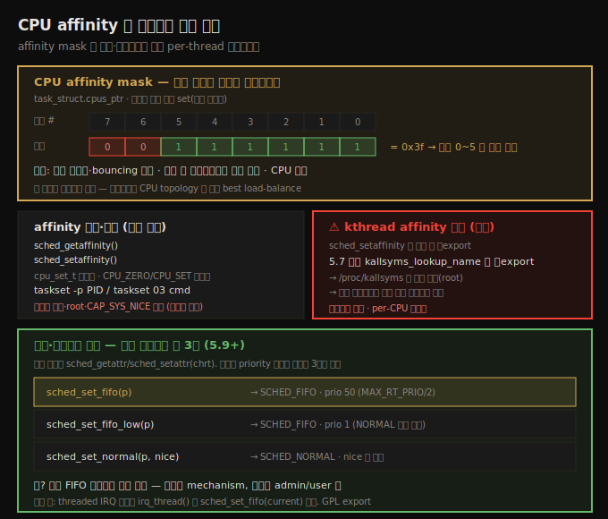
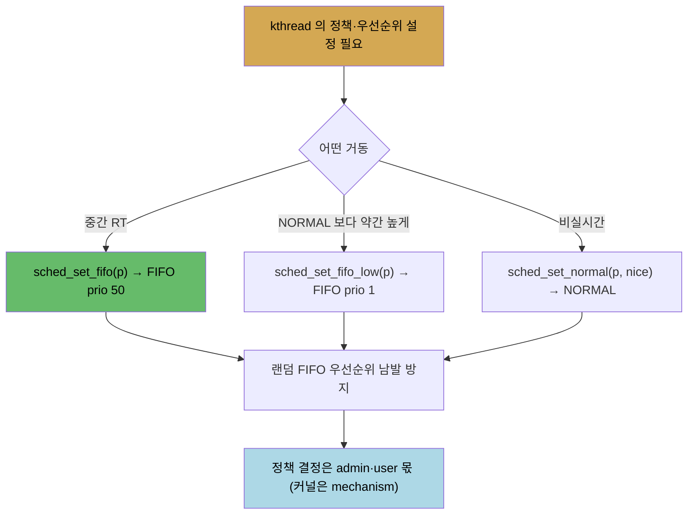

# CPU 스케줄러 (4) — CPU affinity와 정책·우선순위 설정
---
> **CPU affinity mask** 는 스레드가 실행될 수 있는 코어를 나타내는 per-thread 비트마스크입니다(`task_struct` 의 `cpus_ptr`). 기본은 모든 비트가 set 되어 어느 코어든 실행 가능합니다. 유저 공간은 `sched_getaffinity`/`sched_setaffinity` 시스템콜과 `taskset` 으로 질의·설정하며, 설정에는 `CAP_SYS_NICE` 가 필요합니다. **정책·우선순위** 설정은 유저 공간에서 `sched_getattr`/`sched_setattr`(`chrt`)로 하고, 커널 안에서는 5.9 부터 `sched_set_fifo`(prio 50)·`sched_set_fifo_low`(prio 1)·`sched_set_normal`(nice) 세 가지만 씁니다. threaded IRQ 핸들러가 `sched_set_fifo` 로 prio 50 FIFO kthread 를 만드는 실제 예입니다.

앞 세 노트(10-01~03)에서 스케줄링의 구조와 내부를 봤습니다. 이 노트는 그것을 *프로그래밍으로 다루는* 두 축 — (1) 스레드의 CPU affinity mask 를 질의·설정하는 법, (2) 스레드의 스케줄링 정책·우선순위를 설정하는 법(유저 공간과 커널 안 모두) — 을 다룹니다.

아래 종합도가 척추 — affinity mask, 질의·설정 API, kthread affinity 해킹, 커널 안 정책 설정 3 API — 입니다.




## 1. CPU affinity mask — per-thread 코어 비트마스크

> affinity mask 는 스레드가 실행될 수 있는 코어를 나타내는 per-thread 비트마스크입니다. 기본은 모든 비트가 set 되어 어느 코어든 실행 가능합니다.

task 구조에는 스케줄링 관련 멤버가 여럿 있습니다 — 우선순위(nice·RT prio), scheduling class 포인터, 올라간 runqueue, 그리고 **CPU affinity bitmask**(`cpumask_t *cpus_ptr`. 5.3 이전엔 `cpus_allowed` 였습니다)입니다. 이 비트마스크는 그 스레드가 실행되도록 허용된 CPU 코어를 나타냅니다.

8코어 시스템의 affinity bitmask 를 개념적으로 봅니다. 각 비트가 한 코어를 나타내고, 1 이면 그 코어에서 실행 가능, 0 이면 불가입니다.

| 코어 # | 7 | 6 | 5 | 4 | 3 | 2 | 1 | 0 |
|--------|---|---|---|---|---|---|---|---|
| 비트 | 0 | 0 | 1 | 1 | 1 | 1 | 1 | 1 |

위 값은 `0x3f`(`0011 1111`)로, 이 스레드는 코어 0~5 에서 실행 가능하지만 코어 6·7 에서는 안 됩니다. 기본은 모든 비트가 set 이라(8코어면 `0xff`), 어느 코어든 실행할 수 있습니다 — 합리적입니다.

affinity bitmask 가 task 구조 멤버이므로 **per-thread** 양입니다(KSE 가 스레드이니 당연합니다). 런타임에 실제 어느 코어에서 돌지는 스케줄러가 정합니다 — 설계상 각 코어에 runqueue 가 있고, runnable 스레드는 하나의 runqueue 에 올라 기본적으로 그 코어에서 돕니다. load balancer 가 필요 시 다른 코어로 마이그레이션합니다(`migration/n` kthread 가 보조).

affinity mask 를 명시적으로 설정하면 이점이 있습니다.

1. 스레드를 같은 코어에 고정해 잦은 캐시 무효화·cache "bouncing" 을 줄입니다.
2. 코어 간 마이그레이션 비용을 제거합니다.
3. **CPU 예약** — 한 코어를 한 스레드에 전용으로 주고 다른 스레드를 명시적으로 금지합니다(time-critical 시스템에서).

> 단 권고는 affinity 를 건드리지 않는 것입니다 — 스케줄러 서브시스템이 CPU topology(domain)를 상세히 알아 best load-balance 하기 때문입니다. 1·2 는 코너 케이스에, 3 은 일부 real-time 시스템에 유용합니다(예전엔 `isolcpus=` 였으나 deprecated → cpuset cgroup 권장).


## 2. affinity 질의·설정 — sched_{g,s}etaffinity 와 taskset

> 유저 공간은 sched_getaffinity/sched_setaffinity 시스템콜과 taskset 유틸로 affinity 를 질의·설정합니다. 질의는 누구나 가능하지만, 설정에는 소유·root·CAP_SYS_NICE 가 필요합니다.

```c
#define _GNU_SOURCE
#include <sched.h>
int sched_getaffinity(pid_t pid, size_t cpusetsize, cpu_set_t *mask);
int sched_setaffinity(pid_t pid, size_t cpusetsize, const cpu_set_t *mask);
```

`cpu_set_t` 라는 전용 타입이 affinity bitmask 를 나타냅니다 — 코어 수에 따라 크기가 동적 할당됩니다. 먼저 `CPU_ZERO()` 로 0 초기화하고, `CPU_SET(i, &mask)` 로 비트를 set 합니다(`CPU_SET(3)` man 참조). 두 번째 인자는 set 크기(`sizeof`), 첫 인자는 질의·설정할 프로세스/스레드의 PID 입니다.

질의 코드입니다.

```c
static int query_cpu_affinity(pid_t pid)
{
    cpu_set_t cpumask;
    CPU_ZERO(&cpumask);
    if (sched_getaffinity(pid, sizeof(cpu_set_t), &cpumask) < 0) {
        perror("sched_getaffinity() failed"); return -1;
    }
    disp_cpumask(pid, &cpumask, numcores);
    return 0;
}
```

설정 코드는 주어진 bitmask 를 순회하며 `cpu_set_t` 를 채운 뒤 `sched_setaffinity()` 를 호출합니다(`(bitmask >> i) & 1` 로 i 번째 비트 테스트).

```c
for (i=0; i<sizeof(unsigned long)*8; i++)
    if ((bitmask >> i) & 1)
        CPU_SET(i, &cpumask);
if (sched_setaffinity(pid, sizeof(cpu_set_t), &cpumask) < 0) { ... }
```

> 누구나 임의 task 의 affinity 를 **질의**할 수 있지만, **설정**하려면 task 를 소유하거나 root 이거나 `CAP_SYS_NICE` capability 가 있어야 합니다.

명령행에서는 `taskset` 으로 합니다(`chrt` 가 정책·우선순위에 하는 일과 유사).

```
$ taskset -p 1                 # systemd 의 affinity 질의
pid 1's current affinity mask: 3f
$ taskset 03 gcc foo.c         # gcc(와 후손 as·ld)를 코어 0,1 에만 (03 = 0011)
```


## 3. kthread 에 affinity 설정 — 비export 심볼 해킹

> 커널 안에서 affinity 를 설정하려면 sched_setaffinity 가 필요한데 미export 입니다. 5.7 부터 kallsyms_lookup_name 마저 미export 되어, /proc/kallsyms 로 주소를 조회해 함수 포인터로 호출하는 해킹을 씁니다(프로덕션 금지).

per-CPU 변수 같은 동기화 기법을 시연하려면 두 kthread 를 만들어 각각 다른 코어에서 돌게 보장해야 합니다(13장 주제). 그러려면 각 kthread 의 affinity mask 를 명시적으로 다르게 설정해야 하는데, 문제가 있습니다.

커널 내 `sched_setaffinity()` API 는 존재하지만 **export 되지 않습니다**. out-of-tree 모듈은 export 된 함수만 쓸 수 있습니다. 오랫동안 모듈 개발자는 `kallsyms_lookup_name()` 으로 임의 심볼의 주소를 얻어 함수 포인터로 호출하는 우회법을 썼습니다. 하지만 5.7 부터 커뮤니티가 이 남용을 막아 `kallsyms_lookup_name()` 도 unexport 했습니다(commit `0bd476e6c671`).

이제는 root 권한으로 `/proc/kallsyms` 에서 심볼 주소를 조회합니다(KASLR 때문에 부팅마다 값이 바뀌어 하드코딩 불가 — 보안상 좋음). 작은 래퍼 스크립트로 주소를 조회해 모듈 파라미터로 넘기고, 모듈은 그것을 함수 포인터로 취급해 호출합니다.

```c
static unsigned long func_ptr;
module_param(func_ptr, ulong, 0);
unsigned long (*schedsa_ptr)(pid_t, const struct cpumask *) = NULL;
[ … ]
schedsa_ptr = (unsigned long (*)(pid_t, const struct cpumask *))func_ptr;
cpumask_clear(&mask);
cpumask_set_cpu(cpu, &mask);     // 첫 인자는 CPU 번호(비트마스크 아님)
ret = (*schedsa_ptr)(0, &mask);  // 0 => self · 함수 포인터로 호출
```

> 동작은 하지만 프로덕션에서는 이런 해킹을 피해야 합니다. 데모·학습용입니다.


## 4. 정책·우선순위 설정 — 커널 안에서는 단 3개 (5.9+)

> 유저 공간은 sched_getattr/sched_setattr(chrt)로 정책·우선순위를 설정합니다. 커널 안에서는 5.9 부터 priority 노출을 없애고 sched_set_fifo·sched_set_fifo_low·sched_set_normal 세 가지만 남겼습니다.

유저 공간에서는 `sched_getattr()`/`sched_setattr()`(`chrt` 가 내부적으로 사용) 또는 `sched_{g,s}etscheduler()` 와 pthread 래퍼로 정책·우선순위를 설정합니다(`struct sched_attr` 에 모든 정보).

커널 kthread 도 KSE 라 정책·우선순위를 설정할 수 있습니다. 그런데 커널 커뮤니티는 옛 설계 — 모듈 개발자가 `SCHED_FIFO` 와 임의 우선순위를 마음대로 쓰는 것 — 가 근본적으로 깨졌다고 봅니다. 같은 우선순위의 FIFO 스레드 둘, "랜덤" 우선순위 값 선택이 스케줄링에 혼란을 일으키기 때문입니다.

그래서 5.9 부터 모듈에서 `sched_setscheduler()`/`sched_setattr()` 를 빼고 세 가지로 대체했습니다(commit `7318d4cc14c8`).

| API | 동작 |
|-----|------|
| `sched_set_fifo(p)` | `SCHED_FIFO` · prio 50(`MAX_RT_PRIO/2`) — `sched_setscheduler_nocheck()` 래퍼 |
| `sched_set_fifo_low(p)` | `SCHED_FIFO` · prio 1(NORMAL 보다 높음) — 동일 래퍼 |
| `sched_set_normal(p, nice)` | `SCHED_NORMAL`(=SCHED_OTHER, 비실시간·CFS) · nice 값 — `sched_setattr_nocheck()` 래퍼 |



`*_nocheck()` 는 권한 검사조차 하지 않는다는 뜻입니다. 세 API 는 GPL export 되어 GPL 모듈만 씁니다. 왜 이렇게? 의미 없는 랜덤 FIFO 우선순위 남발을 막기 위해서이며, 정책 결정은 시스템을 아는 admin·user 가 합니다(provide mechanism, not policy 원칙).


## 5. 실제 예 — threaded IRQ 핸들러

> 커널은 threaded interrupt 를 위해 SCHED_FIFO·prio 50 의 전용 kthread 를 만듭니다. irq_thread() 가 sched_set_fifo(current) 를 호출하는 것이 그 예입니다.

커널이 kthread 를 쓰는 대표 예가 threaded interrupt 입니다(요즘 대부분 드라이버가 threaded 핸들러를 씁니다). 커널은 `SCHED_FIFO`·prio 50 의 전용 kthread 를 만들어 threaded interrupt 를 처리합니다.

```c
static int setup_irq_thread(struct irqaction *new, unsigned int irq, bool secondary)
{
    struct task_struct *t;
    if (!secondary)
        t = kthread_create(irq_thread, new, "irq/%d-%s", irq, new->name);
    [ … ]
}
```

`kthread_create()` 가 kthread 를 만들고, thread 함수 `irq_thread()` 가 코드 경로에서 정책·우선순위를 설정합니다.

```c
static int irq_thread(void *data)
{
    [ ... ]
    sched_set_fifo(current);    // 자신을 FIFO prio 50 으로
    [ ... ]
}
```

`sched_set_fifo(current)` 가 호출하는 kthread(`current`)를 `SCHED_FIFO`·prio 50 으로 설정합니다.


## 자주 받는 오해

1. "affinity mask 는 프로세스 단위"라고 생각하지만, `task_struct` 멤버라 **per-thread** 입니다. 멀티스레드 프로세스의 각 스레드는 서로 다른 affinity 를 가질 수 있습니다.
2. "affinity 를 명시 설정하면 항상 성능이 좋아진다"고 생각하지만, 권고는 건드리지 않는 것입니다. 스케줄러가 CPU topology 를 알아 best load-balance 하기 때문이고, 명시 설정은 캐시 고정·CPU 예약 같은 코너 케이스에서만 이득입니다.
3. "커널 모듈에서 `sched_setattr()` 로 임의 RT 우선순위를 설정한다"고 생각하지만, 5.9 부터 모듈에서는 `sched_set_fifo`(prio 50)·`sched_set_fifo_low`(prio 1)·`sched_set_normal`(nice) 세 가지만 씁니다. 랜덤 우선순위 남발을 막기 위해서입니다.
4. "누구나 affinity 를 설정할 수 있다"고 생각하지만, 질의는 자유지만 설정은 task 소유·root·`CAP_SYS_NICE` 중 하나가 필요합니다.


## 면접에서 받을 만한 질문

1. **CPU affinity mask 란?** → 스레드가 실행될 수 있는 코어를 나타내는 per-thread 비트마스크입니다(`task_struct.cpus_ptr`). 비트 1 이면 그 코어에서 실행 가능합니다. 기본은 모든 비트 set 이라 어느 코어든 실행하며, 명시 설정으로 캐시 고정·마이그레이션 비용 제거·CPU 예약을 할 수 있지만 보통은 스케줄러에 맡기는 게 권장됩니다.
2. **affinity 를 어떻게 질의·설정하나요?** → 유저 공간은 `sched_getaffinity`/`sched_setaffinity` 시스템콜(`cpu_set_t` + `CPU_ZERO`/`CPU_SET` 매크로)과 `taskset` 유틸을 씁니다. 질의는 누구나 가능하지만 설정은 task 소유·root·`CAP_SYS_NICE` 중 하나가 필요합니다.
3. **커널 모듈에서 kthread 의 정책·우선순위를 어떻게 설정하나요?** → 5.9 부터 `sched_set_fifo(p)`(FIFO prio 50)·`sched_set_fifo_low(p)`(FIFO prio 1)·`sched_set_normal(p, nice)`(NORMAL) 세 GPL export API 만 씁니다. 임의 RT 우선순위 노출을 없애 랜덤·무의미한 FIFO 우선순위 남발을 막은 것입니다.
4. **threaded IRQ 핸들러는 어떤 정책으로 도나요?** → `SCHED_FIFO`·prio 50 입니다. `setup_irq_thread()` 가 `kthread_create(irq_thread, ...)` 로 kthread 를 만들고, `irq_thread()` 가 `sched_set_fifo(current)` 를 호출해 자신을 그 정책·우선순위로 설정합니다.
5. **커널 모듈에서 비export 함수(`sched_setaffinity`)를 어떻게 호출하나요?** → 정공법은 없고 해킹을 씁니다. 5.7 이전엔 `kallsyms_lookup_name()` 으로 주소를 얻었으나 이제 미export 라, root 로 `/proc/kallsyms` 에서 주소를 조회(KASLR 로 부팅마다 바뀜)해 모듈 파라미터로 넘기고 함수 포인터로 호출합니다. 프로덕션에서는 피해야 합니다.


## 관련 문서

- [상위 MOC](../../README.md) — 커널 개발자 관점 리눅스 내부 인덱스
- [11-02. CPU 스케줄러 (5) — cgroups v2](./11-02.CPU 스케줄러 (5) — cgroups v2.md) — 자원 bandwidth 제어·컨트롤러·systemd slice/scope
- [10-03. CPU 스케줄러 (3) — 정책 질의와 선점·스케줄러 진입점](./10-03.CPU 스케줄러 (3) — 정책 질의와 선점·스케줄러 진입점.md) — chrt 질의·TIF_NEED_RESCHED 의 기반
