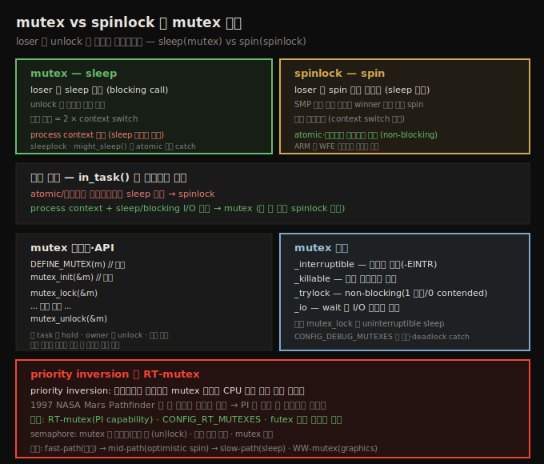
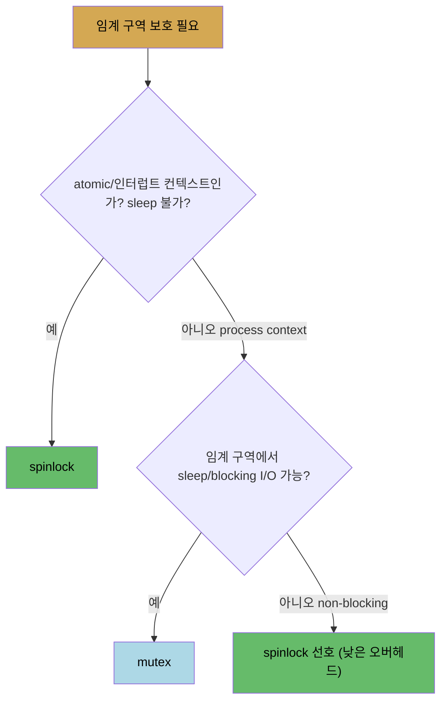

# 커널 동기화 (2) — mutex와 spinlock 선택
---
> mutex 와 spinlock 의 핵심 차이는 loser 스레드가 unlock 을 어떻게 기다리느냐입니다. **mutex** 는 loser 를 sleep 시키고(blocking call, 최소 두 번의 context switch 비용), **spinlock** 은 spin 하며 기다립니다. 선택 기준: atomic/인터럽트 컨텍스트거나 sleep 불가면 spinlock, 프로세스 컨텍스트에서 sleep/blocking I/O 가능하면 mutex 입니다(둘 다 되면 spinlock 이 낮은 오버헤드). mutex 는 process context 전용이며 `DEFINE_MUTEX`/`mutex_init` 로 초기화, `mutex_lock`/`unlock` 으로 (un)lock 합니다. 변형은 interruptible(신호로 깨움)·killable·trylock(non-blocking)·io 입니다. priority inversion 은 RT-mutex(PI)로 해결합니다.

앞 노트(12-01)에서 임계 구역과 data race 를 봤습니다. 이 노트는 그것을 보호하는 두 주요 락 — mutex 와 spinlock — 중 **어느 것을 언제 쓰는가**, 그리고 mutex 의 구체적 사용을 다룹니다.

아래 종합도가 척추 — sleep vs spin 의 차이, 선택 기준, mutex 초기화·API·변형, priority inversion·RT-mutex — 입니다.




## 1. 핵심 차이 — sleep(mutex) vs spin(spinlock)

> 두 락의 핵심 차이는 loser 가 unlock 을 어떻게 기다리느냐입니다. mutex 는 loser 를 sleep 시키고, spinlock 은 spin 하며 기다립니다.

세 스레드 tA·tB·tC 가 임계 구역 직전에 락을 획득(acquire)하고 직후에 해제(unlock)한다고 합시다. 동시에 락을 시도하면 API 가 정확히 하나(예: tB)만 winner 로 만들고, tA·tC 는 loser 가 되어 unlock 을 기다립니다. **두 락의 핵심 차이는 loser 가 어떻게 기다리느냐**입니다.

1. **mutex**: loser 를 **sleep** 시킵니다 — 락이 이미 잠겼으면 blocking call 로 보고 CPU 에서 context-switch 되어 sleep 합니다. winner 가 unlock 하면 커널이 loser 들을 깨워 다시 경쟁합니다. (그래서 mutex·semaphore 를 sleeplock 이라 부름.)
2. **spinlock**: sleep 이 없습니다 — loser 가 unlock 까지 **spin** 하며 기다립니다. 개념적으로 `while (locked);` 이지만 실제론 polling 이 아니라, SMP 에서 winner 가 다른 코어에서 임계 구역을 도는 동안 loser 가 다른 코어에서 spin 합니다(ARM 은 WFE 명령으로 저전력 대기).

spinlock 의 오버헤드가 mutex 보다 낮습니다. mutex 는 loser 가 sleep 하고 깨어나야 해서 내부적으로 `schedule()` 이 불리고(loser 가 mutex API 를 blocking call 로 봄), 최소 비용이 **두 번의 context switch**(sleep + wakeup)입니다.


## 2. 어느 락을 언제 — 선택 기준

> 이론상 임계 구역 시간이 두 context switch 시간보다 짧으면 spinlock 이 맞습니다. 실무 기준은 더 간단합니다 — atomic/인터럽트 컨텍스트거나 sleep 불가면 spinlock, 프로세스 컨텍스트에서 sleep 가능하면 mutex 입니다.

**이론** — 임계 구역에 머무는 시간을 `t_locked`, context switch 시간을 `t_ctxsw` 라 하면, mutex lock/unlock 의 최소 비용은 `2 × t_ctxsw` 입니다. 만약 `t_locked < 2 × t_ctxsw` 이면(임계 구역이 두 context switch 보다 짧으면) mutex 는 메타작업이 실제 작업보다 큰 thrashing 이라 부적절합니다. 짧은 non-blocking 임계 구역에는 spinlock, 긴(blocking 가능) 임계 구역에는 mutex 입니다.

**실무** — context switch 시간을 매번 잴 수는 없습니다. 핵심은 — mutex 는 loser 를 sleep 시키고, spinlock 은 안 시킵니다. 커널 황금률: **atomic 컨텍스트에서 sleep(`schedule()`) 금지.** 따라서 인터럽트 등 atomic 컨텍스트에서는 mutex 를 절대 쓸 수 없고, spinlock 은 됩니다.



1. atomic(인터럽트 등) 컨텍스트거나 process context 라도 sleep 불가 → **spinlock**.
2. process context 에서 sleep/blocking I/O 가능 → **mutex**.

spinlock 이 mutex 보다 낮은 오버헤드라, process context 에서도 임계 구역이 non-blocking 이면 spinlock 을 쓸 수 있습니다. 컨텍스트 판별은 `in_task()` 매크로로 합니다 — true 면 process context(보통 sleep 안전), false 면 atomic/인터럽트 컨텍스트입니다.


## 3. mutex 초기화와 사용 규칙

> mutex 는 struct mutex 로 표현되며 DEFINE_MUTEX(정적)·mutex_init(동적)로 unlocked 상태로 초기화합니다. 보호 데이터 구조체 안에 락 멤버로 두는 패턴이 흔합니다. owner 만 unlock, 재귀 금지, lock-ordering 준수가 핵심 규칙입니다.

mutex 는 sleepable/blocking 락으로, 임계 구역이 sleep(block) 가능할 때 process context 에서 씁니다. atomic·인터럽트 컨텍스트(top/bottom half·타이머)나 blocking 불가 process context 에서는 쓸 수 없습니다.

사용 전 반드시 unlocked 상태로 초기화합니다(`#include <linux/mutex.h>`).

```c
struct mutex mymtx;
DEFINE_MUTEX(mymtx);     // 정적 — 선언+초기화
mutex_init(&mymtx);      // 동적
```

**동적 초기화를 왜?** mutex 를 보호 대상 (global) 데이터 구조체의 멤버로 두는 패턴이 흔하기 때문입니다(리눅스에서 자주 씀). namespace 오염을 피하고, 어느 mutex 가 어느 데이터를 보호하는지 명확해집니다.

```c
struct mydrv_priv {
    /* ... members ... */
    struct mutex mymtx;  /* protects access to mydrv_priv */
} *drvctx;
// init 에서: mutex_init(&drvctx->mymtx);
```

커널 소스의 주석이 요약하는 mutex 규칙입니다.

1. 한 task 만 동시에 mutex 를 hold 할 수 있습니다.
2. owner 만 unlock 할 수 있습니다(다중 unlock 금지).
3. recursive locking 금지(self-deadlock).
4. API 로만 초기화(memset·복사 금지).
5. mutex 를 쥔 채 task 가 exit 하면 안 됩니다.
6. atomic·인터럽트 컨텍스트(tasklet·타이머)에서 쓰면 안 됩니다.

> **lock-ordering** 이 deadlock 방지의 핵심입니다 — 다중 락 시 획득 순서를 문서화하고 모든 개발자가 엄수합니다. slab 할당자(`mm/slub.c`) 등 커널 곳곳에 "Lock order:" 주석이 있습니다. 임계 구역은 짧게 — lock data, not code.


## 4. mutex lock/unlock API 와 변형

> mutex_lock/unlock 이 기본 API 입니다. mutex_lock 은 loser 를 uninterruptible sleep 시킵니다. 변형으로 interruptible(신호로 깨움)·killable·trylock(non-blocking)·io 가 있습니다.

```c
void mutex_lock(struct mutex *lock);
void mutex_unlock(struct mutex *lock);
```

`mutex_lock()` 의 첫 줄은 `might_sleep()` 매크로입니다 — atomic 컨텍스트에서 실행되면 안 되는 코드를 잡는 디버그 속성입니다. 곧 mutex 는 sleep 안전한 process context 에서만 써야 함을 코드가 말해 줍니다.

**[un]interruptible sleep** — Linux 의 sleep 은 두 상태입니다. interruptible(유저 신호에 반응)·uninterruptible(반응 안 함). `mutex_lock()` 은 loser 를 항상 **uninterruptible sleep** 시킵니다. 신호로 중단되길 원하면 `mutex_lock_interruptible()` 을 씁니다 — 성공 시 0, 신호 중단 시 `-EINTR` 반환. 일반적으로 `mutex_lock()` 이 더 빠르니 짧은 임계 구역에 씁니다.

변형들입니다.

| API | 동작 |
|-----|------|
| `mutex_lock()` | 기본 · loser uninterruptible sleep |
| `mutex_lock_interruptible()` | 신호로 깨움 · `-EINTR` 반환 (예: `delete_module` 시스템콜) |
| `mutex_lock_killable()` | 치명 신호로만 깨움 |
| `mutex_trylock()` | non-blocking · 1(성공)/0(contended) 반환 · busy-wait 용 |
| `mutex_lock_io()` | wait 를 I/O 대기로 회계 |

> `mutex_trylock()` 으로 락 상태를 알아내려 하지 마세요(racy). 또 atomic·인터럽트 컨텍스트에서 동작 안 합니다(process context 전용). 사용 패턴: `DEFINE_MUTEX`/`mutex_init` 로 초기화 → `mutex_lock`/`unlock` → (이론상) `mutex_destroy`(unlocked 상태에서만, `CONFIG_DEBUG_MUTEXES` 시 실제 코드). `CONFIG_DEBUG_MUTEXES=y` 가 deadlock 등 mutex 버그를 잡습니다.


## 5. 예제 드라이버 — 모든 임계 구역을 mutex 로 보호

> 미보호 misc 드라이버에 mutex 를 추가해 모든 공유 쓰기 데이터를 보호합니다. global 정수는 별도 mutex 로, 드라이버 context 구조체 멤버는 그 안의 mutex 로 보호합니다. init/cleanup 은 단일 컨텍스트라 보호 불필요, copy_to_user 같은 blocking 임계 구역은 mutex 가 적격입니다.

미보호 misc 드라이버(`miscdrv_rdwr`)를 복사해 mutex 로 모든 임계 구역을 보호합니다.

```c
#include <linux/mutex.h>
DEFINE_MUTEX(lock1);    /* global 정수 ga·gb 보호 */
struct drv_ctx {
    /* ... */
    struct mutex lock;  /* 이 구조체를 보호 */
} *ctx;
// init: mutex_init(&ctx->lock);
// open: mutex_lock(&lock1); ga++; gb--; mutex_unlock(&lock1);
// cleanup: mutex_destroy(&lock1); mutex_destroy(&ctx->lock);
```

핵심 포인트입니다.

1. **init/cleanup 은 보호 불필요** — `strscpy(ctx->oursecret, ...)` 가 공유 쓰기 데이터를 다루지만, init 코드는 단 하나의 컨텍스트(insmod)에서 정확히 한 번 실행되어 동시성이 없습니다(cleanup 도 동일).
2. **지역 변수는 보호 불필요** — 스택에 있어 스레드마다 별개.
3. **읽기도 보호** — open 에서 `ga`·`gb` 를 *읽는* 것도 가능한 동시 경로라면 보호해야 합니다(torn/dirty read 방지). single 정수 읽기/쓰기가 보통 atomic 이라 완벽한 예는 아니나, 가정하지 말고 보호합니다(13장에서 `atomic_t` 로 효율화).
4. **blocking 임계 구역은 mutex** — read 메서드의 `copy_to_user()` 는 blocking(sleep 가능)이므로 mutex 로만 보호합니다. 이것이 mutex 의 핵심 용도입니다. (그래서 `dev_info()` 로 `ctx->tx`·`ctx->rx` 를 읽을 때까지 mutex 를 유지 — 그 멤버들도 보호 대상.)

> 유저 모드 앱은 그대로(`rdwr_test_secret`)이며, 이런 락 코드는 lockdep·deadlock 검출이 켜진 debug 커널에서 테스트하는 것이 중요합니다(13장).


## 6. priority inversion 과 RT-mutex

> priority inversion 은 고우선순위 스레드가 mutex 대기로 CPU 에서 너무 오래 밀려나는 위험입니다. 1997 NASA Mars Pathfinder 가 이 문제로 재부팅을 반복했고, PI(priority inheritance)로 해결했습니다. 커널은 RT-mutex 로 PI 를 제공합니다.

mutex 사용 시 deadlock 외에 또 하나의 위험이 **priority inversion** 입니다 — 고우선순위 스레드가 mutex 를 너무 오래 기다려 CPU 에서 밀려나는 것입니다(unbounded priority inversion 은 치명적). 1997년 7월 NASA 의 Mars Pathfinder 로봇이 화성 표면에서 바로 이 문제로 워치독 재부팅을 반복했고, 지구에서 원격 진단해 **PI(priority inheritance)** mutex 속성으로 수정한 펌웨어를 화성으로 업로드해 해결했습니다.

유저 공간 Pthreads mutex 는 PI 를 제공합니다. 커널 안에서는 Ingo Molnar 가 PI-futex 기반의 **RT-mutex**(PI capability 를 가진 mutex)를 제공합니다 — `CONFIG_RT_MUTEXES` 시 활성. 일반 mutex 와 비슷한 init·(un)lock·destroy API 가 있으나, 실제로는 PI futex 내부 구현·커널 self-test·I2C 서브시스템이 직접 씁니다. 모듈 작성자가 자주 쓰진 않습니다.

**semaphore vs mutex** — 커널은 semaphore(`down[_interruptible]`/`up`)도 제공하나 옛 구현이라 mutex 가 권장됩니다. 차이입니다.

1. semaphore 는 mutex 의 일반형 — mutex 는 정확히 한 번 (un)lock, semaphore 는 여러 번 가능.
2. mutex 는 임계 구역 보호용, semaphore 는 다른 task 에 milestone 도달을 신호하는 용도(producer-consumer).
3. mutex 는 락 소유(ownership) 개념이 있어 owner 만 unlock, binary semaphore 는 소유 개념 없음.

> 내부 구현은 fast-path(무경합 시 무락·즉시) → mid-path(이미 잠겼으면 optimistic spin) → slow-path(sleep) 순의 하이브리드입니다. WW-mutex(wait/wound)는 graphics·DMA 에서 deadlock-proof 용으로, 오래된(reservation 보유 긴) task 에 우선권을 주고 젊은 task 를 back off(wound)시킵니다.


## 자주 받는 오해

1. "mutex 와 spinlock 은 성능 차이만 있다"고 생각하지만, 본질은 loser 의 대기 방식입니다 — mutex 는 sleep(blocking, context switch 필요), spinlock 은 spin. 그래서 atomic 컨텍스트에서는 mutex 를 절대 쓸 수 없습니다.
2. "process context 면 항상 mutex"라고 생각하지만, 임계 구역이 non-blocking 이면 process context 에서도 낮은 오버헤드의 spinlock 을 선호합니다.
3. "`mutex_trylock()` 으로 락이 잠겼는지 확인할 수 있다"고 생각하지만, 그 용도로 쓰면 racy 합니다. trylock 은 busy-wait(획득 못 하면 다른 일 하고 재시도)나 deadlock 회피용입니다.
4. "init 코드의 공유 데이터 쓰기도 락이 필요하다"고 생각하지만, 모듈 init/cleanup 은 단일 컨텍스트에서 정확히 한 번 실행되어 동시성이 없으므로 불필요합니다.


## 면접에서 받을 만한 질문

1. **mutex 와 spinlock 의 핵심 차이는?** → loser 스레드가 unlock 을 기다리는 방식입니다. mutex 는 loser 를 sleep 시켜(blocking call, 최소 두 번의 context switch 비용) `schedule()` 을 부르고, spinlock 은 loser 가 sleep 없이 spin 하며 기다립니다(SMP 에서 다른 코어). 그래서 spinlock 의 오버헤드가 낮습니다.
2. **어느 락을 언제 쓰나요?** → atomic/인터럽트 컨텍스트거나 process context 라도 sleep 불가면 spinlock, process context 에서 sleep/blocking I/O 가 가능하면 mutex 입니다. 둘 다 가능하면 낮은 오버헤드의 spinlock 을 선호합니다. 컨텍스트는 `in_task()` 로 판별합니다.
3. **왜 atomic 컨텍스트에서 mutex 를 못 쓰나요?** → mutex 는 loser 를 sleep 시키며 내부적으로 `schedule()` 을 부르는데, 커널 황금률상 atomic·인터럽트 컨텍스트에서는 sleep(blocking)이 금지되기 때문입니다. `mutex_lock()` 의 `might_sleep()` 매크로가 이 오용을 잡습니다.
4. **mutex_lock 과 mutex_lock_interruptible 의 차이는?** → `mutex_lock()` 은 loser 를 uninterruptible sleep 시켜 유저 신호에 반응하지 않고, `mutex_lock_interruptible()` 은 신호로 깨어나 `-EINTR` 을 반환합니다. 사람과 상호작용하는 경로엔 interruptible, 비대화형 경로엔 기본 `mutex_lock()`(더 빠름)을 씁니다.
5. **priority inversion 과 RT-mutex 는?** → priority inversion 은 고우선순위 스레드가 mutex 대기로 CPU 에서 너무 오래 밀려나는 위험입니다(1997 Mars Pathfinder 사례). 해결책은 PI(priority inheritance)이며, 커널은 `CONFIG_RT_MUTEXES` 로 PI capability 를 가진 RT-mutex 를 제공합니다(주로 PI futex 내부 구현에 사용).


## 관련 문서

- [상위 MOC](../../README.md) — 커널 개발자 관점 리눅스 내부 인덱스
- [12-01. 커널 동기화 (1) — 임계 구역과 data race](./12-01.커널 동기화 (1) — 임계 구역과 data race.md) — 임계 구역·atomicity·deadlock 의 기반
- [12-03. 커널 동기화 (3) — spinlock과 인터럽트](./12-03.커널 동기화 (3) — spinlock과 인터럽트.md) — spinlock 사용·인터럽트와 락(_irq/_irqsave/_bh)
