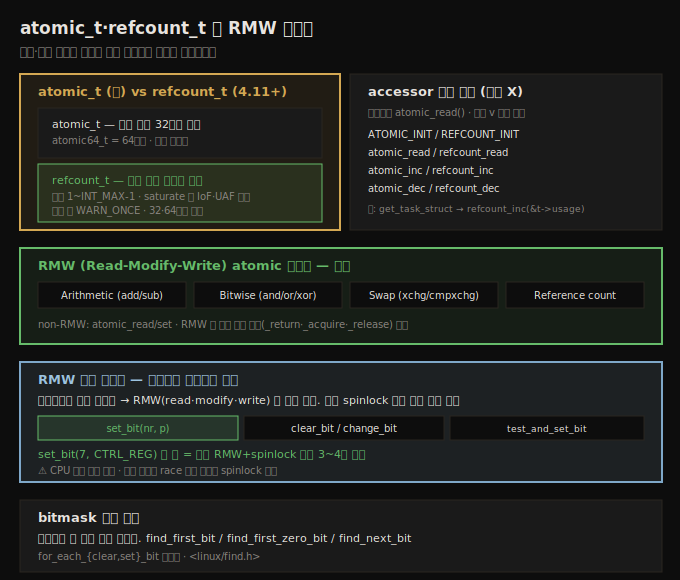

# 커널 동기화 (4) — atomic·refcount와 RMW 연산자
---
> 정수 연산은 mutex·spinlock 보다 `atomic_t`·`refcount_t` 인터페이스가 효율적입니다. `atomic_t` 는 부호 있는 32비트(`atomic64_t` 는 64비트) 범용 카운팅, `refcount_t`(4.11+)는 객체 참조 카운팅 전용으로 `1~INT_MAX-1` 범위에서 saturate 되어 IoF(정수 오버플로)·UAF(use-after-free) 버그를 막습니다. 접근은 반드시 accessor(`atomic_read`/`set`/`inc`/`dec`, `refcount_*`)로만 합니다. **RMW(Read-Modify-Write)** atomic 연산자는 arithmetic·bitwise·swap·refcount 로 나뉘며, 디바이스 레지스터 비트 조작에 `set_bit`/`clear_bit`/`test_and_set_bit` 등을 씁니다. spinlock 으로 수동 RMW 하는 것보다 훨씬 빠르고 간단합니다.

앞 세 노트(12-01~03)에서 임계 구역·mutex·spinlock 을 봤습니다. 동기화 Part 2 는 그 위에서 더 효율적이고 안전한 기법으로 들어갑니다. 정수를 단순히 spinlock 으로 보호하는 것보다 나은 방법 — 정수·참조 카운터 전용 원자 연산자 — 이 있습니다.

이 노트는 `atomic_t` vs `refcount_t` 인터페이스, 64비트 변형, RMW atomic 연산자, 그리고 디바이스 레지스터 비트 조작에 쓰는 RMW 비트 연산자를 다룹니다. 아래 종합도가 척추 — atomic/refcount 비교, accessor, RMW 분류, RMW 비트 연산자, bitmask 검색 — 입니다.




## 1. atomic_t vs refcount_t — 구·신 인터페이스

> 정수 연산이 커널에서 흔해(참조 카운터 증감 등) 전용 원자 인터페이스가 있습니다. atomic_t(구)는 부호 있는 32비트 범용 카운팅, refcount_t(4.11+)는 객체 참조 카운팅 전용으로 saturate 되어 IoF·UAF 버그를 막습니다.

`ga++; gb--;` 같은 global 정수 연산은 임계 구역이라 보호가 필요합니다(12-01). 앞서 mutex 와 spinlock 으로 보호했지만, 정수 연산은 커널에서 너무 흔해(참조·자원 카운터 증감 등) 전용 연산자 — **refcount·atomic 인터페이스** — 가 있습니다. 정수만 안전하고 indivisible 하게 다루도록 설계됐습니다.

| | atomic_t (구, ≤4.10) | refcount_t (신, ≥4.11) |
|--|---------------------|------------------------|
| 대상 | 부호 있는 32비트 범용 카운팅 | 객체 참조 카운팅 전용 |
| 범위 | 제한 없음 | `1 ~ INT_MAX-1` |
| 64비트 | `atomic64_t`(=`atomic_long_t`) | 32·64비트 투명 지원 |
| 헤더 | `<linux/atomic.h>` | `<linux/refcount.h>` |

**refcount_t 의 핵심**(보안 강화, PaX 팀 기원)입니다.

1. 범위 `1 ~ INT_MAX-1` 에서만 동작합니다. `REFCOUNT_SATURATED`(0xc0000000)에서 saturate 되어 더 움직이지 않습니다 — 카운터 wrap 을 막아 "spurious" UAF 버그를 방지합니다.
2. 0·음수·`INT_MAX` 이상으로 설정 불가 → IoF(정수 오버/언더플로) 이슈를 잡아 UAF 류 버그를 막습니다. 범위를 벗어나면 `REFCOUNT_WARN()`(=`WARN_ONCE()`)으로 한 번 경고를 냅니다.
3. 객체 참조 카운팅 전용 — 객체 생성 시 양수(보통 1)로 시작, "get"(참조 획득) 시 증가, "put"(참조 해제) 시 감소합니다. get/put 을 맞춰 항상 유효 범위 안에 유지해야 합니다.


## 2. accessor 로만 접근 — 직접 X

> atomic_t·refcount_t 변수의 모든 접근은 accessor 메서드로만 합니다. 읽기조차 atomic_read()를 써야 하며 직접 읽으면 안 됩니다.

핵심 — 이 변수들의 **모든** 접근은 accessor "메서드"(헬퍼)로만 합니다. 읽기조차 `atomic_read()` 를 써야 하고 직접 읽으면 안 됩니다. 값 설정도 `atomic_set(&v, i)` 이지 `v = i` 가 아닙니다(refcount 도 동일).

| 연산 | atomic_t | refcount_t |
|------|----------|------------|
| 초기화 | `ATOMIC_INIT(1)` | `REFCOUNT_INIT(1)` |
| 읽기 | `atomic_read(v)` | `refcount_read(v)` |
| 설정 | `atomic_set(v, i)` | `refcount_set(v, i)` |
| 증가 | `atomic_inc(v)` | `refcount_inc(v)` |
| 감소 | `atomic_dec(v)` | `refcount_dec(v)` |
| 더하기 | `atomic_add(i, v)` | `refcount_add(i, v)` |

커널 내 refcount 사용 예입니다. `get_task_struct()` 는 task 구조의 참조 카운터(`usage`)를 `refcount_inc()` 로 증가시키고, `put_task_struct()` 는 `refcount_dec_and_test()` 로 감소 후 0 이 되면(아무도 참조 안 하면) `__put_task_struct()` 로 해제합니다.

```c
static inline struct task_struct *get_task_struct(struct task_struct *t)
{
    refcount_inc(&t->usage);
    return t;
}
static inline void put_task_struct(struct task_struct *t)
{
    if (refcount_dec_and_test(&t->usage))
        __put_task_struct(t);
}
```

> refcount 를 범위 밖으로 오버플로(예: `refcount_add(INT_MAX, &ga)`)하면 커널이 한 번(`WARN_ONCE`) 경고를 내고 값을 `0xc0000000`(`REFCOUNT_SATURATED`)으로 고정합니다. `drivers/misc/lkdtm/refcount.c`(LKDTM)에 많은 테스트 케이스가 있습니다.


## 3. 64비트 atomic 과 내부 구현

> 64비트 atomic 은 atomic64_t 타입과 atomic64_ 접두어를 씁니다(refcount_t 는 투명 지원). 내부적으로 arch별 명령(x86 LOCK 접두어 등)으로 구현되며, refcount 는 보안·메모리 ordering 보장을 추가로 제공합니다.

지금까지 본 `atomic_t` 연산자는 32비트 전용입니다(`refcount_t` 는 32·64비트 투명 지원). 64비트는 다음을 따릅니다.

1. 변수를 `atomic64_t`(=`atomic_long_t`) 타입으로 선언.
2. `atomic_` 접두어 대신 `atomic64_` 접두어 사용 — `ATOMIC64_INIT`·`atomic64_read`·`atomic64_dec_if_positive` 등.

32·64비트 모두 arch-독립적입니다. 핵심 — atomic 정수의 모든 연산(초기화·읽기 포함)은 `atomic[64]_t` 로 선언하고 제공된 메서드로만 해야 합니다.

**내부 구현** — `foo()` atomic 연산자는 보통 매크로 → inline 함수 → arch별 `arch_foo()` 입니다. x86 은 `LOCK` 어셈블리 접두어(명령이 아니라 명령의 접두어)를 써, 코어가 해당 cacheline 을 배타 소유하고 하드웨어 인터럽트를 막으며 메모리 ordering 을 보장합니다. ARM 은 메모리 ordering 시맨틱의 generic 접근을 씁니다.

흥미롭게도 arch-독립 generic refcount 구현은 (구) atomic_t 위에 구현됩니다 — `refcount_set()` 은 `atomic_set()` 의 얇은 래퍼입니다.

```c
static inline void refcount_set(refcount_t *r, unsigned int n)
{
    atomic_set(&r->refs, n);
}
```

> 그럼 왜 refcount 를 쓰나? ① `REFCOUNT_SATURATED` 에서 saturate 되어 카운터 wrap 을 막아 spurious UAF 버그를 방지(보안 fix). ② 여러 신규 API 가 메모리 ordering 보장을 제공. ③ arch별 refcount 구현(x86 은 있고 ARM 은 없음)이 generic 과 다를 수 있음. 메모리 ordering 의 형식 모델은 LKMM 을 참조합니다.


## 4. RMW atomic 연산자 — 분류

> RMW(Read-Modify-Write) atomic 연산자는 arithmetic·bitwise·swap·reference count 로 나뉩니다. non-RMW(read/set)와 달리 결과를 반환하는 변형(_return·_acquire·_release)이 있습니다.

더 고급 연산자 집합이 **RMW(Read-Modify-Write) API** 입니다. 여러 종류로 분류됩니다.

1. **non-RMW**: `atomic_read()`·`atomic_set()`(과 `_acquire`/`_release` 변형) — §2 에서 본 것.
2. **RMW atomic 연산**:
   - **Arithmetic**: `atomic_{add,sub,inc,dec}()` 와 결과 반환 변형(`_return`·`_relaxed`·`_acquire`·`_release`)·`fetch_` 변형.
   - **Bitwise**: `atomic_{and,or,xor,andnot}()` 와 `fetch_` 변형.
   - **Swap**: `atomic_xchg()`·`atomic_cmpxchg()`·`atomic_try_cmpxchg()`.
   - **Reference count**(가능하면 `refcount_t` 권장): `atomic_add_unless()`·`atomic_inc_not_zero()`·`atomic_dec_and_test()` 등.
   - **Misc**: `atomic_inc_and_test()`·`atomic_add_negative()` 등.

> RMW 의 "Read-Modify-Write" 는 레지스터/메모리 값을 읽어(read), 수정하고(modify), 다시 쓰는(write) 고전 시퀀스입니다. 디바이스 드라이버가 레지스터를 조작하는 흔한 패턴이며, §5 에서 비트 연산자로 이를 안전·고속으로 합니다.


## 5. RMW 비트 연산자 — 디바이스 레지스터 조작

> 디바이스 레지스터는 공유 메모리라 RMW(read-modify-write)는 임계 구역입니다. 수동 spinlock 대신 set_bit/clear_bit/test_and_set_bit 같은 원자 비트 연산자를 쓰면 훨씬 빠르고 간단합니다.

드라이버는 레지스터에 비트 연산(AND·OR)을 해 값을 수정합니다(비트 set/clear). 레지스터를 수정하는 고전 시퀀스는 **RMW(Read-Modify-Write)** 입니다 — 현재 값을 읽고, 수정하고, 다시 씁니다.

```c
tmp = ioread8(CTRL_REG);   /* read */
tmp |= 0x80;               /* modify: bit 7 set */
iowrite8(tmp, CTRL_REG);   /* write */
```

핵심 — 이것만으로는 부족합니다! 레지스터는 global 공유 메모리라, 동시 접근 가능하면 **임계 구역**이므로 보호해야 합니다. spinlock 으로 감쌀 수도 있지만, 정수·비트 같은 작은 양에는 **원자 비트 연산자**가 더 낫습니다 — `set_bit()` 한 줄로 안전·indivisible 하게 처리합니다.

```c
set_bit(7, CTRL_REG);   /* nr=7 비트를 atomic 하게 1 로 */
```

| RMW 비트 atomic API | 동작 |
|---------------------|------|
| `set_bit(nr, p)` | nr 번째 비트를 1 로 (atomic) |
| `clear_bit(nr, p)` | nr 번째 비트를 0 으로 |
| `change_bit(nr, p)` | nr 번째 비트 토글 |
| `test_and_set_bit(nr, p)` | set 하고 이전 값 반환 |
| `test_and_clear_bit(nr, p)` | clear 하고 이전 값 반환 |
| `test_and_change_bit(nr, p)` | 토글하고 이전 값 반환 |

**성능 실증** — `set_bit()` 한 줄 vs 수동 RMW(spinlock 으로 감싸 read·modify·write):

1. x86_64(6.1.25): `set_bit()` **29ns** vs 수동 **125ns**(4배 이상 느림).
2. AArch64 Raspberry Pi 4: `set_bit()` **240ns** vs 수동 **908ns**(3.7배 느림).

원자 비트 연산자가 코딩도 훨씬 간단하고 빠릅니다.

> ⚠ 주의: 이 API 는 실행 중인 CPU 코어에 대해서는 atomic 이지만 다른 코어에 대해서는 아닙니다. 여러 코어가 병렬로 원자 연산을 하면(race) 임계 구역이므로 추가로 spinlock 보호가 필요합니다.

**bitmask 검색** — 스케줄러(`SCHED_FIFO`/`RR`) 등 성능 민감 경로는 bitmask 를 빠르게 검색합니다(`<linux/find.h>`).

1. `find_first_bit(addr, size)`: 첫 set 비트 번호 반환(없으면 size).
2. `find_first_zero_bit(addr, size)`: 첫 clear 비트 번호 반환.
3. `find_next_bit`·`find_last_bit`·`for_each_{clear,set}_bit` 매크로.


## 자주 받는 오해

1. "정수 보호엔 spinlock 이면 충분하다"고 생각하지만, 정수·참조 카운터에는 `atomic_t`·`refcount_t` 가 훨씬 효율적입니다(비트 연산은 3~4배 빠름).
2. "`refcount_t` 와 `atomic_t` 는 같다"고 생각하지만, `refcount_t` 는 객체 참조 카운팅 전용으로 `1~INT_MAX-1` 에서 saturate 되어 IoF·UAF 버그를 막는 보안 fix 입니다. `atomic_t` 는 부호 있는 범용 카운팅입니다.
3. "atomic 변수를 그냥 읽으면 된다"고 생각하지만, 읽기조차 `atomic_read()` accessor 로만 해야 합니다. 직접 읽으면 안 됩니다.
4. "`set_bit()` 같은 원자 비트 연산자는 모든 코어에 대해 atomic 하다"고 생각하지만, 실행 중인 CPU 코어에 대해서만입니다. 여러 코어가 race 하면 추가 spinlock 이 필요합니다.


## 면접에서 받을 만한 질문

1. **atomic_t 와 refcount_t 의 차이는?** → `atomic_t`(구)는 부호 있는 32비트 범용 카운팅이고, `refcount_t`(4.11+)는 객체 참조 카운팅 전용으로 `1~INT_MAX-1` 범위에서 saturate 됩니다. refcount 는 카운터 wrap 을 막아 IoF·UAF 류 버그를 방지하는 보안 강화 인터페이스로, 범위를 벗어나면 `WARN_ONCE` 경고를 냅니다.
2. **atomic/refcount 변수에 어떻게 접근하나요?** → 반드시 accessor 메서드로만 합니다 — 초기화는 `ATOMIC_INIT`/`REFCOUNT_INIT`, 읽기는 `atomic_read`/`refcount_read`, 설정은 `atomic_set`/`refcount_set`, 증감은 `atomic_inc`/`refcount_inc` 등입니다. 읽기조차 직접 변수를 읽으면 안 됩니다.
3. **RMW 비트 연산자는 왜 쓰나요?** → 디바이스 레지스터는 공유 메모리라 read-modify-write 시퀀스가 임계 구역입니다. `set_bit`/`clear_bit`/`test_and_set_bit` 같은 원자 비트 연산자를 쓰면 spinlock 으로 수동 RMW 하는 것보다 3~4배 빠르고 코드도 한 줄로 간단합니다. 단 실행 코어에 대해서만 atomic 이라, 여러 코어가 race 하면 추가 spinlock 이 필요합니다.
4. **64비트 atomic 은 어떻게 쓰나요?** → 변수를 `atomic64_t`(=`atomic_long_t`)로 선언하고 `atomic_` 대신 `atomic64_` 접두어 API(`ATOMIC64_INIT`·`atomic64_read` 등)를 씁니다. `refcount_t` 는 32·64비트를 투명하게 지원하므로 별도 변형이 없습니다.
5. **bitmask 를 효율적으로 검색하려면?** → `find_first_bit`(첫 set 비트)·`find_first_zero_bit`(첫 clear 비트)·`find_next_bit`·`for_each_{set,clear}_bit` 매크로(`<linux/find.h>`)를 씁니다. 스케줄러처럼 성능에 민감한 경로에서 bitmask 를 빠르게 스캔하는 데 쓰입니다.


## 관련 문서

- [상위 MOC](../../README.md) — 커널 개발자 관점 리눅스 내부 인덱스
- [13-02. 커널 동기화 (5) — reader-writer spinlock과 캐시 효과](./13-02.커널 동기화 (5) — reader-writer spinlock과 캐시 효과.md) — rwlock·CPU 캐싱·false sharing
- [12-03. 커널 동기화 (3) — spinlock과 인터럽트](./12-03.커널 동기화 (3) — spinlock과 인터럽트.md) — spinlock 의 기반(수동 RMW 와 대비)
