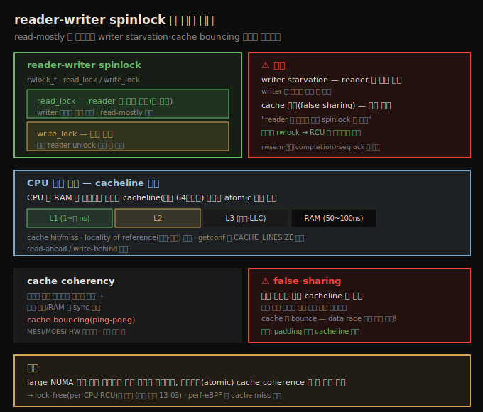
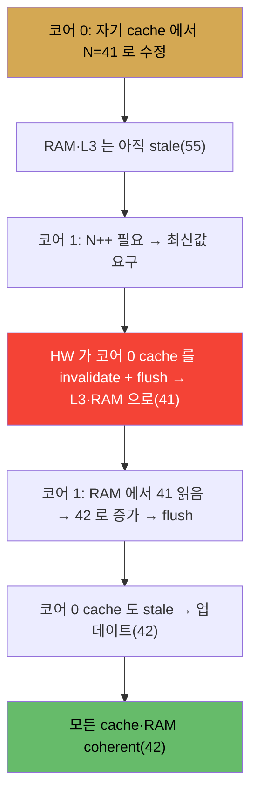

# 커널 동기화 (5) — reader-writer spinlock과 캐시 효과
---
> **reader-writer spinlock**(`rwlock_t`)은 read-mostly 상황에서 여러 reader 가 `read_lock` 으로 락 없이 동시에 읽게 하고, writer 만 `write_lock` 으로 배타 접근합니다. 단점은 **writer starvation**(reader 가 계속 오면 writer 가 굶음)과 **cache 효과**입니다. CPU 는 RAM 을 바이트가 아니라 **cacheline**(보통 64바이트) 단위로 읽습니다. 멀티코어가 같은 데이터를 수정하면 **cache coherency** 를 위해 invalidate+flush 가 반복되어 **cache bouncing**(ping-pong)이 일어납니다. **false sharing** 은 인접 변수가 같은 cacheline 에 있어 서로 다른 코어가 각각 수정해도 cache 가 bounce 하는 문제로, padding 으로 분리해 해결합니다. 커널은 rwlock 을 RCU 로 대체하는 추세입니다.

앞 노트(13-01)에서 atomic·RMW 를 봤습니다. 이 노트는 read-mostly 상황에 쓰이는 reader-writer spinlock 과, 그것이 겪는(그리고 코드 성능을 심각하게 해치는) CPU 캐싱 부작용 — cache coherency·false sharing — 을 다룹니다.

아래 종합도가 척추 — rwlock 인터페이스·단점, CPU 캐싱 기초, cache coherency, false sharing — 입니다.




## 1. reader-writer spinlock — read-mostly 에 유용

> 큰 데이터 구조를 검색만 할 때 일반 spinlock 은 reader 까지 직렬화해 성능이 떨어집니다. rwlock 은 reader 들을 동시 허용하고 writer 만 배타 접근시켜, read-mostly 에서 유리합니다.

수천 노드의 global 연결 리스트를 검색하는 코드를 상상합니다. global 공유 데이터라 동시 접근은 임계 구역이고, 검색이 non-blocking 이면 보통 spinlock 으로 보호합니다. 하지만 문제는 성능입니다 — 여러 스레드가 이 코드에 동시에 도달하면 한 winner 만 락을 얻고 나머지는 직렬화되어, 단지 *읽기만* 하는데도 느려집니다.

(읽기만 하니 락이 불필요하다는 순진한 생각은 틀립니다 — 동시 쓰기가 일어나면 torn/dirty read 가 나므로 읽기도 보호해야 합니다.)

**reader-writer spinlock** 이 해법입니다. 읽는 스레드는 (공유) read 락을, 쓰는 스레드는 배타 write 락을 요청합니다. write 락이 없으면 read 락은 즉시 모든 reader 에게 허용됩니다 — 사실상 reader 끼리는 락이 없는 셈이라 동시 접근합니다. writer 가 오면 일반 락 시맨틱이 적용되어 모든 reader 의 unlock 을 기다린 뒤 배타 write 락을 얻습니다.

곧 **읽기가 아주 잦고 쓰기가 드문(read-mostly)** 데다 non-blocking 임계 구역이 긴 경우 rwlock 이 적합합니다(단점은 §3).


## 2. rwlock 인터페이스

> rwlock 은 rwlock_t 타입으로, spinlock 의 spin 대신 read/write 를 치환한 API 를 씁니다. read_lock/write_lock 과 _irq/_irqsave/_bh 변형이 있습니다.

spinlock 을 써봤다면 rwlock 은 쉽습니다 — 락 타입은 `rwlock_t`(`spinlock_t` 대신), API 는 `spin` 대신 `read`/`write` 로 치환합니다(`#include <linux/rwlock.h>`).

```c
rwlock_t mylist_lock;
void read_lock(rwlock_t *lock);
void write_lock(rwlock_t *lock);
```

커널 내 예 — tty 계층의 SAK(Secure Attention Key, Trojan 방지 보안 기능) 처리 코드 `__do_SAK()` 는 task 리스트를 순회하며 세션을 죽일 때, task 리스트용 rwlock `tasklist_lock` 을 read 모드로 잡습니다.

```c
read_lock(&tasklist_lock);
do_each_pid_task(session, PIDTYPE_SID, p) {
    group_send_sig_info(SIGKILL, SEND_SIG_PRIV, p, PIDTYPE_SID);
} while_each_pid_task(session, PIDTYPE_SID, p);
[ … ]
read_unlock(&tasklist_lock);
```

> 일반 spinlock 처럼 변형이 있습니다 — `{read,write}_lock_irq{save}()`/`{read,write}_unlock_irq{restore}()`, `{read,write}_{un}lock_bh()`. 일반 `spin_lock_irq*` 처럼 **read IRQ 락도 local core 의 하드웨어 인터럽트와 커널 선점을 비활성**합니다. ext4 의 extent status tree(`inode->i_es_lock`)가 rwlock 의 한 사용 예입니다.


## 3. rwlock 의 성능 문제 — writer starvation

> rwlock 의 심각한 문제는 writer starvation 입니다. 여러 reader 가 락을 쥔 채 새 reader 가 계속 오면 writer 가 무한정 굶을 수 있습니다. cache 효과도 더해져, reader 가 짧으면 그냥 spinlock 이 낫습니다.

rwlock 에는 심각한 성능 문제가 있습니다.

1. **writer starvation**: reader 3개가 락을 쥔 상태에서 writer 가 오면 셋이 모두 unlock 할 때까지 기다려야 합니다. 그런데 그 사이 새 reader 가 계속 오면(가능합니다) writer 는 더 오래, 사실상 무한정 굶을 수 있습니다.
2. **cache 효과(false sharing/cache ping-pong)**: 여러 reader 스레드가 다른 코어에서 같은 공유 상태를 병렬로 읽으면 cache 부작용이 자주 일어납니다(§4~5).

공식 spinlock 문서(Linus 가 작성)는, reader-writer 락이 단순 spinlock 보다 더 많은 atomic 메모리 연산을 요구하므로 reader 임계 구역이 길지 않으면 그냥 spinlock 을 쓰는 게 낫다고 말합니다. 커널 커뮤니티는 rwlock 을 가능한 한 제거하고 우수한 lock-free 기법(**RCU**, 13-03)으로 옮기는 추세입니다. 무분별한 rwlock 사용은 권장되지 않습니다.

> **reader-writer semaphore(rwsem)** 도 있습니다 — rwlock 과 비슷한 용도·시맨틱이며 `{down,up}_{read,write}_{trylock,killable}()`(`<linux/rwsem.h>`). `mm_struct` 의 `mmap_lock` 이 rwsem 입니다. 관련: **completion**(유저 공간 condition variable 의 커널 대응)·**seqlock**(write-mostly 용, 예: `jiffies_64` 갱신).


## 4. CPU 캐싱 기초 — cacheline 단위

> CPU 는 RAM 을 바이트가 아니라 cacheline(보통 64바이트) 단위로 atomic 하게 읽습니다. cache hit 은 빠르고(1~수 ns) RAM 접근은 느려(50~100ns), locality of reference 를 활용해 성능을 올립니다.

멀티코어 SMP 시스템은 여러 단계의 병렬 cache(L1·L2·L3)를 씁니다. 각 코어는 자기만의 내부 cache(L1·L2)를 갖고, L3 는 공유(unified)입니다.

핵심 — CPU 는 RAM 을 직접 한 바이트씩 읽지 않습니다. 어떤 주소의 한 바이트를 읽으라 하면 CPU 는 그 시작 주소부터 **cacheline 전체(보통 64바이트)**를 atomic 하게 모든 cache(L1·L2·L3)로 읽어 옵니다.

```c
for (i=0; i < 264; i++)
    x = myarr[i];   // myarr[0] 접근 시 myarr[0]~[63] 전체가 cache 로 fetch!
```

`myarr[0]` 을 처음 접근하면 cache miss 가 나 버스 트랜잭션으로 RAM 에서 `myarr[0]~[63]`(cacheline 64바이트)을 통째로 fetch 해 cache 에 저장합니다. 이후 `myarr[1]~[63]` 접근은 cache hit 이 되어 큰 속도 향상을 얻습니다.

속도 차이가 핵심입니다 — cache 접근은 1~수 ns(L1 이 가장 빠르고 작음, L3/LLC 가 가장 느리고 큼), RAM 접근은 50~100ns 입니다. 캐싱은 **locality of reference** 를 활용합니다 — 공간적(순차 접근)·시간적(최근 접근한 것 재접근) 지역성입니다.

> 소프트웨어는 이를 이용해 ① 중요(hot) 멤버를 구조체 상단에 모으고(한 cacheline 안), ② cacheline 을 "넘지" 않게 padding 합니다(08-02 의 데이터 구조 설계 팁). `getconf -a | grep CACHE_LINESIZE` 로 cacheline 크기를 확인합니다. read-ahead / write-behind 정책을 씁니다.


## 5. cache coherency 와 false sharing

> 멀티코어가 같은 데이터를 자기 캐시에서 수정하면 cache coherency(일관성)를 위해 invalidate+flush 가 반복됩니다(cache bouncing). false sharing 은 인접 변수가 같은 cacheline 에 있어 서로 다른 코어가 각각 수정해도 bounce 하는 성능 문제로, padding 으로 해결합니다.

**cache coherency 문제** — 멀티코어가 같은 데이터(N=55)를 다룰 때, 코어 0 이 자기 cache 에서 N 을 41 로 수정하면 RAM·L3·코어 1 의 cache 는 여전히 stale(55)합니다. 코어 1 이 N 을 읽으면 오래된 값을 봅니다 — data 불일치입니다. 모든 cache 사본을 RAM 과 sync 로 유지하는 것이 **cache coherence** 입니다(올바른 컴퓨팅의 요구).

전파 흐름을 봅니다(코어 0 이 N=41 로 수정 후 코어 1 이 `N++`).



이렇게 cache↔RAM 의 write-invalidate+flush 시퀀스가 반복되는 것을 **cache bouncing**(ping-pong)이라 합니다 — 성능·전력에 크게 해롭습니다. 하드웨어 cache coherence 프로토콜(MESI·MOESI 등, 버스 snooping 기반)이 이를 처리하며, cache coherency 유지는 가장 전력 소모가 큰 과정 중 하나입니다.

**false sharing(oversharing) 문제** — 인접 선언된 두 변수가 같은 cacheline 에 놓입니다.

```c
u16 ax = 1, bx = 2;   // 합쳐 4바이트 → 같은 64바이트 cacheline
```

코어 0 의 스레드 T1 이 `ax`, 코어 1 의 T2 가 `bx` 를 병렬로 수정한다고 합시다. **data race 는 없습니다** — 각자 다른 변수를 다루니 임계 구역도 아니고 락도 불필요합니다. 그런데 둘이 같은 cacheline 에 있어, T1 이 `ax` 를 수정하면 그 cacheline 을 invalidate+flush 해야 하고, `bx` 도 같은 cacheline 이라 거의 즉시 bounce 가 일어납니다. 안전성 문제가 아니라 **순전히 성능 문제**입니다.

**해결** — 변수를 padding 으로 떨어뜨려 같은 cacheline 을 공유하지 않게 합니다.

```c
u16 ax = 1;
char padding[64];
u16 bx = 2;
```

> 실제로 메모리 관리 계층의 `struct zone` 이 두 spinlock 이 인접해 같은 cacheline 을 공유하던 false sharing 을 겪었고, 오래전 수정됐습니다. large NUMA 에서 여러 코어가 같은 데이터를 atomic 하게 수정해도, cache coherence 로 큰 성능·전력 손실이 납니다(안전성과 무관). 코어가 많을수록 더 나쁘게 scale 합니다. perf·eBPF 로 cache miss/flush 이벤트를 진단합니다. → 해법은 lock-free(per-CPU·RCU, 13-03)입니다.


## 자주 받는 오해

1. "읽기만 하니 락이 불필요하다"고 생각하지만, 동시 쓰기가 일어나면 torn/dirty read 가 나므로 읽기도 보호해야 합니다. rwlock 의 read 락이 그 역할입니다.
2. "rwlock 은 항상 spinlock 보다 낫다"고 생각하지만, writer starvation 과 cache 효과 때문에 reader 임계 구역이 짧으면 그냥 spinlock 이 낫습니다. 커널은 rwlock 을 RCU 로 대체하는 추세입니다.
3. "false sharing 은 data race 다"라고 생각하지만, 서로 다른 변수를 다루므로 data race 가 아닙니다 — 같은 cacheline 을 공유해 cache 가 bounce 하는 순전한 성능 문제입니다. padding 으로 해결합니다.
4. "atomic 연산으로 보호하면 멀티코어에서 성능 문제가 없다"고 생각하지만, large NUMA 에서 여러 코어가 같은 데이터를 수정하면 안전해도 cache coherence(bouncing)로 큰 성능·전력 손실이 납니다.


## 면접에서 받을 만한 질문

1. **reader-writer spinlock 은 언제 쓰나요?** → read-mostly 상황(읽기가 아주 잦고 쓰기가 드물며 non-blocking 임계 구역이 긴 경우)입니다. reader 들은 `read_lock` 으로 동시에(사실상 락 없이) 읽고, writer 만 `write_lock` 으로 배타 접근합니다. 단 reader 임계 구역이 짧으면 그냥 spinlock 이 낫습니다.
2. **rwlock 의 주요 단점은?** → writer starvation 입니다 — reader 들이 락을 쥔 채 새 reader 가 계속 오면 writer 가 무한정 굶을 수 있습니다. 또 여러 reader 가 다른 코어에서 같은 데이터를 읽으면 cache ping-pong(false sharing) 부작용이 납니다. 그래서 커널은 rwlock 을 RCU 로 대체하는 추세입니다.
3. **CPU 는 메모리를 어떻게 읽나요?** → 바이트 단위가 아니라 cacheline(보통 64바이트) 단위로 atomic 하게 모든 cache(L1·L2·L3)로 읽습니다. 한 바이트 접근 시 그 주변 64바이트가 통째로 fetch 되어, 이후 순차 접근은 cache hit(1~수 ns)이 됩니다(RAM 접근은 50~100ns).
4. **cache coherency 문제란?** → 멀티코어가 같은 데이터를 각자 cache 에서 수정하면 사본들이 불일치(stale)해지는 문제입니다. 한 코어가 수정하면 다른 코어의 cache 를 invalidate+flush 해 RAM·다른 코어와 sync 해야 하며, 이 write-invalidate+flush 가 반복되는 것을 cache bouncing(ping-pong)이라 합니다. MESI/MOESI HW 프로토콜이 처리합니다.
5. **false sharing 은 무엇이고 어떻게 고치나요?** → 인접 변수가 같은 cacheline 에 놓여, 서로 다른 코어가 각각 다른 변수를 수정해도(data race 없음) cache 가 bounce 하는 성능 문제입니다. 변수 사이에 padding 을 넣어 같은 cacheline 을 공유하지 않게 분리하면 해결됩니다.


## 관련 문서

- [상위 MOC](../../README.md) — 커널 개발자 관점 리눅스 내부 인덱스
- [13-01. 커널 동기화 (4) — atomic·refcount와 RMW 연산자](./13-01.커널 동기화 (4) — atomic·refcount와 RMW 연산자.md) — 정수·비트 원자 연산
- [13-03. 커널 동기화 (6) — lock-free와 lockdep·memory barrier](./13-03.커널 동기화 (6) — lock-free와 lockdep·memory barrier.md) — 캐시 문제의 해법인 per-CPU·RCU
