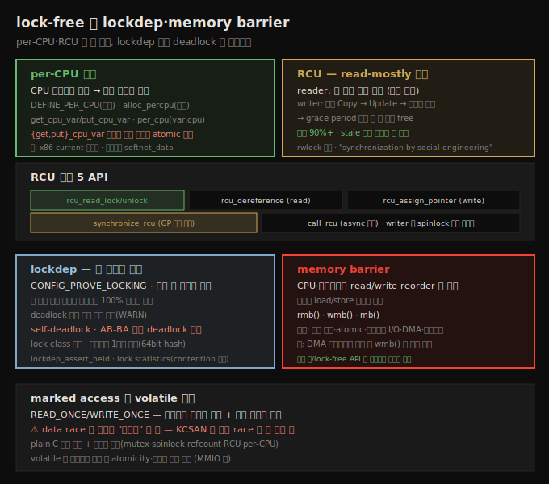
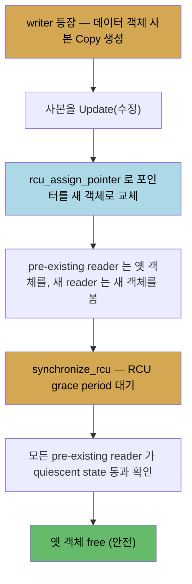

# 커널 동기화 (6) — lock-free와 lockdep·memory barrier
---
> **lock-free** 기법은 락 없이 성능을 올립니다. **per-CPU 변수**는 CPU 코어마다 사본을 두어 공유 자체를 없애고, `get_cpu_var`/`put_cpu_var` 사이는 선점 비활성 atomic 구역입니다. **RCU(Read-Copy-Update)** 는 read-mostly 에 최적입니다 — reader 는 `rcu_read_lock`/`unlock` 으로 락 없이 동시 읽고, writer 는 데이터 사본을 만들어(Copy) 수정(Update)하고 `rcu_assign_pointer` 로 포인터를 교체한 뒤, **RCU grace period**(모든 pre-existing reader 가 quiescent state 를 지나는 시간)를 `synchronize_rcu` 로 기다린 후 옛 객체를 free 합니다. **lockdep** 은 락 순서 검증으로 self/AB-BA deadlock 을 런타임에 수학적으로 100% 잡습니다. **memory barrier**(`rmb`/`wmb`/`mb`)는 컴파일러·CPU 의 reorder 를 막아 순서를 보장합니다.

앞 노트(13-02)에서 cache 효과로 인한 성능 문제를 봤습니다. 이 노트는 그 해법인 **lock-free** 기법(per-CPU·RCU), 그리고 locking 버그를 잡는 **lockdep**·lock statistics, 마지막으로 **memory barrier** 를 다룹니다. 이로써 시리즈가 완간됩니다.

아래 종합도가 척추 — per-CPU, RCU 개념·core API, lockdep, memory barrier, marked access — 입니다.




## 1. lock-free 와 per-CPU 변수

> 락은 bottleneck 이 되어 성능이 떨어집니다(특히 large NUMA). per-CPU 변수는 CPU 코어마다 사본을 두어 공유 자체를 없애 lock-free 를 달성합니다. get_cpu_var/put_cpu_var 사이는 선점 비활성 atomic 구역입니다.

락은 funnel(깔때기)이나 toll booth(요금소)처럼 bottleneck 이 됩니다 — 특히 코어 수백 개의 high-end SMP/NUMA 에서는 scale 이 안 됩니다. lock contention·deadlock·convoying·cache 효과 같은 문제로, 커널은 scale 하면서 성능을 내기 위해 **lock-free 알고리즘** — per-CPU 데이터·RCU 등 — 을 도입했습니다.

**per-CPU 변수** 는 이름대로 변수 사본을 (live) CPU 코어마다 하나씩 둡니다. 데이터를 스레드 간 공유하지 않으니 임계 구역 자체가 사라져 — 락이 필요 없습니다(lock-free). 4코어면 per-CPU 변수는 사실상 4원소 배열이고, 각 코어는 자기 사본만 다룹니다(유저 공간 TLS 와 유사). 작은 데이터에만 씁니다(코어마다 복제되니 코어가 많으면 RAM 오버헤드↑).

장점 — ① 비싼 락 회피, ② 접근이 한 코어에서만 일어나고 공유되지 않아 cache ping-pong·false sharing 이 사라짐(전력도 절감). large NUMA 에서 atomic 정수 증감만으로도 cache 효과로 큰 손실이 나는데, per-CPU 는 이를 없앱니다.

```c
#include <linux/percpu.h>
DEFINE_PER_CPU(int, pcpa);          // 정적 (0 초기화)
pcp_ctx = alloc_percpu(struct drv_ctx);   // 동적 (free_percpu 로 해제)
```

I/O 는 헬퍼로만 합니다.

| 매크로 | 용도 |
|--------|------|
| `get_cpu_var(v)` / `put_cpu_var(v)` | 현재 코어의 per-CPU 값 읽기/수정(쌍 맞춰야 함) |
| `per_cpu(v, cpu)` | 특정 cpu 의 per-CPU 값 읽기 |
| `get_cpu_ptr` / `put_cpu_ptr` / `per_cpu_ptr` | 포인터(데이터 구조)용 |

> ⚠ `get_cpu_var()`~`put_cpu_var()` 사이는 **선점 비활성 atomic 구역**입니다(내부적으로 `preempt_disable`/`preempt_enable`). 여기서 `vmalloc()` 같은 blocking 호출을 하면 `BUG: sleeping function called from invalid context` 가 납니다(`printk`·`mdelay` 는 non-blocking 이라 OK). 단 spinlock IRQ 변형과 달리 하드웨어 인터럽트 상태는 영향받지 않습니다. 현재 코어는 `[raw_]smp_processor_id()` 로 확인합니다.

커널 내 per-CPU 사용 예 — ① x86 의 `current` 매크로(`current_task` per-CPU 변수를 lock-free 로 읽음, context switch 시 `__switch_to()` 에서 갱신), ② 네트워크 수신 경로의 `softnet_data`(과거 global+spinlock 이던 수신 큐를 per-CPU 로 전환해 contention 제거).


## 2. RCU — Read-Copy-Update 의 개념

> RCU 는 reader 와 writer 가 동시·안전하게 공유 데이터를 다루게 하는 lock-free 기법입니다. reader 는 락 없이 동시 읽고, writer 는 사본을 만들어 수정하고 포인터를 교체한 뒤, 모든 pre-existing reader 가 끝나길(grace period) 기다려 옛 객체를 free 합니다.

**RCU(Read-Copy-Update)** 는 reader 가 writer 와 동시에 실행되게 하는 lock-free 동기화입니다(2002 병합). 전통적으로 큰 리스트·트리에 spinlock·rwlock 을 썼지만, high-end NUMA 에서 비싸고 scale 이 안 됩니다. RCU 는 rwlock 의 이상적 대체로, read 가 90%+ 이고 stale 읽기가 허용될 때 적합합니다.

reader 는 **락이 전혀 없습니다** — lock acquire/release 도, atomic 명령도, memory barrier 도 없습니다(DEC Alpha 예외). 이 연산들이 바로 성능을 해치는 것들이라, 없애는 것이 RCU 를 아주 빠르게 만듭니다. writer 끼리는 여전히 보호가 필요합니다(보통 spinlock).

writer 흐름입니다(C·U·grace period·free).



핵심 개념입니다.

1. reader 들은 락 없이 병렬로 읽습니다(read-side 임계 구역은 **non-blocking·선점 비활성**, per-CPU 처럼).
2. writer 는 먼저 데이터 객체 **사본(Copy)** 을 만들고, 그것을 **수정(Update)** 합니다. pre-existing reader 는 옛 객체를 계속 읽습니다.
3. writer 가 포인터를 새 객체로 **atomic 교체**합니다 — 이후 새 reader 는 새 객체를, pre-existing reader 는 옛 객체를 봅니다(둘 다 자기 "현실"이 맞음 — quantum 느낌).
4. writer 는 옛 객체를 free 해야 하지만, **모든 pre-existing reader 가 끝날 때까지** 기다려야 합니다(아니면 UAF, RCU 에선 UAFBR 버그 — StackRot CVE 가 예). 이 대기 시간이 **RCU grace period(GP)** 입니다.

> **quiescent state** — reader 가 read-side 임계 구역을 떠난 상태(context switch·유저 모드 전환·idle). read-side 가 non-blocking·선점 비활성이라, reader 가 context switch 하면 RCU read 가 끝났다고 확신할 수 있습니다. 모든 reader 가 한 번씩 context switch 하면 GP 가 지난 것입니다. **GP** = 모든 reader 가 적어도 한 번 quiescent state 를 지나는 시간.


## 3. RCU core API — 5개

> RCU 의 핵심은 5개 API 입니다 — reader 의 rcu_read_lock/unlock·rcu_dereference, writer 의 rcu_assign_pointer·synchronize_rcu(또는 call_rcu). rcu_read_lock 은 사실상 코드가 없으며(선점 비활성 + 사회적 계약), writer 끼리는 spinlock 으로 직렬화합니다.

```c
rcu_read_lock();
p = rcu_dereference(gptr);   // RCU-protected 포인터를 안전하게 fetch
<read p->...>                // 비-blocking · 선점 비활성
rcu_read_unlock();
```

`rcu_read_lock`/`unlock` 의 코드는 (디버그 stuff 제외) **사실상 아무것도 없습니다**(null). 어떻게 machine state 변경 없이 동기화하나? McKenney 의 답 — 이 API 는 machine state 가 아니라 **개발자에게 작용**합니다. "임계 구역이니 blocking(context switch) 금지"라는 규칙을 따르면 동작합니다. 곧 "RCU 는 사회 공학에 의한 동기화"입니다. (대부분의 락도 개발자가 규칙을 따라야 동작합니다 — 락을 쥐어도 다른 스레드가 데이터를 못 건드리게 막지는 않습니다.)

핵심 5 API 입니다.

| # | API | 역할 |
|---|-----|------|
| 1 | `rcu_read_lock()` | reader: read-side 임계 구역 시작 |
| 2 | `rcu_read_unlock()` | reader: read-side 임계 구역 끝 |
| 3 | `synchronize_rcu()` | writer: GP 시작·대기(동기). 끝나면 옛 객체 free 안전. `call_rcu()` 는 async 변형(blocking 불가 시) |
| 4 | `rcu_assign_pointer(p, v)` | writer: RCU-protected 포인터 p 를 v 로 안전·atomic 설정(write barrier 포함) |
| 5 | `rcu_dereference(p)` | reader: RCU-protected 포인터를 안전하게 fetch(read-side 안에서만) |

`rcu_assign_pointer(p, v)` 가 단순 `p = v` 가 아닌 이유는 HW·컴파일러 reorder(arch별 메모리 ordering)를 막기 위해 write memory barrier 를 넣기 때문입니다. **pre-existing vs new reader 의 경계는 writer 가 `rcu_assign_pointer` 를 완료하는 순간**입니다 — 이전 reader 는 옛 포인터를, 이후 reader 는 새 포인터를 봅니다.

`synchronize_rcu()` 의 toy 구현은 `for_each_online_cpu(cpu) run_on(cpu);` 만큼 단순합니다 — 각 코어에서 도는 것만으로 system-wide GP 가 지났음이 보장됩니다(현재 컨텍스트가 코어에서 돌려면 이전 스레드가 context switch 했어야 하므로).

> writer 는 `rcu_assign_pointer` 같은 specialized list/array/tree API 를 씁니다 — `list_add_tail_rcu`·`list_del_rcu`·`list_for_each_entry_rcu` 등(`<linux/rculist.h>`). writer 끼리는 spinlock 으로 직렬화합니다(write-side 임계 구역에서 사본을 만들어 수정하므로, spinlock 을 데이터 구조 안에 두면 사본에 포함돼 계약이 깨지는 미묘한 버그가 납니다 — 별도 spinlock 사용). reader 가 길어지면 GP 가 연장되며, 너무 길면 RCU CPU stall 경고가 납니다(`RCU_CPU_STALL_TIMEOUT`, 기본 21초). 구현은 보통 tree RCU(수천 코어에 scale).


## 4. lockdep — 락 정확성 런타임 검증

> lockdep(CONFIG_PROVE_LOCKING)은 모든 락 활동을 추적해 락 순서 규칙 위반을 런타임에 수학적으로 100% 검증합니다. deadlock 이 실제 발생하기 전에 self/AB-BA 순환 deadlock 을 경고합니다.

debug 커널(개발/디버그용으로 설정한 커널)에서 lock 디버깅을 켜는 것이 중요합니다. 핵심 config 들입니다 — `CONFIG_PROVE_LOCKING`(lockdep)·`CONFIG_DEBUG_SPINLOCK`·`CONFIG_DEBUG_MUTEXES`·`CONFIG_DEBUG_ATOMIC_SLEEP`·`CONFIG_LOCK_STAT`·`CONFIG_PROVE_RCU` 등. KASAN(메모리 에러)·KCSAN(data race) 도 함께 쓰면 좋습니다(단 둘은 배타적).

**lockdep**(runtime locking correctness validator)은 커널의 모든 락 활동(획득·해제·다중 락 시퀀스)을 추적·매핑합니다. 잘 알려진 올바른 locking 규칙을 적용해 시퀀스의 정확성을 결론냅니다 — **모든 단일 task 락 시퀀스에 대해 100% 수학적으로 deadlock 불가능을 증명**합니다.

성능 — 수천 락을 매번 검증하면 O(N²)로 너무 느리니, lockdep 은 각 시퀀스를 **처음 한 번만** 검증합니다(시퀀스마다 64비트 hash 유지). **lock class**(논리적 락) 단위로 추적해, `struct file` 인스턴스가 수천 개여도 그 mutex·spinlock 은 각각 하나의 class 로 봅니다.

lockdep 은 deadlock 이 **실제 발생하지 않아도** 수학적으로 부정확한 locking 을 경고합니다 — 미래에 deadlock 이 일어날 수 있다는 증명입니다.

**예 1 — self-deadlock**: task 리스트 순회 중 `task_lock(t)` 를 잡은 뒤 `get_task_comm()` 을 부르면, 그것이 내부적으로 같은 락(`task_lock` = `alloc_lock` spinlock)을 재획득 시도해 self-deadlock 이 납니다. lockdep 이 "trying to acquire lock ... but task is already holding lock" 으로 잡습니다. 해법은 ① 호출 전 unlock 후 재lock(race 도입·일부 멤버만 보호 → 부족) 또는 ② **RCU 로 전환**(read-mostly 라 최적, write 보호 spinlock 도 불필요).

**예 2 — AB-BA 순환 deadlock**: 두 kthread 가 lockA·lockB 를 다른 순서로 잡으면(kthread0: A→B, kthread1: B→A) 순환 deadlock 이 납니다. lockdep 이 "possible circular locking dependency" 로 잡고, 실제 런타임 시퀀스와 generic 시나리오를 보여 줍니다.

> lockdep 출력 해석 — 64비트 hash(같은 락이면 동일), 락 이름(`&p->alloc_lock`), `{+.+.}`(IRQ 상태), `{2:2}` 등. **lock-ordering 규칙**(항상 같은 순서로 락 획득)을 문서화·준수하면 AB-BA 를 막습니다. lockdep 은 시퀀스당 1회만 보고하며, 반복 모듈 load/unload 는 lock class limit 초과를 유발할 수 있습니다(false positive 가능 — "fix your locking, not lockdep").


## 5. lock statistics 와 memory barrier

> lock statistics(CONFIG_LOCK_STAT)는 락 contention 을 측정해 bottleneck 을 찾습니다. memory barrier(rmb/wmb/mb)는 컴파일러·CPU 의 read/write reorder 를 막아 의도한 순서를 강제하며, DMA 디스크립터 설정 등에 씁니다.

**lock statistics**(`CONFIG_LOCK_STAT`) — 락 contention(획득하려는데 이미 잡혀 대기)을 측정합니다. heavy contention 은 성능 bottleneck 입니다. `/proc/lock_stat` 으로 봅니다(root, lockdep 의 hook 활용).

| 작업 | 명령(root) |
|------|-----------|
| clear | `echo 0 > /proc/lock_stat` |
| enable | `echo 1 > /proc/sys/kernel/lock_stat` |
| disable | `echo 0 > /proc/sys/kernel/lock_stat` |
| 보기 | `cat /proc/lock_stat` |

주요 컬럼 — `contentions`(대기한 contention 수), `con-bounces`(x-CPU 데이터 관여 contention = 오버헤드), 각종 waittime·acquisitions·holdtime. 가장 contended 한 락은 `grep ":" /proc/lock_stat | head` 로 봅니다.

**memory barrier** — CPU·메모리 컨트롤러·컴파일러가 메모리 read/write 를 reorder 할 수 있습니다. 대개 benign 한 최적화지만, 다음 경우엔 의도한 load/store 순서를 지켜야 합니다 — ① 코어 경계(멀티코어), ② atomic 연산, ③ 주변장치 I/O(DMA), ④ 하드웨어 인터럽트. memory barrier 가 reorder 를 억제해 순서를 강제합니다(`<asm/barrier.h>`).

| 매크로 | 역할 |
|--------|------|
| `rmb()` | read(load) memory barrier |
| `wmb()` | write(store) memory barrier |
| `mb()` | general — barrier 이전의 모든 LOAD/STORE 가 이후 것보다 먼저 보이도록 보장 |

예 — Realtek 8139 드라이버가 DMA 디스크립터를 설정할 때, `txd->opts2`·`txd->addr` 를 먼저 쓰고 `txd->opts1` 을 나중에 써야 합니다. 순서를 보장하려고 `wmb()` 를 씁니다.

```c
txd->opts2 = opts2;
txd->addr = cpu_to_le64(mapping);
wmb();   /* 이 store 들이 아래 store 보다 먼저 일어나도록 보장 */
txd->opts1 = cpu_to_le32(opts1);
```

> 대부분의 경우 락/lock-free API 가 내부에서 memory barrier 를 알아서 처리합니다. 드라이버 작성자는 DMA 디스크립터 설정이나 CPU↔주변장치 통신 같은 경우에만 명시적으로 씁니다. RCU 도 적절한 barrier 를 씁니다(read-side 는 DEC Alpha 에서만 실제 barrier).


## 6. marked access 와 volatile 주의

> READ_ONCE/WRITE_ONCE(marked access)는 컴파일러 최적화를 막고 캐시 일관성을 보장하지만, data race 를 이걸로 "고치면" KCSAN 이 진짜 race 를 못 잡습니다. plain C 접근을 유지하고 설계로 보호해야 합니다. volatile 은 최적화만 막을 뿐 atomicity 를 보장하지 않습니다.

`READ_ONCE()`·`WRITE_ONCE()` — marked access(plain C 접근과 대비)는 개별 변수에 대해 컴파일러·CPU 가 의도대로 동작하게 보장합니다 — 컴파일러 최적화를 막고 필요 시 memory barrier 를 써, 여러 코어가 동시 접근할 때 캐시 일관성을 보장합니다.

> ⚠ **드라이버/모듈 작성자 주의**: data race 를 이 매크로로 "고치지" 마세요. 거의 모든 공유 변수 접근에 `READ_ONCE`/`WRITE_ONCE` 를 쓰면 KCSAN 같은 도구가 진짜 버그 race 를 못 잡습니다. 읽기/쓰기는 plain C 로 두고, 설계·구현으로(mutex·spinlock·`atomic_t`/`refcount_t`·RCU·per-CPU) 올바르게 보호해야 합니다. KCSAN 의 race 보고는 종종 심각한 logic 버그의 전조입니다.

`volatile` 키워드는 동시성을 마법처럼 없애지 않습니다 — 그 변수 주변의 일반 최적화만 비활성합니다(MMIO 에 유용·필요). memory barrier 측면에서 컴파일러가 volatile 변수의 read/write 를 다른 volatile 변수에 대해 reorder 하지 않지만, atomicity 는 별개로 volatile 이 보장하지 않습니다.


## 자주 받는 오해

1. "RCU reader 도 락을 쓴다"고 생각하지만, `rcu_read_lock`/`unlock` 은 사실상 코드가 없습니다(선점 비활성 + 사회적 계약). 락·atomic 명령·memory barrier 가 없어 아주 빠릅니다. 단 read-side 는 non-blocking 이어야 합니다.
2. "RCU writer 는 즉시 옛 객체를 free 한다"고 생각하지만, 모든 pre-existing reader 가 끝날 때까지(grace period, `synchronize_rcu`) 기다려야 합니다. 먼저 free 하면 UAF(UAFBR) 버그가 납니다.
3. "per-CPU 임계 구역에서 메모리 할당해도 된다"고 생각하지만, `get_cpu_var`/`put_cpu_var` 사이는 선점 비활성 atomic 구역이라 `vmalloc()` 같은 blocking 호출은 `BUG: sleeping function called from invalid context` 를 냅니다.
4. "data race 는 `READ_ONCE`/`WRITE_ONCE` 로 고치면 된다"고 생각하지만, 그러면 KCSAN 이 진짜 race 를 못 잡습니다. plain C 접근을 유지하고 락·lock-free 기법으로 설계상 보호해야 합니다. `volatile` 도 atomicity·동시성을 보장하지 않습니다.


## 면접에서 받을 만한 질문

1. **per-CPU 변수는 어떻게 lock-free 를 달성하나요?** → 변수 사본을 CPU 코어마다 하나씩 둬 데이터를 스레드 간 공유하지 않습니다. 공유가 없으니 임계 구역도 락도 없습니다. `get_cpu_var`/`put_cpu_var`(또는 `_ptr`) 헬퍼로 접근하며, 그 사이는 선점 비활성 atomic 구역입니다. cache ping-pong·false sharing 도 사라져 large NUMA 에서 성능이 우수합니다.
2. **RCU 는 어떻게 동작하나요?** → reader 는 `rcu_read_lock`/`unlock` 으로 락 없이 동시 읽습니다. writer 는 데이터 사본을 만들어(Copy) 수정(Update)하고 `rcu_assign_pointer` 로 포인터를 atomic 교체한 뒤, 모든 pre-existing reader 가 quiescent state 를 지나는 grace period 를 `synchronize_rcu` 로 기다려 옛 객체를 free 합니다. read 90%+ 이고 stale 읽기가 허용될 때 적합합니다.
3. **RCU 의 핵심 5 API 는?** → reader 용 `rcu_read_lock`/`rcu_read_unlock`/`rcu_dereference`, writer 용 `rcu_assign_pointer`/`synchronize_rcu`(또는 async `call_rcu`)입니다. `rcu_read_lock` 은 사실상 코드가 없고(선점 비활성), writer 끼리는 spinlock 으로 직렬화합니다.
4. **lockdep 은 무엇을 어떻게 잡나요?** → 모든 락 활동(획득·해제·시퀀스)을 추적해 락 순서 규칙 위반을 런타임에 100% 수학적으로 검증합니다. self-deadlock(쥔 락 재획득)·AB-BA 순환 deadlock 을 실제 발생 전에 경고합니다. lock class 단위로 시퀀스당 1회만 검증해(64비트 hash) 성능 부담을 줄입니다. `CONFIG_PROVE_LOCKING` 으로 켭니다.
5. **memory barrier 는 언제 쓰나요?** → CPU·컴파일러의 메모리 reorder 를 막아 의도한 load/store 순서를 강제할 때입니다 — 코어 경계·atomic 연산·주변장치 I/O(DMA)·하드웨어 인터럽트에서 필요합니다. `rmb`(read)·`wmb`(write)·`mb`(general)를 쓰며, 예로 DMA 디스크립터 설정 시 `wmb()` 로 store 순서를 보장합니다. 대부분은 락/lock-free API 가 내부에서 처리합니다.


## 관련 문서

- [상위 MOC](../../README.md) — 커널 개발자 관점 리눅스 내부 인덱스
- [13-02. 커널 동기화 (5) — reader-writer spinlock과 캐시 효과](./13-02.커널 동기화 (5) — reader-writer spinlock과 캐시 효과.md) — per-CPU·RCU 가 푸는 cache 문제
- [12-01. 커널 동기화 (1) — 임계 구역과 data race](./12-01.커널 동기화 (1) — 임계 구역과 data race.md) — data race·deadlock 의 기반(lockdep 이 잡는 것)
