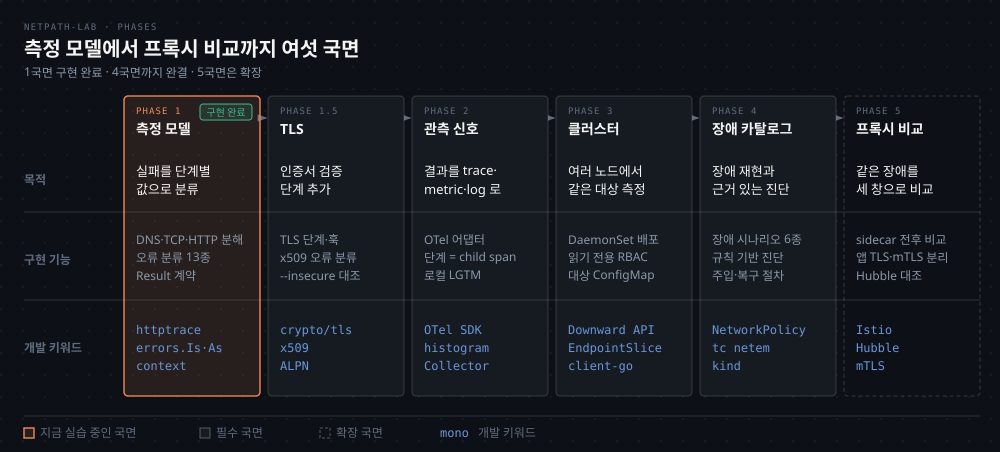

# netpath-lab — 프로젝트 인덱스

---

> Go 로 직접 만드는 요청 경로 진단 도구 `netpath` 의 인덱스입니다. 국면별 목적과 구현 기능, 개발 키워드, 저장소 규칙을 한곳에 모았습니다.

## 프로젝트 소개

> "연결이 안 된다"는 진단이 아닙니다. 요청 하나를 단계로 갈라서 **어디서 왜 실패했는지**를 말하는 도구입니다.

Pod 에서 목적지까지 요청을 보내면 DNS·TCP·HTTP 중 어느 단계에서든 실패할 수 있습니다. 겉으로는 모두 "연결 실패"로 보이지만 원인은 서로 다릅니다. 예를 들어 `tcp_refused` 는 호스트가 RST 로 즉답한 경우로, Kubernetes 에서는 앱이 포트를 열지 않았다는 뜻입니다. `tcp_timeout` 은 아무 답이 없는 경우로, NetworkPolicy 가 패킷을 버렸다는 뜻에 가깝습니다. 둘을 하나로 묶으면 진단이 반대 방향을 가리키므로, 이 도구는 단계와 실패 종류를 값으로 갈라 기록합니다.

```bash
./bin/netpath http://127.0.0.1:9

DNS          -  실행되지 않음
TCP      0.2ms  실패: tcp_refused (dial tcp 127.0.0.1:9: connect: connection refused)
HTTP         -  실행되지 않음
                Total 0.2ms

실패 단계: tcp (tcp_refused)
```

외부 의존 없이 Go 표준 라이브러리(`net/http/httptrace`)만으로 단계 경계를 잽니다. 만드는 과정에서 Go 의 에러 처리와 `context`, 동시성, 네트워크 프로그래밍을 함께 익히는 것도 이 프로젝트의 목표입니다.


## 국면별 로드맵

> 측정 모델에서 시작해 관측 신호, 클러스터, 장애 카탈로그, 프록시 비교로 넓혀 갑니다. **4국면까지가 완결**이고 5국면은 확장입니다.



뒤 국면은 앞 국면이 만든 어휘 위에서 설명됩니다. span 을 나누려면 단계가 먼저 나뉘어 있어야 하고, 노드별 차이를 말하려면 한 노드에서 재는 법이 먼저 있어야 하기 때문입니다.

| 국면 | 구현 기능 | 개발 키워드 | 상태 |
|---|---|---|---|
| 1 측정 모델 | 단계 분해, 오류 분류 13종, `Result` 계약, CLI | `httptrace`, `errors.Is`/`As`, errno, `context`, mutex | 구현 완료 |
| 1.5 TLS | TLS 단계와 훅, x509 오류 분류, `--insecure`·`--http1.1` | `crypto/tls`, `x509`, ALPN, 함수형 옵션 | 대기 |
| 2 관측 신호 | OTel 어댑터, 단계별 child span, 로컬 LGTM | OTel Go SDK, histogram, Collector, trace_id | 대기 |
| 3 클러스터 | DaemonSet 배포, 읽기 전용 RBAC, 대상 ConfigMap | Downward API, EndpointSlice, `client-go` | 대기 |
| 4 장애 카탈로그 | 장애 시나리오 6종, 규칙 기반 진단 | NetworkPolicy, CoreDNS, `tc netem`, kind | 대기 |
| 5 프록시 비교 | sidecar 전후 비교, 앱 TLS와 mTLS 분리 | Istio, Hubble, AuthorizationPolicy | 대기 |

### 1국면 여덟 단계

코드가 이미 있는 국면이라, 실습은 이 여덟 단계를 실패 상황으로 거꾸로 되짚습니다.

| 단계 | 파일 | 구현 | 개발 키워드 |
|---|---|---|---|
| 1 | `types/error.go` | 오류 분류 상수 | named type + const |
| 2 | `types/result.go` | 출력 계약 | struct tag, `omitempty`, 포인터 |
| 3 | `utils/http.go` | Transport 조립, 잔여 타임아웃 | `Clone()`, `DisableKeepAlives` |
| 4 | `probe/trace.go` | 훅 6개로 시각 수집 | `httptrace`, mutex, 메서드 리시버 |
| 5 | `probe/classify.go` | 에러 → `ErrorKind` | `errors.Is`/`As`, `syscall` |
| 6 | `probe/probe.go` | 실행·조립·에러 귀속 | `context.WithTimeout`, `defer` |
| 7 | `types/render.go` | waterfall 출력 | `strings.Builder` |
| 8 | `cmd/netpath/main.go` | 플래그·종료 코드 | `flag`, `json.Encoder` |

1국면을 짜면 Go 로드맵의 네 단계가 한꺼번에 걸립니다. 에러를 값으로 다루는 2단계와 `context` 의 4단계, 고루틴과 동기화의 7단계, 소켓과 네트워크의 11단계입니다. 학습 순서는 [go-roadmap](../../../roadmap/go-roadmap.md) 과 [network-roadmap](../../../roadmap/network-roadmap.md) 이 맡습니다.

### 국면 후보

다섯 국면 밖에서 필요가 생기면 여는 후보입니다. 정해진 순서는 없습니다.

| 후보 | 보태는 것 | 난이도 |
|---|---|---|
| 다중 대상 worker pool | 대상 수십 개를 한 번에 측정 (`errgroup`) | 하 |
| ICMP·gRPC·QUIC probe | HTTP 밖의 경로 측정 | 중 |
| 이벤트 히스토리 | K8s Event watch로 "5분 전" 추적 | 중 |
| 멀티 클러스터 | kubeconfig context 전환 | 중 |
| 웹 UI | 노드×대상 매트릭스 화면 | 중 |
| Kafka 알림 연동 | 알림 경로이자 관측 대상 | 하 |
| 원격 probe | 사설망 안에서 재고 결과만 전송 | 상 |
| 관측 지점 자동 배치 | 대상별 측정 노드 선택 | 상 |


## 저장소 구조와 컨벤션

> 코드는 `~/study/netpath-lab` 에 있습니다. 의존은 `types` 에서 `cmd` 쪽으로 한 방향으로만 흐르고, 핵심 규칙 일곱 개는 `AGENTS.md` 에 있습니다.

```bash
netpath-lab/
├── types/     # Result 스키마와 오류 코드. 유일한 계약
├── utils/     # 상태 없는 헬퍼 (Transport 조립, 타임아웃 계산)
├── probe/     # 측정 코어. K8s·OTel 을 모른다
├── cmd/       # CLI (플래그, 종료 코드)
└── docs/      # 계획(direction·phase1-guide), 스키마, 실습 지시서, 개념 메모
```

`types` 는 아무것도 import 하지 않습니다. `probe` 는 `types` 와 `utils` 만 쓰고, `cmd` 가 맨 위에서 전부를 씁니다. 뒤 국면의 exporter 도 `types.Result` 만 읽게 되므로, 측정 코어를 건드리지 않고 출력 계층을 갈아끼울 수 있습니다.

### 컨벤션

| 규칙 | 이유 |
|---|---|
| `probe/` 는 K8s·OTel 을 import 하지 않음 | 관측 계층을 갈아끼우려고. `make lint` 가 간접 의존까지 막음 |
| `types/` 가 유일한 계약 | 계약이 런타임 패키지에 있으면 의존 방향이 뒤집힘 |
| 에러는 `errors.Is`/`As` 로만 분류 | 메시지는 OS·Go 버전마다 달라 조용히 깨짐 |
| 실행 안 된 단계는 `skipped` | "0ms 성공"과 "안 돌았음"은 다른 사실 |
| 프로브마다 새 Transport | 커넥션을 재사용하면 연결 훅이 불리지 않음 |
| 프로버는 재시도하지 않음 | 재시도는 관측할 대상이지 기능이 아님 |
| 커밋 전 `make check` | vet·gofmt·코어 경계·`test -race` 를 한 번에 확인 |

```bash
cd ~/study/netpath-lab
make build                                  # bin/netpath (CGO_ENABLED=0)
./bin/netpath --json http://127.0.0.1:9 | jq
make check                                  # vet + lint + test -race
```

설계 근거는 저장소의 `docs/direction.md`, 1국면 작업 순서는 `docs/phase1-guide.md`, JSON 스키마는 `docs/result-schema.md` 에 있습니다.


## 학습 기록

> 실습 기록은 편마다 따로 둡니다. 이 README 에는 목록만 둡니다.

| 편 | 내용 | 상태 |
|---|---|---|
| [01-01 실습 - 포트에 아무도 없을 때](./01-01.%EC%8B%A4%EC%8A%B5%20-%20%ED%8F%AC%ED%8A%B8%EC%97%90%20%EC%95%84%EB%AC%B4%EB%8F%84%20%EC%97%86%EC%9D%84%20%EB%95%8C.md) | `tcp_refused`·`tcp_unreachable`, DNS 건너뛰기, named type, 포인터와 `omitempty` | Phase 3 진행 중 |
