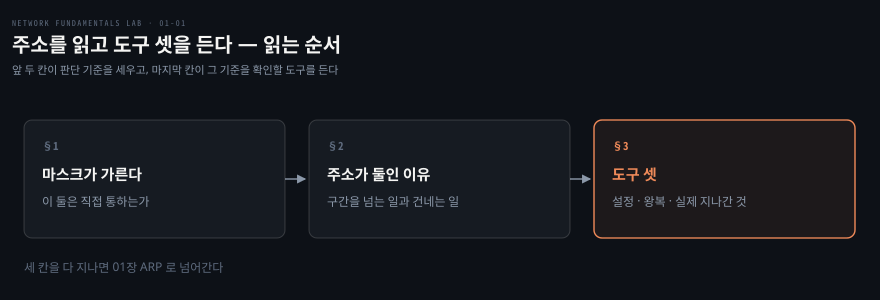
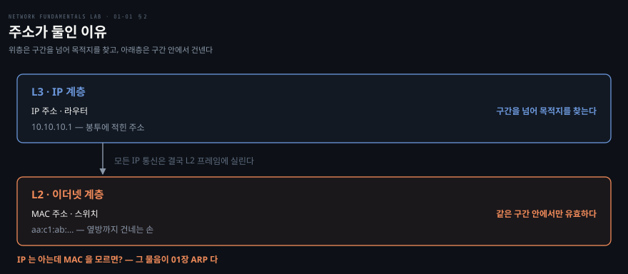

# 주소를 읽고 도구 셋을 든다

---

> 저장소 18편 중 유일하게 고장이 없는 편입니다. 저자는 다음 편이 `ip addr add 10.10.10.1/24` 로 곧장 시작해도 벽이 되지 않도록 이 편을 앞에 두었습니다.

## 핵심 요약

> 이 편이 매달린 하나의 생각은 **주소가 둘이고 도구도 그 둘을 따라 갈린다**는 것입니다.

IP 는 구간을 넘어 목적지를 찾는 논리 주소이고 MAC 은 같은 구간 안에서만 통하는 배달 수단입니다. 이 둘이 왜 동시에 필요한지가 다음 편(ARP)의 주제이고, 시리즈 전체가 이 계층 사다리를 따라 올라갑니다.

서브넷 마스크는 그 사다리의 첫 칸입니다. 두 주소가 같은 구간인지 아닌지를 마스크가 결정하고, 그 판단이 "직접 보낼 수 있는가, 라우터를 거쳐야 하는가"를 가릅니다. 저장소가 이 편을 맨 앞에 둔 이유가 여기 있습니다.

도구 셋은 이 계층을 각각 다른 높이에서 봅니다. `ip` 가 설정된 상태를, `ping` 이 왕복 성립 여부를, `tcpdump` 가 실제로 선을 지나간 것을 보여 줍니다. 앞의 둘이 "어떻게 되어 있나"와 "되나 안 되나"를 답한다면 마지막 하나만이 "무엇이 실제로 일어났나"를 답합니다.


## 학습 목표

> 이 편을 읽고 나면 아래 네 가지를 스스로 해낼 수 있습니다.

1. 두 IP 가 같은 네트워크인지를 마스크 비트 비교로 계산해 설명할 수 있습니다.
2. MAC 주소와 IP 주소의 역할 차이를 한 문장씩으로 말할 수 있습니다.
3. `ip`·`ping`·`tcpdump` 가 각각 어느 질문에 답하는 도구인지 구분할 수 있습니다.
4. 한쪽에 `tcpdump` 를 켜 두고 다른 쪽에서 트래픽을 만들어 관찰하는 2단 배치를 스스로 구성할 수 있습니다.

아래는 이 편의 절 셋을 읽는 순서로 이은 지도입니다. 각 칸의 절 번호가 본문에서 그것을 다루는 자리입니다.




## 1. `/24` 를 못 읽으면 첫 줄에서 멈춥니다

> 마스크는 주소의 장식이 아니라 "이 둘이 직접 통할 수 있는가"라는 판단을 담은 선언입니다.

### 풀려는 문제

다음 편의 실습은 `ip addr add 10.10.10.1/24` 로 시작합니다. 여기서 `/24` 를 "그냥 흔한 값" 으로 넘기면 곧바로 막히는 자리가 옵니다. 01편의 대표 고장 중 하나가 서브넷 불일치인데, 그 증상을 판정하려면 두 주소가 같은 구간인지를 손으로 계산할 수 있어야 하기 때문입니다.

### 32비트를 어디서 자르는가

`10.10.10.1` 은 사람이 읽기 위한 표기일 뿐이고 실체는 32비트입니다.

```bash
10       .10      .10      .1
00001010 00001010 00001010 00000001
```

`/24` 는 그 32비트 중 **앞 24비트가 네트워크 부분이고 나머지 8비트가 호스트 부분**이라는 선언입니다. `10.10.10.1/24` 라면 네트워크는 `10.10.10.0` 이고 호스트가 쓸 수 있는 범위는 `10.10.10.1` 부터 `10.10.10.254` 까지입니다. 뒤 8비트가 256가지를 표현하는데 네트워크 주소와 브로드캐스트 주소를 빼기 때문에 254개입니다.

그래서 판단 기준이 한 줄로 정리됩니다. **두 IP 가 같은 네트워크인가는 마스크만큼의 앞 비트가 같은가입니다.** 같으면 직접 보낼 수 있고, 다르면 라우터를 거쳐야 합니다.

### 마스크가 판단을 바꿉니다

같은 주소 쌍이라도 마스크가 다르면 답이 달라집니다. `192.168.1.100` 과 `192.168.99.1` 은 `/24` 로 보면 세 번째 옥텟이 달라 다른 네트워크이지만, `/16` 으로 보면 앞 16비트 `192.168` 만 비교하므로 같은 네트워크입니다. 주소만 보고 판단하면 틀리고 마스크까지 봐야 맞습니다.

라우터 사이를 잇는 전송망에 `/30` 이 자주 쓰이는 것도 같은 계산에서 나옵니다. 호스트 비트가 2개면 표현할 수 있는 주소가 4개이고 여기서 둘을 빼면 **쓸 수 있는 주소가 딱 2개**입니다. 링크 양 끝에 하나씩, 그 이상은 필요 없습니다.

원문이 붙여 둔 연습 네 문항은 답을 옮기지 않았습니다. 위 기준으로 직접 계산해 본 뒤 저장소의 접힌 답과 맞춰 보는 편이 낫습니다.

1. `10.10.10.1/24` 와 `10.10.10.200/24` 는 같은 네트워크입니까?
2. `10.10.10.1/24` 와 `10.10.20.2/24` 는 같은 네트워크입니까?
3. `192.168.1.100/16` 과 `192.168.99.1/16` 은 같은 네트워크입니까?
4. `10.5.2.10/24` 네트워크의 주소 개수는 몇 개이고, `/30` 이라면 몇 개입니까?


## 2. 주소가 둘인 이유

> 구간을 넘는 일과 구간 안에서 건네는 일은 다른 문제라서, 각각에 다른 주소가 필요합니다.



편지에 비유하면 IP 는 봉투에 적힌 주소이고 MAC 은 그 봉투를 옆방까지 건네는 손입니다. 비유는 여기까지이고 실제 차이는 유효 범위에 있습니다.

MAC 은 NIC 에 박힌 고유 주소이고 **같은 케이블이나 스위치 구간 안에서만** 유효합니다. 구간을 넘어가면 의미가 없습니다. IP 는 설정으로 부여하는 논리 주소이고 **구간을 넘어** 목적지를 찾는 기준이 됩니다. 둘은 대체 관계가 아니라 층이 다릅니다.

핵심은 **모든 IP 통신이 결국 L2 프레임에 실려 나간다**는 것입니다. IP 주소를 알아도 그것을 실어 보낼 프레임의 목적지 MAC 을 모르면 한 걸음도 못 나갑니다. "IP 는 아는데 MAC 을 모르면 어떻게 하나"가 바로 다음 편 ARP 의 주제이고, 시리즈의 진행 자체가 이 사다리를 따릅니다. L2 가 01~03편, L3 가 04~06편, 그 위가 08편부터입니다.


## 3. 도구 셋은 각각 다른 질문에 답합니다

> 셋을 같은 용도로 쓰면 진단이 겹칩니다. 각각이 답하는 질문이 다릅니다.

저장소는 `00-onramp/playground.clab.yml` 로 `h1 ── h2` 직결 연습장을 띄웁니다. 고장이 없는 유일한 토폴로지라 도구에만 집중할 수 있습니다.

### `ip` — 지금 어떻게 설정돼 있는가

```bash
docker exec clab-00-onramp-h1 ip -br addr show eth1
docker exec clab-00-onramp-h1 ip route
docker exec clab-00-onramp-h1 ip route get 10.0.0.2
```

`-br` 은 인터페이스·상태·주소를 한 줄로 줄여 줍니다. 셋째 줄의 `ip route get` 이 특히 중요합니다. 라우팅 테이블 전체를 눈으로 훑어 해석하는 대신 **커널에게 "이 목적지에 어떻게 가느냐"를 직접 물어** 답을 받는 명령이라, 05편 블랙홀처럼 테이블이 복잡해질수록 값이 커집니다.

### `ping` — 왕복이 성립하는가

```bash
docker exec clab-00-onramp-h1 ping -c1 10.0.0.2
```

`ping` 이 답하는 것은 "왕복이 되는가" 하나뿐입니다. 되면 L3 경로가 양방향으로 성립한다는 뜻이고, 안 되면 어디가 문제인지까지는 말해 주지 않습니다. 15편이 이 한계를 정면으로 다룹니다. `ping` 실패는 서비스 다운과 같은 말이 아닙니다.

### `tcpdump` — 실제로 무엇이 지나갔는가

```bash
docker exec clab-00-onramp-h2 tcpdump -nli eth1 icmp   # 터미널 1 — 먼저 켠다
docker exec clab-00-onramp-h1 ping -c1 10.0.0.2        # 터미널 2 — 그다음 만든다
```

앞의 두 도구가 설정과 결과를 본다면 이것만이 **선을 실제로 지나간 것**을 봅니다. 성공하면 터미널 1에 echo request 와 echo reply 가 한 쌍으로 올라옵니다. 요청만 보이고 응답이 없다면 문제는 가는 길이 아니라 오는 길에 있습니다. 다만 **어디서 캡처했는지와 함께** 읽어야 합니다. 04편처럼 목적지에서는 응답을 보냈는데도 발신자에게 안 닿는 경우가 있어서, 한쪽 캡처만으로는 어느 구간이 끊겼는지가 안 갈립니다.

옵션 네 개는 시리즈 내내 같은 조합으로 반복되므로 여기서 외워 두는 편이 낫습니다.

- `-n`: 이름 해석을 끕니다. 빨라지고, DNS 가 죽은 상황에서도 멈추지 않습니다
- `-l`: 줄 단위로 버퍼를 비웁니다. 파이프로 넘길 때 출력이 밀리지 않습니다
- `-i eth1`: 어느 인터페이스에서 뜰지 지정합니다
- `-c N`: N개만 잡고 종료합니다

**관찰 순서가 도구 사용의 절반입니다.** `tcpdump` 를 먼저 켜고 나서 트래픽을 만들어야 합니다. 반대로 하면 이미 지나간 패킷은 잡히지 않습니다. 터미널을 둘 쓰는 이 2단 배치가 시리즈 전편의 기본형입니다.


## 4. 실습 메모

> 아직 돌리지 않았습니다. 아래는 배포 절차와 볼 지점이고, 실측 칸은 Phase 3 에서 직접 재서 채웁니다.

배포와 정리는 저장소 루트에서 실행합니다.

```bash
./clab.sh deploy 00-onramp/playground.clab.yml
./clab.sh destroy 00-onramp/playground.clab.yml
```

무엇을 볼지 미리 정해 두면 관찰이 흐트러지지 않습니다.

| 단계 | 명령 | 볼 것 |
|---|---|---|
| 상태 | `ip -br addr show eth1` | 주소와 마스크가 의도대로 붙었는가, 링크가 UP 인가 |
| 경로 | `ip route get 10.0.0.2` | 커널이 고른 출력 인터페이스와 소스 주소 |
| 왕복 | `ping -c1 10.0.0.2` | 손실률과 왕복 시간 |
| 실제 | `tcpdump -nli eth1 icmp` | request 와 reply 가 **쌍으로** 오는가 |

| 실측 항목 | 값 | 잰 날 |
|---|---|---|
| `clab.sh` 배포 성공 여부 | | |
| OrbStack 소켓 경로 해결 방식 | | |
| `ping` 왕복 시간 | | |
| `tcpdump` 에 잡힌 ICMP 쌍 | | |

막힌 지점과 예상과 달랐던 것은 Phase 3 에서 이 아래에 적습니다.

이 편의 통과 기준은 저장소가 셋으로 정해 두었습니다.

1. `10.10.10.1/24` 와 `10.10.20.2/24` 가 왜 다른 네트워크인지 계산으로 설명할 수 있습니다.
2. MAC 주소와 IP 주소의 역할 차이를 한 문장씩 말할 수 있습니다.
3. `tcpdump` 를 한쪽에 켜 두고 다른 쪽에서 트래픽을 만들어 관찰할 수 있습니다.

셋 다 되면 다음 편으로 넘어갑니다.


## 관련 문서

- [network-fundamentals-lab 실습 인덱스](./README.md) — 블록 구조와 18장 목표
- [같은 세그먼트 안에서만 통한다](./02-01.%EA%B0%99%EC%9D%80%20%EC%84%B8%EA%B7%B8%EB%A8%BC%ED%8A%B8%20%EC%95%88%EC%97%90%EC%84%9C%EB%A7%8C%20%ED%86%B5%ED%95%9C%EB%8B%A4.md) — 다음 편. ARP 가 IP 를 MAC 으로 바꾸는 자리
- [02_os/networking/](../../networking/README.md) — netns·veth·bridge 같은 커널 메커니즘의 SSOT
- [패킷을 잡는 법](../paw_packet-analysis-wireshark/02-01.%ED%8C%A8%ED%82%B7%EC%9D%84%20%EC%9E%A1%EB%8A%94%20%EB%B2%95.md) — 캡처 위치와 필터를 깊이 다루는 편
