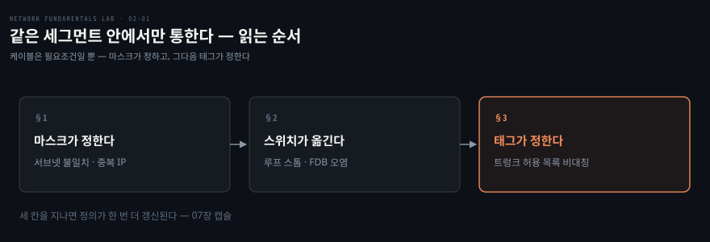
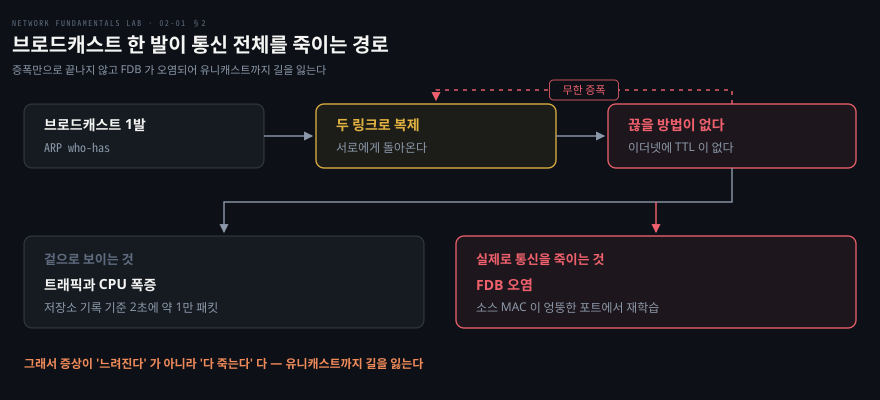

# 같은 세그먼트 안에서만 통한다

---

> 저장소 01·02·03편을 묶었습니다. 세 편이 각각 ARP·브로드캐스트 스톰·VLAN 을 다루지만 밑에 깔린 물음은 하나입니다 — **"같은 L2"라는 말이 정확히 무엇을 뜻하는가.**

## 핵심 요약

> 이 편이 매달린 하나의 생각은 **"같은 L2"를 정하는 것이 케이블이 아니라 설정**이라는 것입니다.

같은 스위치에 꽂혀 있어도 IP 와 마스크가 다르면 직접 통할 수 없습니다. 같은 서브넷이어도 VLAN 태그가 다르면 ARP 조차 넘어가지 못합니다. 물리 배선은 통신의 필요조건일 뿐 충분조건이 아니고, 저장소는 이 명제를 01편에서 세워 03편에서 한 번 더 확장합니다.

그 사이에 02편이 들어가는 이유가 있습니다. 01편과 03편이 "누가 같은 세그먼트인가"를 다룬다면, 02편은 **그 세그먼트 안에서 스위치가 실제로 무슨 일을 하는가**를 엽니다. 스위치의 동작 원리는 배우고 모르면 뿌리는 두 줄로 끝나는데, 그 단순함이 성능의 비결이면서 동시에 루프 앞에서 무너지는 이유이기도 합니다.

세 편을 관통하는 실무 감각은 순서입니다. 위 계층 문제를 진단할 때도 **L2 부터 성립하는지 먼저 확인**하는 습관이 여기서 붙습니다.


## 학습 목표

> 이 편을 읽고 나면 아래 다섯 가지를 스스로 해낼 수 있습니다.

1. ARP 가 IP 통신의 첫 단추인 이유를 설명하고, `tcpdump` 로 who-has 와 is-at 쌍을 확인할 수 있습니다.
2. 같은 스위치에 꽂혀 있는데도 통신이 안 되는 상황을 서브넷 불일치와 중복 IP 두 가지로 갈라 진단할 수 있습니다.
3. 스위치의 MAC 학습과 플러딩 동작을 `bridge fdb show` 출력으로 읽을 수 있습니다.
4. L2 루프가 스스로 끝나지 않는 이유를 이더넷 프레임의 구조로 설명하고, 스톰이 유니캐스트까지 죽이는 경로를 말할 수 있습니다.
5. 트렁크 장애의 지문을 "태그는 도착하는데 무응답"으로 식별하고 양단 허용 목록을 대조할 수 있습니다.

아래는 이 편의 절 셋이 "같은 L2" 의 정의를 어떻게 갱신해 가는지 이은 지도입니다.




## 1. 같은 네트워크는 케이블이 정하지 않습니다

> 목적지가 같은 서브넷이면 ARP 로 MAC 을 구해 직접 보내고, 아니면 라우터로 넘깁니다. 그 판단을 마스크가 합니다.

### 풀려는 문제

"같은 스위치에 꽂혀 있는데 왜 안 되죠"는 실무에서 반복되는 물음입니다. 선은 멀쩡하고 링크도 UP 인데 통신이 안 됩니다. 이 증상은 원인이 둘로 갈리는데, 둘을 가르지 못하면 엉뚱한 곳을 봅니다.

### ARP 가 첫 단추입니다

이더넷 프레임은 **목적지 MAC** 으로 전달됩니다. 그런데 우리가 아는 것은 보통 목적지 IP 뿐입니다. 그래서 프레임을 만들려면 "그 IP 를 가진 장비의 MAC" 을 먼저 알아내야 하고, 그 역할이 ARP 입니다.

순서는 셋입니다. h1 이 브로드캐스트로 `who-has 10.10.10.2 tell 10.10.10.1` 을 뿌리면, 해당 IP 를 가진 h2 만 유니캐스트로 `10.10.10.2 is-at aa:bb:cc:…` 라고 답합니다. h1 은 그 대응을 ARP 캐시에 저장하고 그다음에야 ICMP 가 오갑니다.

```bash
docker exec clab-01-l2-arp-h2 tcpdump -e -ni eth1 arp   # 터미널 1 — 먼저 켠다
docker exec clab-01-l2-arp-h1 ip neigh flush all        # 터미널 2 — 캐시를 비우고
docker exec clab-01-l2-arp-h1 ping -c1 10.10.10.2       #            핑을 쏜다
```

`-e` 를 붙이는 이유가 여기서 생깁니다. MAC 주소까지 찍어야 누가 답했는지 보이고, 그 정보가 다음 고장을 가르는 근거가 됩니다.

### 증상이 같아도 원인은 둘입니다

첫째는 **서브넷 불일치**입니다. h2 에 `10.10.20.2/24` 를 주면 h1 기준으로 다른 서브넷이라 ARP 를 **시도조차 하지 않습니다.** 커널이 즉시 `Network unreachable` 로 거절합니다. 여기가 중요한데, h2 쪽에서 `tcpdump` 를 켜 두어도 **h1 의 ARP 요청이 아예 오지 않습니다.** 실패가 선 위에서 일어나지 않고 커널의 판단 단계에서 끝나기 때문입니다.

둘째는 **중복 IP** 입니다. h3 에도 h2 와 같은 주소를 주면 하나의 IP 에 서로 다른 MAC 둘이 응답합니다. 지문은 `arping` 에서 가장 선명합니다.

```bash
docker exec clab-01-l2-arp-h1 arping -c3 -I eth1 10.10.10.2
```

**probe 를 3개 보냈는데 응답이 4개 오면 중복입니다.** 보낸 것보다 받은 것이 많다는 사실 자체가 증거라, 서로 다른 MAC 을 눈으로 대조하기 전에 이미 판정이 납니다. 이 상태에서는 h1 의 ARP 캐시가 두 MAC 사이에서 흔들리고 트래픽이 엉뚱한 쪽으로 갑니다. "가끔 되고 가끔 안 되는" 장애의 전형입니다.

두 고장의 판별은 한 줄로 갈립니다. **ARP 요청이 선에 안 보이면 서브넷 불일치이고, 응답이 여럿이면 중복 IP 입니다.**


## 2. 스위치는 배우고, 모르면 뿌립니다

> 스위치의 동작은 두 줄로 끝납니다. 그 단순함이 성능의 비결이면서 루프 앞에서 무너지는 이유입니다.



### 학습과 플러딩

스위치는 프레임이 **들어온 포트와 소스 MAC** 을 기록합니다. 이것이 학습이고 그 결과가 FDB(CAM 테이블)입니다. 그다음 목적지 MAC 이 테이블에 있으면 그 포트로만 보내고, 없으면 **전 포트로 플러딩**합니다. 브로드캐스트는 언제나 전 포트로 갑니다. 앞 절의 ARP 가 모두에게 도달한 이유가 이것입니다.

```bash
docker exec clab-02-bcast-loop-sw1 bash -c "bridge fdb show br0 | grep -v permanent"
```

`grep -v permanent` 를 거는 이유는 브리지 자신의 고정 항목을 걷어내야 학습된 것만 남기 때문입니다. h1 에서 ping 한 번을 보내면 h1 의 MAC 이 h1 쪽 포트에서, h2 의 MAC 이 sw2 방향 포트에서 학습된 것이 보입니다.

### 루프가 증폭기가 되는 이유

스위치 사이에 경로가 둘이면 브로드캐스트가 양쪽으로 복제되어 서로에게 돌아옵니다. 문제는 여기서 끝나지 않는다는 데 있습니다. **이더넷 프레임에는 TTL 이 없습니다.** IP 패킷이라면 홉마다 깎이는 값이 0 이 되어 폐기되지만, L2 에는 그런 장치가 없어 한 번 돌기 시작한 프레임을 끊을 방법이 없습니다.

증폭만으로도 충분히 나쁘지만 진짜 타격은 그다음입니다. 돌고 있는 프레임의 소스 MAC 이 **엉뚱한 포트에서 재학습**됩니다. h2 의 MAC 이 루프 링크 쪽 포트에서 학습되면 스위치는 h2 로 가는 유니캐스트를 그쪽으로 보냅니다. 브로드캐스트 하나가 일으킨 일인데 유니캐스트까지 길을 잃습니다.

그래서 증상이 "느려진다"가 아니라 **"다 죽는다"** 입니다. 저장소의 실측 기록으로는 루프 점화 직후 h2 의 수신 카운터가 2초에 약 1만 패킷씩 늘었고, 그 와중에 ping 은 100% 손실이었습니다. 트래픽은 폭증하는데 통신은 안 되는 상태입니다.

> **안전 수칙**: 이 랩의 스톰은 Docker VM 안에 갇히지만 CPU 를 폭식합니다. 저장소가 탈출 명령을 미리 띄워 두고 시작하라고 경고합니다 — `ip link set eth3 down` 으로 루프를 끊습니다.

### STP 가 하는 일

```bash
docker exec clab-02-bcast-loop-sw1 ip link set br0 type bridge stp_state 1
docker exec clab-02-bcast-loop-sw2 ip link set br0 type bridge stp_state 1
```

STP 는 스위치끼리 BPDU 를 교환해 루프 구간의 **한 포트를 blocking 으로 잠급니다.** 물리적으로는 링이지만 논리적으로는 트리가 됩니다. 링크가 끊어지면 잠겼던 포트가 살아나므로 이중화 목적도 함께 달성합니다.

켠 직후와 수렴 후의 효과가 다르다는 점이 흥미롭습니다. 켜는 순간 포트가 일단 non-forwarding 으로 되돌아가 **돌던 프레임이 그 자리에서 끊깁니다.** 그다음 30초쯤 수렴을 거쳐야 blocking 포트가 정해지고 정상 통신이 돌아옵니다.

여기서 나오는 결론이 실무적입니다. **선 두 개를 꽂는다고 대역폭이 두 배가 되지 않습니다.** 이중화를 원하면 STP 나 LACP 같은 장치가 반드시 함께 가야 합니다.


## 3. 태그가 소속을 정합니다

> 같은 서브넷, 같은 스위치에 있어도 VLAN 이 다르면 ARP 가 넘어가지 못합니다. 이건 고장이 아니라 VLAN 의 존재 이유입니다.

### 액세스와 트렁크

VLAN 은 논리적 브로드캐스트 도메인입니다. 프레임이 트렁크를 지날 때 **802.1Q 태그(12비트 VLAN ID)** 가 붙어 "이 프레임은 VLAN 10 소속" 이라고 밝힙니다.

- 액세스 포트: 호스트는 태그를 모릅니다. 스위치가 포트 설정(PVID)으로 소속을 정해 줍니다
- 트렁크 포트: 여러 VLAN 을 태그로 구분해 다중화합니다. 단 **허용 목록에 있는 VID 만** 통과합니다

### 태그는 도착하는데 무응답인 지문

03편에 장전된 고장은 sw2 트렁크 포트의 허용 목록에서 vid 10 이 빠진 것입니다. 증상은 "같은 VLAN 인데 스위치를 넘으면 끊긴다" 입니다.

트렁크에서 캡처를 뜨면 판별이 끝납니다. `vlan 10` 태그를 단 ARP 요청이 sw2 의 문 앞까지 **도착해 반복되고 있는데 응답이 없습니다.** 프레임이 도달하지 못하는 것이 아니라, 도달한 뒤 수신측 ingress 필터가 허용 목록에 없는 vid 를 조용히 버리는 것입니다. 저장소는 이 지문이 07편 VNI 불일치와 같은 부류라고 미리 짚어 둡니다.

```bash
docker exec clab-03-vlan-trunk-sw1 bridge vlan show dev eth2
docker exec clab-03-vlan-trunk-sw2 bridge vlan show dev eth2
```

범인은 양단 대조에서 나옵니다. 한쪽에 10 과 20 이 있고 다른 쪽에 20 만 있으면 그 자리가 원인입니다. **트렁크는 양 끝의 허용 목록이 대칭이어야 합니다.** 한쪽에만 있는 VLAN 은 그 방향의 프레임이 편도로 버려집니다. VLAN 을 추가할 때 트렁크 양단을 함께 고치라는 변경 관리 규칙이 여기서 나옵니다.

### 안 되는 것이 정상인 경우

고친 뒤에도 h1(VLAN 10)에서 h3(VLAN 20)로는 여전히 안 갑니다. `ip neigh` 에 `FAILED` 가 뜨고 ARP 조차 넘어가지 않습니다. **이건 고장이 아닙니다.** h3 는 같은 서브넷이고 같은 스위치에 있지만 VLAN 이 다르므로 브로드캐스트가 경계를 넘지 못하고, 따라서 L2 가 성립하지 않습니다. 격리가 곧 기능입니다.

그래서 앞 절의 명제가 한 칸 갱신됩니다. 01편이 "같은 네트워크는 케이블이 아니라 IP 와 마스크가 정한다"였다면, 여기서는 **"같은 L2 조차 케이블이 아니라 태그가 정한다"** 가 됩니다. 같은 서브넷이라는 사실만으로는 통신이 보장되지 않고, **L2 소속이 먼저입니다.**


## 4. 실습 메모

> 아직 돌리지 않았습니다. 세 랩을 하나씩 띄우고 내리며, 아래 관전 포인트를 확인한 뒤 실측 칸을 채웁니다.

```bash
./clab.sh deploy  01-l2-arp/01-l2-arp.clab.yml
./clab.sh destroy 01-l2-arp/01-l2-arp.clab.yml
./clab.sh deploy  02-bcast-loop/02-bcast-loop.clab.yml
./clab.sh destroy 02-bcast-loop/02-bcast-loop.clab.yml
./clab.sh deploy  03-vlan-trunk/03-vlan-trunk.clab.yml
./clab.sh destroy 03-vlan-trunk/03-vlan-trunk.clab.yml
```

호스트당 랩 하나만 뜨므로 앞 랩을 내리고 다음을 띄웁니다.

| 편 | 무엇을 만드나 | 볼 것 |
|---|---|---|
| 01 A | 캐시 비우고 ping | who-has 와 is-at 이 **쌍으로** 뜨는가, 그 뒤에 ICMP 가 오는가 |
| 01 B | h2 를 다른 서브넷으로 | ARP 요청이 선에 **안 보이는가** (커널이 먼저 거절) |
| 01 C | h3 에 중복 IP | `arping` 에서 probe 3 대비 응답이 **더 많은가** |
| 02 A | 없는 MAC 으로 전송 | h2 에 **자기 것이 아닌** 프레임이 뜨는가 |
| 02 B | `eth3` 을 up | rx 카운터 증가율, ping 손실률, h2 MAC 이 학습된 **포트** |
| 02 수정 | STP on | 증가율이 즉시 꺾이는가, 30초 뒤 blocking 포트가 생기는가 |
| 03 B | 트렁크 캡처 | `vlan 10` 태그가 **도착하고도** 무응답인가 |
| 03 C | 양단 `bridge vlan show` | 허용 목록이 비대칭인가 |

| 실측 항목 | 값 | 잰 날 |
|---|---|---|
| 01 B 에서 ARP 요청 관측 여부 | | |
| 01 C `arping` probe 대 응답 수 | | |
| 02 점화 전후 rx 증가율 | | |
| 02 스톰 중 h2 MAC 이 학습된 포트 | | |
| 02 STP 수렴에 걸린 시간 | | |
| 03 h1→h3 격리 유지 확인 | | |

막힌 지점과 예상과 달랐던 것은 Phase 3 에서 이 아래에 적습니다.


## 관련 문서

- [network-fundamentals-lab 실습 인덱스](./README.md) — 블록 구조와 18장 목표
- [주소를 읽고 도구 셋을 든다](./01-01.%EC%A3%BC%EC%86%8C%EB%A5%BC%20%EC%9D%BD%EA%B3%A0%20%EB%8F%84%EA%B5%AC%20%EC%85%8B%EC%9D%84%20%EB%93%A0%EB%8B%A4.md) — 앞 편. 마스크 계산과 도구 셋
- [세그먼트를 넘으면 테이블이 전부다](./03-01.%EC%84%B8%EA%B7%B8%EB%A8%BC%ED%8A%B8%EB%A5%BC%20%EB%84%98%EC%9C%BC%EB%A9%B4%20%ED%85%8C%EC%9D%B4%EB%B8%94%EC%9D%B4%20%EC%A0%84%EB%B6%80%EB%8B%A4.md) — 다음 편. 다른 서브넷을 잇는 라우터
- [라우터 너머에 같은 L2를 만든다](./04-01.%EB%9D%BC%EC%9A%B0%ED%84%B0%20%EB%84%88%EB%A8%B8%EC%97%90%20%EA%B0%99%EC%9D%80%20L2%EB%A5%BC%20%EB%A7%8C%EB%93%A0%EB%8B%A4.md) — "같은 L2" 정의가 캡슐로 한 번 더 갱신되는 자리
- [02_os/networking/](../../networking/README.md) — netns·veth·bridge 커널 메커니즘의 SSOT
