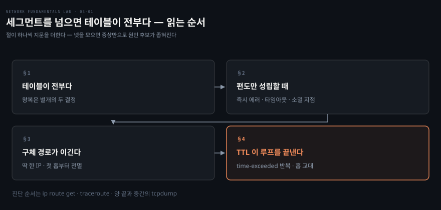
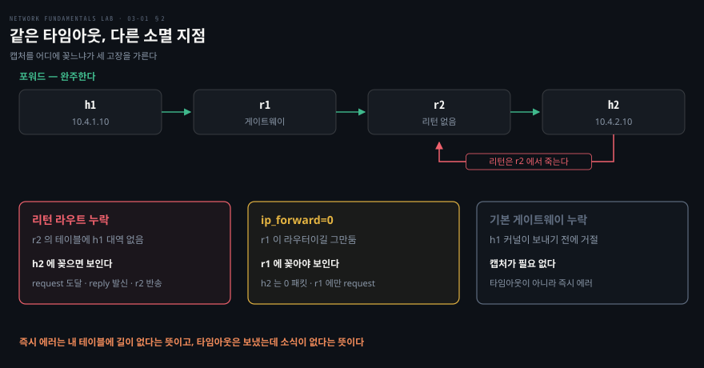

# 세그먼트를 넘으면 테이블이 전부다

---

> 저장소 04·05·06편을 묶었습니다. 세 편이 각각 라우팅 기본·LPM 블랙홀·TTL 루프를 다루는데, 실제로 배우는 것은 **같은 "안 됨"이 남기는 서로 다른 지문**입니다.

## 핵심 요약

> 이 편이 매달린 하나의 생각은 **라우터가 테이블에 있는 대로만 움직이고, 왕복은 별개의 두 결정**이라는 것입니다.

가는 길이 있다고 오는 길이 자동으로 생기지 않습니다. h1 에서 h2 로 가는 경로와 h2 에서 h1 으로 오는 경로는 각 라우터가 따로 결정하므로, 포워드가 완벽해도 리턴 라우트 하나가 없으면 발신자에게는 그냥 타임아웃으로 보입니다. **타임아웃의 원인이 자기 쪽 절반이 아닐 수 있다**는 것이 이 블록의 가장 실무적인 문장입니다.

그래서 이 블록의 진짜 산출물은 라우팅 지식이 아니라 **지문 사전**입니다. 즉시 나는 에러와 타임아웃은 원인 후보가 이미 갈려 있고, 타임아웃 안에서도 목적지까지 갔다 못 돌아온 경우와 중간에서 소멸한 경우가 다릅니다. 05편은 여기에 "딱 한 IP 만 안 됨"을, 06편은 "time-exceeded 가 반복됨"을 더합니다.

진단 순서도 여기서 굳어집니다. 셋을 차례로 밟습니다.

1. `ip route get` 으로 커널이 이 목적지를 어디로 보내려 하는지 묻습니다.
2. `traceroute` 로 어디까지 가는지 봅니다.
3. **양 끝과 중간에 `tcpdump` 를 꽂아** 패킷이 어디서 사라지는지 찾습니다.


## 학습 목표

> 이 편을 읽고 나면 아래 다섯 가지를 스스로 해낼 수 있습니다.

1. 왕복이 두 개의 독립된 결정이라는 것을 설명하고, 리턴 라우트 누락을 캡처 세 줄로 증명할 수 있습니다.
2. 같은 타임아웃을 "갔다가 못 돌아옴" 과 "중간에서 소멸" 로 가르고, 그 판별에 `tcpdump` 를 어디에 꽂을지 정할 수 있습니다.
3. 즉시 나는 `Network unreachable` 과 타임아웃이 왜 다른 원인을 가리키는지 말할 수 있습니다.
4. LPM 규칙을 설명하고, "딱 한 IP 만 안 됨" 증상에서 `/32` 구체 경로를 의심할 수 있습니다.
5. TTL 이 L2 루프와 L3 루프의 결말을 어떻게 가르는지 설명하고, 루프의 지문 세 가지를 댈 수 있습니다.

아래는 이 편의 절 넷을 읽는 순서로 이은 지도입니다.




## 1. 라우터는 테이블이 전부입니다

> 라우터가 하는 일은 목적지 IP 를 테이블과 대조해 next-hop 을 정하는 것 하나입니다. 길이 없으면 버리고 ICMP 로 알립니다.

### 풀려는 문제

앞 블록에서 "같은 세그먼트가 아니면 라우터가 필요하다"까지 왔습니다. 그런데 라우터를 두었는데도 안 되는 경우가 실무에서 훨씬 많습니다. 그때 무엇을 먼저 봐야 할지가 이 절의 주제입니다.

### 테이블과 기본 게이트웨이

라우터는 패킷의 목적지 IP 를 자기 라우팅 테이블과 대조해 next-hop 을 정합니다. 그게 전부입니다. 테이블에 길이 없으면 버리고 발신자에게 ICMP unreachable 로 알립니다. 이 통보가 진단의 기반이라, 나중에 ICMP 를 전부 막으면 진단이 어려워지는 이유가 여기서 생깁니다.

호스트의 **기본 게이트웨이는 "모르는 목적지는 전부 이 라우터로" 라는 특수한 라우트**입니다. 별도 개념이 아니라 `default` 라는 이름의 테이블 항목입니다.

### 왕복은 별개의 두 결정입니다

h1 에서 h2 로 가는 경로와 h2 에서 h1 으로 오는 경로는 **각 라우터가 따로** 결정합니다. 가는 길이 있다고 오는 길이 자동으로 생기지 않습니다.

이 사실이 실무 장애의 단골을 만듭니다. **요청은 가는데 응답이 못 돌아오는** 상황입니다. 04편에 장전된 고장이 정확히 이것이고, 다음 절에서 캡처로 확인합니다.


## 2. 편도만 성립할 때 무엇이 보이는가

> 04편이 주는 고장 셋 중 둘은 발신자에게 똑같은 타임아웃으로 보이고, 캡처를 어디에 꽂느냐가 그 둘을 가릅니다. 나머지 하나는 증상부터 다릅니다.



### 캡처 세 줄이 전부입니다

h2 쪽에서 캡처를 켜고 h1 에서 ping 을 쏘면 이 블록에서 가장 중요한 세 줄이 나옵니다.

```bash
docker exec clab-04-l3-routing-h2 tcpdump -nli eth1 icmp   # 터미널 1
docker exec clab-04-l3-routing-h1 ping -c2 -W2 10.4.2.10   # 터미널 2
```

echo request 가 h2 에 **도달합니다.** h2 는 성실히 echo reply 를 **보냅니다.** 그리고 r2 가 `ICMP net 10.4.1.10 unreachable` 을 h2 에게 돌려보냅니다. 포워드 경로는 완벽했고 죽은 것은 리턴입니다. h2 의 응답이 r2 에 도착했지만 r2 의 테이블에 h1 쪽 대역이 없어 버려진 것입니다.

h1 입장에서는 그냥 타임아웃입니다. 자기가 보낸 것이 목적지까지 갔다는 사실조차 모릅니다. 원인을 r2 에게 직접 물으면 한 줄로 확인됩니다.

```bash
docker exec clab-04-l3-routing-r2 ip route get 10.4.1.10
docker exec clab-04-l3-routing-r2 ip route show
```

`ip route get` 이 `Network unreachable` 을 뱉고, 테이블에 h1 쪽 대역만 빠져 있습니다. 수정은 그 한 줄을 넣는 것입니다.

### 같은 타임아웃, 다른 소멸 지점

04편은 변형 고장 둘을 더 줍니다. 증상이 같은데 원인이 다른 경우를 구분하는 훈련입니다.

**`ip_forward=0`** 을 r1 에 주면 역시 100% 손실입니다. 그런데 캡처 위치를 바꾸면 앞의 고장과 갈립니다. h2 에서는 **0 패킷**이 잡히고 r1 에서는 echo request 가 잡힙니다. 요청이 r1 까지 들어왔는데 r1 이 조용히 삼킨 것입니다. 리턴 누락은 목적지까지 갔다가 못 돌아온 것이고, 포워딩 꺼짐은 중간에서 소멸한 것입니다. **`tcpdump` 를 어디에 꽂느냐로 두 고장이 구분됩니다.**

**기본 게이트웨이 누락**은 아예 증상 자체가 다릅니다. 타임아웃이 아니라 `ping: connect: Network unreachable` 이 **즉시** 납니다. 커널이 보내기 전에 "갈 길 없음" 을 알기 때문입니다.

여기서 첫 번째 지문 규칙이 나옵니다. **즉시 나는 에러는 내 테이블에 길이 없다는 뜻이고, 타임아웃은 보냈는데 소식이 없다는 뜻입니다.** 둘은 원인 후보가 아예 다릅니다.

### traceroute 가 침묵하는 이유

리턴 라우트가 없으면 `traceroute` 도 첫 홉 이후 `*` 로 막힙니다. 각 홉이 돌려주는 time-exceeded 역시 **돌아올 길이 있어야** 발신자에게 도착하기 때문입니다. 그래서 리턴 라우트를 고치면 경로 추적이 통째로 되살아납니다. 홉이 `*` 인 것은 그 라우터가 응답을 안 준 것일 수도, 응답이 돌아올 길이 없는 것일 수도 있습니다.


## 3. 구체 경로 하나가 광역을 무력화합니다

> 매칭되는 경로가 여럿이면 프리픽스가 가장 긴 것 하나만 이깁니다. 그래서 잘못된 `/32` 하나가 IP 한 개만 정확히 죽입니다.

### 킬러 증상

05편의 증상은 **"옆 IP 는 되는데 이 IP 만 안 됨"** 입니다. 같은 서브넷, 같은 호스트, 같은 NIC 인데 주소 하나만 죽습니다.

이 지문이 값진 이유는 범위가 원인을 말해 주기 때문입니다. L2 문제면 호스트째 죽고, 라우트 누락이면 서브넷째 죽습니다. **딱 한 IP 는 구체 경로의 지문**입니다.

원인은 LPM 입니다. `10.5.2.0/24 dev eth2` 와 `blackhole 10.5.2.10/32` 가 공존하면 해당 주소로 가는 패킷은 `/32` 가 낚아채고 나머지 253개는 `/24` 로 정상 흐릅니다. 정상 경로가 테이블에 멀쩡히 있다는 점이 진단을 어렵게 합니다. 있는지를 묻지 말고 **누가 이기는지**를 물어야 합니다.

```bash
docker exec clab-05-lpm-blackhole-r1 ip route get 10.5.2.11   # 정상 — /24 로
docker exec clab-05-lpm-blackhole-r1 ip route get 10.5.2.10   # Invalid argument?!
```

`ip route get` 이 낯선 `Invalid argument` 를 뱉으면 blackhole 이나 prohibit 같은 특수 라우트를 의심합니다. 에러 메시지 자체가 힌트입니다.

### 조용한 폐기와 알려 주는 폐기

| 라우트 타입 | 패킷의 운명 | 발신자가 보는 것 |
|---|---|---|
| `blackhole` | 조용히 폐기 | 타임아웃 — 아무 소식 없음 |
| `unreachable` | 폐기하고 ICMP 반송 | 즉시 Destination Unreachable |

차단이라는 결과는 같은데 발신자가 보는 증상이 다릅니다. **발신자가 본 증상만으로 중간 장비의 처리 방식을 역추론할 수 있다**는 뜻입니다.

blackhole 은 도구이자 흉기입니다. DDoS 흡수처럼 일부러 쓰는 자리가 있지만, 작업 후 남겨진 `/32` 하나가 몇 시간짜리 장애가 됩니다. 흔적 없이 사라지기 때문입니다.

### traceroute 가 첫 홉부터 전멸하는 이유

블랙홀의 traceroute 는 04편과 다릅니다. 04편은 첫 홉(r1)이 응답했는데 여기서는 **1번 홉부터 전부 `*`** 입니다.

이유가 정확합니다. 블랙홀 드랍은 **라우팅 단계**에서 일어나 TTL 검사(포워딩 단계)에 도달하기 전에 패킷이 사라집니다. 그래서 r1 은 time-exceeded 를 만들 기회조차 없습니다. **첫 홉부터 전부 `*` 는 강한 블랙홀 신호**입니다.


## 4. 패킷이 영원히 돌지 않는 이유

> 발신자가 TTL 을 채워 보내고 라우터가 홉마다 1을 깎습니다. 0이 되면 버리고 발신자에게 자백합니다.

### 앞 블록과 갈리는 자리

02편에서 L2 루프가 무한 증폭했던 이유가 이더넷 프레임에 TTL 이 없기 때문이었습니다. L3 에는 그 카운터가 있습니다. 그래서 라우팅이 꼬여도 패킷이 영원히 돌며 대역폭을 태우는 일은 없습니다. **TTL 은 루프를 없애 주지 않지만 피해를 유한하게 만들고 정체를 자백시킵니다.**

루프의 대표 패턴은 **상호 디폴트**입니다. r1 이 "모르는 건 r2 로", r2 가 "모르는 건 r1 으로" 라고 설정돼 있으면 존재하지 않는 목적지로 향하는 트래픽이 둘 사이에 갇힙니다.

### 지문 셋

존재하지 않는 목적지로 ping 을 쏘면 발신자에게 `Time to live exceeded` 가 옵니다. 05편의 침묵, 04편의 unreachable 과 또 다른 제3의 지문입니다. **"어딘가에서 내 패킷이 뱅뱅 돌다 죽었다"는 자백**이고, 발신지 주소가 TTL 이 다한 지점의 라우터입니다.

`traceroute` 를 걸면 같은 두 홉이 번갈아 반복됩니다. 1번이 r1, 2번이 r2, 3번이 다시 r1 입니다. 이 교대가 보이면 루프 확정입니다.

물증은 전송 링크의 캡처에 있습니다. `tcpdump -vnli eth2 icmp` 로 TTL 필드를 보면 **같은 echo request 의 TTL 이 63, 62, 61 로 한 칸씩 늙어 갑니다.** 64에서 시작해 0이 되는 순간 그 자리의 라우터가 폐기하고 time-exceeded 를 보냅니다.

### 모르는 목적지의 운명을 설계합니다

```bash
docker exec clab-06-ttl-loop-r2 ip route replace unreachable default
```

수정은 r2 를 정직하게 만드는 것입니다. 여전히 목적지에는 못 갑니다. 원래 없는 곳이니까요. 하지만 수십 홉을 태우며 돌다 죽는 것과 한 홉 만에 명시적으로 거절되는 것은 대역폭과 지연에서, 무엇보다 **진단 가능성**에서 다릅니다.

저장소가 남긴 격언이 이 절을 닫습니다. **default 를 서로에게 겨누지 말라.** 모르는 목적지의 운명을 버림과 거절 중 하나로 명시적으로 설계해야 합니다.


## 5. 실습 메모

> 아직 돌리지 않았습니다. 이 블록은 캡처 위치가 관건이라 어디에 꽂을지를 미리 정해 둡니다.

```bash
./clab.sh deploy  04-l3-routing/04-l3-routing.clab.yml
./clab.sh destroy 04-l3-routing/04-l3-routing.clab.yml
./clab.sh deploy  05-lpm-blackhole/05-lpm-blackhole.clab.yml
./clab.sh destroy 05-lpm-blackhole/05-lpm-blackhole.clab.yml
./clab.sh deploy  06-ttl-loop/06-ttl-loop.clab.yml
./clab.sh destroy 06-ttl-loop/06-ttl-loop.clab.yml
```

| 편 | 무엇을 만드나 | 어디를 보나 |
|---|---|---|
| 04 B | 기본 고장 그대로 ping | **h2** 캡처 — request 도달과 reply 발신, 그리고 r2 의 반송 |
| 04 C-1 | `ip_forward=0` | **h2** 는 0 패킷, **r1** 에는 request — 소멸 지점이 갈린다 |
| 04 C-2 | default 삭제 | 타임아웃이 아니라 **즉시 에러**가 나는가 |
| 05 A | 옆 IP 와 목표 IP 를 나란히 | 한 IP 만 죽는가 |
| 05 B | `ip route get` 두 번 | 정상 IP 는 경로가, 목표 IP 는 **에러**가 나오는가 |
| 05 B | `traceroute` | **1번 홉부터** 전부 `*` 인가 (04편과 대조) |
| 05 C | `unreachable` 로 교체 | 타임아웃이 즉시 에러로 바뀌는가 |
| 06 A | 없는 목적지로 ping | `Time to live exceeded` 발신지가 어디인가 |
| 06 B | `traceroute -m8` | 두 홉이 교대로 반복되는가 |
| 06 C | 전송 링크 `tcpdump -vn` | 같은 패킷의 **TTL 이 한 칸씩** 줄어드는가 |

| 실측 항목 | 값 | 잰 날 |
|---|---|---|
| 04 B h2 캡처의 세 줄 | | |
| 04 C-1 h2·r1 캡처 대비 | | |
| 05 B `ip route get` 에러 문구 | | |
| 05 B traceroute 첫 홉 응답 여부 | | |
| 06 C 캡처된 TTL 감소 행렬 | | |

막힌 지점과 예상과 달랐던 것은 Phase 3 에서 이 아래에 적습니다.


## 관련 문서

- [network-fundamentals-lab 실습 인덱스](./README.md) — 블록 구조와 18장 목표
- [같은 세그먼트 안에서만 통한다](./02-01.%EA%B0%99%EC%9D%80%20%EC%84%B8%EA%B7%B8%EB%A8%BC%ED%8A%B8%20%EC%95%88%EC%97%90%EC%84%9C%EB%A7%8C%20%ED%86%B5%ED%95%9C%EB%8B%A4.md) — 앞 편. L2 루프에 TTL 이 없던 이유
- [라우트가 스스로 걸어오게 한다](./03-02.%EB%9D%BC%EC%9A%B0%ED%8A%B8%EA%B0%80%20%EC%8A%A4%EC%8A%A4%EB%A1%9C%20%EA%B1%B8%EC%96%B4%EC%98%A4%EA%B2%8C%20%ED%95%9C%EB%8B%A4.md) — 같은 테이블을 사람이 아니라 프로토콜이 채우는 경우
- [연결은 양 끝만의 일이 아니다](./05-01.%EC%97%B0%EA%B2%B0%EC%9D%80%20%EC%96%91%20%EB%81%9D%EB%A7%8C%EC%9D%98%20%EC%9D%BC%EC%9D%B4%20%EC%95%84%EB%8B%88%EB%8B%A4.md) — 지문 읽기를 TCP 수준으로 확장하는 편
- [길은 멀쩡한데 안 통할 때](./07-01.%EA%B8%B8%EC%9D%80%20%EB%A9%80%EC%A9%A1%ED%95%9C%EB%8D%B0%20%EC%95%88%20%ED%86%B5%ED%95%A0%20%EB%95%8C.md) — 이 진단이 기대는 ICMP 를 막으면 생기는 일
