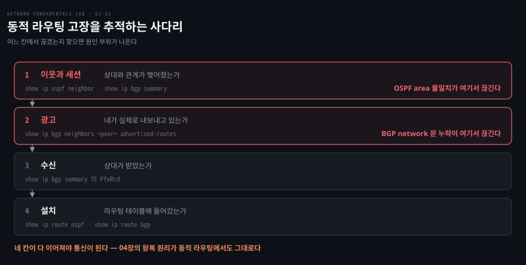

# 라우트가 스스로 걸어오게 한다

---

> 저장소 17편입니다. 앞 편에서 손으로 넣던 라우트를 프로토콜이 대신 채웁니다. 편해지는 대신 고장이 **어느 단계에서 끊겼는지**를 찾는 문제로 바뀝니다.

## 핵심 요약

> 이 편이 매달린 하나의 생각은 **동적 라우팅의 고장이 사다리의 한 칸에서 끊긴다**는 것입니다.

라우트가 저절로 생기는 것처럼 보이지만 실제로는 네 단계를 거칩니다. 이웃·광고·수신·설치입니다. 네 칸이 다 이어져야 통신이 되고, 어느 칸에서 끊겼는지 찾으면 원인 부위가 바로 나옵니다.

이 편이 고르는 두 고장이 각각 다른 칸입니다. OSPF 는 **첫 칸**에서 끊깁니다. hello 는 오가는데 조건이 안 맞아 인접 자체가 성립하지 않습니다. BGP 는 **두 번째 칸**에서 끊깁니다. 세션은 멀쩡히 Established 인데 광고할 프리픽스를 명시하지 않아 아무것도 안 나갑니다.

두 번째가 특히 고약합니다. **세션 지표는 전부 초록불인데 트래픽만 죽는** 상태라, 모니터링이 장애를 못 봅니다. 저장소가 "Established 는 전화가 연결됐다는 뜻이지 할 말을 했다는 뜻이 아니다" 라고 적어 둔 자리입니다.


## 학습 목표

> 이 편을 읽고 나면 아래 네 가지를 스스로 해낼 수 있습니다.

1. 동적 라우팅의 추적 사다리 네 칸을 순서대로 대고, 각 칸을 확인하는 명령을 짝지을 수 있습니다.
2. OSPF 인접이 조건부로만 성립한다는 것을 설명하고, area 불일치를 양쪽 인터페이스 대조로 잡을 수 있습니다.
3. BGP 에서 Established 가 성공 지표가 아닌 이유를 말하고, `PfxRcd` 로 판별할 수 있습니다.
4. 동적 라우팅에서도 결국 왕복 각 방향의 라우트가 성립해야 한다는 것을 04편 원리와 이어 설명할 수 있습니다.

이 편에서 새로 만나는 낱말입니다. `어디서` 는 그 낱말이 실제로 설명되는 절입니다.

| 키워드 | 뜻 | 학습 포인트·연결 개념 | 어디서 |
|---|---|---|---|
| 동적 라우팅 (dynamic routing) | 프로토콜이 테이블을 채움 | 손 한 줄 대신 "왜 없지" 가 생김 | §1 |
| 추적 사다리 | 이웃·광고·수신·설치 네 칸 | 끊긴 칸이 곧 원인 부위 | §1 |
| OSPF (Open Shortest Path First) | 링크 상태 IGP | 인접은 조건부 · area·타이머·인증 | §2 |
| 인접 (adjacency) | hello 조건이 맞아야 성립 | hello 왕래 ≠ 인접 성립 | §2 |
| area | 링크 상태 공유 구역 | 양 끝이 달라도 hello 는 오감 | §2 |
| DR 선출 (designated router) | 세그먼트 대표 뽑기 | 선점 없음 · `clear` 로 재선거 | §2 |
| BGP (Border Gateway Protocol) | AS 간 경로 벡터 | TCP 179 · 세션과 광고가 별개 | §3 |
| Established | 세션 수립 상태 | 성공 지표 아님 · 전화만 연결된 것 | §3 |
| PfxRcd / PfxSnt | 받은·보낸 프리픽스 수 | `Up` + `PfxRcd 0` = 광고 단계 결손 | §3 |
| advertised-routes | 내가 내보내는 목록 | 사다리 2번 칸 직접 확인 | §3 |
| RFC 8212 | 정책 없으면 eBGP 거부 | 이 랩은 끔 · 실무에선 필터가 원인 | §3 |

아래는 고장을 추적하는 사다리 네 칸과 각 칸을 확인하는 명령입니다. 이 편의 두 절이 각각 첫 칸과 두 번째 칸을 다룹니다.



> **환경 노트**: FRR 공식 이미지는 amd64 전용이라 Apple Silicon 에서는 qemu 에뮬레이션으로 돌며 **수렴이 느립니다.** 저장소가 수십 초 대기 후 재확인하라고 경고해 두었습니다. 또 이 랩 환경에서는 OSPF 멀티캐스트가 전달되지 않아 유니캐스트 hello 를 쓰는 NBMA 로 구성했습니다. 프로토콜 원리는 같습니다.


## 1. 테이블을 누가 채우는가

> 앞 편에서 손으로 넣던 한 줄을 프로토콜이 대신 넣습니다. 고장의 성격이 그만큼 달라집니다.

### 풀려는 문제

앞 편의 수정은 `ip route replace 10.4.1.0/24 via 10.4.0.1` 한 줄이었습니다. 라우터가 셋이면 세 번, 수십이면 수십 번입니다. 게다가 링크 하나가 끊어지면 사람이 다시 들어가 고쳐야 합니다.

동적 라우팅은 라우터끼리 경로를 주고받아 테이블을 스스로 채웁니다. 편해지는 대신 **"라우트가 왜 없지" 라는 물음이 새로 생깁니다.** 손으로 넣었다면 넣었는지 안 넣었는지만 보면 되는데, 이제는 어느 단계에서 끊겼는지를 찾아야 합니다.

### 사다리 네 칸

저장소가 정리한 추적 순서가 이 편의 뼈대입니다.

1. **이웃과 세션**: 상대와 관계가 맺어졌는가. OSPF 는 `show ip ospf neighbor`, BGP 는 `show ip bgp summary` 입니다.
2. **광고**: 내가 실제로 내보내고 있는가. `show ip bgp neighbors <peer> advertised-routes` 로 봅니다.
3. **수신**: 상대가 받았는가. BGP 라면 summary 의 `PfxRcd` 가 그 칸입니다.
4. **설치**: 받은 것이 라우팅 테이블에 들어갔는가. `show ip route ospf` 나 `show ip route bgp` 입니다.

어느 칸에서 끊겼는지가 곧 원인 부위입니다. 아래 두 절이 각각 첫 칸과 두 번째 칸에서 끊긴 경우입니다.


## 2. OSPF — 인접은 조건부입니다

> hello 가 오가는 것과 인접이 맺어지는 것은 다른 일입니다. 조건이 하나라도 어긋나면 조용히 무시됩니다.

### 증상과 원인

OSPF(Open Shortest Path First) 라우터는 hello 패킷으로 서로를 발견하고, **조건이 맞아야** 인접을 맺어 링크 상태 데이터베이스를 동기화합니다. 조건에는 area, hello 와 dead 타이머, 인증, 서브넷 등이 있고 하나라도 다르면 인접 자체가 성립하지 않습니다.

이 랩에 장전된 고장은 area 불일치입니다. 증상은 `show ip ospf neighbor` 가 **빈 테이블**을 내놓는 것입니다. 이웃이 하나도 없으니 라우트 교환도 0 이고 ping 도 실패합니다.

범인은 양쪽 인터페이스를 대조하면 나옵니다.

```bash
docker exec clab-17-ospf-r1 vtysh -c "show ip ospf interface eth2" | grep Area
docker exec clab-17-ospf-r2 vtysh -c "show ip ospf interface eth1" | grep Area
```

같은 링크의 양 끝이 서로 다른 area 로 잡혀 있습니다. hello 는 오가지만 서로 "다른 구역 사람" 이라며 무시하는 상태입니다. L2 편에서 본 트렁크 허용 목록 비대칭과 같은 형태의 고장입니다 — **링크 양단의 설정이 대칭이어야 한다**는 규칙이 계층을 바꿔 다시 나옵니다.

### 고쳤는데도 안 풀릴 때

저장소가 실측으로 재현한 함정이 하나 있습니다. area 를 고쳐도 인접이 `2-Way/DROther` 에서 고착될 수 있습니다.

이유는 **OSPF 의 DR 선출에 선점이 없다**는 데 있습니다. 양쪽이 각자 자기 구역의 DR 이던 상태로 만났기 때문에, 설정을 고쳐도 이미 정해진 역할이 그대로 남습니다.

```bash
docker exec clab-17-ospf-r1 vtysh -c "clear ip ospf interface eth2"
docker exec clab-17-ospf-r2 vtysh -c "clear ip ospf interface eth1"
```

상태 머신을 리셋해 재선거를 강제합니다. 실무로 옮기면 이렇습니다 — **파티션이 낫거나 설정을 정정한 뒤에도 인접이 이상하면 재선거를 강제해 본다.** 설정이 맞는데 상태가 안 따라오는 경우가 프로토콜에는 있습니다.


## 3. BGP — Established 는 성공 지표가 아닙니다

> 세션 수립과 라우트 광고는 별개 단계입니다. 둘을 하나로 읽으면 모니터링이 초록불인 장애가 생깁니다.

### 모니터링을 속이는 장애

BGP(Border Gateway Protocol)는 TCP 179 포트 위에서 프리픽스를 광고합니다. 여기서 갈리는 것이 **세션이 섰다는 사실과 할 말을 했다는 사실**입니다. 광고할 프리픽스는 `network` 문 등으로 명시해야 하는데, 빠뜨리면 세션 지표는 전부 정상인 채로 트래픽만 죽습니다.

```bash
docker exec clab-17-bgp-r2 vtysh -c "show ip bgp summary"
```

판별은 한 줄에서 끝납니다. 세션 상태가 `Up` 인데 `PfxRcd` 가 **0** 입니다. 받은 프리픽스가 없다는 뜻입니다. 반대편 `PfxSnt` 는 1 이라 r2 는 자기 대역을 광고했고, r1 만 아무것도 안 내보낸 상태입니다.

여기서 앞 편이 되돌아옵니다. r1 이 광고를 안 했으니 r2 에는 h1 쪽으로 가는 길이 없습니다. **리턴 라우트 없음** 입니다. 04편의 편도 장애가 동적 라우팅 옷을 입고 다시 나타난 것이고, 저장소도 "04장의 원리는 죽지 않는다" 고 적었습니다.

### 사다리를 한 칸씩

```bash
docker exec clab-17-bgp-r1 vtysh -c "show ip bgp neighbors 10.17.0.2 advertised-routes" | grep 10.17.1.0
```

두 번째 칸을 직접 확인합니다. 내보내는 목록에 자기 대역이 없으면 광고 단계에서 끊긴 것입니다. 수정은 그것을 올리는 한 줄이고, 고친 뒤 `PfxRcd` 가 1 로 바뀌고 상대 테이블에 경로가 설치되는 것까지 확인하면 사다리 네 칸이 모두 이어집니다.

> **구성 노트**: FRR 의 eBGP 는 기본이 RFC 8212 라 정책이 없으면 광고와 수신을 거부합니다. 이 랩은 `no bgp ebgp-requires-policy` 로 그 조건을 꺼 단순화했습니다. 실무에서는 **정책 필터가 또 하나의 "라우트가 안 오는 이유"** 가 됩니다.


## 4. 실습 메모

> 아직 돌리지 않았습니다. 이 편은 토폴로지가 둘이고 수렴 대기가 있어 관찰 시점이 중요합니다.

```bash
./clab.sh deploy  17-dynamic-routing/ospf.clab.yml
./clab.sh destroy 17-dynamic-routing/ospf.clab.yml
./clab.sh deploy  17-dynamic-routing/bgp.clab.yml
./clab.sh destroy 17-dynamic-routing/bgp.clab.yml
```

FRR 이미지가 qemu 에뮬레이션으로 돌므로 명령을 친 직후가 아니라 **수십 초 기다린 뒤** 다시 확인합니다.

| 단계 | 명령 | 볼 것 |
|---|---|---|
| OSPF 증상 | `show ip ospf neighbor` | 테이블이 비어 있는가 |
| OSPF 원인 | `show ip ospf interface <if> \| grep Area` | 양단 area 가 어긋나는가 |
| OSPF 판정 | 같은 명령 재실행 | `Full/DR` 로 올라오는가, 안 되면 `2-Way` 고착인가 |
| OSPF 함정 | `clear ip ospf interface <if>` | 재선거 뒤 인접이 완성되는가 |
| BGP 증상 | `show ip bgp summary` | `Up` 인데 `PfxRcd` 가 0 인가 |
| BGP 진단 | `advertised-routes` | 내보내는 목록에 자기 대역이 있는가 |
| BGP 판정 | summary 와 `show ip route bgp` | `PfxRcd` 가 1 이 되고 테이블에 설치되는가 |

| 실측 항목 | 값 | 잰 날 |
|---|---|---|
| FRR 이미지 pull 과 기동에 걸린 시간 (amd64 에뮬레이션) | | |
| OSPF 수렴까지 실제 대기 시간 | | |
| `2-Way` 고착 재현 여부 | | |
| BGP 수정 전후 `PfxRcd` | | |

막힌 지점과 예상과 달랐던 것은 Phase 3 에서 이 아래에 적습니다.


## 관련 문서

- [network-fundamentals-lab 실습 인덱스](./README.md) — 블록 구조와 18장 목표
- [세그먼트를 넘으면 테이블이 전부다](./03-01.%EC%84%B8%EA%B7%B8%EB%A8%BC%ED%8A%B8%EB%A5%BC%20%EB%84%98%EC%9C%BC%EB%A9%B4%20%ED%85%8C%EC%9D%B4%EB%B8%94%EC%9D%B4%20%EC%A0%84%EB%B6%80%EB%8B%A4.md) — 같은 테이블을 손으로 채우던 편
- [라우터 너머에 같은 L2를 만든다](./04-01.%EB%9D%BC%EC%9A%B0%ED%84%B0%20%EB%84%88%EB%A8%B8%EC%97%90%20%EA%B0%99%EC%9D%80%20L2%EB%A5%BC%20%EB%A7%8C%EB%93%A0%EB%8B%A4.md) — 라우팅된 underlay 위에 세그먼트를 그리는 편
- [네트워크 학습 로드맵](../../../roadmap/network-roadmap.md) — 5단계 데이터센터 축의 BGP·ECMP 로 이어지는 자리
