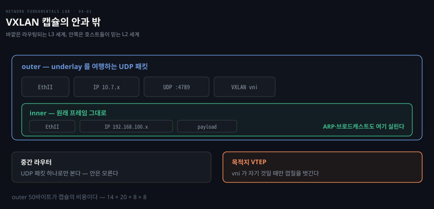

# 라우터 너머에 같은 L2를 만든다

---

> 저장소 07편입니다. 앞 블록에서 "같은 L2" 를 케이블이 아니라 마스크와 태그가 정한다고 했는데, 여기서 그 정의가 한 칸 더 갱신됩니다 — **캡슐화가 정합니다.**

## 핵심 요약

> 이 편이 매달린 하나의 생각은 **세그먼트를 물리 배선이 아니라 encapsulation 이 그릴 수 있다**는 것입니다.

VTEP 이 원래 이더넷 프레임을 UDP 와 IP 로 감싸면, 그 캡슐은 라우팅된 망을 그냥 UDP 패킷으로 여행합니다. 중간 라우터는 안에 이더넷이 들었는지 모릅니다. 목적지 VTEP 이 껍질을 벗기면 원래 프레임이 나오고, 양 끝 호스트는 서로 같은 세그먼트에 있다고 믿습니다.

**ARP 와 브로드캐스트도 캡슐에 실려 넘어간다**는 것이 결정적입니다. 01편에서 브로드캐스트는 같은 세그먼트 안에서만 돈다고 배웠는데, 캡슐화가 그 세그먼트를 L3 위에 새로 그렸기 때문에 ARP 가 라우터를 건너다닙니다.

대가도 함께 옵니다. 껍질만큼 실을 수 있는 양이 줄어 **정확히 50바이트**의 세금이 붙습니다. 커널이 자기 링크에 대해서는 알아서 빼 주지만 경로 중간까지는 모르고, 그 빈틈이 다음 블록의 주제가 됩니다.


## 학습 목표

> 이 편을 읽고 나면 아래 네 가지를 스스로 해낼 수 있습니다.

1. VXLAN 캡슐의 구조를 outer 와 inner 로 갈라 설명하고, 중간 라우터가 무엇만 보는지 말할 수 있습니다.
2. VTEP 과 VNI 의 역할을 구분하고, VNI 24비트가 VLAN 12비트의 무엇을 넘어서는지 설명할 수 있습니다.
3. "outer 는 도착하는데 무응답" 이라는 지문을 decap 쪽 설정 불일치로 읽고, 양쪽 `ip -d link show` 로 대조할 수 있습니다.
4. 오버레이 MTU 가 왜 1450 인지 바이트 단위로 계산할 수 있습니다.

이 편에서 새로 만나는 낱말입니다. `어디서` 는 그 낱말이 실제로 설명되는 절입니다.

| 키워드 | 뜻 | 학습 포인트·연결 개념 | 어디서 |
|---|---|---|---|
| 캡슐화 (encapsulation) | 프레임을 통째로 감싸기 | 케이블 → 태그 → 캡슐 | §1 |
| VTEP (VXLAN Tunnel End Point) | 감싸고 푸는 터널 끝점 | 중간 라우터는 UDP 로만 봄 | §1 |
| VNI (VXLAN Network Identifier) | 24비트 가상망 식별자 | 1677만 개 · VLAN 12비트의 확장 | §1 |
| underlay · overlay | 실제 망과 그 위 논리 망 | 진단 1축 — underlay 부터 확인 | §2 |
| 디캡슐레이션 (decapsulation) | 껍질을 벗기는 단계 | VNI 불일치면 도착하고도 폐기 | §2 |
| 50바이트 세금 | outer 헤더가 먹는 몫 | 14+20+8+8 · 커널은 자기 링크만 앎 | §3 |

아래는 프레임이 프레임 안에 담기는 구조입니다. 바깥은 라우팅되는 L3 세계이고 안쪽이 호스트들이 믿는 L2 세계입니다.




## 1. 캡슐이 세그먼트를 새로 그립니다

> 원래 프레임을 UDP 4789 로 감싸면, 라우팅된 망 너머에 "같은 L2" 가 생깁니다.

### 풀려는 문제

앞 블록에서 라우터를 넘는 법을 배웠습니다. 그런데 실무에는 반대 요구가 있습니다. **라우터로 나뉜 두 곳을 같은 세그먼트처럼 쓰고 싶은** 경우입니다. 서버가 어느 랙에 있든 같은 대역에 있어야 하는 상황이 그렇습니다.

VLAN 으로는 안 됩니다. 태그는 L2 안에서만 유효하고, 라우터를 넘는 순간 사라집니다. 게다가 12비트 공간이라 쓸 수 있는 ID 가 4094개뿐입니다.

### 감싸고 푸는 두 끝점

VXLAN 은 원래 프레임을 통째로 UDP 페이로드에 넣습니다. 감싸고 푸는 끝점이 **VTEP**(VXLAN Tunnel End Point) 이고, 어느 가상 네트워크의 프레임인지 표시하는 것이 **VNI**(VXLAN Network Identifier) 입니다. VNI 는 24비트라 1677만 개를 구분할 수 있습니다.

중요한 것은 중간 라우터의 시야입니다. **r1 은 그냥 UDP 패킷을 라우팅할 뿐 안에 이더넷이 들었는지 모릅니다.** 그래서 underlay 를 바꾸지 않고도 그 위에 원하는 만큼 가상 세그먼트를 그릴 수 있습니다.

Calico 나 Flannel 같은 CNI 의 VXLAN 모드가 노드 사이에 정확히 이 구조를 만듭니다. 쿠버네티스에서 Pod 가 노드를 넘어 같은 대역을 쓰는 이유가 여기 있고, 저장소도 "원리는 이 장이 전부" 라고 적었습니다.


## 2. outer 는 도착하는데 무응답인 지문

> 캡슐이 목적지까지 갔는데도 조용히 버려집니다. 태그가 달라 같은 편인 줄 모르는 것이라, 03편 VLAN 불일치의 오버레이판입니다.

### 증상은 두 층을 갈라 봅니다

```bash
docker exec clab-07-vxlan-overlay-vtep1 ping -c1 10.7.2.1        # underlay
docker exec clab-07-vxlan-overlay-vtep1 ping -c2 192.168.100.2   # overlay
```

**underlay 는 되는데 overlay 만 죽습니다.** 터널 끝점끼리는 멀쩡히 통하므로 배선이나 라우팅 문제가 아닙니다. 진단의 첫 축이 여기서 나옵니다 — 오버레이가 안 되면 underlay 부터 확인해 범위를 반으로 줄입니다.

### 캡처가 두 층을 함께 풀어 줍니다

```bash
docker exec clab-07-vxlan-overlay-vtep2 tcpdump -nli eth1 'udp port 4789 and src host 10.7.1.1'
```

vtep2 의 문 앞에서 캡슐이 잡힙니다. `tcpdump` 가 outer 와 inner 를 함께 해독해 주므로 "vni 100 의 캡슐 안에 ARP 요청이 들었다" 까지 한 줄에 보입니다.

05편 블랙홀과 닮았지만 결정적으로 다릅니다. **패킷이 목적지까지 도달했습니다.** 그런데 vtep2 가 응답하지 않습니다.

### 범인은 양쪽 대조에서 나옵니다

```bash
docker exec clab-07-vxlan-overlay-vtep1 ip -d link show vxlan100 | grep "vxlan id"
docker exec clab-07-vxlan-overlay-vtep2 ip -d link show vxlan100 | grep "vxlan id"
```

한쪽이 100 이고 다른 쪽이 200 입니다. vtep2 의 커널은 "vni 200 프레임만 내 것" 이라 여기므로, **도착한 vni 100 캡슐을 디캡슐레이션(decapsulation) 단계에서 조용히 버립니다.** 에러도 ICMP 도 없습니다.

같은 명령이 `remote` 와 `dstport` 도 함께 보여 줍니다. 저장소가 정리한 진단 축 셋 중 마지막이 **양쪽의 VNI·포트·remote 를 한꺼번에 대조**하는 것이라, VNI 가 맞는데도 안 되면 나머지 둘을 이어서 봅니다.

03편의 트렁크 허용 목록 불일치와 완전히 같은 운명입니다. 프레임은 도달하는데 수신측이 "그 소속은 우리 것이 아니다" 라며 폐기합니다. **링크 양단의 식별자가 대칭이어야 한다**는 규칙이 케이블에서 태그로, 태그에서 VNI 로 계층을 바꿔 세 번째 나오는 자리입니다.

VNI 는 바꿀 수 없어 인터페이스를 다시 만들어야 합니다. 이 저장소에서 "한 줄 수정" 원칙의 유일한 예외입니다.

### ARP 가 라우터를 건너다닙니다

고친 뒤 **중간 라우터 r1 에서** 캡처하면 이 편의 핵심 장면이 나옵니다. VXLAN 캡슐 안에 담긴 ARP 요청과 응답이 r1 을 통과합니다.

01편에서 브로드캐스트는 같은 세그먼트 안에서만 돈다고 배웠는데, 지금 ARP 가 라우터를 넘고 있습니다. 모순이 아니라 **캡슐화가 그 "세그먼트" 를 L3 위에 새로 그렸기** 때문입니다. 그래서 이 편이 "같은 L2" 의 정의를 갱신하는 마지막 칸이 됩니다.


## 3. 오버레이는 50바이트를 냅니다

> 껍질에 들어간 만큼 실을 수 있는 양이 줍니다. 커널은 자기 링크만 알아서 빼 주고 경로 중간은 모릅니다.

```bash
docker exec clab-07-vxlan-overlay-vtep1 ip link show vxlan100 | grep -o "mtu [0-9]*"
```

underlay 가 1500 인데 vxlan 인터페이스는 **1450** 으로 잡혀 있습니다. 커널이 스스로 50을 뺀 것입니다.

계산이 정확히 맞아떨어집니다.

- outer 이더넷 헤더 14바이트
- outer IP 헤더 20바이트
- UDP 헤더 8바이트
- VXLAN 헤더 8바이트

합이 50바이트이고, 이것이 캡슐의 비용입니다. **오버레이는 공짜가 아닙니다.**

여기까지는 커널이 알아서 합니다. 문제는 커널이 아는 범위가 **자기 링크까지**라는 데 있습니다. 경로 중간에 더 좁은 구간이 있으면 커널은 그것을 모르고, 그때 청구서가 날아옵니다. 바로 다음 편이 아니라 **뒤의 MTU 블록**(06-01)이 그 자리입니다.


## 4. 실습 메모

> 아직 돌리지 않았습니다. 이 편은 underlay 와 overlay 를 갈라 보는 순서가 관건입니다.

```bash
./clab.sh deploy  07-vxlan-overlay/07-vxlan-overlay.clab.yml
./clab.sh destroy 07-vxlan-overlay/07-vxlan-overlay.clab.yml
```

| 단계 | 명령 | 볼 것 |
|---|---|---|
| 범위 좁히기 | underlay ping 과 overlay ping | underlay 만 되는가 |
| outer 도착 | vtep2 에서 `udp port 4789` 캡처 | 캡슐이 문 앞까지 오는가, 안의 ARP 가 함께 해독되는가 |
| 원인 | 양쪽 `ip -d link show vxlan100` | `vxlan id` 가 어긋나는가 |
| 판정 | overlay ping | 왕복 시간이 나오는가 |
| 핵심 장면 | **r1 에서** 캡처 | ARP 요청과 응답이 라우터를 건너다니는가 |
| 세금 | `ip link show vxlan100` | mtu 가 1450 인가 |

| 실측 항목 | 값 | 잰 날 |
|---|---|---|
| underlay 왕복 시간 | | |
| vtep2 에 도착한 캡슐의 vni | | |
| 양쪽 `vxlan id` | | |
| 수정 후 overlay 왕복 시간 | | |
| r1 캡처에 잡힌 ARP 방향 | | |
| vxlan 인터페이스 mtu | | |

막힌 지점과 예상과 달랐던 것은 Phase 3 에서 이 아래에 적습니다.


## 관련 문서

- [network-fundamentals-lab 실습 인덱스](./README.md) — 블록 구조와 18장 목표
- [같은 세그먼트 안에서만 통한다](./02-01.%EA%B0%99%EC%9D%80%20%EC%84%B8%EA%B7%B8%EB%A8%BC%ED%8A%B8%20%EC%95%88%EC%97%90%EC%84%9C%EB%A7%8C%20%ED%86%B5%ED%95%9C%EB%8B%A4.md) — 케이블과 태그가 정하던 앞 칸
- [작은 것은 되고 큰 것만 멎는다](./06-01.%EC%9E%91%EC%9D%80%20%EA%B2%83%EC%9D%80%20%EB%90%98%EA%B3%A0%20%ED%81%B0%20%EA%B2%83%EB%A7%8C%20%EB%A9%8E%EB%8A%94%EB%8B%A4.md) — 50바이트 세금의 청구서가 날아오는 편
- [08_cloud/kubernetes/04_networking/](../../../08_cloud/kubernetes/04_networking/README.md) — 이 원리가 CNI 오버레이로 쓰이는 자리
