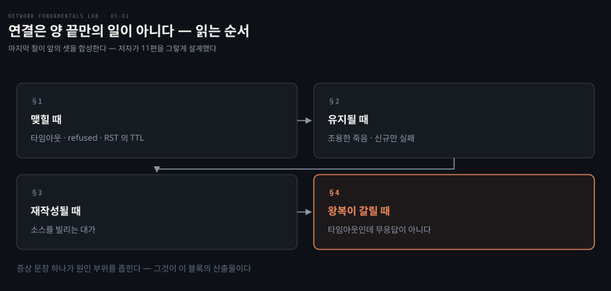
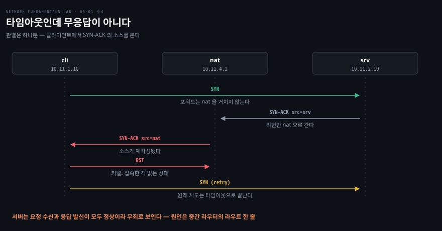

# 연결은 양 끝만의 일이 아니다

---

> 저장소 08·09·10·11편을 묶었습니다. 저자가 11편을 "앞의 셋을 합성하는 편" 이라고 명시했고, 실제로 네 편이 하나의 논지로 이어집니다 — **연결의 생사는 중간 장비의 기억과 재작성에도 달려 있습니다.**

## 핵심 요약

> 이 편이 매달린 하나의 생각은 **연결이 양 끝의 합의만으로 성립하지 않는다**는 것입니다.

TCP 핸드셰이크는 클라이언트와 서버 둘의 일처럼 보이지만, 그 사이에 앉은 방화벽과 NAT 가 지나가는 연결을 기억하고 헤더를 고쳐 씁니다. 그 기억이 만료되거나 가득 차면, 혹은 왕복이 같은 장비를 지나지 않으면 양 끝이 멀쩡한데도 연결이 죽습니다.

그래서 이 블록은 **지문 사전**을 넓히는 일입니다. 08편이 타임아웃·refused·중간자 RST 세 지문을 세우고, 11편이 거기 없던 네 번째를 더합니다 — **타임아웃인데 무응답이 아닌 경우**입니다.

가장 실무적인 문장은 09편의 교훈입니다. **"기존 연결은 되는데 새 연결만 안 된다"** 는 포트나 상태 테이블 고갈의 신호이고, **"오래 조용하던 연결이 죽었다"** 는 idle timeout 의 신호입니다. 증상 문장 하나가 원인 부위를 좁힙니다.


## 학습 목표

> 이 편을 읽고 나면 아래 여섯 가지를 스스로 해낼 수 있습니다.

1. 실패한 연결을 타임아웃·refused·중간자 RST 로 가르고, 각각의 수색 범위를 댈 수 있습니다.
2. RST 의 TTL 로 그것을 만든 것이 서버인지 중간 방화벽인지 판별할 수 있습니다.
3. conntrack 테이블의 한 줄을 원방향·응답방향·남은 수명으로 읽을 수 있습니다.
4. idle timeout 과 포트 고갈이 각각 어떤 증상 문장으로 나타나는지 구분할 수 있습니다.
5. SNAT 와 DNAT 가 무엇을 바꾸는지 방향으로 설명하고, 소스 재작성의 대가를 말할 수 있습니다.
6. 경로 비대칭이 재작성·상태 검사와 만날 때만 문제가 된다는 것을 세 가지 운명으로 설명할 수 있습니다.

이 편에서 새로 만나는 낱말입니다. `어디서` 는 그 낱말이 실제로 설명되는 절입니다.

| 키워드 | 뜻 | 학습 포인트·연결 개념 | 어디서 |
|---|---|---|---|
| 3-way 핸드셰이크 | SYN·SYN-ACK·ACK 세 걸음 | 실패는 이 셋 중 하나에서 남 | §1 |
| 타임아웃 vs refused | 기다리다 죽기와 즉시 죽기 | 빨리 실패가 오히려 좋은 신호 | §1 |
| 중간자 RST | 방화벽이 서버인 척 거절 | RST 의 TTL 로 판별 · 홉 수 대조 | §1 |
| conntrack | 지나가는 연결의 기억 | 원·응답 튜플 · 없으면 INVALID | §2 |
| idle timeout | 조용한 엔트리의 수명 | 양 끝은 모름 · 에러 없이 재전송만 | §2 |
| 포트 고갈 | SNAT 포트 소진 | 기존은 되고 신규만 실패 · insert_failed | §2 |
| SNAT / MASQUERADE | 나갈 때 소스 재작성 | POSTROUTING · 사설은 돌아올 길 없음 | §3 |
| DNAT | 들어올 때 목적지 재작성 | PREROUTING · 소스 보존 → 헤어핀 붕괴 | §3 |
| 소스 재작성의 대가 | 진짜 주소를 잃음 | 로그·ACL 이 NAT 기준 · XFF 의 이유 | §3 |
| 경로 비대칭 (path asymmetry) | 가는 길 ≠ 오는 길 | 그 자체는 무해 · 재작성과 겹칠 때만 | §4 |
| 네 번째 지문 | 타임아웃인데 무응답 아님 | SYN-ACK 소스가 다름 · 클라 캡처로 판별 | §4 |
| stateful 부분 픽업 | 핸드셰이크만 통과시킴 | connect 성공 · 데이터 사망 | §4 |

아래는 이 편의 절 넷이 연결의 생애를 따라가는 순서입니다.




## 1. 실패는 세 단계 중 하나에서 일어납니다

> 핸드셰이크가 세 걸음이므로 실패도 그 안에서 납니다. 어느 걸음에서 어떤 형태로 실패했는지가 지문입니다.

**낱말 주의.** 이 편부터 "포트" 는 앞 블록의 스위치 포트가 아닙니다. 거기서는 프레임이 드나드는 물리 구멍이었고, 여기서는 한 호스트 안에서 서비스를 가리키는 번호입니다. SNAT 가 고갈시키는 것도 이쪽입니다.

### 시간은 공짜 정보입니다

08편의 첫 실습은 포트 넷을 두드리며 **`time` 을 함께 재는 것**입니다. 에러 메시지와 소요 시간만으로 이미 두 부류로 갈립니다.

정상 포트와 거절당한 포트는 **즉시** 끝나고, 버려진 포트는 타임아웃 시간을 꽉 채웁니다. 여기서 나오는 감각이 중요합니다. **빨리 실패하는 것은 오히려 좋은 신호입니다.** 누군가 응답은 했다는 뜻이니까요. 느리게 실패하는 쪽이 수색 범위가 넓습니다.

### 세 지문

| 증상 | 걸리는 시간 | 패킷 레벨 | 뜻 |
|---|---|---|---|
| 타임아웃 | 수 초에서 수십 초 | SYN 만 반복, 응답 없음 | SYN 이 버려짐 — 경로 유실이나 방화벽 DROP |
| Connection refused | 즉시 | SYN 에 RST 응답 | 목적지까지 갔는데 포트가 닫힘 |
| 연결 후 멎음 | 가변 | 데이터 중 RST 나 무응답 | 상태형 장비의 세션 드랍 |

타임아웃의 캡처에는 특징이 있습니다. **같은 seq 의 SYN 만 반복**되고 상대편 패킷이 하나도 없습니다. seq 가 같다는 것은 같은 시도의 재전송이라는 뜻입니다. 05편 블랙홀과 같은 부류의 조용한 실패입니다.

### 같은 refused, 다른 범인

여기서 08편이 한 칸 더 들어갑니다. 포트가 닫혀서 나는 refused 와 방화벽이 REJECT 정책으로 쏜 refused 는 **에러 메시지도 소요 시간도 같습니다.** 둘 다 RST 소스가 서버 주소라고 주장합니다.

가르는 것은 TTL 입니다.

```bash
docker exec clab-08-tcp-3way-cli tcpdump -vnli eth1 tcp port 9090
```

이 랩은 사이에 장비가 하나뿐입니다. 서버가 만든 RST 는 초기값 64에서 출발해 그 한 홉을 지나며 1이 깎여 **63** 으로 도착하고, 방화벽이 서버인 척 만들어 쏜 RST 는 홉을 지나지 않아 **64** 그대로입니다. 실무에서는 63 이라는 숫자를 외우는 것이 아니라 **예상 홉 수만큼 깎였는지**를 봅니다.

실무로 옮기면 이렇습니다. **refused 가 났다고 서버 담당자만 잡지 말아야 합니다.** 중간 방화벽의 REJECT 일 수 있고, TTL 이 증인입니다.

### 증상이 진화하는 것은 전진입니다

08편에 재미있는 실측이 있습니다. 방화벽 계층만 고치면 타임아웃이던 포트가 **refused 로 바뀝니다.** SYN 이 이제 서버까지 가는데 거기 리스너가 없기 때문입니다.

고장이 여러 계층에 겹쳐 있으면 하나를 고칠 때마다 증상이 다음 지문으로 바뀝니다. **"고쳤는데 에러가 달라졌어요" 는 후퇴가 아니라 전진입니다.**


## 2. 기억은 공짜가 아닙니다

> 상태형 장비는 지나가는 연결을 표에 기억합니다. 그 표는 유한하므로 만료되고 가득 찹니다.

### 번역표를 읽는 법

NAT 와 상태형(stateful) 방화벽은 첫 패킷에서 엔트리를 만듭니다. 이 글에서는 이후 "상태형" 으로 적습니다. 원방향과 응답방향을 짝지은 왕복표이고, 이후 패킷은 이 표로 번역되거나 허용됩니다. **표에 없으면 INVALID 로 버려집니다.**

```bash
docker exec clab-09-conntrack-nat conntrack -L | grep 7777
```

한 줄은 `tcp 6 27 ESTABLISHED src=… src=…` 꼴입니다. 프로토콜 이름과 번호가 앞에 오고, **둘째 숫자가 남은 수명(초)**, 그다음이 상태, 마지막이 원방향과 응답방향 튜플입니다. 수명은 토막 순서가 아니라 **숫자 순서**로 세야 프로토콜 번호와 헷갈리지 않습니다. 응답방향을 보면 클라이언트의 포트가 NAT 의 어느 포트로 재작성됐는지가 표에 그대로 드러납니다.

### 조용한 죽음

테이블이 유한하므로 한동안 조용한 엔트리는 지워집니다. 문제는 **양 끝의 소켓이 그것을 모른다**는 데 있습니다.

애플리케이션 입장에서 연결은 멀쩡히 열려 있는데 중간 장비의 기억만 사라진 상태입니다. 그다음에 보낸 데이터는 조용히 버려집니다. 캡처에는 재전송이 지수 백오프로 쌓이고 응답 ACK 는 오지 않습니다.

**에러가 어디에도 없다는 것이 이 장애의 지문입니다.** RST 도 ICMP 도 없이 그냥 조용합니다. 커넥션 풀, DB 연결, 롱폴링이 단골 피해자입니다.

처방은 둘이고 층이 다릅니다. 장비 쪽에서 timeout 을 올리거나, 앱 쪽에서 TCP keepalive 로 조용한 연결에 주기적 심장박동을 넣어 기억을 갱신합니다. 저장소의 표현대로 **양쪽 다 아는 사람이 협상해야** 합니다.

### 신규만 실패하는 경우

SNAT 는 프로토콜과 NAT 주소·포트와 목적지의 조합으로 연결을 구분합니다. 같은 목적지로 갈 때 쓸 수 있는 포트가 N개면 동시 연결도 N개가 상한입니다. 다 차면 **기존 연결은 멀쩡한 채로 신규 연결만 실패합니다.**

물증은 카운터에 있습니다.

```bash
docker exec clab-09-conntrack-nat conntrack -S | grep insert_failed
```

**`insert_failed` 가 0이 아니면 포트나 엔트리 할당에 실패한 적이 있다는 뜻입니다.** 증상 문장과 물증이 한 쌍으로 붙는 드문 경우라, 이 편에서 가장 실무적인 도구입니다.


## 3. 소스를 바꿔야 나갈 수 있습니다

> 사설 대역은 인터넷에서 라우팅되지 않습니다. 그래서 나갈 때 소스를 빌리고, 그 대가로 상대는 진짜 주소를 모르게 됩니다.

### 편도 티켓

10편의 고장은 SNAT 규칙이 없는 상태입니다. 증상은 타임아웃인데 서버 쪽 캡처가 놀랍습니다. **사설 소스를 단 SYN 이 그대로 도착해 있습니다.**

서버는 SYN-ACK 를 만들었지만 보내지 못합니다. 그 사설 주소로 **돌아가는 길이 세상에 없기** 때문입니다. 앞 블록의 리턴 라우트 누락과 증상이 같지만 성격이 다릅니다. 그때는 한 라우터의 테이블에 한 줄이 없었고, 이번에는 어느 라우터에도 그 길이 있을 수 없습니다.

수정은 소스를 빌리는 것입니다. NAT(Network Address Translation)가 자기 주소로 소스를 바꿔치기하면 서버는 인접한 NAT 에게 응답하고, NAT 가 번역표를 보고 원래 주인에게 돌려줍니다.

### 방향 감각

| | 언제 | 무엇을 바꾸나 | 용도 |
|---|---|---|---|
| SNAT | 나갈 때 (POSTROUTING) | **소스** 주소와 포트 | 사설에서 공인으로 |
| DNAT | 들어올 때 (PREROUTING) | **목적지** 주소와 포트 | 포트 공개 |

DNAT 는 목적지만 바꾸고 소스를 보존합니다. 응답은 번역표로 역번역되어, 외부에서는 공개된 주소가 응답한 것처럼 보입니다.

### 성공에도 대가가 있습니다

SNAT 가 통한 뒤 서버가 보는 클라이언트는 **NAT 의 주소**입니다. 접속 로그, IP 기반 ACL, rate-limit 이 전부 NAT 주소 기준이 됩니다. HTTP 에서 `X-Forwarded-For` 가 필요한 이유가 바로 이것이고, 헤더를 고쳐 쓰는 일에는 언제나 이런 정보 손실이 따라옵니다.

여기서 다음 절의 씨앗이 심어집니다. 번역표가 성립하려면 **왕복이 같은 NAT 를 지나야** 합니다. 이 전제가 깨지면 어떻게 되는지가 마지막 절입니다.


## 4. 비대칭이 재작성과 만날 때

> 왕복이 다른 길로 가는 것 자체는 문제가 아닙니다. 그 길에 헤더를 고쳐 쓰는 장비가 있을 때만 문제가 됩니다.



### 두 원리가 충돌합니다

앞 블록에서 배운 것이 "왕복은 독립된 결정" 이었고, 이 블록에서 배운 것이 "상태 장비는 왕복을 다 봐야 한다" 입니다. 둘이 한 자리에서 만나면 충돌합니다.

11편의 고장은 라우트 한 줄입니다. 중간 라우터가 **클라이언트 대역으로 가는 리턴만** NAT 쪽으로 보냅니다. 포워드는 NAT 를 거치지 않습니다.

### 네 번째 지문

증상은 타임아웃이라 08편 분류로는 "SYN 이 조용히 소실" 이어야 합니다. 그런데 클라이언트에서 캡처를 뜨면 다릅니다.

**SYN-ACK 가 오고 있습니다.** 다만 접속한 적 없는 주소에서 옵니다. seq 와 ack 번호를 보면 분명히 내 SYN 에 대한 응답인데 소스가 다르니 커널이 소켓 매칭에 실패해 RST 로 버립니다. 그 사이 원래 시도는 SYN 을 재전송하다 타임아웃됩니다.

**타임아웃인데 무응답이 아닙니다.** 08편 지문표에 없던 네 번째이고, 판별은 한 가지로 끝납니다 — **클라이언트에서 SYN-ACK 의 소스 주소를 봅니다.** 접속한 주소와 다르면 종결입니다.

이 장애가 교묘한 이유는 시야가 갈리기 때문입니다. 서버 쪽에서는 요청 수신과 응답 발신이 모두 정상이라 **서버가 무죄로 보입니다.** 클라이언트 쪽에서는 그냥 타임아웃입니다. 원인은 중간 어느 라우터의 라우트 한 줄이라 어느 팀의 시야에도 잘 안 걸립니다.

### 같은 비대칭, 세 가지 운명

11편의 심화 실습이 이 블록에서 가장 값진 부분입니다. 비대칭 라우트를 그대로 두고 **NAT 의 동작만** 바꿔 가며 비교합니다.

| NAT 의 동작 | 증상 |
|---|---|
| 없음 — 순수 라우터 | **정상 동작** |
| stateless 재작성 | connect 부터 타임아웃, 엉뚱한 소스의 SYN-ACK |
| stateful masquerade | **connect 는 성공하고 데이터만 사망** |

첫 줄이 결론을 뒤집습니다. **비대칭인데 멀쩡합니다.** 소스가 보존되니 클라이언트는 경로를 신경 쓰지 않습니다. 그러니 문제는 비대칭 자체가 아니라 **비대칭에 재작성이나 상태 검사가 겹칠 때** 생깁니다.

셋째 줄이 가장 잡기 어렵습니다. conntrack 은 중간에 끼어든 SYN-ACK 를 INVALID 로 보고 재작성 없이 통과시켜 핸드셰이크가 성공합니다. 그런데 **그다음 패킷부터** 픽업해 재작성하므로 데이터만 엉뚱한 소스로 도착해 버려집니다. 결과는 **포트 체크와 간단한 헬스체크는 전부 통과하는데 실 서비스만 죽는** 상태입니다.

> **구현 노트**: 저장소의 기본 고장은 nftables stateless 룰입니다. 리눅스 conntrack NAT 는 SYN 없이 온 SYN-ACK 를 INVALID 로 판정해 NAT 하지 않으므로 이 장애가 그대로 재현되지 않고, 그래서 실제 장애 장비들의 동작을 모사한 것이라고 저자가 밝혀 두었습니다.

원칙은 하나로 정리됩니다. **상태형 장비와 재작성 장비는 왕복이 같은 장비를 지나도록 설계합니다.**


## 5. 실습 메모

> 아직 돌리지 않았습니다. 이 블록은 캡처 지점이 여럿이라 어디에 꽂을지를 미리 정해 둡니다.

```bash
./clab.sh deploy  08-tcp-3way/08-tcp-3way.clab.yml
./clab.sh destroy 08-tcp-3way/08-tcp-3way.clab.yml
./clab.sh deploy  09-conntrack/09-conntrack.clab.yml
./clab.sh destroy 09-conntrack/09-conntrack.clab.yml
./clab.sh deploy  10-nat-basics/10-nat-basics.clab.yml
./clab.sh destroy 10-nat-basics/10-nat-basics.clab.yml
./clab.sh deploy  11-symmetry-nat/11-symmetry-nat.clab.yml
./clab.sh destroy 11-symmetry-nat/11-symmetry-nat.clab.yml
```

| 편 | 무엇을 만드나 | 어디를 보나 |
|---|---|---|
| 08 A | 포트 넷을 `time` 과 함께 두드림 | 즉시 실패와 시간을 채우는 실패로 갈리는가 |
| 08 B-2 | 타임아웃 포트 캡처 | **같은 seq** 의 SYN 만 반복되는가 |
| 08 B-3 | 두 refused 를 `tcpdump -v` | RST 의 **TTL 이 63 인가 64 인가** |
| 08 수정 | 방화벽만 먼저 고침 | 타임아웃이 refused 로 **진화**하는가 |
| 09 A | 연결 하나 열고 `conntrack -L` | 둘째 숫자가 줄어드는가 |
| 09 B | timeout 보다 길게 방치 후 전송 | 에러 없이 재전송만 쌓이는가 |
| 09 C | 포트 수만큼 연결 후 하나 더 | 기존은 살아 있고 신규만 죽는가, `insert_failed` 가 0이 아닌가 |
| 10 A | SNAT 없이 접속 | **서버에 사설 소스 SYN 이 도착**해 있는가 |
| 10 A | MASQUERADE 추가 후 | 서버가 보는 소스가 NAT 주소로 바뀌는가 |
| 11 B | 클라이언트에서 캡처 | **SYN-ACK 의 소스**가 접속한 주소와 다른가 |
| 11 C | NAT 유입·유출 양쪽 | 같은 seq 가 지나며 소스만 바뀌는가 |
| 11 D | 재작성 제거 · masquerade 교체 | 세 가지 운명이 표대로 갈리는가 |

| 실측 항목 | 값 | 잰 날 |
|---|---|---|
| 08 포트 넷의 소요 시간 | | |
| 08 두 RST 의 TTL | | |
| 09 엔트리 소멸까지 걸린 시간 | | |
| 09 `insert_failed` 값 | | |
| 10 SNAT 전후 서버가 본 소스 | | |
| 11 SYN-ACK 의 소스 주소 | | |
| 11 D-2 에서 connect 와 데이터의 결과 차이 | | |

막힌 지점과 예상과 달랐던 것은 Phase 3 에서 이 아래에 적습니다.


## 관련 문서

- [network-fundamentals-lab 실습 인덱스](./README.md) — 블록 구조와 18장 목표
- [세그먼트를 넘으면 테이블이 전부다](./03-01.%EC%84%B8%EA%B7%B8%EB%A8%BC%ED%8A%B8%EB%A5%BC%20%EB%84%98%EC%9C%BC%EB%A9%B4%20%ED%85%8C%EC%9D%B4%EB%B8%94%EC%9D%B4%20%EC%A0%84%EB%B6%80%EB%8B%A4.md) — 왕복이 독립된 결정이라는 앞 편
- [작은 것은 되고 큰 것만 멎는다](./06-01.%EC%9E%91%EC%9D%80%20%EA%B2%83%EC%9D%80%20%EB%90%98%EA%B3%A0%20%ED%81%B0%20%EA%B2%83%EB%A7%8C%20%EB%A9%8E%EB%8A%94%EB%8B%A4.md) — 연결도 경로도 완벽한데 큰 것만 죽는 편
- [길은 멀쩡한데 안 통할 때](./07-01.%EA%B8%B8%EC%9D%80%20%EB%A9%80%EC%A9%A1%ED%95%9C%EB%8D%B0%20%EC%95%88%20%ED%86%B5%ED%95%A0%20%EB%95%8C.md) — 같은 NAT 가 헤어핀에서 다시 문제를 내는 편
- [K8s 패킷 여정 — netfilter·conntrack·라우팅](../../networking/01-02.K8s%20%ED%8C%A8%ED%82%B7%20%EC%97%AC%EC%A0%95%20%E2%80%94%20netfilter%C2%B7conntrack%C2%B7%EB%9D%BC%EC%9A%B0%ED%8C%85.md) — 같은 메커니즘을 쿠버네티스 데이터패스에서 보는 SSOT
