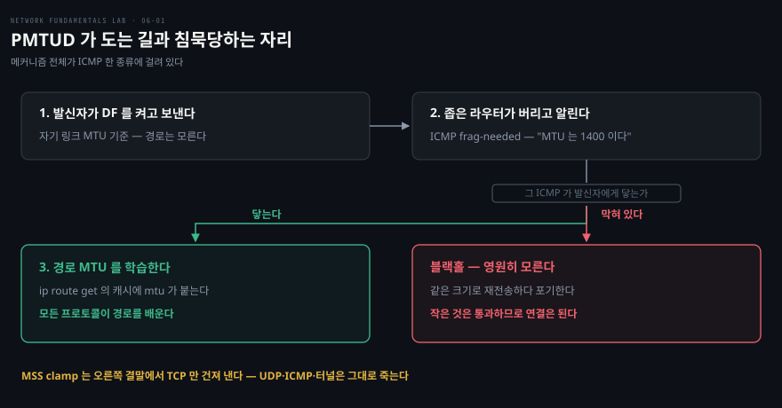

# 작은 것은 되고 큰 것만 멎는다

---

> 저장소 12·13편을 묶었습니다. 연결도 경로도 완벽한데 큰 전송만 죽는 세계이고, 두 편이 같은 병을 층을 바꿔 두 번 보여 줍니다.

## 핵심 요약

> 이 편이 매달린 하나의 생각은 **양 끝만 아는 지식이 경로를 보증하지 않는다**는 것입니다.

TCP 는 핸드셰이크 때 서로의 MSS(Maximum Segment Size)를 교환합니다. 그 값은 각자 **자기 링크**의 MTU(Maximum Transmission Unit)에서 나옵니다. 중간에 더 좁은 구간이 있다는 것은 양 끝 모두 모릅니다. 그것을 알아내라고 있는 장치가 PMTUD 이고, PMTUD 는 전적으로 ICMP 한 종류에 의존합니다.

그래서 증상이 특이합니다. 작은 패킷은 잘 통과하므로 **연결은 되는데 데이터만 멎습니다.** 저장소의 표현으로는 "TLS 핸드셰이크는 되는데 인증서에서 멎어요" 의 실체입니다. 접속 성공이 경로 건강을 보증하지 않습니다.

13편이 같은 병을 한 층 위에서 되풀이합니다. 커널은 자기 링크에 대해 오버레이 MTU 를 알아서 빼 주고 초과 설정을 거부까지 하지만, **경로 중간의 협곡은 모릅니다.** 그때 일어나는 숨은 단편화가 조각 거부와 만나면 또 큰 것만 조용히 죽습니다.


## 학습 목표

> 이 편을 읽고 나면 아래 다섯 가지를 스스로 해낼 수 있습니다.

1. MSS 협상이 경로가 아니라 양 끝의 링크만 반영한다는 것을 설명할 수 있습니다.
2. PMTUD 의 세 걸음을 순서대로 대고, 어느 걸음이 막히면 블랙홀이 되는지 말할 수 있습니다.
3. MSS clamp 와 ICMP 허용이 각각 무엇에만 듣는지 구분해 처방할 수 있습니다.
4. 오버레이 MTU 를 경로 최솟값에서 오버헤드를 뺀 값으로 계산할 수 있습니다.
5. 비선두 조각이 왜 버려지는지 설명하고, 와이어에서 그 파편을 알아볼 수 있습니다.

이 편에서 새로 만나는 낱말입니다. `어디서` 는 그 낱말이 실제로 설명되는 절입니다.

| 키워드 | 뜻 | 학습 포인트·연결 개념 | 어디서 |
|---|---|---|---|
| MTU (Maximum Transmission Unit) | 링크가 한 번에 나르는 크기 | 경로 최솟값이 실제 한계 | §1 |
| MSS (Maximum Segment Size) | TCP 가 협상하는 세그먼트 크기 | 양 끝 링크만 반영 · 중간은 모름 | §1 |
| DF 비트 (Don't Fragment) | 쪼개지 말라는 표시 | `ping -M do` · PMTUD 의 전제 | §1 |
| PMTUD (Path MTU Discovery) | 경로 최소 MTU 알아내기 | 2번 걸음이 ICMP 한 종류에 걸림 | §2 |
| ICMP frag-needed | 못 지나감 + MTU 통보 | type 3 code 4 · 막히면 학습 불가 | §2 |
| MTU 블랙홀 | 큰 것만 조용히 소실 | 연결은 되고 데이터만 멎음 | §2 |
| MSS clamp | SYN 의 MSS 를 몰래 수정 | TCP 전용 · UDP·터널엔 무력 | §3 |
| 경로 캐시의 mtu | 학습된 PMTU 가 남는 자리 | `ip route get` 에 mtu·만료 | §3 |
| 숨은 단편화 | 조각내 통과시켜 당장 동작 | 모른 채 의존하게 됨 | §4 |
| 비선두 조각 | L4 헤더 없는 두 번째 조각 | 검사 불가 → 방화벽이 폐기 | §4 |
| GSO 의 함정 | 가상 NIC 이 MTU 검사 우회 | 랩 미재현이 무죄 증명 아님 | §4 |

아래는 PMTUD 가 도는 경로와, 그것이 침묵당하면 어디로 빠지는지입니다.




## 1. 크기가 운명을 가릅니다

> 같은 목적지로 보내는데 작은 것만 통과합니다. 이 비대칭 자체가 지문입니다.

### 풀려는 문제

앞 블록까지는 되거나 안 되거나였습니다. 여기서는 **되기도 하고 안 되기도 합니다.** 같은 경로, 같은 포트인데 크기에 따라 갈립니다. 이 상황에서 라우팅 테이블이나 방화벽 규칙을 아무리 봐도 답이 안 나옵니다.

### 이등분으로 확인합니다

```bash
docker exec clab-12-mtu-pmtud-h1 ping -c2 -s 100 10.12.2.10
docker exec clab-12-mtu-pmtud-h1 ping -M do -c2 -s 1472 10.12.2.10
```

`-M do` 가 DF 비트를 강제해 단편화를 금지하고, `-s 1472` 는 페이로드 1472 에 IP·ICMP 헤더 28 을 더해 정확히 1500바이트 **IP 패킷**을 만듭니다. 링크 MTU 가 재는 것이 이 크기입니다(이더넷 프레임은 여기에 헤더 14바이트가 더 붙습니다). 작은 쪽은 통과하고 큰 쪽은 **에러 메시지도 없이** 침묵합니다.

TCP 로 가면 증상이 더 헷갈립니다. `iperf3` 를 걸면 **연결 자체는 성립하는데** 전송량이 0 으로 나옵니다. 제어 메시지는 작아서 통과하고 데이터 세그먼트만 전부 죽기 때문입니다.

여기서 이 블록의 핵심 문장이 나옵니다. **접속 성공은 경로 건강을 보증하지 않습니다.** 포트 체크와 헬스체크가 전부 초록불인데 실 서비스만 죽는 상황은 앞 편의 stateful NAT 변종과 증상이 닮았지만 원인이 전혀 다릅니다.


## 2. 발신자는 왜 모르는가

> PMTUD 는 좁은 구간의 라우터가 보내 주는 ICMP 한 종류에 전적으로 의존합니다. 그 한 종류가 막히면 발신자는 영원히 배우지 못합니다.

### 세 걸음

PMTUD(Path MTU Discovery)는 이렇게 돕니다.

1. 발신자가 DF 를 켜고 자기 MTU 크기로 보냅니다.
2. 좁은 링크의 라우터가 못 지나감을 발견하고, 패킷을 버린 뒤 **ICMP frag-needed** 로 "MTU 는 1400 이다" 라고 알려 줍니다.
3. 발신자가 경로 캐시에 그 값을 학습하고 재전송합니다.

두 번째 걸음이 이 메커니즘의 전부입니다. 그리고 그 걸음은 **ICMP 한 종류**에 걸려 있습니다.

### 침묵의 정체

이 랩의 고장은 r1 이 **자기가 만든 frag-needed 를 스스로 차단**하는 것입니다. 보안상 ICMP 를 막는 설정이 흔한 범인입니다.

```bash
docker exec clab-12-mtu-pmtud-h1 tracepath -n 10.12.2.10
```

`tracepath` 가 첫 줄에서 멈추고 1400 의 존재를 끝내 배우지 못합니다. h1 에게 세상은 조용하기만 합니다. 08편에서 본 조용한 실패 지문의 MTU 판입니다.

패킷은 버려지는데 아무도 그 사실을 알려 주지 않으니, 발신자는 같은 크기로 계속 재전송하다 포기합니다.


## 3. 두 처방은 층이 다릅니다

> 하나는 증상을 없애고 하나는 원인을 없앱니다. 어느 쪽을 쓰는지 알고 써야 합니다.

### MSS clamp — TCP 한정 응급처치

```bash
docker exec clab-12-mtu-pmtud-r1 iptables -t mangle -A FORWARD \
  -p tcp --tcp-flags SYN,RST SYN -j TCPMSS --clamp-mss-to-pmtu
```

라우터가 지나가는 **SYN 의 MSS 값을 몰래 고쳐 써서** 양 끝이 처음부터 작게 보내게 만듭니다. 효과는 즉각적입니다. ICMP 가 여전히 차단된 채로 TCP 전송이 되살아납니다.

그런데 같은 상태에서 큰 ping 은 **여전히 죽습니다.** clamp 는 TCP SYN 의 MSS 필드만 만지므로 UDP·ICMP·터널에는 무력합니다. 터널 구간의 표준 관행이기도 하지만, **증상을 가리는 처방임을 알고 써야** 합니다.

### ICMP frag-needed 허용 — 근본 수정

차단을 풀면 침묵이 정보로 바뀝니다. 큰 ping 은 **여전히 통과하지 못하지만**, 무응답 대신 `Frag needed and DF set (mtu = 1400)` 이라는 이유를 받아 옵니다. 달라진 것은 성공 여부가 아니라 실패의 방식입니다.

그리고 학습의 흔적이 커널에 남습니다.

```bash
docker exec clab-12-mtu-pmtud-h1 ip route get 10.12.2.10
```

경로 캐시에 `mtu 1400` 이 붙어 있습니다. **PMTU 가 학습된 것**이고, 만료 시간까지 함께 보입니다. `tracepath` 도 협곡을 찾아내 경로 MTU 를 보고합니다.

두 처방의 차이를 한 줄로 하면 이렇습니다. clamp 는 TCP 가 작게 보내게 만들고, ICMP 허용은 **모든 프로토콜이 경로를 배우게** 만듭니다.


## 4. 터널에서 같은 병이 한 층 위로

> 커널의 자동 계산은 성실하지만 자기 링크까지만 압니다. 경로의 협곡은 사람이 설계에 반영해야 합니다.

### 비대칭이 이미 힌트입니다

13편은 앞 편에서 본 VXLAN 위에서 같은 장애를 재연합니다. 양쪽 vxlan 인터페이스의 MTU 를 비교하면 한쪽이 1450 이고 다른 쪽이 1350 입니다.

차이가 나는 이유가 정확합니다. 협곡이 **자기 링크인 쪽**은 그것을 알아서 1400 에서 50을 뺐고, 반대쪽은 자기 링크 1500 에서만 뺐습니다. 그러니 **1450 은 경로 기준이 아니라 자기 링크 기준의 숫자**입니다. 양쪽 값이 다르다는 사실 자체가 경로에 협곡이 있다는 신호입니다.

커널은 초과 설정을 거부까지 합니다. 링크 MTU 를 넘겨 잡으려 하면 `Invalid argument` 로 막습니다. 성실하지만 **아는 범위 안에서만** 성실합니다.

### 숨은 단편화

outer UDP 에는 기본적으로 DF 가 없습니다. 그래서 협곡을 만난 라우터는 outer 를 **조각내서** 통과시킵니다. 당장은 동작하고 성능만 조금 떨어지므로, 아무도 모르는 채 단편화에 의존하게 됩니다.

문제는 그다음입니다. 협곡 쪽 와이어를 캡처하면 조각 둘이 보이는데, 두 번째 조각에는 포트도 VXLAN 표식도 없습니다. **L4 헤더가 첫 조각에만 있기 때문**입니다.

실무의 많은 방화벽과 보안 장비는 이런 비선두 조각을 버립니다. 검사할 헤더가 없어 정책을 적용할 수 없기 때문입니다. 그 순간 재조립이 영원히 완성되지 않고 큰 패킷만 조용히 죽습니다. **에러는 어디에도 없습니다.**

### 설계로 푸는 문제

수정은 오버레이 MTU 를 경로 최솟값에서 오버헤드를 뺀 값으로 낮추는 것입니다. 협곡이 1400 이면 1350 입니다. 그러면 큰 inner 가 **오버레이 층에서** 나뉘어 outer 는 조각 없이 협곡을 지납니다.

> **관찰의 함정**: 저장소가 정직 박스로 적어 둔 것이 있습니다. 이 랩은 veth 라 **고장 상태에서도 iperf3 TCP 대량 전송이 살아남을 수 있습니다.** 가상 인터페이스의 GSO 가 거대 세그먼트를 통째로 전달해 MTU 검사를 우회하기 때문입니다. 물리 NIC 에서는 일어나지 않는 일입니다. **"랩에서 재현이 안 되는데요" 가 무죄 증명이 아닌 이유**이고, 그래서 이 편의 판정은 단일 패킷 ping 을 씁니다.


## 5. 실습 메모

> 아직 돌리지 않았습니다. 이 편은 판정 도구를 잘못 고르면 고장이 안 보이므로, 단일 패킷 ping 으로 잽니다.

```bash
./clab.sh deploy  12-mtu-pmtud/12-mtu-pmtud.clab.yml
./clab.sh destroy 12-mtu-pmtud/12-mtu-pmtud.clab.yml
./clab.sh deploy  13-tunnel-mtu/13-tunnel-mtu.clab.yml
./clab.sh destroy 13-tunnel-mtu/13-tunnel-mtu.clab.yml
```

| 편 | 무엇을 만드나 | 볼 것 |
|---|---|---|
| 12 A | 작은 ping 과 `-M do -s 1472` | 크기로 갈리는가 |
| 12 A | `iperf3` | 연결은 되는데 전송량이 0 인가 |
| 12 B | `tracepath -n` | 첫 줄에서 멈추는가 |
| 12 clamp | MSS clamp 후 `iperf3` 와 큰 ping | TCP 만 살아나고 ping 은 여전히 죽는가 |
| 12 ICMP | ICMP 허용 후 큰 ping | `Frag needed ... (mtu = 1400)` 이 오는가 |
| 12 ICMP | `ip route get` | 캐시에 `mtu` 가 붙는가 |
| 13 A | 양쪽 `ip link show vxlan100` | 1450 과 1350 으로 **비대칭**인가 |
| 13 A | `ip link set vxlan100 mtu 1500` | 커널이 거부하는가 |
| 13 B | `-s 1300` 과 `-s 1400` ping | 경계에서 갈리는가 |
| 13 C | 협곡 쪽 와이어 캡처 | 두 번째 조각이 **정체불명 파편**으로 보이는가 |
| 13 수정 | vxlan MTU 를 1350 으로 | 큰 ping 이 통과하는가 |

| 실측 항목 | 값 | 잰 날 |
|---|---|---|
| 12 작은 ping 과 큰 ping 의 결과 | | |
| 12 clamp 전후 iperf3 대역폭 | | |
| 12 학습된 PMTU 와 캐시 만료 시간 | | |
| 13 양쪽 vxlan MTU | | |
| 13 통과와 실패가 갈리는 크기 경계 | | |
| 13 캡처에 보인 조각의 모습 | | |

막힌 지점과 예상과 달랐던 것은 Phase 3 에서 이 아래에 적습니다.


## 관련 문서

- [network-fundamentals-lab 실습 인덱스](./README.md) — 블록 구조와 18장 목표
- [라우터 너머에 같은 L2를 만든다](./04-01.%EB%9D%BC%EC%9A%B0%ED%84%B0%20%EB%84%88%EB%A8%B8%EC%97%90%20%EA%B0%99%EC%9D%80%20L2%EB%A5%BC%20%EB%A7%8C%EB%93%A0%EB%8B%A4.md) — 50바이트 세금을 처음 본 편
- [연결은 양 끝만의 일이 아니다](./05-01.%EC%97%B0%EA%B2%B0%EC%9D%80%20%EC%96%91%20%EB%81%9D%EB%A7%8C%EC%9D%98%20%EC%9D%BC%EC%9D%B4%20%EC%95%84%EB%8B%88%EB%8B%A4.md) — "연결만 되고 데이터 사망" 이 다른 원인으로 나오는 편
- [길은 멀쩡한데 안 통할 때](./07-01.%EA%B8%B8%EC%9D%80%20%EB%A9%80%EC%A9%A1%ED%95%9C%EB%8D%B0%20%EC%95%88%20%ED%86%B5%ED%95%A0%20%EB%95%8C.md) — ICMP 전면 차단의 대가를 총정리하는 편
