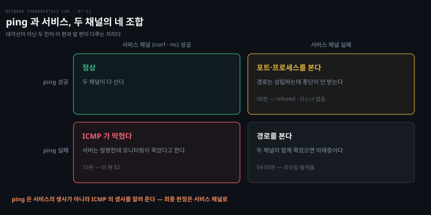

# 길은 멀쩡한데 안 통할 때

---

> 저장소 14·15·16편을 묶었습니다. 세 편 모두 경로는 성립하는데 안 통하는 경우이고, 공통 처방은 하나입니다 — **채널을 분리해서 봅니다.**

## 핵심 요약

> 이 편이 매달린 하나의 생각은 **하나로 보이는 통신이 실은 여러 채널이고, 그중 하나만 어긋나도 안 통한다**는 것입니다.

이름으로 접속하는 일에는 이름 채널과 IP 채널이 있습니다. 서버 생존을 확인하는 일에는 진단 채널과 서비스 채널이 있습니다. 공개된 주소로 들어가는 일에는 외부 경로와 내부 경로가 있습니다. 세 편이 각각 한 쌍씩 다루는데, 진단이 막히는 이유가 늘 같습니다 — **두 채널을 하나로 보기 때문**입니다.

그래서 이 편의 도구는 전부 "갈라 보는" 명령입니다.

- `dig @권한서버` 와 `dig @리졸버` 를 따로 물어 캐시를 가려냅니다.
- `ping` 대신 `curl` 로 서비스 채널을 확인합니다.
- 클라이언트 캡처에서 응답의 주소와 포트를 접속처와 대조합니다.

마지막 16편은 앞 블록의 11편과 대구를 이룹니다. 그때는 리턴이 번역기를 **불필요하게 경유**해서 깨졌고, 이번에는 **필요한데 건너뛰어** 깨집니다. 한 문장으로 합치면 **번역이 개입한 세션은 왕복이 같은 번역기를 지나야 합니다.**


## 학습 목표

> 이 편을 읽고 나면 아래 다섯 가지를 스스로 해낼 수 있습니다.

1. TTL 이 깎여 내려오는 것이 캐시가 답하고 있다는 지문임을 설명할 수 있습니다.
2. `dig @권한서버` 와 `dig @리졸버` 의 답이 갈릴 때 범인을 캐시로 확정할 수 있습니다.
3. ping 실패가 서비스 다운과 다른 말인 이유를 채널 개념으로 설명할 수 있습니다.
4. ICMP 를 전면 차단할 때 함께 부서지는 것 셋을 댈 수 있습니다.
5. 헤어핀 실패의 지문을 SYN-ACK 의 주소와 포트로 식별하고, 11편과 한 문장으로 묶을 수 있습니다.

아래는 생존 확인의 두 채널을 교차시킨 표입니다. 네 칸 중 대각선만 직관과 맞고, 나머지 둘이 이 편과 앞 편이 다루는 자리입니다.




## 1. 이름 채널과 IP 채널을 분리합니다

> 앱이 보는 답은 대부분 리졸버의 캐시입니다. 권한 서버를 고쳐도 캐시가 살아 있으면 세상은 옛 답을 듣습니다.

### 풀려는 문제

장애 조치를 완벽하게 했는데 장애가 계속되는 경우가 있습니다. DNS 레코드를 살아 있는 서버로 바꿨는데도 접속이 계속 실패합니다. 조치가 틀린 것이 아니라 **아직 전파되지 않은** 것인데, 그것을 확인할 방법을 모르면 조치를 의심하며 시간을 씁니다.

### TTL 이 깎이면 캐시가 답하는 중입니다

```bash
docker exec clab-14-dns-cli dig app.lab | grep -A1 "ANSWER"
```

같은 질의를 두 번 연속 날려 보면 TTL 숫자가 **줄어들어 내려옵니다.** 첫 질의는 권한 서버의 답이라 원래 값이고, 두 번째는 캐시가 답하며 지나간 시간만큼 깎은 값입니다.

이 숫자가 그냥 정보가 아닙니다. **권한 서버를 고쳐도 반영되지 않는 잔여 시간**입니다. TTL 이 3600 이면 최악의 경우 한 시간 동안 세상은 옛 답을 듣습니다.

### 계층을 분리해 질의합니다

```bash
docker exec clab-14-dns-cli dig +short @10.14.0.54 app.lab   # 권한 서버에 직접
docker exec clab-14-dns-cli dig +short app.lab                # 평소 경로
```

이 두 줄이 이 절의 핵심 기술입니다. 권한 서버는 이미 새 주소를 답하는데 평소 경로는 옛 주소를 답하면 **범인은 캐시로 확정**입니다. 조치는 완벽했고 기다리거나 캐시를 비워야 합니다.

캐시 플러시는 사후약방문입니다. 모든 클라이언트와 중간 리졸버를 다 비울 수는 없기 때문입니다. **근본 설계는 TTL 입니다.** 페일오버가 5분 안에 먹혀야 한다면 TTL 이 5분을 넘으면 안 됩니다.

### 라운드로빈은 헬스체크가 아닙니다

14편의 마지막 실습이 실무에서 가장 자주 보는 증상을 만듭니다. 한 이름에 주소 둘이 걸려 있고 그중 하나가 죽어 있으면, 요청은 **실패하지 않습니다.** 클라이언트가 다음 주소로 폴백하기 때문입니다.

대신 **절반이 수십 배 느려집니다.** 리졸버가 순서를 번갈아 주므로, 죽은 주소를 먼저 시도한 요청만 그것을 포기하고 다음 주소로 넘어가는 시간을 더 씁니다. 모니터링에는 "간헐 지연" 으로만 보입니다.

DNS 라운드로빈은 부하 분산이지 헬스체크가 아닙니다. **죽은 대상을 스스로 빼 주지 않습니다.**


## 2. 진단 채널과 서비스 채널은 다릅니다

> ping 은 서비스의 생사가 아니라 ICMP 의 생사를 알려 줍니다. 최종 판정은 언제나 서비스 채널로 합니다.

### 관측과 실재가 갈립니다

15편의 실습은 두 줄로 끝납니다. ping 은 전부 손실되는데 `curl` 은 응답을 받아 옵니다. 서버는 멀쩡한데 모니터링은 죽었다고 말합니다.

중간 장비가 채널별로 다르게 다루면 이런 일이 생깁니다. **"ping 이 안 된다" 만으로 장애를 선언하면 안 됩니다.** 반대 방향도 성립합니다 — ping 은 되는데 서비스가 죽은 경우가 앞 블록 08편의 자리입니다.

### 전면 차단의 청구서

ICMP 는 선택 사항이 아니라 제어 채널입니다. 전면 차단하면 셋이 함께 부서집니다.

- **생존 확인**: echo 가 막혀 가장 싼 측정 수단을 잃습니다
- **경로 추적**: time-exceeded 가 막혀 traceroute 가 첫 홉 너머로 눈이 멉니다
- **PMTUD**: destination-unreachable 중 frag-needed 가 막혀 앞 편의 블랙홀이 생깁니다

셋째가 가장 비쌉니다. 앞 편에서 본 "작은 것은 되고 큰 것만 멎는" 장애가 여기서 만들어집니다. 그러니 ICMP 전면 차단은 **진단을 막는 동시에 장애를 만드는** 설정입니다.

### 양립할 수 있습니다

차단하는 근거가 없지는 않습니다. 스캔과 터널링, redirect 악용의 역사가 있습니다. 문제는 전면 차단이라는 **과잉**입니다.

```bash
docker exec clab-15-icmp-blocked-fw nft 'add rule ip fw forward \
  icmp type { echo-request, echo-reply, destination-unreachable, time-exceeded } accept'
```

필요한 타입만 열고 나머지는 계속 막으면 보안 요구와 운영 요구가 양립합니다. 방화벽 정책을 리뷰할 때 물을 것이 정해집니다. **echo 와 destination-unreachable 과 time-exceeded 가 살아 있는가.** 이 셋이 진단 가능성의 최소 조건입니다.


## 3. 밖에서는 되는데 안에서는 안 될 때

> DNAT 는 목적지만 바꿉니다. 소스가 그대로면 서버는 같은 동네 이웃에게 직접 답하고, 그 순간 번역이 미완성으로 끝납니다.

### 지문은 주소와 포트 둘 다입니다

증상은 타임아웃입니다. 내부에서 자기 공인 주소로 접속하면 안 되는데 외부에서는 됩니다.

클라이언트에서 캡처를 뜨면 앞 블록에서 본 장면의 변주가 나옵니다. SYN 은 공인 주소의 8080 으로 나가는데, SYN-ACK 는 **서버 실주소의 80** 에서 옵니다. 주소만 다른 것이 아니라 **포트까지 다릅니다.** DNAT 흔적이 그대로 노출된 것이고, 커널은 모르는 상대로 보고 RST 로 끊습니다.

### 왜 서버가 직행하는가

서버 쪽에서 교차 검증하면 원인이 분명해집니다. DNAT 는 정상 동작해 목적지가 서버로 바뀌어 도착했습니다. 그런데 **소스가 클라이언트의 사설 주소 그대로**입니다.

서버 입장에서 그 소스는 같은 서브넷 이웃입니다. 앞 블록에서 배운 원리대로, 같은 서브넷이면 게이트웨이를 거칠 이유가 없으므로 직접 응답합니다. 번역기를 건너뛴 것이고 역번역이 일어나지 않습니다.

### 11편과 한 문장으로 묶입니다

| | 11편 | 16편 |
|---|---|---|
| 고장 | 리턴이 번역기를 **불필요하게 경유** | 리턴이 번역기를 **필요한데 건너뜀** |
| 지문 | SYN-ACK 의 주소가 다름 | SYN-ACK 의 주소와 포트가 다름 |

원리는 하나입니다. **번역이 개입한 세션은 왕복이 같은 번역기를 지나야 합니다.** 경유가 과해도 깨지고 모자라도 깨집니다.

수정은 헤어핀 구간에 한해 소스를 NAT 주소로 바꿔 서버의 응답이 반드시 NAT 을 지나게 만드는 것입니다. 대가는 앞 블록에서 배운 그것입니다 — **서버가 내부 클라이언트의 진짜 주소를 잃습니다.** 그래서 규칙에 소스·목적지·포트 조건을 달아 대가를 치르는 트래픽을 최소화합니다.

실무 처방은 셋이고 각각 다른 것을 포기합니다.

- **헤어핀 SNAT**: 어디서나 같은 공인 주소를 쓸 수 있지만 서버가 내부 소스를 잃습니다
- **스플릿 DNS**: 내부에서는 이름이 사설 주소로 풀리게 해 NAT 을 우회합니다. 소스는 보존되지만 DNS 를 이원 관리해야 합니다
- **프로토콜 자체의 한계 인지**: FTP active 나 SIP 처럼 **페이로드에 주소를 적는** 프로토콜은 헤더만 바꾸는 NAT 와 상성이 근본적으로 나쁩니다

세 번째가 이 시리즈 전체의 마무리이기도 합니다. NAT 는 만능이 아니고, 헤더를 고쳐 쓰는 일에는 언제나 대가가 따릅니다.


## 4. 실습 메모

> 아직 돌리지 않았습니다. 14편은 배포 중 인터넷이 필요하다는 점을 미리 확인해 둡니다.

```bash
./clab.sh deploy  14-dns/14-dns.clab.yml
./clab.sh destroy 14-dns/14-dns.clab.yml
./clab.sh deploy  15-icmp-blocked/15-icmp-blocked.clab.yml
./clab.sh destroy 15-icmp-blocked/15-icmp-blocked.clab.yml
./clab.sh deploy  16-nat-hairpin/16-nat-hairpin.clab.yml
./clab.sh destroy 16-nat-hairpin/16-nat-hairpin.clab.yml
```

14편은 cache 와 auth 노드가 배포 중 `apk add dnsmasq` 를 받으므로 아웃바운드가 열려 있어야 합니다.

| 편 | 무엇을 만드나 | 볼 것 |
|---|---|---|
| 14 A | 같은 `dig` 를 두 번 | TTL 이 **깎여서** 내려오는가 |
| 14 B | 권한 서버 레코드 변경 후 두 경로로 질의 | `@auth` 와 평소 경로의 답이 갈리는가 |
| 14 B | 캐시에 SIGHUP | 그제야 새 주소가 나오는가 |
| 14 C | 다중 A 이름으로 5회 연속 요청 | 시간이 **교대로** 갈리는가 |
| 15 A | ping 과 `curl` 을 나란히 | 한쪽만 실패하는가 |
| 15 B | `traceroute` | 첫 홉만 보이고 그 너머가 암흑인가 |
| 15 수정 | 네 타입만 허용 | ping 과 traceroute 가 살아나고 서비스는 그대로인가 |
| 16 B | 클라이언트 캡처 | SYN-ACK 의 **주소와 포트가 둘 다** 다른가 |
| 16 C | 서버 캡처 | 도착한 소스가 **클라이언트 사설 주소**인가 |
| 16 수정 | 헤어핀 SNAT | 서버가 보는 소스가 NAT 주소로 바뀌는가 |

| 실측 항목 | 값 | 잰 날 |
|---|---|---|
| 14 두 번째 질의의 TTL | | |
| 14 `@auth` 와 평소 경로의 답 | | |
| 14 다중 A 5회의 소요 시간 | | |
| 15 ping 과 curl 의 결과 | | |
| 16 SYN-ACK 의 주소와 포트 | | |
| 16 서버에 도착한 소스 주소 | | |

막힌 지점과 예상과 달랐던 것은 Phase 3 에서 이 아래에 적습니다.

이 편까지 오면 저장소 18편을 다 훑은 것입니다. 다음은 `checkpoints/` 의 블라인드 미션인데, 이 노트에는 담지 않습니다. 증상만 보고 푸는 것이라 답을 적는 순간 문항이 죽기 때문입니다. 풀고 나면 [`troubleshooting/`](../../../troubleshooting/README.md) 의 드릴 규약대로 계층 폴더에 사례로 올립니다.


## 관련 문서

- [network-fundamentals-lab 실습 인덱스](./README.md) — 블록 구조와 18장 목표
- [연결은 양 끝만의 일이 아니다](./05-01.%EC%97%B0%EA%B2%B0%EC%9D%80%20%EC%96%91%20%EB%81%9D%EB%A7%8C%EC%9D%98%20%EC%9D%BC%EC%9D%B4%20%EC%95%84%EB%8B%88%EB%8B%A4.md) — 11편과 대구를 이루는 편
- [작은 것은 되고 큰 것만 멎는다](./06-01.%EC%9E%91%EC%9D%80%20%EA%B2%83%EC%9D%80%20%EB%90%98%EA%B3%A0%20%ED%81%B0%20%EA%B2%83%EB%A7%8C%20%EB%A9%8E%EB%8A%94%EB%8B%A4.md) — ICMP 차단이 만드는 블랙홀
- [DNS 필터링 차단 — NXDOMAIN·DoH·우회 마찰](../../networking/01-03.DNS%20%ED%95%84%ED%84%B0%EB%A7%81%20%EC%B0%A8%EB%8B%A8%20%E2%80%94%20NXDOMAIN%C2%B7DoH%C2%B7%EC%9A%B0%ED%9A%8C%20%EB%A7%88%EC%B0%B0.md) — 질의를 보내는 쪽의 SSOT
- [learning-coredns](../../../08_cloud/book/learning-coredns/README.md) — 질의를 받는 쪽, 권한 서버의 구성
