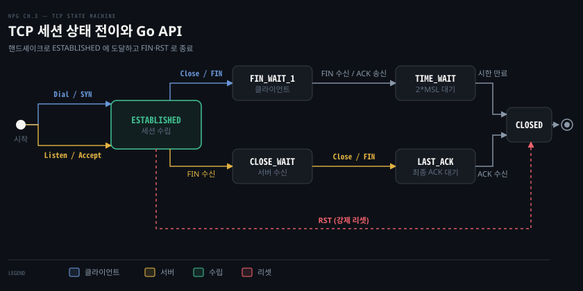
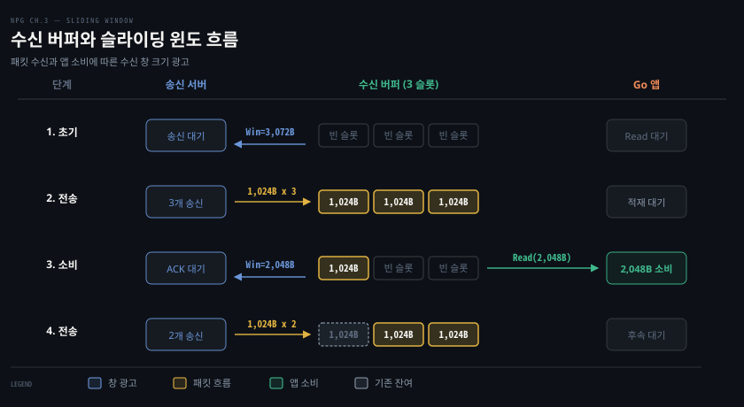

# TCP 세션은 핸드셰이크로 열고 창으로 속도를 맞추고 FIN·RST 로 끝난다

---

> 3장 앞부분은 신뢰할 수 있는 TCP 스트림이 네트워크에서 어떻게 만들어지고 유지되며 끝나는지를 다룹니다. 커널 TCP 가 패킷 손실·순서 뒤바뀜·속도 조절을 감싸 주므로, Go 애플리케이션은 복잡한 하위 제어를 직접 다루지 않고 소켓 연결 객체를 통해 데이터를 안정적으로 주고받습니다.

## 핵심 요약

> 이 편이 매달린 하나의 생각은, TCP 가 제공하는 신뢰성의 실체는 양 끝점이 주고받는 패킷 교환과 버퍼 제어이며 Go 애플리케이션은 이를 몇 가지 단순한 API 호출 뒤에서 누린다는 사실입니다.

TCP 세션은 열기, 데이터 전송, 종료의 세 국면을 거칩니다. 클라이언트와 서버는 3-way handshake 로 서로의 기능과 초기 순서 번호를 맞춘 뒤 세션을 엽니다. 데이터가 오갈 때는 수신 버퍼의 남은 공간을 ACK 패킷의 Window Size 로 상대에게 계속 알리며 전송 속도를 제어합니다.

세션을 마칠 때는 FIN 패킷을 주고받으며 양방향 연결을 정상적으로 닫거나, 프로세스 비정상 종료나 방화벽 개입 시 RST 패킷으로 연결을 즉시 끊어냅니다. Go 애플리케이션 입장에서는 `net.Dial`, `conn.Read`, `conn.Write`, `conn.Close` 같은 호출을 부를 뿐이지만, 하위 계층에서는 패킷과 상태 전이가 쉼 없이 일어납니다. 원문은 `FIN_WAIT_2` 를 생략하므로 완전한 TCP 상태 전이는 [TII 13-03 TCP 상태는 연결의 과거를 기억하고 RST는 그 기억을 끊는다](../tii_tcp-ip-illustrated/13-03.TCP%20상태는%20연결의%20과거를%20기억하고%20RST는%20그%20기억을%20끊는다.md)를 참고합니다.

## 학습 목표

> 이 편을 읽고 나면 아래 다섯 가지를 스스로 해낼 수 있습니다.

1. TCP 가 패킷 손실과 네트워크 혼잡을 극복하고 신뢰성을 보장하는 원리를 설명할 수 있습니다.
2. 3-way handshake 의 세 패킷이 교환하는 정보와 Go 애플리케이션 관점에서 감춰지는 동작을 짚을 수 있습니다.
3. 수신 버퍼와 슬라이딩 윈도가 송신 속도를 묶는 구조를 원서의 실제 수치 예제로 재현할 수 있습니다.
4. 애플리케이션의 지연된 읽기가 왜 송신 측 전송 중단(zero window)으로 이어지는지 과정을 말할 수 있습니다.
5. FIN 을 통한 정상 종료 절차와 RST 세그먼트가 전달되는 상황의 차이를 비교할 수 있습니다.

## 1. TCP 는 손실과 순서 뒤바뀜을 감춰 믿을 수 있다

> TCP 는 하위 통신 매체의 전송 오류와 네트워크 혼잡으로 생기는 패킷 손실 및 지연을 재전송과 순서 재정렬로 감싸 애플리케이션에 결함 없는 바이트 흐름을 제공합니다.

### 패킷 손실과 혼잡이 발생하는 배경

네트워크에서 데이터가 목적지에 닿지 못하는 패킷 손실은 무선 간섭 같은 전송 오류나 네트워크 혼잡 때문에 발생합니다. 네트워크 혼잡은 연결이 처리할 수 있는 용량보다 많은 데이터를 노드들이 한꺼번에 밀어 넣을 때 생깁니다. 원문은 10 Mbps 대역폭의 회선에 1 Gbps 속도로 데이터를 쏟아붓는 사례를 듭니다. 대역폭이 순식간에 포화되며 경로 상의 네트워크 노드들이 넘쳐나는 패킷을 버리게 됩니다.

라우팅 프로토콜이 망 상태에 따라 메트릭을 동적으로 바꾸기 때문에 전송된 패킷들이 서로 다른 경로를 거치며 순서가 뒤바뀌어 도착할 수도 있습니다. TCP 는 수신한 패킷 목록을 추적하고 확인응답을 받지 못한 패킷을 다시 보내며 뒤섞인 패킷을 번호에 맞춰 올바른 순서로 재조립합니다.

### 하위 결함을 흡수하는 전송 제어

원문은 TCP 가 네트워크 환경 변화에 맞춰 데이터 전송률을 조절하여 패킷 손실을 최소화한다고 설명합니다. 무선 신호가 약해지거나 수신 노드가 데이터 처리에 허덕이는 상황에서도 전송 속도를 알맞게 맞춥니다. TCP 가 이처럼 재전송과 전송률 조절로 하위 매체의 한계를 메워 주기 때문에 애플리케이션 개발자는 네트워크 전송 결함을 직접 신경 쓰지 않고 비즈니스 데이터의 송수신에 집중할 수 있습니다.

TCP 신뢰성을 만드는 재전송 타이머와 순서 번호의 자세한 규격 및 패킷 헤더 구조는 [TII 12-01 TCP 의 신뢰성은 재전송·번호·창으로 만든다](../tii_tcp-ip-illustrated/12-01.TCP%20의%20신뢰성은%20재전송·번호·창으로%20만든다.md)에서 깊게 다룹니다.

## 2. 세션은 핸드셰이크로 열리고 순서 번호와 ACK 로 이어진다

> TCP 연결은 양쪽이 서로를 확인하는 세 차례의 인사로 시작되며, 각 패킷에 실린 순서 번호와 누적 확인응답 번호로 데이터의 도달 여부를 빈틈없이 추적합니다.

### 3-way Handshake 와 초기 설정 교환

원문은 TCP 세션을 두 사람 사이의 대화에 빗댑니다. 인사를 나누고 본 대화를 진행한 뒤 작별 인사를 고하는 흐름과 같습니다. 두 노드가 대화를 트기 위해 주고받는 세 메시지가 3-way handshake 입니다.

1. 클라이언트가 SYN(Synchronize) 플래그를 켠 패킷을 서버에 보냅니다. 이 패킷은 클라이언트의 통신 기능과 선호하는 창(Window) 설정을 서버에 알립니다.
2. 서버는 SYN 과 ACK(Acknowledgment) 플래그를 함께 켠 패킷으로 응답합니다. 클라이언트의 SYN 을 확인했음을 알리고 서버가 합의한 통신 설정을 전달합니다.
3. 클라이언트는 서버의 SYN 을 확인하는 마지막 ACK 패킷을 회신하여 핸드셰이크를 매듭짓습니다.

이 절차가 끝나면 세션이 ESTABLISHED 상태로 수립되어 데이터를 자유롭게 주고받을 수 있습니다. 송수신할 데이터가 없으면 세션은 유휴(idle) 상태로 대기합니다. 세션 수립 과정의 세부 패킷 교환 메커니즘은 [TII 13-01 TCP 연결은 세 세그먼트로 열고 네 세그먼트로 닫는다](../tii_tcp-ip-illustrated/13-01.TCP%20연결은%20세%20세그먼트로%20열고%20네%20세그먼트로%20닫는다.md)를 참고할 수 있습니다.

### Go 애플리케이션이 보지 못하는 것

Go 애플리케이션은 이 복잡한 세그먼트 왕복을 전혀 보지 않습니다. 클라이언트 코드에서 `net.Dial` 을 부르면 런타임과 OS 가 내부에서 핸드셰이크를 끝마친 뒤 성공한 `net.Conn` 객체를 돌려주거나 오류를 반환합니다. 개발자는 핸드셰이크 절차를 손수 구현할 필요가 없습니다. Go 코드로 리스너를 열고 다이얼을 거는 구체적인 방법은 다음 편인 [03-02 Go 의 TCP 연결은 Listen·Accept·Dial 세 호출로 맺는다](./03-02.Go%20의%20TCP%20연결은%20Listen·Accept·Dial%20세%20호출로%20맺는다.md)에서 다룹니다.

### 순서 번호와 누적 확인응답

모든 TCP 패킷은 운영체제가 결정한 순서 번호를 담습니다. 핸드셰이크 중 클라이언트는 초기 순서 번호 X 를 SYN 에 싣고, 서버는 자기 번호 Y 를 실어 보냅니다.

수신 측이 보내는 ACK 패킷은 "이 번호까지의 모든 패킷을 빠짐없이 받았습니다"라는 누적 확인응답을 뜻합니다. 원문이 든 예시에 따르면, 송신 측이 100번까지의 패킷을 보냈는데 수신 측에서 90번 ACK 를 돌려준다면 송신 측은 91번부터 100번까지의 패킷이 누락되었음을 알아채고 재전송합니다. 필요에 따라 와이어샤크 같은 도구에서 특정 누락 구간만 선별해 알리는 선택적 확인응답(SACK)이 관측되기도 합니다. Go 개발자는 이런 바이트 수준의 번호 추적을 신경 쓰지 않아도 됩니다.

## 3. 수신 버퍼와 창 크기가 보내는 쪽의 속도를 묶는다

> 수신 버퍼는 애플리케이션이 즉시 읽지 못한 데이터를 임시로 보관하며, ACK 에 실려 가는 수신 창 크기는 송신 측이 한 번에 보낼 수 있는 바이트 한도를 통제합니다.

### 수신 버퍼와 윈도 크기

네트워크를 통해 도착한 패킷은 애플리케이션이 즉시 읽지 않더라도 운영체제의 수신 버퍼(receive buffer)에 먼저 쌓입니다. 클라이언트와 서버는 각 연결마다 독립적인 수신 버퍼를 유지합니다. Go 코드에서 `conn.Read()` 를 호출하면 네트워크 장치에서 직접 긁어오는 것이 아니라 바로 이 수신 버퍼에 쌓인 데이터를 퍼 올립니다.

ACK 패킷에 담기는 핵심 정보가 바로 **윈도 크기(Window Size)**입니다. 윈도 크기는 수신 측이 확인응답을 보내기 전에 송신 측이 추가로 전송할 수 있는 바이트 수를 뜻합니다. 클라이언트가 24,537 바이트의 윈도 크기를 알리면 서버는 추가 ACK 없이 24,537 바이트를 전송할 수 있습니다.

### 실제 수치로 보는 슬라이딩 윈도

서로의 윈도 크기를 맞추며 버퍼를 효율적으로 채우는 메커니즘을 슬라이딩 윈도(sliding window)라고 부릅니다. 원문 그림 3-3 은 구체적인 바이트 수치로 이 흐름을 보여줍니다.

1. 클라이언트가 이전 데이터에 대한 ACK 를 전송하며 수신 가능한 윈도 크기로 **3,072 바이트**를 서버에 알립니다.
2. 서버는 3,072 바이트 한도 내에서 **1,024 바이트 패킷 3개**를 연속해서 보내 클라이언트의 수신 버퍼를 채웁니다.
3. 클라이언트 머신의 애플리케이션이 수신 버퍼에서 **2,048 바이트**를 읽어 들이고, 클라이언트는 갱신된 윈도 크기 **2,048 바이트**를 실어 새 ACK 를 보냅니다.
4. 서버는 여유 공간에 맞춰 **1,024 바이트 패킷 2개**를 보내 버퍼를 다시 채운 뒤 다음 ACK 를 기다립니다.

### 애플리케이션이 늦게 읽을 때 벌어지는 일

만약 수신 측 Go 애플리케이션이 다른 무거운 작업으로 블로킹되어 `conn.Read()` 를 제때 호출하지 않으면 수신 버퍼가 꽉 차게 됩니다. 그러면 수신 측은 윈도 크기를 0으로 알리는 **Zero Window** 패킷을 전송합니다(원문 p.5).

수신 창이 0이 되면 송신 측 커널은 네트워크로 새 데이터를 내보내지 못합니다. 이때 송신 측 애플리케이션이 데이터를 계속 쓰면 소켓의 송신 버퍼에 데이터가 차오르고 송신 버퍼마저 가득 차면 그때 비로소 `conn.Write()` 가 반환하지 않고 기다립니다. Go 런타임 환경에서는 `Write` 를 부른 고루틴이 블로킹되어 netpoller 에 주차됩니다.

닫힌 수신 창이 다시 열렸는지는 애플리케이션의 `Write` 가 아니라 송신 측 커널이 주기적으로 전송하는 zero window probe 로 확인합니다. 수신 측이 비워진 버퍼 공간을 창 갱신 패킷으로 알려올 때까지 `Write` 를 부른 고루틴은 멈춰 서게 됩니다. 이 제로 윈도 메커니즘과 실제 서비스에서의 병목 방지는 [04-03 §5 버그 1: 읽기를 멈춰 발생하는 제로 윈도 (Zero Window)](./04-03.TCPConn%20손잡이와%20흔한%20버그%20—%20keepalive·linger·버퍼·zero%20window·CLOSE_WAIT.md#버그-1-읽기를-멈춰-발생하는-제로-윈도-zero-window)에서 다룹니다.

## 4. FIN 으로 정중히 닫고 RST 로 갑자기 끊긴다

> 정상적인 세션은 양방향 FIN 패킷을 교환하며 단계를 밟아 닫히지만, 애플리케이션 충돌이나 방화벽 강제 개입 시에는 RST 패킷이 날아와 연결을 즉각 폭파합니다.

### FIN 을 통한 정상 종료 (Graceful Termination)

데이터 전송을 마친 TCP 세션은 양방향 흐름을 각각 닫는 절차를 밟습니다. 어느 쪽이든 먼저 종료를 시작할 수 있습니다. 원문 그림 3-4 의 시나리오를 기준으로 상태 전이를 따라가 봅니다.

1. 클라이언트가 종료를 위해 **FIN** 패킷을 보냅니다. 클라이언트의 TCP 상태는 `ESTABLISHED` 에서 `FIN_WAIT_1` 로 바뀝니다.
2. 서버는 클라이언트의 FIN 을 확인하는 **ACK** 를 보냅니다. 서버 상태는 `ESTABLISHED` 에서 `CLOSE_WAIT` 로 전이됩니다.
3. 서버도 데이터 송신을 마무리하고 자기 **FIN** 패킷을 보냅니다. 서버 상태는 `CLOSE_WAIT` 에서 `LAST_ACK` 로 바뀝니다.
4. 클라이언트는 서버의 FIN 에 대한 마지막 **ACK** 를 보낸 뒤 `TIME_WAIT` 상태로 진입합니다.
5. 서버는 최종 ACK 를 수신하는 즉시 `CLOSED` 상태가 되어 세션을 완전히 정리합니다.
6. 클라이언트는 `TIME_WAIT` 상태에서 최대 세그먼트 수명(MSL, Maximum Segment Lifetime)의 2배 동안 대기합니다. RFC 793 기준 MSL 기본값은 2분이지만 운영체제 설정으로 조정할 수 있습니다. 2 * MSL 시간이 지나면 클라이언트 연결도 `CLOSED` 로 바뀌며 사라집니다.

Go 코드에서는 연결 객체의 `conn.Close()` 메서드를 호출하여 이 정리 과정을 트리거합니다. 상세 상태 전이 다이어그램은 [TII 13-03 TCP 상태는 연결의 과거를 기억하고 RST는 그 기억을 끊는다](../tii_tcp-ip-illustrated/13-03.TCP%20상태는%20연결의%20과거를%20기억하고%20RST는%20그%20기억을%20끊는다.md)를 참고할 수 있습니다. 만약 서버가 `CLOSE_WAIT` 상태에서 소켓을 닫지 않고 방치하면 파일 디스크립터가 고갈되는 심각한 누수가 발생하는데, 이 함정은 04-03 편에서 상세히 다룹니다.

### RST 로 인한 비정상 강제 종료

모든 연결이 예의 바르게 FIN 을 주고받으며 끝나지는 않습니다. 연결을 맺고 있던 애플리케이션이 예기치 않게 크래시되거나 강제 종료되면 운영체제는 연결을 즉시 닫아 버립니다.

이 상태에서 상대방이 과거의 세션으로 착각하고 패킷을 보내오면, 닫힌 쪽의 TCP 스택은 즉각 **RST(Reset)** 패킷을 반환합니다. RST 패킷은 "내 쪽 연결은 이미 닫혔으니 더 이상 데이터를 보내지 말고 즉시 연결을 폐기하라"고 통보합니다. RST 를 받은 노드는 아직 확인받지 못한 송신 데이터가 있더라도 세션을 즉시 해제합니다.

소켓 중간에 놓인 방화벽 같은 네트워크 중간 장비도 보안 정책이나 세션 타임아웃에 따라 양쪽 끝 노드 모두에게 RST 패킷을 능동적으로 쏘아 연결을 강제로 끊어버릴 수 있습니다.

## 면접 대비

> 아래 질문에 답하면서 Go 애플리케이션 개발자가 TCP 커널 동작을 이해해야 하는 이유를 짚어 보세요.

1. TCP 세션 수립 시 3-way handshake 에서 주고받는 세 메시지와 각 메시지의 역할을 설명해 주세요.
2. 수신 버퍼의 남은 공간과 ACK 에 담기는 Window Size 의 관계를 설명하고, 수신 애플리케이션이 읽기를 멈추면 송신 측에 어떤 현상이 발생하는지 말해 주세요.
3. TCP 세션을 정상 종료할 때 `TIME_WAIT` 상태가 필요한 이유와 대기 시간(2 * MSL)의 의미를 설명해 주세요.
4. TCP 연결 종료에서 정상적인 FIN 교환과 비정상적인 RST 수신의 차이점은 무엇인가요?

## 정답 (자답 후 펼치기)

> 위 §면접 대비의 질문에 먼저 스스로 답한 뒤 읽으세요.

### 정답 1 — 3-way Handshake 와 양방향 설정 합의

클라이언트가 SYN 을 보내 연결 개설 의사와 초기 순서 번호(ISN), 윈도 설정을 알립니다. 서버는 이에 응답하여 SYN/ACK 를 보내 클라이언트의 SYN 을 확인하고 서버 측 통신 설정을 전달합니다. 마지막으로 클라이언트가 서버의 SYN 을 확인하는 ACK 를 보내 세션이 수립됩니다. 이 과정을 통해 양 끝점은 신뢰할 수 있는 데이터 전송을 위한 초기 상태를 동기화합니다.

### 정답 2 — 수신 버퍼 고갈과 Zero Window

수신 버퍼는 네트워크에서 도착한 패킷을 임시 저장하는 공간입니다. 수신 측은 이 버퍼의 미사용 여유 공간을 ACK 패킷의 Window Size 필드에 담아 송신 측에 알립니다. 애플리케이션이 `conn.Read()` 를 호출하지 않아 수신 버퍼가 가득 차면 Window Size 가 0이 되는 Zero Window 현상이 발생하고 송신 측은 전송을 멈추고 대기하게 됩니다.

### 정답 3 — 최종 ACK 유실 대비와 옛 패킷 소멸

클라이언트가 보낸 마지막 ACK 가 네트워크에서 유실되면 서버는 FIN 을 재전송하게 됩니다. 클라이언트가 즉시 소켓을 닫아버리면 이 재전송된 FIN 에 대해 RST 로 응답하게 되어 비정상 종료가 일어납니다. 또한 네트워크 지연으로 뒤늦게 도착한 옛 세그먼트가 새 세션에 섞이는 문제를 막기 위해, 세그먼트가 네트워크에 머무를 수 있는 최대 수명(MSL)의 2배 동안 `TIME_WAIT` 상태를 유지한 뒤 안전하게 종료합니다.

### 정답 4 — 양방향 정리(FIN) vs 즉시 파기(RST)

FIN 은 양쪽 끝점이 보낼 데이터를 모두 전송한 뒤 점잖게 한 방향씩 닫는 정상 종료입니다. FIN 을 주고받는 동안 남아 있는 데이터 수신이 가능하며 `TIME_WAIT` 상태를 거쳐 안전하게 정리됩니다. 반면 RST 는 프로세스 크래시, 포트 미개방, 방화벽 개입 등으로 연결을 더 이상 유지할 수 없을 때 즉각 세션을 파기하도록 강제하는 제어 패킷입니다. 수신 즉시 버퍼의 미처리 데이터를 버리고 소켓을 해제합니다.

## 참고 자료

- 《Network Programming with Go》 Adam Woodbeck, No Starch Press, 2021. ISBN 978-1-7185-0088-4. Chapter 3 Reliable TCP Data Streams (p.1–7).
- [RFC 9293 — Transmission Control Protocol (TCP)](https://www.rfc-editor.org/rfc/rfc9293): TCP 신뢰성, 슬라이딩 윈도 및 연결 제어 표준.
- [RFC 793 — Transmission Control Protocol](https://www.rfc-editor.org/rfc/rfc793): 세그먼트 최대 수명(MSL) 및 기본 타임아웃 규정.

## 관련 문서

- [03-02 Go 의 TCP 연결은 Listen·Accept·Dial 세 호출로 맺는다](./03-02.Go%20의%20TCP%20연결은%20Listen·Accept·Dial%20세%20호출로%20맺는다.md): 핸드셰이크를 감추고 연결 객체를 다루는 Go 표준 라이브러리 사용법을 다룹니다.
- [04-03 TCPConn 손잡이와 흔한 버그 — keepalive·linger·버퍼·zero window·CLOSE_WAIT](./04-03.TCPConn%20손잡이와%20흔한%20버그%20—%20keepalive·linger·버퍼·zero%20window·CLOSE_WAIT.md): 윈도 크기 고갈(zero window)과 소켓 미종료(`CLOSE_WAIT`) 누수 버그를 파헤칩니다.
- [TII 12-01 TCP 의 신뢰성은 재전송·번호·창으로 만든다](../tii_tcp-ip-illustrated/12-01.TCP%20의%20신뢰성은%20재전송·번호·창으로%20만든다.md): 재전송 타이머와 순서 번호의 패킷 단위 동작을 다룹니다.
- [TII 13-01 TCP 연결은 세 세그먼트로 열고 네 세그먼트로 닫는다](../tii_tcp-ip-illustrated/13-01.TCP%20연결은%20세%20세그먼트로%20열고%20네%20세그먼트로%20닫는다.md): 3-way 핸드셰이크와 4 세그먼트 종료의 패킷 덤프를 상세히 분석합니다.
- [TII 13-03 TCP 상태는 연결의 과거를 기억하고 RST는 그 기억을 끊는다](../tii_tcp-ip-illustrated/13-03.TCP%20상태는%20연결의%20과거를%20기억하고%20RST는%20그%20기억을%20끊는다.md): TCP 상태 전이도와 RST 패킷이 촉발되는 세부 상황을 살핍니다.
- [이 책의 정독 인덱스](./README.md): NPG 3장의 전반적인 학습 구성과 진행 로드맵.
