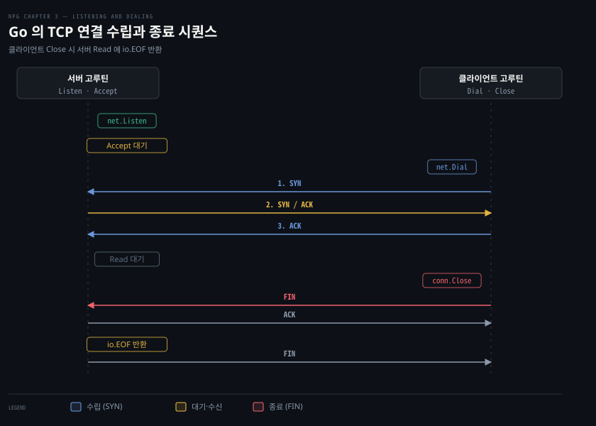

# Go 의 TCP 연결은 Listen·Accept·Dial 세 호출로 맺는다

---

> Go 표준 라이브러리의 `net` 패키지는 운영체제의 복잡한 소켓 바인딩과 3-way 핸드셰이크를 `net.Listen`, `listener.Accept`, `net.Dial` 세 가지 단순한 인터페이스로 추상화합니다.

## 핵심 요약

> 이 편이 매달린 하나의 생각은, Go 서버와 클라이언트가 연결을 맺고 끊는 생애주기는 리스너 소켓 대기와 고루틴 분기, 그리고 `io.EOF` 를 통한 정중한 종료로 수렴한다는 점입니다.

서버는 `net.Listen` 으로 특정 IP 와 포트에 리스너 소켓을 바인딩한 뒤 `for` 루프 안에서 `listener.Accept` 를 호출해 클라이언트의 연결 요청을 기다립니다. 새 연결이 들어오면 핸드셰이크가 완료된 개별 연결 소켓(`net.Conn`)이 반환되고 서버는 이 소켓을 독립 고루틴으로 띄워 비동기로 처리합니다.

클라이언트는 `net.Dial` 호출 한 번으로 상대 서버와 핸드셰이크를 거쳐 `net.Conn` 을 얻습니다. 클라이언트가 데이터 송수신을 마치고 `conn.Close()` 를 부르면 FIN 세그먼트가 날아가고, 서버 측의 `Read` 호출은 `io.EOF` 오류를 돌려받아 상대가 쓰기를 마쳤음을 알아챕니다.




## 학습 목표

> 이 편을 읽고 나면 아래 다섯 가지를 스스로 해낼 수 있습니다.

1. `net.Listen` 에 포트 0을 넘겼을 때 운영체제와 런타임이 포트를 할당하는 방식을 설명할 수 있습니다.
2. `listener.Accept` 루프에서 연결마다 별도 고루틴을 띄우는 이유와 직렬 처리의 한계를 말할 수 있습니다.
3. `defer c.Close()` 를 누락했을 때 운영체제 레벨에서 누수되는 자원을 지목할 수 있습니다.
4. `net.Dial` 호출 내부에서 핸드셰이크가 처리되는 과정과 반환되는 `net.Conn` 인터페이스의 성격을 짚을 수 있습니다.
5. 클라이언트가 소켓을 닫았을 때 서버 `Read` 가 왜 `io.EOF` 를 반환하는지 패킷 수준과 연결할 수 있습니다.


## 1. 리스너는 주소에 묶이고 Accept 로 연결을 하나씩 받는다

> `net.Listen` 은 운영체제로부터 지정한 주소와 포트를 독점 배정받고, `listener.Accept` 는 핸드셰이크가 끝난 연결을 하나씩 꺼내어 비동기 핸들러 고루틴에 넘깁니다.

### net 패키지의 네 요소 — 함수 둘이 인터페이스 둘을 돌려줍니다

이 장의 코드는 `net` 패키지의 네 요소만으로 연결을 맺습니다. 서버는 `Listen` 으로 `Listener` 를 얻고, 그 `Accept` 가 연결 하나마다 `Conn` 을 돌려줍니다. 클라이언트는 `Dial` 한 번으로 같은 `Conn` 을 얻습니다. 양쪽 끝이 결국 같은 인터페이스를 쥐므로 이후의 읽기·쓰기·닫기 코드는 서버와 클라이언트가 똑같습니다.

| 요소 | 모양 | 이 장에서 하는 일 |
|---|---|---|
| `net.Listen` | `func Listen(network, address string) (Listener, error)` | 주소에 묶인 대기 소켓을 연다 |
| `net.Listener` | 인터페이스: `Accept() (Conn, error)` · `Close() error` · `Addr() Addr` | 핸드셰이크를 마친 연결을 하나씩 꺼낸다 |
| `net.Dial` | `func Dial(network, address string) (Conn, error)` | 핸드셰이크를 마친 연결을 연다 |
| `net.Conn` | 인터페이스: `Read` · `Write` · `Close` · `LocalAddr` · `RemoteAddr` · `SetDeadline` · `SetReadDeadline` · `SetWriteDeadline` | 바이트를 읽고 쓰고 닫는다 |

- `Listen` 과 `Dial` 은 구체 타입 대신 인터페이스를 돌려줍니다. `"tcp"` 로 열면 실제 값은 `*net.TCPListener` 와 `*net.TCPConn` 이지만, 호출하는 쪽은 프로토콜과 상관없는 메서드만 봅니다. 
- [`net` 공식 문서](https://pkg.go.dev/net#Conn)는 여러 고루틴이 한 `Listener`·`Conn` 의 메서드를 동시에 불러도 된다고 적습니다.

`Conn` 의 `Read`·`Write` 는 `io.Reader`·`io.Writer` 와 시그니처가 같습니다. 그래서 연결을 `io` 패키지의 함수에 그대로 넘길 수 있습니다. 두 인터페이스 자체는 [Learning Go 13-01](../../../01_language/book/lgo_learning-go/13-01.io.Reader%20는%20버퍼를%20받아%20채우고%20작은%20인터페이스를%20겹쳐%20기능을%20더합니다.md)이, 연결을 `io.Copy` 로 잇는 쓰임은 [04-02](./04-02.io%20의%20Copy·MultiWriter·TeeReader%20로%20연결을%20잇고%20엿본다.md)가 다룹니다. 데드라인 메서드 셋은 [03-03](./03-03.타임아웃은%20Dialer·context%20로,%20유휴%20감지는%20데드라인과%20하트비트로%20건다.md)에서 씁니다.

### 포트 바인딩과 포트 0의 역할

TCP 서버를 만들려면 먼저 들어오는 연결을 수신할 대기 소켓(listener)을 열어야 합니다. Go 에서는 `net.Listen` 함수를 사용합니다.

```go
func TestListener(t *testing.T) {
	// (1) 네트워크 종류 "tcp", (2) IP 주소 "127.0.0.1", (3) 포트 번호 0
	listener, err := net.Listen("tcp", "127.0.0.1:0")
	if err != nil {
		t.Fatal(err)
	}
	defer func() { _ = listener.Close() }() // (4) 테스트 종료 시 리스너 소켓 정리

	t.Logf("bound to %q", listener.Addr()) // (5) 배정된 실제 주소 확인
}
```

이 코드가 주소와 포트를 지정하는 방식에는 몇 가지 규칙이 있습니다.

- **포트 번호 0 지정**: 포트 번호에 `0` 을 넣거나 `127.0.0.1:` 처럼 비워두면, 운영체제가 현재 비어 있는 임의의 임시 포트(ephemeral port)를 할당합니다. 고정 포트 충돌을 피해야 하는 단위 테스트나 동적 마이크로서비스 환경에서 유용합니다. 할당된 실제 포트는 `listener.Addr()` 로 조회합니다.
- **IP 주소 생략**: IP 주소를 생략하고 `:8080` 처럼 콜론과 포트만 넘기면 시스템에 설정된 모든 유니캐스트 및 애니캐스트 IP 주소에 바인딩됩니다.
- **네트워크 종류**: 첫 인자로 `"tcp"` 를 넘기면 IPv4 와 IPv6 를 모두 허용합니다. IPv4 전용은 `"tcp4"`, IPv6 전용은 `"tcp6"` 을 넘깁니다.
- **바인딩의 독점성**: 바인딩은 운영체제가 해당 IP 와 포트를 이 리스너 프로세스에 독점 할당했음을 뜻합니다. 이미 다른 프로세스가 점유한 포트에 바인딩을 시도하면 `bind: address already in use` 오류가 떨어집니다.

리스너 소켓과 실제 데이터를 주고받는 연결 소켓이 왜 둘로 나뉘는지는 [CNTD 02-01 §6 TCP 소켓 — 서버의 문이 둘인 이유](../cntd_computer-networking-top-down/02-01.앱은%20무엇을%20고르고%20무엇을%20못%20고르는가.md#6-tcp-소켓--서버의-문이-둘인-이유)에서 다룹니다.

### Accept 루프와 고루틴 분기

리스너를 열었다면 클라이언트의 연결 요청을 수신하는 루프를 구성해야 합니다. Listing 3-2 는 다중 클라이언트를 비동기로 처리하는 Go 의 전형적인 패턴을 보여줍니다.

```go
for { // (1) 다중 연결 수신을 위한 무한 루프
	conn, err := listener.Accept() // (2) 핸드셰이크 완료 대기 후 net.Conn 반환
	if err != nil {
		return err
	}

	// (3) 연결마다 독립 고루틴 생성
	go func(c net.Conn) {
		defer c.Close() // (4) 핸들러 종료 시 연결 닫기
		// Your code would handle the connection here.
	}(conn)
}
```

- **직렬 Accept 와 비동기 처리**: `listener.Accept()` 는 클라이언트와의 3-way 핸드셰이크가 완료될 때까지 블로킹됩니다. 연결이 맺어지면 새 소켓 객체인 `net.Conn` 을 반환합니다. 연결을 직렬(serial)로 처리하면 한 클라이언트의 작업이 끝날 때까지 다음 클라이언트가 대기열에 갇히므로, 반드시 연결마다 고루틴을 띄워 비동기로 넘겨야 합니다. 고루틴 생성 비용이 가벼운 Go 의 강점이 여기서 드러납니다.
- **`defer c.Close()` 의 중요성**: 고루틴 시작 부분에 `defer c.Close()` 를 걸어두지 않으면 핸들러 함수가 끝났을 때 운영체제의 소켓 파일 디스크립터(FD)가 회수되지 않습니다. 수천 개의 유령 소켓이 쌓여 결국 `too many open files` 오류와 함께 서버가 뻗게 됩니다.
- **리스너 소켓 종료의 전파**: `listener.Close()` 를 호출하면 블로킹되어 있던 `Accept()` 호출이 즉시 에러를 반환하며 깨어납니다. 이를 통해 서버의 수신 고루틴을 안전하게 빠져나올 수 있습니다.


## 2. Dial 은 핸드셰이크를 감추고 net.Conn 을 돌려준다

> `net.Dial` 은 주소 해석과 3-way 핸드셰이크를 한 번에 끝내며, 클라이언트의 `Close` 호출은 서버의 블로킹된 `Read` 에 `io.EOF` 신호로 전달됩니다.

### Dial 의 연결 수립과 주소 형식

클라이언트가 원격 서버에 연결할 때는 `net.Dial` 을 사용합니다. Listing 3-3 은 단일 테스트 함수 안에서 서버 고루틴을 띄우고 클라이언트가 다이얼을 걸어 연결한 뒤 정상 종료하는 전 과정을 보여줍니다.

```go
package ch03

import (
	"io"
	"net"
	"testing"
)

func TestDial(t *testing.T) {
	// (1) 임의의 포트로 리스너 생성
	listener, err := net.Listen("tcp", "127.0.0.1:")
	if err != nil {
		t.Fatal(err)
	}
	done := make(chan struct{})
  
	// (2) 서버 루프를 백그라운드 고루틴으로 실행
	go func() {
		defer func() { done <- struct{}{} }()
		for {
			conn, err := listener.Accept()
			if err != nil {
				t.Log(err)
				return
			}

			// (3) 연결 핸들러 고루틴
			go func(c net.Conn) {
				defer func() {
					c.Close()
					done <- struct{}{}
				}()

				buf := make([]byte, 1024)
				for {
					n, err := c.Read(buf) // (4) 데이터 또는 FIN 대기
					if err != nil {
						if err != io.EOF {
							t.Error(err)
						}
						return
					}
					t.Logf("received: %q", buf[:n])
				}
			}(conn)
		}
	}()

	// (5) 클라이언트의 연결 시도
	conn, err := net.Dial("tcp", listener.Addr().String())
	if err != nil {
		t.Fatal(err)
	}

	conn.Close() // (6) 클라이언트 쪽 정상 종료 → FIN 전송
	<-done
	listener.Close() // (7) 리스너 닫기 → Accept unblock
	<-done
}
```

이 테스트에서 클라이언트와 서버가 상호작용하는 원리는 다음과 같습니다.

- **`net.Dial` 의 인자**: 네트워크 종류 `"tcp"` 와 주소 문자열을 받습니다. IP 주소 대신 도메인 이름을 쓸 수 있고, 포트 번호 대신 `"http"` 같은 서비스 이름을 넘길 수도 있습니다. 도메인이 여러 IP 로 해석되면 Go 는 성공할 때까지 순차적으로 다이얼을 시도합니다. IPv6 주소는 `"[2001:ed27::1]:https"` 처럼 대괄호로 감싸야 합니다.
- **반환 객체**: 다이얼이 성공하면 `net.Conn` 인터페이스를 반환합니다. 실제 구현체는 `*net.TCPConn` 포인터이며, 일반적인 통신에는 `net.Conn` 의 `Read`, `Write`, `Close` 메서드로 충분합니다.

고루틴은 [Learning Go 12-01](../../../01_language/book/lgo_learning-go/12-01.고루틴은%20런타임이%20나눠%20돌리는%20가벼운%20스레드이고%20채널로%20값을%20주고받습니다.md)이, `WaitGroup` 으로 고루틴을 기다리는 법은 [Learning Go 12-03](../../../01_language/book/lgo_learning-go/12-03.버퍼%20채널은%20개수를%20알%20때%20쓰고%20WaitGroup%20과%20Once%20가%20기다림과%20한%20번%20실행을%20맡습니다.md)이 다룹니다.

### `conn.Close()` 와 서버의 `io.EOF`

이 코드의 가장 중요한 관전 포인트는 종료 흐름입니다.

1. 클라이언트가 `conn.Close()` 를 호출하면 운영체제 TCP 스택은 즉시 상대방에게 FIN 세그먼트를 쏩니다.
2. 서버 핸들러 고루틴은 `c.Read(buf)` 에서 새 데이터가 오기를 기다리며 블로킹되어 있었습니다.
3. 커널이 FIN 패킷을 받아 처리하면, 블로킹되어 있던 `c.Read(buf)` 는 즉시 읽은 바이트 수 `n = 0` 과 함께 **`io.EOF`** 오류를 반환합니다.
4. Go 에서 네트워크 연결의 `io.EOF` 는 단순 오류가 아니라 "상대방이 전송을 정상적으로 마쳤다"는 정상 종료 시그널입니다.
5. 서버 핸들러는 `err == io.EOF` 임을 확인하고 루프를 빠져나와 함수를 종료하며, `defer c.Close()` 가 실행되어 서버 측 FIN 을 보내 양방향 세션을 안전하게 정리합니다.

03-01 편 §4 에서 살펴본 패킷 수준의 4단계 FIN 교환이 Go 애플리케이션에서는 `conn.Close()` 와 `Read()` 의 `io.EOF` 반환이라는 대칭적 구조로 드러나는 것입니다.


## 면접 대비

> 아래 질문에 답하면서 Go 표준 라이브러리의 소켓 추상화와 리소스 관리 원칙을 설명해 보세요.

1. `net.Listen("tcp", "127.0.0.1:0")` 처럼 포트에 0을 지정하면 어떤 일이 일어나고, 주로 어떤 상황에서 활용하나요?
2. `listener.Accept()` 가 반환한 연결을 단일 스레드에서 처리하지 않고 새 고루틴으로 분기하는 이유와, 고루틴 종료 시 `defer c.Close()` 를 빠뜨리면 발생하는 문제를 설명해 주세요.
3. 클라이언트가 `conn.Close()` 를 호출했을 때 서버의 `c.Read()` 가 `io.EOF` 를 반환하는 과정을 패킷 관점에서 설명해 주세요.
4. 도메인 네임이 여러 개의 IP 주소로 해석될 때 `net.Dial` 은 어떻게 동작하나요?


## 정답 (자답 후 펼치기)

> 위 §면접 대비의 질문에 먼저 스스로 답한 뒤 읽으세요.

### 정답 1 — 임시 포트 자동 할당과 포트 충돌 방지

포트 번호로 0을 전달하면 운영체제가 사용 가능한 임의의 임시 포트(ephemeral port)를 찾아 리스너에 바인딩합니다. 여러 테스트가 동시에 실행되어 고정 포트 충돌이 우려되는 단위 테스트 환경이나, 동적으로 포트를 할당받아 서비스 레지스트리에 등록하는 마이크로서비스 아키텍처에서 유용하게 쓰입니다.

### 정답 2 — 처리 병목 방지와 파일 디스크립터 누수

`Accept()` 는 핸드셰이크가 끝난 연결을 순서대로 꺼내는 역할만 맡아야 합니다. 만약 단일 루프 안에서 요청 처리를 직렬로 진행하면 앞선 클라이언트의 지연이 뒤따르는 모든 연결 요청을 가로막게 됩니다. 따라서 연결마다 경량 고루틴을 띄워 독립적으로 처리해야 합니다. 이때 `defer c.Close()` 를 빠뜨리면 연결이 끝나도 소켓 파일 디스크립터가 반환되지 않아 시스템의 FD 가 고갈되고 서버 장애로 이어집니다.

### 정답 3 — FIN 세그먼트 전달과 스트림 종료 통지

클라이언트가 `conn.Close()` 를 호출하면 커널 TCP 는 연결 종료를 알리는 FIN 플래그 세그먼트를 서버로 전송합니다. 서버 커널은 이를 수신하여 수신 큐에 스트림의 끝을 기록합니다. 이로 인해 소켓 읽기에서 대기 중이던 서버 애플리케이션의 `c.Read()` 가 블로킹에서 깨어나며 `io.EOF` 오류를 돌려받게 됩니다.

### 정답 4 — 순차적 연결 시도와 Happy Eyeballs

`net.Dial` 은 DNS 조회를 통해 반환된 IP 주소 목록을 순서대로 시도합니다. 한 IP 로의 연결 시도가 실패하면 즉시 다음 IP 로 연결을 재시도하여 하나라도 성공하면 해당 `net.Conn` 을 반환합니다. 모든 IP 주소에 대한 연결이 실패하면 최종 오류를 반환합니다.


## 참고 자료

- 《Network Programming with Go》 Adam Woodbeck, 2021. ISBN 978-1-7185-0088-4. Chapter 3 Reliable TCP Data Streams (p.7–12, Listing 3-1~3-3).
- [Go 표준 패키지 net 문서](https://pkg.go.dev/net): `Listen`, `Listener`, `Dial`, `Conn` 인터페이스 명세.


## 관련 문서

- [03-01 TCP 세션은 핸드셰이크로 열고 창으로 속도를 맞추고 FIN·RST 로 끝난다](./03-01.TCP%20세션은%20핸드셰이크로%20열고%20창으로%20속도를%20맞추고%20FIN·RST%20로%20끝난다.md): 3-way 핸드셰이크와 FIN 교환의 패킷 수준 동작 원리를 다룹니다.
- [03-03 타임아웃은 Dialer·context 로, 유휴 감지는 데드라인과 하트비트로 건다](./03-03.타임아웃은%20Dialer·context%20로,%20유휴%20감지는%20데드라인과%20하트비트로%20건다.md): 무한정 대기를 막는 타임아웃, 데드라인, 하트비트 패턴을 배웁니다.
- [gonet-lab 00-01 listener 소켓과 연결 소켓](../../project/gonet-lab/00-01.listener%20소켓과%20연결%20소켓.md): 대기 소켓과 데이터 연결 소켓의 커널 수준 생명주기 차이를 정리합니다.
- [gonet-lab 00-03 Go 문법 - goroutine·io.Copy·context·WaitGroup](../../project/gonet-lab/00-03.Go%20문법%20-%20goroutine·io.Copy·context·WaitGroup.md): 고루틴과 채널 등 Go 동시성 프로그래밍 기본 규칙을 다룹니다.
- [이 책의 정독 인덱스](./README.md): 전체 챕터 구성과 학습 진행 상황.
