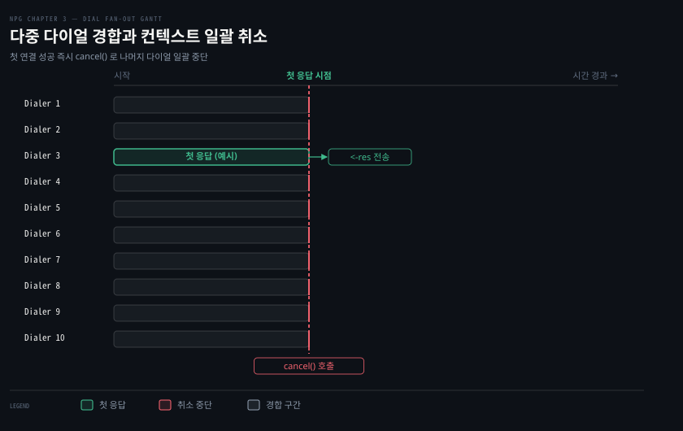
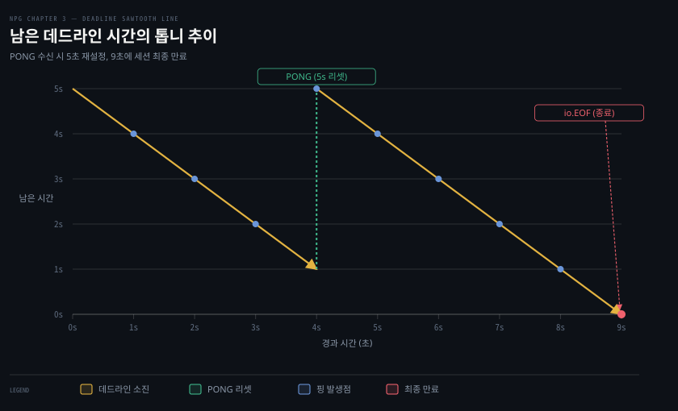

# 타임아웃은 Dialer·context 로, 유휴 감지는 데드라인과 하트비트로 건다

---

> 네트워크 프로그래밍에서는 이상적인 연결보다 장애와 침묵을 다루는 시간이 훨씬 깁니다. 운영체제 기본 타임아웃에 의존하면 수 분에서 수 시간 동안 스레드가 묶이므로, Go 개발자는 Dialer 와 context 로 연결 시도에 한도를 두고 데드라인과 하트비트로 유휴 연결의 침묵을 깨야 합니다.

## 핵심 요약

> 이 편이 매달린 하나의 생각은, 네트워크 연결은 기본적으로 무한정 침묵할 수 있으므로 애플리케이션이 능동적으로 시간 한도를 부여해야 예측 가능한 서비스를 유지할 수 있다는 점입니다.

Go 의 `net.Error` 는 단순 에러 인터페이스를 넘어 타임아웃 여부를 가려내는 창구를 제공합니다. 연결 수립 시점에는 OS 의 긴 대기 시간을 방치하지 않고 `net.Dialer` 의 타임아웃이나 `context.WithDeadline`·`WithCancel` 을 주입해 신속하게 제어권을 되찾습니다.

이미 수립된 연결은 기본 데드라인이 없어 케이블 단선 같은 침묵 장애를 감지하지 못합니다. `conn.SetDeadline` 으로 읽기·쓰기에 명시적 시한을 걸고, 유휴 구간에서는 주기적 하트비트 핑과 퐁을 교환해 살아있는 연결의 데드라인을 앞으로 밀어냅니다.


## 학습 목표

> 이 편을 읽고 나면 아래 다섯 가지를 스스로 해낼 수 있습니다.

1. 단순 `error` 와 `net.Error` 의 차이를 이해하고, `Timeout()`·`errors.Is`·`errors.As` 를 활용해 오류 유형과 타임아웃을 판별할 수 있습니다.
2. `DialTimeout`, `context.WithDeadline`, `context.WithCancel` 의 동작 방식과 적용 상황을 비교할 수 있습니다.
3. 단일 context 를 공유하여 여러 대의 서버로 다이얼을 동시에 쏘고 첫 응답 시 나머지를 일괄 취소하는 패턴을 구현할 수 있습니다.
4. `SetDeadline` 만료 시 발생하는 오류의 특징과, 만료된 연결 객체를 다시 살려내는 방법을 설명할 수 있습니다.
5. 하트비트 Pinger 가 유휴 연결의 데드라인을 능동적으로 갱신하여 조용한 단선을 잡아내는 원리를 설명할 수 있습니다.


## 1. 오류가 일시적인지부터 가른다

> 네트워크 함수가 반환하는 기본 `error` 인터페이스로는 재시도 가능한 일시적 문제인지 연결을 끊어야 할 치명적 결함인지 알 수 없으므로 `net.Error` 타입 단언을 활용합니다.

### net.Error 인터페이스의 확장 메서드

네트워크 통신에서 오류는 일상적으로 발생합니다. 하지만 모든 오류가 연결 해제를 요구하지는 않습니다. 순간적인 네트워크 지연이나 혼잡으로 타임아웃이 발생한 경우라면 잠시 대기 후 재시도하는 편이 합리적입니다.

표준 `net` 패키지의 함수와 메서드들은 일반 `error` 인터페이스를 반환하지만, 내부 구현체는 대개 `net.Error` 인터페이스를 만족합니다([pkg.go.dev/net#Error](https://pkg.go.dev/net#Error)).

```go
type Error interface {
	error
	Timeout() bool // 오류가 타임아웃에 의한 것인지 여부
}
```

여기서 'Listing' 은 책이 번호를 붙여 실은 코드 예제입니다. `Listing 3-4` 는 3장의 네 번째 예제를 뜻하며, 원문은 예제마다 제목과 파일 이름을 함께 제공합니다. 이 노트에서 '원문 Listing' 은 책에 실린 원본 코드 그대로를 가리키고 본문에 실린 코드는 핵심을 추린 발췌입니다.

Listing 3-4 처럼 타입 단언을 통해 `net.Error` 를 추출하면 에러의 성격을 세밀하게 검사할 수 있습니다. 일시적 오류는 경계가 모호해 `Temporary()` 는 비권장(Deprecated)되었으며, 지금은 `Timeout()` 으로 타임아웃 여부를 가릅니다([pkg.go.dev/net#Error](https://pkg.go.dev/net#Error)).

```go
if nErr, ok := err.(net.Error); ok && !nErr.Timeout() {
	return err // 타임아웃이 아닌 치명적 오류라면 즉시 반환
}
```

더 깊은 원인 분석이나 특정 오류 유형 판별에는 [`errors.Is`](https://pkg.go.dev/errors#Is) 와 [`errors.As`](https://pkg.go.dev/errors#As) 를 사용합니다. 구체 타입인 `*net.OpError` 로 단언하면 실패한 작업의 종류(read, write, dial), 네트워크 프로토콜, 출발지 및 목적지 주소 정보까지 추출할 수 있습니다.


## 2. 연결 시도에 시간 한도를 건다

> 운영체제의 기본 연결 타임아웃은 수 분에 달해 대화형 애플리케이션을 멈춰 세우므로, Dialer 의 타임아웃 설정이나 context 를 통해 연결 시도에 명확한 한도를 두어야 합니다.

### OS 기본 타임아웃의 위험과 DialTimeout

`net.Dial` 함수를 별도 설정 없이 호출하면 운영체제의 TCP 연결 재전송 정책에 전적으로 묶이게 됩니다. 리눅스 환경에서도 응답 없는 호스트에 연결할 때 커널 기본값에 따라 2분 이상 응답이 지연될 수 있습니다. 대화형 애플리케이션이나 마이크로서비스 환경에서 이러한 지연은 스레드 고갈과 연쇄 장애를 부릅니다.

가장 단순한 해법은 `net.DialTimeout` 을 사용하여 연결 시도마다 명시적인 제한 시간을 부여하는 것입니다.

```go
func DialTimeout(network, address string, timeout time.Duration) (net.Conn, error) {
	d := net.Dialer{
		Timeout: timeout, // (1) 연결 시도 한도 시간 지정
	}
	return d.Dial(network, address)
}
```

지정한 시간 내에 3-way 핸드셰이크가 끝나지 않으면 다이얼은 즉시 타임아웃 오류를 반환합니다. 호스트 이름이 여러 IP 주소로 해석될 때 Go 는 주소들을 동시에 경합시키지 않고 차례대로 시도합니다(`go doc net.Dialer` 출처).[^godoc-dialer] 전체 타임아웃이나 context 데드라인은 각 주소에 균등하게 분배됩니다. 예를 들어 호스트에 4개의 IP 주소가 있고 타임아웃이 1분이면 개별 주소마다 15초씩 연결 시간이 주어지며 실패할 때마다 다음 주소를 순차적으로 시도합니다. 이 순차 시도 동작은 [03-02 §2](./03-02.Go%20의%20TCP%20연결은%20Listen·Accept·Dial%20세%20호출로%20맺는다.md#dial-의-연결-수립과-주소-형식)의 설명과 일치합니다.

RFC 6555 Fast Fallback 규격에 따른 빠른 경합은 동일 계열 주소 사이가 아니라 IPv6 와 IPv4 주소 계열 사이에서만 벌어집니다. `net.Dialer` 는 IPv6 연결을 먼저 시도한 뒤 기본 300ms 인 `FallbackDelay` 동안 성공하지 못하면 비로소 IPv4 연결을 띄워 둘 중 먼저 성공한 쪽을 채택합니다.[^godoc-dialer]

### context 를 통한 현대적 타임아웃과 취소 제어

더 현대적이고 유연한 접근법은 Go 의 `context` 패키지를 `net.Dialer.DialContext` 와 함께 사용하는 것입니다. Listing 3-6 과 Listing 3-7 은 각각 데드라인 기반 취소와 수동 취소 방식을 보여줍니다.

`context.Context` 는 "이 작업을 언제 그만둘지"를 함수와 고루틴에 함께 넘기는 표준 값입니다.[^godoc-context] 그만둘 때가 되면 `ctx.Done()` 채널이 닫히고, `DialContext` 는 이 채널을 지켜보다 닫히는 즉시 연결 시도를 멈추고 에러로 돌아옵니다.

여기서는 다이얼에 필요한 만큼만 씁니다. context 를 왜 첫 매개변수로 넘기는지는 [Learning Go 14-01 §1](../../../01_language/book/lgo_learning-go/14-01.context%20는%20첫%20매개변수로%20넘기고%20값은%20내보내지%20않은%20키로%20담습니다.md)이 다룹니다. 취소 함수를 반드시 불러야 하는 이유와 `Done` 채널로 취소가 전해지는 방식은 [Learning Go 14-02 §1](../../../01_language/book/lgo_learning-go/14-02.취소할%20수%20있는%20context%20는%20cancel%20을%20꼭%20부르고%20Done%20채널로%20멈추며%20Cause%20로%20이유를%20남깁니다.md)이 다룹니다. `WithDeadline`·`WithTimeout` 의 차이, 자식 기한이 부모 기한을 넘지 못하는 규칙, `Err` 로 끝난 까닭을 가르는 법은 [Learning Go 14-03 §1](../../../01_language/book/lgo_learning-go/14-03.WithTimeout%20은%20요청%20시간을%20제한하고%20자식은%20부모%20기한을%20넘지%20못하며%20긴%20계산은%20스스로%20취소를%20확인합니다.md)에 있습니다.

| 함수 | 만드는 것 | `Done()` 이 닫히는 때 |
|---|---|---|
| `context.Background()` | 뿌리 context, 조건 없음 | 닫히지 않음 |
| `context.WithDeadline(부모, 시각)` | 자식 context + `cancel` | 지정 시각 도래, `cancel()` 호출, 부모 닫힘 중 가장 이른 때 |
| `context.WithCancel(부모)` | 자식 context + `cancel` | `cancel()` 호출 또는 부모 닫힘 |

아래 두 코드 모두 `defer cancel()` 을 둡니다. 데드라인이 먼저 와서 끝나더라도 `cancel` 을 불러야 context 가 잡은 자원이 풀립니다.

```go
// 데드라인 기반 자동 취소 (Listing 3-6 발췌)
ctx, cancel := context.WithDeadline(context.Background(), time.Now().Add(5*time.Second))
defer cancel() // 컨텍스트 자원 누수 방지

var d net.Dialer
conn, err := d.DialContext(ctx, "tcp", "10.0.0.0:80")
if err != nil {
	// 데드라인 만료 시 ctx.Err() 는 context.DeadlineExceeded 반환
}
```

```go
// 수동 취소 함수 호출을 통한 즉시 중단 (Listing 3-7 발췌)
ctx, cancel := context.WithCancel(context.Background())
// ... 비동기 고루틴에서 d.DialContext(ctx, ...) 실행 중 ...
cancel() // 사용자의 중단 요청이나 시그널 수신 시 즉시 호출
```

`context` 를 사용하면 시간 만료뿐 아니라 사용자 취소(Ctrl-C)나 부모 프로세스의 종료 시그널에 맞춰 진행 중인 소켓 연결 시도를 즉각 중단할 수 있습니다.


## 3. 하나의 context 로 여러 Dialer 를 한꺼번에 취소한다

> 여러 후보 서버 중 가장 먼저 응답한 서버와 연결을 맺고 뒤처진 나머지 다이얼 시도들을 즉시 중단할 때 단일 context 의 팬아웃과 취소가 강력한 위력을 발휘합니다.

### 팬아웃 다이얼과 경쟁 패턴

여러 미러 서버나 복제 노드 중 가장 빠른 노드에서 데이터를 가져와야 하는 경우가 있습니다. Listing 3-8 은 동일한 `context.Context` 객체를 10개의 고루틴 다이얼러에 전달하여 경합을 붙이는 구조를 보여줍니다.

```go
ctx, cancel := context.WithDeadline(context.Background(), time.Now().Add(10*time.Second))
// ... 리스너 준비 ...

dial := func(ctx context.Context, address string, response chan int, id int, wg *sync.WaitGroup) {
	defer wg.Done()
	var d net.Dialer
	c, err := d.DialContext(ctx, "tcp", address)
	if err != nil {
		return // (1) 취소되거나 실패한 다이얼러는 즉시 반환
	}
	c.Close() // (2) 연결 성공 시 소켓 누수 방지를 위해 즉시 닫음
	select {
	case <-ctx.Done():   // (3) 다른 다이얼러가 먼저 성공했을 때 탈출구
	case response <- id: // (4) 가장 먼저 연결된 경우 메인에 ID 전달
	}
}

res := make(chan int)
var wg sync.WaitGroup
for i := 0; i < 10; i++ {
	wg.Add(1)
	// (5) 10개의 다이얼러에 동일한 ctx 주입
	go dial(ctx, listener.Addr().String(), res, i+1, &wg);
}

response := <-res // (6) 가장 먼저 성공한 첫 번째 응답 수신
cancel()          // (7) 나머지 9개 다이얼러 일괄 취소
wg.Wait()         // (8) 모든 고루틴 정상 종료 대기
```

여기서 `select` 구문은 메인이 아니라 각 **다이얼러 고루틴** 쪽에 있습니다. 이 `select` 가 왜 반드시 필요한지는 채널 동작과 고루틴 동기화 원리를 따라가면 분명해집니다.

1. 응답 채널 `res` 는 버퍼가 없는(unbuffered) 채널이므로 보내는 쪽은 받는 쪽이 받아줄 때까지 멈춥니다.
2. 메인 고루틴은 `<-res` 로 가장 먼저 도착한 단 하나의 ID 만 수신합니다. 연결에 성공한 다이얼러가 여럿이어도 첫째만 번호를 넘기고 나머지는 채널 송신 대기에서 멈춥니다.
3. 다이얼러 고루틴 안의 `select` 에 있는 `<-ctx.Done()` 갈래가 그 멈춘 다이얼러들을 `cancel()` 호출 뒤에 풀어줍니다.
4. 만약 이 갈래가 없다면 뒤처진 다이얼러들은 채널 송신에서 빠져나오지 못해 `defer wg.Done()` 을 실행하지 못하고, 메인의 `wg.Wait()` 역시 영원히 풀리지 않습니다.



### 취소 시그널 전파와 패배한 다이얼러의 동작

원문 Listing 3-8 의 `dial` 함수와 테스트 본문은 다음 단계로 다이얼러 고루틴들을 정리합니다.

1. 메인 고루틴이 `response := <-res` 로 가장 먼저 성공한 다이얼러의 번호를 받는 즉시 `cancel()` 을 호출합니다.
2. `cancel()` 이 실행되면 해당 context 의 `Done()` 채널이 즉시 닫힙니다.
3. 패배한 다이얼러 고루틴은 실행 시점에 따라 두 갈래로 종료됩니다(Listing 3-8).
   - **연결 진행 중이던 다이얼러**: `d.DialContext()` 에서 취소 오류를 돌려받고 즉시 함수를 빠져나옵니다(`return`).
   - **이미 연결에 성공한 다이얼러**: 스스로 `c.Close()` 를 호출해 소켓을 닫은 뒤 select 문에서 응답 채널 수신자가 없으므로 닫힌 `<-ctx.Done()` 분기를 타고 빠져나옵니다.
4. 모든 다이얼러가 `defer wg.Done()` 을 마치고 `wg.Wait()` 가 풀린 뒤 컨텍스트가 정상 취소되었는지(`if ctx.Err() != context.Canceled`) 확인하는 주체는 다이얼러 고루틴이 아니라 메인 테스트 본문입니다.

컨텍스트 취소 자체가 이미 맺어진 네트워크 연결을 대신 닫아주지는 않습니다. 따라서 Listing 3-8 처럼 다이얼에 성공한 각 고루틴이 직접 `c.Close()` 를 책임지고 호출해야 승자 결정 후 불필요하게 맺어진 소켓의 누수를 막을 수 있습니다.


## 4. 데드라인은 아무 일도 없는 연결을 끊는다

> Go 의 TCP 연결은 기본 데드라인이 없어 조용히 끊긴 연결을 영원히 감지하지 못하므로, SetDeadline 으로 읽기·쓰기 시한을 걸고 필요에 따라 시한을 앞으로 갱신해야 합니다.

### 세 가지 데드라인 메서드

`net.Conn` 인터페이스는 연결에 시간제한을 걸 수 있는 세 가지 메서드를 제공합니다.

- `SetDeadline(t time.Time)`: 읽기와 쓰기 모두에 절대 시각 `t` 를 마감 시간으로 지정합니다.
- `SetReadDeadline(t time.Time)`: `conn.Read()` 호출에만 마감 시간을 적용합니다.
- `SetWriteDeadline(t time.Time)`: `conn.Write()` 호출에만 마감 시간을 적용합니다.

데드라인의 인자는 지속 시간(duration)이 아니라 미래의 특정 시각(`time.Time`)입니다. 만약 데드라인을 해제하고 싶다면 제로 값인 `time.Time{}` 을 넘깁니다.

### 무기한 블로킹과 os.ErrDeadlineExceeded

Go 의 네트워크 연결은 기본적으로 데드라인이 설정되어 있지 않습니다. 상대방 노드의 전원이 꺼지거나 물리적 회선이 끊어졌을 때, 소켓에 아무 데이터도 보내지 않으면 TCP 는 연결이 끊어졌는지 알 길이 없습니다. 이로 인해 `Read()` 호출이 영원히 멈추고 고루틴과 메모리가 누수됩니다. 이 치명적인 유휴 버그의 관측 실습은 [gonet-lab 01-01 조용한 연결이 서버를 멈춘다 - goroutine·FD·idle timeout](../../project/gonet-lab/01-01.조용한%20연결이%20서버를%20멈춘다%20-%20goroutine·FD·idle%20timeout.md)을 참고할 수 있습니다.

Listing 3-9 처럼 데드라인을 걸어두면 시한이 지났을 때 블로킹되어 있던 `Read` 가 즉시 타임아웃 오류를 반환합니다.

```go
conn.SetDeadline(time.Now().Add(5 * time.Second))
buf := make([]byte, 1)
_, err := conn.Read(buf)
if nErr, ok := err.(net.Error); ok && nErr.Timeout() {
	// 데드라인 초과로 인한 타임아웃 감지
}
```

표준 라이브러리가 제공하는 [`os.ErrDeadlineExceeded`](https://pkg.go.dev/os#ErrDeadlineExceeded) 를 사용하면 타입 단언 대신 `errors.Is` 로 데드라인 만료 여부를 직접 판별할 수 있습니다.

```go
if errors.Is(err, os.ErrDeadlineExceeded) {
	// 데드라인 만료 판정
}
```

### 데드라인이 지난 연결을 다시 살리는 방법

많은 개발자가 오해하는 부분은 데드라인이 지나면 소켓이 완전히 파괴된다고 생각하는 점입니다. 데드라인 만료는 소켓을 닫지 않습니다. 데드라인 시각을 다시 미래로 밀어주면 동일한 연결 객체로 후속 `Read` 나 `Write` 를 정상적으로 계속 수행할 수 있습니다.[^godoc-conn]

```go
// 1차 데드라인 만료 후 시한을 5초 뒤로 다시 연장
err = conn.SetDeadline(time.Now().Add(5 * time.Second))
_, err = conn.Read(buf) // 연장된 시한 내에 새 데이터가 오면 정상 수신 성공
```

하지만 여기서 흔히 빠지는 함정이 있습니다. `go doc net.Conn` 에 따르면 데드라인은 이후의 모든 I/O 작업에 적용되는 절대 시각입니다.[^godoc-conn] 시각을 미래로 다시 밀기 전까지는 그 뒤의 `Read` 나 `Write` 도 대기하지 않고 즉시 동일한 타임아웃 오류로 돌아옵니다.

만약 타임아웃 오류를 수신한 뒤 데드라인을 갱신하지 않고 루프를 다시 돌면 연결을 다시 기다리는 것이 아니라 오류를 즉시 계속 뱉어내며 CPU 를 낭비하는 바쁜 루프(busy loop)에 빠지게 됩니다.

따라서 읽기 루프에서는 매 `Read` 호출 직전에 데드라인을 미래 시점으로 연장하는 패턴이 정답입니다. 실제로 `~/study/gonet-lab/internal/tcp/server.go` 의 `handleEcho` 함수도 읽기 호출 직전마다 다음과 같이 데드라인을 뒤로 미루며 유휴 시간을 측정합니다.

```go
// gonet-lab internal/tcp/server.go handleEcho 발췌
conn.SetReadDeadline(time.Now().Add(idle))
r, err := conn.Read(buf)
```


## 5. 하트비트로 데드라인을 앞으로 민다

> 유휴 상태가 길어질 수 있는 장기 연결에서는 정기적인 핑으로 상대 응답을 유도하고, 데이터를 받을 때마다 데드라인을 앞으로 밀어 유령 연결을 방지합니다.

### Pinger 고루틴의 타이머 리셋 메커니즘

장시간 유지되어야 하는 연결에서 무작정 긴 데드라인을 설정하면 단선 감지가 늦어지고, 너무 짧게 설정하면 정상적인 유휴 연결이 끊어집니다. 이를 해결하는 방법이 하트비트(Heartbeat)입니다.

Listing 3-10 은 주기적으로 핑 메시지를 쏘아 올리는 `Pinger` 함수를 구현합니다.

```go
func Pinger(ctx context.Context, w io.Writer, reset <-chan time.Duration) {
	var interval time.Duration
	// ... 초기 주기 수신 (기본값 30초) ...
	timer := time.NewTimer(interval)
	defer func() {
		if !timer.Stop() {
			<-timer.C
		}
	}()

	for {
		select {
		case <-ctx.Done():
			return // 컨텍스트 종료 시 누수 방지
		case newInterval := <-reset:
			if !timer.Stop() {
				<-timer.C
			}
			if newInterval > 0 {
				interval = newInterval
			}
		case <-timer.C:
			if _, err := w.Write([]byte("ping")); err != nil {
				return // 전송 실패 시 종료
			}
		}
		_ = timer.Reset(interval) // 다음 주기로 타이머 재설정
	}
}
```

`Pinger` 는 상대방으로부터 정상적인 비즈니스 데이터를 수신했을 때 `reset` 채널에 0 값을 전달받아 타이머를 즉시 리셋합니다. 방금 데이터를 받았으므로 불필요한 핑을 보내 네트워크 대역폭을 낭비하지 않는 합리적인 설계입니다.

여기서 `Pinger` 와 데드라인은 역할과 대상이 완전히 다릅니다. 원문 Listing 3-12 에서 `Pinger` 는 데드라인을 건드리지 않으며, 데드라인을 미는 주체는 서버의 **읽기 루프**입니다.

| 장치 | 하는 일 | 누구를 위한 것인가 |
|---|---|---|
| `Pinger` | 주기적으로 상대에게 핑을 보냄. 데이터를 받으면 핑 타이머를 처음부터 다시 시작 | 상대 쪽 (상대가 이 연결이 살아 있음을 알게 함) |
| 읽기 루프의 `SetDeadline(+5초)` | 무언가를 받을 때마다 데드라인을 연장. 5초간 아무것도 안 오면 `Read` 에러로 연결을 닫음 | 내 쪽 (상대가 죽었는지 감지) |

내가 보내는 핑은 상대 생존의 증거가 되지 못합니다. 상대 호스트의 전원이 꺼져 있어도 `conn.Write` 는 송신 버퍼에 들어가는 순간 성공을 반환합니다. 커널 TCP 스택이 재전송을 포기해 에러를 낼 때까지는 리눅스 `tcp_retries2` 기본값(15회) 기준 약 13~30분(대략 15분대 이상)이 걸립니다.[^kernel-tcp-retries]

따라서 생존의 유일한 증거는 오직 "상대에게서 무언가가 왔다"뿐이며 그것을 시간 한도로 재는 장치가 데드라인입니다. 원문 Listing 3-12 테스트에서도 클라이언트는 `Pinger` 없이 4초 시점에 PONG 한 번만 보내 데드라인이 5초에서 9초로 밀렸다가 9초에 끊긴다는 점이 이 역할 분담을 분명히 보여줍니다.

### Listing 3-12 의 실제 측정값으로 보는 데드라인 연장

원문 Listing 3-12 는 핑과 퐁을 주고받으며 서버의 데드라인이 실제로 어떻게 연장되는지를 시간대별 측정값으로 증명합니다.



1. **0초**: 서버는 연결을 수락하고 `Pinger` 를 1초 주기로 가동하며, 초기 데드라인을 **5초**로 설정합니다.
2. **1~4초**: 클라이언트는 1초마다 전송되는 서버의 핑 메시지 4개를 연달아 수신합니다.
3. **4초 시점**: 클라이언트가 서버로 `"PONG!!!"` 응답을 전송합니다.
4. **데드라인 전진**: 서버는 `"PONG!!!"` 데이터를 읽어 들여 선로가 정상임을 확인합니다. `resetTimer <- 0` 으로 핑 타이머를 초기화한 뒤 `conn.SetDeadline` 으로 데드라인을 **9초** 시점으로 5초 더 연장합니다.
5. **5~8초**: 클라이언트는 다시 1초마다 들어오는 핑 4개를 추가로 수신합니다.
6. **9초 시점**: 클라이언트가 더 이상 응답을 보내지 않자 연장되었던 서버의 9초 데드라인이 최종 만료됩니다. 서버의 `Read` 가 타임아웃 에러를 내며 소켓을 닫고, 클라이언트는 `io.EOF` 를 수신하며 테스트가 종료됩니다.

원문은 테스트 종료 시각이 정확히 9초(`end == 9*time.Second`)임을 단언문으로 검증합니다.

### 양쪽 모두 Pinger 를 사용할 때와 Keepalive 비교

만약 양쪽 노드가 모두 `Pinger` 를 실행한다면, 서로가 쏘아 보낸 핑 자체가 상대방의 읽기를 깨우고 타이머를 리셋시키므로 양방향 모두에서 데드라인이 끊임없이 전진하며 영구적인 활성 세션이 유지됩니다.

이러한 애플리케이션 레벨의 하트비트는 방화벽이 TCP keepalive 패킷을 차단하거나 유휴 연결을 강제로 끊어버리는 망 환경에서도 강력하게 동작합니다. 커널 수준의 TCP keepalive 설정과 소켓 옵션 튜닝은 04-03 편에서 자세히 다룹니다.


## 결정 치트시트

> 연결 시도에 타임아웃을 걸 때 어떤 방식을 선택해야 할지 기준을 정리합니다.

| 방식 | 제어 수단 | 주요 특징 | 권장 사용 상황 |
|---|---|---|---|
| `net.DialTimeout` | `time.Duration` | 가장 직관적이고 단순한 연결 시한 지정 | 단순 클라이언트 스크립트, 단일 원격지 연결 |
| `context.WithDeadline` | `time.Time` 절대 시각 | 고정된 시각 한도 내 자동 취소 및 `net.Dialer` 연동 | 요청-응답 전체에 글로벌 SLA 시한이 걸린 API 서버 |
| `context.WithCancel` | `cancel()` 수동 호출 | 외부 이벤트(Ctrl-C, 고루틴 경쟁, 셧다운)에 즉각 반응 | 사용자 중단 지원, 다중 서버 팬아웃 경합 패턴 |


## 면접 대비

> 아래 질문에 답하면서 Go 네트워크 프로그래밍에서 시간 제어와 장애 복구 전략을 설명해 보세요.

1. Go 의 `net.Error` 에서 타임아웃 여부를 확인하고 구체적인 오류 원인을 판별하는 현대적 방법은 무엇인가요?
2. `net.Dial` 호출 시 OS 기본 타임아웃에 맡기면 어떤 위험이 발생하며, `DialTimeout` 과 `DialContext` 는 이를 어떻게 해결하나요?
3. 단일 context 를 공유하여 여러 대의 서버에 동시에 다이얼을 쏘는 팬아웃 패턴에서, 첫 연결 성공 시 나머지 다이얼을 취소해야 하는 이유와 처리 방식을 설명해 주세요.
4. `conn.SetDeadline` 이 만료되었을 때 소켓 연결은 완전히 파기되나요? 만약 아니라면 해당 연결을 어떻게 다시 살릴 수 있나요?
5. 애플리케이션 레벨의 하트비트가 커널 레벨의 TCP keepalive 에 비해 갖는 구조적 장점은 무엇인가요?


## 정답 (자답 후 펼치기)

> 위 §면접 대비의 질문에 먼저 스스로 답한 뒤 읽으세요.

### 정답 1 — Timeout 확인과 errors.Is·errors.As 를 통한 오류 판별

일시적 오류는 경계가 모호하여 공식 문서([pkg.go.dev/net#Error](https://pkg.go.dev/net#Error))에서도 권장하듯 지금은 `net.Error` 의 `Timeout()` 메서드로 타임아웃 여부를 명확히 판별합니다. 더 세부적인 오류 원인은 `errors.Is(err, os.ErrDeadlineExceeded)` 나 `errors.As` 를 통해 구체적 에러 타입(`*net.OpError`)을 검사하여 재시도 여부를 결정합니다.

### 정답 2 — 커널 타임아웃 지연과 SLA 보장

OS 기본 TCP 재전송 타이머는 응답 없는 호스트에 대해 2분 이상 블로킹을 유발하여 고루틴과 스레드 풀을 잠식합니다. `DialTimeout` 은 단순 지속 시간 한도를 부여해 지연을 방지하며, `DialContext` 는 데드라인과 취소 제어권을 애플리케이션 수명주기와 연동하여 신속히 통제권을 회수합니다.

### 정답 3 — 자원 낭비 차단과 컨텍스트 전파

가장 빠른 미러 서버 하나만 필요한 상황에서 나머지 다이얼을 방치하면 불필요한 핸드셰이크와 소켓 FD 낭비가 발생합니다. 승자가 결정된 즉시 메인 고루틴이 `cancel()` 을 호출하면, 동일 context 를 공유하는 대기 중인 모든 다이얼러의 `d.DialContext` 가 즉각 취소 에러를 내며 안전하게 고루틴을 정리합니다.

### 정답 4 — 소켓 보존과 데드라인 재설정

데드라인 만료는 소켓을 닫지 않고 해당 작업의 블로킹을 타임아웃 에러로 풀 뿐입니다. 소켓 자체는 여전히 살아 있으므로, `conn.SetDeadline(time.Now().Add(새_시한))` 을 호출하여 마감 시간을 미래로 다시 연장하면 후속 `Read` 나 `Write` 작업을 정상적으로 재개할 수 있습니다.

### 정답 5 — 애플리케이션 응답성 검증과 방화벽 우회

커널의 TCP keepalive 는 상대방 운영체제 스택의 생존만 확인할 뿐 애플리케이션 프로세스가 교착 상태에 빠졌는지는 감지하지 못합니다. 반면 하트비트는 애플리케이션 계층에서 메시지를 직접 처리하므로 프로세스의 실제 응답성을 검증하며, keepalive 패킷을 차단하는 중간 방화벽 환경에서도 안정적으로 동작합니다.


## 참고 자료

- 《Network Programming with Go》 Adam Woodbeck, 2021. ISBN 978-1-7185-0088-4. Chapter 3 Reliable TCP Data Streams (p.13–33, Listing 3-4~3-12).
- [Go net.Error 공식 명세](https://pkg.go.dev/net#Error): `Timeout` 및 `Temporary` 폐기 안내.
- [Go os.ErrDeadlineExceeded 공식 명세](https://pkg.go.dev/os#ErrDeadlineExceeded): Go 1.15+ 데드라인 만료 표준 에러.


## 관련 문서

- [03-01 TCP 세션은 핸드셰이크로 열고 창으로 속도를 맞추고 FIN·RST 로 끝난다](./03-01.TCP%20세션은%20핸드셰이크로%20열고%20창으로%20속도를%20맞추고%20FIN·RST%20로%20끝난다.md): TCP 신뢰성의 기초가 되는 패킷 제어 원리를 다룹니다.
- [03-02 Go 의 TCP 연결은 Listen·Accept·Dial 세 호출로 맺는다](./03-02.Go%20의%20TCP%20연결은%20Listen·Accept·Dial%20세%20호출로%20맺는다.md): Go 표준 소켓 생성과 다이얼의 기본 흐름을 다룹니다.
- [gonet-lab 01-01 조용한 연결이 서버를 멈춘다 - goroutine·FD·idle timeout](../../project/gonet-lab/01-01.조용한%20연결이%20서버를%20멈춘다%20-%20goroutine·FD·idle%20timeout.md): 데드라인이 없는 유휴 소켓이 유발하는 고루틴 누수를 실측합니다.
- [04-03 TCPConn 손잡이와 흔한 버그 — keepalive·linger·버퍼·zero window·CLOSE_WAIT](./04-03.TCPConn%20손잡이와%20흔한%20버그%20—%20keepalive·linger·버퍼·zero%20window·CLOSE_WAIT.md): 커널 keepalive 와 소켓 버퍼 튜닝의 실전 버그를 파헤칩니다.
- [이 책의 정독 인덱스](./README.md): NPG 3장의 전반적인 학습 구성과 진행 로드맵.

[^godoc-dialer]: Go 표준 라이브러리 net.Dialer 공식 문서. <https://pkg.go.dev/net#Dialer>
[^godoc-conn]: Go 표준 라이브러리 net.Conn 공식 문서. <https://pkg.go.dev/net#Conn>
[^godoc-context]: Go 표준 라이브러리 context 공식 문서. <https://pkg.go.dev/context>
[^kernel-tcp-retries]: Linux Kernel Documentation — IP Sysctl tcp_retries2. <https://docs.kernel.org/networking/ip-sysctl.html>
